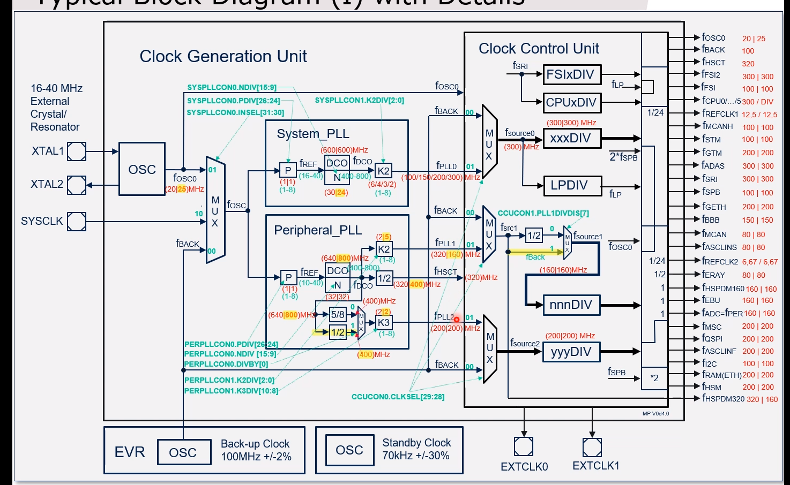

草稿笔记

<!-- more -->

***

### 内核架构
#### Startup Software
复位后，PC寄存器的值被设置为BootROM中存储的SSW 起始地址，startup software（这里指firmware boot）是第一个执行的软件。

在启动期间，SSW 在cpu0上执行，其它核为 halt状态，随后由用户代码启动。
- SSW软件在BootROM中，上电复位后，PC寄存器中的复位值就是SSW的入口地址。
- SSW的最后一条指令会执行跳转到用户代码。用户代码的入口地址可以配置（BMHD）。
  
startup software 会根据以下条件初始化设备：
- 之前存在特定地址的信息
- 特定寄存器的某些特定位的当前状态
- 导致复位事件的原因
- 外部引脚的状态
  

#### sri（System Resource Interconnect）总线仲裁

sri总线上有多个master和多个slave，可能存在多个master同时访问某个slave，因此需要对master的请求进行仲裁。

仲裁机制中存在两种优先级，高优先级和低优先级，每个master可以加入其中一个。

每类优先级内部都是轮训仲裁，而高优先级组的请求会优于低优先级组的请求先执行。
为了避免低优先级组中的请求得不到响应，存在一个可配置HPRS（high priority round share）参数，该参数指定了最多经过HPRS次的高优先级组调度后，需要执行一次低优先级组中的请求（低优先级组中选出那个优先级最高的）。

#### 核心寄存器
通用寄存器
- D0-D15 数据寄存器，A0-A15 地址寄存器。 分开可以使得数据运算和地址运算并行
- A10 同时也为栈指针寄存器
- A11 同时也为返回地址寄存器
- D15寄存器，在发生trap时会保存TIN

系统寄存器：
- PC
- PSW：程序状态寄存器
- SYSCON 系统控制寄存器
- PCXI：previous context infomation，保存了前一个任务的CSA地址

上下文管理寄存器：
- FCX：free csa list head pointer，未使用的CSA都保存在链表结构中，FCX指向这个链表。
- LCX：free csa list limit pointer，指向最后一个空闲csa，用来识别csa即将耗尽。

`CSA——context save area：用来保存上下文信息，程序执行过程中发生interrupt、trap、function call时，需要保存上下文信息`

CPU中断和 trap 控制寄存器：
- ICR：中断控制寄存器，指示已悬起的中断优先级数值，以及当前处理的中断优先级数值。
- BIV：中断向量表基地址
- BTV：trap向量表基地址

栈管理寄存器：
- ISP：interrupt stack pointer，当被中断打断的任务使用的是私有栈（PSW.IS=0）时，保存的upper context是被打断任务的，并且，A[10](sp)加载 ISP 中的值作为新栈；当被中断打断的任务使用的是中断栈（PSW.IS=1）时，A[10](sp)也不需要加载 ISP 值，中断服务程序继续使用当前栈。

**读/写核心寄存器需要特殊指令**：
MTCR：move to core register
MFCR：move from core register

#### contex management 
arm内核的上下文切换都是存在栈中的。
tircore 存在一个 CSA，当发生 interrupt/trap/function call时，硬件自动保存upper context。如果后续操作需要使用更多寄存器，需要执行SVLCX（save lower context）来保存lower context
**upper context**:A10-A15，PSW，PCXI，D8-D15
**lower context**:A2-A7，A11，PCXI，D0-D7

- 每个 csa 为16个字大小，可以存储一个upper context 或 一个lower context
- 每个 csa 都是16字对齐的
- 多个csa 以链表的形式维护
- 未使用的 csa 保存在 free context list中
- 当前执行任务的csa保存在 previous context list中
- 硬件处理 csa 的分配和释放

CSA的存储区域可通过软件配置：DSPR，DLMU

#### Interrupt system
每个 interrupt service provider（CPU，DMA）有独立的中断系统，255级中断优先级。

**service requests**: interrupt requests
**SRN**：service request node
 - 每个中断请求源必须连接到一个SRN
 - 每个外设中断必须连接到一个专用SRN
 - 每个SRN 可编程优先级，255 level
 - 每个SRN 有一个SRC(service request control register)，用来配置优先级、TOS等。

**ICU**：interrupt control unit
- 处理优先级仲裁，以及CPU/DMA间的通信。（每个CPU都有一个icu）
  
TC1.6.2架构：
- 最多支持1024个service requests
- 每个ICU/service provider 最多支持255个优先级
- 支持最多8个 ICUs/service providers
- 低延迟仲裁：从收到service request到仲裁并发给service provider只要3、4个时钟周期。
- 每个CPU有8个 GPSR（general purpose service requests）可以作为软中断。（实际作用的还是SRN，只是部分SRN分配给GPSR了，可以用来作为内核间通信使用）
- service request broadcast registers(SRB)可以向多个service provider同时发出GPSR
- 8个SRN用来处理外部中断。
- 当TOS=DMA时，SRN中的优先级即为DMA的通道，并且多个DMA请求发生时，DMA通道值最大的获得服务。

**进入中断服务**：
 - 保存upper context
 - 将PC值保存到 A11（return address）
 - ICR.IE = 0，屏蔽全部中断
 - 如果PSW.IS=0，A10更新为ISP的值
 - PSW.IO = 10B，设置为特权模式
 - ICR.CCPN（current cpu priority number）保存到 PCXI.PCPN（previous cpu priority number）中
 - ICR.PIPN（pending interrupt priority number）保存到 ICR.CCPN（current cpu priority number）

**退出中断服务**：
- 恢复被打断任务（中断服务）的 upper context
-  PCXI.PCPN写回ICR.CCPN，以恢复被中断前的cpu优先级
-  PCXI.PIE写回ICR.IE，恢复之前中断屏蔽状态
-  PC = A[11]，继续执行

#### Trap system
程序异常时发生：
 - 非法访问
 - Non maskable interrupts
 - 对保护地址的违法访问
 - 等等

trap system总是处于活动状态，无法关闭。
当trap发生时，有两个相关的识别码
- trap class number (TCN)
- trap identification number (TIN)——trap发生时，硬件会自动将该值放在D15中
  
trap发生时，类似中断，也是会中断当前执行流程，并根据trap类型跳转到Trap Vector Table中的相应位置。

**Synchronous**：同步trap与执行或尝试执行特定指令有关，引起trap的指令时已知的，trap会被立即响应。
trap发生时，导致trap发生的指令的会被保存在A11中。但对于SYS trap，SYSCALL 指令的下一条指令会被保存到A11。

**Asynchronous**：异步trap与外部检测到的硬件条件相关联，并向核心发送信号。有些结果是由先前执行的指令间接产生的，当trap发生时，已经不是之前的现场了。

**Trap进入流程**：几个需要注意的操作
- upper context被保存
- 返回地址A11 被更新
- IO 特权模式更新为特权级
- 屏蔽全局中断（ICR.IE=0）
- D15 被更新为 TIN
- 根据 BTV 和 TCN 找trap的第一条执行指令
  
#### TirCore Protection System

保护系统基于 trap机制，permission levels和memory protection，以实现：
 - 保护核心OS功能
 - 保护应用间不会相互干扰
 - 提供测试和调试功能

permission levels:
 - user-0:不允许访问外设寄存器（Segment 14、15）,不允许执行特权级指令，不允许enable/disable 中断系统
 - user-1:不允许执行特权级指令
 - supervisor：全部权限

memory protection：
 - 18个 data 区域
 - 10个 code 区域
 - 6 个 memory protection register sets
  

#### Temporal protection system problem
在一个实时系统中，每个任务被赋予确定的内存资源和允许时间资源。如果任务运行超过时间限制，或者使用内存资源超出限制都会导致应用整体上的失败。
memory protection可以防止任务使用的内存资源超限。

temporal protection system可以用来防止任务使用的时间资源超限。
- 3个独立、递减的32Bit 计数器
  - 计数器被写入非0值时激活
  - 计数器被写入0，会停止
  - 计数器减到0时，会产生TAE trap
- exception timer system
  - 用来检测exception handler 的超时 

### Reset
Monitoring and Reset Pins 图：AURIX TC3xx Family User's Manual Part 1 :840页

PORST：双向引脚
- 上电过程中为MCU的输出引脚
- 上电完成后为MCU的输入引脚

下面解释引自：https://icv.51cto.com/posts/1883
`刚上电的时候，MCU的电压是从0往上升的，所以刚开始的时候MCU处于一个under voltage的状态，MCU主要监控VEXT, VDDP3, VDD三个输入电源，在刚开始的时候只要这三个电源有一个处于under voltage状态，或门（OR）就会输出点平导通MOS管，PORST就会被拉低到地。所以在电源上升的过程中这三个电源有一个处于LBD Reset Hold（电源监控阈值）以下，MOS管就会被导通，PORST就会被一直拉低到地（输出状态，输出低电平）。
电压起来后（大于监控阈值），MOS管关断，PORST变为输入状态，如果PORST外接了一个IC或者复位按钮给了一个低电平，也会对MCU产生Reset（Warm Power On Reset）`

ESR0 默认为复位输出引脚（受输出状态的PORST的影响），可重新配置输入、输出
ESR1 默认为 NMI 引脚，可重新配置输入、输出

从上到下，MCU内部reset的模块逐渐减少，具体见606页
- cold reset：没电的状态下，上电复位即cold reset， 
- warm reset：系统已经供上电稳定后，通过PORST引脚触发reset
- system reset、application reset：sw reset，smu触发reset，ESR0也可配置产生

**RSTSTAT**：复位原因指示寄存器，一些复位触发源见604
- 其中，cold power-on reset状态指示（STBYR、SWD、EVR33、EVRC）需要通过软件对RSTCON2.CLRC主动清除，否则状态会一直保留（即使后续复位了也会存在）。
- 其它复位状态指示位，在下一次reset时会被清掉。
  
PS：例如，上电后，主动清除cold reset标记，然后软件触发复位，应该只有 SW 的复位标记。

### clock

时钟源：
 - 外部晶振
 - 外部时钟输入
 - 内部 back-up clock(100M, +-2%)，standby clock(70KHZ，休眠时用的)

使用样例：

 图片来自infineon 

外部时钟输出：EXTCLK0、EXTCLK1，可将内部时钟源通过这两个引脚输出，可以用来做时钟频率验证，或当时输出时钟给其它模块用。

oscillator watchdog：硬件电路监控F_osc经过分频后是否在某个误差内

PLL配置原则：
刚上电时，系统使用的是back-up时钟，为100M。
因此system PLL在配置时，需要先配置为输出100M，然后系统时钟切换为PLL后，再逐步调整到目标频率（如100->150->200->300）,避免频率变化过大，电流波动太大影响系统稳定性。
PS：peripheral PLL 可以一步到位直接配置倍频到目标频率

### watchdog timers
- 一个safety watchdog timer，系统级别监控
- 每个cpu 还有一个 watchdog timer
  
watchdog超时后，不会直接操作系统复位。而是将信号给SMU处理，SMU触发recovery timer。见1305页

watchdog timer模块有两个功能：
- EndInit 保护：保护关键寄存器被意外改写
- watchdog timer: 16bit 定时器

**EndInit**
一种写保护措施，只允许在特定条件下进行写操作，以防止一些关键寄存器数据被意外改写。

保护类型：
- CEy：cpu关键寄存器保护，当CPUy的 WDT ENDINIT=0时，保护解除，受保护寄存器才可写。
- E：系统关键寄存器保护，任何CPU的WDT ENDINIT=0时，或者EICON0.ENDINIT=0时解除保护。
- SE：safety关键寄存器保护，safety WDT ENDINIT=0或EICON0.ENDINIT=0 时，保护解除。
  
**ENDINIT=0 操作需要一定时间，因此设置后需要回读，直到配置生效，才能访问被保护的寄存器。并且，当软件清除ENDINIT位时，WDT会自动切换为timeout模式，来监控ENDINIT位的修改，如果在超时前ENDINIT没有被重新置位，则产生看门狗故障响应**

### startup and initialisation

启动过程包括：
- 对MCU上电过程（电源电压上升）
- 执行boot firmware，进行基本硬件准备工作（flash ramp-up，ram init, BMI验证，HSM初始化）
- 应用启动部分代码（APP start-up software）进一步初始化应用需要的相关硬件和软件（可选的BIST，栈和csa初始化，PLL和相关硬件驱动初始化，c执行环境初始化）
- 执行应用代码

**cold power-on reset**:之前未供电的情况下，上电复位。
复位后状态：
- 所有寄存器复位为初始状态
- flash 未激活状态，不能进行任何操作
- ram内容未定义
- 时钟系统复位为初始状态

**system reset**：对 Boot firmware来说，warm power-on复位执行流程和system reset是一致的。
触发源：如 看门狗定时器触发复位，PORST引脚复位，软件复位。
复位后状态：
- 受该复位类型影响的寄存器置为初始状态
- flash未激活状态
- ram 内容和system reset前一致
- 时钟系统复位为初始态

**applacation reset**：可由内部、外部硬件，或者软件触发。具体由软件配置。
复位后状态：
- 受该复位类型影响的寄存器置为初始状态
- flash可读
- ram和时钟系统不受该复位事件影响

**CPU module reset**:单个CPU核心复位。

**start-up过程中的时钟系统**：
- power-on 和 system reset情况下，时钟系统复位：
  - fSRI= fCPU0 = fFSI=fBACK=100MHz 
  - fSPB=fSTM=fBACK/2=50MHz nominal
  - PLL and VCO are in power-down mode
- application reset 情况下，时钟系统保持之前状态不变。

#### Boot Firmware
Boot Firmware位于BOOT ROM，是CPU 启动后第一个执行的代码。由CPU0 执行，其它核在引导阶段均为halt状态，直到它们被显示启动。

在上电复位/PORST引脚产生复位信号/system reset/application reset 发生后，都会进入Boot Firmware运行。基于复位类型和用户配置，Boot Firmware会执行不同的启动序列。

**Boot Firmware**涉及的工作：
- start flash ramp-up：启动flash，使其进入工作状态。
- Ram initialization：对选定 Ram 区域填充0，自动初始化ECC值。
  - 具体初始化行为（什么复位需要初始化RAM，初始化哪些区域），由PROCONRAM寄存器中的字段控制。
- 选择并执行启动模式：根据BMHD（UCB中的固定位置），确定启动模式。
- 启动HSM（如果使能了）：
  - HSM 是一个32位的arm指令集cpu。用来执行一些强制性的内部测试、生产使用（production use）、启动行为（start-up behavirour）工作。
  - 当 DMU_SP_PROCONHSMCFG.HSMBOOTEN 设置时，boot firmware会启动HSM
- lockstep 设置（根据BMHD中的配置）
- 调试系统处理：
  - 如果使能了调试访问，则Boot Firmware会解锁Debug interface。
  - 调试使能时，如果有来自外部工具的请求，则执行复位后暂停（halt after reset），即在第一个用户代码指令之前中断执行。

**启动配置**：（boot 选项）
- 软件方式：根据BMI（boot mode index）中的信息进行配置
- 硬件方式：仅当在BMI中启用，且HWCFG[3]引脚拉低。此时，启动模式由HWCFG[4],HWCFG[5]引脚电平决定。

**Boot Mode Header**：
Boot firmware会根据 BMHD 数据结构中信息，执行不同的启动过程。BMHD存储在data flash中的 UCB 区域中。
BMHD中的几个重要信息：
  - 包含启动模式配置
    - Internal Start模式：从目标地址启动用户代码
    - 备用引导模式（Alterna Boot Mode）：
      - 如果是启动模式是ABM，则下面的STAD放的就是ABM head数据的地址，ABM 的行为由 ABM header中的数据决定（例如数据校验的区域）
      - 该模式下会进行一些列检查，检查通过后跳转到用户代码（由ABM header中的STADABM 指定），检查没通过会回到 bootstrap loader模式
    - bootstrap loader 模式：通过can等接口直接加载用户程序到CPU0_PSPR中，并且加载完后执行加载的用户代码

  - 锁步核使能配置
  - LBIST使能配置
  - Boot Firmware执行后是否执行CHSW（checker software）
  - STAD：启动地址。**如果是ABM模式，则为ABM 头结构数据所在地址，如果是internal start模式，则为用户代码地址。**

#### application start-up software
Boot firmware执行完后，就会根据跳转到用户启动代码部分（根据BMHD.STAR或ABM.STADABM指定的地址），由CPU0运行。
根据复位事件（reset event）， 用户start-up代码会执行不同的初始化路径（这些初始化过程的代码，用户都是可以更具自己的需求修改的）。

TC3xx 处理器目前 start-up 部分的软件功能大致可以分为 6 个阶段：
- phase 1：初始化 PSW寄存器，检测 reset 类型
  - 检测复位状态相关寄存器，判断复位事件是否为application reset，（对于软件上来说，其它的还有system reset 或 cpu0 reset
  - 如果是 application reset，则跳过phase 2，执行phase 3
  - 如果不是application reset，则需要执行 pase 2

- phase 2：初始化EVR，执行 LBIST 测试，MONBIST检查
  - 初始化电源管理系统（PMS）：这里初始化PMS，是因为后面的LBIST需要大电流
  - LBIST相关处理（logic build in self test，对硬件数值部分进行系统内自动健康检查的一种结构测试方法）
  - MONBIST相关处理（对备用电压监控进行潜在的失效检测，当发现备用电压监控失效时，将错误报告给standby SMU）

- phase 3：建立CSA，初始化SP
  - 初始化用户栈指针（所以phase3之前都不能用栈上的局部变量）
  - 初始化CSA区域（构建CSA的链表结构）

- phase 4：初始化时钟，MBIST 检查。初始化并检查所有ram的安全性。
  - 配置PLL，对CPU和各外设提供时钟
  - MBIST（memory build-in-self test)，对RAM区域进行测试。
  
- phase 5：SMU 相关处理
  - SMU警告处理，SMU集中了所有与不同硬件/软件安全机制相关的警告信号，本阶段处理这些信息
- phase 6：配置cache ，BIV，BTV，启动其它cpu。
  - cache相关配置
  - 配置中断和trap向量表，配置ISP寄存器。
  - ifx_ssw_c_init 根据需要，将flash中的初始值复制到ram中（已初始化的全局变量）
  - 到这里，trap已经是使能了，但是中断还并未使能，需要在后续应用代码中主动使能。

**英飞凌官方启动过程介绍**：https://zhuanlan.zhihu.com/p/410252630

### 存储
#### RAM
每个CPU都有自己的PSRAM、DSRAM。PSRAM是挂在指令总线上，DSRAM是挂在数据总线上。一般PSRAM用来放代码，DSRAM用来放数据，可以实现 0 cycle等待。 
- 每个CPU的PSRAM、DSRAM也可被其它CPU访问，只是需要通过SRI总线，因此比较慢。
- 每个CPU的PSRAM也能用来放数据，不是一定要放代码，但是放数据时，本CPU和其它CPU访问这个PSRAM，都需要通过DMI经过SRI总线来访问，因此较慢。（放代码时，本CPU访问0 cycle等待）

