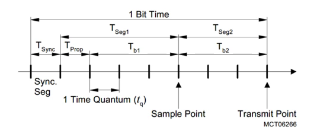

mcmcan视频笔记，视频来源：[https://videos.infineon-autoeco.com/pc/page/detail/1429](https://videos.infineon-autoeco.com/pc/page/detail/1429)

<!-- more -->

***

### CAN History

- Bosch Can V2.0 （1991）
  - 2.0A；"Standard CAN" with 11 bit message ID
  - 2.0B；"extended CAN" with 29 bit message ID
- 接受为 ISO11898-1 标准（2003）
  - ISO11898-1：数据链路层标准
  - ISO11898-2: 物理层标准（收发器）
- TTCAN（2000） 时间触发的CAN传输（预先定义好了CAN的收发时间）
- CAN FD(2012)
  - 2014 年正式被划入ISO11898-1 
- "no ISO CAN FD"（博世标准）和 ISO CAN FD
  - CRC域不同，ISO11898-1::2015 中体现

### infineon CAN

)

MCMCAN：new can module for Aurix2G
each MEMCAN unit contains:
- 包含 4 个 node
- 支持debug over can
- 支持最多16个中断（分配了16个SRN，该模块上的所有Node共享这16个中断）
- 支持接收filter，以列表的形式存放在message ram中
- 支持 range filter
- 支持 发送历史列表，包含发送数据的时间戳，ID
- 支持 loop back 模式
- 同一个MEMCAN上的 can node共享一个可配置的 Message Ram
- 接收处理：rx handler，对接收遍历filter，后存放到rx fifo
- 发送处理：tx handler，将MSG ram中数据发送出去，具有比较功能，发送优先级最高的can frame

MCMCAN Overview:
- Interrupt Compression Unit：将中断信号压缩成16个
- clock Control and memory control (全局控制——影响该module上的所有node)
- message ram：节点共享的ram
- BPI：访问保护
- can的复位也是全局控制，影响该module上的所有node

#### MEMCAN:message ram

#### MEMCAN：Clock
模块时钟开/关通过CLC寄存器控制
时钟选择通过MCR.CLKSEL控制
- 模块内部控制使用的时钟fsyn(最大100M)：driven by f_mcanh
- 生成波特率的时钟fasyn：seletct from
  - fmcan：the peripheral clock(20,40,80M)
  - fosco: the oscillator input clock

#### MEMCAN：Port

#### MEMCAN：interrupt

#### MEMCAN：Node
can node M_CAN overview:
- can core (11898-1)
- 时钟和同步控制单元
- CAN协议相关配置（bit时序，错误计数等）
- 中断压缩和使能单元
- 对 message ram进行配置和分割
- Tx Handler:
  - 控制数据从 message ram传输到 CAN core上
  - 消息优先级
  - 取消传输
- Rx Handler：
  - 控制数据从 can core传输到message ram中
  - 将接收数据保存在不同ram区域中。
  - 保存额外信息（如时间戳）
  

**Node Bit Timing**
- the data bit rate（CAN FD，仲裁域使用下面的nominal bit rate，数据域使用 data bit rate）
  - ISO 要求的每一位时间为 5-25 Tq
  - Tq = (1+DBRP)/f_can
  - bit timing = (1+(DTSEG1+1) + (DTSEG2+1))*Tq  (DBTP寄存器中配置)
- the nominal bit rate
  - ISO 要求每一位时间为 8-80Tq
  - Tq = (1+NBRP)/f_can
  - bit timing = (1+(NTSEG1+1) + (NTSEG2+1))*Tq  (NBTP寄存器中配置)

**传输延迟补偿：**
can中一个位的传输可以分为三个阶段:Tsync，Tseg1 以及 Tseg2。一般采样点会在Tseg1 和 Tseg2 之间：

CAN在传输数据时，会同时监听总线上的数据，以判断是否一致。这里的发送和接收数据之间存在一定延迟，因此需要进行补偿（否则可能导致采样点错误）：
- 硬件上会自动对第一个下降沿的延迟进行补偿
- 可以通过寄存器TDCR.TDCO 叠加额外的补偿

**Tx Handler**：
- 发送 tx buffer中的数据 （message ram ——> can core）
- 每个 can node 支持最大32个 tx buffer
- 硬件自动处理 putindex/getindex (FIFO/QUEUE mode)
- 控制发送优先级
- 可以取消发送
- 三种发送模式
  - dedicated mode:
    - 专用 tx buffer，用于在CPU的完全控制下进行消息传输。
    - 数据更新后，需要设置TXBARi.ARx进行发送
  - fifo mode:（按软件写入顺序发送）
    - can core实际发送从TXFQSi.TFGI(getindex)指向的element开始
    - 软件写入数据从TXFQSi.TFQPI(putindex)指向的element开始
    - 要发送的element需要设置TXBARi.ARx中的对应位（根据putindex获得）
  - queue mode：（内部发送按ID小的先发送）
    - can core发送时根据ID优先级发送（越小优先级越高，优先级相同则buffer number小的优先级高）
    - 软件写入数据从TXFQSi.TFQPI(putindex)指向的element开始
    - 要发送的element需要设置TXBARi.ARx中的对应位（根据putindex获得）
    - 
tx buffer在message ram 中的布局如下图：data size 由 TXES.TBDS 设置

**发送优先级**：
 - dedicated tx buffer：id 最小的先发送
 - tx fifo：先进来的先发送
 - tx queue: id最小的先发送
 - dedicated tx buffer + tx fifo: dedicated txbuffer中的所有element和fifo中最旧的element，它们中id 最小的先发送
 - dedicated tx buffer + tx queue：所有element中id最小的先发送

**Rx Handler**：
- 每个 can node具有 RxFIFO0, RxFIFO1, dedicated rxbuffer
- 每个 can node支持 2 个filter sets: for 11/29 bit ID (filter指明是否接收数据，以及接收数据放在哪里——fifo0/1 or dedicated rxbuffer)
- putindex 由硬件接收数据后自动更新
- getindex 需要软件在提取数据后，设置RXF0Ai/RXF1Ai中的FOAI

数据在 message ram中布局：

Rx Filtering:
- 每个can node支持 2 个过滤集合（for 11位id/29位id）
- 11bit id帧，可以配置最多128个 filter
- 29bit id帧，可以配置最多64个 filter
- 每个can node还有一个 global filter register：
  - 没有匹配的 can frame是否接收
  - 接收/拒绝 11/29 位的 remote frame
- 支持range 匹配，SFID1/SFID2任意一个匹配过滤，mask+id的匹配
- 过滤处理流程：
