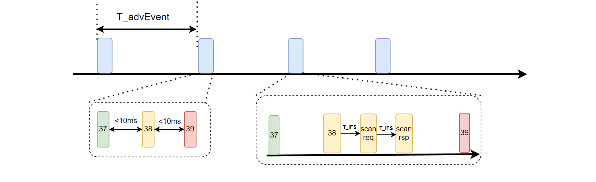
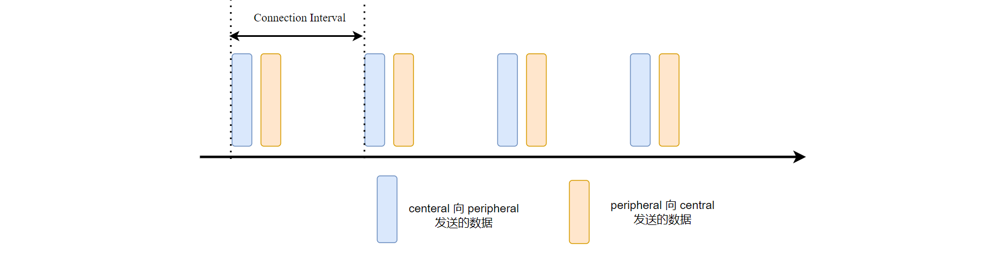
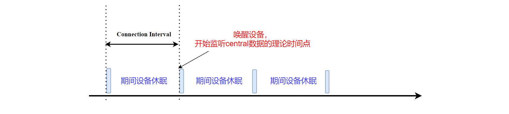
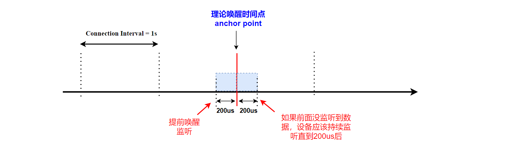
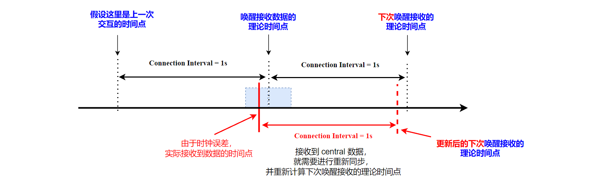

本文描述 BLE 广播、连接通信的基本模式，并讨论了在实现中比较重要的细节。基于nrf52840 实现了协议栈需要的定时器驱动和radio驱动，并利用定时器和radio的基本功能，实现了在单通道上进行广播。

<!--more-->

***

- 本系列文章，基于`nordic nrf52840` MCU，来实现一个精简的 BLE 从机协议栈。
- 已经实现的协议栈地址：[https://github.com/fengxun2017/dh_ble/tree/dev](https://github.com/fengxun2017/dh_ble/tree/dev)，目前在dev分支进行更新开发。早期是基于`nrf51822`实现了`BLE 4.0`规范中从机协议栈中的必要部分，实现了可以和手机连接并传输数据。目前手上只有`nrf52840`了，当前基于`nrf52840`实现底层需要的驱动，并通过该系列文章，逐步修改一些上层不合理的地方。
- 该系列文章，涉及到的协议部分会基于`BLE 5.3`规范进行描述，但仍旧只实现**最简单、必要**的部分（能连上手机，进行通信即可），并基于`iphone`进行测试。因此，`android`可能会由于发送一些我没实现的指令，出现兼容性问题。
- 本系列文章，只是用来作为学习 BLE 协议的参考，从硬件层驱动，链路层，到上层协议，都以最直接，简单的方式来实现。

#### 1——BLE广播和连接基本概述

`BLE`的普通广播（可连接、可扫描），其工作形式如下图所示：

广播启动后，设备会周期性的进行广播。每次广播事件，设备会在37，38，39三个信道上，将广播数据广播一次（如上图左下所示），规范要求三个信道的广播数据发出间隔要小于10ms。

并且，每个信道发送完数据后，需要持续监听一个很短的时间（规范定义为T_IFS=150us），看是否有其它设备（扫描者，例如手机）发送了扫描请求（或连接请求）。 
如上图右下所示，设备在37信道广播后，没有监听到数据。之后开始在38信道上广播，广播完后监听到了扫描方发送的`扫描请求`，设备回复`扫描相应`。之后，设备继续在39信道上广播。

上图中 T_advEvent可以看做是广播间隔，它的实际值是：`T_advEvent = advInterval + advDelay`
`advDelay`是一个0-10ms的随机值。为什么要有这个随机值？ 因为范围内可能存在很多个设备都在广播，如果两个设备刚好同时启动，刚好广播周期又是一致，那么它们的物理信道就会一直冲突（同时使用同一个物理信道）。
通过引入的这个随机延迟`advDelay`，可以极大缓解物理信道冲突问题。

了解了广播的基本机制，再来看下`BLE`连接后的基本通讯模式：

连接建立后，`central`（发起连接的设备）和 `peripheral`（被连接设备）会周期性（以连接间隔为周期）的进行数据交互。（上图每次`central`和`peripheral`只交互了一次数据，实际是可以交互多包数据的）

从上图可以发现，`BLE` 的每次数据交互都是由`central`先发起的，`peripheral`收到`central`数据包后再回复自己的数据包。连接建立以后，`central`和`peripheral`会按照这个模式周期性的交互，即使我们没有数据需要发送，`central`和`peripheral`也会周期交互空包，这是为了维持连接，保持它们的同步关系。

无论是广播状态，还是连接状态。`BLE`的通讯模式都是“周期性”的。这也是`BLE`为什么低功耗的原因，对于 1 秒需要交互一次数据，每次只交互几十字节数据的设备来说。1秒钟的时间内，只有几百us的时间是处于工作作态的，其它时间设备都可以处于休眠状态，因此整体功耗可以做到非常低。

#### 2——实现中的一些细节问题
了解了`BLE`广播/连接状态下的基本情况，如何来实现它？
2.4G Radio是必备的，它是数据收发的载体。
其次，我们需要一个定时器，来实现周期广播，以及连接后的周期交互。

利用定时器，可以实现周期性的唤醒设备，进行数据收发。
设备大部分可以处于休眠状态，当交互周期到达时（定时器超时），唤醒设备，进行数据收发。之后再次进入休眠状态，等待下一次定时器超时。
例如，对于`peripheral`设备来说，只需要在每次连接间隔（connection interval）到期时，唤醒设备并开始监听`central`发送过来的数据，如下图所示：

但现实中存在问题是，定时器都是有误差的。例如，用来实现周期唤醒设备的 RTC定时器，在其时钟精度为`100ppm`的条件下，1秒钟的定时，会存在 **±100us** 的误差。

因此，对于`peripheral`设备，连接间隔 1秒 的情况下，我们不能刚好在 第1秒 这个理论时间点（假设0秒是第一次交互）才唤醒设备，让其监听（`central`）数据，而是需要考虑定时器误差问题，并根据这个误差提前唤醒设备，或监听额外的时间。

并且，这个误差需要考虑连接双方误差的总和，即实际误差应该是 **central的误差 + peripheral的误差**（这是最大误差，发送在两个设备的时间误差方向相反时）。对于 1秒 连接间隔，在`central`/`peripheral` 时钟误差都为`100ppm`的条件下，整体误差最大为`1000000us  *(100+100)/1000000 = ±200us`。
这种情况下，在实现`peripheral`的链路层时，需要在理论唤醒时间点（**anchor point**）之前**200us**就唤醒设备，如果一直没监听到数据，也需要持续监听直到理论时间点之后**200us**的时间（即额外监听时间），如下图所示：

PS：这也是规范中的连接请求**CONNECT_IND**为什么会有SCA参数（Sleep clock accuracy），因为`peripheral`需要知道`central`的时钟误差，并结合自己的时钟误差，从而得到可能的最大误差。这个额外的监听时间就是规范中的`window widening`

理论唤醒的时间点，协议规范称为**anchor point**，如上图所示。
由于上述时钟误差的原因，`peripheral`是无法准确知道这个**anchor point**实际发生时间点（即`central`发送的数据包的到达时间）。所以`peripheral`在每次连接事件中收到`central`的数据包，都可以看做是一次重新同步，并更新下一次唤醒的理论时间点。其逻辑如下图所示：

因此，实际实现定时器周期唤醒时，我们使用的是单次定时，每次收到数据包后，再启动下一次连接事件的定时。

#### 3——nrf52840 硬件准备

基于前文所述，我们需要使用 nrf52840 的 radio外设，作为数据收发载体。
需要注意的是，nrf52840 的 radio 是由高频时钟（HFCLK）驱动的，对高频时钟的精度有要求（否则信号频率不准），因此需要使用外部晶振作为高频时钟输入源，来提供较为精确的HFCLK。在源码文件[nrf52840/NrfClockDrv.c](https://github.com/fengxun2017/dh_ble/blob/dev/source/ChipDrv/NrfDrv/nrf52840/NrfClockDrv.c)中实现了`HFCLK`配置输入源为外部晶振。

此外，我们还使用了 RTC 硬件定时器，来实现周期广播，以及连接后的周期交互。基于前文第二节所述，在源码文件[nrf52840/NrfRtcDrv.c](https://github.com/fengxun2017/dh_ble/blob/dev/source/ChipDrv/NrfDrv/nrf52840/NrfRtcDrv.c)的实现中，我们实现的是单次 RTC定时器（每次超时中断发生后，在中断里关闭超时事件）。
**需要注意**，RTC 的驱动源来自 MCU 内部的低频时钟（LFCLK——32768 HZ），低频时钟的输入源可以是外部晶振，也可以是内部RC 振荡器产生，源码文件[nrf52840/NrfClockDrv.c](https://github.com/fengxun2017/dh_ble/blob/dev/source/ChipDrv/NrfDrv/nrf52840/NrfClockDrv.c)中启动LFCLK时可以配置。
我的开发板上没有外部晶振，因此配置的使用内部 RC 振荡器作为输入源。
RC 振荡器作为输入源，会使得LFCK的精度比较低，进而导致RTC定时器精度低，不适合用来作为协议栈的时序同步时钟。因此需要对RC 振荡器进行周期校准，这部分功能实现在[nrf52840/NrfClockDrv.c](https://github.com/fengxun2017/dh_ble/blob/dev/source/ChipDrv/NrfDrv/nrf52840/NrfClockDrv.c)中。 一般1s 校准一次就可以了。

PS: 自测结果，rc 振荡器作为LFCLK输入源，无校准时1s定时器误差在8ms， 有校准时（每秒校准一次）误差在100us以内。 所以是否校准影响很大。因为BLE 的核心是低功耗！ 低功耗就是要让设备尽量高效地唤醒（理想的情况是，唤醒后立刻就能接收到数据，然后发送完自己的数据后立刻进入休眠）,而RTC 误差越大，如上一节所述，我们就要提前更多的时间来唤醒设备，让其开始监听数据，这会使设备工作效率很低，并增加功耗。
**注意**：如果校准周期比较长（例如4秒校准一次），那么还需要考虑短时间内温度变化大的精度的影响（例如，通过片上温度传感器感知到温度短时间内有0.5度的变化，应该立刻进行一次校准）。这里实现就不考虑了。

测试代码[test/test_rtc0_timer0.c](https://github.com/fengxun2017/dh_ble/blob/dev/test/test_rtc0_timer0.c)中，测试了 RTC硬件定时器的基本定时功能。
（代码中还测试了timer0硬件定时器，以前的实现中使用了timer0硬件定时器，随本系列文章更新，后面会修改协议栈内部实现，不在使用timer定时器。驱动timer的时钟源头是来自HFCLK，在使用外部32M晶振产生HFCLK的条件下，2s 定时的误差在10us内）

源码文件[nrf52840/NrfRadioDrv.c](https://github.com/fengxun2017/dh_ble/blob/dev/source/ChipDrv/NrfDrv/nrf52840/NrfRadioDrv.c)中，实现了 radio的基本操作，如何radio 配置成 BLE的使用方式，源码中有详细的注释。
nordic nrf52840的芯片手册中，对radio的收/发状态转换描述的很详细，这里不再赘述。

源码文件[test/test_radio.c](https://github.com/fengxun2017/dh_ble/blob/dev/test/test_radio.c)，基于上述 RTC定时器和 radio驱动，实现了周期广播（只在37通道上，不可被连接，不可被主动扫描），使用手机可以看到该设备的广播信息。

下一篇文章，会详述 BLE 的链路层数据包基本格式，和在nrf52840上如何配置。

PS：测试代码中使用了 systemview作为调试工具，这个后面再单独写个这个工具的基本使用文章。