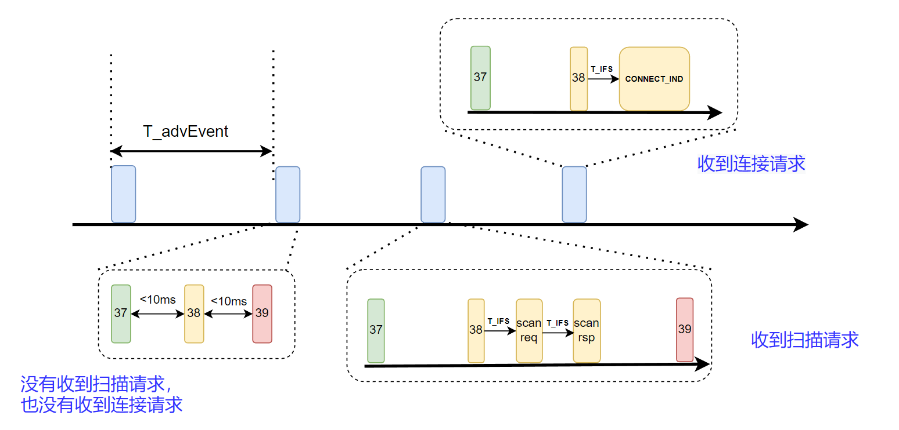

<center>
本文描述 BLE 链路层广播状态下的状态机实现。
</center>

<!--more-->

***


- 本系列文章，基于`nordic nrf52840` MCU，来实现一个精简的 BLE 从机协议栈。
- 已经实现的协议栈地址：[https://github.com/fengxun2017/dh_ble/tree/dev](https://github.com/fengxun2017/dh_ble/tree/dev)，目前在dev分支进行更新开发。早期是基于`nrf51822`实现了`BLE 4.0`规范中从机协议栈中的必要部分，实现了可以和手机连接并传输数据。目前手上只有`nrf52840`了，当前基于`nrf52840`实现底层需要的驱动，并通过该系列文章，逐步修改一些上层不合理的地方。
- 该系列文章，涉及到的协议部分会基于`BLE 5.3`规范进行描述，但仍旧只实现**最简单、必要**的部分（能连上手机，进行通信即可），并基于`iphone`进行测试。因此，`android`可能会由于发送一些我没实现的指令，出现兼容性问题。
- 本系列文章，只是用来作为学习 BLE 协议的参考，从硬件层驱动，链路层，到上层协议，都以最直接，简单的方式来实现。


#### 1：一个简单的隔离层：

在文章[基础概念和硬件驱动实现](https://fengxun2017.github.io/2023/03/25/BleStack-hardware-driver/)一文中，我们介绍了实现`BLE`从机协议栈，需要的基本硬件外设：`Radio`以及硬件定时器`RTC0`和`Timer0`（硬件定时器`timer0`后面不一定会用）。

如果我们直接在这些外设的驱动基础上来实现`BLE`协议栈，容易将一些硬件特性引入到`BLE`协议内部实现中，形成一定耦合。
因此，我们加了一个简单的抽象层，这个抽象层基于底层硬件相关的`radio`、`RTC0`等驱动，来实现`BLE`需要的射频收/发功能，以及低功耗定时器功能。如下图所示：


通过引入一个抽象驱动层，实现向上提供通用、简单、统一的接口(基本射频收发、低功耗定时器）。这样BLE协议栈的实现就不用关心最底层使用的是什么硬件，实现和硬件解耦。
当我们替换其它硬件时，只需要根据芯片特性，在抽象驱动层中添加一些芯片特定的处理即可，而更上层的`BLE`协议栈则不需要做改动（前提是抽象驱动层保持对上层的接口不变）。
在源码目录[source/BleDrv](https://github.com/fengxun2017/dh_ble/tree/dev/source/BleDrv)下，我们就是基于nrf51840/nrf51822 `mcu`的硬件外设`radio`、`rtc0`、以及`timer0`。实现了`BLE`协议栈需要使用的`BleRadio`以及低功耗定时器`BleLowerTimer`以及高精度定时器`BleHAccuaryTimer`。从而实现将协议栈的实现与底层具体硬件进行分离。


#### 2：BLE 链路层广播的基本状态机

了解了上图的基本架构，我们开始讨论`BLE`协议栈内部的具体实现。本系列文章会从`BLE`协议栈的链路层开始逐渐向上讨论各层的功能和实现，本文介绍链路层的细节和实现。即下图所示部分：


<br>

由于我们实现的是从机协议栈（被连接的设备），因此**我们不考虑与连接发起端相关的几个状态。简单起见，我们也不考周期广播/同步通道的特性**。
因此，对于我们需要实现的从机协议栈来说，链路状态机可简化为下图所示：


有了上图所述的基本状态间关系，我们就可以实现链路层对应的状态机。

通常`MCU`的`radio`外设，其内部含有一个状态寄存器，来指示当前`radio`是处于什么状态（如发送状态、接收状态等），为了尽量减少对硬件的依赖，我们不使用这种状态寄存器，而是在底层自己维护状态。

我们只使用`radio`外设的`DISABLED`中断事件，至于`radio`是发送完后被关闭的，还是接收完后被关闭的，由我们自己实现的状态机来记录。

因此，从我们目前讨论到的简单情况来看，我们至少要在链路层中维持两个状态：广播态（advertising）、连接态（connection）。

每次`radio`发送完并关闭后，或者接收完并关闭后，进入中断处理函数中，根据当前的状态来决定所需执行的动作。例如：
```c
void LinkRadioEvtHandler(EnBleRadioEvt evt)
{
    ....
    // 获取当前链路状态
	state = CURRENT_STATE;	

    if (state == ADVERTISING) {
        // 广播状态下的相关处理
        ......
    }
    else if (state == CONNECTION) {
        // 连接状态下的相关处理
        ......
    }
}
```
<br>
</br>

我们对上述代码中，广播态下的相关处理进行细节展开，分析其内部更细致的状态机。
在 BLE [基础概念](https://fengxun2017.github.io/2023/03/25/BleStack-hardware-driver/)一文中，我们介绍了普通广播的基本通讯模式形式如下图所示：



即在普通广播（可连接，可扫描）状态下，存在的情形有：
 1. 没有扫描，也没有连接请求：则设备每次广播周期时间到达时，依次在三个广播通道上进行广播。左下图所示。
 2. 某个通道广播后，监听到了一个扫描请求：则设备回复扫描响应数据，之后继续在下一个广播通道上继续广播。如右下图所示。
 3. 某个通道广播之后，监听到了一个连接请求：则设备开始进入连接态，并等待连接建立（收到连接态下的第一个数据包）

根据上述情形，在代码实现上我们，需要考虑：
 1. 设备启动并开始广播后，首先应该进入广播—发送状态（ADV_TX）
 2. 收到完成事件（发送）后，应该进入广播—接收状态（ADV_RX），并启动接收等待超时定时器（按规范定义，如果对方有数据包，应该在150us的样子，就会发过来）
   2.1 超时前，收到连接请求时，进入连接态，执行连接建立相关过程（本文不涉及）
   2.2 超时前，收到扫描请求时，进入广播—发送扫描相应状态（ADV_TX_SCANRSP）
    - 当扫描响应数据发送完成后，需要再在下一个通道上继续广播，因此会再次进入广播—发送状态（ADV_TX）
     
    2.3 接收等待超时了，则切换到下一个通道继续广播，因此会再次进入广播—发送状态（ADV_TX）

概括下来，可以用下图所示的状态机来表示：


