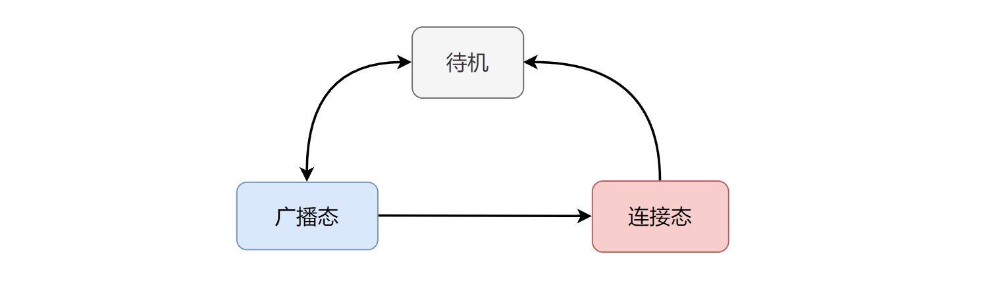

<center>
本文描述 BLE 链路层广播状态下的状态机实现。
</center>

<!--more-->

***


- 本系列文章，基于`nordic nrf52840` MCU，来实现一个精简的 BLE 从机协议栈。
- 已经实现的协议栈地址：[https://github.com/fengxun2017/dh_ble/tree/dev](https://github.com/fengxun2017/dh_ble/tree/dev)，目前在dev分支进行更新开发。早期是基于`nrf51822`实现了`BLE 4.0`规范中从机协议栈中的必要部分，实现了可以和手机连接并传输数据。目前手上只有`nrf52840`了，当前基于`nrf52840`实现底层需要的驱动，并通过该系列文章，逐步修改一些上层不合理的地方。
- 该系列文章，涉及到的协议部分会基于`BLE 5.3`规范进行描述，但仍旧只实现**最简单、必要**的部分（能连上手机，进行通信即可），并基于`iphone`进行测试。因此，`android`可能会由于发送一些我没实现的指令，出现兼容性问题。并且由于没有充分的错误场景测试，一些实现本身可能存在缺陷。
- 本系列文章，只是用来作为学习 BLE 协议的参考，从硬件层驱动，链路层，到上层协议，都以最直接，简单的方式来实现。


#### 1：一个简单的隔离层：

在文章[基础概念和硬件驱动实现](https://fengxun2017.github.io/2023/03/25/BleStack-hardware-driver/)一文中，我们介绍了实现`BLE`从机协议栈，需要的基本硬件外设：`Radio`以及硬件定时器`RTC0`和`Timer0`（硬件定时器`timer0`后面不一定会用）。

如果我们直接在这些外设的驱动基础上来实现`BLE`协议栈，容易将一些硬件特性引入到`BLE`协议内部实现中，形成一定耦合。
因此，我们加了一个简单的抽象层，这个抽象层基于底层硬件相关的`radio`、`RTC0`等驱动，来实现`BLE`需要的射频收/发功能，以及低功耗定时器功能。如下图所示：


通过引入一个抽象驱动层，实现向上提供通用、简单、统一的接口(基本射频收发、低功耗定时器）。这样BLE协议栈的实现就不用关心最底层使用的是什么硬件，实现和硬件解耦。
当我们替换其它硬件时，只需要根据芯片特性，在抽象驱动层中添加一些芯片特定的处理即可，而更上层的`BLE`协议栈则不需要做改动（前提是抽象驱动层保持对上层的接口不变）。
在源码目录[source/BleDrv](https://github.com/fengxun2017/dh_ble/tree/dev/source/BleDrv)下，我们就是基于nrf52840/nrf51822 `mcu`的硬件外设`radio`、`rtc0`、以及`timer0`。实现了`BLE`协议栈需要使用的`BleRadio`以及低功耗定时器`BleLowerTimer`以及高精度定时器`BleHAccuaryTimer`。从而实现将协议栈的实现与底层具体硬件进行分离。

PS：理想很美好，但现实很残酷。分层形式的协议栈，在协议栈的上层部分，可以做到屏蔽掉底层的具体芯片细节。
但在底层部分，例如链路层，很难做到完全屏蔽硬件细节。因为，不同的芯片原厂就是会在硬件上做一些特殊的设计，提供一些特殊/方便的硬件机制，以方便底层软件的实现。甚至，可能必须使用芯片的某种硬件特性，才能（在这颗芯片上）实现符合规范要求的协议栈底层部分。
例如，在我们实现的这个协议栈中，就使用了nordic radio的收/发模式自动转换特性。该硬件特性在 nrf51，nrf52系列芯片中都存在。所以上文中，我们实现的抽象驱动层可以兼容nrf51822,nrf52832,nrf52840等nordic nrf51,nrf52系列芯片。 也就是说，使用这些芯片时，协议栈的链路层以及之上的各层都不用修改。但如果是换了另一个厂家的芯片，可能它没有硬件radio自动收/发模式转换功能，那么链路层的内部实现就需要修改了。

#### 2：BLE 链路层广播的基本状态机

了解了上图的基本架构，我们开始讨论`BLE`协议栈内部的具体实现。本系列文章会从`BLE`协议栈的链路层开始逐渐向上讨论各层的功能和实现，本文介绍链路层广播相关的细节和实现。即下图所示部分：


<br>

由于我们实现的是从机协议栈（被连接的设备），因此**我们不考虑与连接发起端相关的几个状态。简单起见，我们也不考周期广播/同步通道的特性**。
因此，对于我们需要实现的从机协议栈来说，链路层状态机可简化为下图所示：



有了上图所述的基本状态间关系，我们就可以实现链路层对应的状态机。

通常`MCU`的`radio`外设，其内部存在一些状态寄存器，其值指示当前`radio`是处于什么状态（如发送状态、接收状态等），为了尽量减少对硬件的依赖，我们不使用这种状态寄存器，而是在底层自己维护状态。

我们只使用`radio`外设的`DISABLED`中断事件，至于`radio`是发送完后被关闭的，还是接收完后被关闭的，由我们自己实现的状态机来记录。
`PS：实际上nordic芯片中，可以使用END中断事件（即发送完成或接收完成）。这里使用DISABLED中断事件的考虑是，早期MCU射频（nrf51822）发送结束后，必需先关闭，才能再控制进入接收模式。而当前更好的MCU（nrf2840）的射频部分，发送结束后，可以直接控制进入接收模式，而不用先关闭。 不关闭，直接进行发送/接收状态的相互转换肯定效率更高，不过为了更具一般性，我们还是考虑使用：发送->关闭->接收->关闭->发送....这种收/发切换模式。`

综上，从我们目前讨论到的简单情况来看，我们至少要在链路层中维持两个状态：广播态（advertising）、连接态（connection）。

每次`radio`发送完并关闭后，或者接收完并关闭后，进入中断处理函数中，根据当前的状态来决定所需执行的动作。例如：
```c
void LinkRadioEvtHandler(EnBleRadioEvt evt)
{
    ....
    // 获取当前链路状态
    state = CURRENT_STATE;	

    if (state == ADVERTISING) {
        // 广播状态下的相关处理
        ......
    }
    else if (state == CONNECTION) {
        // 连接状态下的相关处理
        ......
    }
}
```
<br>
</br>

我们对上述代码中，广播态下的相关处理进行细节展开，分析其内部更细致的状态机。
在 BLE [基础概念](https://fengxun2017.github.io/2023/03/25/BleStack-hardware-driver/)一文中，我们介绍了普通广播的基本通讯模式形式如下图所示：

PS：图中的T_IFS表示帧间间隔（150us）

即在普通广播（可连接，可扫描）状态下，存在的情形有：
 1. 没有扫描，也没有连接请求：则设备每次广播周期时间到达时，依次在三个广播通道上进行广播。左下图所示。
 2. 某个通道广播后，监听到了一个扫描请求：则设备回复扫描响应数据，之后继续在下一个广播通道上继续广播。如右下图所示。
 3. 某个通道广播之后，监听到了一个连接请求：则设备开始进入连接态，并等待连接建立（收到连接态下的第一个数据包）


根据上述情形，在代码实现上我们，需要考虑：
 1. 设备启动并开始广播后，首先应该进入广播—发送状态（**ADV_TX**）
 2. 收到完成发送事件后，应该进入广播—接收状态（**ADV_RX**），并启动接收等待超时定时器（按规范定义，如果对方有数据包，应该在150us的样子，就会发过来）
   2.1 超时前，收到连接请求时，进入连接态，执行连接建立相关过程（本文不涉及）
   2.2 超时前，收到扫描请求时，进入广播—发送扫描相应状态（**ADV_TX_SCANRSP**）
    - 当扫描响应数据发送完成后，需要再在下一个通道上继续广播，因此会再次进入广播—发送状态（**ADV_TX**）
     
    2.3 接收等待超时了（没有收到扫描请求，也没有收到连接请求），则切换到下一个通道继续广播，因此会再次进入广播—发送状态（**ADV_TX**）

上述描述的都是，广播间隔到了后，我们需要执行的动作。但设备绝大部分时间都是空闲的，不发送数据也没有接收数据。因此，我们还需要一个广播空闲（**ADV_IDLE**）状态。如下图所示：


概括下来，可以用下图所示的状态机来表示广播态下的子状态机：


#### 3：具体实现

链路层广播态相关的代码实现在文件`source/BleStack/BleLink/BleLinkAdvertising.c`中。
在函数`LinkAdvStateInit`中，我们注册了广播态使用的事件处理函数`LinkAdvRadioEvtHandler`，每当传输（发送/接收）完成后，会根据当前状态来决定执行的动作，其逻辑如下所示：
```c
//链路层广播态下的事件处理函数
static void LinkAdvRadioEvtHandler(EnBleRadioEvt evt)
{
    // 发送完成或接收完成（接收完成，可能是接收到数据了，也可能是一直没接收到数据到达超时时间，然后被关闭）
    if( BLE_RADIO_EVT_TRANS_DONE == evt )	
    {

        // 发送完成
        if( ADV_TX == s_blkAdvStateInfo.m_enAdvSubState ||  ADV_TX_SCANRSP == s_blkAdvStateInfo.m_enAdvSubState)
        {
            
            // 收到完成事件，说明数据发送完了，启动发送的时候我们设置了radio disable后自动切换到接收模式。
            // 所以这里要关掉AutoToRx 的机制，不然接收完 radio进入disable后，又会再自动进入Rx模式
            BleAutoToRxDisable();
            
            // 处理发送完成事件
            HandleAdvTxDone();
        }
        // 接收完成
        else if( ADV_RX == s_blkAdvStateInfo.m_enAdvSubState)
        {
            // 收到完成事件，说明数据接收完了，启动接收的时候我们设置了radio disable后自动切换到发送模式
            // 所以这里要关掉AutoToTx 的机制，不然接收完 radio进入disable后，又会再自动进入Tx模式
            BleAutoToTxDisable();

            // 处理接收完成事件
            HandleAdvRxDone();
        }
        // 接收等待超时（没收到扫描请求或连接请求）
        else if( ADV_RX_TIMEOUT == s_blkAdvStateInfo.m_enAdvSubState )
        {
            // 切换到下一个通道继续广播
            SwitchToNextChannel(ADV_CHANNEL_SWITCH_TO_NEXT);
        }
    }
}
```

上述代码中有两个特别的函数：`BleAutoToRxDisable`和`BleAutoToTxDisable`。
这两个函数，与`Nordic`的自动收发切换，以及自动 TIFS 延迟特性有关。
PS：实际上这是属于硬件相关的特性，nordic系列的蓝牙芯片具有这个硬件特。该特性本不该引入到协议栈层面，但是这个硬件特性对于协议栈的实现很有用，可以简化很多操作，因此还是使用了。

了解这个`Nordic`硬件特性之前，我们需要知道，BLE 规范定义了，空中两个连续的数据包之间需要有一个帧间间隔（IFS = 150us），如下图所示：

其中，C->P 表示`central`发送给`peripheral`的数据包。P->C 表示`peripheral`发送给`central`的数据包。

如果用软件来实现帧间间隔，需要使用定时器来实现收到数据后，启动 150us 的定时器，定时器到期后再将数据发送出去。如果发送完后，对方可能还有数据包过来，那么发送数据后还要再起定时器，并在 150us 后超时，开始监听对方数据包。

软件实现，在细节上比较麻烦。`Nordic`在硬件上有一个自动延迟特性。在源文件`source/ChipDrv/NrfDrv/nrf52840/NrfRadioDrv.c`中的函数`NrfRadioInit`里，有一个`NRF_RADIO->TIFS = TIFS_VALUE;`配置，该配置的作用就是使能硬件自动延迟特性。使能该特性后，硬件会自动在帧间延迟150us。
但是使能该硬件特性的另一个必要条件是：使能`Nordic`的自动收/发（或发/收）状态转换特性。
所谓自动收发切换，就是在接收（发送）完成后，硬件`Radio`自动启动进入发送（接收）模式，抽象描述如下图所示：


综上，当使能`Nordic`的自动收发状态转换特性，并且配置了`NRF_RADIO->TIFS = TIFS_VALUE`后，`Nordic`硬件就会自动在帧间插入延迟（IFS），如下图所示：


该特性可以简化我们的协议栈实现。
当我们需要发送数据时，在启动发送前配置`完成后自动切换到接收`。当我们需要接收数据时，在启动接收前配置`完成后自动切换到发送`。

例如，在源码文件`source/BleStack/BleLink/BleLinkAdvertising.c`中的切换到下一个通道进行广播的函数`SwitchToNextChannel`，其每次发送前会使能**发送完成后自动切换到接收模式**，这样发送完成后，`Radio`就自动进入接收模式了（进入接收模式看是否有连接请求或扫描请求）。如下所示：

```c
__INLINE static void  SwitchToNextChannel( u1 startFlag )
{
    ...
    // 使能发送结束后自动进入接收模式
    BleAutoToRxEnable();

    // 发送数据
    BleRadioTxData(channel, s_blkAdvStateInfo.m_pu1LinkTxData, BLE_PDU_LENGTH);	
    DEBUG_INFO("tx adv on channel:%d", channel);
    ....
}
```

通过上述配置，当我们收到发送完成事件后，硬件`Radio`就会自动切换到接收模式。广播态下，发送完成后，可能收到扫描请求（或连接请求），收到扫描请求需要发送预设的扫描响应数据。因此，在处理发送完成事件时（此时硬件已经自动开始切换到接收模式），我们可以设置，**接收完成后再自动切换到发送模式**（方便直接发送可能需要的扫描响应数据）。例如，源码文件`BleLinkAdvertising.c`中的`HandleAdvTxDone`函数：
```c
__INLINE static void HandleAdvTxDone(void)
{
    ...
    // 发送完成后在当前通道上开始接收（扫描请求/连接请求）
    // 发送前配置过发送完成自动切换到接收模式，因此，此刻硬件已经在切换接收模式了。
    LinkAdvSubStateSwitch(ADV_RX);
    DEBUG_INFO("switch to ADV_RX");

    // 使能接收完成后自动切换发送模式（如果是扫描请求，就可以发送扫描响应数据了）
    BleAutoToTxEnable();
    // 配置接收数据的buffer地址
    BleRadioSimpleRx(s_blkAdvStateInfo.m_pu1LinkRxData);

    // 启动接收等待超时定时器
    BleLPowerTimerStart(BLE_ADV_RX_TIMER, ADV_RX_WAIT_TIMEOUT, AdvRxWaitTimeoutHandler, NULL);		
    DEBUG_INFO("rx on channel:%d",s_blkAdvStateInfo.m_u1CurrentChannel);
    ...
}
```

理解了`Nordic`的`radio`模式自动切换机制，就能明白本节最开始介绍的链路层广播态下的事件处理函数`LinkAdvRadioEvtHandler`中的`BleAutoToRxDisable`和`BleAutoToTxDisable`的作用了。


