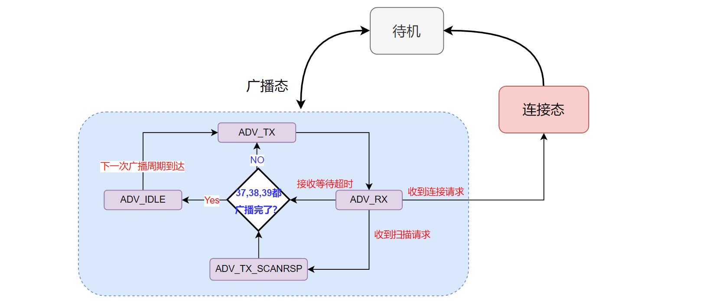

<center>
本文描述 BLE 链路层连接建立过程，在代码上的具体实现细节。
</center>

<!--more-->

***


- 本系列文章，基于`nordic nrf52840` MCU，来实现一个精简的 BLE 从机协议栈。
- 已经实现的协议栈地址：[https://github.com/fengxun2017/dh_ble/tree/dev](https://github.com/fengxun2017/dh_ble/tree/dev)，目前在dev分支进行更新开发。早期是基于`nrf51822`实现了`BLE 4.0`规范中从机协议栈中的必要部分，实现了可以和手机连接并传输数据。目前手上只有`nrf52840`了，当前基于`nrf52840`实现底层需要的驱动，并通过该系列文章，逐步修改一些上层不合理的地方。
- 该系列文章，涉及到的协议部分会基于`BLE 5.3`规范进行描述，但仍旧只实现**最简单、必要**的部分（能连上手机，进行通信即可），并基于`iphone`进行测试。因此，`android`可能会由于发送一些我没实现的指令，出现兼容性问题。并且由于没有充分的错误场景测试，一些实现本身可能存在缺陷。
- 本系列文章，只是用来作为学习 BLE 协议的参考，从硬件层驱动，链路层，到上层协议，都以最直接，简单的方式来实现。

<br/>

**我们实现的是从机协议栈，因此本文介绍的链路层连接建立过程，都是基于从机角度来描述的。本文也只讨论最常见的，普通广播状态下，接收到连接请求（CONNECT_IND）后，连接的建立过程**

#### 1：前情回归：

在文章[链路层广播状态机实现](https://fengxun2017.gitee.io/2023/04/24/BleStack-link-advertising/)一文中，我们对从整体上将 BLE 链路层状态间的关系和转换，抽象为下图所示的一个简单状态机：

<center>图 1 </center>

并且，我们分析了**广播态**中的一些细节，如下图所示：


<center>图 2 </center>


本文，我们对上图右边的**连接态中**的细节进行分析，在[链路层连接建立——前置理论](https://fengxun2017.gitee.io/2023/05/20/BleStack-link-connection/)一文中，我们总结了完整的连接建立过程大致分为三部分：
- 被连接设备广播，发起连接的设备扫描设备。
- 发起连接的设备发送连接请求（CONNECT_IND）,被连接设备收到该请求。 则两个设备均进入连接态，并且这个连接本身为**连接创建状态**。
- 在规定的时间范围内，设备双方完成了第一次数据交互，则**连接建立真正完成**。

#### 2：实现需要考虑的问题
上述过程是一个理想的过程，在实际情况中，可能由于各种原因导致peripheral 设备（在规定的时间）没有收到 central 设备发送过来的数据包。

例如，在[链路层连接建立——前置理论](https://fengxun2017.gitee.io/2023/05/20/BleStack-link-connection/)一文中，我们提到过，连接创建后，peripheral 和 central 第一次数据交互的理想情况是：

<center>图 3 </center>

但实际可能由于信号干扰，central设备突然掉电等各种因素，导致central没有在上图中的`Transmit Window`范围内发出第一个数据包（C->P），这种情况怎么处理？ 规范要求以`Transmit Window`的起始为准，延后一个连接间隔（connection interval，因为收到了CONNECT_IND，所以此时peripheral是知道连接间隔的）继续应用`Transmit Window`的模式开始监听：

<center>图 4 </center>

上图中，第一个`Transmit Window`中，peripheral 未收到 central 发送的数据包，但是在第二个`Transmit Window`中完成了第一次数据交互，并确立了理论上的后续通讯时刻（Anchor Point，这里说的是理论时刻，因为考虑到时钟精度问题，真实的通讯时刻是不确定的，在文章[基础概念](https://fengxun2017.gitee.io/2023/03/25/BleStack-hardware-driver/#2%E2%80%94%E2%80%94%E5%AE%9E%E7%8E%B0%E4%B8%AD%E7%9A%84%E4%B8%80%E4%BA%9B%E7%BB%86%E8%8A%82%E9%97%AE%E9%A2%98)中有说明）。

那么，如果在第二个`Transmit Window`中也没有收到 central 发送的数据包呢，规范针对这种可能性，规定了在连接完成建立（完成第一次数据交互）前，如果超过 **6** 次都没有完成第一次数据交互，则认为连接失败。
`PS：实际上，连接请求（CONNECT_IND）中是有连接监督超时（Supervision Timeout）参数的，但是该参数是应用在连接建立成功（完成了第一次数据交互）以后的。为什么在连接创建后的第一次交互过程中不应用连接监督超时参数？这是因为，连接监督超时（Supervision Timeout）一般为几秒中，而连接间隔一般为几十ms。因此，6 次连接间隔也就几百ms 的时间，相比于使用 几秒的连接监督超时，使用 6 次检测可以更快地终止失败的连接建立过程（6次握手都没成功，大概率是一方设备出问题了，或当前环境干扰很多）。`


连接建立过程中的丢包情况，上文已经描述了。
而连接建立完成后，后续的周期交互中，也是可能出现丢包的，如下图所示： **再次声明，我们都是站在广播设备/peripheral设备的角度来描述的**

<center>图 5 </center>
PS：上图中，每个连接事件中Central设备和Peripheral设备只交互一次（各发送一包数据）。不过实际中，各厂商实现都是可以交互多包数据的，我们的实现中，为了简单起见，只交互一次。

如上图所示，在连接成功建立以后，之后的任意一次交互，都可能由于环境、设备故障等因素导致没有交互成功。但只要这个交互不成功过程的持续时间，没有超过连接监督超时（Supervision Timeout），连接状态就仍旧是正常的（后续任何一次成功的交互都可以让连接监督超时重置，使得连接状态恢复正常，继续进行数据传输）。


#### 3：连接状态下的子状态机

通过前文的描述，我们引出了一个必须考虑的实际问题，即连接建立中，以及连接建立完成后的正常周期交互过程中，都需要考虑对方设备（central，我们都是站在peripheral角度进行描述）未在规定时间发送数据包的情况（`可能由于环境干扰导致没监听到，也可能由于对方设备（central）异常等原因`）。

也就是说：
1. 当设备收到了`CONNECT_IND`，链路进入**连接创建状态**，并作为`peripheral` 角色（即我们实现的从机）。我们使用**CONN_CONNECTING_RX** 来表示这个状态。（后缀的RX，表示需要监听 `central` 角色设备是否在规定时间范围内，发送过来的第一包数据）。
   - 当规定时间内收到了`central`发送过来的第一包数据，则**连接建立完成**，并进入 **CONN_CONNECTED_TX**状态。（后缀TX，因为收到`central`数据包后，我们需要回包）
   - 规定时间内没有收到`central`发送过来的第一包数据（即接收等待超时），则关闭radio。此时，如果失败次数未超过6，状态继续为**CONN_CONNECTING_RX** 并等待下个间隔再次尝试接收（**图4情况**）。如果失败超过6次了，则链路断开，连接失败。
<br/>

1. 完成了上述 1 中的第一次数据交互，**则连接成功建立**。
   - 后续的交互中，每次连接间隔时间到达（连接事件），设备总是会先处于**CONN_CONNECTED_RX** 状态（因为我们实现的是Peripheral设备，每个连接间隔到期时，总是Central先向Peripheral发送数据包）。
   - 当在期望时间内收到了 Central 发送过来的数据包，则切换到 **CONN_CONNECTED_TX** 状态，发送回包（有数据就发送数据，没有数就发送空包以维持连接）。
   - 在期望的时间内没有收到 Central 的数据包（接收等待超时），则关闭radio。如果这个交互不成功（即在**图 5**的connection event中交互失败）过程的持续时间，超过了连接监督超时（Supervision Timeout），则连接断开。否则等待下次连接间隔到达（又切换回**CONN_CONNECTED_RX** ）。
  


综上所述，我们可以将链路层连接态下的状态转换，大致表达为下图所示状态机：

PS：图中的连接断开条件，对于连接建立成功前来说，是 6 次握手没有成功；对于连接建立成功后来说，是交互失败持续时间到达连接监督超时。

#### 4：具体实现
上图的状态机是一个比较理性的情况，但是在实际的实现中，我们使用了nordic radio 收/发模式自动切换特性(在文章 [链路层广播状态机实现](https://fengxun2017.gitee.io/2023/04/24/BleStack-link-advertising/) 的最后有相关描述) 以及基于DISABLED中断事件来驱动底层状态机的变换。导致在底层实现时需要一个连接前置状态，如下图所示：

PS：连接前置状态下，内部处理很简单，仅仅只是收到DISABLED中断事件后，将链路状态切换为连接态**BLE_LINK_CONNECTED**，并且其子状态设置为**CONN_CONNECTING_RX**。

根据前文所述，链路层的事件处理可以概括出如下的大致代码逻辑：
```c
// radio发送或接收完成后的事件处理
void LinkRadioEvtHandler(EnBleRadioEvt evt)
{
    // 获取当前链路状态
    state = CURRENT_STATE;	

        // 广播状态下的相关处理
    if (state == BLE_LINK_ADVERTISING) {
        // 根据广播子状态执行相关动作
        switch (sub_state) {
          case ADV_TX: .... break;
          case ADV_RX: ... break;
          ...
        }
    }
        // 连接前置状态
    else if (state == BLE_LINK_PRE_CONNING) {
        // 链路状态切换成 BLE_LINK_CONNECTED
        // 连接子状态切换成 CONN_CONNECTING_RX，准备接收第一包数据
        ...
    }
    // 连接状态下的相关处理
    else if (state == BLE_LINK_CONNECTED) {
        switch (sub_state) {
          case CONN_CONNECTING_RX: .... break;
          case CONN_CONNECTED_RX: ... break;
          ...
        }
    }
    ...
}
```

当然，实际的实现没有上面的代码那样简单，但实现的思路/逻辑就是按照上面代码的层次结构来的。