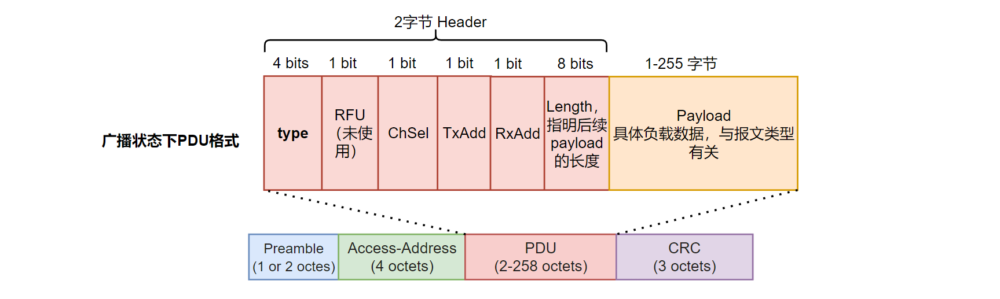

本文描述 BLE 链路层连接的建立。

<!--more-->

***

- 本系列文章，基于`nordic nrf52840` MCU，来实现一个精简的 BLE 从机协议栈。
- 已经实现的协议栈地址：[https://github.com/fengxun2017/dh_ble/tree/dev](https://github.com/fengxun2017/dh_ble/tree/dev)，目前在dev分支进行更新开发。早期是基于`nrf51822`实现了`BLE 4.0`规范中从机协议栈中的必要部分，实现了可以和手机连接并传输数据。目前手上只有`nrf52840`了，当前基于`nrf52840`实现底层需要的驱动，并通过该系列文章，逐步修改一些上层不合理的地方。
- 该系列文章，涉及到的协议部分会基于`BLE 5.3`规范进行描述，但仍旧只实现**最简单、必要**的部分（能连上手机，进行通信即可），并基于`iphone`进行测试。因此，`android`可能会由于发送一些我没实现的指令，出现兼容性问题。
- 本系列文章，只是用来作为学习 BLE 协议的参考，从硬件层驱动，链路层，到上层协议，都以最直接，简单的方式来实现。

 

**因为我们实现的是从机协议栈，因此本文介绍的链路层连接建立过程，都是基于从机角度来描述的。**

#### 1：连接的创建

在[链路层广播状态机实现](https://fengxun2017.github.io/2023/04/24/BleStack-link-advertising/)一文中，我们介绍了设备在每次再某个通道广播一个数据包后，都会在当前通道上再监听一会（IFS=150us），看是否有设备发起连接请求，如下图所示：

PS：图中的T_IFS表示帧间间隔（150us）

在上图中，设备在 38 通道广播完数据包后，监听到了连接请求数据包，则设备**进入连接态**，并作为从机角色（或称为Peripheral）。

需要注意的一个概念是：在BLE协议中，对于连接发起端的设备，只要它发出了连接请求指令（ CONNECT_IND），就认为设备就进入了**连接创建**状态，并作为主机角色（或称为Central）；对于被连接的设备，只要它接收到了连接请求，就认为设备进入了**连接创建**状态，并作为从机角色（或称为Peripheral）。

为了更详细的了解BLE连接相关内容，有必要详细介绍连接请求（CONNECT_IND）中的内容。在文章[BLE链路层包格式](https://fengxun2017.github.io/2023/04/03/BleStack-link-packet/)中，我们介绍了BLE广播通道的空中数据包的基本形式，如下图所示：（不考虑 LE Coded和 CTE）

连接请求指令（CONNECT_IND）是在广播通道下发送的，所以其数据包结构和上图一致。对于连接请求，则 `type` = CONNECT_IND(4bits值为：0101)，`Payload` 中包含了 CONNECT_IND 的具体信息，CONNECT_IND完整的数据包内容如下图所示：
