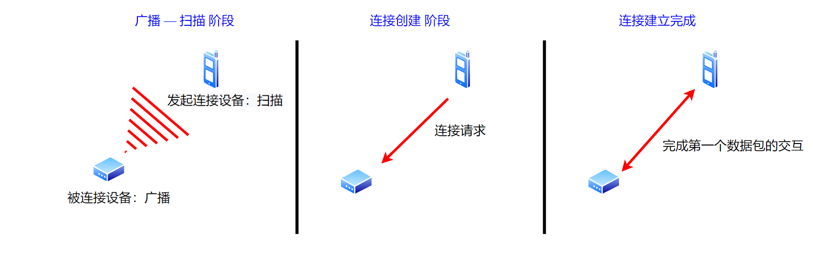
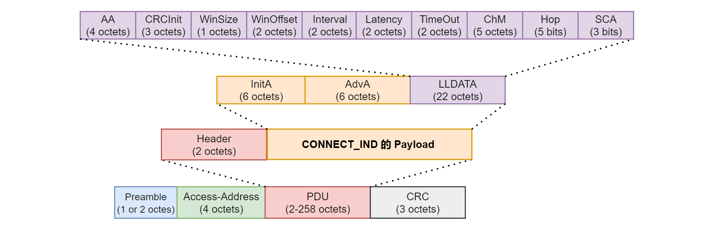
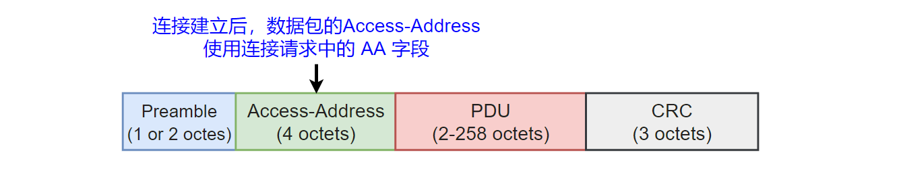
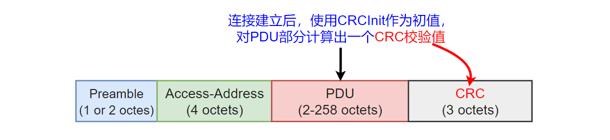
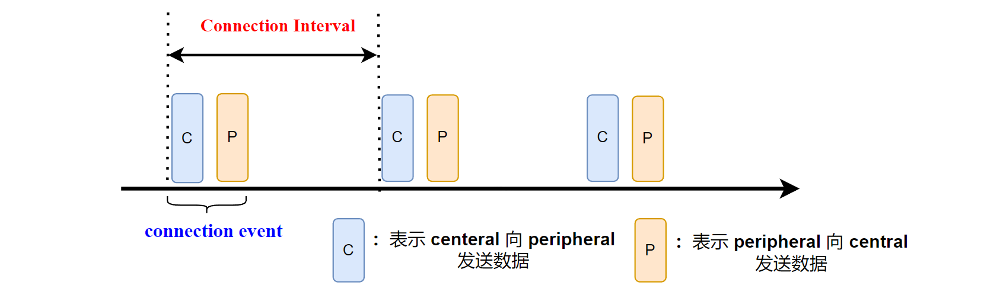
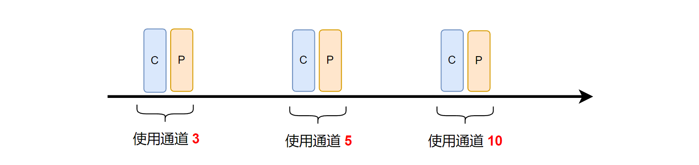

本文描述 BLE 链路层连接的建立过程。

<!--more-->

***

- 本系列文章，基于`nordic nrf52840` MCU，来实现一个精简的 BLE 从机协议栈。
- 已经实现的协议栈地址：[https://github.com/fengxun2017/dh_ble/tree/dev](https://github.com/fengxun2017/dh_ble/tree/dev)，目前在dev分支进行更新开发。早期是基于`nrf51822`实现了`BLE 4.0`规范中从机协议栈中的必要部分，实现了可以和手机连接并传输数据。目前手上只有`nrf52840`了，当前基于`nrf52840`实现底层需要的驱动，并通过该系列文章，逐步修改一些上层不合理的地方。
- 该系列文章，涉及到的协议部分会基于`BLE 5.3`规范进行描述，但仍旧只实现**最简单、必要**的部分（能连上手机，进行通信即可），并基于`iphone`进行测试。因此，`android`可能会由于发送一些我没实现的指令，出现兼容性问题。并且由于没有充分的错误场景测试，一些实现本身可能存在缺陷。
- 本系列文章，只是用来作为学习 BLE 协议的参考，从硬件层驱动，链路层，到上层协议，都以最直接，简单的方式来实现。

 

**我们实现的是从机协议栈，因此本文介绍的链路层连接建立过程，都是基于从机角度来描述的。本文也只讨论最常见的，普通广播状态下，接收到连接请求（CONNECT_IND）后，连接的建立过程**

#### 1：连接建立的总体过程：
一个简单的`BLE`连接建立的过程，可以大致分为 3 个步骤：
- 被连接的设备向外广播，发起连接的设备扫描。
   
- 发起连接的设备发送连接请求，被连接的设备收到连接请求。此时两个设备都进入了连接态，并且认为连接**已创建**。
   
- 在规定的时间内，成功交互了第一个数据包，则连接正式**建立**。
  
如下图所示：

上一篇文章 [链路层广播状态机实现](https://fengxun2017.gitee.io/2023/04/24/BleStack-link-advertising/) 已经详细描述了连接前的广播状态。
本文，我们详细介绍，连接创建 和 连接建立 的过程。

#### 2：连接的创建（created）

在[链路层广播状态机实现](https://fengxun2017.github.io/2023/04/24/BleStack-link-advertising/)一文中，我们介绍了设备每次在某个通道广播一个数据包后，都会在当前通道上再监听一会，看是否有设备发起连接请求（或扫描请求），如下图所示：

PS：图中的T_IFS表示帧间间隔（150us），按照规范定义，连续的两个空中数据包，应该间隔IFS=150us。

在上图中，设备在 38 通道广播完数据包后，监听到了连接请求数据包，则设备**进入连接态**，并作为从机角色（或称为Peripheral）。

需要注意的一个概念是：在BLE协议中，对于连接发起端的设备，只要它发出了连接请求指令（ CONNECT_IND），就认为设备就进入了**连接创建**状态，并作为主机角色（或称为Central）；对于被连接的设备，只要它接收到了连接请求，就认为设备进入了**连接创建**状态，并作为从机角色（或称为Peripheral）。

为了更详细的了解 BLE 连接相关内容，有必要详细介绍连接请求（CONNECT_IND）中的内容。在文章[BLE链路层包格式](https://fengxun2017.github.io/2023/04/03/BleStack-link-packet/)中，我们介绍了BLE广播通道的空中数据包的基本形式（LE Uncoded），如下图所示：（不考虑 LE Coded和 CTE）

连接请求指令（CONNECT_IND）是在广播通道下发送的，所以其数据包结构和上图一致。对于连接请求，上图中的 `type` = CONNECT_IND(4bits值为：0101)，`Payload` 中包含了 CONNECT_IND 的具体信息，CONNECT_IND完整的数据包内容如下图所示：

**PDU**中的 **Header** 所包含的各个字段的含义，在文章[BLE链路层包格式](https://fengxun2017.github.io/2023/04/03/BleStack-link-packet/)中已介绍，这里我们详细介绍一下 连接请求（CONNECT_IND）负载数据（Payload）中的各个字段的含义。

首先，连接是在两个设备之间建立的，所以 **Payload** 的前2个字段分别是：连接发起方的设备地址，以及被连接目标的设备地址。 
之后便是本次连接所使用的连接相关的具体参数 **LLDATA**，包含如下信息：
- AA：该值会作为后续连接状态下，数据包中的`Access Address`：
  
  PS：基本的广播数据包中的 `Access Address`，会使用固定值`0x8E89BED6`。而连接状态下的数据包中的`Access Address`，则是连接发起方发起连接请求时，按照规范定义的规则生成的。
   
- CRCInit: 广播状态下，在计算数据包最后的`CRC`校验值时，使用的`CRC`初值为固定值0x555555。而连接创建后，主/从设备后续的数据包在计算`CRC`校验值时，初始值会使用**CONNECT_IND中**的这个CRCInit：
  
  PS：CRC校验值，是通过硬件移位寄存器结构来实现的，所以寄存器中需要有确定的初始值。
   

- WinSize，WinOffset：这两个值与连接请求发出后，双方设备之间的第一次握手（数据包交互）有关，后文详细介绍。
   
- Interval：连接间隔参数。`BLE`在底层是周期性地交互数据，每次连接间隔到期时，两个设备进行数据交互。`BLE`规范将这个数据交互动作定义为连接事件（**connection event**）
  
  PS：上图中，每个连接事件里，两个设备只相互发了一包数据，实际上一个连接事件中是可以相互发送多包数据的。
   
  
- Latency：该值是用来控制主从设备在连接后，当链路空闲（无数据需要传输）时，进一步降低主从设备之间的交互频率，从而进一步降低设备功耗。关于空闲时减少交互频率的特性，`BLE4.x`时代的该特性和当前`BLE5.3`已经存在很大区别。详细内容后续会针性的对写一篇文章。
 
- TimeOut：连接监控超时。`BLE`连接可能会因为设备离开连接范围，或电池耗尽等原因中断（没有预先的警告）。因此，`BLE`在链路层需要有一个监控定时器，来监控多久没有收到对方发送过来的一个有效包了，当这个时间超过TimeOut，则认为连接断开了。
  PS：因此，两个连接的`BLE`设备，即使没数据需要发送，也要相互发送空包（协议栈内部自己负责发送空包），以维持连接的存在。
   
-  ChM， Hop：为了减少空中信号的相互干扰（区域内可能存在多个使用2.4G信号的设备），`BLE`在连接过程中是不断跳频通信的。两个设备连接后，每次交互（连接事件）使用的信道都是不同的，如下图所示：
  
  这就需要设备在运行过程中，不停计算下一次交互使用的信道，而ChM，Hop 参数就与计算下一次使用通道的算法有关。这部分内容也比较细，后面再单独写一篇文章。
   

- SCA：主机的时钟精度。时钟精度会影响设备的唤醒监听策略，这部分在之前的文章:[基础概念和硬件驱动实现](https://fengxun2017.gitee.io/2023/03/25/BleStack-hardware-driver/#2%E2%80%94%E2%80%94%E5%AE%9E%E7%8E%B0%E4%B8%AD%E7%9A%84%E4%B8%80%E4%BA%9B%E7%BB%86%E8%8A%82%E9%97%AE%E9%A2%98) 中有相关介绍。

#### 3：连接的建立（established）

**连接创建**可以认为是一个中间状态，此时，连接还未真正**被建立（established）**。只有当两个设备，收到了对方的第一个数据包后，才认为这个**连接真正建立**了。

因此，核心问题即为：连接创建后，第一次数据交互是在什么时候？
上一节，我们提到了连接请求（CONNECT_IND）中的两个参数**WinSize，WinOffset**，这两个参数就是用来定义连接创建后第一次数据交互（连接事件）的时机。

第一次数据交互的时序如下图所示： 时序图来自规范V5.3

其中，**C->P**表示central发送给peripheral的数据包。**P->C**表示peripheral发送给central的数据包。

如上图，当主机（central）发出连接请求后，主/从设备第一次交互（连接事件）过程为：
- 首先经过一个固定的延迟 transmitWindowDelay（1.25ms）
- 再经过一个延迟 transmitWindowOffset （由CONNECT_IND中的 **WinOffset** 决定）
- 之后是一个 Transmit Window，central的第一个数据包在这个窗口内发出即可，窗口大小为 transmitWindowSize（由CONNECT_IND中的 **WinSize**决定）。
  
由于 Transmit Window 的存在，从机（peripheral）接收到第一个数据包的时间是不确定的。因此，从机需要在 transmitWindowDelay + transmitWindowOffset 之后一直保持监听，直到收到central发送过来的第一个数据包。 即：
 transmitWindowOffset <= **first pack time** <= transmitWindowOffset + transmitWindowSize。
 当完成第一次数据交互后，后续的交互都按照连接间隔（connection interval）周期进行。

上文提到的：
- transmitWindowDelay = 1.25ms是规范定义的数值 （**不讨论使用AUX_CONNECT_REQ发起连接的情况**）
- transmitWindowOffset = 
WinOffset * 1.25 ms，这里的 WinOffset 就是连接请求（CONNECT_IND）中的 **WinOffset**。
- transmitWindowSize = 
WinSize * 1.25 ms，这里的 WinSize 就是连接请求（CONNECT_IND）中的 **WinSize**。

#### 4 具体实现

在源码文件 source/BleStack/BleLink/BleLinkAdvertising.c 中，函数 `HandleAdvRxDone` 会处理广播状态下接收到的数据（扫描请求 或 连接请求）。
当收到连接请求后，函数 `HandleAdvRxDone` 内部会调用source/BleStack/BleLink/BleLinkConnect.c 中的 `LinkConnReqHandle` 函数来处理连接请求。

如同前文所述，完整的连接建立过程，需要经过多个阶段，因此链路层连接态下也需要实现一个子状态机，来处理连接建立过程中的各个阶段，下一篇文章再继续介绍。

  

