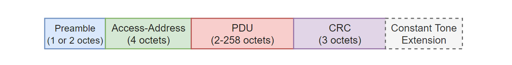
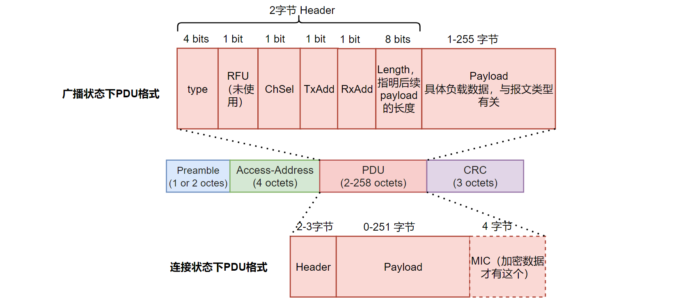
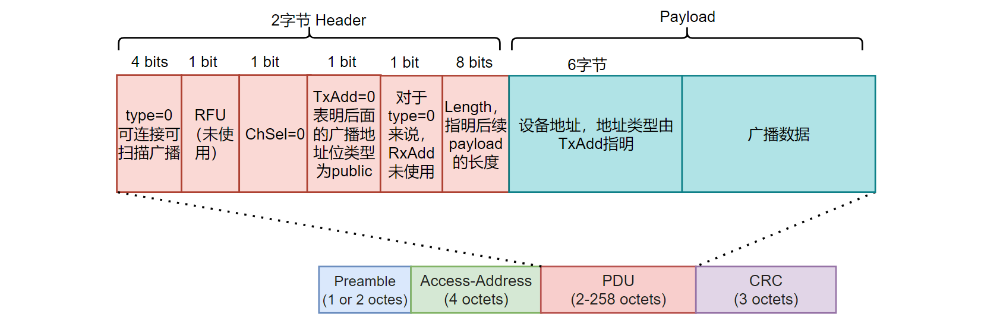
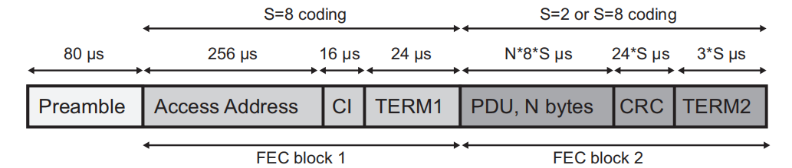
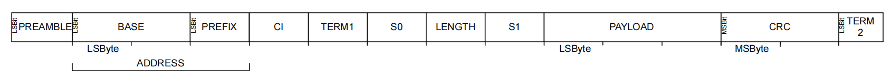
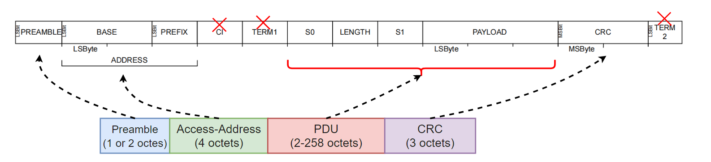

本文描述 BLE 链路层数据包的具体格式，并解析如何在 nordic nrf52840 硬件上配置 BLE 数据包。

<!--more-->

***

- 本系列文章，基于`nordic nrf52840` MCU，来实现一个精简的 BLE 从机协议栈。
- 已经实现的协议栈地址：[https://github.com/fengxun2017/dh_ble/tree/dev](https://github.com/fengxun2017/dh_ble/tree/dev)，目前在dev分支进行更新开发。早期是基于`nrf51822`实现了`BLE 4.0`规范中从机协议栈中的必要部分，实现了可以和手机连接并传输数据。目前手上只有`nrf52840`了，当前基于`nrf52840`实现底层需要的驱动，并通过该系列文章，逐步修改一些上层不合理的地方。
- 该系列文章，涉及到的协议部分会基于`BLE 5.3`规范进行描述，但仍旧只实现**最简单、必要**的部分（能连上手机，进行通信即可），并基于`iphone`进行测试。因此，`android`可能会由于发送一些我没实现的指令，出现兼容性问题。并且由于没有充分的错误场景测试，一些实现本身可能存在缺陷。
- 本系列文章，只是用来作为学习 BLE 协议的参考，从硬件层驱动，链路层，到上层协议，都以最直接，简单的方式来实现。

**我们目前没有实现定期广播（Periodical Advertising），后文不描述定期广播相关部分。只实现一些必备的简单广播/连接指令。也不涉及为 LE Audio 而设计的同步通道（ Isochronous Channels ）相关信息**。

#### 1——BLE 链路层数据包基本形式（LE Uncoded）：

BLE 链路层数据包的基本格式（LE Uncoded）如下所示：

数据包最后的 `Constant Tone Extension`是可选的，与蓝牙5.1新增的方向测量，到达角（AoA）和出发角（AoD）相关，[参考官网信息](https://www.bluetooth.com/blog/new-aoa-aod-bluetooth-capabilities/)。基于这个方向信息，可以实现定位功能。定位的大体逻辑为：
基于AoA的定位方案：发送端（需要被定位的目标设备）使用单一天线发送信号，接收端（基站）使用天线阵列，接收端根据天线阵列接收到信号的相位差，来计算出信号的方向。应用场景中存在多个固定的接收信号终端（基站），汇聚每个接收终端的方向信息，信号强度信息，可以定位到发射信号的目标设备。
基于AoD的定位方案：与AoA相反，基站（天线阵列）发射信号，待定位的目标设备（单一天线）接收，目标设备通过接收到的信号判断信号发射方向，实现定位。即带定位的目标设备需要内置位置解算算法。

我们不实现蓝牙方向测量相关的部分，所以本文以及后续系列文章都不讨论`CTE（Constant Tone Extension）`，文章后面的配图也不再包括`CTE`部分

**前导（preamble，1或2字节）**：

接收信号的硬件接收机，会使用前导进行频率同步，同时，前导序列还会用于进行自动增益控制，对接收到的信号进行调整，使其适用于接收机的工作范围内（例如，对弱信号保持增益，对强信号减小增益）。

当 radio的发送速率为1Mbit/s时，前导为1字节。
当radio发送速率为2Mbit/s时，前导为2字节。

前导的内容是交替的0和1序列。
因为数值是固定的，在`nordic radio`中不需要设置它的值，只需要设置`MODE`寄存器，来配置radio发送速率，并根据配置的发送速率，设置`PCNF0`寄存器配置前导的长度即可（1或2字节），硬件会根据后续的`access address`来自动配置前导是序列0101...，还是序列1010...
`我们的实现中，简单起见，直接配置死为 1M bit/s的发送速率，不考虑支持 2M bit/s 的发送速率。`

**接入地址（access address，4字节）**：

前导只有1字节（1Mbit/s发送速率时），背景辐射的随机噪声刚好和**1 字节前导**序列相同的概率还是比较高的，因此接入地址的存在进一步减少了随机噪声误识别的概率。

对于普通广播来说，接入地址是固定的 (0x8E89BED6)
对于连接来说，接入地址是连接发起方在发起连接时，放在连接参数中的。

所以，对于我们要实现的从机协议栈来说，当我们广播时，我们就将接入地址配置为固定值（0x8E89BED6）.
当我们被连接时，从连接发起方的连接请求中获得接入地址，然后配置到硬件寄存器中。（连接发起方，每次发起建立连接请求时，会按照一定规则随机生成一个）

**协议数据单元（PDU）**
协议数据单元，顾名思义就是其内容和协议相关。下文我们只站在实现`peripheral`协议栈的角度来描述相关信息。

 广播状态下数据包，和连接后的数据包，它们的 PDU内容存在差别，如下图所示：

连接状态下，数据包中PDU信息较多，这里暂不介绍，后续文章具体实现链路层连接状态时再详述。

广播状态下的PDU，有2个字节的`Header`和具体的负载数据构成。`Header`中包含的信息有：
**type：** 报文类型，例如可连接广播，不可连接广播。
**RFU：** 表示目前未使用，留待以后协议规范更新后可能新增其它特性。
**ChSel：** BLE5.0 新增了低功耗通道选择算法#2（ LE Channel Selection Algorithm #2），该位就是指示是否支持这个新的通道选择算法。 这个算法更复杂，我们不实现这个通道选择，只支持以前的 Algorithm #1，实现中我们会配置为 ChSel = 0
**TxAdd，RxAdd：** 如果后面的 payload 中携带了地址信息，TxAdd/RxAdd指明发送/接收地址的类型（0表示public，1表示random ）
**length：** 表明后面的 payload 长度
**payload：** 根据type而定，例如type=0（表示可连接可扫描的普通广播）时，payload中的数据就是设备地址+广播数据。如下图所示：

**循环冗余校验（CRC）**：
发送数据时，需要计算CRC，并和数据一起发送。
接收到的数据，CRC校验通过后，才会进行后续处理。

CRC是通过线性反馈移位寄存器来生成的，BLE 规定的生成多项式为：x^24 + x^10 + x^9 + x^6 + x^4 + x^3 + x + 1，其二进制表示为：1 0000 0000 0000 0110 0101 1011 -> 0x100065B。
因此，对于我们实现来说，需要配置 CRC 的生成多项为上述值。此外，还需要配置CRC的初始值。
广播时，CRC初始值为固定的 0x555555。
连接时，连接发起方发送的连接请求中，会包含参数`CRCInit`，将该值配置到硬件CRC初始值寄存器中即可。

#### 2——LE Coded 格式链路层数据包：
BLE 5.0后新增了长距离（Long Range）传输特性，通过前向纠错编码（Forward Error Correction）实现低速率下更远距离的通信。
该特性本质是通过向数据中插入额外的冗余数据，使得一些传输错误，可以被恢复（例如，假设二进制信号"1"经过编码后变为"1111"，那么对方收到"0111"，"1011，""1101"，"1110"都可以认为实际数据是"1"。等于是通过发送原始数据4倍大小的数据，来实现一定的纠错能力）。

使用长距离特性时，链路层数的数据具有特定的包格式（LE CODED）：

图片来自蓝牙核心规范

与 LE Uncoded相比，多了**编码方案指示（CI）**，以及两个终止序列**TERM1和TERM2**(均为3个连续的0)。
**需要注意的是，启用 LE Coded 编码，来实现长距离传输时，底层的Radio 发射速率只能为 1Mbit/s。**

上图中：
S=8 表示1bit真实数据，经过冗余编码后变为8bit
S=2 表示1bit真实数据，经过冗余编码后变为2bit
例如，上图中 Access Address 是四字节（32bit），LE Coded格式下，必须使用 s = 8编码，则编码后变为32*8=256bit，Radio发射速率又是 1Mbit/s，因此需要 256us。

我们不实现 LE Coded 编码的数据格式，后续也不再描述相关信息。

#### 3——如何在 Nrf52840 上配置 LE Uncoded 格式数据。

nrf52840 Radio的数据包格式如下图所示：

图片nrf52840数据手册

nrf52840 radio的包结构，是兼容 LE Uncoded格式以及 LE Coded格式。
我们只实现 LE Uncoded格式，并且只支持BLE 1Mbit/s 的发送速率（需要配置nrf52840 radio的 MODE寄存器）。
CI，TERM1，TERM2 字段是 LE Coded 格式下才有的，我们不需要它们。在nrf52840 radio的默认配置下， CI，TERM1，TERM2的长度都是0。所以不需要配置，默认情况下就是没有它们的。
其它对应关系如下图：

其中， nrf52840 radio 包结构中的 PREAMBLE 就是BLE中的`Preamble`。我们只实现 LE Uncoded格式，并且只支持BLE 1Mbit/s的发送速率，因此 nrf52840 的 PREAMBLE 长度配置成 1字节即可。其值不需要配置，硬件会自动生成。

nrf52840 radio 包结构中的BASE（3字节）和PREFIX（1字节）共同构成了BLE中的`Access-Address`。

nrf52840 radio 包结构中的 S0，LENG，S1三部分构成了 `PDU` 中的`Header`部分（见上一节PDU的图），`Header`只有在蓝牙方向测量（AoA，AoD）应用中才会是三字节，其它情况都是2字节。我们不实现蓝牙寻向相关功能。
因此，实现时，将nrf52840 radio包的 **S1 长度配置为0**。S0 和 LENGTH 长度配置为1，构成了`PDU`中的`Header`。

nrf52840 radio 包结构中的PAYLOAD，即为 `PDU`中的`payload`。

最后的CRC，即为BLE 包最后的CRC。
在nrf52840 radio中，我们需要配置 CRC 长度为3字节，还需要配置其生成多项式，以及初值（如第一节中所述）。
**注意**：BLE中的 `CRC` 只计算`PDU`部分的数据，nrf52840默认是会将前面的ADDRESS包含在内，所以需要配置让其跳过ADDRESS部分

字段配置完后，剩下的就是发送顺序问题：
对于多个字节的字段，例如，广播的`Access-Address`为0x8E89BED6，这4个字节是先发送高位字节（0x8E）还是先发送低位字节（0xD6）？。
对于单个字节，例如 0xD6（1101 0110），这8个bit是先发送高位bit还是先发送低位bit？

BLE 规范定义，对于多字节字段，除了CRC，以及消息完整性校验（MIC,链路加密后，PDU中才会有这个，如第一节图中所示，后续到加密相关再介绍），都**先发送低位字节**。
对于单个字节来说，除了CRC三个字节，其它都按**最低 bit 先发送**。

对于 nrf52840 radio的设置，Preamble，Access-Address，以及CRC，这三个部分，硬件会自动按 BLE 规范处理发送顺序。
我们需要配置PDU部分（nrf52840的 S0，LENGTH，PAYLOAD）的发送序，需要通过PCNF1寄存器将其配置为先发送最低位。

数据的格式，空中发送顺序都处理完后，还剩最后一步，发送前的数据白化（WHITENING）。
数据白化的作用： BLE 使用频移键控，其特性是接收连续的相同bit流（例如"0000000000000"）能力比较差。而数据白化，就是对原始信息就行一定随机化，避免了连续的相同bit流。 BLE 的白化也是通过线性反馈移位寄存器来生成的，因此也有两个参数，生成多项式和初值。

对于nrf52840 radio，生成多项式硬件自己处理好了，不需要配置，我们只需要配置初始值。而初值，就是当前使用的信道编号（BLE的 0-39信道）。

综上，就是 nrf52840 radio BLE相关的设置方式。更具体的寄存器配置可以参考[nrf52840/NrfRadioDrv.c](https://github.com/fengxun2017/dh_ble/blob/dev/source/ChipDrv/NrfDrv/nrf52840/NrfRadioDrv.c)以及[NrfDrv/NrfRadioDrv.h](https://github.com/fengxun2017/dh_ble/blob/dev/include/ChipDrv/NrfDrv/NrfRadioDrv.h)

#### 参考资料：
【1】[https://www.bluetooth.com/blog/new-aoa-aod-bluetooth-capabilities/](https://www.bluetooth.com/blog/new-aoa-aod-bluetooth-capabilities/)