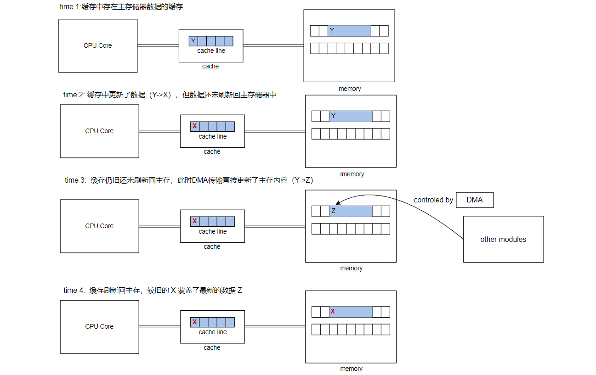
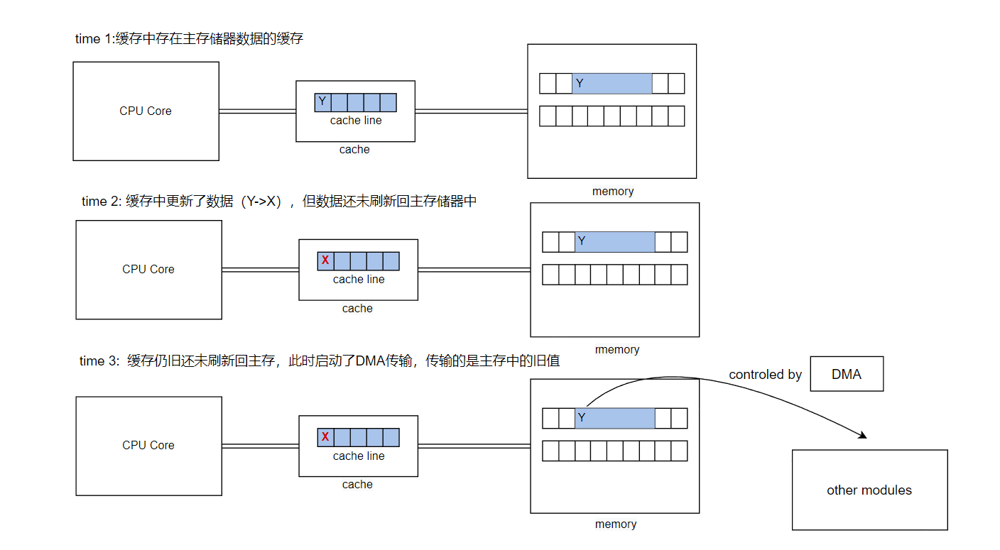
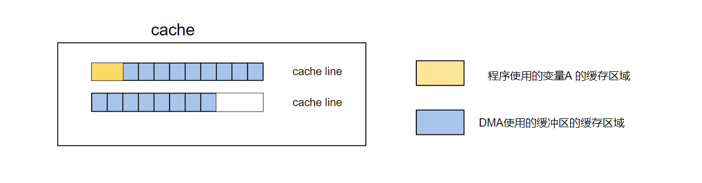

[A guide to using Direct Memory Access in Embedded Systems – Part Two](https://pebblebay.com/a-guide-to-using-direct-memory-access-in-embedded-systems-part-two/) 翻译笔记

<!--more-->

***
[前文](https://fengxun2017.gitee.io/2024/02/28/DMA-guide-to-use-partone/)介绍了DMA的重要性，以及如何在系统中使用DMA。

本文讨论使用DMA时可能出现的一些问题，以及需要做些什么来有效地处理这些问题。

#### 缓存一致性（Cache Coherency）
在具有数据缓存功能的处理器上，使用DMA的副作用是缓存的内容可能不再与主存一致，这可能导致数据损坏问题。与任何内存损坏问题一样，这些问题很难追踪，因为系统的行为可能无法预测。

当DMA传输改变了处理器缓存所对应的主存储器中的内容时，就会出现上述问题。此时，存储在缓存中的数据是先前的值，当缓存被刷新时，陈旧的数据将被写回主存，覆盖DMA更新过的数据。最终导致主存中的数据不正确。如下图所示：

从主存向外进行传输也会出现类似的问题。如果处理器更新了缓存中的数据，则缓存中的新值将与主存（该缓存对应的主存位置）中的值不同，直到缓存数据被刷新回主存。如果在缓存数据刷新回主存之前，DMA传输将主存数据作为源地址传输，那么使用的就是旧数据，而不是处理器更新的数据。如下图所示：

一些系统硬件设计包含了一种称为总线嗅探或缓存嗅探的机制。当外部DMA传输使用的主存地址已经被缓存时，嗅探硬件会感知到，并执行缓存刷新或使缓存无效，以便DMA传输正确的数据，并相应地更新缓存项的状态。在具有嗅探功能的系统中，DMA驱动程序不必担心缓存一致性。

当硬件系统没有嗅探功能机制时，基于DMA的设备驱动程序通常使用下面两种技术来避免缓存一致性问题。

第一种方案是，确保数据缓冲区是从内存的不可缓存区域分配的，或者被处理器的内存管理单元标记为不可缓存。这可以极大简化软件设计，因为在向非缓存内存传入/传出时不会出现缓存一致性问题。这种情况下，为了尽量减少对缓存安全缓冲区（不可缓存）之间的执行拷贝操作（不可缓存，访问相对效率变低），驱动程序可能不得不将其缓冲区借给应用程序（避免拷贝操作）。这可能会使驱动程序API复杂化，并且可能涉及到内核和应用程序软件位于不同虚拟地址空间的操作系统上的复杂的内存映射操作。

第二种方案是，设备驱动程序根据传输方向，显式的刷新数据（cache数据更新到主存）或使数据缓存（cache）无效。这种方案也会使软件复杂化，并导致更多的缓存和主存之间的传输，但允许应用程序使用任何可以使用的主存作为数据缓冲区（即使它们具备可缓存特性）。

需要注意的是，除了确保数据缓冲区本身与缓存保持一致性外，驱动程序还必须确保控制结构和DMA描述符列表也与缓存一致。这是因为设备可以使用DMA事务来获取DMA传输属性以及传输应用程序数据——这是使用链式DMA时的常见情况。

#### 地址转换（Address Translation）
设备驱动程序必须正确处理的另一个问题是在使用内存管理单元（MMU）的系统上进行地址转换。MMU管理对处理器地址空间的访问，该地址空间被视为一系列页面，通常大小为4KB。在为不同进程提供虚拟地址空间的操作系统中，MMU用于将应用程序或内核软件使用的虚拟地址映射到处理器物理地址空间中的内存页。

支持DMA的设备通常处理的是物理地址，它们在寻址内存时绕过MMU。而软件层面引用内存时使用的是虚拟地址（包括内核地址空间和应用程序地址空间）。一些外围总线（如PCI）上的总线控制设备使用特定于总线的地址识别内存位置。这意味着处理器地址空间中的单个物理内存位置可以通过其物理地址、应用程序虚拟地址、内核虚拟地址或特定于总线的地址来引用。

此外，由应用程序分配的连续缓冲区，可能实际映射到不连续的多个实际物理页。要设置到该缓冲区的DMA传输，设备程序需要：
- 构建一个分散聚合表，将组成数据缓冲区的不连续物理页链接在一起。
- 将各个页面的地址（虚拟地址）转换为物理地址。
- （对于PCI设备）将物理地址转换为设备可以处理的PCI总线地址。
- 根据需要使用物理地址或特定于总线的地址创建DMA描述符列表。
- 使用DMA描述符列表来编程配置DMA控制器或设备。

在实际使用中，通常会比上述过程更简单，因为许多操作系统会提地址转换接口或宏，以帮助设备驱动程序从给定的虚拟地址获得对应的实际物理地址，从物理地址到总线特定的地址，或反之。

#### 缓冲区对齐（Buffer Alignment）
DMA硬件通常需要数据缓冲区或控制结构位于特定地址边界（8，16，32等的倍数）的内存中。这样可以简化硬件设计，特别是当数据以突发模式传输时。

如果设备驱动程序负责分配数据缓冲区，这通常不是问题，因为底层实现中一般有标准接口（如memalign()），返回与给定地址边界对齐的内存。如果由应用程序提供缓冲区，则该缓冲区可能不是正确对齐的。除了强制应用程序使用严格的对齐缓冲区外，对于这类问题还有两方可能的解决方案：
- 最简单的方式是，将数据从未对齐的用户缓冲区复制到DMA操作期间访问的临时缓冲区（设备驱动根据DMA特性临时分配的对齐缓冲区）。但是，根据数据缓冲区的大小和传输频率，该解决方案可能会增加大量额外的处理工作，并减少使用DMA带来的性能收益。
- 另一种解决方案是，使用编程I/O（programmed I/O）的方式来传输缓冲区中未对齐的部分。然后，剩余对齐的数据使用DMA进行传输。不过，硬件特性可能也会要求DMA传输数据量（缓冲区大小）是突发大小的整数倍，这种情况下，软件还必须使用编程I/O方式来传输剩余的数据。

前文已经讨论过缓存一致性的问题，需要注意的是不正确的缓冲区对齐也可能引起缓存一致性问题。当用于DMA传输的数据缓冲区与其它程序数据共享缓存行（cache line）时，就会发生这种情况。考虑这样一种情况：程序使用的变量（变量A）与作为DMA传输目的地的缓冲区的一部分位于同一行缓存行中。如下图所示：

这样情况下，当应用请求DMA传输，然后更新变量A，这通常会更新缓存中（变量A）的值，但不会立刻更新主存中的值（write-back写回策略）。在DMA 传输结束时，DMA控制器驱动程序使缓存无效，以避免程序继续使用缓存中的旧值（目的缓冲区在主存中已经被DMA更新了，缓存中的为旧值）。
此时，主存包含来自DMA传输的新的缓冲区数据，以及程序使用的（变量A）过期值。由于缓存行已经被无效了，当程序下一次访问该变量时（变量A），主存中的旧值会被加载到缓存中，即之前程序更新的变量值丢失了。此问题的简单解决方案是，确保用于DMA的缓冲区的大小是缓存行大小（通常为32或64字节）的倍数，并且该缓冲区地址与缓存行大小边界对齐。

#### 缓冲区位置（Buffer Location）
在32位处理器系统上，主存地址范围通常为0到4GB。来自因特尔和飞思卡尔的较新处理器支持36位寻址模式，使系统拥有远超4GB的内存。集成到这些处理器中的DMA控制器被设计用来处理扩展的地址范围，但是外部控制器或总线主控设备可能仍然限制在32位地址范围内。这意味着它们不能直接对超过4GB 地址边界的内存位置进行DMA存取。一些系统中，如Linux或Windows，通过在32位地址空间中使用中间缓冲区，并在它们与4GB地址边界以上的用户缓冲区之间复制数据来处理此问题。这虽然简化了设备驱动程序软件，但可能会造成严重的性能损失。

#### DMA的调试问题（Debugging problems with DMA）
在编写依赖DMA传输的软件时，存在很多陷阱。如果原地址或目的地址设置不正确，或者缓冲区未对齐，则传输可能无法完成，或者将数据传输到内存中的错误位置。这些问题可能很难解决，因为传输的一端通常是总线上的外设或存储器，不容易检查。如下的一些技巧可以对排查问题提供线索：
- 专用的DMA控制器和其它支持DMA的设备，通常会提供状态寄存器和错误中断，如果发生错误，可以通知软件。当错误发生时，状态寄存器可以给出传输计数、源地址和目的地址。还可能存在特定于总线的协议寄存器，它可能显示DMA传输是否由于总线错误而终止，例如由于访问不对齐。
- 总线分析仪也是跟踪DMA错误的有用工具，它们可以显示处理器和外设之间的地址和数据总线上发生的情况。还可以将它们设置为触发和捕获在总线上预期地址窗口之外发生的事务，这有助于限制捕获的数据量和需要分析的数据量。
- 如果外围设备在FPGA中实现，工具供应商可能会提供分析工具和软件，允许检查内部FPGA寄存器和内存块，甚至捕获外部接口信号上发生的事情。在确定为什么传输会提前终止或数据实际流向何处时，这些信息非常重要。

*** 

**参考连接**：
[https://pebblebay.com/a-guide-to-using-direct-memory-access-in-embedded-systems-part-two/](https://pebblebay.com/a-guide-to-using-direct-memory-access-in-embedded-systems-part-two/)