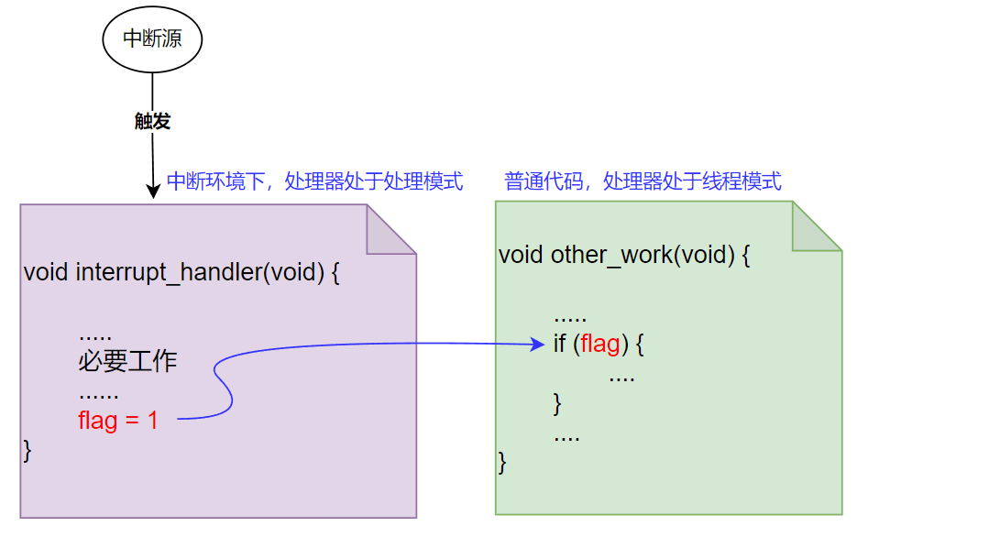
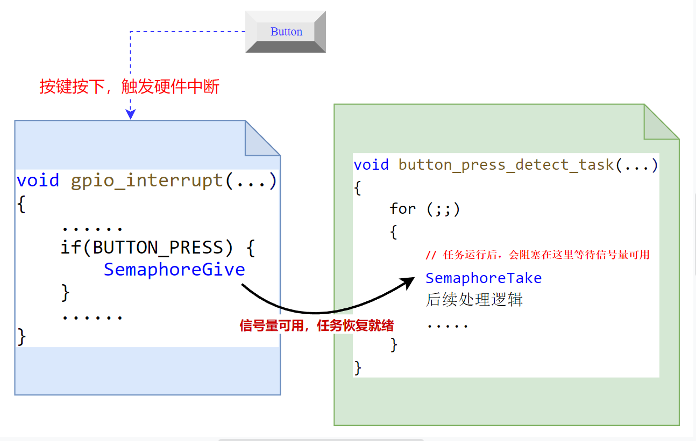
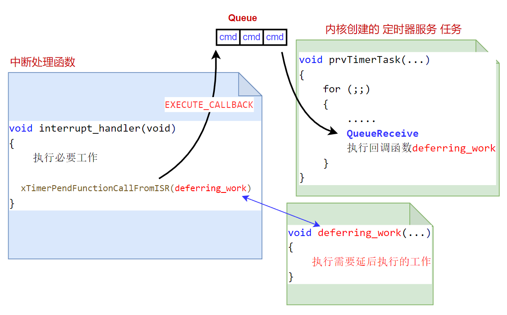

<center>

嵌入式开发中的一个基本共识是，不能在中断处理函数中做耗时的工作。中断函数中应该只处理最紧急的工作，剩下的工作应该放到线程模式（执行普通代码的模式）下运行。FreeRTOS提供的`延后执行`功能，就是针对这种需求设计的。

</center>
<!--more-->

***

中断机制的存在是为了处理一些紧急请求，如外部数据到来，用户按键等，这些请求都是需要立刻处理的。

如串口数据接收中断，如果我们在串口中断处理函数中提取接收到的数据后，进一步执行更复杂的应用数据分析等工作，那么这段时间内，由于一直处于中断上下文中，其它较低优先级的中断以及当前的串口中断再次发生时，就无法得到及时处理（只有当前中断函数退出后，才会执行其它中断处理函数）。甚至，如果处于中断上下文中的时间太长，会导致丢失掉某些中断事件（期间某个中断A 发生了多次，但无法得到处理，由于硬件上中断悬起标记只有一位，只能表示发生了中断，无法得知发生了几次，那么当前中断结束后，只会调用一次中断A的处理函数。），或者丢失掉一些数据（例如，未使用串口的硬件流控机制时，如果串口中断处理函数耗时太久，cpu不能及时将接收到的数据从串口硬件缓存中提取出来，那么连续发送数据时就会存在丢失的情况）。

因此，实际应用中，中断处理函数中只做一些必要的工作，其它耗时操作会延后到退出中断后再执行。 裸机程序通常会使用一个标记，来表明是否发生了某个中断需要处理。如下图所示：


如此，我们既完成了中断触发后，所需要做的所有工作（紧急的工作中断函数中做，次要的延后到退出中断函数后再做）。同时，由于及时退出了中断处理函数，这样就可以尽最大可能避免影响其它低优先级的中断（无论中断优先级高低，处理中断都比普通代码执行的工作更重要，因此应该尽最大可能避免高优先级中断影响低优先级中断）。


但如上文逻辑程序中，使用 flag 标记的方法并不优雅，也不利于维护。
基于RTOS 的实现，一般会单独创建一个任务，用来处理需要延后执行的那些工作。例如在文章[FreeRTOS-软件定时器的使用，周期定时器的使用一节](https://fengxun2017.github.io/2022/11/16/FreeRTOS-use-timer/#%E5%91%A8%E6%9C%9F%E5%AE%9A%E6%97%B6%E5%99%A8%E4%BD%BF%E7%94%A8%E6%A0%B7%E4%BE%8B%EF%BC%9A)中。在实现按键处理时，就是单独创建了一个按键处理任务，并让其阻塞在一个信号量上。而当按键按下，进入中断处理程序，做完必要操作后，会设置这个信号量。如此，等中断函数退出后，按键处理任务由于获得了信号量，就会恢复运行并处理剩下的工作。如下图所示：


这种实现方式逻辑上更清晰，并且使代码更具维护性和扩展性。但存在一个弊端，即需要额外创建任务，信号量等资源。对于一些轻量、中量级的延后处理工作来说，单独为它们创建一个任务并使用信号量这些资源，可能“得不偿失”（在内存紧张的处理器上，更为明显）。

因此，FreeRTOS 针对这种使用场景（即一些工作没必要在中断处理函数中做，但为此单独创建一个任务又浪费资源），提供了一个“延后执行”功能。同样是让非必要工作延后执行，但是基于FreeRTOS内核的“延后执行”功能，我们只需要提供一个执行那些延后工作的处理函数即可，内核会自动帮我们调用该函数。这样可以避免需要单独创建一个任务，并使用信号量进行事件同步。

#### 使用FreeRTOS的延后执行功能：
FreeRTOS提供的延后执行功能，基于FreeRTOS提供的 软件定时器模块实现，因此需要使能FreeRTOS的软件定时器功能（软件定时器的使用和相关实现原理可以参考：[FreeRTOS-使用软件定时器](https://fengxun2017.github.io/2022/11/16/FreeRTOS-use-timer/)，[FreeRTOS-软件定时器实现原理](https://fengxun2017.github.io/2022/11/27/FreeRTOS-principle_of_timer/)）。并且，还需要在工程配置文件FreeRTOSConfig.h 中添加如下宏定义：
```c
#define INCLUDE_xTimerPendFunctionCall	1
```
<br/>

实际上，FreeRTOS提供的“延后执行”功能，概念上来说和软件定时器模块并没有关系。但是由于软件定时器模块的实现中存在一个 软件定时器服务任务，该任务从一个软件定时器模块专用消息队列中，获取软件定时器相关的命令，并进行处理。 因此，FreeRTOS直接复用了这一套现成的机制，新增了一个命令`EXECUTE_CALLBACK`，并让定时器服务任务在收到这个命令时，调用“延后执行”函数。因此，需要延后执行的工作，实际是在软件定时器服务 任务中作为一个回调函数运行的。其整体逻辑如下图所示：



其中，可以延后执行的工作，我们放在 deferring_work 函数中执行。
中断处理程序中只做必要工作，之后调用API：`xTimerPendFunctionCallFromISR`函数，将需要延后执行的函数作为参数传入。该API 的内部实现是 将`deferring_work函数+EXECUTE_CALLBACK命令` 封装成一个消息体，发送到软件定时器模块专用消息队列中。
而软件定时器服务任务，会从消息队列中提取消息，判断为`EXECUTE_CALLBACK`命令后，则执行和命令一起传过来的延后执行函数 `deferring_work`。

整体过程就是如此。使用的API 具体定义为：
```c
BaseType_t xTimerPendFunctionCallFromISR( PendedFunction_t xFunctionToPend,
                                          void * pvParameter1,
                                          uint32_t ulParameter2,
                                          BaseType_t * pxHigherPriorityTaskWoken ) ;
```
- xFunctionToPend：即需要延后执行的函数。
该函数的原型定义为：
`typedef void (* PendedFunction_t)( void *,
                                   uint32_t );`
即函数无返回，并且有两个参数。

- pvParameter1和ulParameter2： 为自定义使用的参数。
  这两个参数是和`xFunctionToPend`函数以及`EXECUTE_CALLBACK`命令一起发送到消息队列中的，当软件定时器服务任务实际执行`xFunctionToPend`函数时，会提取这个两个参数，并传给`xFunctionToPend`函数
- pxHigherPriorityTaskWoken：该参数的解释见下文的演示例子。

注意，该函数带有`FromISR`后缀，表示为中断环境中使用的API。普通线程模式下，也可以使用FreeRTOS提供的延后执行函数，只是使用的是不带`FromISR`后缀的API：`xTimerPendFunctionCall`

最后，我们以一个具体的例子来演示FreeRTOS“延后执行”功能的使用，简单起见，我们实现一个按键翻转LED灯功能。
按键中断处理函数中只做必要的中断源清除，以及按键判断工作，LED翻转则延后执行。

延后执行函数：实现LED翻转
```c
void deferring_work(void *parameter1, uint32_t ulParameter2) {
    
    SEGGER_RTT_printf(0, "in deferring work\n");
    
    // 根据参数，翻转指定的LED
    LED_TOOGLE(ulParameter2);
}
```

按键中断处理函数：清除中断源，判断按键，之后将需要调用api 推送需要延后执行的函数。
```c
void GPIOTE_IRQHandler(void){

    BaseType_t higher_task_woken = pdFALSE;
    if ( NRF_GPIOTE->EVENTS_PORT == 1 ){

        //中断处理函数中要清除event,不然会导致一直产生中断
        NRF_GPIOTE->EVENTS_PORT = 0;   

        if(IS_BUTTON_PRESSED(BUTTON_1)) {
            // 这里不需使用pvParameter1，设置为NULL
            // 使用参数ulParameter2，来传递需要翻转哪个LED灯
            xTimerPendFunctionCallFromISR(deferring_work, NULL, LED_1, &higher_task_woken);
        }
    }
    portYIELD_FROM_ISR(higher_task_woken);
}
```
上述代码中，在中断处理程序最后使用了`portYIELD_FROM_ISR`。这是因为在中断处理程序中使用`xTimerPendFunctionCallFromISR`，实际是向软件定时器模块专用消息队列发送了一个消息（`deferring_work函数+EXECUTE_CALLBACK命`被封装在一个消息中）。这会让阻塞在该消息队列上的`软件定时器服务任务`（阻塞中，在等待消息队列有消息）恢复就绪态（有消息了，解除阻塞，恢复就绪态，如果恢复为就绪态的任务优先级比当前任务的优先级更高，则 **higher_task_woken** 会被自动设置为`pdTRUE`）。如果当前任务（被按键中断打断的任务），其优先级比恢复就绪状态的`软件定时器服务任务`低，由于我们使用的是抢占式调度的实时操作系统，当存在比当前任务优先级更高的任务就绪时，应该让其立刻被调度，而`portYIELD_FROM_ISR`的作用就是如果存在更高优先级任务就绪了，就会设置任务切换中断（PendSV中断），这样在中断服务程序`GPIOTE_IRQHandler`结束后，就会立刻触发任务切换，使得更高优先级的就绪任务被调度运行。

最后的 main函数，我们不创建任何自定义的任务（内核会自动创建一个`idle任务`，使用软件定时器后，内核也会创建一个 `软件定时器服务任务prvTimerTask`），直接启动内核调度即可。
```c
#include "FreeRTOS.h"
#include "timers.h"
#include "task.h"

int main(void) {

    // 硬件初始化，使用自己的
    bsp_init();
    SEGGER_RTT_printf(0, "start FreeRTOS\n");

    // 启动内核调度
    vTaskStartScheduler();

    // 正常启动后不会运行到这里
    SEGGER_RTT_printf(0, "something wrong!\n");

    for( ;; );
    return 0;    
}
```

<br/>
ps：需要注意文章代码中的日志输出函数，产品代码中如果需要使用的话，需要考虑线程安全性（多任务安全性），因为中断/任务切换可能发生在另一个任务正在输出日志但还未输出完的时候，这就可能造成日志错乱

<br/>
<br/>
FreeRTOS交流QQ群-663806972
