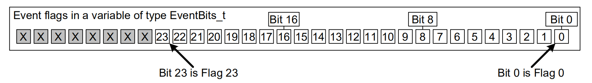
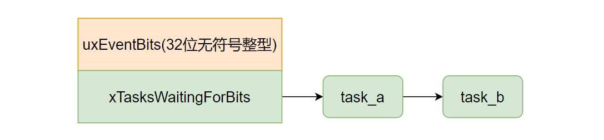
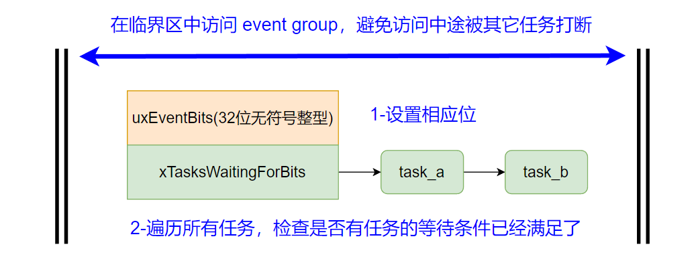

事件组（event group）是FreeRTOS 为灵活处理任务间事件同步而提供的组件。相比消息队列或信号量，事件组提供了更灵活的事件同步方式。

<!--more-->

***

#### 1 events group 的作用

[FreeRTOS的消息队列](https://fengxun2017.github.io/2022/12/12/FreeRTOS-use-queue/)是任务间和任务间（或任务和中断服务间）的通信工具，当任务间有数据需要传输时，就需要使用消息队列来传递数据。

但实际应用中，任务间或中断服务和任务间往往更多的传递事件，而不是传递数据。例如，用户按键后，将按键事件同步给某个任务。这种情况并不需要传递数据，只需将事件同步给任务即可，可以使用[FreeRTOS的信号量](https://fengxun2017.github.io/2022/12/15/FreeRTOS-use-binary-semaphore/)来实现事件同步。但信号量提供的功能，对于一个任务需要等待多个事件的情形并不总是能满足。

考虑如下场景：
嵌入式产品中，功耗往往是一个需要重点考虑的问题，显示屏耗电往往很大，因此无操作时，显示屏都是处于熄灭状态。但一旦用户操作设备（如按键），或设备收到一些特定消息，或设备插入电源等，显示屏应该即使点亮让用户感知到设备已进入工作状态。 

我们可以将点亮显示屏看做是一个单独的任务，该任务等待多个事件（用户操作，设备收到特定信息，设备插入电源等），一旦任意一个事件发生（即逻辑上的或），任务就点亮显示屏。这种情况信号量无法直接实现，因为信号量提供的API 无法同时等待多个信号量，虽然可以使用消息队列集合（queue set）来实现等待多个信号量（每个信号量表示一个事件），但依赖一个额外的对象（需要使用一个queue set 对象）。
并且，这个例子是等待多个事件，其中任意一个事件发生了，任务即执行动作。但如果是等待多个事件，并且多个事件均发生后（即逻辑上的与），任务再执行相应的动作呢？这种情况下即使使用 queue set + 信号量组合，也无法直接实现（因为queue set实现的是逻辑或，任意一个事件发生，都会返回）。

针对上述情况，FreeRTOS 为任务间的事件同步，提供了一个更灵活的组件，即 `event groups`：如下图所示，在32位 MCU 上，`event group`本质就是就是一个4字节无符号整型（ FreeRTOS 中类型别名为`EventBits_t`）。其中，高 8 位是控制位，不能使用。低 24 位是 标记位，每个标记位都可以表示一个事件（开发者自己约定每个位置表示什么事件）。

 图片来自 FreeRTOS 官网 

 

`event group` 可以支持灵活的事件组合，任务可以同时等待多个事件，并且支持任意一个事件发生时（逻辑或）就返回，或所有事件均发生时（逻辑与）才返回。

总的来说：
信号量：
 - 允许任务等待单个事件发生，当事件未发生时，任务可以阻塞直到事件发生为止，或仅等待一个固定的时间。
 - 当事件发生时（与之关联的信号量可以用了），只有单个任务可以恢复就绪。即使有多个任务再等待该事件，但只有其中优先级最高的才能恢复就绪状态，其它任务仍旧处于阻塞态。

而 event groups:
 - 允许任务等待单个事件，也可以等待多个事件发生，并且支持组合。任务可以等待多个事件直到其中任意一个发生（逻辑或），或等待多个事件直到所有事件均发生发生（逻辑与）。
 - 当事件发生时，所有等待该事件的任务，都能恢复就绪态（广播特性）。

并且，event groups 内核实现更简单，占用的ram 资源相比信号量更少，实际开发中很多使用[二值信号量](https://fengxun2017.github.io/2022/12/15/FreeRTOS-use-binary-semaphore/)在任务间同步单个事件的场景，都可以使用 event groups来替代信号量。但并不是说`event groups` 可以完全替代信号量。例如：
- 有的场景，多个任务等待某个事件时，当事件发生时，就是只希望只有一个任务能恢复就绪，并执行相关处理。即不需要广播特性，此时就需要使用信号量。
- [信号量有计数特性](https://fengxun2017.github.io/2022/12/17/FreeRTOS-use-counting-semaphore/)，可以用来记录事件发生的次数，而event groups 没有自带计数特性。

#### 2 event group 实现原理

`event groups`的实现就是一个结构体，其中包含两个成员：`uxEventBits`，`xTasksWaitingForBits`，如下图所示：

其中：
 - uxEventBits: 在32位处理器上为32位无符号整型，高8位为控制位不能使用。低 24 位，每一位可以用来表示某个“事件”。
 - xTasksWaitingForBits：任务链表。当任务等待某个 `event group` 中的某个、或某几个位被置位时（即等待对应事件发生）。如果设置了等待时间，那么该任务就会挂载到该任务链表上。这样，每当某个事件发生了（`event group`中的某个位被置位了），内核就能遍历该链表，如果某个任务等待的所有事件都满足了，就能恢复就绪状态。

##### 2.1 当任务等待某些事件：
通过 api `xEventGroupWaitBits`，可以让任务等待某个或某些事件（即等待某些位被设置）。

如果在任务调用该 API 前，等待的那些位已经被设置了（事件已经发生了），那么该api会立刻返回 `event group`的成员 `uxEventBits`的值，使用该值可以检查哪个事件发生了（如果是等待某几个事件，并且当任意一个事件发生时，满足条件。此时，就需要通过返回值，来检查是哪个事件发生了）。

如果在任务调用该 API 时，所等待的那些事件还未发生，并且设置了等待时间，那么当前任务就会被挂载到 `event group`的成员`xTasksWaitingForBits`（任务链表）上。这样，当之后该任务等待的事件发生了，内核就可以通过该链表让任务恢复就绪状态（任务被挂载到`xTasksWaitingForBits`上的同时，还会被挂载到内核的`DelayedList`任务链表上，如此，如果事件一直未发生，当等待的时间达到设置的超时时间，内核也会让任务恢复就绪态）。

PS：在中断服务函数中，可以使用 API `xEventGroupGetBitsFromISR` 检查是否对应位被设置了（某个事件发生了），但不能等待事件发生（中断服务函数需要尽快退出，不能等待，避免影响系统响应其它中断）。

##### 2.2 当任务设置某个位（发生了某个事件）：
当发生了某个事件后（如按键、接收到数据），调用 API `xEventGroupSetBits`（任务代码中使用，中断服务函数中需要使用带`FromISR`后缀的），可以将某个位置位（表示对应事件发生了）。

该函数的内部实现，会构建一个临界区（通过关闭任务调度），并在临界区中执行如下操作：

 - 设置`event group`成员 `uxEventBits`中相应的位
 - 遍历`event group`成员 `xTasksWaitingForBits` 中的所有任务，依次检查当前所有被设置的位（每个位对应一种事件），是否满足任务的等待条件，满足则将任务恢复就绪。

如下图所示：

`event group`的一个最典型的使用方式是，当发生了某个中断事件（如按键，接收到数据等），设置相应的位来表示事件发生，使得其它等待该事件的任务得以运行。 在中断函数中设置`event group`需要使用 API：`xEventGroupSetBitsFromISR`。

但是，设置某个（或某些）位后，内核还需要遍历任务链表`xTasksWaitingForBits`，让那些等待条件已满足的任务恢复就绪态。该任务链表中挂载了多少任务？这是未知的，可能很多也可能很少，因此执行时间是不确定的。而中断服务函数的一个基本原则就是，执行时间需要是确定的（至少得有一个上届），并且尽可能快结束。因此，不能在中断处理函数中做遍历任务链表的工作，当在中断处理函数中调用`xEventGroupSetBitsFromISR`时，实际的设置相应位，以及遍历任务链表这些工作并未在中断服务函数中执行，FreeRTOS 通过[延后执行机制](https://fengxun2017.github.io/2022/12/01/FreeRTOS-deferring-work/)将实际工作推迟到退出中断以后，并在 daemon task（或称为定时器服务任务）中运行。

PS：这也是为什么`xEventGroupSetBits`函数中的临界区只使用关闭任务调度来实现，而不用关心中断打断任务的问题。因为`event group`的修改操作都是在任务中进行的，即使在任务已经进入临界区后，中断打断了任务，并调用了`xEventGroupSetBitsFromISR`，但实际要执行工作也是推迟到中断退出以后，在`daemon task`中执行。因此，即使中断打断了已进入临界区的任务，但是并不会破坏临界区中的访问过程。
