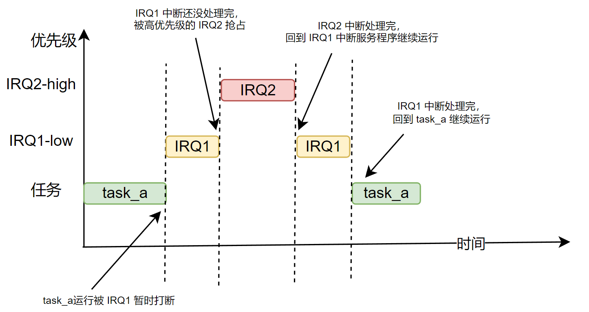
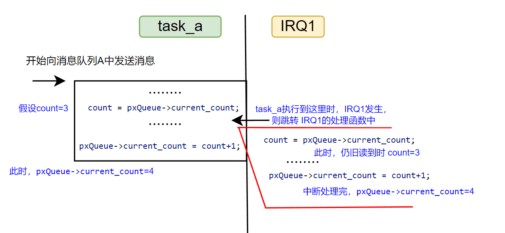
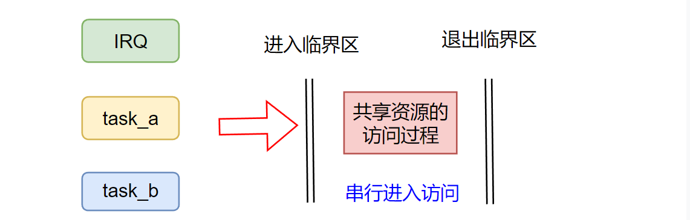
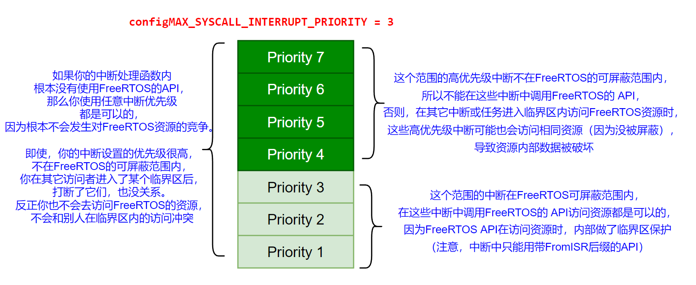

cortex-m3/m4的硬件中断是可以嵌套的，即高优先级中断可以抢占正在处理的低优先级中断。在使用FreeRTOS时，该特性仍旧存在，但FreeRTOS为了在并发/并行访问资源的情况下，保护内核中的数据结构不被破坏，通过临界区做了一些限制，这使得并不是所有的高优先级中断都能抢占低优先级中断。

<!--more-->

***
硬件中断嵌套，是指中断发生时，中断会打断当前正在执行的“普通”代码，转而执行对应的中断处理函数。在执行中断处理函数时，如果又有一个更高优先级的中断发生，该高优先级中断可以抢占正在运行的较低优先级中断，如下图所示：任务`task_a`在运行时，被到来的低优先级中断`IRQ1`打断，在执行`IRQ1`中断处理函数时，又被到来的高优先级中断`IRQ2`打断。`IRQ2`中断处理函数执行完成后，回到`IRQ1`的中断处理函数继续运行，`IRQ1`中断处理函数执行完后，回到`task_a`继续运行。

但是这种不加限制的中断嵌套模型，肯定是不能直接用在FreeRTOS中的，因为在中断处理函数中也是可以使用FreeRTOS的API（以`FromISR`后缀结尾的API）。假设当程序刚好执行到`task_a`向`消息队列A`中发送消息（此时会涉及`消息队列A`控制块的修改，消息存储区内容的修改）。这时，发生了一个低优先级中断`IRQ1`（打断了`task_a`正在执行的工作），`IRQ1`中断处理函数中也向`消息队列A`发送消息或从中提取消息（同样，也是涉及`消息队列A`控制块的修改，消息存储区内容的修改）。那么此时就可能会改乱`消息队列A`中内部的控制数据，即对同一个资源的访问冲突了。甚至，在低优先级中断`IRQ`执行到向`消息队列A`发送数据时，此时又发生一个更高优先级中断`IRQ2`，`IRQ2`中也向`消息队列A`中发送数据或从中提取数据，这就更加提高了发生资源访问冲突的可能。
下图演示了，`task_a`向`消息队列A`中发送消息时，被中断`IRQ1`打断，而`IRQ1`中断服务程序中也向`消息队列A`中发送数据，从而造成资源访问冲突（由于并发或并行访问，造成资源内部控制数据被破坏）的一种情况:

如上图所示，这种情况的冲突发生时，就会导致实际向消息队列`消息队列A`发送了两次数据，但最终`消息队列A`内部的消息计数只增加了1。

实际上，这种共享资源（多个任务或中断都会访问的资源）访问冲突问题，不止在任务和中断间会发生，任务和任务间也也会发生。原理和上图一样，在`task_a`也是执行到上图的时间点时，发生了任务切换，切换到了任务`task_b`，而任务`task_b`中也同样向`消息队列A`中发送数据，那么就会导致上图同样的资源访问冲突问题。

备注：**本文所述的 共享资源 特指：通过 FreeRTOS提供的 API访问的那些资源（如消息队列，信号量等），当它们会被多个任务或中断访问时，即为共享资源**。

如何解决这种共享资源访问冲突的问题？ **“临界区”机制，就是用来处理这种对共享资源竞争访问（多个任务/中断都会访问某个相同的资源，并且可能会并发访问）导致的问题**。通过将某个共享资源的访问过程用“临界区”保护起来，可以保证当一个访问者在临界区中访问资源时，其它访问者不能同时进入该临界区中访问资源，只能等待当前在临界区中的访问者结束其访问过程，其它访问者才能进入临界区中访问资源。或者说，用“临界区保护起来的代码段”，是串行执行的，不会并发（多核就是并行）执行。如下图所示：

剩下的问题就是如何实现“临界区”了。
**对于任务和任务之间的资源竞争问题**，最简单的方法，就是通过**禁止任务调度**来解决。即，访问共享资源前，先关掉内核的任务调度功能（开始进入临界区），这样在任务的整个访问共享资源期间，内核是不会进行任务切换的，不会切换到其它任务，也就没有任务间的数据竞争了。当访问共享资源完成后，再打开内核的任务调度功能（退出临界区）。FreeRTOS中`vTaskSuspendAll`和`xTaskResumeAll`就是分别用来暂停任务调度和恢复任务调度的。

**但是对于`任务和中断`之间，以及`中断和中断`之间的资源竞争**，仅仅暂时关闭内核的任务调度是无法解决的。因为，关闭内核的任务调度，并不会关闭中断。所以如果中断服务程序中，也会访问某个共享资源，那么仍旧可能形成任务和中断服务间的资源竞争，如果不加以限制，就会导致资源内部数据被破坏。这种情况，一个简单、直接的实现进入临界区的方法，就是直接屏蔽所有可以屏蔽的中断。退出临界区时，再取消屏蔽。这样任务执行期间就不会被中断打断，也就不会有资源竞争。中断执行期间，也不会被更高优先级的中断打断，同样也不会形成资源竞争。

但直接屏蔽所有可以屏蔽的中断，过于简单粗暴，毕竟有的中断服务程序中，并没有访问共享资源（都不访问，也就没有资源竞争）。因此，**FreeRTOS的做法是进入临界区时，只屏蔽部分中断**。这个屏蔽操作，cortex-m处理器可以通过向 `BASEPRI` 寄存器中写入值`x`，即表示屏蔽所有优先级小于等于`x`的中断，FreeRTOS中的宏`taskENTER_CRITICAL`（中断处理函数中应该使用`taskENTER_CRITICAL_FROM_ISR`）实现进入临界区就是这么做的。而退出临界区，就是取消屏蔽，通过向 `BASEPRI` 寄存器中写入0来实现，FreeRTOS中的宏`taskEXIT_CRITICAL`（中断中应该使用`taskEXIT_CRITICAL_FROM_ISR`，并传入调用`taskENTER_CRITICAL_FROM_ISR`时的返回值）就是如此实现退出临界区的。
中断优先级屏蔽范围的设置，就是FreeRTOS工程配置文件`FreeRTOSConfig.h`中的宏`configMAX_SYSCALL_INTERRUPT_PRIORITY`（新版本名称为`configMAX_API_CALL_INTERRUPT_PRIORITY`）设置的值。例如，将`configMAX_API_CALL_INTERRUPT_PRIORITY`设置为`3`，则此时FreeRTOS的中断嵌套模型如下图所示：为了方便描述，图中假设中断优先级只有1-7，并且优先级数值越高，中断的真实优先级就越高。（`cortex-m3/4是反着来着，数值越低，真实优先级越高`）

图片原型来自FreeRTOS官网

如上图所示，当`configMAX_API_CALL_INTERRUPT_PRIORITY = 3`时，每次访问共享资源前，需要先进入临界区（屏蔽1-3优先级的中断），资源访问完成后，则退出临界区（取消屏蔽，中断又可以正常响应了）。
- **对于`任务a`和`任务b`之间的资源竞争**（当它们都会访问同一个FreeRTOS资源时），当`任务a`成功进入临界区后，此时优先级小于等于 3的中断均被暂时屏蔽了，FreeRTOS的任务切换中断优先级`PendSV`是最低中断优先级，因此也是被屏蔽状态。所以在进入临界区后，访问资源这段时间内不会发生任务切换，因此也就不会存在两个任务间的访问冲突。
- **对于`任务a`和`中断b处理函数`之间的资源竞争**，在FreeRTOS的设定的中断嵌套模型下，如果你的`中断b处理函数`会调用FreeRTOS的API访问某个`任务a`也会访问的共享资源，那么`中断b`的优先级必须小于等于3，这样FreeRTOS的进入临界区的宏`taskENTER_CRITICAL`（中断处理函数中应该使用`taskENTER_CRITICAL_FROM_ISR`）才能暂时屏蔽这些中断。此时，`任务a`进入临界区后，`中断b`一定是被屏蔽状态，也就不会和`任务a`形成冲突了。反之，如果`中断b`优先级大于3，那么你的`任务a`进入临界区后，在访问资源过程中，就可能被`中断b`打断（不在FreeRTOS可屏蔽中断范围内），如果`中断b处理函数`中也访问相同资源，那么就会造成资源访问冲突。
- **对于`中断a`和`中断b`之间的资源竞争**，如果`中断a`和`中断b`会访问某个相同的共享资源，同样它们的中断优先级都必须小于等于3，这样当任意一个中断先进入临界区后，则另一个中断由于被暂时屏蔽，也就不会和先进入临界区的那个中断形成访问冲突。

- 如果，你的中断是在处理一个非常重要的事件，不想因为被其它中断抢占而导致响应出现延迟，那么就需要将该中断优先级设置的比较高（高于`configMAX_API_CALL_INTERRUPT_PRIORITY`），避免被FreeRTOS的临界区处理给暂时屏蔽了。但是，一但你的中断优先级高于`configMAX_API_CALL_INTERRUPT_PRIORITY`，就不能在该中断处理函数中使用任何FreeRTOS的 API去访问资源。因为，此时该中断已经不受FreeRTOS的临界区处理控制了，如果该中断发生时，访问的资源，是其它任务或中断（低优先级）正在访问的资源，那么就可能造成访问冲突，破坏资源内部数据。

- 最后，如果你的中断处理函数中压根没有使用FreeRTOS的任何API，那么该中断可以使用任意中断优先级，因为根本不会和其它使用FreeRTOS API访问资源的任务或中断形成冲突。

综上，FreeRTOS内部，通过使用向 `BASEPRI` 寄存器中写入值`configMAX_SYSCALL_INTERRUPT_PRIORITY`，来屏蔽部分中断，实现临界区机制。
对于那些通过 FreeRTOS API访问的资源，如消息队列，信号量，软件定时器等。当我们在多个任务或中断中使用它们时，其实我们并未做临界区相关的处理，也没有碰到前文所述的访问冲突问题，这是因为FreeRTOS在这些 API的内部已经做了临界区处理，所以我们可以安全地在多个任务或中断中调用它们。
对于开发者使用来说，需要注意的是，你的中断处理函数是否有使用到FreeRTOS的 API 访问某个资源。如果有使用，那就需要将其中断优先级设置小于等于`configMAX_SYSCALL_INTERRUPT_PRIORITY`的值表示的中断优先级，使该中断被纳入内核可屏蔽中断范围中，从而避免中断和任务，或中断和中断间，对内核资源地访问形成冲突；如果没有使用 FreeRTOS的 API，那么根据你的实际需求可以自行设定任意的中断优先级。

如果是访问开发者自定义的数据呢？例如，开发者自定义的某个`结构体对象`，每次访问该结构体对象涉及到内部多个成员的修改，如果该对象在多个任务或中断处理函数中被访问，如何保证这些访问不会冲突。
这种情况，就需要我们在访问该结构体对象前，自己主动调用`taskENTER_CRITICAL`（中断处理函数中应该使用`taskENTER_CRITICAL_FROM_ISR`）进入临界区，访问结束后，调用`taskEXIT_CRITICAL`（中断中应该使用`taskEXIT_CRITICAL_FROM_ISR`，并传入调用`taskENTER_CRITICAL_FROM_ISR`时的返回值）退出临界区。 
此外，如果某个中断处理函数也会访问该结构体对像，该中断的中断优先级也需要设置小于等于`configMAX_SYSCALL_INTERRUPT_PRIORITY`表示的中断优先级，使得该中断能被纳入临界区会屏蔽的中断范围内。避免任务在进入临界区后，在访问该结构体对象的过程中，发生中断打断任务的执行（该中断处理函数中也会访问该结构体对象），形成访问冲突。

虽然，通过临时关闭中断的，可以实现临界区（临界区内，互斥地访问资源）。但关闭中断的方式，过于粗糙。毕竟中断都是用来响应重要事件，临时屏蔽中断很可能会导致一些重要事件的响应被延迟。因此，非必要的情况下，不应该使用这种方式。实际应用开发中，当我们需要互斥的访问共享数据时，应该首先考虑使用[使用互斥量（mutex）形成临界区，以保护共享数据的访问过程](https://fengxun2017.github.io/2023/01/03/FreeRTOS-mutex/)。