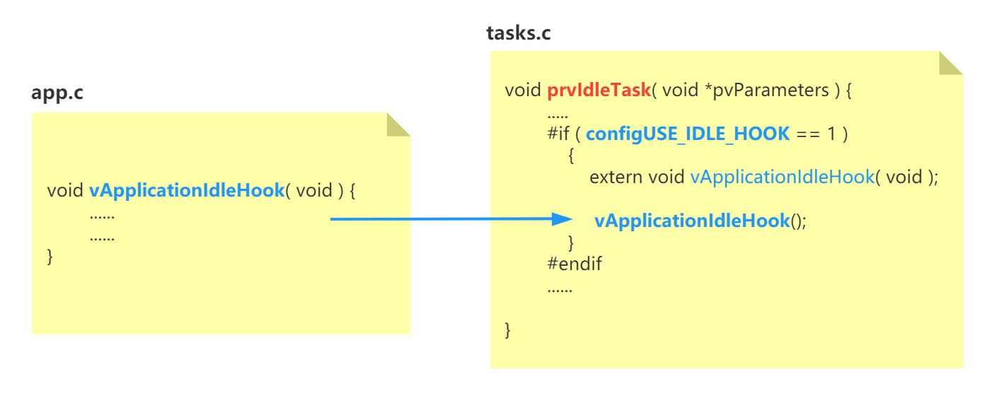
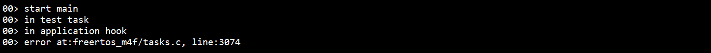
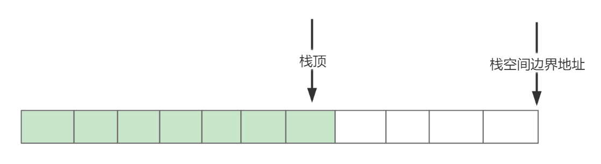
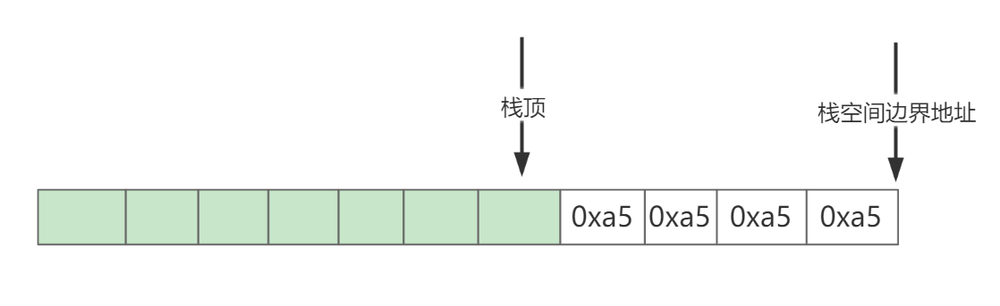

<center>
FreeRTOS提供了几个钩子（Hook）函数接口（本质是设置一个回调函数）。如果我们按照钩子函数要求的形式实现它，就可以让内核在特定状态，或内核发生了特定事件时，调用我们实现的钩子函数。
</center>

<!-- more -->
***

#### 1：什么是钩子函数？
钩子函数的本质可以看做是回调函数，例如在Linux上开发时，时常需要处理一些系统信号（signal）,那么就需要调用系统API 注册信号处理函数（回调函数）。如此，当系统发生信号时，就会调用注册的信号处理函数，这种方式是在代码的运行过程中，通过调用 API 动态注册回调函数实现的。

FreeRTOS中，实现钩子函数的方式更简单直接，直接实现定义好的固定函数名字的 Hook 函数即可。如下图所示，实现vApplicationIdleHook 钩子函数就是配置一个宏，然后实现这个函数具体内容：


FreeRTOS提供的几个钩子函数是定义好函数名和参数形式的。例如，FreeRTOS中的 idle hook函数，当内核没有其它任务运行时，内核就会运行内核自己创建的 idle 任务，idle任务中会运行 idle hook 函数。当然，运行的前提是，我们要在`FreeRTOSConfig.h`文件中定义 **configUSE_IDLE_HOOK**，之后再实现函数 `void vApplicationIdleHook( void )` 的具体内容，函数名和参数形式都是固定的，不能改变。
`这种方式可以看成是静态注册，即在代码的编译阶段，就将对应的 Hook 函数注册好了。`

#### 2：FreeRTOS中提供的几个钩子函数

##### 2.1：Idle Hook Function
使用 **idle hook** 函数，需要在`FreeRTOSConfig.h`文件中定义 **configUSE_IDLE_HOOK**，并在工程中实现 `void vApplicationIdleHook( void )` 函数的具体内容。

FreeRTOS在内核在启动调度程序时，会自动创建一个 **idle 任务**。该任务的优先级默认是0，即最低优先级。当系统中没有其它更高优先级的任务时，FreeRTOS内核就会选择 **idle任务** 运行（如果存在其它优先级也为0 的任务，默认是轮流调度）。idle 任务的大致流程如下：
```c
void prvIdleTask( void *pvParameters ) {
    ...
    for (; ;) {
        
        // 释放那些调用 vTaskDelete 删除自己的任务所占用的内核资源
        prvCheckTasksWaitingTermination()
        ...
        #if ( configUSE_IDLE_HOOK == 1 )
            {
                extern void vApplicationIdleHook( void );
                // 调用 idle hook 函数
                vApplicationIdleHook();
            }
        #endif

        // 与低功耗相关的一些处理
         #if ( configUSE_TICKLESS_IDLE != 0 )
            ....
         #endif
    }
}
```

idle 任务主要是做三件事：
- 调用`prvCheckTasksWaitingTermination`来释放一些被删除任务的内核资源。FreeRTOS提供的`vTaskDelete( TaskHandle_t xTaskToDelete )`是可以删除某个任务的，删除任务就会释放相关的内核资源（内核任务控制块，任务栈空间），如果调用 vTaskDelete（**NULL**），就是自己删除自身，一个任务是无法删除自身的，所以FreeRTOS会将那些调用**vTaskDelete(NULL)**删除自己的任务挂到**等待删除任务队列**上。`prvCheckTasksWaitingTermination`做的事情，就是检查等待删除任务队列上是否有需要删除的任务。更详细的信息可以参考：[FreeRTOS的任务调度和管理](https://fengxun2017.github.io/2022/11/01/FreeRTOS-task-status-management/#FreeRTOS%E4%BB%BB%E5%8A%A1%E7%8A%B6%E6%80%81%E5%9C%A8%E5%86%85%E6%A0%B8%E4%B8%8A%E7%9A%84%E5%AE%9E%E9%99%85%E5%AE%9E%E7%8E%B0)
  <br/>

- 调用 idle hook 函数
<br/>  
- 一些低功耗相关的处理

如上所述，我们实现的  `void vApplicationIdleHook( void )` 函数，就是在 idle 任务中运行的。
idle任务是当前没有更高优先级的任务在运行、或处于就绪状态时，内核才会调度 idle 任务。可以认为idle 任务运行时，系统基本处于空闲状态（其高优先级任务应该全部处于阻塞态，或挂起态，否则不会运行最低优先级的任务）。
所以，`vApplicationIdleHook`是放置低功耗相关代码的理想位置。如果，系统对功耗有要求，可以在该函数中关闭相关耗电外设，然后执行 WFI 让CPU进入休眠降低系统功耗，将相关外设的重新打开代码放在WFI 指令之后，使得CPU在被唤醒后可以恢复相关外设功能。
（`实际上，idle函数中与配置configUSE_TICKLESS_IDLE相关的代码，也做了低功耗的处理，并且考虑的更全面，但并不是所有平台都支持。`）

一个需要注意的问题是：<font color=red>绝对不要在vApplicationIdleHook函数中调用会让任务阻塞的FreeRTOS API </font>，例如, 调用vTaskDelay 让任务延迟一会，或者等待诸如消息队列这样的资源，并设置了超时时间（设置了超时时间，当资源不可用时，就会让任务处于阻塞）。 
这个问题的本质与FreeRTOS内核的实现方式相关。你可以测试一个如下的例子：创建一个优先级为 1 的任务，输出调试信息。实现`vApplicationIdleHook` 函数，同样输出调试信息，并且也调用了vTaskDelay（这会让调用vApplicationIdleHook函数的 idle任务阻塞）。 代码中的输出函数可以替换成自己的串口输出，或者参考这篇文章使用J-Link RTT：[使用JLink-RTT输出调试信息](https://fengxun2017.github.io/2022/10/20/use-jlink-RTT/)

```c
void test_task( void * pvParameters )
{
    const TickType_t delay = pdMS_TO_TICKS(100); 
    
    while(1) {
        SEGGER_RTT_printf(0, "in test task\r\n");
        vTaskDelay( delay );
    }
}

void vApplicationIdleHook( void )
{
    const TickType_t delay = pdMS_TO_TICKS(100);

    SEGGER_RTT_printf(0, "in application hook\r\n");
    vTaskDelay( delay );
}

int main(void) {
    SEGGER_RTT_printf(0, "start main\r\n");
    xTaskCreate(test_task, "task", 200, NULL, 1, NULL);      
    vTaskStartScheduler();
    
    for( ;; );
    return 0;    
}
```
此外，在FreeRTOSConfig.h文件中，定义**configASSERT(X)**, 参数为出现错误的文件和行号，如下所示：
```c
extern void vAssertCalled( const char * pcFile, uint32_t ulLine );

#define configASSERT( x ) if( ( x ) == 0 )	vAssertCalled( __FILE__, __LINE__ )

```
vAssertCalled 函数内部实现输出具体信息：
```c
void vAssertCalled( const char * pcFile, uint32_t ulLine ){
    SEGGER_RTT_printf(0, "error at:%s, line:%d\r\n", pcFile, ulLine);
    for(;;){}
}
```

实现上述代码，编译烧录后运行，你可以看到类似下面的调试信息（不同的内核版本，可能报错的行数不一样。）：


根据调试信息，可以定位到系统是在进行任务切换时，选择当前最高优先级的就绪任务时出错了。

具体原因如下：当前系统只有 2 个任务，一个是主动创建的 test_task任务，优先级为 1；一个是内核调度启动时自己创建的 idle 任务，优先级为 0。 
当内核运行起来后，会先运行优先级为 1 的test_task任务。test_task输出"in test task"，之后由于调用vTaskDelay，进入阻塞态。
内核此时进行任务切换，由于只有 idle 任务处于就绪态了，内核选择idle 任务运行。 idle 任务运行后会调用vApplicationIdleHook，输出 “in application hook”，之后同样因为调用vTaskDelay，进入阻塞态。
内核此时再次进行任务切换，**但此时没有任务可以运行了！FreeRTOS的内核实现中是不支持这种状态的！**
所以：<font color=red>绝对不要在vApplicationIdleHook函数中调用会让任务阻塞的FreeRTOS API ！</font>

另一个需要注意的点是，**vApplicationIdleHoo 中不要实现无限循环**，因为调用vApplicationIdleHoo 的 idle 任务有清理待删除任务所占内存资源的功能，如果你的系统中有任务会删除自己，并且vApplicationIdleHoo 内部又是无限循环，那么函数就无法退出，idle 任务就不能执行释放待删除任务所占资源的那部分代码。
<br/>

##### 2.2 Tick Hook Function

使用 Tick HooK 函数需要在`FreeRTOSConfig.h`文件中定义
```c
#define configUSE_TICK_HOOK			1
```
并且实现函数 `void vApplicationTickHook( void )`的具体内容。
关于 FreeRTOS的 **tick中断**，可以参考这里：[FreeRTOS-内核对时间的测量](https://fengxun2017.github.io/2022/11/08/FreeRTOS-%E5%86%85%E6%A0%B8%E5%AF%B9%E6%97%B6%E9%97%B4%E7%9A%84%E6%B5%8B%E9%87%8F/)。

tick 钩子函数就是在每次 **tick中断** 发生后被调用，cortex-m处理器上使用 systick 定时器来产生 tick中断，在systick定时器的中断处理函数中会调用 **xTaskIncrementTick** ，该函数内部就会调用 tick hook 函数：<font color=red> vApplicationTickHook </font>。例如，实现一个如下的简单输出调试信息的 tick hook 函数，烧录到开发板上运行后，就可以在不停输出调试信息。
```c
void vApplicationTickHook( void )
{
    SEGGER_RTT_printf(0, "in tick hook\r\n");
}
```
需要强调的是，**vApplicationTickHook是在中断处理函数中被调用的**。因此，我们实现vApplicationTickHook 的具体内容时，不应该做一些耗时操作，**并且不能调用没有 FromISR 后缀的 FreeRTOS API**（FreeRTOS中很多函数有两个版本，有 FromISR 后缀的才能在中断环境中调用。即使是带是FromISR后缀的API，也只能在硬件中断优先级低于configLIBRARY_MAX_SYSCALL_INTERRUPT_PRIORITY 的中断中调用，否则可能会破坏在临界区中操作的内核数据结构）。

如果你有一个“简短的” 周期性任务，并且其运行频率基本和内核运行频率一致，那么就可以将其实现在 tick hook 函数中。（需要注意的是，如果设置了configUSE_TICKLESS_IDLE，FreeRTOS会根据系统状态来决定是否要跳过几个 tick中断，保持更长时间的连续休眠，从而节省功耗）
<br/>

##### 2.3 Malloc Failed Hook Function
使用 Malloc Failed Hook 函数需要在`FreeRTOSConfig.h`文件中定义
```c
#define configUSE_MALLOC_FAILED_HOOK			1
```
并且实现函数 `void vApplicationMallocFailedHook( void )`的具体内容。
malloc failed hook 函数就是在内存申请失败时，调用我们实现的 `vApplicationMallocFailedHook` 函数。在FreeRTOS提供的动态内存分配文件 `heap_x.c （x=1、2、3、4、5）`中，实现了`pvPortMalloc` API 来申请内存，如果申请失败了，就会调用`vApplicationMallocFailedHook`。 

该钩子函数用处不大，因为调用`pvPortMalloc` 的返回值为`NULL`时，就是告诉我们内存申请失败了。不过，可以在开发阶段使用，直接在vApplicationMallocFailedHook 函数中输出内存不够的调试信息，这样可以避免在每个调用pvPortMalloc的地方去根据返回值，输出调试信息。
<br/>

##### 2.4 Stack Overflow Hook Function
使用 栈溢出检测钩子函数，需要在`FreeRTOSConfig.h`文件中定义 **configCHECK_FOR_STACK_OVERFLOW（有两种定义的值，代表两种检测模式，后面解释）**，并且实现函数：
```c
void vApplicationStackOverflowHook( TaskHandle_t xTask, signed char *pcTaskName )
```
其中，`xTask`为FreeRTOS中的任务句柄（用来识别一个任务），在成功创建一个任务时，内核会返回被创建的这个任务的句柄， `pcTaskName` 为创建任务时，设置的任务名。任务创建可以参考：[FreeRTOS 创建任务](https://fengxun2017.github.io/2022/10/29/FreeRTOS-%E5%88%9B%E5%BB%BA%E4%BB%BB%E5%8A%A1/).

栈溢出检测钩子函数，其目的就是为了检测任务栈是否溢出，如果溢出了，就会调用实现的vApplicationStackOverflowHook，并传入任务句柄，和任务名，方便定位是哪个任务发生了栈溢出。

FreeRTOS将任务的栈溢出检测，放在了任务切换中，当目前正在运行的任务被换出时，检测一下它是否有栈溢出。官方给的理由是任务在被换出时，需要在任务栈中保存上下文信息（这样后面再次被调度时才能恢复），这时任务栈可能达到最深。当然，这只是可能。）

FreeRTOS有 2 种栈溢出检测方式：
 - 当定义 **configCHECK_FOR_STACK_OVERFLOW 为 1** 时，栈检测的方式就是看当前栈指针，有没有超过栈范围。只要栈顶指针所指的地址，没有超过栈空间的边界，那么就算作没溢出。
这种检测方式很快，只要比较一下地址就可以了。但这种检测方式是基于 任务被换出时，任务的栈地址达到最深。实际上，任务可能是被换出之前达到最深。例如下面这种例子:
    ```c
    void fun_a(void) {
        char array[1000];
        .....
    }
    void task_a( void * pvParameters ) {
        ...
        fun_a();
        ...
    }
    ```
    任务 task_a自己没有定义局部的大数组，但是调用了函数 fun_a，函数fun_a 中申请了一个大的临时数组（占用栈空间），那么此时任务调用 fun_a 时会达到任务栈的最深。假设任务 task_a 退出fun_a后（char array[1000]被销毁了，不占空间了），发生了了任务切换，任务task_a 被换出去，那么此时看到的栈顶指针就不是最深时候的了。如果之前发生了栈溢出，此时就检测不到了，那么系统后续运行就可能不正常了（之前的栈溢出可能已经覆盖了某些任务的内核控制块信息，或者是栈信息）。

    <br/>

 - 当定义**configCHECK_FOR_STACK_OVERFLOW 为 2** （大于1即可）时，FreeRTOS在创建任务时，会将任务栈空间都设置成一个特殊的初始值(0xa5)。当任务被换出时，内核检查栈的最后16个字节还是不是0xa5，如果不是，说明曾经栈最深时，达到过这里，所以被其它值覆盖了，那么就判定任务栈溢出了。
 
 相比第一种检测方式，只能检测被换出的那个时刻栈有没有溢出。第二种检测方式可以检测到任务在之前的运行过程中，有没有发送过栈溢出。（但这种方式也不是说百分百，如果发生栈溢出时，覆盖了最后16个字节，但覆盖值刚好就是0x5a，不就可以骗过去了，不过基本不用考虑这种特殊的小概率事件）

 需要注意的是：栈溢出的检测最好只在开发阶段进行测试，正式发布的代码最好不要包含该动能，会影响任务切换时的效率（任务切换发生在中断中）。

<br/>
ps：需要注意文章代码中的日志输出函数，产品代码中如果需要使用的话，需要考虑线程安全性（多任务安全性），因为中断/任务切换可能发生在另一个任务正在输出日志但还未输出完的时候，这就可能造成日志错乱

<br/>
<br/>
FreeRTOS交流QQ群-663806972