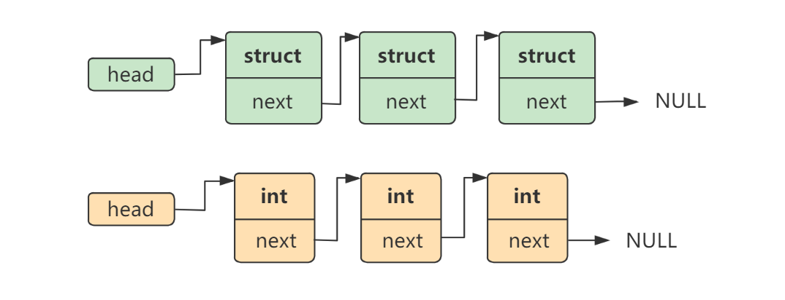
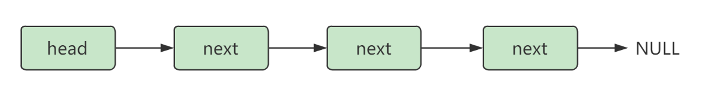
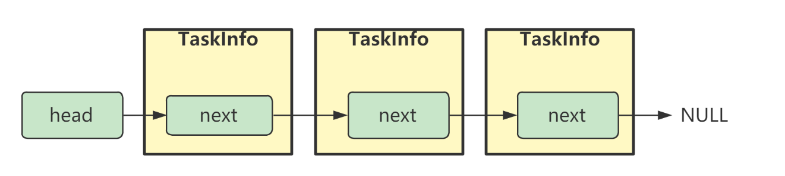
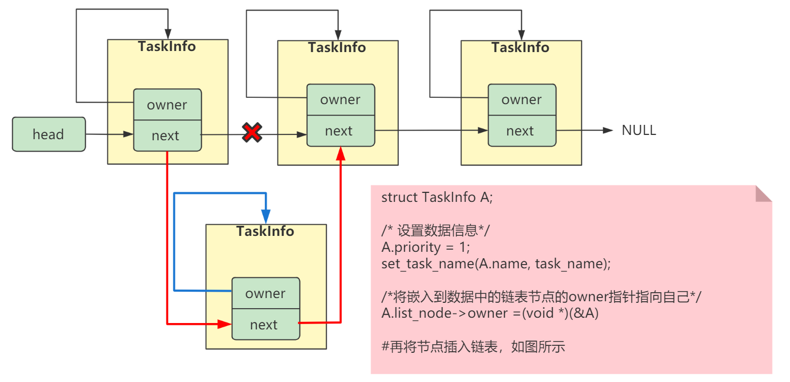
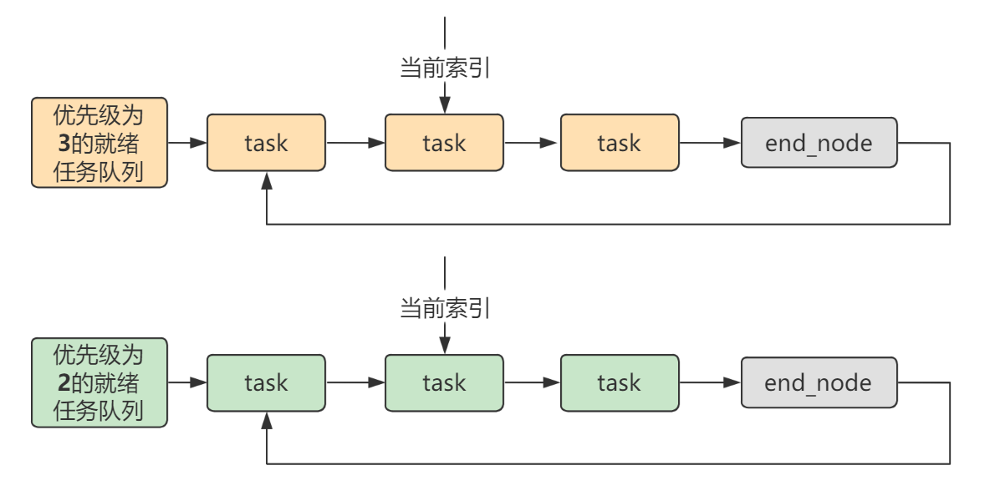
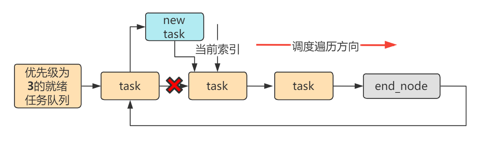

<center>

**链表**是FreeRTOS内核中最重要的数据结构，内核的任务管理都是基于链表数据结构来实现的。 
</center>

<!-- more -->

***
#### 学习时使用的链表结构：

在学习数据结构时，我们学习的链表结构基本都是数据本身和链表结构耦合在一起的。如下图所示的两个链表：一个是存储结构体数据的链表，一个是存储 int 数据的链表


两个链表的结构完全一样，涉及的操作也一致，都是通用的链表插入，删除，查找等操作。

但是一个链表中，每个链表节点存储的是结构体数据。而另一个链表中，每个链表节点中存储的是 int 数据。仅仅因为保存的数据不一样，我们就需要为此实现两套操作一样的链表代码。

在实际的应用产品中，往往存在多种数据类型，需要以链表的形式来存储。如果为每种数据类型都实现一套链表数据结构相关的操作，肯定是不可取的。

<br/>

#### FreeRTOS内核中的链表结构

在 **C++** 标准库中，利用模板功能，实现了一套标准的链表结构 **std::list**，并可以存储任意类型的数据。
但在 **C** 中没有模板功能，所以为了实现一套通用的链表结构，并可以适用于任意数据类型，FreeRTOS将链表结构本身和需要存储的数据进行了解耦。
以一个简单的**单向链表**来解释，如下所示（linux内核实现中也是如此将链表结构和数据进行解耦的）：

首先，定义一个简单的单向链表节点结构体，其中不保存数据内容，只保存指向下个节点的指针。
```c
struct ListNode
{
    struct ListNode * pNext;     
};
```

由上述节点组成的链表，就是一个只有节点关系的链表，没有实际的数据，如下图所示：


假设，我们有一个如下精简的**任务信息**结构体数据类型（仅仅是为了演示）：
```c
struct TaskInfo
{
    int priority;    // 优先级
    char name[20];   // 任务名 
};
```
如果我们希望将其以链表的形式进行组织，则只需要将**链表节点**作为**TaskInfo**的成员，如下所示：
```c
struct TaskInfo
{
    int priority;   // 优先级
    char name[20];  // 任务名  
    struct ListNode list_node;  // 链表节点作为一个成员
};
```
基于该定义，**TaskInfo**数据类型的链表结构可以表示成下图所示：


**注意**：指针指向的都是TaskInfo内部的链表节点，而不是TaskInfo本身。

实际上，我们是将链表插入到数据中了（而普通的链表可以认为是将数据插入到链表中，使得每种数据都要定义一套链表），每个链表节点指向的并不是数据，而是下一个链表节点，而链表节点本身又属于数据的成员，所以也就可以间接找到数据了。

通过上述定义，我们只需要实现一套标准的链表操作即可，并且与任何数据类型都无关。而当需要将某种数据类型以链表的形式进行组织时，我们只需要在数据的类型定义中添加一个**链表节点结构体类型**的成员即可。

剩下的问题就是**如何通过链表节点来找到它关联的数据**。linux内核中是通过计算结构体成员的偏移来获得数据地址的。
而在FreeRTOS中，则更加直观一点，FreeRTOS在链表节点结构体中添加了一个指针成员，让其指向该节点关联的实际数据，形如下面代码所示，我们在前面的**链表节点结构体**中加入了一个指针变量，该指针变量会指向该链表节点关联的数据：
```c
struct ListNode
{
    struct ListNode * next;     
    void * owner;    // 让其指向节点关联的实际数据
};
```

如此，我们在创建**TaskInfo**类型的变量 **A** 时，只需将其成员 **list_node** 的 **owner** 指向 **A** 自己，即可将链表节点和数据进行关联。下图以单链表演示一个具体的链表节点插入的过程：



#### 总结

以上内容以简单的单链表为例，描述了FreeRTOS内核链表结构的核心思想。FreeRTOS中所有的任务队列都是都过这种链表结构来管理的（参考文章：[FreeRTOS的任务管理逻辑](https://fengxun2017.github.io/2022/11/01/FreeRTOS-task-status-management/)）。
当然，内核需要处理的任务信息和逻辑更复杂，所以FreeRTOS内核中的链表实际实现会有一些差别，但思想是一致的（链表结构本身和数据解耦）。例如，一些具体差异有：
  - 内核中的链表为**双向链表**，所以链表的插入、删除更复杂一点。
  - 内核中实现的**链表节点**除了**owner指针**指向关联数据。还有一个**container指针**，container指针用来指向这个链表节点所属的**链表**，这个指针的目的是为了当任务A（一个链表节点）挂载在某个任务队列上(即链表)，而我们想将任务A其移出该任务队列，除了需要修改任务队列（结构为链表）中任务A前后节点(任务)的next，prev指针，还需要修改队列内部记录信息（如队列包含的任务数量），通过container即可直接找到该任务所在的队列，继而修改相关信息。
  - 内核中的**链表节点**还存在一个 **ItemValue**，不是说**链表节点**本身不存储信息吗？那这个值是干嘛用的？ 这个值通常赋值为任务的优先级。添加这个值是为了方便内核实现**资源就绪时优先通知高优先级的任务**。例如，文章[FreeRTOS的任务管理逻辑](https://fengxun2017.github.io/2022/11/01/FreeRTOS-task-status-management/)中描述了，当任务从一个空的**消息队列Q**中请求数据时，就会被挂载到**消息队列Q**内部的等待数据任务队列（一个链表）上，多个任务都向空的消息队列Q请求数据，就都会被挂载到**消息队列Q**的等待数据任务队列上。而当**消息队列Q**有数据时，会优先通知优先级高的任务来取。怎么实现优先通知高优先级的任务？就是在将任务挂载到**消息队列Q**的等待数据队列上时，是按 节点的ItemValue（被赋值成任务优先级了）来排序的，使得优先级高的任务会排在队列的最前面。

此外，FreeRTOS内核链表还提供了很多自定义的链表操作，和各种宏定义。

例如，内核任务队列中存在一个`当前索引`，在最高优先级就绪任务队列中，它总是指向当前正在运行的那个任务（正在占用cpu）。而在其它优先级就绪任务队列中，`当前索引`则指向本队列中上一次运行的那个任务（本队列中最近一次运行过的那个任务，之后由于有更高优先级任务就绪，被高优先级任务抢占了CPU）。
`当前索引`存在的意义，是为了方便内核实现在相同优先级的任务上轮流调度（通过顺序移动“当前索引”，轮流调度相同优先级的任务）。

如下图所示（以简单的单链表解释）：每次需要任务切换时，会从最高优先级(3)的就绪任务队列中，通过`当前索引`来找到下一个要调度的任务，从而实现相同优先级任务的“轮流调度”(内核的默认配置)。(优先级队列2中就绪任务运行的前提是没有更高优先级的任务处于就绪状态了，参考：[FreeRTOS的任务管理逻辑](https://fengxun2017.github.io/2022/11/01/FreeRTOS-task-status-management/))

 上图的 `end_node`为一个尾节点(FreeRTOS内存链表也存在这个尾节点)，队列创建时就默认存在一个尾节点了。它存在的意义是为了更简单的实现链表的插入和删除，因为不用考虑链表为空的特殊情况了（尾节点总是存在）。

通过“当前索引”，可以顺利找到下一个需要调度的相同优先级任务。为了保持这个顺序，当一个新任务需要插入到某个优先级就绪任务队列上时，会插入的“当前索引的”prev指针指向的位置，内核是通过移动“当前索引”的next指针实现轮流调度同一优先级的任务，而新插入的就绪任务由于插入到“当前索引”的prev指针指向的位置，所以新插入的任务会最后一个调度，如下图所示（FreeRTOS内核实际实现为双链表）：


<br/>
FreeRTOS交流QQ群-663806972