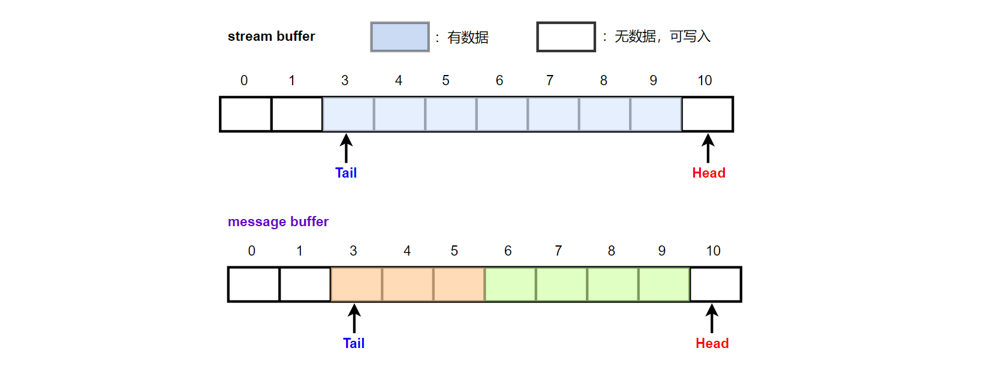

<center>
message buffer 是基于stream buffer构建的一种轻量级消息传递方式，因此使用message buffer和使用stream buffer存在相同的限制：只有一个写，并且也只有一个读。
</center>

<!--more-->

***
[stream buffer](https://fengxun2017.github.io/2023/02/22/FreeRTOS-stream-buffer/)提供了一种轻量级的数据流传递方式，所谓数据流，即数据的收发都是以字节为单位的。例如，
`stream buffer`的发送数据API：`xStreamBufferSend`，当我们需要发送`N`个字节时，当前`buffer`空间如果不够写入`N`字节，该API仍旧会根据当前可用空间来写入尽可能多的字节，并返回最终成功写入的字节数。
`stream buffer`的获取数据API：`xStreamBufferReceive`，当我们尝试最大获取`N`字节数据时，即使当前Buffer并没有那么多的数据，该API 仍旧会根据当前buffer内的数据量返回尽可能多的数据，并最终返回成功获取到的字节数。


这是因为数据流，是没有数据“边界”的概念，发送时会更具当前可用空间大小尽可能多的发送数据。获取数据时，也是尽可能多的获取数据，能获取多少就获取多少。发送和接收过程可能会在任意一个字节发送/接收完成后结束。

`message buffer`是基于`stream buffer`来实现的。因此使用`message buffer`的场景中也只能有一个writer（任务或中断服务程序），也只能有一个reader（任务或中断服务程序）
与`stream buffer`相比，`message buffer`就提供了数据“边界的概念”。其发送/获取数据都是以消息为单位的（一个消息的长度可以任意）。例如：
对于发送消息API：`xMessageBufferSend`，同样是发送`N`个字节，该API 要么是将`N`字节全部发送成功，要么就一个字节也不发送（buffer内的剩余空间不够完整的存放一个消息），我们称为发送了一个大小为`N`的“消息”。
对于获取消息API：`xMessageBufferReceive`，每次调用要么获取数据大小为 0（buffer为空，没有消息），要么获取的数据是之前发送的一个大小为`N`的消息。

对于`stream buffer`和`message buffer`的区别，假设我们使用`stream buffer`的API，发送了两次数据，一次是3字节，一次是4字节。
同样的数据量，使用`message buffer`，一次是发送了一个3字节的消息，一次是发送了一个4字节的消息
它们的区别如下图所示：


对于`stream buffer`来说，数据是无边界的，存储在buffer里的就是字节流，对于上图存储在`stream buffer`中的 7 个字节，`stream buffer`可以通过一次获取数据API 全部读出来。
而对于`message buffer`来说，其中存储的数据是有边界的，一个是3字节的消息，另一个是4字节的消息。一次调用获取数据API，我们只能获得第一个3字节数据，再次调用一次获取数据API，才能获得剩下的 4 字节数据（`message buffer`不能通过一个API一次性获取这7字节，因为它们是两个消息）。 

#### message buffer如何知道消息的边界？

`message buffer`通过向buffer中插入一个**长度字段**，来实现识别消息的边界。
例如，当我们向`message buffer`中发送了一个3字节的消息，一个4字节的消息，`message buffer` 内部的存储实际为：

如此，当获取数据（消息）时，通过第一个长度字段就可以知道后续消息的实际长度，并按该长度读出完整的消息数据。
PS：32位处理器上，消息数据前的**长度字段**为 4 字节，不是上图的 1 字节。所以一个10字节的消息，实际占用的空间大小是14字节


#### message buffer的应用
如果你的应用场景中有一个采集任务，它需要采集多种数据，之后封装成多种消息（每个消息长度不一），并发送给另一个数据处理任务。
这种情况下，由于只有一个writer/reader，`message buffer` 可以作为`消息队列`的替代方案。 与`消息队列`一样，`massage buffer`也具有识别消息边界的功能，可以以消息为单位进行写/读，但`message buffer`每个消息的长度可以不一样（消息队列中每个消息长度是一样的，即使一个消息中有用数据实际很少，但占用空间大小是固定的），空间利用率会更高。


`message buffer`的使用和`stream buffer`的使用方式基本一致：
首先需要创建一个`message buffer`：
```c
MessageBufferHandle_t xMessageBufferCreate( size_t xBufferSizeBytes );
```
- xBufferSizeBytes：创建的`message buffer`所占空间的大小（以字节为单位）
- 返回值：message buffer的句柄，如果返回NULL，表示创建失败（堆空间不足）。


发送数据：
```c
size_t xMessageBufferSend( MessageBufferHandle_t xMessageBuffer,
                            const void *pvTxData,
                            size_t xDataLengthBytes,
                            TickType_t xTicksToWait );
```
- xMessageBuffer：message buffer句柄（xMessageBufferCreate 的返回值）。
- pvTxData：指向需要发送的消息的地址
- xDataLengthBytes：消息长度
- xTicksToWait：如果message buffer内空间不够，该值指定阻塞等待多久
- 返回值：返回xDataLengthBytes 表示成功地将完整消息写入了，返回0 表示写入失败（空间不足）。

获取数据：
```c
size_t xMessageBufferReceive( MessageBufferHandle_t xMessageBuffer,
                            void *pvRxData,
                            size_t xBufferLengthBytes,
                            TickType_t xTicksToWait );
```
- xMessageBuffer：message buffer句柄（xMessageBufferCreate 的返回值）
- pvTxData：用来存放所获取的消息的地址
- xBufferLengthBytes：pvTxData所指向空间的大小
- xTicksToWait：获取不到消息时，阻塞等待多久
- 返回值：本次获取的消息的长度。要么为0，要么是一个完成消息的长度。
  
**注意**：如果`message buffer`中可能存在的最大消息的大小为`N`，那么调用`xMessageBufferReceive`获取消息时，`pvRxData`所指的用来存放获取的消息的空间，其大小`xBufferLengthBytes`应该大于等于`N`，否则该消息永远无法从`message buffer`中取出。


一个简单的使用样例： task_a 向 `message buffer`写入消息，task_b 从`message buffer`中读取消息。

任务代码如下：
```c

// 向message buffer中，每次发送一个 3 字节消息和一个 4 字节消息。
void task_a( void *pvParameters ) {

    MessageBufferHandle_t mbuffer = (MessageBufferHandle_t)pvParameters;
    char data[9] = {1,2,3,4,5,6,7,8,9};
    int send_len = 0;
    for(;;) {

        // 发送一个 3 字节的消息。
        send_len = xMessageBufferSend(mbuffer, data, 3, pdMS_TO_TICKS(1000));
        SEGGER_RTT_printf(0, "sent %d bytes!\n", send_len);
        
        // 发送一个 4 字节的消息。
        send_len = xMessageBufferSend(mbuffer, data, 4, pdMS_TO_TICKS(1000));
        SEGGER_RTT_printf(0, "sent %d bytes!\n", send_len);
    }
}


// 从 message buffer中获取消息
void task_b( void *pvParameters ) {
    
    MessageBufferHandle_t mbuffer = (MessageBufferHandle_t)pvParameters;
    char data[10];
    int recv_len = 0;
    
    for(;;) {
        
        recv_len = xMessageBufferReceive(mbuffer, data, sizeof(data), pdMS_TO_TICKS(2000));
        SEGGER_RTT_printf(0, "%d bytes received\n", recv_len);

        //delay，让消费变慢
        vTaskDelay(pdMS_TO_TICKS(2000));

    }
}
```

main 函数如下：
```c
#include "FreeRTOS.h"
#include "task.h"
#include "message_buffer.h"

int main(void) {

    // 创建一个message buffer，最多可以放 20字节。
    MessageBufferHandle_t sbuffer= xMessageBufferCreate(20);

    if(NULL != sbuffer) {
        
        if (pdPASS == xTaskCreate(task_a, "task_a", 100, sbuffer, 1, NULL)
            && pdPASS == xTaskCreate(task_b, "task_b", 100, sbuffer, 1, NULL)){
            
            SEGGER_RTT_printf(0, "start FreeRTOS\n");
            vTaskStartScheduler();
        } 

    }

    // 正常启动后不会运行到这里
    SEGGER_RTT_printf(0, "insufficient resource\n");

    for( ;; );
    return 0;    
}
```


运行结果如下:
```
start FreeRTOS
sent 3 bytes!
sent 4 bytes!
3 bytes received    #用来存放接收消息的data 大小为10，但每次获取的数据仍旧只是一个完整消息的大小（3或4字节）
sent 3 bytes!
sent 0 bytes!       #没空间了，目前message buffer中还有一个4字节消息和一个3字节消息
                    #两个消息实际占用了 7 字节加8字节（两个消息的长度字段）
                    #还剩 5字节，不够4字节的消息+4字节长度，就不会发送，不会像stream buffer一样有多少空间发送多少数据。
4 bytes received
sent 0 bytes!
sent 4 bytes!
sent 0 bytes!
3 bytes received
sent 0 bytes!
sent 3 bytes!
sent 0 bytes!
4 bytes received
sent 0 bytes!
sent 4 bytes!
sent 0 bytes!
```


<br/>
ps：需要注意文章代码中的日志输出函数，产品代码中如果需要使用的话，需要考虑线程安全性（多任务安全性），因为中断/任务切换可能发生在另一个任务正在输出日志但还未输出完的时候，这就可能造成日志错乱


