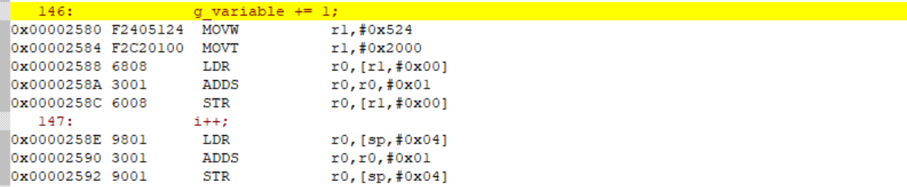
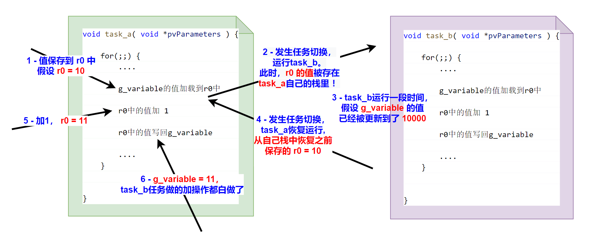
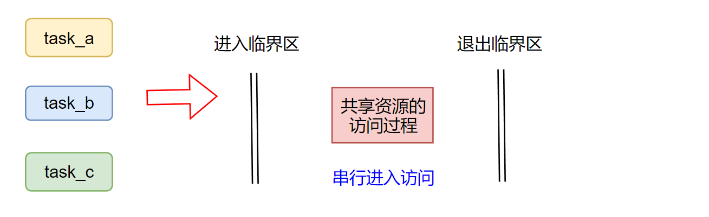
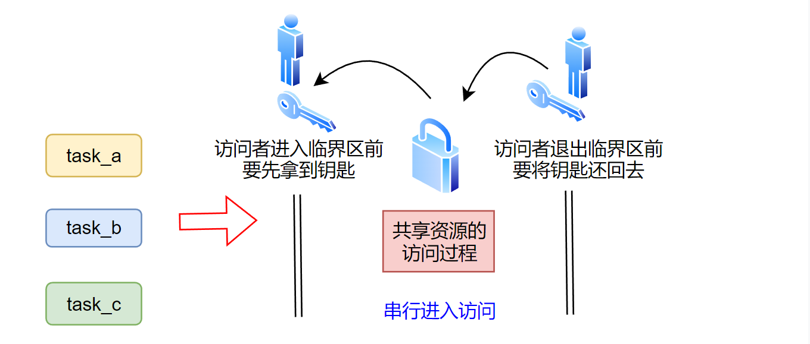

<center>
FreeRTOS 为多任务可以，安全地并发访问共享数据，提供了多种数据保护方案。例如，简单直接的关中断；关闭内核调度器；使用信号量。但应用开发最推荐的，是使用FreeRTOS提供的互斥量（mutex）来保护共享数据。
</center>

<!--more-->

***
#### 1 为什么要保护共享数据

我们直接以一个测试用例，来演示，当任务并发访问某个共享的全局变量时，如果不对数据访问加以保护，会产生什么样的结果。

首先，我们将工程配置文件FreeRTOSConfig.h中的`configTICK_RATE_HZ`设置大一点：
```c
#define configTICK_RATE_HZ			( ( TickType_t ) 100 )
```
这会让内核产生`Tick`中断频率更高，任务间地切换会更频繁，更容易暴露出多任务并发访问共享数据导致的错误。

我们定义一个任务：该任务就是对全局变量累加 `NUM` 次，然后输出结果。如下所示：
```c
int32_t g_variable = 0;
#define NUM (100)

void task_func( void *pvParameters ) {

    int i = 0;
    for(;;) {

        // 对g_variable 累加 NUM 次
        if (i < NUM) {
            g_variable += 1;
            i++;
        }
        
        // 累加完了输出
        if ( i == NUM ) {
            SEGGER_RTT_printf(0, "end, g_variable:%d\n",g_variable);
            i++;  // 加个1 避免一直输出
        }
    }
}
```

使用上面的函数，创建3个任务，3个任务对`g_variable`共累加 `3*NUM` 次，因此`g_variable`最终的结果应该是`3*NUM`。main 函数如下：
```c
int main(void) {
        
    if (pdPASS == xTaskCreate(task_func, "task_a", 100, NULL, 1, NULL)
        && pdPASS == xTaskCreate(task_func, "task_b", 100, NULL, 1, NULL)
        && pdPASS == xTaskCreate(task_func, "task_c", 100, NULL, 1, NULL)){

        SEGGER_RTT_printf(0, "start FreeRTOS\n");
        vTaskStartScheduler();
    } 
    
    // 正常启动后不会运行到这里
    SEGGER_RTT_printf(0, "insufficient resource\n");
    for( ;; );
    return 0;    
}
```
烧录运行后应该可以看到如下输出：当所有累加操作完成后，输出符合期望，即：`g_variable == 3*NUM` 
```
start FreeRTOS
end, g_variable:100
end, g_variable:200
end, g_variable:300
```

现在，我们将累加次数`NUM`调高：
```c
#define NUM (100000)
```
编译后，烧录运行。此时可以观察到，当所有累加操作完成后，输出的结果不符合期望：即：`g_variable != 3*NUM` 
```
start FreeRTOS
end, g_variable:206622
end, g_variable:153253
end, g_variable:206564
```
为什么会产生这样的结果？我们利用开发工具来查看下`g_variable += 1`这条 C 语句，所对应的汇编代码（keil工具点击Debug进入调试，点击菜单栏的view->Disassembly Window可以看到汇编代码）：将编译优化等级设置为-O0，关闭优化。开启编译器优化后的代码，一般会有指令重排，看起来会比较乱，没有下图的好解释。 


从上图，可以看到 `g_variable += 1`这条语句被翻译成了5 调汇编。 
MOVW 和 MOVT 两条指令的最终结果是将寄存器 r1 设置为常量： 0x20000524
在keil的编译输出文件 xxx.map 中，搜索 `g_variable`，可以看到它的地址：就是 0x20000524
```
g_variable       0x20000524   Data    4  main.o(.bss.g_variable)
```
即，MOVW 和 MOVT 两条指令的作用是将 `g_variable` 的地址加载到 r1 寄存器中。
接着 LDR 就是从 r1中值所指示的地址处读取数据（即读取`g_variable`）并放入 r0 寄存器中。
之后 ADDS 指令，将 r0 寄存器中的值加1
最后 STR 指令，就 r0 中的值，写到 r1值所指示的地址处（即更新`g_variable`）。

综上，C 语言的一个更新变量操作`g_variable += 1`。
在汇编层面，并不是一条指令就能完成，实际是由多条指令完成的：
- 将`g_variable`的值，从内存加载到到寄存器中 
- 寄存器中的值加 1    
- 寄存器中的数据写回内存

而内核的任务调度，可能会在上述三条指令的任意一条后发生。那么，就可能会发生`任务A`正在更新变量`g_variable`的值，但还未完成更新时，内核进行了任务切换，让另一个`任务B`开始运行。而`任务B`刚好也在更新这个值，那么会发生错误。如下图所示：

如上图所示，当`task_a`将全局变量`g_variable`的值加载到了寄存器后，还未更新数据并写回。此时，发生切换，内核会先将当前的“现场”（即一些硬件寄存器中的值）保存在`task_a`自己的栈中，然后开始运行`task_b`，`task_b`也会更新`g_variable的值`。过了一段时间，再次发生任务切换，任务`task_a`恢复运行，内核会先将`task_a`栈中保存的“现场”数据恢复（这样`task_a`的运行状态就会和被打断前一致），之后执行 加 1 操作，以及写回操作。 此时，写回变量`g_variable`的值，是`task_a`被中断前记录的旧值 + 1，而不是`task_b`更新后的值 + 1。 最终，导致了数据结果不符合预期。


这个例子中，共享资源只是一个 全局整型变量。有时，我们可能需要自定义一种结构体数据，并且定义了一个该类型的共享变量。如下所示：
```c
struct MyData{
    int field_0;
    int field_1;
    int field_2;
};

MyData var;
```
我们定义了一个 结构体类型变量`MyData var;`，该变量会被多个任务并发读/写。假设，每次写它时，需要写它的三个域；每次读时，也要读三个域的值。如下所示:
```c
// write
var.field_0 = xx;
var.field_1 = xx;
var.field_2 = xx;

//read 
if (var.field_0 == xx 
    && var.field_1 == xx
    && var.field_2 == xx) {
        ....
    }
```
对于这种情况，在 C 语言层面上的，写和读 就已经是多条语句了。所以不仅写需要操作需要保护（要么不执行，要么一次三个域都写完），读操作也需要进行保护（要么不读，要么三个域一起读完），否则读到一半，切换到另一个也会修改该变量的任务，等一段时间后又切换回被打断的这个任务，那么读到的三个域，就是部分属于旧值，部分属于新值（切换的那个任务修改的）。


#### 2 如何保护对共享数据的访问

了解了问题产生原因，那么如何解决这种问题？ 如果对共享资源的访问操作（如`g_variable += 1`）是“原子操作”。即，要么执行了，要么没执行，不出现执行到一半被打断的情况。那就能保证数据的最终结果是符合预期的。

因此，当有多个任务并发访问共享数据时，我们需要让访问操作成为“原子操作”，要么不执行，执行就一定执行完。 或者说构建一个临界区，将访问操作保护起来，只要有一个任务在临界区中访问数据，该任务退出临界区前，其它任务就不能进入临界区。如下图所示：



FreeRTOS实现临界区的办法很多：

##### 2.1 临时关闭中断实现临界区
在[FreeRTOS-硬件中断嵌套模型和内核临界区](https://fengxun2017.github.io/2022/12/25/FreeRTOS-interrupt-nesting/)一文中，我们介绍了FreeRTOS通过临时关闭中断的方式，实现了多任务可以安全地并发访问内核资源。例如，当我们创建多个任务，当这些任务均会向同一个消息队列中发送/提取 消息时（这会涉及到消息队列内部数据的变动，如果不加保护，多任务并发访问时肯定会破坏内部数据状态），我们直接使用FreeRTOS的发送/提取消息 API，不需要考虑多任务/中断处理函数并发访问消息队列时，如何保证消息队列内部数据结构不被破坏，因为内核在这些 API 内部已经实现了临界区，将对消息队列的访问过程进行了保护，使得消息队列内部数据状态不会被因任务并发访问而被破坏。
内核的实现临界区的方式，就是临时屏蔽中断（进入临界区），这样可以避免内核任务切换，以及其它中断的抢占，实现对共享数据的互斥访问。当访问完成后，再取消屏蔽（退出临界区）。

但关闭中断的方式，过于粗糙。毕竟中断都是用来响应重要事件，临时屏蔽中断很可能会导致一些重要事件的响应被延迟。因此，非必要的情况下，不应该使用这种方式。

##### 2.2 临时关闭内核任务调度
另一种实现临界区的方式，是通过`vTaskSuspendAll`临时关闭内核的任务调用（进入临界区），共享资源访问结束后，再通过`xTaskResumeAll`恢复内核任务调度（退出临界区）。

不过， `vTaskSuspendAll` 只关闭了内核任务调度，避免了任务间的切换。但是，中断此时仍是正常使能的。

如果只是多个任务会并发的访问共享资源，通过临时关闭内核任务调度功能来实现临界区是可行的，任务在访问数据期间不会切换，也就不会出现任务访问共享数据一半时，内核切换到其它任务（该任务也访问共享数据）的情况。

任务调度的挂起操作虽然开销很低（更新内部标记变量），但是任务调度的恢复操作开销可能会很高。因为，在调度关闭过程中，大量内核`tick`中断中的内核任务调度相关工作都被延迟到了 任务调度恢复的时候再执行。

##### 2.3 使用互斥量

对于应用开发来说，互斥量（mutex）是实现临界区最合适工具。FreeRTOS 提供的互斥量，实际上是一种特殊的[二值信号量](https://fengxun2017.github.io/2022/12/15/FreeRTOS-use-binary-semaphore/)。FreeRTOS的互斥量，就是在二值信号量的基础上增加了优先级继承特性，优先级继承特性使得互斥量相比普通的二值信号量，能最小化[优先级反转](https://fengxun2017.github.io/2023/01/07/FreeRTOS-priority-inversion/)带来的负面影响，更适用来实现临界区，保护数据的访问过程。

我们可以将互斥量理解成一把钥匙，每次访问共享资源前（进入临界区），必须需要先拿到钥匙，否则就不允许访问，任务可以原地阻塞等到可以拿到钥匙，或者返回拿不到钥匙的错误信息。 一旦拿到钥匙（进入了临界区中），就可以安全的访问共享资源了（因为此时不会有其它人拿到钥匙），等访问结束，将钥匙还回去，这样后续的其它访问请求就能拿到钥匙，继而访问数据，如下图所示：

可以发现，使用互斥量实现临界区来保护数据的访问过程，依赖于开发者保持一致的协议。即所有访问请求，必须拿到钥匙后才能执行后续访问，访问完成需要还回钥匙。如果，和你协作的开发者不遵守这个约定，不请求获取钥匙就直接去访问共享数据，那么数据的访问过程就不再是受保护的了。

由于互斥量本身就是属于一种特殊地二值信号量。因此，内核实现互斥量地原理和实现信号量地原理是一样地，都是基于内核消息队列来实现的（更详细的原理解释，可以参考文章[二值信号量](https://fengxun2017.github.io/2022/12/15/FreeRTOS-use-binary-semaphore/)的第二节内容）。
创建一个互斥量，实际是创建一个大小为 1 的消息队列来，并且初始状态下，该消息队列中就存储了一个“消息”（只是内部的一个计数表示存在一个消息，没有实际存储）。
获取钥匙，就是从该消息队列中提取消息，如果没有消息（钥匙被别人拿走了），就原地阻塞，或者返回错误信息。
返还钥匙，就是向该消息队列中发送一个消息。此时如果刚好存在其它任务在等待“钥匙”，就能立刻获取到钥匙了。

在FreeRTOS中，互斥量的操作API 有部分是和信号量公用的（毕竟互斥量本身就是一种特殊的二值信号量）。
使用互斥量，首先需要在工程配置文件FreeRTOSConfig.h 中添加宏定义：
```c
#define configUSE_MUTEXES   (1)
```
**创建互斥量的 API 为**：
```c
SemaphoreHandle_t xSemaphoreCreateMutex( void );
```
- 返回值为NULL，表示创建失败。否则，返回的就是用来识别所创建的互斥量的句柄。
<br/>


**获取互斥量（拿到钥匙）的 API为**： 和获取信号量的API为同一个
```c
BaseType_t xSemaphoreTake( SemaphoreHandle_t xSemaphore, TickType_t xTicksToWait );
```
- xSemaphore：互斥量句柄，创建API 的返回值。
- xTicksToWait：如果当前“钥匙”已经被人拿走了，任务想原地阻塞，等待“钥匙”被其它访问者还回来时。该值就是设置最长等待多久。如果为0，表示不等待，立刻返回结果。
- 返回值：
  - pdPASS-成功获取到“钥匙”，可以安全访问数据了。
  - pdFAIL-没有获取到“钥匙”，说明有其它访问者正在访问，此时任务不应该访问共享数据。
  

**返还互斥量（返还钥匙）的 API为**：和设置信号量的API 为同一个
```c
BaseType_t xSemaphoreGive( SemaphoreHandle_t xSemaphore );
```
<br/>

**需要注意的是：互斥量不能在中断环境中使用（普通的信号量是可以的）！ 这是由于互斥量含有的优先级继承特性（[参考文章：优先级反转](https://fengxun2017.github.io/2023/01/07/FreeRTOS-priority-inversion/)），是和当前持有该互斥量的任务的优先级关联的。 而中断是没有任务优先级概念的！**

现在，我们来使用互斥量，解决文章开始例子中多任务对全局变量 `g_variable` 并发访问造成的结果不符合期望的问题。

我们使用互斥量实现临界区，将`g_variable += 1`操作保护起来，如下所示：
```c
int32_t g_variable = 0;
#define NUM (100000)

void task_func( void *pvParameters ) {

    SemaphoreHandle_t mutex = (SemaphoreHandle_t)pvParameters;
    int i = 0;
    for(;;) {
        if (i < NUM) {
            // 只有成功获取到互斥量时，才能访问
            if (pdPASS == xSemaphoreTake(mutex, 0)) {
                g_variable += 1;
                i++;

                // 访问结束，返还互斥量
                xSemaphoreGive(mutex);
            }
        }
        
        if ( i == NUM ) {
            SEGGER_RTT_printf(0, "end, g_variable:%d\n",g_variable);
            i++;

        }
    }
}
```

main 函数代码如下：
```c
int main(void) {
    
    SemaphoreHandle_t mutex;

    //创建互斥量
    mutex = xSemaphoreCreateMutex();

    // 创建三个任务，并将互斥量作为参数传递给任务
    if (NULL != mutex) {
        if (pdPASS == xTaskCreate(task_func, "task_a", 100, mutex, 1, NULL)
            && pdPASS == xTaskCreate(task_func, "task_b", 100, mutex, 1, NULL)
            && pdPASS == xTaskCreate(task_func, "task_c", 100, mutex, 1, NULL)){

            
            SEGGER_RTT_printf(0, "start FreeRTOS\n");
            vTaskStartScheduler();
        } 
    }
    
    // 正常启动后不会运行到这里
    SEGGER_RTT_printf(0, "insufficient resource\n");

    for( ;; );
    return 0;    
}
```
编译后烧录运行，结果如下：可以发现最终结果是服务期望的了
```
start FreeRTOS
end, g_variable:246888
end, g_variable:271449
end, g_variable:300000
```

运行的时候，可以发现一个问题，就是运行时间变长了。
这是因为三个任务都在频繁的竞争“钥匙”，耗费了大量时间。并且由于 任务a 获得“钥匙”后，如果内核切换到了 任务b，上面的代码中由于任务b 拿不到“钥匙”，一直在空转，直到内核再次切换任务。这也浪费了很多时间。
将 `if (pdPASS == xSemaphoreTake(mutex, 0))` 改为 `if (pdPASS == xSemaphoreTake(mutex, pdMS_TO_TICKS(100))) `，可以提高运行速度。因为，设置了等待时间，那么任务拿不到“钥匙”时就会阻塞而不是一直空转，这样持有“钥匙”的任务就能尽快恢复运行，继而返还“钥匙”，让其它任务能获得“钥匙”并访问数据。

多线程（FreeRTOS中为多任务）的数据竞争问题（并发或并行访问共享数据），不管是在PC平台中，还是在嵌入式平台中，都是一个很复杂的主题，实际开发中会有很多涉及效率和数据安全的问题，例如：
- 临界区应该尽可能的小：在实际开发中，当使用互斥量实现临界区对数据访问过程进行保护时，应该让临界区尽可能地“小”（临界区内执行的耗时尽可能地短），这样可以减少多任务因为竞争“钥匙”造成的运行效率损失， 特别是在多核系统中，临界区的存在会使得多线程并行转成串行（执行临界区保护的那段数据访问过程）。所以，临界区越小越好。
- 尽量不使用递归互斥量：互斥量一旦被一个任务持有了，其它任务就不可能再获取到，只有持有互斥量的任务释放了互斥量，其它任务才能获取到。 并且，当任务a 已经持有互斥量b 时，任务a 不能再次去获取互斥量 b。因为互斥量b 已经被获取了，不管它是被谁获取的。
但是，可递归互斥量（有一套独立的API），允许任务a 再持有信号量b 的情况下，再次获取信号量b。但实际开发中，我们应该避免使用可递归互斥量，它会增加复杂性，语义也没有一般互斥量那么明确（任何时候只能被一个任务持有一次）。如果你需要使用可递归互斥量，首先应该考虑的是软件结构能否优化？尽量避免使用它。
- 小心死锁问题：这是个教科书里都会介绍的基本问题，但开发中仍旧很容易碰到，网上有很多针对死锁问题的资料。
- 中断处理函数需要访问共享数据怎么办？：前文提到，中断中不能使用互斥量（中断没有任务优先级的概念，而互斥量会和持有它的任务的优先级关联）。因此，涉及到中断服务中访问共享数据，可以创建一个额外的任务，使用信号量同步中断事件给该任务，并在该任务中执行访问共享数据的实际操作（等于将访问操作延后了，延后到中断退出后，在一个普通任务中再执行数据访问）。或者使用FreeRTOS提供的延后执行机制将。可以参考文章：[FreeRTOS-延后执行机制](https://fengxun2017.github.io/2022/12/01/FreeRTOS-deferring-work/)


<br/>
ps：需要注意文章代码中的日志输出函数，产品代码中如果需要使用的话，需要考虑线程安全性（多任务安全性），因为中断/任务切换可能发生在另一个任务正在输出日志但还未输出完的时候，这就可能造成日志错乱

<br/>
<br/>
FreeRTOS交流QQ群-663806972


