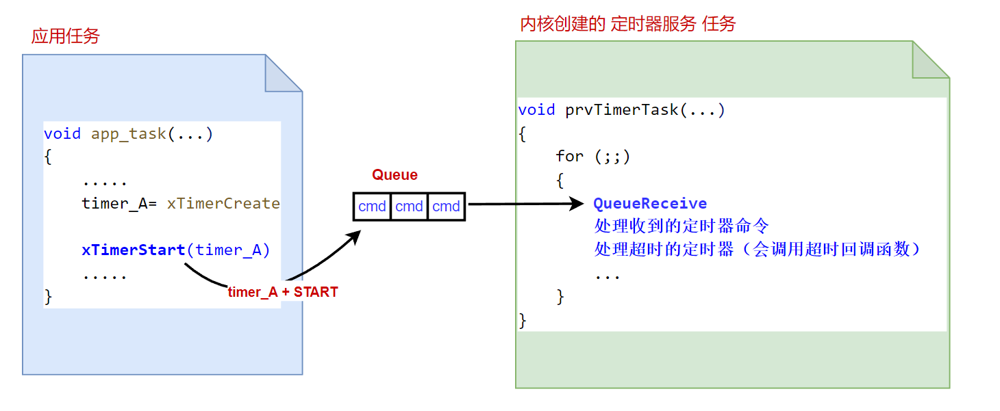

<center>
FreeRTOS提供的软件定时器，在使用上有几个需要开发者注意的事项。如软件定时器可以识别的基本时间单位，软件定时器服务任务的优先级设置的是否合适，以及软件定时器超时回调函数中不要使用会让当前任务（软件定时器服务任务）进入阻塞态的 FreeRTOS API。

</center>
<!--more-->

***
#### 软件定时器可以识别的基本时间单位：
内核在每次`tick中断`发生时，会更新其内部的`tick`计数值加 1，来实现“感知时间”功能（更多信息可以参考文章：[FreeRTOS-内核对时间的测量](https://fengxun2017.github.io/2022/11/08/FreeRTOS-%E5%86%85%E6%A0%B8%E5%AF%B9%E6%97%B6%E9%97%B4%E7%9A%84%E6%B5%8B%E9%87%8F/)）。而FreeRTOS提供的软件定时器，就是基于内核的`tick`计数值，来实现定时功能的。
例如，假设内核的`tick中断`产生的周期为100 ms，即每100 ms产生一次`tick中断`。如果一个定时器设定的超时时间为 1秒，那么识别该定时器超时，就是识别从该定时器启动后，`tick`计数值是否增加了10。

因此，**FreeRTOS的软件定时器，可以识别的基本时间单位，就是内核产生`tick中断`的周期**。`tick中断`周期由工程配置文件`FreeRTOSConfig.h`中定义的`configTICK_RATE_HZ`决定：
```c
#define configTICK_RATE_HZ			( ( TickType_t ) 100 )

```
如上配置，就是设置内核产生`tick中断`的频率，为一秒产生100次`tick中断`，即周期即为 10 ms。 **那么软件定时器，可以识别的基本时间单位就是10ms，可以设置的超时时间需要是 10ms 的 n 倍（n为大于 0的整数）**。
如果设定的超时时间小于10ms，对定时器来说就是0，这个参数是不合法的，如果我们在开发阶段使能了断言宏，就会立刻报错。

在开发阶段，我们应该实现工程配置文件`FreeRTOSConfig.h`中的断言宏 `configASSERT`。很多配置、参数错误的问题，内核都会通过`configASSERT`给出错误的位置。例如一个简单的实现：
```c
extern void vAssertCalled( const char * pcFile, uint32_t ulLine );

#define configASSERT( x ) if( ( x ) == 0 )	vAssertCalled( __FILE__, __LINE__ )
```
然后在 main.c 或其它源文件中实现具体的函数，将出错的文件和具体行号信息输出：
```c
void vAssertCalled( const char * pcFile, uint32_t ulLine ){
    // 替换成自已的日志输出函数
    SEGGER_RTT_printf(0, "error at:%s, line:%d\r\n", pcFile, ulLine);
    for(;;){}
}
```

如果定义了上述宏`configASSERT`，那么在调用 API `xTimerCreate`创建软件定时器时，如果传入的定时器超时时间，小于软件定时器可以识别的基本时间单位，就会立刻给出错误提示。

#### 软件定时器服务任务(prvTimerTask)优先级的影响：

在之前的两篇文章[FreeRTOS-软件定时器的实现原理](https://fengxun2017.github.io/2022/11/27/FreeRTOS-principle_of_timer/)和[FreeRTOS-软件定时器的使用](https://fengxun2017.github.io/2022/11/16/FreeRTOS-use-timer/) 中，介绍了FreeRTOS的软件定时器，是一种分离式的设计。如下图所示：

当我们调用软件定时器相关的 API 时，内部实际是发送了相应的定时器命令到`软件定时器专用的消息队列`中，而软件定时器服务任务（`或称为daemon task，使能FreeRTOS的软件定时器功能后，内核在启动时会自动创建该任务`），**即上图中的prvTimerTask任务**，会从软件定时器专用的消息队列中，提取定时器命令，并处理。
此外，每当有定时器的超时时间到达了，其超时回调函数（`创建定时器时的参数pxCallbackFunction`）也是在`prvTimerTask`任务中调用的。

`prvTimerTask`任务的优先级，在工程配置文件`FreeRTOSConfig.h` 中定义，如下配置即将其优先级设置为 2
```c
#define configTIMER_TASK_PRIORITY		( 2 )
```
由于软件定时器的超时回调函数，是在`prvTimerTask`任务中调用的。因此，不能让`prvTimerTask`任务长时间得不到运行。否则，即使一些定时器超时了，由于`prvTimerTask`任务得不到运行，那么也就不能调用那些已经超时的定时器 的超时回调函数。

一个简单的测试实验，配置定时器服务任务`prvTimerTask`的优先级为2，并创建一个周期定时器，输出信息。再创建 2个优先级均为 3的任务`task_a`和`task_b`。`task_a`无限循环一直空跑，`task_b`则每秒输出一次信息。如下所示:
```c

// 定时器超时回调函数
void timer_callback( TimerHandle_t timer ) {
    // 替换成自己的日志输出
    SEGGER_RTT_printf(0, "timer timeout\n");
}

// 空转，不让任务进入阻塞态，所以一直保持为就绪态（被运行时就是运行态）
void task_a( void *pvParameters ) {
    for(;;) {
    
    }
}

// 每秒输出一次日志信息
void task_b( void *pvParameters ) {
    for(;;) {
        SEGGER_RTT_printf(0, "task_b running\n");
        vTaskDelay(pdMS_TO_TICKS(1000));
    }
}


int main(void) {

    TickType_t timer_period = pdMS_TO_TICKS(1000);
    TimerHandle_t timer;

    // 创建定时器
    timer = xTimerCreate("Timer", timer_period, pdTRUE, NULL, timer_callback);
    if(NULL != timer ) {
        
        // 创建task_a， task_b
        if (pdPASS == xTaskCreate(task_a, "task_a", 100, NULL, 3, NULL)
            && pdPASS == xTaskCreate(task_b, "task_b", 100, NULL, 3, NULL)){
            
            SEGGER_RTT_printf(0, "start FreeRTOS\n");
            // 启动定时器
            xTimerStart(timer, 0);
            vTaskStartScheduler();
        } 
    }
    // 正常启动后不会运行到这里
    SEGGER_RTT_printf(0, "insufficient resource\n");

    for( ;; );
    return 0;    
}
```
烧录程序运行，只能看到 `task_b`的输出信息，看不到定时器超时回调函数的输出信息。
```
start FreeRTOS
task_b running
task_b running
task_b running
task_b running
task_b running
....
```
这是因为，`task_a`任务一直保持空转，没有调用任何会阻塞`task_a`任务的api，所以它一直是就绪态（被运行时，就是运行态），任务调度时总是选择处于就绪状态且优先级最高的那个任务，由于`task_a`优先级又比`prvTimerTask`高，所以每次都不会选择`prvTimerTask`任务。`task_b`能得到运行，是因为它和`task_a`优先级一样，所以`task_b`和`task_a`轮流运行（时间片调度）。

如果将`task_a`、`task_b`和`prvTimerTask`优先级都设置相同，默认就是轮流调用，此时就能看到定时器超时回调函数的输出信息。
```
start FreeRTOS
task_b running
timer timeout
task_b running
timer timeout
task_b running
timer timeout
....
```


#### 不要在超时回调函数中调用会让任务阻塞的 API：
原因还是如上一节所述，软件定时器的超时回调函数，是在`prvTimerTask`任务中调用的，如果你在某个定时器的超时回调函数中，调用了会让任务阻塞的API（`如vTaskDelay`），那么`prvTimerTask`任务就会进入阻塞态，会暂停运行，那么也就不能调用那些已经超时的定时器的超时回调函数了。超时回调函数需要等到`prvTimerTask`任务恢复就绪态，且`prvTimerTask`任务被调度时才能被调用。（ `但对于类似xQueueSend有超时参数的 API，当超时参数设置为 0时，任务是不会阻塞的，所以可以使用`）

一个简单的测试例子：创建两个单次触发的定时器`timer1`和`timer2`，超时时间均为 1秒钟，启动时先启动`timer1`。在`timer1`的超时回调函数中调用`vTaskDelay`，让其延迟 5秒钟。则可以观察到，`timer2`的超时回调函数，需要等到 5秒延迟结束后才会被调用。
代码如下：
```c

void timer1_callback( TimerHandle_t timer ) {
    SEGGER_RTT_printf(0, "timer1 timeout\n");
    // 这里会让当前任务（prvTimerTask）阻塞
    vTaskDelay(pdMS_TO_TICKS(5000));
}

void timer2_callback( TimerHandle_t timer ) {
    SEGGER_RTT_printf(0, "timer2 timeout\n");
}
int main(void) {

    TickType_t timer1_period = pdMS_TO_TICKS(1000);
    TickType_t timer2_period = pdMS_TO_TICKS(1000);

    TimerHandle_t timer1, timer2;
    timer1 = xTimerCreate("Timer", timer1_period, pdFALSE, NULL, timer1_callback);
    timer2 = xTimerCreate("Timer2", timer2_period, pdFALSE, NULL, timer2_callback);
    
    if(NULL != timer1 && NULL != timer2) {
        SEGGER_RTT_printf(0, "start FreeRTOS\n");
        
        // 超时时间相同，先启动 timer1
        // 则超时时间到达时,会先调用 timer1的超时回调
        xTimerStart(timer1, 0);
        xTimerStart(timer2, 0);
        vTaskStartScheduler();
    }

    // 正常启动后不会运行到这里
    SEGGER_RTT_printf(0, "insufficient resource\n");
    for( ;; );
    return 0;    
}
```
烧录运行可以看到如下输出信息：
```
start FreeRTOS
timer1 timeout
timer2 timeout  # 5秒延迟后才能看到该信息
```

<br/>
ps：需要注意文章代码中的日志输出函数，产品代码中如果需要使用的话，需要考虑线程安全性（多任务安全性），因为中断/任务切换可能发生在另一个任务正在输出日志但还未输出完的时候，这就可能造成日志错乱

<br/>

<br/>
FreeRTOS交流QQ群-663806972

<br/>
<br/>

参考连接：[FreeRTOS software timers](https://www.freertos.org/RTOS-software-timer-service-daemon-task.html)