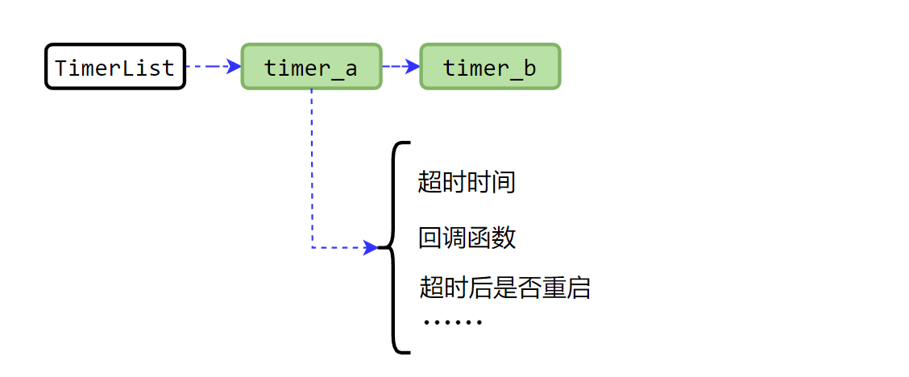
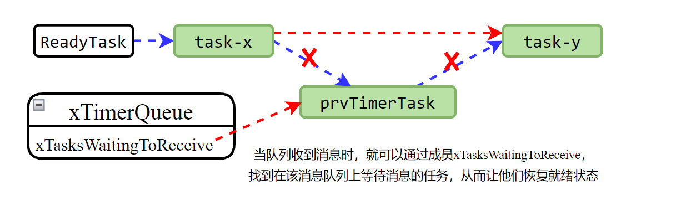
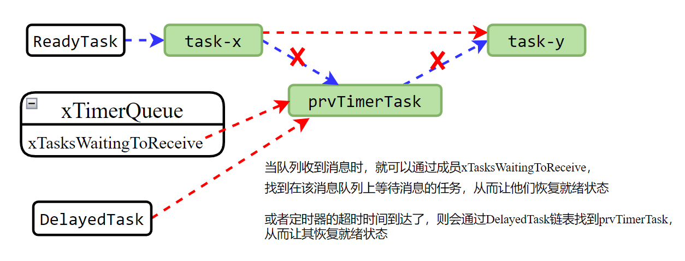

<center>
本文介绍FreeRTOS软件定时器的实现原理。
</center>
<!--more-->

***

FreeRTOS的软件定时器实际使用，可以参考：[FreeRTOS-软件定时器的使用](https://fengxun2017.github.io/2022/11/16/FreeRTOS-use-timer/)

#### 1 软件定时器的整体逻辑
FreeRTOS的软件定时器不依赖于任何额外的硬件定时器，完全由内核通过软件来实现的。
使用FreeRTOS 的软件定时器（timer）,需要在工程中包含 `FreeRTOS/Source/timers.c`文件，并且在`FreeRTOSConfig.h`文件中添加宏：
```c
#define configUSE_TIMERS				1
```
一旦配置了宏`configUSE_TIMERS = 1`，在调用 启动内核调度API：`vTaskStartScheduler`时，该函数内部会创建一个名为**xTimerQueue**的消息队列和一个名为**prvTimerTask**的定时器服务任务（timer.c文件中）：
```c
void vTaskStartScheduler( void ) {
    ...
    #if ( configUSE_TIMERS == 1 )
        // 该函数内部会创建软件定时器需要的资源，
        // 如消息队列xTimerQueue，定时器服务任务prvTimerTask 等
        xReturn = xTimerCreateTimerTask();
    #endif
    ...
}

```
- **xTimerQueue**：为软件定时器模块专用的消息队列。
- **prvTimerTask**：软件定时器服务任务，该任务创建后，就会一直存在。该任务会从消息队列**xTimerQueue**中提取消息，并处理消息中包含的软件定时器相关命令

调用FreeRTOS的软件定时器相关API时，实际是发送了相关的命令到消息队列**xTimerQueue**中（例如，调用`xTimerStart`启动某个定时器时，实际是将 start命令和要启动的定时器句柄，封装成一个消息体，并发送到消息队列xTimerQueue中。 ），**prvTimerTask**任务则从消息队列**xTimerQueue**中提取消息，解析相关命令并执行对应处理。

如下图所示：在自定义任务app_task中，使用软件定时器API `xTimerCreate`创建一个软件定时器，该函数会返回一个**用来识别当前创建的这个定时器的句柄 timer_A**，当我们调用 `xTimerStart` 启动定时器 **timer_A**时，函数内部实际是将**START命令** 和 **定时器句柄timer_A**封装成一个消息体，并放入定时器服务专用的**消息队列 xTimerQueue**中，而**定时器服务任务prvTimerTask**则从该消息队列中提取消息，并根据消息中的命令执行相应的动作。


为什么需要这种分离式的架构（为什么弄一个独立的定时器服务任务）？ 软件定时器提供了一种延后执行的功能，可以在未来某个时间执行某个动作。所以需要有相关的数据结构来维护这些信息（记录哪些时间点会有某个定时器超时，以及超时要执行的动作）。
这些数据结构和功能直接在内核代码中实现也是可以的，但是软件定时器并不属于内核**必备功能**（任务调度，时间的感知就属于内核必备功能），所以FreeRTOS将其抽离出来，单独实现在Timer.c文件中，做成一个可选功能（对于资源受限设备，并且不需要软件定时器功能时，去掉改功能可以节省ROM和RAM资源）。如果应用需要使用软件定时器时，内核启动时就会自动创建一个TimerTask任务来处理所有软件定时器相关的工作。
因此，我们自定义的任务需要调用软件定时相关API时，就需要和TimerTask任务进行通信，FreeRTOS中任务间通信，可以通过消息队列来实现。当然，这些通信的实现，FreeRTOS已经封装好了（即调用API时，API内部自动封装相应的消息体，并发送到消息队列中）。
<br/>

#### 2 内核如何实现在设置的超时发生后，调用设置的回调函数

下文涉及到内核中的多个任务队列，如果不了解，可以先参考这篇文章[FreeRTOS的任务调度和管理](https://fengxun2017.github.io/2022/11/01/FreeRTOS-task-status-management/)

软件定时器模块维护了一个 定时器链表 **TimerList**，基于内核的[链表数据结构](https://fengxun2017.github.io/2022/11/04/FreeRTOS-kernel-list/)实现。当调用`xTimerStart`启动一个定时器时， api内部会将 start命令+要启动的定时器 封装成一个消息体发送到到消息队列中，而软件定时器服务任务`TimerTask`则从消息队列中提取消息体，并将其中的定时器插入到定时器链表 **TimerList**中。大致如下图所示：


定时器链表**TimerList** 中的每一项，维护了一个定时器的相关信息（定时器的超时时间，超时后需要调用的回调函数等）。并且，该链表是按照 定时器的超时时间 递增排序的。这样，每次判断超时时间是否到达时，只需要判断第一个即可，如果第一个定时器还未超时，则后面的均未超时。

在后台常驻的定时器服务任务**prvTimerTask**，会通过该链表来判断是否有定时器超时。
定时器服务 任务的大致代码逻辑如下：
```c
void prvTimerTask( void * pvParameters ){
    
    ....

    for( ; ; )
    {
    
        // 查询定时器链表的第一项，获取其中的定时器超时时间
        xNextExpireTime = prvGetNextExpireTime( &xListWasEmpty );

        // 判断定时器是否超时，如果超时，则调用定时器回调函数
        // 如果没超时，则阻塞当前任务（定时器服务任务），直到超时
        // 或者消息队列xTimerQueue 收到新消息。
        prvProcessTimerOrBlockTask( xNextExpireTime, xListWasEmpty );

        // 处理消息队列xTimerQueue 中的定时器相关命令
        prvProcessReceivedCommands();
    }

}
```
其中：
- prvGetNextExpireTime：该函数内部会查询定时器链表的第一项，获取其中的定时器超时时间。返回值`xNextExpireTime`，即链表中第一个定时器的超时时间，`xListWasEmpty`返回当前定时器链表是否为空（为空，则表示当前没有正在运行的定时器）。

- prvProcessTimerOrBlockTask：该函数内部会根据是否存在定时器，以及定时器是否超时等情况，执行不同的处理过程。
  - **情况1**：如果上一步获得的`xListWasEmpty=pdTRUE`，即当前没有正在运行的定时器，那么该函数中就会一直阻塞（即软件定时器服务任务`prvTimerTask`阻塞），直到消息队列`xTimerQueue`收到消息。
  
     这是通过将当前任务（prvTimerTask）从就绪队列中移除，并挂到消息队列的`xTimerQueue`的等待消息任务链表上（xTimerQueue的成员xTasksWaitingToReceive）。其过程如下图所示：
     
     这样，当消息队列`xTimerQueue` 中有数据时（有新的定时器相关命令），就会可以通过`xTasksWaitingToReceive`成员，直接找到任务`prvTimerTask`，并使其恢复就绪状态。

  
  - **情况2**：如果`xListWasEmpty=pdFALSE`，即当前有正在运行的定时器存在，并且当前时间（内部通过`xTaskGetTickCount()`获得系统当前“时间”）已经大于上一步获得的`xNextExpireTime`，则表明定时器链表中的第一个定时器已经超时了，那就就会调用定时器的超时回调函数。在函数`prvProcessTimerOrBlockTask`内部，会调用`prvProcessExpiredTimer`来处理超时的定时器，代码逻辑大致如下：
    ```c
    void prvProcessTimerOrBlockTask( const TickType_t xNextExpireTime, BaseType_t xListWasEmpty ) {
        ....
        // 获取当前时间
        xTimeNow = prvSampleTimeNow( &xTimerListsWereSwitched );
        // 定时器链表不为空，且第一个定时器的超时时间到达了
        if( ( xListWasEmpty == pdFALSE ) && ( xNextExpireTime <= xTimeNow ) )
        {
            ...
            // 处理超时
            prvProcessExpiredTimer( xNextExpireTime, xTimeNow );
        }
        ....
    }

    // 处理超时内部实现
    void prvProcessExpiredTimer( const TickType_t xNextExpireTime, const TickType_t xTimeNow ) {
        // 超时的是定时器链表中的第一个定时器，获取它
        Timer_t * const pxTimer = ( Timer_t * ) listGET_OWNER_OF_HEAD_ENTRY( pxCurrentTimerList ); 

        // 已经超时了，将其从定时器链表中移除
        ( void ) uxListRemove( &( pxTimer->xTimerListItem ) );

        // 如果这个定时器时周期性的定时器，那么超时后，需要重置它，让它再次开始计时。内部会将其再次插入到定时器链表TimerList中
        if( ( pxTimer->ucStatus & tmrSTATUS_IS_AUTORELOAD ) != 0 )
        {
            prvReloadTimer( pxTimer, xNextExpireTime, xTimeNow );
        }
        ...
        // 调用创建定时器时设置的回调函数。
        pxTimer->pxCallbackFunction( ( TimerHandle_t ) pxTimer );
    }
    ```
  
  
  -  **情况3**：如果`xListWasEmpty=pdFALSE`，即当前有定时器存在，但是当前时间（内部通过`xTaskGetTickCount()`获得系统当前“时间”）小于上一步获得的`xNextExpireTime`，则表明现在没有定时器超时。那么，当前函数`prvProcessTimerOrBlockTask` 就会阻塞（即prvTimerTask任务阻塞），直到到达超时时间`xNextExpireTime`，或者消息队列`xTimerQueue`收到消息。
  实现原理同上，只是这里不仅将任务`prvTimerTask`挂到消息队列`xTimerQueue`的等待消息任务链表上（xTimerQueue的成员xTasksWaitingToReceive），同时还会挂到内核的`DelayedTaskList`链表（延迟任务队列）上。如下图所示：
  
  这样无论是定时器超时时间到达了，还是消息队列收到新消息了（定时器相关命令），任务都能恢复就绪状态，来处理超时的定时器，或处理新接收到的定时器命令。

- prvProcessReceivedCommands：检查消息队列`xTimerQueue`中是否有消息，有就提取处理，没有就立刻返回。

<br/>

#### 总结：
最后，再总结一下定时器工作的流程。

当我们在工程中配置了使用软件定时器，在`main`函数中调用启动内核调度`api：vTaskStartScheduler`后，内核就会自动创建软件定时器需要的资源，如软件定时器专用消息队列`xTimerQueue`，软件定时器服务任务`prvTimerTask`，软件定时器链表`TimerList`等。

当我们没有实际启动定时器时，即当前系统中没有正在运行的定时器。软件定时器服务任务`prvTimerTask`在运行后，调用`prvGetNextExpireTime`函数，查询定时器链表`TimerList`发现当前没有在运行的定时器，（进入`prvProcessTimerOrBlockTask`函数后）`prvTimerTask`任务就没有工作需要处理，那么就会将自己挂载到消息队列`xTimerQueue`的等待消息任务链表上（进入阻塞态），直到消息队列中有数据到来。-----（此时是阻塞在`prvProcessTimerOrBlockTask`函数内部）

某个时刻，在**自定义任务A** 中我们调用了`xTimerStart`来启动**定时器timer_A**，就会将 start命令+**定时器timer_A** 打包成消息体，发送到消息队列`xTimerQueue`中，消息队列收到消息后，检查到`prvTimerTask`任务在等待消息，则让`prvTimerTask`任务恢复就绪态。此时，如果`prvTimerTask`任务的优先级大于**自定义的任务A**，`prvTimerTask`任务就会立刻得到运行（抢占式调度）。 `prvTimerTask`任务恢复运行后（从`prvProcessTimerOrBlockTask`函数中恢复运行，并退出函数后），（进入`prvProcessReceivedCommands`函数中）从消息队列中提取消息，并将**定时器timer_A**插入到定时器链表上。-----（退出`prvProcessReceivedCommands`函数）

之后，`prvTimerTask`任务再次调用`prvGetNextExpireTime`函数，获取定时器链表中第一个定时器的超时时间，再次进入`prvProcessTimerOrBlockTask`函数中。此时，如果超时时间小于系统当前“时间”，那么就是超时了，就会执行超时回调函数。 否则，还未超时，就会将任务`prvTimerTask`同时挂到内核延迟任务队列 DelayedList，和消息队列`xTimerQueue`的等待数据任务链表上。这样无论是超时时间到达了，还是有新命令发送过来，`prvTimerTask`任务都能恢复就绪状态，继续处理后续过程。


  


<br/>
FreeRTOS交流QQ群-663806972

<br/>
