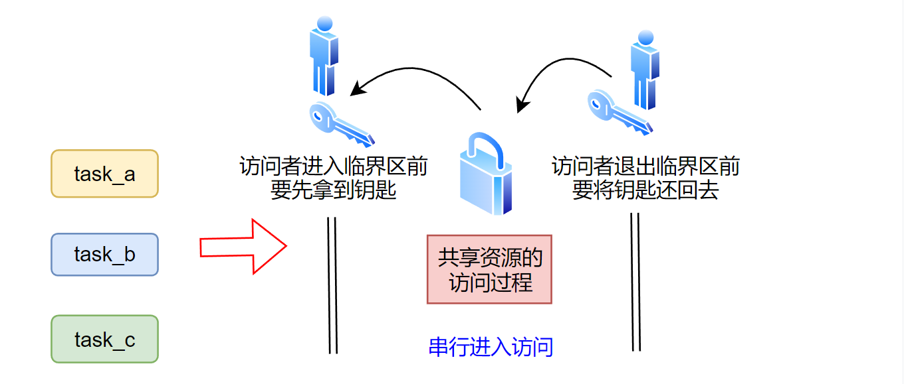

本文介绍 FreeRTOS 中互斥量（mutex）的优先级继承特性，以及 FreeRTOS 是如何通过互斥量的优先级继承特性，来最小化优先级反转问题带来的负面影响

<!--more-->

***

#### 1 优先级反转问题：

在[使用互斥量（mutex）保护共享数据](https://fengxun2017.github.io/2023/01/03/FreeRTOS-mutex/)一文中，介绍了互斥量的作用是构建一个用来保护共享数据访问过程的临界区，在这个临界区内，任何时候，只允许一个任务进入这个临界区访问共享数据，该任务没退出临界区前，其它任务无法进入临界区中访问数据。
所以，互斥量可以看作是一把钥匙，所有想进入临界区访问共享数据的任务，都需要先获取到这把钥匙，访问完成以后，归还这把钥匙。因此，即使系统中的多个任务是并行/并发的，但访问临界区却是串行的，如下图所示：

因此，互斥量的一个基本特性是：当一个任务`task_a`持有互斥量`mutex`后，其它任务在`task_a`释放互斥量之前，无法再获得互斥量，调用请求互斥量 api，会使当前任务进入阻塞状态（如果设置了等待时间，后文都按此假设）。

基于该基本特性，考虑一个情景，`task_a`优先级为 1，当它成功获取到互斥量`mutex`后，正在访问被保护的数据。此时，系统发生了某个事件（如按键事件），导致另一个优先级为3 的任务`task_c`进入就绪状态（之前处于阻塞态，在等待事件发生），并开始运行（在`task_a`已经持有互斥量`mutex`的情况下抢占了cpu）。
如果此时高优先级的`task_c`也要获取互斥量`mutex`（为了安全访问共享数据）会怎样？ 由于`mutex`已经被低优先级任务`task_a`持有，因此高优先级任务`task_c`无法获得该互斥量，并进入阻塞状态（如果设置了等待时间参数）。内核之后再次调度低优先级任务`task_a`，当`task_a`访问数据结束，释放mutex后，高优先级任务`task_c`才能恢复运行。
这种状态就是**优先级反转状态**，即高优先级任务，由于获取不到已经被低优先级任务提前获取的互斥量，导致高优先级任务不得不阻塞，先等待低优先级任务运行，并释放互斥量后，才能运行。如下图所示：

**注意**：下图是基于mutex只能被一个任务持有的特性来讨论的，并未考虑优先级继承特性！

如上图所示的优先级反转状态，并不是那么严重，至少优先级反转状态的持续时间是可预知的（有上界的），因为临界区的基本要求是尽量小，任务应该尽快退出临界区（释放互斥量）。
因此，虽然低优先级任务持有互斥量后，会导致这期间请求同一互斥量的高优先级任务阻塞，但低优先级任务很快会完成数据访问，并释放持有的互斥量，之后高优先级任务就可以恢复运行。

**但更糟糕的情况，发生在此时还存在一个中优先级的任务处于就绪状态**：
低优先级的任务`task_a`获得互斥量`mutex`，之后发生了某个事件导致高优先级任务`task_c`开始运行，并且`task_c`也请求获取`mutex`，由于`mutex`已经被`task_a`持有，则`task_c`进入阻塞态。
此时，如果还存在一个中优先级的`task_b`处于就绪状态，那么`task_c`阻塞后，内核会先调度中优先级的就绪任务`task_b`。只要`task_b`一直运行，`task_a`就无法得到调度（因为优先级比`task_b`低），那么被`task_a`持有的互斥量`mutex`就不会被释放，结果就导致等待互斥量`mutex`的高优先级任务`task_c`一直阻塞（请求`mutex`时设置了无限等待），无法运行。并且高优先级任务`task_c`的阻塞时间是没有上界的，因为不确定何时`task_b`会进入阻塞态，使得内核可以调度任务`task_a`。甚至，如果有更多的中优先级任务，那么`task_a`可能会一直得不到运行，使得`task_c`也一直得不到运行（因为无法获取到`mutex`）。如下图所示：

**注意**：下图是基于mutex只能被一个任务持有的特性来讨论的，并未考虑优先级继承！

#### 2 优先级继承

前文讨论的优先级反转问题，都是只基于互斥量只能被一个任务持有的特性来说明的。这种情况下，可以认为 互斥量就是一个普通的[二值信号量](https://fengxun2017.github.io/2022/12/15/FreeRTOS-use-binary-semaphore/)。

但 FreeRTOS 的 互斥量，本质是 二值信号量 + 优先级继承特性。通过优先级继承特征，FreeRTOS提供的互斥量，可以尽量减少任务反转状态的持续时间（有上界）。以之前的例子来解释优先级继承特性：

当低优先级任务`task_a`获取到互斥量`mutex`后，`mutex`的持有者就是`task_a`（互斥量的内核数据结构中存在一个`xMutexHolder`成员，当互斥量被某个任务成功获取到，`xMutexHolder`就被赋值为该任务的句柄）。此时，发生某个事件使得高优先级任务`task_c`开始运行，并请求获取`mutex`。
这种情况下，由于`mutex`已经被持有，`task_c`无法获取到互斥量，所以`task_c`会阻塞。并且，内核判断出当前请求`mutex`的任务`task_c`的优先级，大于`mutex`的持有者（`task_a`）的优先级。因此，内核会临时调整持有者`task_a`的任务优先级（通过互斥量的`xMutexHolder`成员，找到持有该互斥量的任务，进而修改该任务优先级），让其优先级升高为`task_c`的优先级。即继承了`task_c`的任务优先级，如下图所示：

互斥量只能被一个任务持有，当`task_a`持有互斥量并完成数据访问后，需要释放互斥量，使其它任务可以获取到该互斥量。当`task_a`释放互斥量时，内核会发现该互斥量的持有者`task_a`的**当前任务优先级**（前面被临时提升了）和`task_a`的**真实任务优先级**不同（任务的内核数据结构中存在一个`uxBasePriority`，该成员记录着任务的真实优先级），因此内核会恢复`task_a`的任务优先级。如下图所示：

通过优先级继承特性，FreeRTOS的互斥量可以使得优先级反转状态尽快结束（持续时间有上界），减少优先级反转带来的影响。再次考虑前文存在中级优先级任务的例子：
低优先级的任务`task_a`获得互斥量`mutex`，之后发生了某个事件导致高优先级任务`task_c`开始运行（抢占了`task_a`），并且`task_c`也请求获取`mutex`，由于`mutex`已经被持有，则`task_c`进入阻塞态，同时`mutex`的持有者`task_a`的优先级被临时升高。此时，即使还存在一个中优先级的`task_b`处于就绪状态，内核仍旧会先调度`task_a`（因为继承了`task_c`的高优先级）。当任务`task_a`释放`mutex`时，内核会同时恢复`task_a`的优先级为低优先级。之后，内核调度高优先级任务`task_c`（`mutex`可用了），当`task_c`运行一段时间后，因为等待某个其它事件进入阻塞态，内核就会调用目前就绪的最高优先级任务`task_b`。该过程如下图所示：

最后，需要注意的是，在内核层面，mutex 只能尽量较少优先级反转的持续时间，无法根本解决优先级反转问题。如果，你的系统不希望发生优先级反转状态（不管持续时间是长还是短），就需要从软件设计本身上解决——不要让两个不同优先级的任务去获取同一个互斥量。

