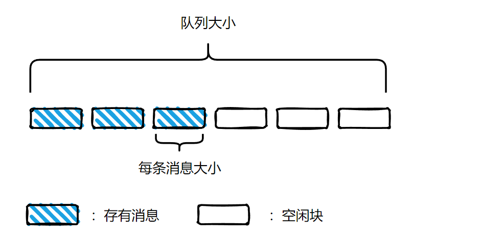
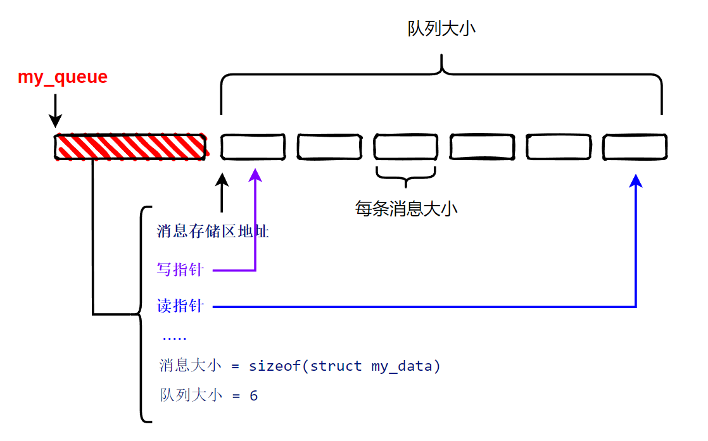
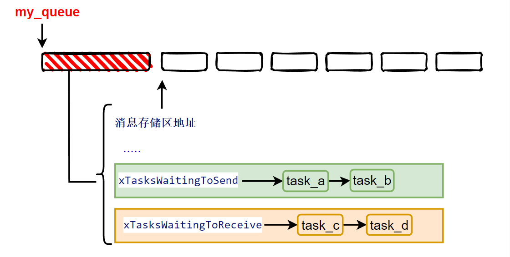
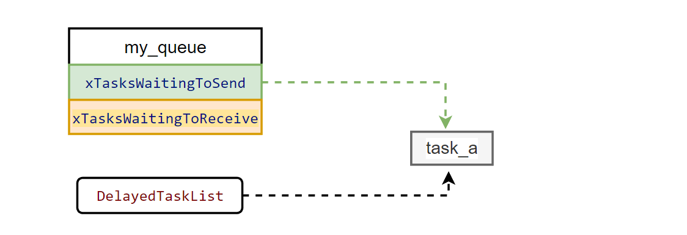

<center>
本文讨论FreeRTOS消息队列的一些内部细节。
</center>
<!--more-->

***
消息队列的使用示例，可以参考[FreeRTOS-使用消息队列](https://fengxun2017.github.io/2022/12/12/FreeRTOS-use-queue/)


消息队列的作用不仅仅是用来进行数据通信，从软件设计上来说，更重要的作用是可以将一个复杂软件系统，划分成多个功能相对独立的模块，各个模块间通过消息队列进行数据传递以实现解耦。如此，一个大的复杂系统，被划分成多个功能清晰明确的更小的子模块，使得软件更易维护。并且，当需要修改某一个子模块的功能时，可以最大程度避免影响其它模块（对于每个子模块来说，数据是通过消息队列过来的，只要数据格式未变动，那么就感知不到数据发送方内部做了什么改动
）。


FreeRTOS的消息队列，需要在创建时指定队列的大小（最大可以同时保留的消息数量）以及消息的大小。如下图所示



创建消息队列的API为：
```c
QueueHandle_t xQueueCreate( UBaseType_t uxQueueLength, UBaseType_t uxItemSize )
```
- uxQueueLength：队列大小
- uxItemSize：队列中每个消息的大小。

- 返回值：消息队列句柄，用来唯一识别创建的这个消息队列。


`xQueueCreate`函数返回的消息队列句柄，为一个指针，指向的区域保存了该消息队列的相关信息（队列大小，消息大小，实际消息存储区等）。例如，当我们调用该 API创建消息队列一个消息队列
```c
QueueHandle_t my_queue = xQueueCreate(6, sizeof(struct my_data))
```
实际生成的消息队列在内存组织结构如下图所示：


即，内核是直接申请了一大块连续的内存，前面存放这个消息队列的相关信息，随后紧接着就是实际的消息存储区域。消息队列的写指针指向第一个消息（待写入位置），而读指针则指向待读取的消息的前一个消息（读取消息时，内部会先将读指针前进一次，再读）。

消息队列创建成功后，即可通过 
```c
BaseType_t xQueueSend( QueueHandle_t xQueue, const void * pvItemToQueue, TickType_t xTicksToWait )
```
推送消息到消息队列中。需要注意的是，虽然第二个参数为指向待发送消息的指针，但内部实际是用指针作为起始地址，然后拷贝`uxItemSize`（消息大小）个连续字节。即FreeRTOS的消息队列，是直接拷贝了一份数据，而不是仅传递指针。这样的好处是，发送的数据的所有权更明确（由内核管控），而传递指针的话，则需要数据的发送方或接收方在合适的时间释放内存。

数据接收，则通过
```c
BaseType_t xQueueReceive( QueueHandle_t xQueue, void *pvBuffer, TickType_t xTicksToWait );
```
先发送的消息会被先接收到。

上述发送和接收函数都存在第三个参数`xTicksToWait`。
`xQueueSend`函数中的`xTicksToWait` ，表示如果当前消息队列中消息存满了，那么就等待其有空闲位置（存在其它地方从消息队列中提取消息了，则会出现空闲位置），等待的超时时间就是`xTicksToWait`（`使用pdMS_TO_TICKS(ms)将时间转换成tick数`）。为0表示不等待，立刻返回。

`xQueueReceive`函数中的`xTicksToWait` ，表示如果当前消息队列中没有可提取的消息，那么就等待其有消息（当有其它地方向消息队列中发送消息），等待的超时时间就是`xTicksToWait`（`使用pdMS_TO_TICKS(ms)将时间转换成tick数`）。为0表示不等待，立刻返回。

当涉及到需要等待一段时间，当前任务（当前调用`xQueueSend/xQueueReceive`的任务）就会进入阻塞态，之后内核会选择当前系统中优先级最高的就绪任务进行调度，让其运行。
那么，如果超时时间还未到，但消息队列有空闲位置了/有消息了，任务是如何恢复运行的？或者超时时间到了，任务如何恢复运行？

这就涉及到消息队列数据结构中的两个成员：
**xTasksWaitingToSend**：等待消息队列有空闲位置的任务链表（即，当某个任务在消息队列满时，调用`xQueueSend`发送消息数据，如果设定了等待时间，那么该任务就会被挂到该任务链表中）。
**xTasksWaitingToReceive**：等待消息队列有消息的任务链表（即，当某个任务在消息队列为空时，调用`xQueueReceive`获取消息，如果设定了等待时间，那么该任务就会被挂到该任务链表中）。
如下图所示：（下图只是演示，实际队列不会是又满又空的状态，所以不会出现`xTasksWaitingToSend`和`xTasksWaitingToReceive`中都挂有任务）


并且，这两个链表是按照任务的优先级排序的，优先级高的任务在链表的前面。这样当消息队列有空闲位置/有数据时，就能直接通知最高优先级的等待任务（链表第一个）。

挂在**xTasksWaitingToSend** 链表中的任务，都是在等待消息队列有空闲位置可以放下新消息。因此，一旦有其它任务（或中断服务程序）从该消息队列中取走数据了，那么消息队列就会从**xTasksWaitingToSend**链表中找到第一个最高优先级的任务，让其恢复就绪态（有空闲位置可以发送消息了），如果该恢复就绪态的任务的优先级，是当前所有处于就绪态任务中优先级最高的，那么该任务就能立刻恢复运行。

同理，挂在**xTasksWaitingToReceive** 链表中的任务，都是在等待消息队列有消息可提取。因此，一旦有其它任务（或中断服务程序）向该消息队列中发送数据了，那么消息队列就会从**xTasksWaitingToReceive**链表中找到第一个最高优先级的任务，让其恢复就绪态（有消息可以提取了），如果该恢复就绪态的任务的优先级，是当前所有处于就绪态任务中优先级最高的，那么该任务就能立刻恢复运行。


通过消息队列中的**xTasksWaitingToSend**和**xTasksWaitingToReceive** 成员，就可以实现消息队列有空闲位置/有消息时及时通知那些等待在该消息队列上的任务。 但另一方面，如果消息队列一直没有空闲位置/没有消息，超时时间到后，任务又如何恢复呢？
原理和上文一样，内核会同时将任务也挂在一个`延迟任务链表`上，内核会在每个时钟滴答时检查这个链表上的任务是否达到超时时间，达到了，内核就会将其恢复为就绪态。

例如，当我们在任务`task_a`中调用`xQueueSend（my_queue, pdata, pdMS_TO_TICKS(1000)）`向一个满的消息队列`my_queue`发送消息，并且设置超时时间为1秒。那么`task_a`任务会被同时挂到 `my_queue`的`xTasksWaitingToSend`任务链表上，以及内核中的`DelayedTaskList`链表上。如下图所示：


如此，无论是消息队列`my_queue`有空闲位置可以发送消息了，或者超时时间到期了，任意条件满足时都能立刻通知到等待的任务`task_a`，让其恢复就绪态，并且当`task_a`是当前优先级最高的就绪任务时，会立刻得到运行。

<br/>
FreeRTOS交流QQ群-663806972

<br/>
