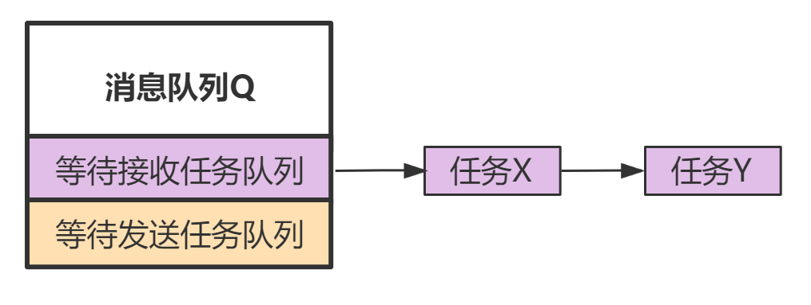

<center>
本文介绍几个 stream buffer 内部的实现细节。
</center>

<!--more-->

***

使用 `stream buffer`的前提，一定要明确使用场景中只有一个`writer`（中断服务或任务），也只有一个`reader`（中断服务或任务）。正是因为在只有一个`writer`，一个`reader`的前提下，使得`stream buffer`在内部实现中不必对读/写数据过程进行临界区保护。
PS：当然，非要存在多个写/读的应用场景下使用`stream buffer`也是可以的，但是需要开发者使用临界区对调用的相关API 进行保护，并且不能使用API 中的等待超时参数（需要设置为0）。

`stream buffer`的底层是基于一个循环数据来实现的：


其中，**Head**指向第一个可写的位置，**Tail**指向第一个可读的位置，当它们移动到数组结尾时，会回转到数组开头。

#### 1 基于循环数组如何判断，可读数据大小，可写空间大小？

情况1： Tail 在左边，Head 在右边


这种情形下，
可读数据的大小 = Head - Tail
可写空间大小 = Length - (可读数据大小) = Length + Tail - Head

情况2： Head 在左边，Tail 在右边

这种情况下，
可写空间大小 = Tail - Head
可读数据大小 = Length - (可写空间大小) = Length + Head - Tail

综上两种情况，
计算可写空间大小时，我们总是可以计算：
**可写空间大小 = Length + Tail - Head**
之后，再加一个后置判断， 如果 可写空间大小 >= Length，说明就是情况1，此时可写空间大小-Length 就是最终可写空间大小。

同理，计算可读数据大小时，我们总是可以直接计算：
**可读数据大小 = Length + Head - Tail**
之后，再加一个后置判断， 如果 可读数据大小 >= Length，说明就是情况2，此时可读数据大小-Length 就是最终可读数据大小。

使用循环数组的一个问题是如何判断数组满和空？ 按照上面的逻辑，当数据被填满时，Tail和Head指针会指向相同的位置，这和判空条件一致了。因此，FreeRTOS用了一个trick，在申请数组空间时，申请的实际大小为外部传过来的大小参数 + 1，如下所示：

xStreamBufferGenericCreate函数中的代码段：
``` 
if( xBufferSizeBytes < ( xBufferSizeBytes + 1 + sizeof( StreamBuffer_t ) ) )
{
    xBufferSizeBytes++; // 这里额外加的1，就是内部添加的1字节。
    pucAllocatedMemory = ( uint8_t * ) pvPortMalloc( xBufferSizeBytes + sizeof( StreamBuffer_t ) ); /*lint !e9079 malloc() only returns void*. */
}
```
而判断可用空间大小时，会将计算获得的减 1 再返回，如下所示：
xStreamBufferSpacesAvailable函数中的代码段：
```
do
{
    xOriginalTail = pxStreamBuffer->xTail;
    xSpace = pxStreamBuffer->xLength + pxStreamBuffer->xTail;
    xSpace -= pxStreamBuffer->xHead;
} while( xOriginalTail != pxStreamBuffer->xTail );

xSpace -= ( size_t ) 1; // 这里额外减一，就是减掉内部添加的那1字节

```
 因此，最终数组满的条件（即判断可用空间大小为0），实际是数组内部还剩1字节空间（内部额外添加的1字节）。


#### 2 stream buffer的读写过程是否需要临界区保护？
仅从读，写这两件事本身来讨论，`stream buffer`是完全不需要临界区来保护读写过程的。
例如，`stream buffer`的当前状态如下图所示：


对于`writer`来说，它在写数据时仅会移动**Head**指针，并且由于只有一个`writer`，也不会存在竞争。
对于`reader`来说，它在读数据时仅会移动**Tail**指针，并且由于只有一个`reader`，也不会存在竞争。

剩下的就是，判断可读数据/可写空间大小时，需要同时访问**Head**指针，和**Tail**指针，此时是否需要临界区保护？

考虑内核中判断可读数据大小的具体实现代码：
```c
1 xCount = pxStreamBuffer->xLength + pxStreamBuffer->xHead;
2 xCount -= pxStreamBuffer->xTail;

3 if( xCount >= pxStreamBuffer->xLength )
{
    xCount -= pxStreamBuffer->xLength;
}
```
由于没有临界区保护，`reader`任务在执行这段代码时，是可能被`writer`给打断的。
如果在`reader`在执行完`第一行`代码后，此时内核执行任务切换，`writer`开始执行，并向`stream buffer`中写入了数据（**Head**指针被“推进”了），之后当内核再次切换回`reader`继续执行时，会发送什么？
此时由于`第一行`已经执行过了（获得的是旧的**Head**值），那么最终计算出来的可读数据大小（**writer**在中间写入的没算进去）是小于当前`stream buffer`中实际所存数据大小的。

不过，这样并没有什么关系，`stream buffer`的API 会明确告知本次读取获取了多少数据，剩下的数据下次再获取就可以了。
也就是说，不使用临界区保护，当判断可读数据大小时，获得的值可能会比实际小，但这不会影响程序运行，下次还是可以读到该数据。只要不发生获得的值比实际所存数据量大这种错误情况，程序就没问题。

同理，内核中判断可写空间大小的代码也是不需要加临界区保护的，虽然可能会导致有时获得的可写空间比实际的少（使得`writer`只能将部分数据写入到`stream buffer`中），但同样`stream buffer`的API 会返回本次成功写入了多少数据，剩下的数据下次发送即可。 只要不发生获得的可写空间比实际可写空间大这种错误情况，程序的运行就没问题。


#### 3 stream buffer如何实现空间不够写入本次数据时，让任务阻塞？

在介绍[消息队列](https://fengxun2017.github.io/2022/12/08/FreeRTOS-queue-internal-details/)的文章中的，我们提到消息队列结构中存在两个任务链表成员：
- 等待发送数据任务链表：消息队列满时，当任务向该消息队列发送数据，就会被挂到该任务链表上（如果设置了超时等待）。
- 等待接收数据任务链表：消息队列空时，当任务从该消息队列中获取消息，就会被挂到该任务链表上。

如下图所示：


由于`stream buffer`也支持发送（或获取）数据时，如果`stream buff`空间不足（或没有数据），则任务可以阻塞等待。
因此，`stream buffer`中也有两个如上类似的成员，不过它们不是链表，只是任务句柄（成员`xTaskWaitingToSend`和成员`xTaskWaitingToReceive`）。因为`stream buffer`只有一个`writer`和一个`reader`，所以不需要链表。


由于只有一个`reader`，当`reader`从`stream buffer`获取数据，而`stream buffer`为空时，任务如果设置了等待超时参数，任务就会阻塞，并且`reader`的任务句柄会被保存到`stream buffer`的成员`xTaskWaitingToReceive`中。
如此当`writer`向该`stream buffer`中发送数据时，就可以通过`xTaskWaitingToReceive`找到等待数据的那个任务（`reader`），从而唤醒它。
从这里可以发现，要唤醒的目标任务是明确的（等待数据的`reader`），这符合[task notification](https://fengxun2017.github.io/2023/02/07/FreeRTOS-task-notification/)的使用场景。
因此，当`stream buffer`为空时，`reader`无法获取数据，此时就会调用`xTaskNotifyWait`来阻塞自己。 当`writer`向`stream buffer`中发送了数据后，就会通过`xTaskNotify`来唤醒`reader`（有数据了），

对于`writer`，当`stream buffer`中的空间不够写入时，也可让任务进入阻塞态，同样也是使用`task notification`来实现的。原理同上。


#### stream buffer中的临界区是干嘛用的？

如第二小节所述，由于只有一个`reader`和一个`writer`，因此`stream buffer`的读写并不需要临界区来保护，但无论是获取数据的API：`xStreamBufferReceive`，还是发送数据的API：`xStreamBufferSend`，其内部实现中都存在临界区代码段。

例如，`xStreamBufferSend`中的临界区代码段：
```c
    taskENTER_CRITICAL();
    {
        xSpace = xStreamBufferSpacesAvailable( pxStreamBuffer );

        if( xSpace < xRequiredSpace )
        {
            /* Clear notification state as going to wait for space. */
            ( void ) xTaskNotifyStateClear( NULL );

            /* Should only be one writer. */
            configASSERT( pxStreamBuffer->xTaskWaitingToSend == NULL );
            pxStreamBuffer->xTaskWaitingToSend = xTaskGetCurrentTaskHandle();
        }
        else
        {
            taskEXIT_CRITICAL();
            break;
        }
    }
    taskEXIT_CRITICAL();
    ( void ) xTaskNotifyWait( ( uint32_t ) 0, ( uint32_t ) 0, NULL, xTicksToWait );

```
发送数据函数中的这段临界区代码的作用，其目的并不是为了保护写的过程不被读打断。
它是为了让：“当写空间不够时，清除`notify`状态，以及设置`pxStreamBuffer->xTaskWaitingToSend`” ，即如下几个操作
```c
1 xSpace = xStreamBufferSpacesAvailable( pxStreamBuffer );
2 ( void ) xTaskNotifyStateClear( NULL );
3 pxStreamBuffer->xTaskWaitingToSend =xTaskGetCurrentTaskHandle();
```
整体成为一个“原子操作”。 

否则，没有临界区保护的话，可能发生如下情况：
在`writer`任务在执行`1`后内核可能刚进行任务调度，并切换到`reader`并读取了一批数据（此时可写空间有了），`reader`执行完后会调用`sbRECEIVE_COMPLETED`，该宏的实现是调用`xTaskNotify（pxStreamBuffer->xTaskWaitingToSend）`通知`writer`，但本次通知不会成功，因为此时`pxStreamBuffer->xTaskWaitingToSend = NULL`（`writer被打断了，还没执行到 3 处的赋值代码`）。
之后，内核再次执行任务切换，并切换回`writer`任务，此时实际上可能已经有足够的可写空间了（中间切换成`reader`任务时被读走了一批数据），但由于`reader`的`notification`丢失了，导致`writer`出了临界区后，执行`xTaskNotifyWait`时，检测不到`notification`，导致`writer`进入阻塞休眠（实际上此时可写空间可能已经满足需求了）。


