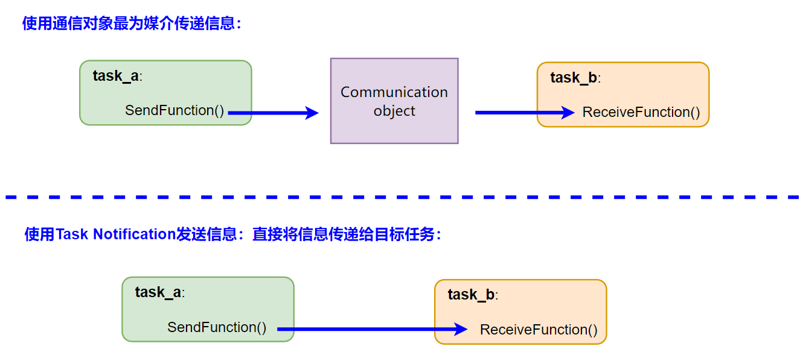
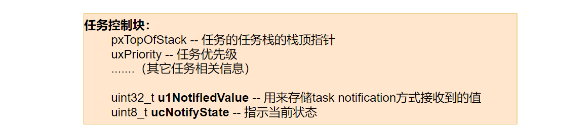
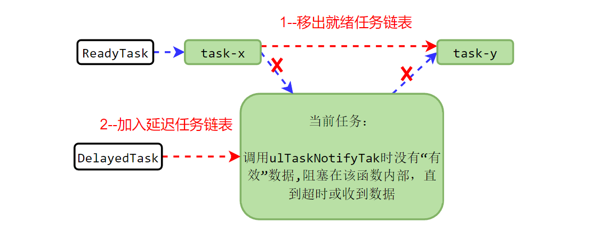
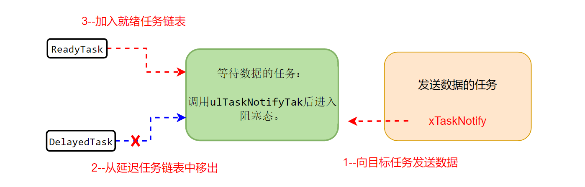

实际应用开发中，系统中最常见的功能需求就是任务和任务间相互传递信息，以及中断服务函数向任务传递信息（例如通知任务发生了按键事件）。并且，需要传递的信息往往很短，例如一个数值或者一个事件标记。 FreeRTOS为这种任务间简短数据传递，提供了一个轻量级的任务通信功能——task notification。

<!--more-->

***

#### 1 什么是 Task Notification

到目前为止，FreeRTOS提供的任务和任务间传递信息，以及中断服务函数和任务传递信息的工具，我们介绍了[消息队列](https://fengxun2017.github.io/2022/12/08/FreeRTOS-queue-internal-details/)，[信号量](https://fengxun2017.github.io/2022/12/15/FreeRTOS-use-binary-semaphore/)，和[event group](https://fengxun2017.github.io/2023/01/13/FreeRTOS-event-group/)。

通过这些工具传递信息，都需要先创建一个通信对象（`消息队列`对象、`信号量`对象、`event group`对象），再使用该通信对象作为信息传递的媒介。 这些通信对象都有各自的内核控制结构，因此需要额外的内存资源。此外，信息传递，都是通过这些通信媒介来中转，并传递到最终的接收任务。
当然，虽然使用这些通信对象来传递信息，消耗了额外的内存资源，并且引入了额外的开销（信息中转过程消耗），但这些工具都提供了丰富的功能和灵活性，可以应对很多开发需求。

但另一方面，实际开发中，遇到的大多需求往往只需要向任务传递一个简短的信息（例如单个数值，或一个事件标志）。针对这种情况，FreeRTOS提供了`Task Notification`，该功能不需要额外的通信对象作为媒介来传递信息，信息会直接发送给目标任务。**因此，Task Notification 占用的内存资源更少（不需要额外通信对象），信息传递的效率也更高（信息直接发送给目标任务，不需中转）**。

使用通信对象（`消息队列`对象、`信号量`对象、`event group`对象）传递信息，和使用`Task Notification`传递信息的区别如下图所示：

从上图也能看出，使用通信对象来传递信息时，发送方只需要知道通信对象的句柄（一个唯一识别某个通信对象的标识，例如`信号量`句柄，`消息队列`句柄），因为信息是发送给通信对象的，发送方并不关心（也看不到）最终信息的接收方是谁。
而基于`Task Notification`的方式传递信息，信息是直接发送给目标任务的，因此发送方需要知道目标任务的任务句柄（一个唯一识别某个任务的标识），并在发送信息时指定发送给该任务。

#### 2 内核是如何实现 Task Notification 的

在内核中，每个任务都有一个任务控制块，其中存储了任务自身相关的控制信息。例如，本任务的优先级，本任务的任务栈的栈顶指针，本任务名称等。

使用`Task Notification`时，信息是直接发送给目标任务的，目标任务需要有一个“地方”用来存储这个信息。因此，内核在任务控制块结构中添加了两个成员：
- uint32_t **ulNotifiedValue** ：用来存储接收到的信息。因为是uint32_t，因此信息大小不能超过4字节。
- uint8_t **ucNotifyState**：用来指示状态的。例如任务是正在等待notify，还是已经收到了notify。

如下所示：

根据上述定义，使用`Task Notification`只可以使用4字节（uint32_t）的存储区。

在FreeRTOS内核版本10.4开始（对应新的版本命名方式是——FreeRTOSv202112.00），`Task Notification`的数据存储区被设定为**可配置大小的数组**，如下所示:
- uint32_t **ulNotifiedValue** [ configTASK_NOTIFICATION_ARRAY_ENTRIES ]
- uint8_t **ucNotifyState** [ configTASK_NOTIFICATION_ARRAY_ENTRIES ]

其中，`configTASK_NOTIFICATION_ARRAY_ENTRIES`可配置，默认值为1，保持和之前兼容。

对应的，`Task Notification`提供了具有`index`参数的API，使得可以访问 `ulNotifiedValue[]`数组中的某个值。例如，数组第0个值用来作为数值信息（存储其它任务发送来uint32_t数据），数组第1个值用来作为某个事件的标记（存0或1，例如存储中断处理函数发送过来的按键事件）。

为了方便起见，后文所述的 Task Notification，我们都只使用数组的第0个值。

##### 2.1 任务等待信息

作为信息接收方，当我们等待某个其它任务（或中断处理函数）向我们发送信息时。内核会判断当前是否存在“有效”数据，如果没有“有效”数据，就会将本任务阻塞（不在消耗cpu资源），直到超时或者收到数据。

`Task Notification`提供了2个等待通知的API 接口：`ulTaskNotifyTake` 和 `xTaskNotifyWait`其中：
 - ulTaskNotifyTake：是根据前文提到的 **ulNotifiedValue** 的值是否大于0，来判断是否接收到有效数据（因此，发送方发送0是无效的）。这个API是为了使 `Task Notification`在常见的使用场景（例如单个任务等待某个信号量）下可以替代`信号量`（`信号量`的特性是大于0，表示可用）。
  
 - xTaskNotifyWait：是根据前文提到的 **ucNotifyState** 状态指示（接收中，还是已收到），来判断是否有效数据。这个API 就是更通用的用来接收数据的api（例如，与上面的ulTaskNotifyTake相比，可以发送数值0）。通过该API，可以在一些情况下使用`task notify`替代`event group`甚至`消息队列`（少量数据时，例如4个字节，可以存在uint32_t中）

当没有有效数据时，当前任务调用`ulTaskNotifyTake`（或`xTaskNotifyWait`）时就会进入阻塞态，等待数据到来（当设置了等待超时参数时），内部实现就是当前任务被从就绪任务链表（ReadyTask）中移出，并加入到延迟任务链表（DelayedTask）中。如下图所示：

PS：涉及到的多个任务队列，如果不了解，可以参考这篇文章[FreeRTOS的任务调度和管理](https://fengxun2017.github.io/2022/11/01/FreeRTOS-task-status-management/)。将任务加入到延迟任务链表（DelayedTask）中，就是让任务暂时不再参与内核任务调度（不再消耗cpu资源），直到设置的超时时间到达后，内核会再将该任务从延迟任务链表（DelayedTask）中移出，并重新加入到就绪任务链表（ReadyTask）中。

##### 2.2 向任务发送信息

如前文所述，`Task Notification`提供的发送功能，需要明确指定数据是发送给哪个任务的。
例如，发送API `xTaskNotify( TaskHandle_t xTaskToNotify, ...)` 的第一个参数，就是目标任务的句柄（唯一识别一个任务的标识）。
当某个任务（或中断处理函数）调用发送API发送信息后，会将数据直接写到目标任务的任务控制块中的 **ulNotifiedValue**（根据参数有不同的写入方式，例如，只更新部分位）。如果目标任务此时正在等待数据，则内核会将其从`DelayedTask`任务链表中移出，并重新加入到`ReadTask`任务链表中（恢复为就绪状态，如果任务优先级是当前最高的，则会被内核调度）。如下图所示：

#### 总结

FreeRTOS提供 `Task Notification`的初衷，是为了在很多常见的开发场景中，使用`Task Notification`来替换`信号量`，`event group`，甚至 `消息队列`（少量数据时，例如4个字节）。因此，如果传递信息的方式可以用`Task Notification`来实现，就尽量使用`Task Notification`。总的来说，`Task Notification`和其它信息传递方式相比，优缺点如下：

使用`Task Notification`的优势：
 - **效率高**：信息传递是直接发送给目标任务的，没有额外通信对象在中间中转的过程。
 - **内存占用少**：`信号量`、`event group`、`消息队列`这些信息传递方式，都需要创建一个通信对象，这个对象中除了包含要传递的信息，还存在额外的控制/状态信息。 而`Task Notification`没有作为媒介的通信对象，因此不需要付出这些额外的内存开销。

使用`Task Notification`与其它几个信息传递方式相比的限制：
 - **不能在中断处理函数中接收数据**：原因很直观，使用`Task Notification`，数据的接收方必须是接收信息的目标任务（数据是直接发送到目标任务的任务控制块中存储的），而中断是和任务无关的。 相比之下，中断处理函数中可以调用`信号量`、`event group`、`消息队列`的接收数据 API（带FromISR后缀的）
 - **信息接收方只有一个，就是目标任务**：`Task Notification`的信息发送就是直接发送给目标任务，因此接收方只有一个。而使用`信号量`、`event group`、`消息队列`时，信息是发送到通信对象上的，任意的其它任务或中断处理函数都可以从该通信对象上提取数据（前提是知道该通信对象的句柄）。
 - **与消息队列相比，Task Notification没有消息缓存功能**：`消息队列`在创建时可以指定队列大小 N，如果信息接收方无法立刻处理消息，只要消息个数没超过 N，它们都可以缓存在`消息队列`中，供接收方慢慢消费。而`Task Notification`的发送消息，是直接修改目标任务的任务控制块中的 **ulNotifiedValue**，不具备消息缓存功能。
 - **与 event group相比，不具备广播特性**：`event group`一个独有的特性是，每当设置event group中的某个“事件”（event group中的某个位）时，内核会遍历所有等待在该event group上的任务，依次检查本次设置是否使得任务等待的条件满足了，满足了就会将任务恢复为就绪态。而`Task Notification`是直接发给单个目标任务的，不具有广播特性。

 
 
FreeRTOS交流QQ群-663806972