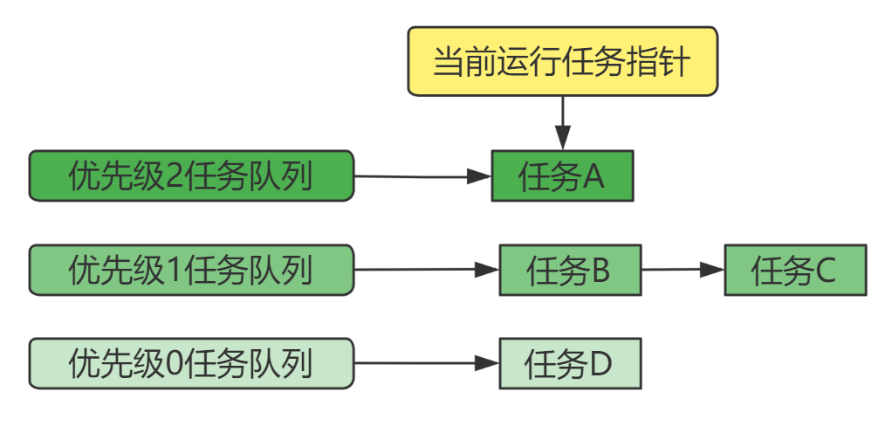
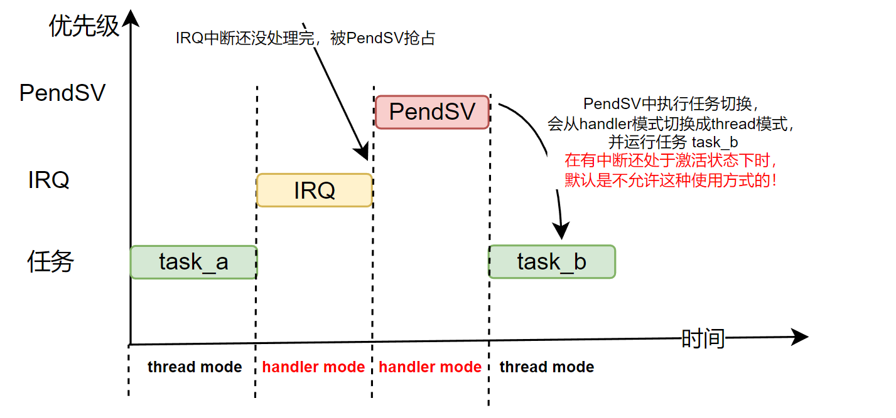

<center>
基于cortex-m3/m4内核，介绍FreeRTOS自己抽象出来的任务优先级概念，以及FreeRTOS任务调度涉及的硬件中断优先级。

</center>

<!--more-->

***

#### 1 任务优先级

FreeRTOS中的任务优先级，是FreeRTOS自己抽象出来的概念。只作用于FreeRTOS创建出来的任务。FreeRTOS内核每次进行任务调度时，总是选择优先级最高的就绪任务来运行。

在工程配置文件`FreeRTOSConfig.h`中定义了当前系统中，允许使用的任务优先级数量：
```c
#define configMAX_PRIORITIES		( 3 )
```
即，使用`xTaskCreate`时传递的优先级参数`uxPriority`的值应该在`[0,3)`中，值越大表示任务的优先级越大。

任务优先级的唯一作，就是内核在每次调度任务时会选择优先级最高的就绪任务来运行（如果有多个任务的优先级相同，且都是当前最大的，默认是轮流调度）。

在内核的实现中，会根据宏定义`configMAX_PRIORITIES`的值，创建对应数量的`就绪任务队列`，例如`configMAX_PRIORITIES = 3`时，会创建3个就绪任务队列。例如，当我们创建一个优先级为 2 的任务 A。两个优先级为 1 的任务 B 和 C，以及一个优先级为 0 的任务 D ，则`就绪任务队列`的状态如下：

这样做的好处时，每个任务在创建时，直接挂到对应优先级任务队列上即可。而内核在选择任务调度时，直接从有任务的最高优先级任务队列上选择即可（会选择这个任务队列中最近一次所运行任务的下一个任务，内核的任务链表结构中，有一个成员指向本任务队列（链表结构）中最近运行的那个任务，如此即可实现同一优先级的任务间轮流调度）。

更详细的任务调度和管理信息，可以参考文章：[任务调度和管理-就绪任务队列](https://fengxun2017.github.io/2022/11/01/FreeRTOS-task-status-management/#%E5%B0%B1%E7%BB%AA%E4%BB%BB%E5%8A%A1%E9%98%9F%E5%88%97%EF%BC%9A)
而向任务队列中插入新任务，从任务队列中获取下一个要运行的任务，可以参考文章[FreeRTOS-内核链表数据结构](https://fengxun2017.github.io/2022/11/04/FreeRTOS-kernel-list/#%E6%80%BB%E7%BB%93) 最后的总结部分。


#### 2 内核任务调度硬件中断优先级

FreeRTOS任务切换使用的硬件中断优先级，是工程配置文件`FreeRTOSConfig.h`文件中设置的宏`configKERNEL_INTERRUPT_PRIORITY` 。

该值定义了FreeRTOS的 `tick`中断的优先级。 在cortex-m3/m4 平台上，FreeRTOS默认使用`SysTick`定时器（所有基于cortex-m3/m4 的MCU中都会有这个定时器，所以很方便移植）来产生`tick`中断（内核运作的`心跳`，每次tick中断发生时，会在中断处理函数中执行任务调度相关工作）。所以，在 cortex-m3/m4 平台上，**宏`configKERNEL_INTERRUPT_PRIORITY`的值就是`SysTick`定时器的中断优先级**。

每当`tick`中断周期到达，内核需要做的事情有：
- 更新内部“时间计数tick值”
- 遍历delay任务队列将等待时间超时的任务恢复就绪状态（例如，任务调用`vTaskDelay`延迟的时间到达了，或任务调用`xQueueReceive`等待消息队列的超时时间到达了）。
- 检查是否需要进行任务切换，执行任务切换等等工作。

但上述全部工作实际是由`SysTick`和`PendSV`两个中断共同完成的。
`SysTick`中断中只完成了部分工作，将内核用来记录时间的变量`xTickCount`加1；将延迟队列`pxDelayedTaskList`中超时的任务挂回就绪队列中；根据内部状态和当前系统配置（如是否抢占调度，同优先级是否时间片调度（轮流调度））决定是否执行任务切换。如果检查确认了本次需要执行任务切换，内核就会设置"挂起"`PendSV`中断，并退出`systick`中断处理函数。

当退出的`systick`中断处理函数后，就会进入`PendSV`中断（因为有中断“挂起”标记在）处理函数中，并执行实际的任务切换工作（选择当前最高优先级的就绪任务，并运行它）。
**这里的`PendSV`中断，其中断优先级也是 宏`configKERNEL_INTERRUPT_PRIORITY`定义的值**。

**即，`SysTick`和`PendSV`两个与内核任务调度相关的中断，它们的的中断优先级都是宏`configKERNEL_INTERRUPT_PRIORITY`定义的值。FreeRTOS默认都是将它们设置成最低中断优先级**。

在《ARM Cortex-m3/m4权威指南》一书中，介绍的`SysTick`和`PendSV`配合实现任务切换，是将`SysTick`中断优先级设置成高优先级，`PendSV`设置成最低优先级。这里与FreeRTOS中实际使用设置的不同，往往给初学者造成困惑。

首先结论是： **书中的方案和FreeRTOS的方案，都是正确的，甚至即使是将PendSV的优先级设置为高优先级都是可以的，但是PendSV设置成高优先级虽然可以，但并不合理**。所以，实际使用中都是将`PendSV`的中断优先级设置为最低。至于`SysTick`，可以设置为高优先级（官网内核的`SysTick`中断处理函数，默认是基于最低优先级实现的，调高则需要一些改动，见后文描述），也可以设置为最低优先级，具体采用什么方案，开发者可以根据自己的实际应用需求而设定（例如，你没有额外的硬件定时器资源了，所以你复用了FreeRTOS内核使用的`SysTick`定时器，并在`SysTick`中断处理函数中添加一些自己的代码逻辑，而这些代码逻辑依赖精确的时间，所以需要将`SysTick`中断优先级调高，避免被其它中断抢占，导致响应延迟）。


**那么，为什么FreeRTOS在默认都是将`SysTick`和`PendSV`中断优先级设置成最低呢**？个人整理了以下一些原因。

##### 2.1 `PendSV`优先级设置成最低的一些原因：
  - 首先，内核并不只是在每次`tick中断`发生时才执行任务切换。当我们使用抢占式调度时，新建一个高优先级的任务；调用`vTaskDelay`让任务延迟；等待某个资源（等待消息队列有消息，等待信号量可用等）；任务向消息队列中发送一个消息等等，很多操作都可能会触发任务切换工作，所以单独使用`PendSV`中断来做任务切换工作。这样在所有需要执行任务切换的地方，设置“挂起”`PendSV`中断，即可触发执行任务切换。
  - `PendSV`中断处理函数中只做了任务切换工作（选择当前最高优先级的就绪任务，并运行它），并不涉及到内核中和“时间”相关处理的工作。因此它的中断优先级设置为最低没什么影响，因为即使`PendSV`中断被其他高优先级中断抢占，导致执行任务切换延迟了，又有什么关系呢？反正高优先级中断服务结束后，还是可以继续完成任务切换的（中断处理函数中只做最重要和必须的事情，并尽快退出中断处理函数，这是一个基本共识。所以即使有高优先级中断抢占，造成任务切换延迟，这个延迟也不高。总不能你的程序逻辑，依赖于在精确时间点执行任务切换吧？）。反之，将`PendSV`优先级设置成高优先级（需要额外的内核配置才行，下文有详细说明），那么`PendSV`就可能抢占同时发生的其他 IRQ，导致被抢占的 IRQ响应出现延迟。而我们使用其它 IRQ的目的，都是为了做一些需要即时处理的重要工作（如按键中断处理，数据接收中断处理等），相对“不重要”的任务切换可能会抢占了“更重要”的对外响应，这是不合理的。所以将`PendSV`优先级设置为最低，更合理。这样可以尽可能地减小任务切换中断对我们开发的其它功能的影响。
  - 在Cortex-M3/m4 内核的默认配置下，当除了目前正在处理的中断，还有其它中断处于活动状态时，（当前处理的中断结束时）只能从Handler模式（执行中断处理函数时所处的模式）转到Handler模式，不允许直接从Handler模式转到Thread模式（普通代码执行时的模式）。在ARM7架构(cortex-m3/m4就是arm7架构)的参考手册《Armv7-M Architecture Reference Manual》的 B1.5.8 Exception return behavior 一节中的Integrity checks on exception return 部分有相关描述：
  `Normally, if at least one exception other than the returning exception is active, the return must be to Handler 
mode. This checks for a mismatch of the number of exception returns. Software can use the 
CCR.NONBASETHRDENA to disable this check, see Configuration and Control Register, CCR on 
page B3-604.`
  基于这个限制，如果我们将`PendSV`的优先级设置为比某个外部中断优先级高，当在运行任务`task_a`时，外部中断请求（IRQ）到来，进入对应IRQ中断处理函数，**该中断处理函数还未执行完成时，又发生任务切换中断`PendSV`**。`PendSV`优先级更高，抢占当前这个IRQ，在PendSV中断处理函数中执行任务切换，并运行任务 task_b，这会使得处理器从Handler模式切换成Thread模式。**但此时被抢占的那个IRQ都还未运行完成**，这种情况下，是不允许直接从Handler模式切换成Thread模式的！**否则，硬件会产生`UsageFault`异常，如果你没有使能这个异常中断，则会升级为`HardFault`异常**，如下图所示：
  
    **这也是默认配置下，`PendSV`必须是最低优先级的原因**。这个异常也很容易验证，你可以随便创建几个任务，然后将`configKERNEL_INTERRUPT_PRIORITY`这个值设置成更高的中断优先级，然后配置一个较低优先级的按键中断。在按键中断处理程序中，你原地循环保持一段时间，这样当`Tick`周期到来时，会触发`PendSV`中断来执行切换任务，`PendSV`中断会抢占当前的按键中断，当`PendSV`中断处理函数执行完任务切换过程，并返回到被选中的任务时（从Handler模式返回Thread模式），就会触发上述的异常（因为，此时按键中断都没结束，不允许在有其它中断还处于活动状态时，从Handler模式切换到Thread模式）。

    既然是默认配置，那么就是可以修改。即修改成允许在还有其它中断处于活动状态下，当前正在执行的中断服务结束时，直接从Handler模式转到Thread模式。《Armv7-M Architecture Reference Manual》中也提到了修改方式，将`CCR寄存器`的`NONBASETHRDENA`位设置为 1即可。如下所示，在main函数中可以这样配置下：
    ```c
    #define CCR_CTRL_REG     ( *( ( volatile uint32_t * ) 0xE000ED14 ) )
    CCR_CTRL_REG |= 1;
    ```
    此时，同样是上面提高`PendSV`中断优先级的例子，就不会在产生`HardFault`异常中断了。（如果你花点时间折腾折腾，你会发现，如果你创建三个优先级相同的任务，然后修改按键中断服务函数，让其在原地循环久一点，比如3秒钟。当你按键时，在按键中断服务程序中的这 3秒钟时间内，内核是在 三个任务中的 某两个任务和按键中断服务程序之间来回调度。因为，基于FreeRTOS的任务切换汇编实现，按键中断服务被`PendSV`打断时，按键中断服务的“上下文数据”实际被保存到`某个任务`的任务栈中去了，所以内核虽然在三个任务中来回调度，但实际上调度到`某个任务`时，实际运行的是还未完成的按键中断服务。所以造成了` 3秒钟时间内，内核是在 三个任务中的 某两个任务和按键中断服务程序之间来回调度`这个现象。）
    所以，虽然通过配置，也能允许`PendSV`优先级调高，但是此时，一旦发生了`PendSV`抢占其它IRQ，由于IRQ的“中断现场”被保存到了某个任务中的，那么IRQ恢复运行，就需要内核调度到该任务，这造成了改IRQ的延迟是系统 `tick`周期（而`tick`周期一般可能设置的比较大，如10ms，甚至100ms）的倍数。 这种延迟很恐怖，会严重影响系统运行效率，甚至导致某个功能异常。例如刚好按键中断优先级设置的比`PendSV`低，这种延迟下，按键也没法判断了。
  - 综上，无论由于处理器的默认配置，要求`PendSV`中断优先级必须最低。还是从系统运行效率和正确性上来说，`PendSV`中断优先级都应该设置为最低。毕竟，我们不能因为使用了RTOS（初衷是为了提高开发效率和代码维护性），反而导致产品的实际功能被RTOS干扰（`PendSV`中断优先级被配置成比一些功能使用的IRQ优先级更高时）。

##### 2.2 `SyStick`优先级设置成最低的一些原因：

相比`PendSV`中断来说，`SysTick`中断的优先级就灵活很多，设置成高优先级或优先级都是可以的。`SysTick`中断处理函数中会更新内部“时间计数tick值”，变更一些任务状态等，最后时检查是否需要进行任务切换，需要任务切换的话，设置`PendSV`中断“挂起”就行了。

但是，`SysTick`中断服务程序中做的这些工作，都是为FreeRTOS内核做的，并不是直接和我们要实现的功能关联。我们引入FreeRTOS只是为了提高开发效率和代码的可维护性，所以FreeRTOS是作为一个辅助工具（毕竟不用RTOS，直接裸机开发也是可以的）。 因此，如果我们将`SysTick`的中断优先级设置的比较高的话，由于`SysTick`周期触发，那么很可能会经常抢占我们自己使用的其它中断（我们自己使用的其它中断，肯定是为了处理一些需要即时响应的工作）。辅助工具的运作，可能会经常打断我们本身功能执行的“重要工作”，这是不合理的。因此，**FreeRTOS 默认将`SysTick`中断设置为最低优先级，这样默认情况下FreeRTOS的运作对系统其它“重要工作”（我们自己使用的IRQ）的影响最小**。

`SysTick`最低优先级可能导致`SysTick`的中断响应出现延迟，但这对FreeRTOS的正常运作并没有什么关系。**如果你的功能依赖高精度的时间，首先考虑的应该是使用额外的硬件定时器来实现（并将其中断设置成高优先级）**，而不是依赖FreeRTOS提供的一些时间相关API。例如，FreeRTOS提供的[软件定时器](https://fengxun2017.github.io/2022/11/16/FreeRTOS-use-timer/)，虽然它可以满足大部门的应用对定时器的需求，但对于一些需要严格依赖us级时间精度的功能，并不适用（甚至对于一些依赖 低ms级时间精度的功能也不适用）。毕竟软件定时器依赖内核的`Tick`周期，这就决定了软件定时器能识别的时间粒度。此外，软件定时器还依赖定时器服务任务（或称为daemon task）的优先级（优先级高，该任务才会优先调度，并执行设置的超时回调函数），涉及消息通信，甚至还会被其它软件定时器干扰（另一个超时时间更短的软件定时器超时触发后，在超时回调函数中调用了诸如`vTaskDelay`等会让当前任务进入阻塞态的API，那么软件定时器服务任务在阻塞期间都不会被内核调度了，这期间超时的定时器都无法即时执行超时回调函数，毕竟运行这些回调函数的定时器服务任务都处于阻塞状态中。`所以，不要在软件定时器的超时回调函数中调用会让任务阻塞的API`）。

另一种情况是，没有额外的硬件定时器可用了。你复用了FreeRTOS用来产生`Tick`中断的定时器，（默认）即`SysTick`定时器。你在`SysTick`中断服务程序中添加了一些自己的功能代码，并且该功能依赖高精度的时间。这种情况下，你可以根据需要调高`SysTick`的中断优先级。但是，**FreeRTOS中有一个需要注意的点**（我使用的内核是官网的V10.4.6，不清楚其它版本有没有考虑这个问题），`SysTick`中断处理函数中的实现其实并未考虑中断嵌套问题，即它没有考虑`SysTick`是高优先级，然后抢占低优先级中断的情况。这在Cortex-m3/m4 的`SysTick`中断处理函数中也有注释：
```c
void xPortSysTickHandler( void )
{
    /* The SysTick runs at the lowest interrupt priority, so when this interrupt
     * executes all interrupts must be unmasked.  There is therefore no need to
     * save and then restore the interrupt mask value as its value is already
     * known. */
    portDISABLE_INTERRUPTS();
    {
        /* Increment the RTOS tick. */
        if( xTaskIncrementTick() != pdFALSE )
        {
            /* A context switch is required.  Context switching is performed in
             * the PendSV interrupt.  Pend the PendSV interrupt. */
            portNVIC_INT_CTRL_REG = portNVIC_PENDSVSET_BIT;
        }
    }
    portENABLE_INTERRUPTS();
}
```
 **函数最开始的注释，就说明了该中断处理函数是是基于`SysTick`中断优先级是最低的情况**。 这是因为它的屏蔽/打开中断没有考虑，如果`SysTick`是打断低优先级中断的情况，这种情况下因该使用`portSET_INTERRUPT_MASK_FROM_ISR`来屏蔽中断，并保存返回的值，恢复中断时应该使用`portCLEAR_INTERRUPT_MASK_FROM_ISR`，并使用前面保存的返回值。如此，当返回到被打断的低优先级中断服务程序中时，才能保持中断屏蔽状态和被打断前是一样的。（具体可以全局搜`portSET_INTERRUPT_MASK_FROM_ISR`，看内核时如何使用这个宏的就清楚了）

#### 总结 

任务优先级与硬件没有任何关系，这是FreeRTOS自己抽象出来的概念。在FreeRTOS进行任务调度时，总是选择优先级最高的就绪任务来运行。

FreeRTOS的任务调度需要使用硬件中断，涉及`SysTIck`定时器中断和`PendSV`中断。
对于`PendSV`中断，在处理器默认配置下（除了当前正在处理的中断，还有其它中断处于活动状态下时，只能从Handler模式转到Handler模式，不允许直接从Handler模式转到Thread模式），`PendSV`中断优先级必须设置为最低，否则，`PendSV`中断就有可能打断其它中断的处理，并在该中断还保持活动的状态下，（`PendSV`中断处理结束时）直接从Handler模式切换到Thread模式，从而触发异常。
虽然特殊配置下（`CCR寄存器`的`NONBASETHRDENA`位设置为 1），`PendSV`可以在还有其它中断处于活动状态下，直接从Handler模式转到Thread模式，但可能会导致其它IRQ运行效率很低（当`PendSV`抢占它们时），甚至功能异常（延迟太高，造成功能异常，如按键中断）。所以`PendSV`优先级设置最低是最好的选择。

另一方面，FreeRTOS只是辅助开发的工具，为了让该工具的运行尽可能少的影响我们实际开发的功能，所以FreeRTOS默认将`SysTick`，设置为最低优先级，这样可以对系统的其它功能影响最少。当然，如果你完全理解了上文所述的关于中断优先级变高需要做的修改，和会造成的影响，仍旧选择将`SysTick`优先级变高，这也是可以的，根据你的实际需求来设置即可！


<br/>
FreeRTOS交流QQ群-663806972

<br/>
