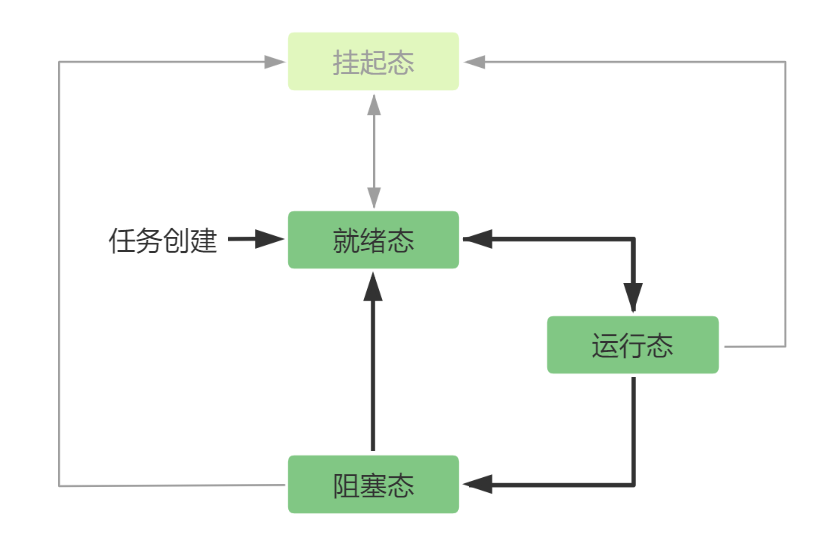
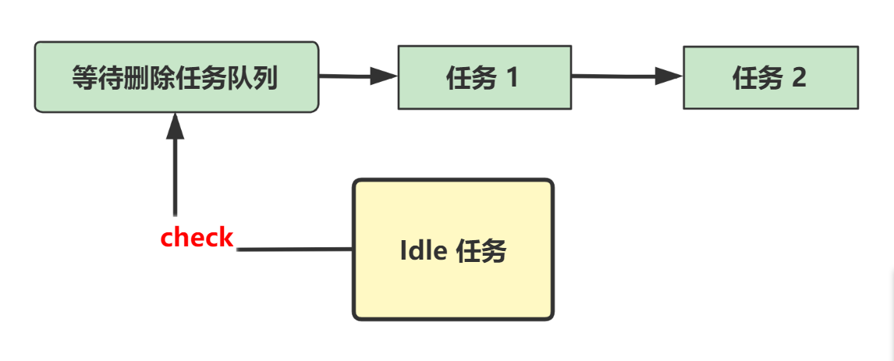
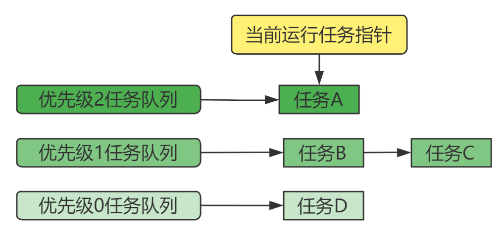
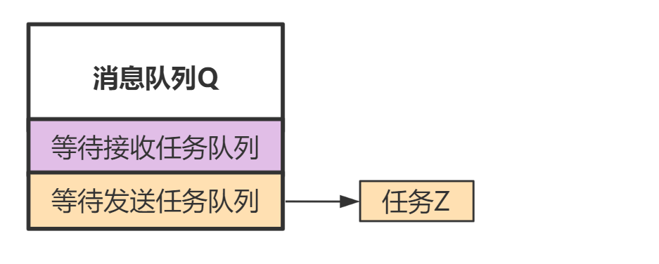

FreeRTOS内核为了方便任务的调度和管理，创建了不同优先级的就绪任务队列，以及其它状态任务队列。通过将任务挂在不同的队列上，实现对任务的状态管理和调度。

<!--more-->

***
#### 何为抢占式调度：
基于FreeRTOS的嵌入式应用，基本上都会打开**抢占**配置开关。即`FreeRTOSConfig.h`文件中的:
`#define configUSE_PREEMPTION		1
`
开启该配置后，FreeRTOS的任务调度即为：**基于优先级的抢占式调度**。即任何时候，系统运行的都是当前所有处于**就绪状态**的任务中，优先级最高的那个任务。系统允许的优先级个数也是在`FreeRTOSConfig.h`文件，例如：
`#define configMAX_PRIORITIES		( 5 )`
**备注**：创建任务时，可以设置的优先级范围是：[0, configMAX_PRIORITIES-1]

 

下面是一些**高优先级任务抢占低优先级任务**的例子：
- main函数中，创建了优先级为3的任务A，和优先级为2的任务B，优先级为1的任务C。当调用`vTaskStartScheduler()`启动任务调度后，任务A会先运行，即**优先级高的先运行**。其它任务则处于就绪态，等待运行。

    | 任务A| 任务B | 任务C |
    |:----: | :----: | :----: |
    | 优先级：3 | 优先级：2 | 优先级：1 |
    | **运行状态** | 就绪状态 | 就绪状态 |
- 只要任务A在执行实际的运算，内核就会让它一直运行，任务B和C就处于**就绪状态**(等待被调度)。
    如果任务A调用了休眠函数`vTaskDelay(1秒)`，或者其它会导致任务需要等待的函数(如获取一个已经被其它任务占用的互斥量，等待一个空的消息队列有数据等)。那么，此时内核就会让任务A进入**阻塞状态**（表明任务在等待某个资源，或只是单纯的delay一段时间），不再占用cpu了。调度器会在当前就绪的任务中选择一个优先级最高的，这里会选择任务B(**就绪态**变为**运行态**)，让其运行。而任务C继续处于就**绪状态**。
    | 任务A| 任务B | 任务C |
    |:----: | :----: | :----: |
    | 优先级：3 | 优先级：2 | 优先级：1 |
    | 阻塞状态 | **运行状态** | 就绪状态 |
- 当任务A delay的时间到期时，调度器会先将任务 A 的状态由**阻塞态**变为为**就绪态**。之后，会检查当前所有处于**就绪态**的任务的优先级，选择其中最高的任务运行，此时任务A 被选中，其状态又从**就绪态**变为**运行态**。
任务B 的运行被抢占了，其状态由**运行态**变为**就绪态**。 
  任务C 仍旧保持**就绪态**
    | 任务A| 任务B | 任务C |
    |:----: | :----: | :----: |
    | 优先级：3 | 优先级：2 | 优先级：1 |
    | **运行状态** | 就绪状态 | 就绪状态 |

- 某个时刻，代码的执行逻辑中又调用`xTaskCreate`创建了一个任务D，并且其优先级为 4。当任务D被创建完成后，其状态为就绪态，内核检查当前所有处于就绪状态的任务的优先级，选中其中优先级最高的任务D 来运行。
即任务 A的运行又被新创建的更高优先级的任务D 抢占了，任务A变为**就绪态**。
任务B、C仍旧保持就绪态。
    | 任务D| 任务A| 任务B | 任务C |
    |:----: |:----: | :----: | :----: |
    | 优先级：4 | 优先级：3 | 优先级：2 | 优先级：1 |
    | **运行状态** | 就绪状态 | 就绪状态 | 就绪状态 |

- 又在某个时刻，代码的执行逻辑中又创建了一个任务E，并且其优先级也是4，那么此时任务列表中存在两个同为最高优先级的任务（任务D、E）。FreeRTOS的默认是会轮流调度这两个任务(`configUSE_TIME_SLICING 没有配置的情况下默认会设置为1`)。
  如果在FreeRTOSConfig.h中明确配置`#define configUSE_TIME_SLICING 0`，那么任务E 创建后也会一直处于就绪态，不会被运行。内核会继续保持运行当前最高优先级的任务D。（即不会在D、E之间轮流调度）

 

#### FreeRTOS的任务状态的转换逻辑：

通过前面优先级抢占的例子，基本上也解释了任务不同状态间的转换，FreeRTOS任务的状态转变概括如下图：

大多数情况下，我们只需要考虑 运行态、就绪态 和 阻塞态。
 - **运行态**(Running)：即任务当前占有CPU，正在运行。被选中运行的任务，一定是所有处于**就绪态**任务中优先级最高的那个任务（如果存在多个，默认会被轮流选择）。所以，**运行态**一定是从**就绪态**转变过来的。
 - **就绪态**(Ready)：任务创建成功后，即处于**就绪态**，即任务运行需要的所有其它资源都准备好了，就等获得CPU执行实际代码了。
  如果当前创建的这个任务的优先级是最高的，该任务就会立刻获得CPU（抢占当前正在运行的那个任务），从而变为**运行态**。而被抢占的任务则变为**就绪态**。
- **阻塞态**(Blocked)：FreeRTOS中有两种情况会使任务进行阻塞态。一种是主动休眠，另一种是等待某个资源可用（等待消息队列有数据，等待互斥量可用等）。
  1.  当正在运行的**任务A**调用`vTaskDelay`函数后，任务就进入**阻塞态**了，在休眠的这段时间，任务没有做任何事情，这段时间如果继续占有CPU，就浪费资源了。FreeRTOS调度器会从剩下的**就绪态**任务中选择优先级最高的任务，并运行它。
  当**任务A**的休眠时间到期时，调度器会将其变为**就绪态**，并检查该任务是否是当前优先级最高的。如果是优先级最高的，调度器就会让**任务A**再次占有CPU并运行(被抢占的任务则转变为就绪态，等待将来被调度运行)。

   

  2. 当正在运行的**任务A**调用`xQueueReceive`从某个队列中获取数 据，而队列当前没有数据，如果任务设置了等待有数据的超时时间。那么任务就会进入**阻塞态**。在队列有数据之前，或者超时时间到期之前，任务什么也不能做，这时还继续占用CPU就浪费资源了。FreeRTOS调度器会从剩下的**就绪态**任务中选择优先级最高的任务，并运行它。
  某个时刻队列有数据了，或者等待超时时间到了，那么任务就会从**阻塞态**转变为**就绪态**，调度器会检查它是否是当前所有任务中最高优先级的，如果是，调度器就会让**任务A**再次占有CPU并运行(被抢占的任务则变为就绪态，等待被调度运行)。

对于**挂起状态**(Suspended)很少会用到，学习的话可以先了解下就行。处于**挂起状态**的任务，不管其优先级如何，都会被排除在系统调度之外，即永远不会被调度。

通过FreeRTOS提供的API：`vTaskSuspend( TaskHandle_t xTaskToSuspend )`，可以让任务挂起，不再被调度。其中参数为某个任务的句柄（用来唯一标识一个任务，任务创建API：`xTaskCreate`在成功创建一个任务时，会生成对应任务的句柄）。如果为NULL，则表示将自己挂起。
通过FreeRTOS提供的API：`vTaskResume( TaskHandle_t xTaskToResume )`可以让某个被挂起的任务恢复成**就绪状态**，从而可以参与后续的调度（如果传入的任务句柄所标识的任务并不是处于**挂起状态**，则什么也不做。例如，如果你传入了一个处于阻塞态的任务句柄，该函数不会起作用，任务仍旧处于阻塞态）。

 

#### FreeRTOS任务状态在内核上的实际实现
前面所述的任务状态，都是逻辑上抽象出来的概念。在FreeRTOS内核的实际实现中，并不是通过记录任务状态来管理任务的。内核是通过实现不同类别的任务队列，来隐式表示任务状态的。

内核中存在多种和任务相关的队列：**就绪任务队列**、**延迟(delayed)任务队列**、**挂起任务队列**、**等待删除任务队列**。
还有一种是**资源(如消息队列资源，信号量资源)内维护的队列**。例如一个消息队列，其内部就会维护一个等待发送数据的任务队列，和等待接收数据的任务队列。当消息队列中没有数据时，如果任务A调用`xQueueReceive`从队列中获取数据，那么任务A就会被挂载到该消息队列内部维护的等待接收数据任务队列上，这样当消息队列中有数据后，就能立刻通知等待数据的任务。同理，如果消息队列已经满了，此时任务A调用`xQueueSend`往消息队列中发送数据，那么任务A就会被挂载到该消息队列内部维护的等待发送数据任务队列上，如此，当消息队列有空闲位置时，就能立刻通知等待发送数据的任务。

  
**运行态**的任务由于只有一个（单核MCU），所以只需要一个全局指针，指向当前正在运行的任务即可，并不需要专用队列。
 

当任务被 当前运行任务指针指向，即当前在运行，则处于 **运行态**。

当任务被挂载到 就绪队列 中时，即处于**就绪态**，内核调度器总是从就绪队列中选择优先级最高的任务来运行。

当任务被挂载到 挂起队列 中时，即处于**挂起态**。

当任务被挂载到 延迟队列 或 某种资源内部维护的任务队列时， 均处于**阻塞态**。

当任务被删除时，如果是自己删除自己，即调用**vTaskDelete（NULL）**（参数为 **NULL** 就是删除自己），就会被挂载到等待删除队列。删除一个任务就是释放这个任务占用的内核资源（任务控制块，任务栈空间），调用vTaskDelete删除其它任务时，可以立刻释放删除任务所占用的资源，因为要删除的任务并没有在运行。但是删除自己就不行了，因为代码的执行本身是依赖于任务的控制块以及任务栈空间，但现在又要去释放它们。所以FreeRTOS的做法是，当任务调用**vTaskDelete（NULL）** 删除自己时，就会被挂到**等待删除任务队列**上（不会再被内核调度了），某一个时刻，系统中没有其它高优先级任务在运行或处于就绪态时，内核会运行自己在启动时创建的 idle 任务（优先级为0，最低优先级），该任务中会检查 **等待删除任务队列**中是否有挂载任务，有的话就释放它们所占用的资源（即对于删除自己的任务，FreeRTOS将其延后到系统不忙时，再由内核创建的Idle任务进行实际删除）。
 

##### 等待删除任务队列:
内核自己创建的 idle 负责检查 等待删除任务队列上是否有挂载任务，如果有就执行实际的删除（释放占用的任务控制块和栈空间）操作。

##### 挂起任务队列:
挂起队列中保存的即那些被挂起的任务，它们永远不可能被调度运行，除非任务被恢复到就绪队列中。

##### 就绪任务队列：
就绪队列用来保存那些处于就绪状态的任务，并且每个优先级都会有一个队列，例如`FreeRTOSConfig.h`文件中配置了优先级个数为 3：
`#define configMAX_PRIORITIES		( 3 )`
则内核中会存在三个就绪任务队列。如果我们创建:
一个优先级为2的任务 A
两个优先级为1的任务 B、C
一个优先级为0的任务 D
则内核维护的三个就绪任务队列，以及当前任务指针的指向，整体状态如下图所示`(实际上内核会自己创建一个idle任务。如果启用了软件定时器，内核还会创建一个timer任务，这里不考虑这两个任务)`：

通过这种方式，内核调度器每次进行任务调度时，直接从最高优先级的就绪队列中找下一个任务运行即可(默认相同优先级的任务轮流调度)。

##### 延迟任务队列：
例如，当任务调用`vTaskDelay`函数休眠时，就会被挂在 延迟任务队列 下。
内核在每次时钟tick中断时，会检查延迟队列中任务的超时值，并将等待时间到期的任务从 延迟队列 中移出，并重新加入到任务优先级对应的就绪队列中。

此外，当任务请求某种资源时，例如，调用`xQueueReceive`从消息队列**Q**中获取消息，并且设置了等待超时时间。那么当消息队列**Q**中没有数据时，内核也会将任务挂在 延迟队列下。这样，当等待的超时时间到期后，内核就会将任务重新挂到就绪队列下，避免了无限期等待数据。

##### 资源内部维护的任务队列：
如前面所述，当从消息队列**Q**中请求数据，但是消息队列**Q**为空，如果设置了等待超时。那么，任务会被 挂在到延迟任务队列中（用来检测是否超时），**同时也会被挂载到消息队列Q内部维护的等待接收任务队列中**（这样**Q**一有数据，就能通过该队列通知等待数据的任务）。

例如，当消息队列**Q**为空时，高优先级任务X 和低优先级任务Y 均请求获取数据，则它们挂载到消息队列**Q**的状态如下图所示（实际执行逻辑应该是任务X 在运行时请求消息队列获取数据，由于没有数据，则进入阻塞态。内核切换到任务Y运行，任务Y也请求消息队列获取数据，同样进入阻塞态）。

任务X和任务Y在等待接收数据队列中是按优先级排序的。这样，当消息队列有数据时，即可以最先通知优先级高的任务来提取数据。

同理，当消息队列**Q**为满时，已经不能再往队列里发送数据了。此时，如果任务Z 向消息队列请求发送数据，则会进入阻塞态，并被挂载到**Q**的等待发送任务队列中(这样**Q**已有空闲空间，就可以通知任务Z)。如下图所示：

即任务对于资源的请求，如果不能立刻获取到，并且设置了等待时间，**任务会被同时挂载到 延迟队列，以及资源内部队列中**。
挂载到延迟任务队列中，是为了让任务在等待资源可用时，可以设置等待超时。让任务可以在超时时间到期后，即使资源不可用，也会退出等待。
挂载到资源内部的任务队列中，是为了当资源可用时，可以立刻通知等待该资源的任务。

 
FreeRTOS交流QQ群-663806972

