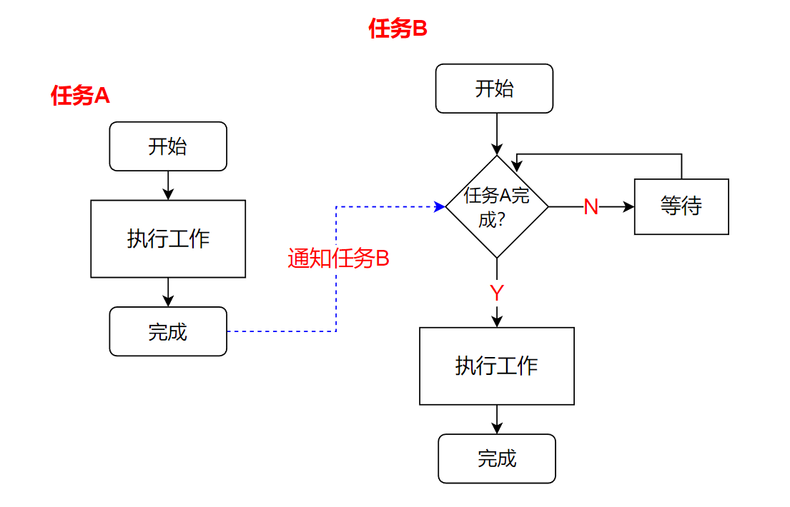
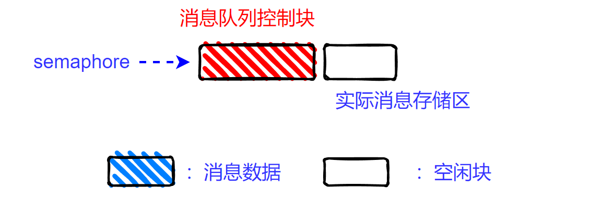
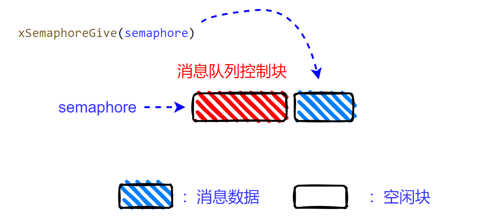
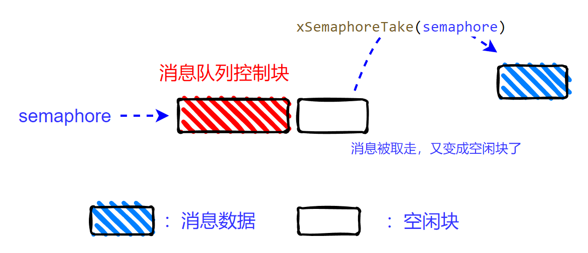

<center>
FreeRTOS提供了信号量功能，通过使用信号量，可以实现任务和任务、中断服务函数和任务间的事件/信息同步。本文最后，还解释了为了什么FreeRTOS有两套API分别在中断/非中断环境下使用。
</center>

<!--more-->

***

#### 1 信号量的作用：

信号量的核心功能是用来进行任务间的“事件/信息同步”，使得多个任务可以按照“期望”的顺序进行运行。例如，任务B执行的工作，依赖于任务A的产出结果，那么就需要将`任务A运行完成`这个“信息”和任务B进行同步。

又如，每当按键按下时，任务C 需要针对性的做一些处理工作，这里就需要将`按键按下`这个“信事件同步给任务C。

因此，信号量存在两种状态。`“可用”`状态和`“不可用”`状态。当我们**获取**某个信号量时，如果信号量当前`可用`，就可以立刻获取到信号量，否则任务就会进入阻塞状态（取决于是否愿意等待，如果设置了不等待，则立刻返回错误），以等待信号量变为`可用`。此时如果另一个任务（或中断处理函数）中**设置**了该信号量，那么等待该信号量的任务就会从阻塞态恢复为就绪态。

以之前的例子解释：任务B每次执行的工作，都依赖于任务A 的产出结果
假设我们创建了一个信号量`semaphore`（初始状态`不可用`），那么任务B 运行后就第一件事就是先**获取**`semaphore`，此时`semaphore`不可用（期望的事件还没发生），则任务B进入阻塞态。当某个时刻，任务A运行结束了，则任务A 在结束后**设置**`semaphore`（信号量变为可用，将任务A 结束的消息通知给任务B）。之后，由于`semaphore`变为`可用`状态，则等待该信号量的任务B 从阻塞状态中恢复为就绪状态，并可以获取到信号量。当任务B也执行完工作后，会再次尝试**获取**`semaphore`，由于`semaphore`已经被消耗了，那么任务B 再次进入阻塞状态，以等待任务A 再一次完成它的工作，并**设置**`semaphore`（通知B可以运行）。
代码逻辑如下所示：
```C
TASK_A:
    while 1:
        do something
        give semaphore  // 设置信号量，通知任务B，可以运行了

TASK_B:
    while 1:
        take semaphore  // 获取信号量，等待任务A 先完成
        do something
```

生活中的红绿灯，是个更直观地解释信号量的例子。当红灯亮时（信号量不可用），汽车不允许通过（任务阻塞了）；当绿灯亮时（信号量可用），则恢复运行。

红绿灯这个例子，也隐含了信号量的另一个作用，可以用来对竞争资源进行互斥访问。 十字路口就是竞争资源，任何时刻只能一个方向的汽车通行，当某个方向绿灯了（可以认为这个方向获取到了信号量，可以通行），则另一个方向就是红灯（这个方向没获取到信号量，就不能通行）。但通常开发中，**信号量都是用来进行任务间的“信息/事件”同步。对竞争资源的互斥访问，基本都是使用互斥量（mutex）**。顾名思义，[互斥量](https://fengxun2017.github.io/2023/01/03/FreeRTOS-mutex/) 就是用来保证数据的互斥访问，让其任意时刻，只能被一个任务访问。对竞争数据的互斥访问，互斥量除了在语义上比信号量更明确外，互斥量还具有优先级继承特性，相对于信号量更适合做数据的互斥访问。

在文章[FreeRTOS-使用消息队列](https://fengxun2017.github.io/2022/12/12/FreeRTOS-use-queue/)和文章[FreeRTOS-消息队列内部细节](https://fengxun2017.github.io/2022/12/08/FreeRTOS-queue-internal-details/)中，我们学习到了FreeRTOS消息队列的几个特性：
- FreeRTOS的消息队列是多任务安全的，多个任务同时读写消息队列，不会造成消息队列内部状态错误，消息队列模块内部对读/写做了临界区保护。
- 消息队列为空时，任务请求从消息队列中获取消息。如果指定了等待时间，则任务会进入阻塞状态。消息队列收到消息了，或者等待时间超时了，该任务都会恢复为就绪状态。
- 消息队列满时，任务请求向消息队列中发送数据。如果指定了等待时间，则任务会进入阻塞状态，消息队列有空闲位置了，或者等待超时了，任务会恢复为就绪状态。如果不指定等待时间（设置为0），由于队列已经满了，发送消息请求会立刻返回错误。


即，FreeRTOS的消息队列天然具有了信号量要求具备的特性：
- `不可用`状态（即消息队列为空）下尝试获取，会让任务阻塞
- `可用`时（有数据了），会自动让等待`可用`状态的任务，恢复为就绪状态
- 多任务同时访问是安全的（信号量会涉及多个任务同时读/写同一信号量，所以需要有多任务访问安全的特性）。

因此，FreeRTOS基于现有的消息队列功能，实现了信号量功能。

#### 2 二值信号量：
二值信号量，是广泛使用的一种信号量。任意时刻，二值信号量，要么是可用状态，要么是不可用状态。

FreeRTOS使用一个长度为1 的消息队列来实现二值信号量。当该消息队列中有消息时，就是信号量可用。当该消息队列中无消息时，就是信号量不可用。

##### 2.1 创建二值信号量
当我们使用API ：
```c
SemaphoreHandle_t semaphore = xSemaphoreCreateBinary();
```
创建一个二值信号量`semaphore`时，就是创建了一个长度为1 的消息队列，并且初始状态，是没有消息的（即信号量不可用）如下图所示：信号量指针`semaphore`指向一块内存，该内存前面为消息队列的控制区域，之后为存储区，只能存储一个消息。


`备注：本文为了方便解释，上文以及下文图中表示信号量的消息队列中都有消息存储区。但实际的信号量代码实现中是没有消息存储区的（创建时虽然指定了队列大小n，但内部会将每个消息大小设置为0，因此消息存储区大小 n*0 = 0），因为并不需要存消息数据（也没有消息数据要存），信号量关心的是有没有消息，而不是消息本身。在消息队列控制块中有一个数据成员uxMessagesWaiting ，该成员指明当前消息队列中有几个消息，利用该成员变量即可判断消息队列是否有数据（即消息队列是否可用）。因此，不需要实际的内存来存储消息。`

##### 2.2 设置二值信号量为可用状态
信号量创建完成后，默认是不可用状态，即消息队列中是没有消息的。调用API
```c
xSemaphoreGive(semaphore);
```
即可将信号量`semaphore`**设置**为有效状态，其本质是向表示信号量`semaphore`的消息队列中“放入了一条消息”。如下图所示（`如上文所述，实际是没放消息，只是将内部的消息计数器uxMessagesWaiting加1 了，图中是为了方便解释才画了存有消息`）：

<br/>


##### 2.3 获取信号量
信号量一旦处于可用状态（其中“存有消息”了），调用
```c
xSemaphoreTake(semaphore, pdMS_TO_TICKS(1000));
```
就能立刻**获取**到信号量，该函数就会立刻返回。其原理就是从`semaphore`表示的消息队列中取走了消息（消息取走后，`semaphore`就会变成不可用状态）。如下图所示（`同样，下图中的取走消息是为了说明原理，实际代码中将内部的消息计数器uxMessagesWaiting减1 就行了`）


但如果是在`semaphore不可用`时（即消息队列为空时），调用该api 来**获取**`semaphore`，调用该api 的任务会阻塞在该函数内部，直到信号量可用（其它任务或中断函数中**设置**了信号量，即向消息队列中发送了数据），或者等待时间达到了设定的1 秒超时时间。

#### 3 任务和任务间使用二值信号量进行信息同步
我们以前文的例子来演示二值信号量的使用：我们创建两个任务`task_a`和`task_b`。 只有当`task_a`做完一些工作，`task_b`才能继续运行。我们使用信号量来对两个任务间的信息进行同步，`task_b`每次运行前都会先“获取”信号量，信号量不可用时，`task_b`就会阻塞， 而`task_a`每次做完工作后，就“设置”信号量，通知`task_b`可以运行了。

`task_a`和`task_b`的代码如下：
```c
void task_a( void *pvParameters ) {

    SemaphoreHandle_t semaphore = (SemaphoreHandle_t)pvParameters;
    for(;;) {
        
        // 延迟1秒，模拟 task_a 在处理一些工作
        vTaskDelay(pdMS_TO_TICKS(1000));
        
        SEGGER_RTT_printf(0, "task_a done!\n");

        // 工作做完了，设置信号量，通知task_b 可以运行了
        xSemaphoreGive(semaphore);
        
    }
}

void task_b( void *pvParameters ) {
    
    SemaphoreHandle_t semaphore = (SemaphoreHandle_t)pvParameters;
    for(;;) {
        
        // 只有 task_a 做完一些工作后，通知 task_b, task_b 才能执行后续工作.
        // 这里“获取”信号量，如果task_a 还未设置这个信号量，task_b 就会阻塞在该函数内部，直到task_a设置信号量，或者等待超过2秒
        // 这里应该判断返回值，检查是超时返回还是获得信号量返回。样例为了简单，并未判断
        xSemaphoreTake(semaphore, pdMS_TO_TICKS(2000));
        SEGGER_RTT_printf(0, "task_b start runing!\n");
    }
}
```
main函数代码：
```c
#include "FreeRTOS.h"
#include "task.h"
#include "semphr.h"

int main(void) {

    // 创建二值信号量
    SemaphoreHandle_t semaphore = xSemaphoreCreateBinary();

    if(NULL != semaphore) {
        // 创建两个任务
        if (pdPASS == xTaskCreate(task_a, "task_a", 100, semaphore, 1, NULL)
            && pdPASS == xTaskCreate(task_b, "task_b", 100, semaphore, 1, NULL)){
            
            SEGGER_RTT_printf(0, "start FreeRTOS\n");

            // 启动内核任务调度器
            vTaskStartScheduler();
        } 

    }
    // 正常启动后不会运行到这里
    SEGGER_RTT_printf(0, "insufficient resource\n");

    for( ;; );
    return 0;    
}
```

运行结果如下所示：`task_b` 每次在 `task_a`完成后才会运行。
```
start FreeRTOS
task_a done!
task_b start runing!
task_a done!
task_b start runing!
task_a done!
task_b start runing!
task_a done!
task_b start runing!
```

#### 4 中断处理函数和任务间使用二值信号量进行信息同步
上面的例子中，信号量的“设置”或“获取”都是在任务代码中，FreeRTOS在中断处理函数中也可以“设置”或“获取”信号量，但需要使用带**FromIS**后缀的API ,中断处理函数中“设置”信号量可以使用`xSemaphoreGiveFromISR`，中断处理函数中“获取”信号量可以使用`xSemaphoreTakeFromISR`。

例如，下面是一个使用信号量，对中断处理函数和任务进行“事件同步”的例子。我们使用按键作为“中断源”，每当按键按下时，设置信号量。任务`button_pressed_handler`等待信号量(等待按键事件发生)，一旦信号量可用，表示等待的“事件”发生了，则做一些相关的工作。
其中，中断处理函数如下所示：
```c
extern SemaphoreHandle_t semaphore;

void GPIOTE_IRQHandler(void){

    BaseType_t higher_task_woken = pdFALSE;
    // 寄存器相关代码和具体硬件相关
    if ( NRF_GPIOTE->EVENTS_PORT == 1 ){

        //中断处理函数中要清除event,不然会导致一直产生中断
        NRF_GPIOTE->EVENTS_PORT = 0;    

        // 确认是按键按下，则设置信号量
        if(IS_BUTTON_PRESSED(BUTTON_1)) {
            xSemaphoreGiveFromISR(semaphore, &higher_task_woken);
            SEGGER_RTT_printf(0, "in interrupt service function, button pressed\n");
        }
    }

    // 如果higher_task_woken=True，表示设置信号量操作，使得某个等待该信号可用的高优先级任务变为就绪状态了
    // 我们使用的是抢占式调度，只要有更高优先级的任务就绪，应该让其立刻运行。
    // 下面的代码就是，判断有更高优先级就绪时，就会设置任务切换中断，那么当前中断函数退出后，就会立刻触发任务切换，让最高优先级的就绪任务运行。
    portYIELD_FROM_ISR(higher_task_woken);
}
```

处理按键事件的任务代码为：
```c
void button_pressed_handler( void *pvParameters ) {

    SemaphoreHandle_t semaphore = (SemaphoreHandle_t)pvParameters;
    for(;;) {
        // 注意，使用portMAX_DELAY，表示如果信号量不可用，则会一直阻塞当前任务，直到信号量可用。
        // 使用portMAX_DELAY，需要在FreeRTOSConfig.h 文件中定义 INCLUDE_vTaskSuspend = 1
        // 正式产品代码最好使用一个超时值，这样异常发生时（例如中断源发生异常，没按预期触发），至少能获得超时错误，可以在超时错误中做一些恢复操作。
        xSemaphoreTake(semaphore, portMAX_DELAY);
        SEGGER_RTT_printf(0, "in task, do something\n");        
    }
```

Main函数实现为：
```c
#include "FreeRTOS.h"
#include "task.h"
#include "semphr.h"

SemaphoreHandle_t semaphore;

// 使用二值信号量进行中断事件同步
int main(void) {
    
    // 硬件相关初始化
    bsp_init();
    
    // 创建二值信号量
    semaphore = xSemaphoreCreateBinary();
    if(NULL != semaphore) {
        
        // 创建任务
        if (pdPASS == xTaskCreate(button_pressed_handler, "button_pressed_handler", 100, semaphore, 1, NULL)){
            
            SEGGER_RTT_printf(0, "start FreeRTOS\n");

            // 启动内核调度器
            vTaskStartScheduler();
        } 

    }

    // 正常启动后不会运行到这里
    SEGGER_RTT_printf(0, "insufficient resource\n");

    for( ;; );
    return 0;    
}
```

运行结果如下所示，每次按键后，就会触发任务`button_pressed_handler`执行相关工作。
```
start FreeRTOS
in interrupt service function, button pressed
in task, do something
in interrupt service function, button pressed
in task, do something
```

#### 为什么FreeRTOS中，有两套API分别在中断/非中断环境下使用：

FreeRTOS中的很多API， 可能会使得调用者任务进入阻塞态。但在中断环境中调用这些API 时，因为中断本身是和任务无关的（中断可能在任何时候发生，打断任意的任务），所以中断环境中调用这些API时， 不能让某个任务因此导致进入阻塞状态。因此，如果就使用一套API, 那么就需要在这些API 的内部实现中判断当前的调用环境是不是在中断环境中（在中断环境中和不在中断环境需要执行一些不一样的工作），这无疑为会增加API 内部实现的复杂性，同时也降低的这些API 的执行效率（因为需要做一些额外的环境判断和检查）。

因此，FreeRTOS针对这些API，直接实现了两套API，分别在中断和非中断环境中使用。这样，每套API的调用环境是确定的，内部实现可以更简单，高效。
<br/>


<br/>
ps：需要注意文章代码中的日志输出函数，产品代码中如果需要使用的话，需要考虑线程安全性（多任务安全性），因为中断/任务切换可能发生在另一个任务正在输出日志但还未输出完的时候，这就可能造成日志错乱

<br/>
<br/>
FreeRTOS交流QQ群-663806972

<br/>
