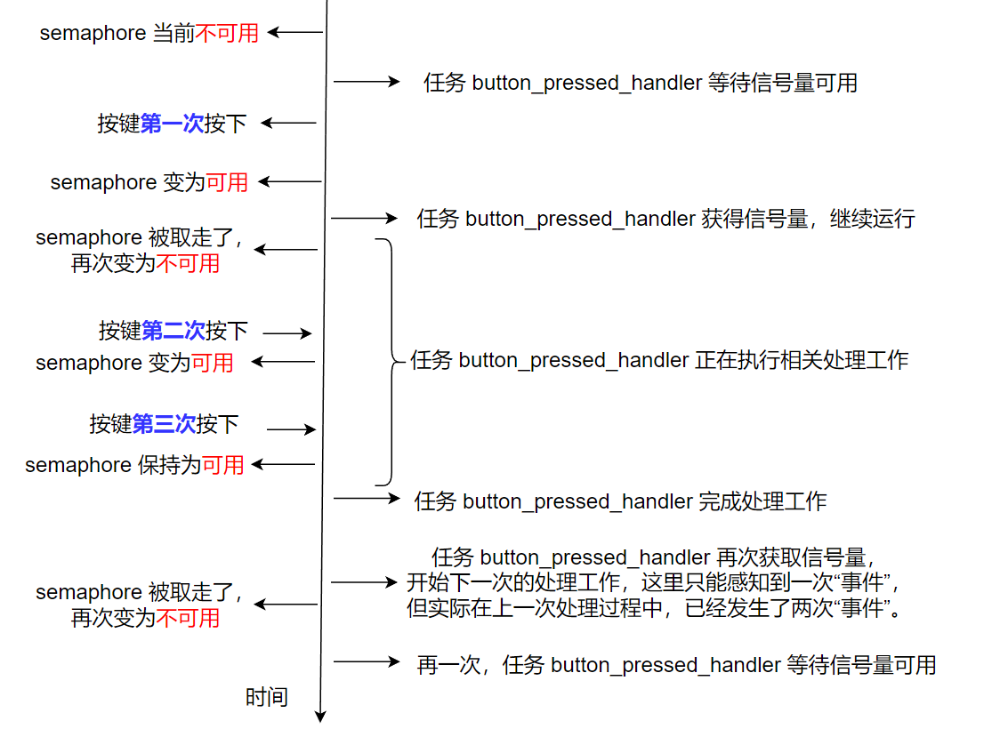
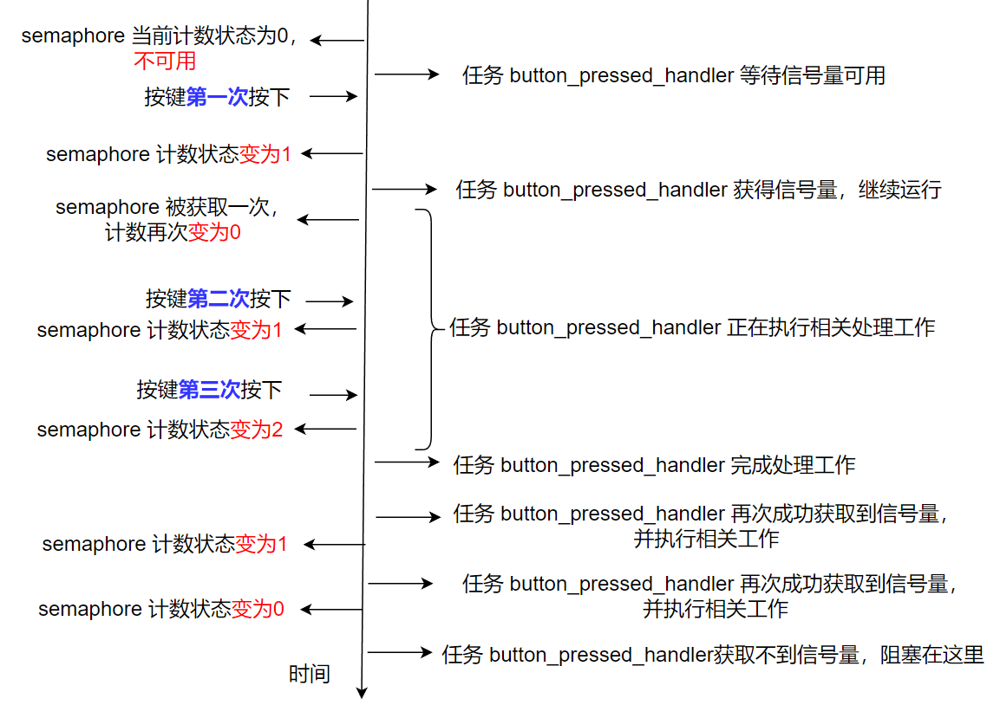
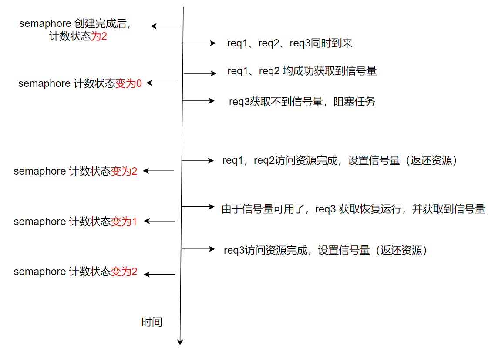

<center>
与二值信号量相比，计数信号量可以记录事件发生的次数。并且，还可以使用计数信号量对数量有限的资源进行访问管理。
</center>

<!--more-->

***

#### 1 二值信号量的无法记录事件次数的问题：
文章[FreeRTOS-使用二值信号量](https://fengxun2017.github.io/2022/12/15/FreeRTOS-use-binary-semaphore/#more)的最后，描述了一个使用二值信号量，在中断处理函数和任务间进行“事件”同步的例子。
我们使用按键作为“中断源”，每当按键按下时，设置信号量。任务`button_pressed_handler`等待信号量（等待按键事件发生），一旦信号量可用，表示等待的“事件”（按键按下）发生了，则做一些相关的工作。

但这个例子存在一个问题：
第一次按键事件发生后（中断处理函数中设置了信号量，信号量变为`可用`状态），任务`button_pressed_handler`获得信号量（`信号量被获取后，由可用状态再次变为不可用状态`），恢复运行，并开始执行一些相关处理动作。
如果任务`button_pressed_handler`在执行相关处理过程中，又连续发生了第二次、第三次按键动作（又触发了两次事件）。
由于二值信号量，只有`可用`和`不可用`状态，第二次按键事件发生时，信号量由`不可用`变为`可用`状态。仅接着的第三次按键事件发生后，中断处理函数中同样也是设置信号量，由于当前信号量已经是`可用`状态，所以设置操作并未起作用，信号量依旧保持`可用状态`。 
当任务`button_pressed_handler`相关处理操作执行完成后，再次获取信号量，由于当前信号量为`可用`状态，因此可以立刻获取到信号量，并再次执行相关处理工作。但是，此时对于任务`button_pressed_handler`来说，它只感知到 “事件”发生了一次，但实际上在处理之前已经发生了两次“事件”。上述过程的时间线如下图所示：



下面我们用代码复现上述问题，我们使用` vTaskDelay(pdMS_TO_TICKS(2000))`让任务`button_pressed_handler`在获取到信号量后等待2 秒，来模拟任务`button_pressed_handler`在处理相关工作。
任务代码为：
```c
void button_pressed_handler( void *pvParameters ) {

    SemaphoreHandle_t semaphore = (SemaphoreHandle_t)pvParameters;
    for(;;) {
        // 注意，使用portMAX_DELAY，表示如果信号量不可用，则会一直阻塞当前任务，知道信号量可用。
        // 使用portMAX_DELAY，需要在FreeRTOSConfig.h 文件中定义 INCLUDE_vTaskSuspend = 1
        // 正式产品代码最好使用一个超时值，这样异常发生时（中断有问题，没触发），至少能获得超时错误，可以在超时错误中做一些恢复操作。
        xSemaphoreTake(semaphore, portMAX_DELAY);
        SEGGER_RTT_printf(0, "in task, do something\n");

        // 让任务延迟一会，模拟其在处理一些工作
        vTaskDelay(pdMS_TO_TICKS(2000));
        
    }
}
```
按键中断和main函数与文章[FreeRTOS-使用二值信号量](https://fengxun2017.github.io/2022/12/15/FreeRTOS-use-binary-semaphore/#more)中的一致：
```c
#include "FreeRTOS.h"
#include "task.h"
#include "semphr.h"

SemaphoreHandle_t semaphore;

// 使用二值信号量进行中断事件同步
int main(void) {
    
    // 硬件相关初始化
    bsp_init();
    
    semaphore = xSemaphoreCreateBinary();
    if(NULL != semaphore) {
        
        if (pdPASS == xTaskCreate(button_pressed_handler, "button_pressed_handler", 100, semaphore, 1, NULL)){
            
            SEGGER_RTT_printf(0, "start FreeRTOS\n");
            vTaskStartScheduler();
        } 

    }

    // 正常启动后不会运行到这里
    SEGGER_RTT_printf(0, "insufficient resource\n");

    for( ;; );
    return 0;    
}

//按键中断处理函数，寄存器相关代码与硬件相关
void GPIOTE_IRQHandler(void){

    BaseType_t higher_task_woken = pdFALSE;
    if ( NRF_GPIOTE->EVENTS_PORT == 1 ){

        //中断处理函数中要清除event,不然会导致一直产生中断
        NRF_GPIOTE->EVENTS_PORT = 0;    

        // 确认是按键按下，则设置信号量
        if(IS_BUTTON_PRESSED(BUTTON_1)) {
            xSemaphoreGiveFromISR(semaphore, &higher_task_woken);
            SEGGER_RTT_printf(0, "in interrupt service function, button pressed\n");
        }
    }

    // 如果higher_task_woken=True，表示有更高优先级任务就绪了
    // 我们使用的是抢占式调度，只要有更高优先级的任务就绪，应该让其立刻运行。
    // 下面的代码就是，判断有更高优先级就绪时，就会设置任务切换中断，那么当前中断函数退出后，就会立刻触发任务切换，让最高优先级的就绪任务运行。
    portYIELD_FROM_ISR(higher_task_woken);
}
```

运行代码后，我们在2秒内，连续按下三次按键，可以发现任务只处理了两次事件：
```
start FreeRTOS
in interrupt service function, button pressed       #第一次按键 
in task, do something                               #任务获取到信号量，执行处理工作（原地延迟了2秒）
in interrupt service function, button pressed       #第二次按键 
in interrupt service function, button pressed       #第三次按键 
in task, do something                               #任务延迟2秒结束后，再次获取信号量，再次执行处理工作。但只执行了这一次，而实际中间有两次按键
```


上述这种情况，就是二值信号量存在的“弊端”，即无法记录“事件”发生的次数。如果上面例子中“事件”发生的“次数”也是一个重要的数据（例如，每次发生一次“事件”，任务`button_pressed_handler`都必须有一次对应的处理），那么二值信号量就不再适用。

因此，二值信号量适用于事件发生频率“较低”的场景中，开发者能确定事件发生后，在后续的处理过程中，事件不会在此期间内，再发生超过一次。
更简单的情形，就是应用场景不关心事件发生的次数，只关心有没有发送过。这种场景下也可以使用二值信号量。

#### 2 计数信号量
由于`二值信号量`的局限性，一般提供信号量功能的系统同时会提供`计数信号量`功能，其功能和二值信号量一致，但是多了计数功能。上文的问题，使用`计数信号量`就可以记录下按键事件发生的次数。
计数信号量的**设置**和**获取**API 和二值信号量是一样的，区别只是在创建API:
```c
SemaphoreHandle_t xSemaphoreCreateCounting( UBaseType_t uxMaxCount, 
                                            UBaseType_t uxInitialCount )
```
- uxMaxCount：设置计数信号量在被获取前，可以保留的的最大计数值（以上文的例子解释，就是在任务`button_pressed_handler`执行处理工作期间，按键只要按下的次数小于`uxMaxCount`，信号量都可以记录下来）。
- 指定创建后的初始值（例如，如果指定为0，信号量创建后就是不可用状态，调用`xSemaphoreTake`获取信号量时，就会让任务阻塞。如果指定为2，创建完成后，立刻连续调用2 次`xSemaphoreTake`，都能成功获取到信号量）。

[二值信号量](https://fengxun2017.github.io/2022/12/15/FreeRTOS-use-binary-semaphore/#more)一文中，我们解释了FreeRTOS中的二值信号量，实际是用一个长度为1 的消息队列来实现的。 同理，FreeRTOS的`计数信号量`也是使用消息队列来实现的，只是消息队列的大小为`xSemaphoreCreateCounting` API 创建`计数信号量`时指定的`uxMaxCount`值。消息队列的大小，即表示信号量被获取前最大可以记录的“事件”发生次数。（同样，如文章[二值信号量](https://fengxun2017.github.io/2022/12/15/FreeRTOS-use-binary-semaphore/#more)中所述，这里创建的大小为`uxMaxCount`的消息队列，实际上除了消息队列的控制块占用内存，消息本身是不占内存的，因为内部指定的每个消息大小为0，所以消息存储所占内存为大小为`uxMaxCount * 0 = 0`）

对于计数信号量的**设置**与**获取**，原理也是和二值信号量一样：
- 使用信号量**设置**API `xSemaphoreGive`，就是向`计数信号量`表示的消息队列中放入一个消息（即信号量计数值加1。如果消息队列已经满了，即已经达到计数信号量能记录的最大值`uxMaxCount`，则设置不生效，信号量仍旧保持最大计数值状态）。
- 使用信号量**获取**API `xSemaphoreTake`，就是从`计数信号量`表示的消息队列中提取一个消息（只要消息队列中存在消息，就能立刻成功获取到信号量，成功获取后，计数信号量的计数值会减1。如果消息队列为空，则表示信号量不可用，会阻塞当前任务，直到信号量可用，或到达设置的等待超时时间）。

我们使用`计数信号量`来改造上文的按键事件同步的例子，需要改动的代码很少，使用`计数信号量`首先需要在工程配置文件`FreeRTOSConfig.h`中添加使用`计数信号量`的宏定义：
```c
#define configUSE_COUNTING_SEMAPHORES	1
```
之后，修改上文中的main 函数，将创建信号量API，替换成`xSemaphoreCreateCounting`即可：
```c
#include "FreeRTOS.h"
#include "task.h"
#include "semphr.h"

int main(void) {
    
    // 硬件相关初始化
    bsp_init();
    
    // 将创建二值信号量，修改为创建计数信号量
    // 最大可以保留的“事件发生数”为10，初始信号量计数状态为0--即不可用
    // semaphore = xSemaphoreCreateBinary();
    semaphore = xSemaphoreCreateCounting(10, 0);
    if(NULL != semaphore) {
        
        if (pdPASS == xTaskCreate(button_pressed_handler, "button_pressed_handler", 100, semaphore, 1, NULL)){
            
            SEGGER_RTT_printf(0, "start FreeRTOS\n");
            vTaskStartScheduler();
        } 
    }
    // 正常启动后不会运行到这里
    SEGGER_RTT_printf(0, "insufficient resource\n");

    for( ;; );
    return 0;    
}
```

程序运行后，在2秒内连续按键三次，可以发现按键按下了三次，任务`button_pressed_handler`也执行了三次处理。如下所示:
```
start FreeRTOS
in interrupt service function, button pressed       #第一次按键 
in task, do something                               #任务获取到信号量，执行处理工作（原地延迟了2秒）
in interrupt service function, button pressed       #第二次按键 
in interrupt service function, button pressed       #第三次按键 
in task, do something                               #任务延迟2秒结束后，再次成功获取信号量，再次执行处理工作。
in task, do something                               #上一个延迟2秒结束后，再次获取信号量，仍旧能立刻获取到信号量，再次执行处理工作。
```
程序的执行时间线如下图所示：



#### 3 使用计数信号量管理有限数量的资源
目前为止，我们使用的`二值信号量`以及`计数信号量`，都是用来作为任务和任务之间（或中断处理程序和任务）同步的工具。这种使用方式有一个明显的特征：`任务a`中使用`xSemaphoreTake`来等待信号量（等待某`事件A`发生），另一个`任务b`（或中断处理程序）中在`事件A`发生时使用`xSemaphoreGive`设置信号量（告诉`任务a`事件发生了）。

但`信号量`不仅可以用来在多个任务间“同步事件”，还可以用来管理资源。 
假设，我们有一个系统，该系统会收到外部访问请求，每次请求都会访问系统内部的某个`资源Z`。 
假设我们有`2 个资源Z`，每次收到请求时，可以访问任意一个`资源Z`，假设访问`资源Z`需要`1秒`时间，**资源Z 在被访问期间内是不允许再被另一个请求同时访问的**。
当外部访问请求频率很低时，如1s一次，每次外部请求都能立刻访问到某个`资源Z`（2个中的任意一个）。
但某个时刻(1秒钟内)，突然有3个外部请求，由于系统只有2个`资源Z`，因此，只能有2个请求能立刻访问到`资源Z`，而第三个请求必须等前两个请求中的任意一个访问结束，才能去访问`资源Z`。

诸如上述情况，对有限资源的互斥访问，就可以使用`计数信号量`来管理。
在创建`计数信号量`的API 中：
```c
SemaphoreHandle_t xSemaphoreCreateCounting( UBaseType_t uxMaxCount, 
                                            UBaseType_t uxInitialCount )
```
第二个值指示了信号量创建完成后，它的初始计数值，即表示我们有几个`资源Z`可用。
任何请求，每次访问`资源Z`前都要使用`xSemaphoreTake`先获得信号量，能成功获取到信号量则表示当前还有`资源Z`可供访问，如果获取不到，就表明没有`资源Z`可以访问了。
当获取到信号量后，开始访问`资源Z`，访问结束后，需要使用`xSemaphoreGive`设置信号量，可以理解为将获取的`资源Z`还回去。这样其它请求到来时，才能获取到信号量（只有成功获取到信号量后，才能访问资源）。

对于前面访问`资源Z`的例子，我们就可以将`xSemaphoreCreateCounting`第二个参数`uxInitialCount`设置为`2`。这样，信号量创建完成后的计数状态就是2，表示有2 个`资源Z`可用。
某个时刻，同时来了3个对`资源Z`的访问请求:`req1`、`req2`、`req3`。
对于每个请求，访问资源前，先使用`xSemaphoreTake`获取信号量，由于当前信号量的计数状态为2，`req1`和`req2`两个请求都可以立刻获取到信号量，从而开始访问`资源Z`。但当`req3`请求获取信号量时，此时信号量的计数状态为0，则获取不到信号量，任务就会阻塞。直到`req1`和`req2`中的任意一个访问`资源Z`完成后，重新设置了信号量，`req3`才能成功获取到信号量，恢复运行并访问`资源Z`。
该过程时间线大致如下图所示：


需要再次强调的一点是：**对资源Z的访问，要求是互斥访问**。即这里虽然有两个全局共享的`资源Z`，但**对任意一个`资源Z`的访问都需要是互斥的，不允许两个任务同时访问同一个资源Z**，所以才需要使用信号量对访问进行管理，如果资源本身允许多个任务同时访问，那就不需要对访问进行管理了。

最后，我们使用代码来模拟上述过程：

首先创建一个信号量来管理对`共享资源Z`的访问：
```c

SemaphoreHandle_t semaphore;

int global_resource_init(void) {

    // 假设我们只有2个 共享资源Z
    // 创建信号量来管理 共享资源Z。
    // 信号量最大计数值，和初始值都应该设置为2，表示这个资源最大有2个，当前存在2个
    semaphore = xSemaphoreCreateCounting(2, 2);
    if (NULL == semaphore) {
        return pdFALSE;
    }
    return pdTRUE;
} 
```
将对资源的访问进行封装，访问前需要先“获取”信号量，访问完成后需要再重新“设置”信号量，即返还资源。
```c

void accessing_resource(const char *accessor) {
    
    // 访问共享资源Z前，需要获取信号量，获取成功，表示当前还有资源可用
    // 使用portMAX_DELAY，表示如果信号量不可用，则会一直阻塞当前任务，直到信号量可用。
    // 使用portMAX_DELAY，需要在工程配置文件FreeRTOSConfig.h 中定义 INCLUDE_vTaskSuspend = 1
    // 正式产品代码最好使用一个超时值，这样异常发生时，还可以获得超时错误，可以在超时错误中做一些恢复操作。
    xSemaphoreTake(semaphore, portMAX_DELAY);
    SEGGER_RTT_printf(0, "%s: start accessing resouce!\n", accessor);

    // 延迟1秒，模拟正在访问资源Z
    vTaskDelay(pdMS_TO_TICKS(1000));

    SEGGER_RTT_printf(0, "%s end resource access!\n", accessor);

    // 资源访问完成后，需要将上面获取的信号量“还回去”。这样其它任务还能继续访问这个资源
    xSemaphoreGive(semaphore);
}
```

再创建三个任务，来访问`资源Z`。简单起见，这三个任务的代码都是一致的。可以只实现一个，创建三次，这里为了更清晰，写了三份任务代码:
```c

void task_a( void *pvParameters ) {
    SEGGER_RTT_printf(0, "start task_a\n");

    for(;;) {
        accessing_resource("task_a");

        // 延迟100ms，模拟正在执行其它操作
        vTaskDelay(pdMS_TO_TICKS(100));
    }
}

void task_b( void *pvParameters ) {
    SEGGER_RTT_printf(0, "start task_b\n");

    for(;;) {
        accessing_resource("task_b");     
        
        // 延迟100ms，模拟正在执行其它操作
        vTaskDelay(pdMS_TO_TICKS(100));   
    }
}

void task_c( void *pvParameters ) {
    SEGGER_RTT_printf(0, "start task_c\n");

    for(;;) {
        accessing_resource("task_c"); 
        
        // 延迟100ms，模拟正在执行其它操作
        vTaskDelay(pdMS_TO_TICKS(100));
    }
}
```

最后main函数实现：
```c
#include "FreeRTOS.h"
#include "task.h"
#include "semphr.h"

int main(void) {
    
    // 共享资源初始化
    if (pdTRUE == global_resource_init()) {
        // 创建三个任务，来访问共享资源
        if (pdPASS == xTaskCreate(task_a, "task_a", 100, NULL, 1, NULL)
            && pdPASS == xTaskCreate(task_b, "task_b", 100, NULL, 1, NULL)
            && pdPASS == xTaskCreate(task_c, "task_c", 100, NULL, 1, NULL)){
            
            SEGGER_RTT_printf(0, "start FreeRTOS\n");
            vTaskStartScheduler();
        } 
    }

    // 正常启动后不会运行到这里
    SEGGER_RTT_printf(0, "insufficient resource\n");

    for( ;; );
    return 0;    
}
```

程序结果如下所示，task_c由于最后运行，当其请求访问资源时，由于仅有的两个资源正在被task_a和task_b访问中，task_c这时是无法获得到信号量的，将被阻塞在请求信号量函数`xSemaphoreTake`内部。当前面两个任务中任意一个访问结束后，返还了信号量，这时任务task_c就可以访问资源了：
```
start FreeRTOS
start task_a
task_a: start accessing resouce!    # task_a运行后可以立刻访问到资源
start task_b
task_b: start accessing resouce!    # task_b运行后也可以立刻访问到资源
start task_c                        # task_c运行后，不能立刻访问到资源，系统只有2 个资源，正在被task_a、task_b访问
task_a end resource access!
task_b end resource access!
task_c: start accessing resouce!    # 前面有任务的资源访问结束了，现在资源又可用了，task_c可以访问资源了
....
```


<br/>
ps：需要注意文章代码中的日志输出函数，产品代码中如果需要使用的话，需要考虑线程安全性（多任务安全性），因为中断/任务切换可能发生在另一个任务正在输出日志但还未输出完的时候，这就可能造成日志错乱

<br/>
<br/>
FreeRTOS交流QQ群-663806972

<br/>
