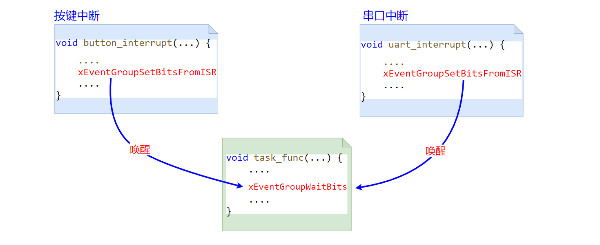

<center>
本文演示使用event group 来替代二值信号量，在任务和任务间，以及中断服务函数和任务间进行事件同步。
</center>

<!--more-->

***
使用 `event group`需要在工程中添加源文件`event_groups.c`，并引用头文件`#include "event_groups.h" `。


#### 1 使用event group 在任务间同步事件
使用 `event group` 需要先创建：
```c
EventGroupHandle_t xEventGroupCreate( void );
```
创建成功时，该API 会返回一个用来标识该 `event group`的句柄。

当某个事件发生时，需要设置`event group`中表示该事件的对应位：
```c
EventBits_t xEventGroupSetBits( EventGroupHandle_t xEventGroup, const EventBits_t uxBitsToSet );
```
- xEventGroup：xEventGroupCreate 的返回值，用来标识某个`event group`的句柄
- uxBitsToSet：设置`event group`中的某些位，开发者定义每个位表示的对应事件。 32位处理器中，`event group`只有低24位可用，高8位是一些控制标记，`event group`内部使用的。


当任务需要等待某个事件发生时，就是等待 `event group`中表示该事件的位被置位：
```c
EventBits_t xEventGroupWaitBits(const EventGroupHandle_t xEventGroup,
                                const EventBits_t uxBitsToWaitFor,
                                const BaseType_t xClearOnExit,
                                const BaseType_t xWaitForAllBits,
                                TickType_t xTicksToWait );
```
- xEventGroup：xEventGroupCreate 的返回值，用来标识某个`event group`的句柄
- uxBitsToWaitFor：等待`event group`中的某些位被置位，开发者定义每个位表示的对应事件。
- xClearOnExit：pdTRUE或pdFALSE。该值用来设置，当任务所等待的条件满足后（期望的事件发生了），该函数返回时，是否自动清除`event group` 中 uxBitsToWaitFor 所表示的那些位。设置为pdTRUE，表示自动清除，当任务进入阻塞态，等待一些事件发生（等待`event group`中的某些位被置位），当事件发生后，任务恢复就绪态，同时自动清零`event group`中事件所对应的位（类似于一些硬件中断发生后，需要主动清除硬件中断标记，避免重复触发的场景）
- xWaitAllBits：设置为pdTRUE，表示要所有事件均发生（uxBitsToWaitFor中设置的那些位所表示的事件）。设置为pdFALSE，表示任意一个事件发生，即满足条件。
- 返回值：返回`event group`的值，当我们是等待多个事件中的任意一个发生时，就可以根据该值来判断是哪个事件发生了（参考后文在中断和任务间同步事件的代码）。注意，返值不受参数xClearOnExit 的影响，如果xClearOnExit=pdTRUE，返回的值是自动清除操作执行前的值。


为了演示，使用`event group`在任务间同步事件，我们创建 3 个任务，`task_a`、`task_b`和`task_c`。 
`task_b`和`task_c`每次执行工作前都需要先等待“事件”（`task_a`做完一些工作），“事件”未发生时，`task_b`和`task_c`就会阻塞。只有当`task_a`做完一些工作，设置“事件”，通知`task_b`和`task_c`可以运行了。`task_b`和`task_c`才能继续运行。

其逻辑如下所示：
 ```C
TASK_A:
    while 1:
        do something    // 执行工作
        set event       // 工作完成了，设置事件，通知 b,c 开始工作

TASK_B:
    while 1:
        wait event      // 等待任务A工作完成 并设置事件
        do something

TASK_C:
    while 1:
        wait event      // 等待任务A工作完成 并设置事件
        do something
```

任务代码如下： task_b和task_c 可以共用一个任务函数，这里为了直观，每个任务单独写了一个。
```c
// 使用第 0 位来表示事件：task_a工作执行完
#define TASK_DONE_FLAG ( 1 << 0 )    

void task_a( void *pvParameters ) {

    EventGroupHandle_t eg = (EventGroupHandle_t)pvParameters;
    for(;;) {
        
        // 延迟1秒，模拟 task_a 在处理一些工作
        vTaskDelay(pdMS_TO_TICKS(1000));
        
        SEGGER_RTT_printf(0, "task_a done!\n");

        // 工作做完了，设置事件对应的位，通知task_b，task_c 可以运行了
        xEventGroupSetBits(eg, TASK_DONE_FLAG);
    }
}


void task_b( void *pvParameters ) {
    
    EventGroupHandle_t eg = (EventGroupHandle_t)pvParameters;
    for(;;) {
        
        // 这里等待事件（task_a完成工作），如果task_a 还未设置这个信号量，
        // task_b 就会阻塞在该函数内部，直到task_a设置信号量，或者等待超过2秒
        EventBits_t ret = xEventGroupWaitBits(eg, TASK_DONE_FLAG, pdTRUE, pdTRUE, pdMS_TO_TICKS(2000));
        if (ret & TASK_DONE_FLAG) {
            SEGGER_RTT_printf(0, "task_b start runing!\n");
            SEGGER_RTT_printf(0, "task_b done!\n");
        }
    }
}

void task_c( void *pvParameters ) {
    
    EventGroupHandle_t eg = (EventGroupHandle_t)pvParameters;
    for(;;) {
        
        // 这里等待事件（task_a完成工作），如果task_a 还未设置这个信号量，
        // task_c 就会阻塞在该函数内部，直到task_a设置信号量，或者等待超过2秒
        EventBits_t ret = xEventGroupWaitBits(eg, TASK_DONE_FLAG, pdTRUE, pdTRUE, pdMS_TO_TICKS(2000));
        if (ret & TASK_DONE_FLAG) {
            SEGGER_RTT_printf(0, "task_c start runing!\n");
            SEGGER_RTT_printf(0, "task_c done!\n");
        }
    }
}
```
ps：代码中，`task_b`和`task_c`调用xEventGroupWaitBits 等待事件时，均设置了自动清除 xClearOnExit=pdTRUE。这不会有影响（即`task_b`的清除不会导致`task_c`判断不到事件发生了），因为 `event group`是遍历所有等待事件的任务，依次检查每个任务是否由于发生了某个事件，使得等待条件满足了，满足了就会恢复就绪态。所有任务遍历完后才会清除相应位。

main 函数实现如下：
```c
// 使用event group 在任务间同步事件
int main(void) {

    EventGroupHandle_t eg = xEventGroupCreate();

    if(NULL != eg) {
        
        if (pdPASS == xTaskCreate(task_a, "task_a", 100, eg, 1, NULL)
            && pdPASS == xTaskCreate(task_b, "task_b", 100, eg, 1, NULL)
            && pdPASS == xTaskCreate(task_c, "task_c", 100, eg, 1, NULL)){
            
            SEGGER_RTT_printf(0, "start FreeRTOS\n");
            vTaskStartScheduler();
        } 

    }
    // 正常启动后不会运行到这里
    SEGGER_RTT_printf(0, "insufficient resource\n");

    for( ;; );
    return 0;    
}
```

运行结果如下：task_b、task_c每次等待task_a运行后才能运行。 并且每次task_a运行完，设置事件后，task_b、task_c都能收到事件，恢复就绪态并运行。这也体现了 `event group`的广播特性（区别于信号量每次只会让优先级最高的那个任务获恢复就绪）。
```
start FreeRTOS
task_a done!
task_b start runing!
task_b done!
task_c start runing!
task_c done!
task_a done!
task_b start runing!
task_b done!
task_c start runing!
task_c done!
```

#### 2 使用event group 在中断和任务间同步事件

任务等待某个硬件相关的中断事件，是非常常见的应用场景。如任务等待按键事件，等待串口接收数据事件等。这里我们使用 `event group`来替代二值信号量，在中断服务函数和任务间同步事件。

我们创建一个任务，该任务等待按键事件和串口接收数据事件，任意一个事件发生都可以唤醒任务。因此，我们需要在按键中断处理函数/串口中断处理函数中调用设置事件API，即`xEventGroupSetBits`的中断版本（带FromISR后缀）：
```c
BaseType_t xEventGroupSetBitsFromISR( EventGroupHandle_t xEventGroup,
                                    const EventBits_t uxBitsToSet,
                                    BaseType_t *pxHigherPriorityTaskWoken );
```
- xEventGroup：创建api: xEventGroupCreate 返回的，用来标识某个`event group`的句柄
- uxBitsToSet：设置`event group`中的某些位，开发者定义每个位表示的对应事件。 32位处理器中，`event group`只有低24位可用，高8位是一些控制标记，模块内部使用的。
- pxHigherPriorityTaskWoken：该值的作用见后文代码中的注释。

程序逻辑如下图所示：


**注意**：在文章[FreeRTOS-event groups 实现原理](https://fengxun2017.github.io/2023/01/13/FreeRTOS-event-group/)的最后，我们提到过，当我们在中断服务函数中调用`xEventGroupSetBitsFromISR`来设置发生了某个事件时，实际的工作（设置event group相应位，遍历所有等待事件的任务查看是否有任务的等待条件满足了）会通过[延后执行机制](https://fengxun2017.github.io/2022/12/01/FreeRTOS-deferring-work/)推迟到退出中断以后再执行。而内核提供的[延后执行机制](https://fengxun2017.github.io/2022/12/01/FreeRTOS-deferring-work/)依赖[软件定时器服务任务](https://fengxun2017.github.io/2022/11/27/FreeRTOS-principle_of_timer/)以及一些配置宏。所以，为了使用 API：`xEventGroupSetBitsFromISR`，需要在工程配置文件`FreeRTOSConfig.h`中添加如下配置：
```c
#define configUSE_TIMERS                1
#define INCLUDE_xTimerPendFunctionCall  1
```
  

具体的任务和中断服务代码如下：
```c

// 第 0 位对应串口接收数据事件
#define UART_RECV_DATA  (1 << 0)
// 第 1 位对应按键事件
#define BUTTON_PRESSED  (1 << 1)

// 定义一个全局的event group句柄变量
EventGroupHandle_t eg;


// 串口中断接收部分处理，与具体硬件平台相关
// 将 xEventGroupSetBitsFromISR 添加到自己硬件中断处理函数中即可
void UARTE0_UART0_IRQHandler(void) {
    BaseType_t higher_task_woken = pdFALSE;

    if (NRF_UART0->EVENTS_RXDRDY != 0){
        /// 我的硬件平台上，需要清0事件标志
        NRF_UART0->EVENTS_RXDRDY = 0;
        uint8_t data = (uint8_t)NRF_UART0->RXD;

        SEGGER_RTT_printf(0, "uart interrupt\n");
        // 设置串口接收数据事件
        xEventGroupSetBitsFromISR(eg, UART_RECV_DATA, &higher_task_woken);
    }
    // 如果higher_task_woken=True，表示设置事件操作，使得另一个等待该事件发生的更高优先级任务变为就绪了
    // 我们使用的是抢占式调度，只要有更高优先级的任务就绪，应该让其立刻运行。
    // 下面的代码就是，判断有更高优先级就绪时，就会设置任务切换中断，那么当前中断函数退出后，就会立刻触发任务切换，让最高优先级的就绪任务运行。
    portYIELD_FROM_ISR(higher_task_woken);
}

// 按键中断接收部分处理，与具体硬件平台相关
// 将 xEventGroupSetBitsFromISR 添加到自己硬件中断处理函数中即可
void GPIOTE_IRQHandler(void) {

    BaseType_t higher_task_woken = pdFALSE;
    if ( NRF_GPIOTE->EVENTS_PORT == 1 ){

        // 我的硬件平台上，中断处理函数中要清除event,不然会导致一直产生中断
        NRF_GPIOTE->EVENTS_PORT = 0;    

        if(IS_BUTTON_PRESSED(BUTTON_1)) {
            SEGGER_RTT_printf(0, "button interrupt\n");
            // 设置按键事件
            xEventGroupSetBitsFromISR(eg, BUTTON_PRESSED, &higher_task_woken);
        }
    }

    // 如果higher_task_woken=True，表示设置事件操作，使得另一个等待该事件发生的更高优先级任务变为就绪了
    // 我们使用的是抢占式调度，只要有更高优先级的任务就绪，应该让其立刻运行。
    // 下面的代码就是，判断有更高优先级就绪时，就会设置任务切换中断，那么当前中断函数退出后，就会立刻触发任务切换，让最高优先级的就绪任务运行。
    portYIELD_FROM_ISR(higher_task_woken);
}


// 任务函数
void task_func( void *pvParameters ) {
    
    EventGroupHandle_t eg = (EventGroupHandle_t)pvParameters;
    for(;;) {
        
        // 这里等待按键事件或者串口接收数据事件
        EventBits_t ret = xEventGroupWaitBits(eg, UART_RECV_DATA|BUTTON_PRESSED, pdTRUE, pdFALSE, portMAX_DELAY);
        
        // 根据返回值判断发生的事件
        if (ret & UART_RECV_DATA) {
            SEGGER_RTT_printf(0, "event: received uart data\n");
        } 
        if (ret & BUTTON_PRESSED) {
            SEGGER_RTT_printf(0, "event: button pressed\n");
        }
    }
}
```


main函数代码：
```c
// 使用event group 在中断服务函数和任务间同步事件
int main(void) {

    // 硬件相关初始化
    bsp_init();

    // 创建一个event group
    eg = xEventGroupCreate();
    if(NULL != eg) {
        
        if (pdPASS == xTaskCreate(task_func, "task_func", 100, eg, 1, NULL)){
            
            SEGGER_RTT_printf(0, "start FreeRTOS\n");
            vTaskStartScheduler();
        } 
    }
    // 正常启动后不会运行到这里
    SEGGER_RTT_printf(0, "insufficient resource\n");

    for( ;; );
    return 0;    
}

```

输出如下所示：
```
start FreeRTOS
button interrupt            # 按键触发中断
event: button pressed       # 按键事件使得任务恢复运行
uart interrupt              # 串口接收到数据触发中断
event: received uart data   # 串口接收数据事件使得任务恢复运行
```


<br/>
ps：需要注意文章代码中的日志输出函数，产品代码中如果需要使用的话，需要考虑线程安全性（多任务安全性），因为中断/任务切换可能发生在另一个任务正在输出日志但还未输出完的时候，这就可能造成日志错乱

<br/>
<br/>
FreeRTOS交流QQ群-663806972