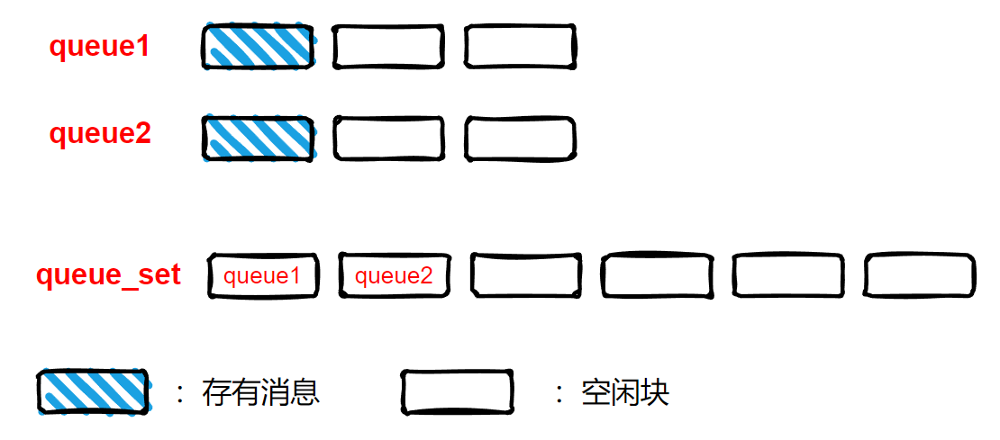
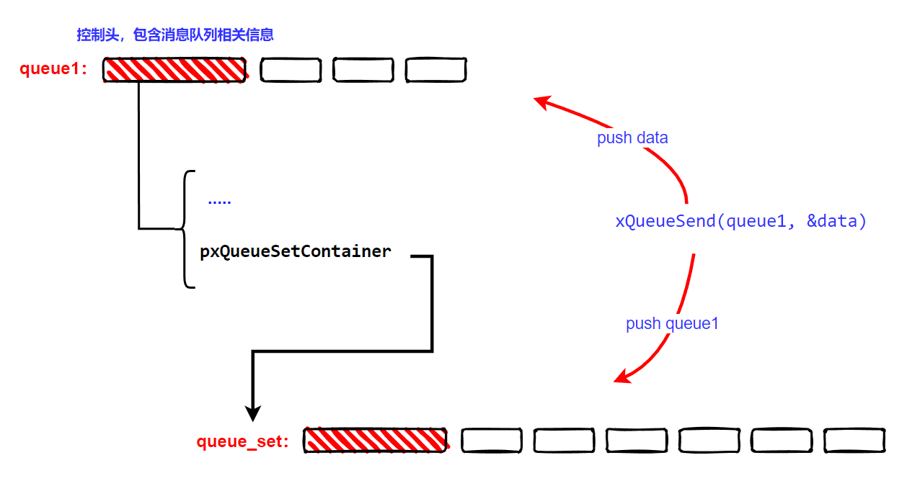

<center>

FreeRTOS的消息队列模块，不仅提供了通用的消息队列功能，而且还提供了`消息队列集合`功能。对于需要从多个消息队列中获取数据的场景，FreeRTOS提供的消息队列集合功能，简化了等待多个消息队列有数据的代码编写方式。

</center>

<!--more-->

***
关于FreeRTOS消息队列内部的一些实现细节，可以参考[FreeRTOS-消息队列内部细节](https://fengxun2017.github.io/2022/12/08/FreeRTOS-queue-internal-details/)
普通消息队列的使用，可以参考[FreeRTOS-使用消息队列](https://fengxun2017.github.io/2022/12/12/FreeRTOS-use-queue/)

考虑在某个场景下，我们必须要创建多个消息队列，并且从这多个消息队列中获取数据。使用普通消息队列提供的API 时，我们得不停地在多个消息队列之间进行轮训，以查看哪个消息队列有数据了，但轮训方式必然效率低下。
而`消息队列集合`则可以高效的处理这种问题，我们只需要将 `所有需要等待数据的消息队列`，都添加到一个消息队列集合中，之后等待这个消息队列集合即可。没有数据时，等待消息的任务不占用CPU时间，一但`消息队列集合`中的任何一个`消息队列`接收到消息了，任务就会结束等待，并可以从消息队列集合中提取到 接收到消息的`消息队列的句柄`，之后只要使用该句柄从对应的消息队列中提取实际消息即可。

FreeRTOS的`消息队列集合`，其本质也是一个消息队列。不同的是，一般的消息队列中存放的是消息，而`消息队列集合`中存放的是 `消息队列句柄`，用来通知某个消息队列有数据了。
如下图所示，假设消息队列 `queue1`和`queueu2`都被“关联到”到消息队列集合`queue_set`中了。之后，消息队列`queue1`和`queueu2`均接收到一条消息，此时，消息队列集合`queue_set`中就会被推送两个消息（两个消息分别为`queue1`和`queueu2`的句柄），表示该消息队列集合中存在消息队列接收到消息了。我们从消息队列集合`queue_set`中提取出接收到消息的 消息队列句柄，根据该句柄就可以到对应消息队列中获取消息了。


因此，`消息队列集合`的使用可以总结为三步:
- 创建一个消息队列集合
- 将需要等待消息的 消息队列 均关联到创建的消息队列集合上
- 等待消息队列集合有消息。一有消息，则可以从中提取到实际接收到消息的 消息队列 的句柄。利用该句柄，再到实际消息队列中提取消息。

<br/>

使用`消息队列集合`，需要在工程配置文件`FreeRTOSConfig.h`中添加如下配置：
```c
#define configUSE_QUEUE_SETS		1
```

创建消息队列集合的API为：
```c
QueueSetHandle_t xQueueCreateSet( const UBaseType_t uxEventQueueLength );
```
- uxEventQueueLength：该值应该为添加到消息队列集合中的 消息队列的大小的总和。如前文图片中`queue1`和`queue2`的大小均为3，则`queue_set`需要设置为6。因为queue_set中保存的消息是接收到消息的那个消息队列的句柄，每收到一个消息，消息队列集合中都会被推送对应收到消息的消息队列句柄，所以为了保存所有接收事件，需要将消息队列集合的大小设置为其所包含的所有消息队列的大小之和（注意，消息队列的大小，指的是包含“消息”的数量，并不是实际所占内存大小，消息队列集合由于存的“消息”是消息队列句柄，即一个指针，因此实际消息存储所占大小应该是uxEventQueueLength*4 ）。

- 返回值：`消息队列集合`句柄，用来唯一识别创建的这个消息队列集合。如果堆内存资源不够，则返回NULL。

`消息队列集合`创建成功后，需要将那些需要同时等待的消息队列“添加到”这个消息队列集合中，API为：

```c
BaseType_t xQueueAddToSet( QueueSetMemberHandle_t xQueueOrSemaphore,
                            QueueSetHandle_t xQueueSet );
```
- xQueueOrSemaphore：要添加到消息队列集合中的消息队列句柄。（从名字可看到，信号量也可以添加到消息队列集合中，因为FreeRTOS的信号量就是使用消息队列来实现的，本文不涉及信号量。）
- xQueueSet：消息队列集合句柄，即`xQueueCreateSet`函数的返回值。


添加完成之后，使用监听API，消息队列集合中的任何一个消息队列收到消息时，我们都能收到事件通知：
```c
QueueSetMemberHandle_t xQueueSelectFromSet( QueueSetHandle_t xQueueSet,
                                            const TickType_t xTicksToWait );
```
- xQueueSet：消息队列集合句柄。
- xTicksToWait：监听等待的时间，应该使用`pdMS_TO_TICKS(ms)`将时间转换成内核可以识别的tick数。
- 返回值：即收到消息的消息队列句柄。为NULL表示超时了，没有收到消息。

[FreeRTOS-消息队列内部细节](https://fengxun2017.github.io/2022/12/08/FreeRTOS-queue-internal-details/)一文中，我们介绍了消息队列的内部实现细节。上文提到，消息队列集合，实际也是一个消息队列，只是这个队列中存放的是那些接收到消息的`消息队列句柄`。即`消息队列集合`中的任意一个`消息队列`收到消息时，内核都会推送收到消息的这个`消息队列句柄`到消息队列集合中，如下图所示：


当调用`xQueueAddToSet( queue1, queue_set )`将消息队列`queue1`加入到消息队列集合`queue_set`中，实际是让消息队列`queue1`控制信息中的`pxQueueSetContainer`成员指向了消息队列集合`queue_set`。
之后，其它任务调用`xQueueSend(queue1, &data)`向消息队列`queue1`中发送数据时，函数内部实际是做了两件事：一是向消息队列`queue1`中推送数据，此外，还将消息队列`queue1`的句柄发送到了消息队列集合`queue_set`中（消息队列集合本身也是消息队列）。因此，调用`xQueueSelectFromSet`监听消息队列集合的任务，就可以在任意消息队列收到消息后收到通知，并根据通知（那个收到消息的消息队列句柄），去对应消息队列中获取消息。

我们以一个示例程序，演示`消息队列集合`API 的使用。
我们创建两个发送任务`sender1`和`sender2`，以及两个消息队列`queue1`和`queue2`。`sender1`向消息队列`queue1`中发送消息，`sender2`向消息队列`queue2`中发送消息。
消息队列`queue1`和`queue2`，均添加在消息队列集合`queue_set`中。
再创建一个接收任务`receiver`，该任务监听`queue_set`，一有事件，则提取出消息队列句柄，再从对应的消息队列中获取数据。

main函数代码：
```c
struct MyData {
    int cmd_id;
    int other;
};

QueueHandle_t queue1;
QueueHandle_t queue2;


int main(void) {

    bsp_init();
    BACKLIGHT_ON();

    // 创建两个消息队列
    queue1  = xQueueCreate(5, sizeof(struct MyData));
    queue2  = xQueueCreate(5, sizeof(struct MyData));

    // 创建消息队列集合，大小应该是其中所包含消息队列的大小总和
    QueueSetHandle_t queue_set = xQueueCreateSet(5+5);

    if(NULL != queue1 && NULL != queue2 && NULL != queue_set) {
        // 将两个消息队列，“添加到”消息队列集合中
        xQueueAddToSet( queue1, queue_set );
        xQueueAddToSet( queue2, queue_set );

        // 创建发送和接收任务
        if (pdPASS == xTaskCreate(sender1_task, "sender1_task", 100, queue1, 1, NULL)
         && pdPASS == xTaskCreate(sender2_task, "sender2_task", 100, queue2, 1, NULL)
         && pdPASS == xTaskCreate(receiver_task, "receiver_task", 100, queue_set, 1, NULL)) {
            
            SEGGER_RTT_printf(0, "start FreeRTOS\n");
            vTaskStartScheduler();
        } 
    }

    // 正常启动后不会运行到这里
    SEGGER_RTT_printf(0, "something wrong\n");

    for( ;; );
    return 0;    
}

```

发送任务的代码：
```c
void sender1_task( void *pvParameters ) {
    QueueHandle_t queue1 = (QueueHandle_t)pvParameters;
    
    struct MyData data;
    data.cmd_id = 0;
    data.other = 0;
    for(;;) {
        xQueueSend(queue1, &data, 0);
        vTaskDelay(pdMS_TO_TICKS(1000));
    }
}

void sender2_task( void *pvParameters ) {
    QueueHandle_t queue2 = (QueueHandle_t)pvParameters;
    
    struct MyData data;
    data.cmd_id = 1;
    data.other = 1;
    for(;;) {
        xQueueSend(queue2, &data, 0);
        vTaskDelay(pdMS_TO_TICKS(1000));
    }
}
```

接收任务的代码：
```c

void receiver_task( void *pvParameters ) {
    QueueSetHandle_t queue_set = (QueueSetHandle_t)pvParameters;
   
    struct MyData data;
    for(;;) {
        // 等待消息队列集合中的某个消息队列接收到消息
        QueueSetMemberHandle_t handle = xQueueSelectFromSet(queue_set, pdMS_TO_TICKS(1500));
        if( handle == queue1 ){
            // 是消息队列1 收到消息了
            xQueueReceive( queue1, &data, 0 );
            SEGGER_RTT_printf(0, "receive from queue1 cmd:%d\n", data.cmd_id);

        } else if( handle == queue2 ) {
            // 是消息队列2 收到消息了
            xQueueReceive(queue2, &data, 0 );
            SEGGER_RTT_printf(0, "receive from queue2 cmd:%d\n", data.cmd_id);

        } else if (handle == NULL) {
            SEGGER_RTT_printf(0, "timeout\n");
        }
    }
}
```

运行结果如下所示：
```
start FreeRTOS
receive from queue1 cmd:0
receive from queue2 cmd:1
receive from queue1 cmd:0
receive from queue2 cmd:1
receive from queue1 cmd:0
receive from queue2 cmd:1
receive from queue1 cmd:0
receive from queue2 cmd:1
receive from queue1 cmd:0
receive from queue2 cmd:1
....

```
<br/>

注意，上文代码仅仅是为了演示`消息队列集合`的使用方法。实际开发中，我们应该尽量避免使用多个消息队列（浪费资源）。一般情况下，使用一个更大的消息队列，并通过如下自定义数据类型中的`type`字段来区分数据的不同发送方（或区分数据的不同处理方式），发送变长数据也可以通过传递数据指针来实现：
```c
struct MyData {
    int type;
    char data[N]
    int other_data_len;
    char *other_data;

};
```

<br/>
ps：需要注意文章代码中的日志输出函数，产品代码中如果需要使用的话，需要考虑线程安全性（多任务安全性），因为中断/任务切换可能发生在另一个任务正在输出日志但还未输出完的时候，这就可能造成日志错乱

<br/>
<br/>
FreeRTOS交流QQ群-663806972

