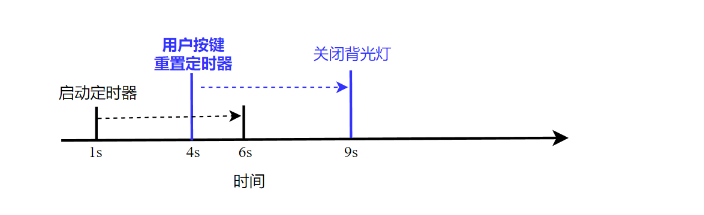
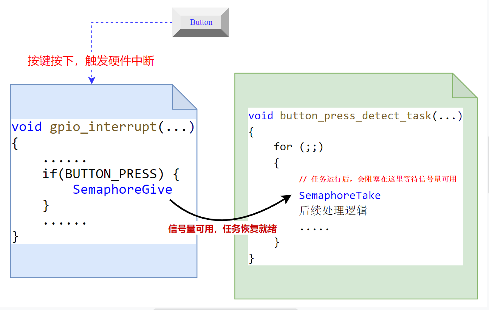

<center>
FreeRTOS提供了一个软件定时器模块，通过软件定时器，我们可以很方便的实现：让某个函数在一段时间后执行一次，或者让某个函数周期性的重复执行。
</center>
<!--more-->

***

FreeRTOS软件定时器的实现原理，可以参考：[FreeRTOS-软件定时器的实现原理](https://fengxun2017.github.io/2022/11/27/FreeRTOS-principle_of_timer/)

#### FreeRTOS 软件定时器概要
FreeRTOS的软件定时器不依赖于任何额外的硬件定时器，完全由内核通过软件来实现的。
使用FreeRTOS 的软件定时器（timer）,需要在工程中包含 `FreeRTOS/Source/timers.c`文件，并且在`FreeRTOSConfig.h`文件中定义
```c
#define configUSE_TIMERS				1
```
FreeRTOS 为了实现软件定时器功能，在内核调度器启动时，会自动创建（当定义了configUSE_TIMERS = 1 时） 定时器服务任务 **TimerTask**，该任务常驻于内核中，并实际负责处理所有与软件定时器相关的工作。

当我们调用定时器相关的 API （例如，如启动定时器）时，实际是通过消息队列，发送了特定的消息（要起启动的定时器句柄+START命令打包成消息）给**TimerTask**任务，**TimerTask**任务根据发送过来的 定时器句柄（软件定时器可以创建多个，软件定时器模块内部通过句柄来识别特定定时器）和命令执行相应的动作。 

如下图所示：在自定义任务app_task中，使用软件定时器 API `xTimerCreate`创建一个软件定时器，该函数会返回一个**用来识别当前创建的这个定时器的句柄 timer_A**，当我们调用 `xTimerStart` 启动定时器 **timer_A**时，函数内部实际是将**START命令** 和 **定时器句柄timer_A**封装成一个消息体，并放入软件定时器模块专用的**消息队列**中，而**定时器服务 任务TimerTask**则从该消息队列中提取消息，并根据消息中的命令执行相应的动作。


也就是说，与软件定时器相关的还有一个**定时器服务任务**，该任务实际执行软件定时器相关工作；一个软件定时器模块专用的**消息队列**，该消息队列用来存储定时器相关命令。因此，我们还需要如下相关的配置：
```c

#define configTIMER_TASK_PRIORITY		( 2 )
#define configTIMER_QUEUE_LENGTH		10
#define configTIMER_TASK_STACK_DEPTH	( configMINIMAL_STACK_SIZE * 2 )
```

**configTIMER_TASK_PRIORITY：**
 - 用来配置定时器服务任务的优先级，一般将其设置的比 idle任务（内核自动创建的任务，可以参考[idle hook中相关的描述](https://fengxun2017.github.io/2022/11/14/FreeRTOS-kernal-hook/#2-1%EF%BC%9AIdle-Hook-Function)） 的优先级大。 
 - 定时器启动后，当设置的时间到期后，会执行创建定时器时配置的**回调函数**，**该回调函数是在 定时器服务任务TimerTask中被调用的**。
 - 因此，如果你的系统中，存在一个比定时器服务任务 优先级更高的 任务A，并且任务A保持一直运行，不进入阻塞态，那么定时器服务任务 就得不到运行（任务A优先级更高，内核总是运行就绪的最高优先级的任务）。这种情况下，即使你启动的 某个定时器时间超时了，相应的超时回调函数也不会执行（定时器服务任务都得不到机会运行，所以无法执行回调函数）。

**configTIMER_TASK_STACK_DEPTH：**
- 内核在创建定时器服务任务时，不仅需要设置该任务的优先级，还需要设置 该任务的**任务栈大小**，如果你的 定时器的回调函数中都不会有较大的临时数组，那么默认配置的大小都是够的。否则，就需要根据实际情况来设置一个更大的值。具体可以参考[FreeRTOS如何确定任务栈的大小](configTIMER_TASK_STACK_DEPTH)以及[任务栈溢出检测](https://fengxun2017.github.io/2022/11/14/FreeRTOS-kernal-hook/#2-4-Stack-Overflow-Hook-Function)
  
**configTIMER_QUEUE_LENGTH：**
 - 定时器服务任务 使用的专用消息队列的大小，表示可以同时存在的消息个数。 
 - **该消息队列中的消息都有由 定时器服务任务TimerTask 来消费**。
 - 因此，如果系统中存在多个**更高优先级的任务**，并且都执行了 定时器相关API，那么命令发送到 消息队列中后是不会被立刻消费掉的（定时器服务任务优先级低，还未得到运行，则无法消费刚放进来的消息），因此就会缓存在消息队列中。 所以，这里配置的大小就是在上述场景出现时，消息队列可以缓存的最大消息个数（命令个数）。 
 - 所以该值需要根据你的系统情况来设置，如果存在多个更高优先级的任务，会频繁调用 定时器相关API，那么就需要考虑设置的更大。


#### FreeRTOS 软件定时器使用介绍

使用软件定时器，需要先创建出一个软件定时器实例，并将该实例和一个要延后执行（或周期执行）的函数进行绑定。

FreeRTOS 创建一个 软件定时器的 API如下：
```c
        TimerHandle_t xTimerCreate( const char * const pcTimerName, 
                                    const TickType_t xTimerPeriodInTicks,
                                    const UBaseType_t uxAutoReload,
                                    void * const pvTimerID,
                                    TimerCallbackFunction_t pxCallbackFunction )
```
- pcTimerName：创建的软件定时器名字，可以方便调试的时候识别 不同的定时器。定时器创建成功后，可以使用`const char * pcTimerGetName( TimerHandle_t xTimer )`从定时器句柄中提取创建时设置的名字。

- xTimerPeriodInTicks：定时器启动后多久到期，需要使用 宏**pdMS_TO_TICKS**将时间转换成内核可以识别的tick个数，例如 1秒钟：pdMS_TO_TICKS(1000)
- uxAutoReload：是否是周期定时器，传入**pdTRUE**则为周期定时器，定时器到期后会自动重新计时；传入pdFALSE，则只执行一次。例如，使用周期定时器实现周期为 1s 为翻转LED灯功能。
- pvTimerID：该值是用户使用的，可以理解成 与这个创建的软件定时器关联的一个参数。创建的时候可以设置成任意的值，当你再想用这个值时，使用`void *pvTimerGetTimerID( TimerHandle_t xTimer )` API 就能提取出来。
- pxCallbackFunction：定时器启动后，到达超时时间后执行的回调函数，该函数的原型必须为：`void ATimerCallback( TimerHandle_t xTimer )`。例如，当你创建的定时器A ，启动后到达了超时时间，定时器服务任务就会执行创建定时器时设置的这个回调函数，并将定时器A 作为参数传进去。

- **返回值：** 如果由于堆内存不足（使用该api时，是由内核负责在api内部，动态申请定时器控制结构所需的内存），创建失败了就会返回 **NULL**。否则，返回的就是用来识别该定时器的句柄（handle）。

定时创建成功后，并没有实际启动，需要主动调用 start 函数后，定时器才开始实际倒计时：
```c
BaseType_t xTimerStart( TimerHandle_t xTimer, TickType_t xTicksToWait );
```
- xTimer：即上文创建定时器API 返回的定时器句柄，用来唯一识别一个定时器。

- xTicksToWait：命令发送到消息队列的最长等待时间。上文提到，定时器相关操作API是向**定时器服务任务专用消息队列**中发送操作命令，`xTimerStart`这个函数实际是个宏定义：
    ```c
    #define xTimerStart( xTimer, xTicksToWait ) \
    xTimerGenericCommand( ( xTimer ), tmrCOMMAND_START, ( xTaskGetTickCount() ), NULL, ( xTicksToWait ) )
    ```
   `xTimerGenericCommand`函数内部实现，就是将命令和定时器xTimer打包成一个消息体，并发送给消息队列。但如果当前消息队列满了（上文提到的很多高优先级任务频繁调用定时器API的场景），那么这个发送消息操作就会让当前任务阻塞，以等待消息队列有空闲位置可以放下当前这个消息。这个等待消息队列有空闲位置的时间就是由`xTicksToWait`决定的。时间数值同样也应该通过宏`pdMS_TO_TICKS()`转换成内核可以识别的tick数值。
- **返回值：** 命令消息体成功发送到消息队列中则返回**pdPASS**。否则，就是等待了`xTicksToWait`设置的时间，但消息队列仍旧没有空闲位置可以放 命令消息体，此时就会超时返回**pdFALSE**。

##### 周期定时器使用样例：
基于 `xTimerCreate`和`xTimerStart`，我们实现一个周期定时器的样例程序：创建两个定时器，实现让两个 LED 灯以不同的频率闪烁。
```c
#include <stdint.h>
#include "SEGGER_RTT.h"
#include "FreeRTOS.h"
#include "timers.h"
#include "task.h"

#define LED_1   (13)
#define LED_2   (14)


int main(void) {

    TimerHandle_t led1_flash_timer = NULL;
    TimerHandle_t led2_flash_timer = NULL;

    // led1 以500ms 周期闪烁
    TickType_t led1_flash_period = pdMS_TO_TICKS(500);
    // led2 以 1000ms 周期闪烁
    TickType_t led2_flash_period = pdMS_TO_TICKS(1000);

    // 硬件相关初始化，替换成自己的
    bsp_init();

    // 用来反转led灯的 定时器1
    led1_flash_timer = xTimerCreate("LED_1 Timer",      // 定时器名字
                                    led1_flash_period,  // 定时器超时时间为500ms
                                    pdTRUE,             // 为true，表示定时器超时后，会自动重新开始计时。
                                    (void *)LED_1,      // pvTimerID，根据自己的需要使用，这里将其设置成关联的 led 引脚编号。 
                                     led_flash);        // 定时器到期后执行的回调函数 
    
    led2_flash_timer = xTimerCreate("LED_2 Timer", led2_flash_period, pdTRUE, (void *)LED_2, led_flash);

    // 启动定时器。当前定时器模块专用消息队列是空的，命令肯定能发送成功，超时参数设置为0即可
    xTimerStart(led1_flash_timer, 0);
    xTimerStart(led2_flash_timer, 0);

    // 启动内核调度，内核启动调度后，定时器服务才能得到运行，定时器功能才能正常运转。
    vTaskStartScheduler();
    
    // 正常启动后不会运行到这里
    for( ;; );
    return 0;    
}
```
上述代码创建的两个定时器，使用了相同的回调函数`led_flash`，所以我们通过参数 `pvTimerID` 来识别需要操作的**LED**。
```c
// 定时器超时后，内核就会调用该回调函数，并将超时的 定时器作为参数传入。
void led_flash( TimerHandle_t timer ) {
    // 通过GetName 获取超时的这个定时器，在创建时设置的名字，方便调试
    const char *name = pcTimerGetName(timer);
    
    // 获取创建定时器时，设置的pvTimerID，这里是用该值来识别需要操作的硬件引脚
    uint32_t led_id = (uint32_t)pvTimerGetTimerID(timer);

    SEGGER_RTT_printf(0, "%s timeout\n", name);
    // 翻转 led 灯
    LED_TOGGLE(led_id);
}
```
<br/>

##### 重置定时器使用样例：
FreeRTOS官网介绍了一个比较典型的，需要使用重置定时器的例子。
对于嵌入式设备来说，往往需要考虑功耗问题。例如一个带有 LCD的设备，一般都是在用户操作时，才亮起LCD背光灯，当用户一段时间不操作时就会自动熄灭背光等，从而节省功耗。例如，当用户持续5s都没有操作，就关闭LCD的背光灯。该功能可以通过定时器来实现，创建一个5s超时的定时器，每当用户操作时，则重置定时器让其重新开始计时，只有用户持续5s都没操作时，定时器才会超时，并触发关闭LCD背光灯的操作。

如下图所示：定时器在第 1秒时启动，此时超时会在第 6秒发生，但第 4秒时，用户按下了设备按键（操作设备），则重置定时器，定时器开始重新计时。如果之后再没有其它操作，定时器的将在第 9秒后超时，并触发关闭LCD背光灯的操作


FreeRTOS提供的定时器重置API为:
```c
BaseType_t xTimerReset( TimerHandle_t xTimer, TickType_t xTicksToWait );
```
- xTimer：定时器句柄，用来指示要重置哪一个定时器。
- xTicksToWait：如上文所述，该API同样是将定时器句柄+reset命令 封装成一个消息体，并发送到定时器模块专用的消息队列上，如果消息队列中满了，那么就需要等待其有空闲位置，xTicksToWait即表示这种情况下愿意等待多久。

**实际上，FreeRTOS中的`xTimerStart`和`xTimerReset` 在内部实现上只是发送的命令不一样（一个start，一个reset），但在接收命令的 定时器服务任务TimerTask中，对于这两个命令的处理是完全一样的。**
<br/>

我们实现一个5秒内没有按键按下，则关闭背光灯的功能，代码样例如下：
```c
#include <stdint.h>
#include "SEGGER_RTT.h"
#include "FreeRTOS.h"
#include "timers.h"
#include "task.h"
#include "semphr.h"

// 这个例子里使用了信号量来同步按键按下事件，避免按键任务去轮训按键是否按下，浪费cpu资源
SemaphoreHandle_t semaphore = NULL;

// 背光灯关闭定时器
TimerHandle_t backlight_timer = NULL;

int main(void) {
    
    // 5000ms 没有按键按下就关闭 背光灯
    TickType_t backlight_off_time = pdMS_TO_TICKS(5000);

    // 硬件相关初始化
    bsp_init();

    //开机时应该点亮背光灯
    BACKLIGHT_ON();

    // 创建关闭背光灯 定时器，该定时器为单次定时器，如果超时就是关闭背光灯，并不需要重新开始计时。
    // 所以uxAutoReload = pdFALSE。这里也不需要参数pvTimerID，所以设置为NULL
    backlight_timer = xTimerCreate("bccklight off Timer", backlight_off_time, pdFALSE, NULL, backlight_off);
    
    // 定义一个二值信号量，用来同步按键按下事件
    semaphore = xSemaphoreCreateBinary();
    if(NULL != backlight_timer && NULL != semaphore) {
        
        // 创建一个按键任务，当有按键按下后，在这个任务中重置定时器。
        if (pdPASS == xTaskCreate(button_press_detect_task, "button_press_detect_task", 100, NULL, 1, NULL)){
            
            SEGGER_RTT_printf(0, "start FreeRTOS\n");
            
            // 启动定时器，如果开机后5s内没有按键按下，就会超时，并触发关闭背光灯的操作
            xTimerStart(backlight_timer, 0);

            // 启动内核调度
            vTaskStartScheduler();
        } 
    }

    // 正常启动后不会运行到这里
    SEGGER_RTT_printf(0, "insufficient resource\n");

    for( ;; );
    return 0;    
}

```
上面的程序主体，创建了一个超时时间为5s的定时器，初始化完成后，就会启动该定时器，如果5s内没有按键操作就会超时，并执行回调函数`backlight_off`。回调函数中实现关闭背光灯的操作，如下所示：
```c
void backlight_off( TimerHandle_t timer ) {

    const char *name = pcTimerGetName(timer);
    SEGGER_RTT_printf(0, "%s timeout\n", name);

    // 持续5s 没操作，关闭背光灯
    BACKLIGHT_OFF();
}
```
<br/>

剩下的就是按键检测任务`button_press_detect_task`，检测按键最简单的实现就是不停的轮训按键的引脚，看是否电平有变化，但是这种方式效率太低，即使没有按键时任务也要占用cpu，浪费cpu资源。这里我们使用信号量来作为按键按下通知信号，按键检测任务等待一个信号量可用，而信号量在按键中断处理程序中才会被设置，这样按键检测任务在没有按键按下时就是处于阻塞状态，并不会占用任何cpu资源。

其逻辑如下图所示：当按键按下时，触发硬件中断，硬件中断程序中检测到按键按下，则设置信号量。信号量一旦被设置，则等待该信号量的按键检测任务`button_press_detect_task`就会恢复为就绪状态，在任务被重新调度后（获得cpu），就会执行后续的处理过程。



具体的代码实现如下，按键中断处理程序需要根据自己的硬件来实现：
```c
void GPIOTE_IRQHandler(void){

    BaseType_t higher_task_woken = pdFALSE;
    if ( NRF_GPIOTE->EVENTS_PORT == 1 ){

        //中断处理函数中要清除event,不然会导致一直产生中断
        NRF_GPIOTE->EVENTS_PORT = 0;      
        if(IS_BUTTON_PRESSED(BUTTON_1)) {
            xSemaphoreGiveFromISR(semaphore, &higher_task_woken);
        }
    }
    portYIELD_FROM_ISR(higher_task_woken);
}
```

上述代码，当检测到按键按下后，设置信号量，由于是处于中断处理函数中，所以需要使用`xSemaphoreGiveFromISR` （中断环境中必须使用带FromISR后缀的API）。
此外，在中断处理程序最后使用了 `portYIELD_FROM_ISR`，这是因为我们在中断处理程序中使用`xSemaphoreGiveFromISR`设置信号量后，如果另一个优先级更高的任务（比当前运行的任务优先级高，在这里就是`button_press_detect_task`任务）在等待该信号量，那么由于信号量可用了，等待该信号量的高优先级任务（`button_press_detect_task`）就会变为就绪状态（信号量可用，使得另一个等待该信号量的更高优先级的任务变为就绪态，则`higher_task_woken`会被自动设置为`pdTRUE`）。我们使用的是抢占式调度的实时操作系统，当存在比当前任务优先级更高的任务就绪时，应该让其立刻被调度，而`portYIELD_FROM_ISR`的作用就是如果存在更高优先级任务就绪了，就会设置任务切换中断（PendSV中断），这样在中断服务程序`GPIOTE_IRQHandler`结束后，就会立刻触发任务切换，使得更高优先级的就绪任务（`button_press_detect_task`）被调度运行。

按键检测任务实现如下：
```c
void button_press_detect_task( void *pvParameters ) {
    
    for(;;) {
        // 等待信号量可用，这里使用portMAX_DELAY，表示一直阻塞任务，直到信号量可用。
        // 注意，使用portMAX_DELAY，需要在FreeRTOSConfig.h 文件中定义 INCLUDE_vTaskSuspend = 1
        xSemaphoreTake(semaphore, portMAX_DELAY);
        
        // 再次确认按键按下，作为防抖处理
        // 这里需要根据实际情况决定是否在这里再次判断按键，如果你的系统中存在多个更高优先级的任务。
        // 那么按键按下后，可能更高优先级的任务会在button_press_detect_task任务之前运行，
        // 等轮到button_press_detect_task任务运行时，可能已经过了很久（按键已经释放了），那么这里就检测不到按键了。
        if(IS_BUTTON_PRESSED(BUTTON_1)){

            // 检测到按键，打开背光灯
            BACKLIGHT_ON();
            // 每次有按键，就重置定时器，这样只有连续5s 没有操作时，才会关闭背光灯。
            xTimerReset(backlight_timer, 0);
        }
    }
}
```
<br/>

##### 更新定时器超时周期样例：
实际应用中，存在一种场景，例如设备存在一个状态指示灯，当设备在正常运转时，该指示灯以一个较低的频率闪烁；当设备出现故障时，该指示灯以一个较高的频率闪烁。FreeRTOS提供了` xTimerChangePeriod` API，来应对这种应用场景。
```c
BaseType_t xTimerChangePeriod( TimerHandle_t xTimer, 
                                TickType_t xNewTimerPeriodInTicks,
                                TickType_t xTicksToWait );
```
- xTimer: 创建定时器时返回的句柄。
- xNewTimerPeriodInTicks：定时器新的超时周期
- xTicksToWait：该API 同样是发送命令到定时器模块专用消息队列中，所以也需要这个 命令发送到消息队列的最长等待时间 参数。

<br/>

使用样例，这里就基于上面的按键例子进行修改。创建一个定时器用来反转LED的状态，并根据检测到的不同的按键按下事件，将定时器的超时周期修改成不同的值（即修改了LED的闪烁频率）

main 函数整体不变，创建定时器`led1_flash_timer`，默认周期为1s。创建按键检测任务`button_press_detect_task`。
```c
SemaphoreHandle_t semaphore = NULL;
TimerHandle_t led1_flash_timer = NULL;


int main(void) {

    TickType_t led1_flash_period = pdMS_TO_TICKS(1000);

    bsp_init();
    BACKLIGHT_ON();

    led1_flash_timer = xTimerCreate("LED_1 Timer", led1_flash_period, pdTRUE, (void *)LED_1, led_flash);
    semaphore = xSemaphoreCreateBinary();
    if(NULL != led1_flash_timer && NULL != semaphore) {
        
        if (pdPASS == xTaskCreate(button_press_detect_task, "button_press_detect_task", 100, NULL, 1, NULL)){
            
            SEGGER_RTT_printf(0, "start FreeRTOS\n");
            xTimerStart(led1_flash_timer, 0);
            vTaskStartScheduler();
        } 
    }
    // 正常启动后不会运行到这里
    SEGGER_RTT_printf(0, "insufficient resource\n");

    for( ;; );
    return 0;    
}
```
<br/>

定时器`led1_flash_timer` 的超时回调函数就是反转 LED灯状态：
```c
void led_flash( TimerHandle_t timer ) {
    const char *name = pcTimerGetName(timer);
    uint32_t led_id = (uint32_t)pvTimerGetTimerID(timer);

    SEGGER_RTT_printf(0, "%s timeout\n", name);
    nrf_gpio_pin_toggle(led_id);
}
```
<br/>

按键检测任务`button_press_detect_task`修改成检测两个按键，检测到BUTTON_1按下时，将定时器`led1_flash_timer`的周期更新为200ms，检测到BUTTON_2按下时，则将定时器`led1_flash_timer`的周期更新为2000ms。
```c

void button_press_detect_task( void *pvParameters ) {
    
    for(;;) {
        // 等待信号量可用，这里使用portMAX_DELAY，表示一直阻塞任务，直到信号量可用。
        // 注意，使用portMAX_DELAY，需要在FreeRTOSConfig.h 文件中定义 INCLUDE_vTaskSuspend = 1
        xSemaphoreTake(semaphore, portMAX_DELAY);
        
        // 再次确认按键按下，作为防抖处理
        // 这里需要根据实际情况决定是否在这里再次判断按键，如果你的系统中存在多个更高优先级的任务。
        // 那么按键按下后，可能更高优先级的任务会在button_press_detect_task任务之前运行，
        // 等轮到button_press_detect_task任务运行时，可能已经过了很久（按键已经释放了），那么这里就检测不到按键了。
        if(IS_BUTTON_PRESSED(BUTTON_1)){
            // 检测到按键，重置定时器周期
            SEGGER_RTT_printf(0, "button1 pressed\n");
            xTimerChangePeriod(led1_flash_timer, pdMS_TO_TICKS(200), 0);
        } else if (IS_BUTTON_PRESSED(BUTTON_2)) {
            SEGGER_RTT_printf(0, "button2 pressed\n");
            xTimerChangePeriod(led1_flash_timer, pdMS_TO_TICKS(2000), 0);
        }
    }
}
```
<br/>

最后的中断处理程序，也是修改成检测两个按键：
```c
void GPIOTE_IRQHandler(void){

    BaseType_t higher_task_woken = pdFALSE;
    if ( NRF_GPIOTE->EVENTS_PORT == 1 ){

        //中断处理函数中要清除event,不然会导致一直产生中断
        NRF_GPIOTE->EVENTS_PORT = 0;      
        if(IS_BUTTON_PRESSED(BUTTON_1) || IS_BUTTON_PRESSED(BUTTON_2)) {
            xSemaphoreGiveFromISR(semaphore, &higher_task_woken);
        }
    }
    portYIELD_FROM_ISR(higher_task_woken);
}
```


<br/>
ps：需要注意文章代码中的日志输出函数，产品代码中如果需要使用的话，需要考虑线程安全性（多任务安全性），因为中断/任务切换可能发生在另一个任务正在输出日志但还未输出完的时候，这就可能造成日志错乱

<br/>
<br/>
FreeRTOS交流QQ群-663806972

<br/>
<br/>


参考连接：[FreeRTOS software timers](https://www.freertos.org/RTOS-software-timer-service-daemon-task.html)