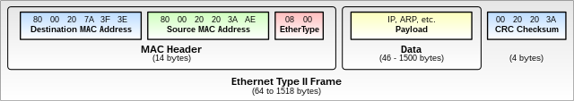
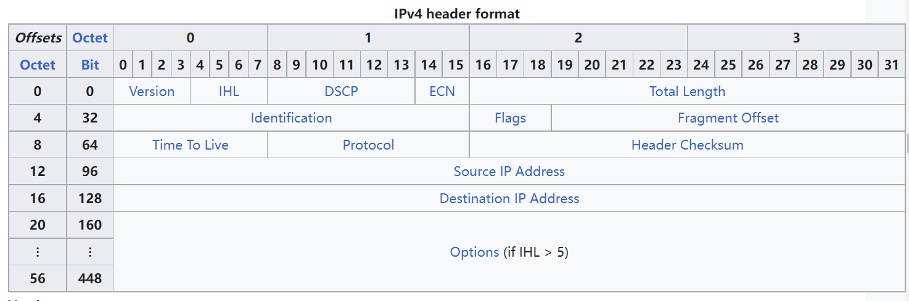
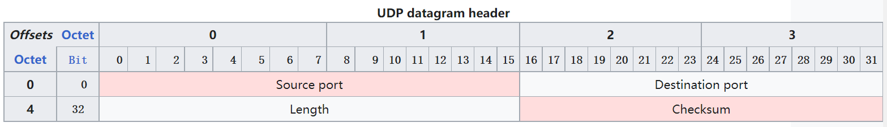
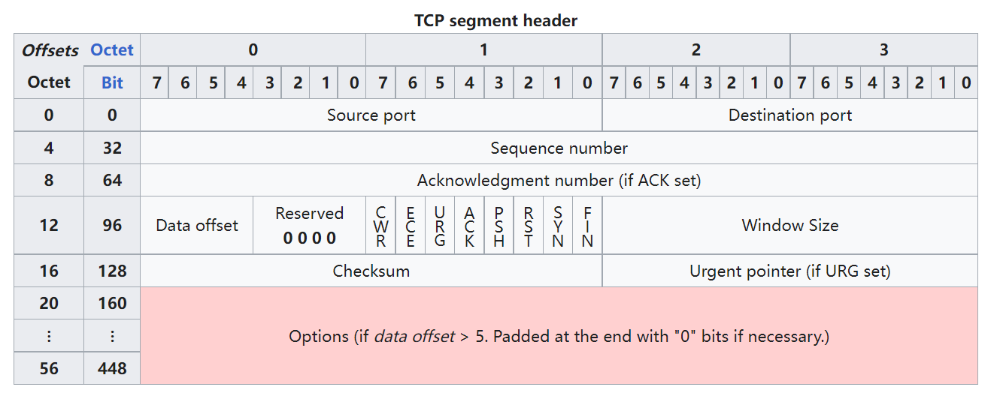

FreeRTOS-TCP/IP-相关基本概念

<!--more-->

***

**Ethernet Address**：
在同一个以太网中，通过MAC地址（media access control address，硬件地址）来识别不同的节点。MAC地址为 6 字节，由设备厂商配置。

数据以以太网帧（ethernet frames）数据格式，从本地以太网的一个节点传输到另一个节点。

图片来自 [wikipedia](https://en.wikipedia.org/wiki/Ethernet_frame)

通过目标地址指明数据接收方，源地址表明数据发送方。
ether type指明负载使用（payload）使用的具体协议。例如，0x0800表明负载数据为IP协议数据，0x0806表明负载数据为ARP协议数据。

 
 

**MTU**（Maximum Transmission Unit）：
上图以太网帧数据中，头部字段为固定的14字节，尾部校验为固定4字节。
负载数据部分长度为 46-1500 字节。 其中，46字节最小数据，是由于以太网使用的CSMA/CD中冲突检测机制的需要。 而1500最大长度，是出于发送效率和时间的平衡：负载数据长度越大，头部固定长度占的比例越小，传输效率更高。但负载数据长度越大，传输时间越长，由于共享总线，发送期间其它节点无法发送数据，可能造成其它节点数据的拥堵。
不同的硬件支持的 MTU 可能不同（可能小于1500），实际使用需要根据系统具体情况配置参数。

当上层协议数据（封包后的）长度大于链路层的 MTU 时，数据需要拆分为多个包发送。

**IP**（Internet Protocol）：
IP 协议是用于跨网络（inter-networking）通信的协议，例如互联网（Internet）。IP 网络中的节点使用 IP地址来标识自己。
IP数据包在以太网帧中传输，并且其自身可以传输TCP/UDP数据。IPV4数据头部格式：

图片来自 [wikipedia](https://en.wikipedia.org/wiki/Internet_Protocol_version_4#Header)

**IP Address**：
IP 网络中的不同节点，通过 IP地址来标识。
Static IP Address：手动配置的IP地址，设备启动时使用设定好的地址。
动态 IP地址：设备启动时，向DHCP（Dynamic Host Configuration Protocol）服务器请求 IP地址。

**ARP**（Address Resolution Protocol）：
IP数据包是基于 IP地址进行数据发送/接收的，但IP数据包最终是作为以太网帧的负载来传输的，而以太网帧是基于MAC地址在局域网节点间传输的。因此，在以太网上实际传输 IP数据包前，需要知道目的IP地址所对应的MAC地址。
地址解析协议（ARP）就用通过IP地址获得MAC地址的协议，FreeRTOS-TCP协议栈在ARP表中存储了IP地址到MAC地址的映射。

**网络掩码**（Netmask）：
网络掩码用来分割IP地址，获得网络标识和主机标识。利用网络掩码，可以获得本机所在局域网可以判别目标IP，是否在本局域网中。如果在本网络中，数据可以直接发送到目的主机，如果不在则需要通过路由器转发出去。

**网关**（Gateway）：
网关是一个网络通向另一个网络的“关口”，路由器是网关的一种。当目标IP地址不在本局域网内时，就需要将数据发送给网关，从而传送到其它网络中。

**UDP**（User Datagram Protocol）：
无连接的传输层协议，用户数据包传输协议，发送/接收数据报前，不需要建立传输层的连接。UDP协议无法确认数据包是否发送到接收端。如果需要数据的接收确认机制，需要应用层自己实现。
UDP数据报协议头：

图片来自 [wikipedia](https://en.wikipedia.org/wiki/User_Datagram_Protocol)

UDP面向报文传输，UDP不会对应用发下来的数据拆包，添加头部后交付到下一层。对于接受方，调用api获取数据时，也是一次获取一个数据报。

**TCP**（Transmission Control Protocol）:
面向连接的传输层协议，数据发送/接收之前需要建立传输层连接。TCP协议自身保证数据能准确传输到接收端。相比UDP，TCP需要额外的RAM存储，来保持已发送的数据包，直到它们被接收端确认（否则，就需要重传）。TCP头部格式：

图片来自 [wikipedia](https://en.wikipedia.org/wiki/Transmission_Control_Protocol)

TCP面向字节流，发送端一次发送的数据，接收端可能需要调用多次API才能收完（面向流）。

 
 

**UDP和TCP的比较**（来自[wikipedia](https://en.wikipedia.org/wiki/User_Datagram_Protocol)）

TCP是面向连接的传输协议，数据发送/接收前需要握手来建立端到端的连接。
- 可靠性：TCP会进行消息确认，保证消息的可靠达到。TCP协议自动管理消息的重发，超时问题。使用TCP传输的情况下，要么消息没有丢失，要么内部多次重试超时后断开连接。
- 有序：不管TCP内部如何控制传输，在应用层上，发送端先发送A后发送B，在接收端的应用层一定是先收到A再收到B。可能TCP层面上B数据先达到，但TCP协议会等待数据都按序全部接收完成以后再递交到上层。
- 重资源（Heavyweight）：TCP需要先通过三次握手建立连接之后才能收发数据。TCP需要控制数据的可靠传输，并且需要进行拥塞控制，这些措施都需要额外的资源开销。
- 字节流：数据以字节流形式读取（上层应用每次调用API获取数据时按字节流读取的，发送端应用层一次发送的数据，接收方的应用层可能需要调用多次接收API）。

UDP是基于消息的无连接传输协议，数据发送直接进行，不需要管接收者当前的状态（是否就绪）。
- 不可靠：消息被发送后，无法确认消息是否抵达接受者。没有确认机制，没有超时、重发概念。
- 不保证有序：发送端发送两个消息后，它们到达接收端的顺序没有保证。
- 轻资源（Lightweight ）：不需要维持连接，不要确认机制、拥塞控制的机制，因此相比TCP占用资源少。
- 数据报：数据有边界，接收方应用调用API接收时，是以数据报为单位来获取的。
- 广播：UDP无连接，可以广播发送的数据，数据可以被局域网上的所有设备接收。
- 支持组播。

**MSS**(Maximum Segment Size)：
最底层的以太网数据帧，一帧的可以携带的最长负载（payload）为1500字节，对于上层数据，如果大于这个长度就需要进行分包发送了。MSS就是应用数据在IP层不分包的前提下，可以传输的最大长度，即1500减去IP帧头信息长度，以及TCP/UDP帧头信息长度。
如果TCP数据长度大于MSS，那么IP需要进行分包，那么其中一包丢了就会导致TCP层需要重发完整数据。

**端口号**（Port Number）：
IP用来定位目标主机，端口号用来定位目标机器上的具体应用。

**DHCP**（Dynamic Host Control Protocol）：
节点的IP地址可以配置为静态的，例如作为一个写死的值存在Flash中，在设备启动初始化时，使用该值作为自己的IP地址。
但静态IP地址，需要给每个设置指定一个特定的地址，不灵活。
局域网中的DHCP服务器，使得新节点可以随时接入，并向DHCP服务器动态申请IP地址。

**DNS、LLMNR、NBNS**：
域名/名字解析服务，可以提供域名字符串到IP地址的映射关系。

**字节序**：
对于多字节数据（uint32_t），TCP/IP是按大端字节序发送（高位字节先发送）。但实际数据在MCU内存的存储可能是小端，也可能是大端。所以对于多字节的数据类型，发送时需要转换为网络序（大端）。

 
 

#### 参考连接：
【1】[https://en.wikipedia.org/wiki/Ethernet_frame](https://en.wikipedia.org/wiki/Ethernet_frame)
【2】[https://en.wikipedia.org/wiki/User_Datagram_Protocol](https://en.wikipedia.org/wiki/User_Datagram_Protocol)
【3】[https://en.wikipedia.org/wiki/Internet_Protocol_version_4#Header](https://en.wikipedia.org/wiki/Internet_Protocol_version_4#Header)
【4】[https://en.wikipedia.org/wiki/Transmission_Control_Protocol](https://en.wikipedia.org/wiki/Transmission_Control_Protocol)

