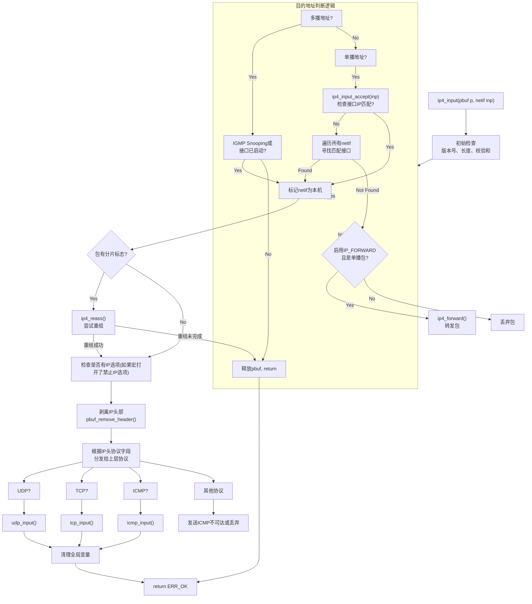
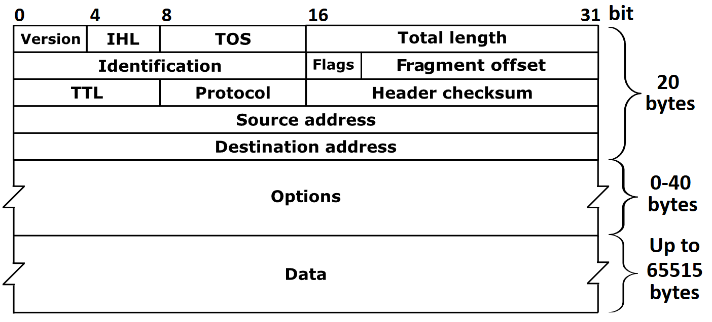

lwip ip层处理逻辑梳理（IPV4）

<!--more-->

***

ip4_input 核心处理流程如下图所示：

IPV4帧头结构：

图片源自wikipedia

- Version：表示 IP 协议的版本号。IPv4 的值是 4，IPv6 是 6。
- IHL (Header Length)：Internet Header Length，表示 IP 头部的长度，以 32 位字（4 字节）为单位。最小值是 5（即 20 字节），如果有选项字段则更长。
- Type of Service (TOS)：指定服务类型，如优先级、延迟、吞吐量等。RFC 2474 引入 DSCP（Differentiated Services），将原来的 TOS 字段重新定义为：DSCP（6 位）：用于区分服务等级，支持 QoS（服务质量）策略。ECN（2 位）：用于显式拥塞通知。
- Total Length：表示整个 IP 数据包的长度（包括头部和数据），最大值为 65535 字节。
- Identification：用于数据包分片时的标识号，接收方可以根据这个字段将分片重组为原始数据包。
- Flags：控制分片行为的标志位：
  - 第 1 位保留
  - 第 2 位 DF（Don't Fragment），表示这已是某个数据报的最后一个分段
  - 第 3 位 MF（More Fragments）,表示后面还有分段
- Fragment Offset：表示当前分片在原始数据包中的偏移位置，以 8 字节为单位。用于分片重组。
- Time to Live (TTL)：数据包在网络中可以经过的最大跳数。每经过一个路由器就减 1，减到 0 就丢弃，防止死循环。
- Protocol：指定上层协议类型，如：
  - 1 = ICMP
  - 6 = TCP
  - 17 = UDP
- Header Checksum：用于校验 IP 头部是否在传输过程中发生错误。仅校验头部，不包括数据部分。
- Source Address：数据包的源 IP 地址。
- Destination Address：数据包的目标 IP 地址。
- Options(0–40 字节): 可选字段，用于调试、路由控制等特殊用途。大多数情况下不使用。
-  Data (Payload): 实际传输的数据内容，如 TCP、UDP 报文。最大长度为 65515 字节（65535 - 20 字节头部）。 |

### 阶段 1: 初始检查和完整性验证 (Validation)

**统计与断言**:
- IP_STATS_INC(ip.recv): 增加IP包接收统计计数器。
- LWIP_ASSERT_CORE_LOCKED(): 确保核心锁已持有，保证多线程安全。
- MIB2_STATS_INC(mib2.ipinreceives): 增加MIB2标准统计信息。

**版本号检查**:
- if (IPH_V(iphdr) != 4): 检查IP版本号是否为4。如果不是，打印调试信息、释放包并增加错误计数。

**长度检查**:
- 获取首部长度: iphdr_hlen = IPH_HL_BYTES(iphdr) （IHL字段 x 4）。
- 获取总长度: iphdr_len = lwip_ntohs(IPH_LEN(iphdr))。
- 修剪 pbuf: pbuf_realloc(p, iphdr_len) 确保 p->tot_len 不大于IP包总长度，**处理可能存在的链路层填充** (半双工以太网链路层最小帧长64字节)。

**全面长度校验: 检查是否满足：**
- (iphdr_hlen >= IP_HLEN) （首部长度至少20字节）
- (iphdr_hlen <= p->len) （处理逻辑中直接将第一个pbuf的数据强转为ip帧头struct ip_hdr，因此首部必须完全在第一个pbuf内）
- (iphdr_len <= p->tot_len) （IP包总长度不能大于pbuf总长度）
- 任何一项失败都意味着包损坏，会被丢弃。

**校验和验证**: 
#if CHECKSUM_CHECK_IP: 如果使能了IP校验和检查，则计算首部校验和并与包中的值对比。如果校验失败，包被丢弃。（许多现代硬件在网卡中完成此操作，软件校验可能被禁用。）

**复制地址**:
ip_addr_copy_from_ip4(...)：将IP头中的源和目的地址（可能是非对齐的）复制到对齐的全局变量 ip_data.current_iphdr_src/dest 中，便于后续访问。
- LWIP通过使用特殊的类型定义和编译器指令（packed）来确保即使IP头中的地址非对齐，也能通过多次字节访问（而不是一次32位访问）来安全地读取它。
- 当编译器遇到一个打包结构体时，它知道访问其成员可能会遇到非对齐地址。因此，编译器会自动生成能够安全处理非对齐内存访问的代码。
- 这个拷贝是一次性的开销，目的是为了将数据从“需要特殊方式访问”的非对齐位置，移动到一个“可以常规快速访问”的对齐位置。
- 将IP地址从可能被后续处理（如分片重组）修改或释放的 pbuf 中提取出来，存入稳定的全局上下文 ip_data 中，确保其在整个处理流程中可以被高效使用。

### 阶段 2: 包的目的地判断 (Destination Decision)
这是路由决策的核心环节，用于确定这个包是否是发给本机的。

**处理多播包** (ip4_addr_ismulticast)：如果目的地址是多播地址：
- 如果使能了IGMP (LWIP_IGMP)：
  - 如果接口属于该多播组 (igmp_lookfor_group)，且目的地址为224.0.0.1，源地址为0.0.0.0，授予豁免权（check_ip_src=0），后续的检查会允许这个“非法”源地址的包通过。（这里特殊处理 224.0.0.1目的地址和 0.0.0.0 源地址。是为了兼容实现了 RFC 4541 标准的 IGMP Snooping 交换机，特许接收那些由交换机生成的、源地址为 0.0.0.0 且发往“所有系统”地址 (224.0.0.1) 的 IGMP 成员报告报文。如果没有这段代码，根据常规的源地址检查规则，这种报文会被视为非法而丢弃。这会导致 IGMP Snooping 交换机无法正常学习组播成员关系，进而破坏整个网络的多播流量优化。）

- 如果未使能IGMP：只要接口已启动且配置了IP地址，就接受该多播包。

**处理单播/广播包**:

**第一步**: 检查接收接口 inp 是否应该接受此包 (ip4_input_accept(inp))。这个函数检查：
- 接口是否启动 (netif_is_up)。
- 接口是否配置了IP地址 (!ip4_addr_isany)。
- 包的目的IP是否与接口的IP地址或广播地址或子网广播地址匹配。

**第二步**: 如果 inp 不匹配，则遍历所有网络接口 (NETIF_FOREACH)，寻找一个匹配的接口。

**特殊处理** (链路层寻址，IP_ACCEPT_LINK_LAYER_ADDRESSING):DHCP 处理，即使目的IP不是本机（例如客户端尚未获取IP，目的可能是 255.255.255.255），如果包是发往DHCP客户端端口（67/68）的UDP包，则仍然接受它，豁免ip源地址检查。这是符合RFC标准的。

**源地址合法性检查**:检查源IP地址不能是广播或多播地址，防止IP欺骗。DHCP服务器发来的包（源地址为 0.0.0.0）是特例。

**最终决定**:经过以上所有步骤
- 如果 netif == NULL，说明没有接口认领这个包，即它不是发给我们的。该条件下，如果使能了转发 (IP_FORWARD) 且不是广播包：调用 ip4_forward(p, iphdr, inp) 尝试将包转发到其他网络。否则：直接丢弃包，更新统计信息。
- 否则，继续执行下面流程

### 阶段 3: 预处理与分片重组 (Preprocessing & Reassembly)

检查分片标志: if ((IPH_OFFSET(iphdr) & PP_HTONS(IP_OFFMASK | IP_MF)) != 0) 

如果使能了重组 (IP_REASSEMBLY)：调用 p = ip4_reass(p) 尝试将所有分片重组为一个完整的IP数据包。
- 如果重组未完成（返回 NULL），则直接返回。
- 如果重组成功，需要重新获取 iphdr 指针。

如果未使能重组：直接丢弃分片包，并增加错误统计。

IP选项检查:
- 如果禁止了IP选项 (IP_OPTIONS_ALLOWED == 0)：检查首部长度是否大于20字节。如果是，且不是IGMP报文（IGMP包含合法的“路由器警告”选项），则丢弃包。这是一个简化处理，用于资源极度受限的系统。

### 阶段 4: 向上层协议分发 (Demultiplexing to Transport Layer)
设置全局上下文:
  ip_data.current_netif = netif;
  ip_data.current_input_netif = inp;
  ip_data.current_ip4_header = iphdr;
  ip_data.current_ip_header_tot_len = IPH_HL_BYTES(iphdr);
将当前处理的网络接口、IP头等信息设置到 ip_data 全局结构中，供上层协议输入函数使用。

Raw PCB 处理: #if LWIP_RAW：首先调用 raw_input(p, inp)。
- 如果任何原始套接字“吃掉”了这个包 (RAW_INPUT_EATEN)，则跳过后续处理。
- 否则，继续后续处理流程

移除IP首部:pbuf_remove_header(p, iphdr_hlen): 调整 pbuf 的 payload 指针，使其指向 传输层首部（如TCP头、UDP头），为上层处理做准备。

协议分发 (switch (IPH_PROTO(iphdr)))，根据IP头中的 Protocol 字段，将包分发给相应的上层协议输入函数：
- UDP (IP_PROTO_UDP) -> udp_input(p, inp)
- TCP (IP_PROTO_TCP) -> tcp_input(p, inp)
- ICMP (IP_PROTO_ICMP) -> icmp_input(p, inp)
- IGMP (IP_PROTO_IGMP) -> igmp_input(p, inp, ...)

对于不支持的协议：如果不是广播/多播包，则发送一个 ICMP 目的地不可达（协议不可达） 报文给源主机。

丢弃包并更新统计信息。

清理:清理全局变量 ip_data 中的当前状态，避免后续处理产生混淆。