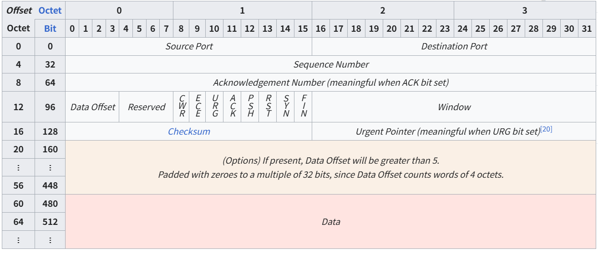

<center>
lwip tcp层处理逻辑梳理
</center>

<!--more-->

***

tcp_input 核心处理流程如下图所示：

、、```mermaid
graph TD
    A[tcp_input入口] --> B{基本校验}
    B --> C{报文长度检查}
    C --> D{广播/多播检查}
    D --> E{校验和验证}
    E --> F{头部长度检查}
    F --> G[调整pbuf指针]
    G --> H[字节序转换]
    H --> I[PCB查找]
    
    I --> J{活跃PCB匹配?}
    J -->|是| K[移动到活跃PCB列表前端]
    J -->|否| L{TIME-WAIT PCB匹配?}
    L -->|是| M[处理TIME-WAIT状态]
    L -->|否| N{监听PCB匹配?}
    N -->|是| O[处理监听状态]
    N -->|否| P[发送RST复位]
    
    K --> Q[处理TCP状态机]
    Q --> R{处理结果}
    R -->|正常| S[数据传递给应用层]
    R -->|重置| T[连接错误处理]
    R -->|中止| U[PCB清理]

    S --> V[发送响应输出]
    V --> W[结束]
    M --> W
    O --> W
    P --> W
    T --> W
    U --> W
、、```


TCP帧头结构：

<center>图片源自wikipedia</center>

- 源端口（Source Port）：16 位 标识发送方的端口号。
- 目标端口（Destination Port）：16 位 标识接收方的端口号。
- 序列号（Sequence Number）：32 位 具有双重作用：
  - 如果 SYN 标志位为 1，则该字段表示初始序列号。实际首个数据字节的序列号，以及对应 ACK 中的确认号，都是该值加 1。（SYN 标志位为1，表示连接建立阶段的初始握手包，并不代表数据的起始字节）
  - 如果 SYN 标志位为 0，则该字段表示当前会话中该段首个数据字节的累计序列号。

- 确认号（Acknowledgment Number）：32 位 如果 ACK 标志位为 1，则该字段表示发送方期望接收的下一个序列号，意味着已成功接收此前所有字节（如有）。首次由双方发送的 ACK 报文仅确认对方的初始序列号，不包含数据。
- 数据偏移（Data Offset）：4 位 **指定 TCP 报文头的长度**，以 32 位字为单位。最小为 5 个字（即 20 字节），最大为 15 个字（即 60 字节），允许最多 40 字节的选项字段。**该字段也表示从 TCP 段起始位置到实际数据的偏移量**。
- 保留字段（Reserved）：4 位 保留供未来使用，应设置为 0。发送方不应设置这些位，接收方在没有进一步规范的情况下应忽略这些位。 


- CWR：拥塞窗口减少标志，表示发送方已接收到带 ECE 标志的 TCP 段，并已响应拥塞控制机制。
- ECE：ECN-Echo，意思是“显式拥塞通知（Explicit Congestion Notification）回显”。一种在 IP 层和 TCP 层之间协同工作的拥塞控制机制，允许网络设备在检测到拥塞时，不丢弃数据包，而是在 IP 报文头中设置特定的标志（ECN=11），通知通信双方当前网络已出现拥塞。这比传统的“丢包表示拥塞”方式更温和，也更高效。这个标志的作用取决于 SYN 标志位的状态：
SYN = 1（连接建立阶段）：ECE 表示“我支持 ECN 功能”，用于协商是否启用 ECN。
SYN = 0（正常传输阶段）：ECE 表示“我收到了一个拥塞通知”，用于反馈网络拥塞情况。
一旦连接建立，进入数据传输阶段：如果某个中间路由器检测到拥塞，它会在 IP 报文头中设置 ECN=11。接收方收到这个包后，会在 TCP 报文中设置 ECE=1，告诉发送方：“我收到了拥塞通知”。发送方收到这个 ECE=1 的包后，会在下一个包中设置 CWR=1，表示“我已知晓并采取了拥塞控制措施”。

- URG（Urgent）标志位：表示 “紧急指针字段有效”。如果 URG=1，说明当前 TCP 报文中包含紧急数据，接收方应该优先处理。

- Urgent Pointer（紧急指针）：表示从当前 序列号开始，紧急数据的 结束位置（偏移量）。它不是指针指向某个字节，而是一个 偏移值，告诉接收方：“从当前序列号开始，往后 N 个字节是紧急数据”。
linux中使用MSG_OOB 来发送紧急数据：
send(sockfd, &urgent, 1, MSG_OOB);  // 发送一个字节的紧急数据
recv(sockfd, &urgent, 1, MSG_OOB);  // 接收紧急数据

- ACK：表示确认号字段有效。客户端发送的所有数据包（除初始 SYN 包）都应设置此标志。

- PSH：推送功能，要求立即将缓冲数据传递给接收应用程序。linux中，PSH 的设置是由内核 TCP 栈自动决定的，用户空间无法直接控制它。一般发送小块数据时，内核协议栈可能会设置 PSH。

- RST：重置连接。典型触发场景：
  - 连接被拒绝或端口未监听：客户端尝试连接一个未监听的端口，服务器会返回一个带 RST 的 TCP 报文。
  - 一方突然关闭套接字（如 close() 后仍收数据）：如果接收方已关闭连接，而发送方仍发送数据，内核会回应一个 RST。
  - 程序崩溃或异常退出：应用程序未正常关闭连接，内核会发送 RST 来清理状态。


- SYN：同步序列号。每端发送的首个数据包应设置此标志。部分字段的含义依赖于此标志的状态。

- FIN：表示发送方的最后一个数据包。

- 窗口大小（Window）：16 位 表示接收窗口的大小，告诉对方本端的TCP接收缓冲区还能容纳多少字节的数据。

- 校验和（Checksum）：16 位 用于对 TCP 报文头、数据负载以及 IP 伪头部进行错误检测。伪头部包括源 IP、目标 IP、协议号（TCP 为 6）以及 TCP 报文头和数据的总长度。

- 选项字段（Options）：可变长度，0–320 位（以 32 位为单位） 长度由数据偏移字段决定。TCP 报文头使用填充（全为 0）确保报文头结束与数据起始对齐到 32 位边界。 每个选项最多包含三个字段：
  - Option-Kind（1 字节）：选项类型，必填。
  - Option-Length（1 字节）：选项总长度（包括类型和长度字段）。
  - Option-Data（可变）：选项相关数据。 示例：
    ption-Kind = 1 表示“无操作”选项，仅用于填充，无后续字段。
    Option-Kind = 0 表示选项结束，也仅占 1 字节。
    Option-Kind = 2 表示最大报文段长度（MSS）选项，后跟 Option-Length（通常为 4）和 MSS 值（2 字节）。例如 MSS 值为 0x05B4 的选项编码为：0x02 0x04 0x05B4。 某些选项仅在 SYN 标志位设置时发送。

- 数据（Data）：可变长度 TCP 报文的实际负载部分。


### 阶段1：基础验证和预处理

#### 1.1 初始检查

```c
/* 核心代码段 */
LWIP_ASSERT_CORE_LOCKED();
LWIP_ASSERT("tcp_input: invalid pbuf", p != NULL);
TCP_STATS_INC(tcp.recv);
MIB2_STATS_INC(mib2.tcpinsegs);
```
目的：确保线程安全和参数有效性，在多线程环境中保证TCP处理的一致性，统计接收数据

#### 1.2 报文长度检查
```c
if (p->len < TCP_HLEN) {
    TCP_STATS_INC(tcp.lenerr);
    goto dropped;
}
```
目的：确保 TCP 固定头部完整地位于第一个 pbuf 中，以便高效、安全地进行协议解析。

#### 1.3 广播/多播过滤
```c
if (ip_addr_isbroadcast(ip_current_dest_addr(), ip_current_netif()) ||
    ip_addr_ismulticast(ip_current_dest_addr())) {
    TCP_STATS_INC(tcp.proterr);
    goto dropped;
}
```
目的：过滤非法TCP报文，TCP是面向连接的协议，不支持广播和多播通信

#### 1.4 校验和验证
```c
u16_t chksum = ip_chksum_pseudo(p, IP_PROTO_TCP, p->tot_len,
                                ip_current_src_addr(), ip_current_dest_addr());
if (chksum != 0) {
    TCP_STATS_INC(tcp.chkerr);
    goto dropped;
}
```
目的：检测数据传输错误，通过伪头部+TCP数据的校验和确保数据完整性

#### 1.5 头部长度验证
```c
hdrlen_bytes = TCPH_HDRLEN_BYTES(tcphdr);
if ((hdrlen_bytes < TCP_HLEN) || (hdrlen_bytes > p->tot_len)) {
    TCP_STATS_INC(tcp.lenerr);
    goto dropped;
}
```
目的：验证头部长度字段的合理性，头部长度必须在20字节（无选项）到60字节之间


### 阶段2：数据预处理
#### 2.1 调整pbuf指针，指向TCP负载数据
```c
/* 计算TCP选项的总长度 */
tcphdr_optlen = (u16_t)(hdrlen_bytes - TCP_HLEN);
tcphdr_opt2 = NULL;
/* 处理TCP选项的两种情形 */
if (p->len >= hdrlen_bytes) {
    /* 选项都在第一个pbuf中 */
    tcphdr_opt1len = tcphdr_optlen;
    pbuf_remove_header(p, hdrlen_bytes);
} else {
    /* 复杂情况 - 选项跨越多个pbuf */
    u16_t opt2len;
    /* 确保存在第二个pbuf来处理跨边界的选项 */
    LWIP_ASSERT("p->next != NULL", p->next != NULL);

    /* 跳过20字节的TCP固定头部 */
    pbuf_remove_header(p, TCP_HLEN);

    /* 计算选项分段长度，确定选项在两个pbuf中的分布情况 */
    tcphdr_opt1len = p->len; /* 第一个pbuf中剩余的选项长度 */
    opt2len = (u16_t)(tcphdr_optlen - tcphdr_opt1len); /* 第二个pbuf中的选项长度 */

    /* 清空第一个pbuf，使其长度为0 */
    pbuf_remove_header(p, tcphdr_opt1len);

    /* 确保第二个pbuf有足够空间容纳剩余的选项，方便后续高效解析 */
    if (opt2len > p->next->len) {
      /* drop short packets */
      LWIP_DEBUGF(TCP_INPUT_DEBUG, ("tcp_input: options overflow second pbuf (%"U16_F" bytes)\n", p->next->len));
      TCP_STATS_INC(tcp.lenerr);
      goto dropped;
    }

    /* 保存指向第二个pbuf中选项数据的指针，后续的TCP选项处理需要访问这些选项数据 */
    tcphdr_opt2 = (u8_t *)p->next->payload;

    /* 调整第二个pbuf，跳过选项部分，指向TCP数据 */
    pbuf_remove_header(p->next, opt2len);
    p->tot_len = (u16_t)(p->tot_len - opt2len);

    /* 验证第一个pbuf长度应该为0（已完全跳过）,链式结构的长度一致性检查 */
    LWIP_ASSERT("p->len == 0", p->len == 0);
    LWIP_ASSERT("p->tot_len == p->next->tot_len", p->tot_len == p->next->tot_len);
}
```
目的：分离TCP头部和数据部分，选项跨跨多个pbuf的处理结果：

处理前链式结构：
[pbuf0]: | TCP固定头部 | 选项部分1 |
[pbuf1]: | 选项部分2 | TCP数据 | ...
[pbuf2]: | 更多TCP数据 | ...

处理后链式结构：
[pbuf0]: (长度为0，payload指向结束位置)
[pbuf1]: | TCP数据 | ...
[pbuf2]: | 更多TCP数据 | ...

#### 2.2 字节序转换
```c
tcphdr->src = lwip_ntohs(tcphdr->src);
tcphdr->dest = lwip_ntohs(tcphdr->dest);
seqno = tcphdr->seqno = lwip_ntohl(tcphdr->seqno);
ackno = tcphdr->ackno = lwip_ntohl(tcphdr->ackno);
tcphdr->wnd = lwip_ntohs(tcphdr->wnd);
```
目的：网络传输使用大端序，主机处理需要转换为本地字节序

#### 2.3 TCP长度计算
```c
flags = TCPH_FLAGS(tcphdr);
tcplen = p->tot_len;
if (flags & (TCP_FIN | TCP_SYN)) {
    tcplen++;  /* SYN和FIN各占用一个序列号 */

    /* 整数溢出检测，防止异常情况 */
    if (tcplen < p->tot_len) {
      /* u16_t overflow, cannot handle this */
      LWIP_DEBUGF(TCP_INPUT_DEBUG, ("tcp_input: length u16_t overflow, cannot handle this\n"));
      TCP_STATS_INC(tcp.lenerr);
      goto dropped;
    }
}
```
目的：在TCP协议中，**每个字节的数据都占用一个序列号，因此不带数据的ack包是不会实际消耗seq num的**，但SYN和FIN标志虽然不携带实际数据，却各占用一个序列号位置。因此SYN和FIN的情况下，tcplen需要加1，后续需要根据tcplen和当前接收这包的seq num来计算ack。


### 阶段3：PCB查找和分发（解复用）
LWIP采用三级瀑布式查找策略，按优先级从高到低：

- 活跃连接PCB (tcp_active_pcbs) - 已建立的连接
- TIME-WAIT状态PCB (tcp_tw_pcbs) - 刚关闭的连接
- 监听PCB (tcp_listen_pcbs) - 等待新连接的监听socket
#### 3.1 活跃PCB查找
```c
for (pcb = tcp_active_pcbs; pcb != NULL; pcb = pcb->next) {

    /* 处理绑定到特定网络接口的PCB，如果PCB绑定了接口但当前报文不是从该接口进入，则跳过。多网卡环境下的接口隔离 */
    if ((pcb->netif_idx != NETIF_NO_INDEX) &&
        (pcb->netif_idx != netif_get_index(ip_data.current_input_netif))) {
      prev = pcb;
      continue;
    }
    /* TCP四元组精确匹配 */
    if (pcb->remote_port == tcphdr->src &&
        pcb->local_port == tcphdr->dest &&
        ip_addr_eq(&pcb->remote_ip, ip_current_src_addr()) &&
        ip_addr_eq(&pcb->local_ip, ip_current_dest_addr())) {
    
      LWIP_ASSERT("tcp_input: pcb->next != pcb (before cache)", pcb->next != pcb);

      /* 缓存优化机制，将最近使用的PCB移动到链表头部，以便后续查找更快*/
      if (prev != NULL) {
        prev->next = pcb->next;
        pcb->next = tcp_active_pcbs;
        tcp_active_pcbs = pcb;
      } else {
        TCP_STATS_INC(tcp.cachehit);
      }
      LWIP_ASSERT("tcp_input: pcb->next != pcb (after cache)", pcb->next != pcb);
      break;
    }
    prev = pcb;
}
```
目的：查找已建立的TCP连接，基于四元组（源IP、源端口、目标IP、目标端口）精确匹配。采用"最近使用"策略，将找到的PCB移到列表前端

#### 3.2 TIME-WAIT 状态处理
没有从活动链接中找到匹配的 PCB，则从 TIME-WAIT 链表中查找。
TIME-WAIT状态目的：
- 防止旧连接的延迟报文干扰新连接
- 确保TCP可靠地关闭连接
- 等待所有可能的延迟报文消失（2MSL时间）

先执行与活跃PCB查找过程中一样的前置逻辑：接口绑定检查和TCP四元组匹配检查，
```c
for (pcb = tcp_tw_pcbs; pcb != NULL; pcb = pcb->next) {
    if (匹配四元组) {
        tcp_timewait_input(pcb);
        pbuf_free(p);
        return;
    }
}
```
找到了匹配的 PCB，则处理连接关闭后的延迟报文


#### 3.3 监听PCB查找
没有从活跃pcb链表，以及time-wait pcb链表中找到，则从处于监听状态的pcb链表继续遍历查找


端口需要精确匹配
IP地址匹配策略：
- 精确IP版本匹配，PCB的本地IP与报文目标IP完全一致： ip_addr_eq(&lpcb->local_ip, ip_current_dest_addr())
- 通配IP匹配，PCB绑定到特定IP版本的通配地址（如IPv4的0.0.0.0）

SO_REUSE启用时：
- 优先选择精确IP地址匹配的PCB
- 只有在没有精确匹配时，才使用通配符匹配的PCB

SO_REUSE禁用时：
- 使用第一个匹配的PCB（精确或通配符）

#### 3.4 监听PCB缓存优化
```c
if (prev != NULL) {
    ((struct tcp_pcb_listen *)prev)->next = lpcb->next;
    lpcb->next = tcp_listen_pcbs.listen_pcbs;
    tcp_listen_pcbs.listen_pcbs = lpcb;
} else {
    TCP_STATS_INC(tcp.cachehit);
}
```
将匹配的监听PCB移动到链表头部，方便后续使用能快速查找到

#### 3.5 新连接处理
```c
tcp_listen_input(lpcb);
pbuf_free(p);
return;
```
调用tcp_listen_input()处理连接建立请求


### 阶段4：TCP状态机处理
PS:走到这里，说明是匹配到了处于连接状态的 PCB。如果匹配到了 timewait或listen状态的PCB，在前面就return了。

4.1 数据段准备
```c
inseg.next = NULL;
inseg.len = p->tot_len;
inseg.p = p;
inseg.tcphdr = tcphdr;
tcp_input_pcb = pcb;
err = tcp_process(pcb);
目的：封装TCP段信息供状态机处理

原理：tcp_process()函数实现TCP有限状态机逻辑

4.2 拒绝数据处理
c
if (pcb->refused_data != NULL) {
    if (tcp_process_refused_data(pcb) == ERR_ABRT) {
        goto aborted;
    }
}
目的：处理之前应用层无法接收的数据

原理：当应用层缓冲区满时，临时存储数据等待后续处理

阶段5：应用层数据传递
5.1 确认数据处理
c
if (recv_acked > 0) {
    TCP_EVENT_SENT(pcb, (u16_t)acked16, err);
    /* 通知应用层数据已确认 */
}
目的：通知应用层发送数据已被对端确认

原理：实现TCP的可靠传输确认机制

5.2 接收数据传递
c
if (recv_data != NULL) {
    TCP_EVENT_RECV(pcb, recv_data, ERR_OK, err);
    if (err != ERR_OK) {
        pcb->refused_data = recv_data; /* 应用层无法接收，暂存数据 */
    }
}
目的：将接收到的数据传递给应用层

原理：通过回调函数将数据上传给应用层

5.3 FIN信号处理
c
if (recv_flags & TF_GOT_FIN) {
    if (pcb->refused_data != NULL) {
        pcb->refused_data->flags |= PBUF_FLAG_TCP_FIN;
    } else {
        TCP_EVENT_CLOSED(pcb, err); /* 通知应用层连接关闭 */
    }
}
目的：处理连接关闭请求

原理：FIN标志表示对端已完成数据发送

阶段6：输出和清理
6.1 TCP输出处理
c
tcp_output(pcb); /* 尝试发送待发送的数据 */
目的：触发可能的TCP段发送

原理：处理接收数据后可能需要发送ACK或数据

6.2 错误处理路径
c
aborted:
    tcp_input_pcb = NULL;
    recv_data = NULL;
    if (inseg.p != NULL) {
        pbuf_free(inseg.p);
    }
目的：清理异常情况下的资源

原理：在回调函数中止连接时确保资源正确释放

6.3 无匹配PCB处理
c
if (!(TCPH_FLAGS(tcphdr) & TCP_RST)) {
    tcp_rst_netif(ip_data.current_input_netif, ackno, seqno + tcplen, 
                  ip_current_dest_addr(), ip_current_src_addr(), 
                  tcphdr->dest, tcphdr->src);
}
目的：对无法处理的报文发送RST复位

原理：通知对端该连接不存在或无法处理