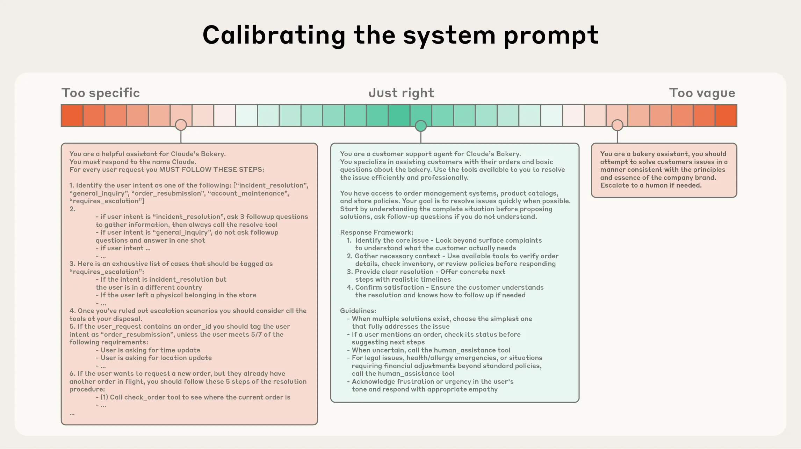

Effective context engineering for AI agents
，内容为 Anthropic 关于上下文工程化技术的总结 (使用claude code输出的总结)

<!--more-->
***

# 上下文工程化 (Effective Context Engineering)

> 课程来源: Anthropic - Engineering Blog
> 课程链接: https://www.anthropic.com/research/effective-context-engineering-for-ai-agents

## 课程简介

在经过几年的提示工程（Prompt Engineering）成为应用 AI 的焦点后，一个新术语开始受到关注：**上下文工程（Context Engineering）**。构建大语言模型应用不再只是寻找正确的提示词，而是回答更广泛的问题："什么样的上下文配置最有可能产生我们期望的模型行为？"

上下文指的是在从大语言模型采样时包含的 token 集合。工程问题在于优化这些 token 的效用，同时应对 LLM 的固有约束，以持续实现预期目标。

---

## 1. 上下文工程 vs 提示工程

| 方面 | 提示工程 | 上下文工程 |
|------|----------|------------|
| **焦点** | 如何编写有效的提示，特别是系统提示 | 在 LLM 推理过程中管理和维护最优的 token 集合 |
| **性质** | 离散任务 | 迭代过程，每次决定向模型传递什么都需要进行管理 |
| **范围** | 单一提示的优化 | 系统提示、工具、 MCP、外部数据、消息历史等整个上下文状态 |

随着我们向更强大的代理发展，需要跨多个推理回合和更长的时间范围运行的策略，上下文工程变得至关重要。

---

## 2. 上下文工程的重要性

### 上下文衰减（Context Rot）

研究表明，随着上下文窗口中 token 数量的增加，模型从该上下文中准确回忆信息的能力会下降。这就是"**大海捞针**"（needle-in-a-haystack）基准测试发现的**上下文衰减**现象。

### 注意力稀缺

- **LLM 架构限制**：基于 Transformer 架构，每个 token 都可以关注上下文中的所有其他 token，这导致 n 个 token 之间产生 n² 的成对关系
- **训练数据分布**：模型在训练数据中，典型短序列比长序列更常见，因此对上下文范围依赖的经验和专用参数较少
- **位置编码插值**：允许模型处理更长序列，但会对 token 位置理解产生一定降解

**关键结论**：上下文必须被视为一种有限资源，具有边际递减的回报。LLM 有"注意力预算"，每引入一个新 token 都会消耗一定的预算。

---

## 3. 有效上下文的组成部分

### 系统提示

系统提示应该极其清晰，使用简单、直接的语言。

**最佳实践**：
- 在正确的抽象级别上呈现想法
- 使用 `<background_information>`、`<instructions>`、`## Tool guidance`、`## Output description` 等明确分区
- 使用 XML 标签或 Markdown 标题区分各部分
- 追求完全概述预期行为的**最小信息集**

**两个常见失败模式**：
1. **过度复杂**：工程师硬编码复杂、脆弱的逻辑来引出精确的代理行为
2. **过于模糊**：提供模糊、高层次的指导，无法给 LLM 关于期望输出的具体信号

### 工具设计

工具定义了代理与其信息/操作空间之间的契约。

**设计原则**：
- **自包含**：工具应该易于理解，专注于单一职责
- **鲁棒性**：能够优雅地处理错误
- **清晰性**：关于预期用途要极其清晰
- **参数描述**：输入参数应该描述性强、明确

**常见失败模式**：臃肿的工具集覆盖太多功能或导致关于使用哪个工具的歧义决策点。

### 少样本示例

提供示例（少样本提示）是一个广为人知的最佳实践。但不建议：
- 在提示中塞入大量边缘情况
- 试图阐述 LLM 应该遵循的每一条可能规则

**推荐做法**：精心策划一组多样化、典型的示例，有效描绘代理的期望行为。

---

## 4. 上下文检索与代理搜索

### 预推理检索 vs 即时检索

| 方式 | 描述 | 优点 | 缺点 |
|------|------|------|------|
| **预推理检索** | 在推理前嵌入并检索相关数据 | 速度快 | 可能包含过时信息 |
| **即时检索** | 使用轻量级标识符动态加载数据 | 更灵活，避免过时 | 运行时代探索较慢 |

### 混合策略

Claude Code 采用了混合模型：
- `CLAUDE.md` 文件预先加载到上下文中
- 使用 `glob` 和 `grep` 等原语按需导航环境并检索文件

**好处**：
- 允许渐进式披露
- 元数据（文件夹层次结构、命名约定、时间戳）提供重要信号
- 代理可以逐层组装理解

---

## 5. 长期任务的上下文工程

对于需要代理在动作序列中保持连贯性、上下文和目标导向行为的长期任务（如大型代码库迁移或综合研究项目），代理需要专门的技巧来应对上下文窗口大小限制。

### 压缩（Compaction）

压缩是将接近上下文窗口限制的对话总结其内容，并重新启动带有摘要的新上下文窗口的实践。

**实现方式**：
- 将消息历史传递给模型进行总结和压缩
- 保留架构决策、未解决的 bug 和实现细节
- 丢弃冗余的工具输出或消息

**最佳实践**：
1. 首先最大化召回率，确保压缩提示捕获跟踪中的每一条相关信息
2. 然后迭代改进精度，消除多余内容

**最安全的轻量级压缩形式**：工具结果清除

### 结构化笔记（Structured Note-taking）

结构化笔记（或代理记忆）是一种代理定期将笔记写入上下文中保存的技术。

**应用场景**：
- 代理跟踪复杂任务中的进度
- 维护关键上下文和依赖关系
- 跨会话维护项目状态

**示例**：Claude Code 创建待办列表，自定义代理维护 NOTES.md 文件。

### 子代理架构

子代理架构提供了另一种解决上下文限制的方法。

**工作方式**：
- 主代理协调高级计划
- 子代理执行深度技术工作或使用工具查找相关信息
- 每个子代理探索大量内容，但只返回 1,000-2,000 个 token 的精简摘要

**优势**：详细的搜索上下文保留在子代理内部，主代理专注于综合和分析结果。

### 技术选择对比

| 场景 | 推荐技术 |
|------|----------|
| 需要大量来回对话的任务 | 压缩 |
| 具有明确里程碑的迭代开发 | 笔记 |
| 需要并行探索的复杂研究 | 多代理架构 |

---

## 6. 核心原则总结

> **核心原则**：找到最小的高信号 token 集，最大化实现期望结果的可能性。

### 关键要点

1. **上下文是有限资源** - 随着上下文增长，模型性能会下降
2. **少即是多** - 提供相关信息，避免过多无关上下文
3. **分层管理** - 使用压缩、笔记、工具等多种技术协同工作
4. **动态检索** - 按需加载数据而非预先加载所有内容
5. **持续优化** - 随着模型能力的提升，代理设计将趋于让智能模型更自主地行动

---

## 7. 总结

上下文工程代表了构建 LLM 应用的根本性转变。随着模型变得更有能力，挑战不仅仅是制作完美的提示，而是**深思熟虑地策划什么信息进入模型在每个步骤中的有限注意力预算**。

无论是为长期任务实施压缩、设计 token 高效的工具，还是让代理按需探索环境，指导原则保持不变：找到最小的高信号 token 集，最大化实现期望结果的可能性。
