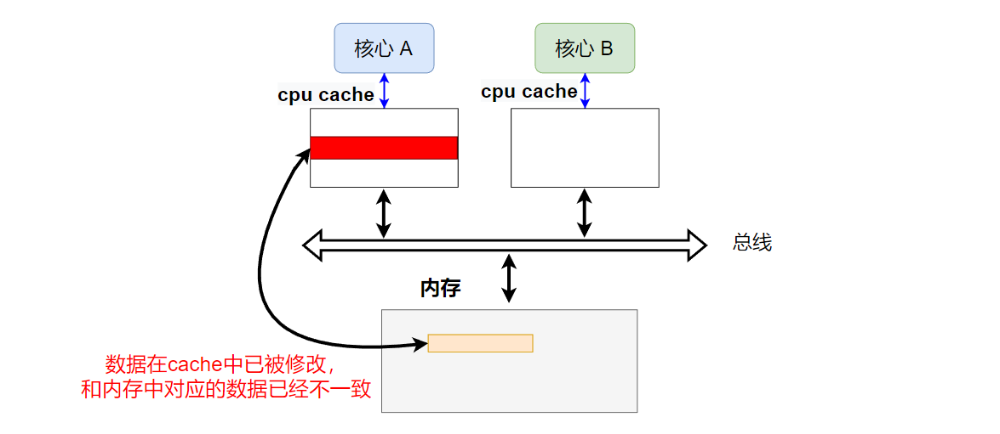
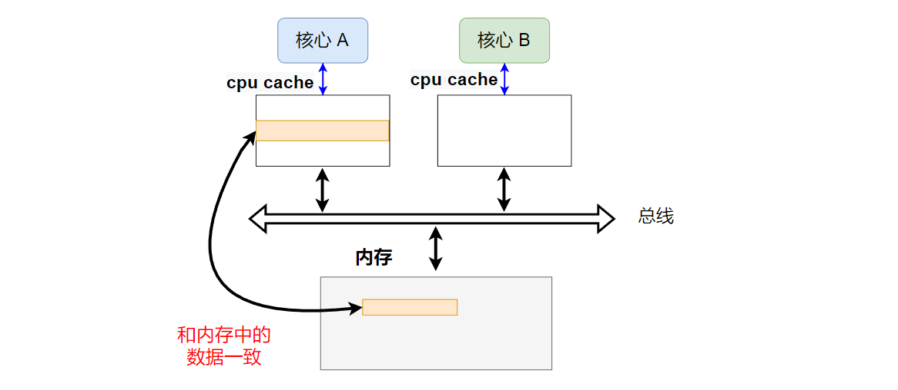
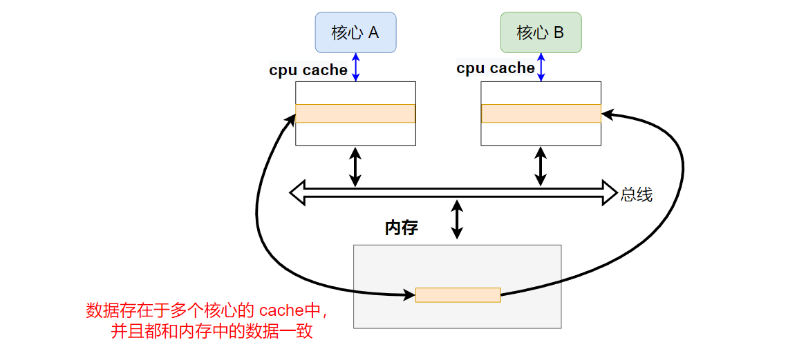
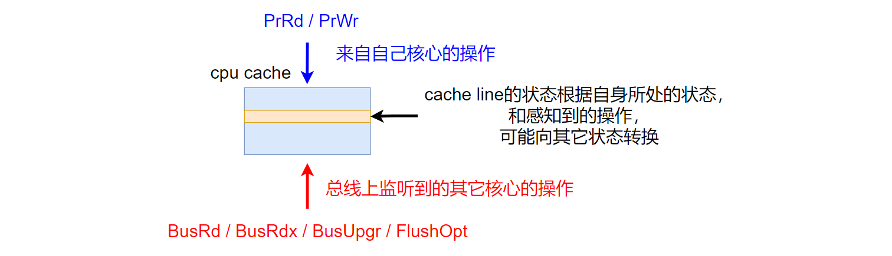

本文介绍缓存一致性协议 MESI

<!--more-->

***

关于CPU cache的基础介绍，参考文章：[cpu cace](https://fengxun2017.github.io/2022/12/18/memory-ordering-cpu-cache/)

MESI缓存一致性协议，是基于硬件层面的总线嗅探机制，来满足写传播和事务（操作）串行化要求，并实现缓存间数据的一致性。

MESI协议本质是一个有限状态机，它定义了cpu cache中每个[cache line](https://fengxun2017.github.io/2022/12/18/memory-ordering-cpu-cache/#2-Cache-line)（`cpu cache中所存储数据的基本单位，现代CPU中一般为主存中的64字节组成一行放在cpu cache中`）所处各种状态，以及一些同步指令。每个核心的cpu cache 中的 cache line，会根据当前自身的状态，以及收到的同步指令，可能会向其它状态转换。 

**MESI** 是四种状态的首字母：
- **Modified（M）**：表示该cache line，**仅在**本cpu cache中（其它cpu cache中没有缓存这个数据），并且是脏（dirty）的，即该数据在本 cache 中已经被更新过，和主存已经不一致了（例如，使用了[write-back](https://fengxun2017.github.io/2022/12/18/memory-ordering-cpu-cache/#4-1-%E5%BD%93%E8%A6%81%E5%86%99%E7%9A%84%E6%95%B0%E6%8D%AE%E5%91%BD%E4%B8%AD%E4%BA%86cpu-cache%EF%BC%9A)写回策略，数据更新时只修改了cache，没有立刻同步回主存中）。如下图所示：

  
- **Exclusive（E）**：表示该cache line **仅在**本cpu cache中，并且是干净（clean）的，即和主存中的数据一致。如下图所示：

- **Shared（S）**：表示该cache line存在于多个 cpu cache中，并且都和主存保持一致。如下图所示：

- **Invalid（I）**：表示该cache line是无效的。（例如，该cache line在另一个核心的cpu cache中也存在，当另一个核心更新它的cache中的该cache line后，本核心cache中的这个cache line就是无效的了）

每个核心的cpu cache中的cache line，都有各自的状态（上述四种状态中的一个）。
cache line状态受本核心的读/写操作影响，也受其它核心的操作影响（通过总线嗅探，来感知到其它核心对外广播的操作）。

因此，cpu cache会感知到两个方向的数据操作：
- **本核心的发过来的操作（指令/请求）**：
  - PrRd：本核心读 cache line
  - PrWr：本核心写 cache line
- **总线上监听到的其它核心的广播过来的操作（指令/请求）**：
  - BusRd：表示存在另一个核心也要读该cache line。（例如，该cache line在本核心中可能已经被更新了，这样本核心通过总线监听到另一个核心的读操作，就会将数据写回主存以及同步给另一个核心，使其能读到更新后的数据）
  - BusRdX：看名字像读，实际上当另一个核心的cpu cache中**没有**该 cache line ，且该核心要写该cache line时，会向总线发送该指令。
  - BusUpgr：表示的是另一个cpu cache中**有**该 cache line 的核心要写该 cache line，
  - FlushOpt：表示将目标cache line数据发送到总线上。（例如，目标cache line不在本核心中，本核心请求该cache line数据时，另一个cache中有该cache line的核心会发送FlushOpt + 该cache line数据 到总线上，这样本核心就能获得该数据了）

对于 CPU Cache 中的每个 cache line 而言，会根据自身的状态（M/E/S/I），上文所述的自己核心发送过来的操作，以及总线上监听到的其它核心的操作，执行不同的响应动作（向其它状态转换）。如下图所示：

针对自己核心发送过来的操作，以及其它核心发送过来的操作，cpu cache 的具体响应动作和状态转换如下文所述：

当cpu cache 收到**自己核心**发送过来的对某个cache line的操作时，响应动作详情如下**表 1**所示：

 **表 1**

|  当前状态   | 自己核心的操作  | 响应动作 |
|  ----  | ----  | ----|
| Invalid（目标cache line不在本cache中）  | PrRd（读cache line） |1--向总线发送**BusRd**（通知其它核心的cpu cache）。 2--其它核心的cpu cache会检查它们是否有该cache line，并告知发送 PrRd 的这个cpu cache。 3--如果其它核心cache中有该cahe line，则本cache中的该cache line状态转换成**Shared**，否则转换成**Exclusive**。 4--如果存在其它核心有该cache line，其中一个会发送数据到总线上，本cache就能获取到该cache line了。否则，只能从主存中获取数据|
|   | PrWr（写cache line） |1--向总线发送**BusRdx**（要修改数据得先读到整行cache line数据）。 2--本cache中的该cache line状态转换成**Modified**。 3--如果其它核心的cache中有该cache line，它们会将自己cache中的该cache line发送到总线上（本cache就能从总线上获取到该cache line了），并将自己cache中该cache line设置为 invalid状态。否则，只能从主存中获取数据。 4--更新获取到的cache line数据并写如cache中。|
|Exclusive（目标cache line**仅在**本cache中，并且和主存一致）|PrRd|1--不用向总线发送任务指令（因为其它cache中没有这个cache line）。 2--状态保持不变。 3--目标cache line在本cache中，读命中，返回cache中数据即可。|
|   |PrWr|1--不用向总线发送任务指令。 2--状态转换为**Modified**。 3--目标cache line在本cache中，写命中，更新cache中的数据。|
|Shared（目标cache line在多个核心的cpu cache中，并且都和主存一致）|PrRd|1--不用向总线发送任务指令（因为只是读）。 2--状态保持不变。 3--目标cache line在本cache中，读命中，返回cache中数据即可。|
|   |PrWr|1--向总线发送 **BusUpgr**，通知其它cache。 2--状态转换为 **Modified**。 3--其它cache从总线上看到 BusUpgr后，就会将自己cache中的该cache line设置为 Invalid。|
|Modified（目标cache line**仅在**本cache中，但和主存**不一致**）|PrRd|1--不用向总线发送任务指令（因为只是读，且该cache line仅在本cache中）。 2--状态保持不变。 3--目标cache line在本cache中，读命中，返回cache中数据即可。|
|   |PrWr|1--不用向总线发送任务指令（因为该cache line仅在本cache中）。 2--状态保持不变。 3--目标cache line在本cache中，写命中，更新cache中的数据。|

 

当cpu cache 在总线上监听到**其它核心**发送过来的对某个cache line的操作时，响应动作详情如下**表 2**所示：

 **表 2**

|  当前状态   | 监听到的其它核心的操作  | 响应动作 |
|  ----  | ----  | ----|
| Invalid（目标cache line不在本cache中）  | BusRd（其它核心读自己cache中的目标cache line） |状态保持不变，并忽略该信号。因为本cache中没有这个cache line，所以其它核心读/写该cache line和本cache没关系。|
|   | BusRdX/BusUpgr |状态保持不变，并忽略该信号。原因同上。|
|Exclusive（目标cache line**仅在**本cache中，并且和主存一致）|BusRd|1--状态转换为 **Shared**（其它核心也读该cache line，那么该cache line就会被放在其核心对应的cpu cache中） 2--发送**FlushOpt**+目标cache line数据到总线上（另一个核心就能从总线上获得数据了，可以对照**表1** 中的Invalid状态下收到自己核心读操作，触发向总线发送BusRd）。|
|   |BusRdX|1--目标cache line状态转换成 **Invalid**。 2--发送**FlushOpt**+目标cache line数据到总线上。（另一个核心就能从总线上获得数据了，可以对照**表1** 中的Invalid状态下收到自己核心写操作，触发向总线发送 BusRdX ）|
|Shared（目标cache line在多个核心的cpu cache中，并且都和主存一致）|BusRd|1--状态保持不变（其它核心只是读，仍旧保持共享）。 2--发送**FlushOpt**+目标cache line数据到总线上（另一个核心就能从总线上获得数据了，可以对照**表1** 中的Invalid状态下收到自己核心读操作，触发向总线发送BusRd）。|
|   |BusRdX/BusUpgr|1--状态转换为 **Invalid**（因此其它核心更新该cache line了，本核心的不再有效）。 2--发送**FlushOpt**+目标cache line数据到总线上（另一个核心就能从总线上获得数据了，可以对照**表1** 中的Invalid状态下收到自己核心写操作，触发向总线发送BusRdx）。（如果收到的是BusUpgr，可以不执行这个发送动作，对照 **表1**中的Shared状态下收到自己核心写，因为自己cache中有目标cache line，所以不需要其它核心向总线发送该cache line）|
|Modified（目标cache line**仅在**本cache中，但和主存**不一致**）|BusRd|1--状态转换为 **Shared**。 2--发送**FlushOpt**+目标cache line数据到总线上。（另一个核心就能从总线上获得数据了，可以对照**表1** 中的Invalid状态下收到自己核心读操作，触发向总线发送BusRd），同时主存（内存）也能从总线监听到数据，并将数据更新到主存中（Shared状态，cache和主存数据是一致的，所以数据需要同步回主存）。|
|   |BusRdX|1--状态转换为 **Invalid**。 2--发送**FlushOpt**+目标cache line数据到总线上。（另一个核心就能从总线上获得数据了，可以对照**表1** 中的Invalid状态下收到自己核心写操作，触发向总线发送BusRdx），同时主存（内存）也能从总线监听到数据，并将数据更新到主存中（已修改的数据，变为invalied了，所以要同步回主存）。|

 

根据上述两表，几个关键的要点是：
- 当核心要写的数据在本cache中，并且是 **Modified 或Exclusive** 状态（即**仅在**本核心的cache中），那么写操作可以认为是“无消耗”的（不需要通知其它核心的cache，仅操作自己的cache即可，速度很快）。但如果是 **Shared**状态（该数据也存在于其它核心的cache中），则必须首先让其它核心cache中的该数据变为无效状态，之后才能更新本核心数据。
- 如果本核心的cache中包含了一个状态为 **Modified** 的cache line（数据被更新了，还未同步回主存），那么本核心的cache必须监听总线上，其它核心对该cache line所对应的主存位置处数据的读（因为，当前主存中该位置处的数据是旧的，数据得从本cache中拿最新的）。当本cache监听到某个其它核心想读该位置处的数据时，需要将自己存储的该cache line发送到总线上（让其它核心可以读到）。
- 当本核心的cache中包含了状态为 **Shared** 的cache line，则cache需要监听总线上其它核心cache对相应cache line的写操作（即总线上的BusRdX/BusUpgr信号）。

以一个具体的例子（源自参考【2】）来看 **MESI**协议相关的指令和状态是如何交互的：
假设有多个cpu核心（每个核心有自己的cache）对主存中同一个位置的数据进行了一连串的读写操作。
操作顺序为： R1, W1, R3, W3, R1, R3, R2。 
R-读;   W-写；  1、2、3数字表示cpu核心编号P1、P2、P3。
|     | Local Request (本核心向自己cache发送的请求)  | 执行请求后，P1中该数据的状态 | P2| p3|Generated Bus Request （由于locak request导致产生发送到总线上的的bus request）|Data Supplier (local request操作的数据来自哪里)|
| :----:  | :----:  | :----:|:----:|:----:|:----:|:----:|
|0|Initially|-|-|-|-|-|
|1|R1|E|-|-|P1向总线发送BusRd|所有cache中都没有目标数据，只能从主存（内存）获取|
|2|W1|M|-|-|-|更新的是P1自己cache中的数据|
|3|R3|S|-|S|P3向总线发送BusRd|P1从总线上感知到P3的读，将自己cache中的最新数据发送到总线上，P3获得该数据|
|4|W3|I|-|M|P3向总线发送BusUpgr（让其它核心cache中的该数据变为Invalid）|更新的是P3自己cache中的数据|
|5|R1|S|-|S|P1向总线发送BusRd |P3从总线上感知到P1的读，将自己cache中的最新数据发送到总线上，P1获得该数据|
|6|R3|S|-|S|-|P3从自己cache中读取数据|
|7|R2|S|S|S|BusRd |P1，P3从总线上感知到P2的读，P1或P3将其cache中的该数据发送到总线上|

step1：核心P1 读目标数据，由于数据不在自己cache中，向总线发送BusRd。该数据也不在其它核心cache中，所以只能从主存（内存）中将数据所在cache line加载到 P1 cache中。并且该cache line状态为独占（E）。

step2: 核心P1 写该数据，由于数据在自己cache中，且是独占的，因此不用向总线发送信息（不用通知其它核心），该cache line状态变为已修改（M）。

step3：核心P3 读该数据，由于P3 cache中没有该数据，因此P3 会向总线发送BusRd。P1从总线上感知到P3的读，将自己cache中的最新数据发送到总线上，并且P1 cache中的该cache line状态变为共享（S）。P3从总线上获取该cache line放到自己cache中，并且状态也为 S。主存也会从总线上获得该数据，并更新到主存中。（S状态是多个cache共享，并且和主存中数据一致）

step4：核心P3 写该数据，向总线发送BusUpgr，核心P1感知到后，将其cache中该数据状态设置为无效（I）。P3 更新自己cache中的该数据状态为 M。

step5：核心P1 读该数据，由于当前自己cache中该数据状态为 I，所以向总线发送BusRd。P3从总线上感知到P1的读，将自己cache中的最新数据发送到总线上，并且P3 cache中的该cache line状态变为共享（S）。P1从总线上获取该cache line放到自己cache中，并且状态也为 S。主存也会从总线上获得该数据，并更新到主存中。（S状态是多个cache共享，并且和主存中数据一致）

Step6：核心P3 读该数据。由于数据在自己cache中，直接可以获得。

step7：核心P2 读该数据，向总线发送BusUpgr，P1或P3感知到后，将自己数据发送到总线上。P2从总线上获得该数据，并且状态设置为 S。

 
 

#### 参考连接：
【1】[https://en.wikipedia.org/wiki/Cache_coherence](https://en.wikipedia.org/wiki/Cache_coherence)
【2】[https://en.wikipedia.org/wiki/MESI_protocol](https://en.wikipedia.org/wiki/MESI_protocol)
【3】[https://en.wikipedia.org/wiki/Directory-based_cache_coherence](https://en.wikipedia.org/wiki/Directory-based_cache_coherence)
【4】[https://en.wikipedia.org/wiki/Bus_snooping](https://en.wikipedia.org/wiki/Bus_snooping)
【5】[https://xiaolincoding.com/os/1_hardware/cpu_mesi.html](https://xiaolincoding.com/os/1_hardware/cpu_mesi.html)