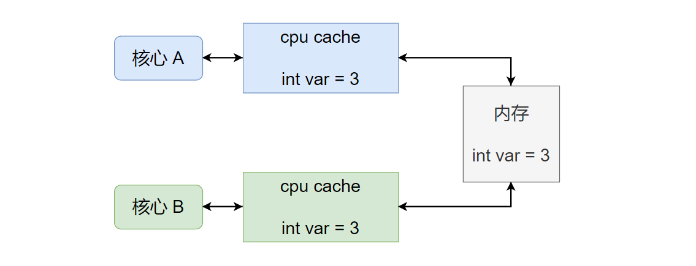
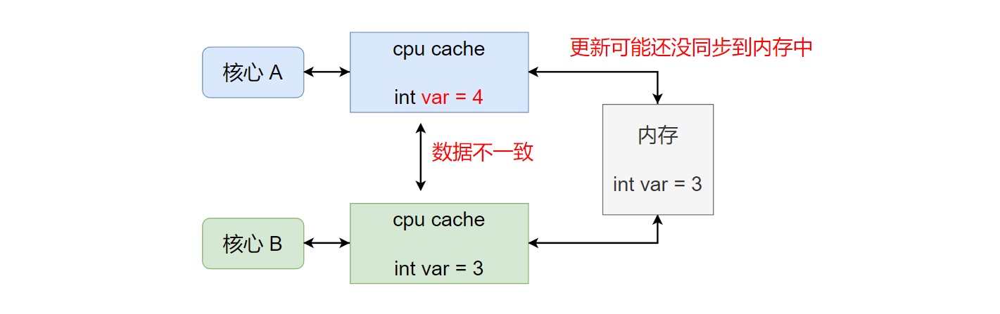
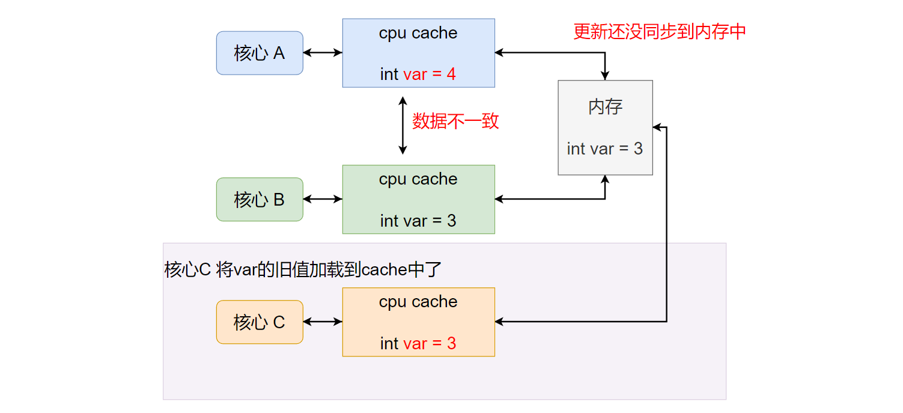
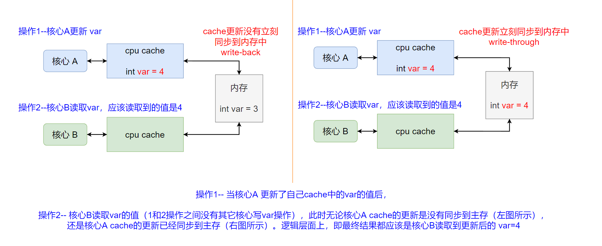
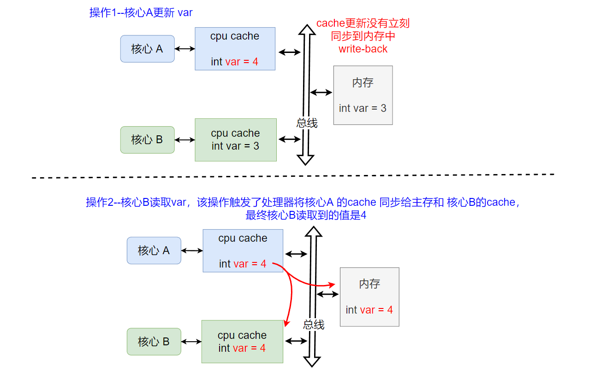
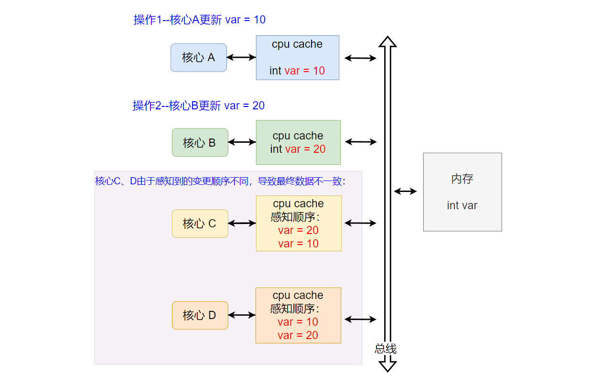
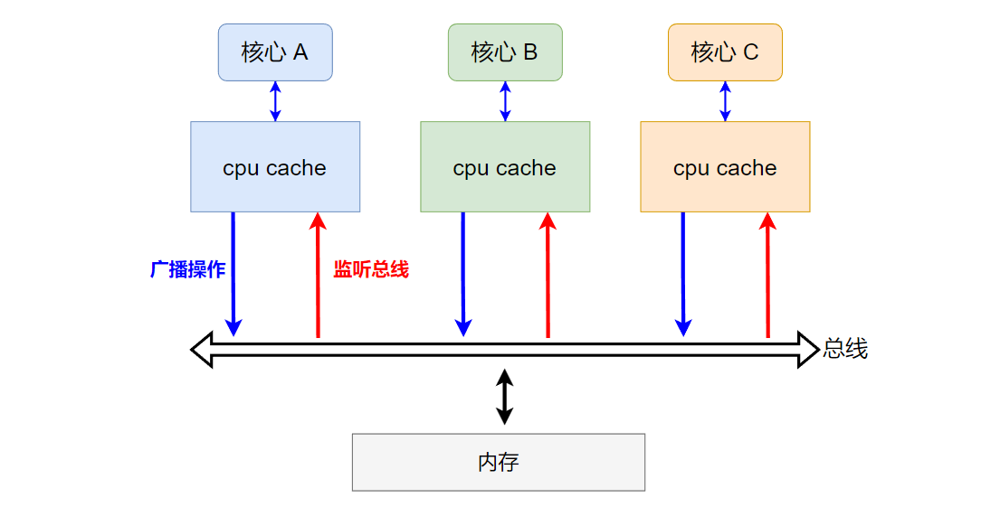
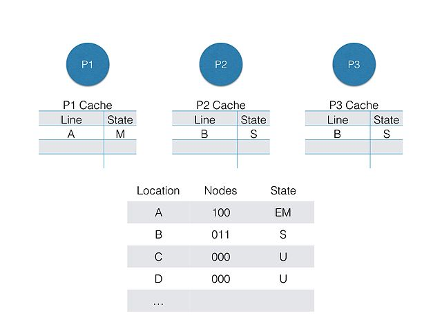

在多核CPU中，由于每个核心有自己独立的cpu cache（L1、L2 cache），所以当某个cpu核心修改了自己cache中的目标数据，但未及时同步给其它cpu核心的cache（同样包含目标数据），就会存在缓存一致性问题。

<!--more-->

***

关于CPU cache的基础介绍，参考文章：[cpu cace](https://fengxun2017.github.io/2022/12/18/memory-ordering-cpu-cache/)

#### 1 什么是 cache coherence：
缓存一致性问题是一个通用概念，当系统中多个访问数据的客户端均对某些公享数据进行缓存时，各个客户端的缓存数据间就可能出现不一致的问题。如下图所示：

图片来自wikipedia

 

现代cpu往往都是多核心的，每个核心可以看做上图的client，每个核心都有自己独立的cpu cache（L1、L2 cache）。当某个时刻`核心 A`和`核心 B`均访问内存中的某个数据`var`时，每个核心会将`var`加载到自己的 cpu cache中，如下图所示：

此时，如果`核心A`修改变量`var`的值，会直接修改自己 cache中缓存的值。那么，`核心A`和`核心B`的cache中缓存的`var`就会不一致（并且`核心A`cache中的更新的`var`不一定会立刻写回内存中，例如使用了[write-back](https://fengxun2017.github.io/2022/12/18/memory-ordering-cpu-cache/#4-1-%E5%BD%93%E8%A6%81%E5%86%99%E7%9A%84%E6%95%B0%E6%8D%AE%E5%91%BD%E4%B8%AD%E4%BA%86cpu-cache%EF%BC%9A)写回策略）。如下图所示：

进一步，由于`核心A`的更新操作可能还没同步到内存中，如果此时另一个`核心C`也开始读取变量`var`（第一次读取），`核心C`会将`var`从内存加载到自己的 cpu cache中，那么此时读取到的就是`var`的旧值，并不是`核心A`更新后的最新的值。如下图所示：

上述问题，就是由于共享数据在多处存在独立的缓存，从而造成缓存数据不一致问题。

**而缓存一致性（cache coherence）就是是确保共享数据值的变化，在整个系统中及时传播的**，使得某个cache中的数据发生更改时，其他也包含该数据的cache能及时感知该更改。

#### 2 缓存一致性需要满足的基本要求

为了实现缓存一致性，首先需要满足下面两个要求：
- 写传播（write propagation）:对任何缓存中的某个数据的更改，必须传播给该数据所在的其它所有缓存。
- 事务串行化（Transaction Serialization）：对某个内存位置的多个读/写操作（例如两个写操作：`核心A`写，之后`核心`B写），所有处理器核心应该看到相同的操作循序（所有处理器看到的写操作顺序，应该都是`核心A`写，之后`核心`B写）。

##### 2.1 写传播（Write Propagation）
在`核心A`对`var` 的写操作之后，`核心B`对`var`进行读操作，并且在两次访问之间没有其它核心对`var`的写操作，那么`核心B`对`var`的读必须总是返回`核心A`所写的值。

这个要求是在抽象逻辑层面上，对最终结果的要求（CPU内部可能为了获得最终结果，需要做额外的其它操作）：`核心A`更新了`var`的值之后，`核心B`读取`var`的值应该读取到`核心A`更新后的值（两个操作间无其它核心对`var`的写操作）。即对某一个缓存中的某个数据的更改操作，必须传播到该数据所在的所有缓存中。如下图所示：

操作1的写 和 操作2的读 指的是指令级别操作，要使得最终`核心B` 读取的结果是`核心A`更新后值，在操作1和操作2之间肯定还需要处理器进行cache间的信息同步操作（上图的例子，就是需要将核心A的cache的写操作的同步给核心B的cache），之后处理器根据数据的状态，来决定`核心B`怎么读取数据`var`。例如，当`核心A`使用的write-back策略时（`核心A`的cache更新没有立刻同步回主存），`核心B`的读操作会触发`核心A`将自己cache中的更新数据通过总线同时同步给`核心B`的cache以及主存。之后`核心B`就可以返回更新后的`var=4`了，如下图所示：

##### 2.2 事务串行化（Transaction Serialization）

写传播（Write Propagation）是针对单次更新的要求，即一次对CPU cache的更新操作，应该传播给包含该更新数据的所有cpu cache。但仅保证写传播，不足以实现缓存一致性。 

考虑 `核心A`和`核心B`都对同一和变量更新值，那么`核心C`和`核心D`如果看到更新顺序不一致，还是会导致缓存间数据不一致问题，一个wikipedia中的例子如下：
核心A、B、C和D，各自的cpu cache中都包含共享变量`var`的缓存副本。
`核心A`将`var`的值(在它自己的cache中)更改为10，
随后，`核心B`将`var`的值（在它自己的cache中）更改为20。
如果只保证写传播（write propagation），那么`核心C`和`核心D`可以保证都能看到`核心A`和`核心B`对`var`所做的更改。
但是，`核心C`可能是先看到`核心B`的更改操作，之后再看到`核心A`的更改操作，因此`核心C`在之后的读取返回10。
而`核心D`可能是先看到`核心A`的更改操作，之后在看到`核心B`的更改操作，因此`核心D`在之后的读取返回20。
即，仅保证写传播，仍旧会导致cache间的数据不一致问题，如下图所示：下图重点是核心C、D感知核心A、B两个写操作的顺序（图中没画核心A/B感知B/A的更新）

因此，事务（操作）串行化也是实现缓存一致性的必要要求。
实现事务串行化，就需要对同一位置的写入操作必须进行排序（串行化，将写入顺序固定，这样所有其它核心看到的写入操作顺序都是一致的）。
对某个内存位置 X 的多个写操作（上图的`核心A`写10，之后`核心B`写20），所有处理器核心应该看到相同的写顺序（例如，所有核心看到的树顺序都是位置 X 先被写10，之后被写20），不能出现某个`核心C`能从位置 X 先读出 20，然后又读出 10 的情况（即`核心C`先看到了写20，后看到写10）。

#### 3 一致性机制（Coherence mechanisms）

一致性机制，是CPU为了实现缓存一致性而提供的基本硬件机制。两种常见的机制有基于总线嗅探（Bus snooping）的机制和基于目录（Directory-based）的机制。

##### 3.1 基于总线嗅探机制
每个核心对自己cpu cache操作，会传播到总线上。同时，每个核心的cpu cache会监听总线，如下图所示：

当监听到修改操作时，会判断当前修改的数据是否也在自己的cpu cache中，如果在则依据采用的缓存一致性协议执行对应的动作，例如让自己的cpu cache中相应的数据变为无效（当数据在其它核心的cpu cache中被更新时）。
##### 3.2 基于目录机制
在基于目录的系统中，共享数据的所在位置和状态被放在一个公共目录中，数据在哪几个核心的cpu cache中存在副本，可以通过该目录查找。如下图所示：

其中，Nodes中对应的位为1，表示对应核心的cpu cache中存在该数据。 Location表示该数据在内存中的位置，访问数据就是访问内存中的某个位置。
状态标记分别为：E=Exclusive, S=Shared, M=Modified, and U=Uncached
P1、P2、P3 看做CPU中的多个核心

图片来自参考[3]

 
因此，该机制会多一个目录查找过程。但另一方面对数据的修改操作可以直接通过该目录知道会影响哪几个核心的cpu cache，而基于总线，由于不清楚会影响哪几个核心的cpu cache，因此操作都要广播到总线上，让其它核心去检测是否与自己cpu cache中的数据有关。

#### 总结
总线嗅探机制 或 基于目录的机制，是实现缓存一致性的硬件基础。基于该基础，还需要提出一套具体的协议规范，来满足**写传播**和**事务串行化**要求，从而最终实现多个缓存间数据的一直性。例如 [MESI协议](https://fengxun2017.github.io/2023/02/16/memory-ordering-MESI/)，就是基于总线嗅探实现的缓存一致性协议。

 
 

#### 参考连接：
【1】[https://en.wikipedia.org/wiki/Cache_coherence](https://en.wikipedia.org/wiki/Cache_coherence)
【2】[https://en.wikipedia.org/wiki/MESI_protocol](https://en.wikipedia.org/wiki/MESI_protocol)
【3】[https://en.wikipedia.org/wiki/Directory-based_cache_coherence](https://en.wikipedia.org/wiki/Directory-based_cache_coherence)
【4】[https://en.wikipedia.org/wiki/Bus_snooping](https://en.wikipedia.org/wiki/Bus_snooping)
【5】[https://xiaolincoding.com/os/1_hardware/cpu_mesi.html](https://xiaolincoding.com/os/1_hardware/cpu_mesi.html)