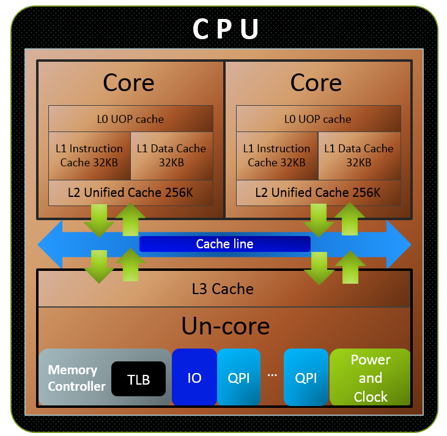
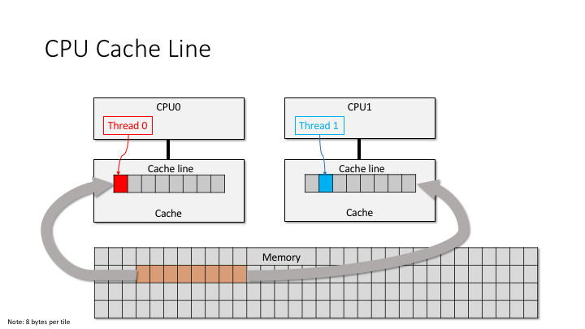
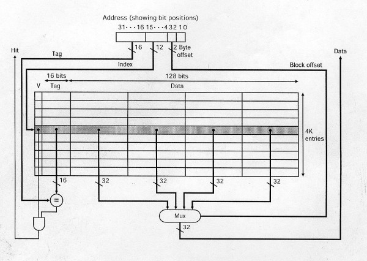
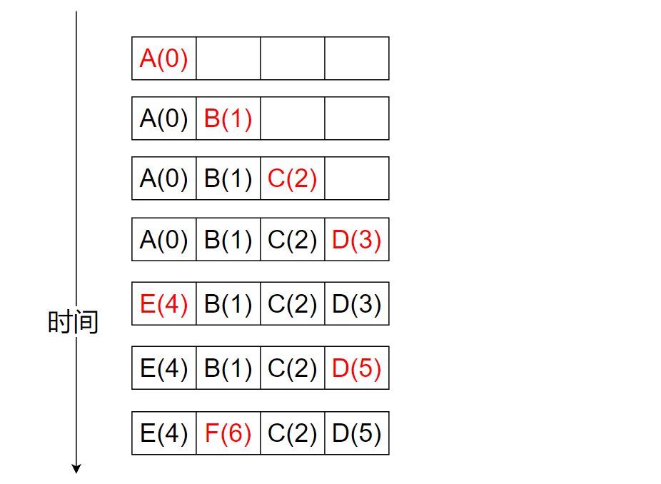
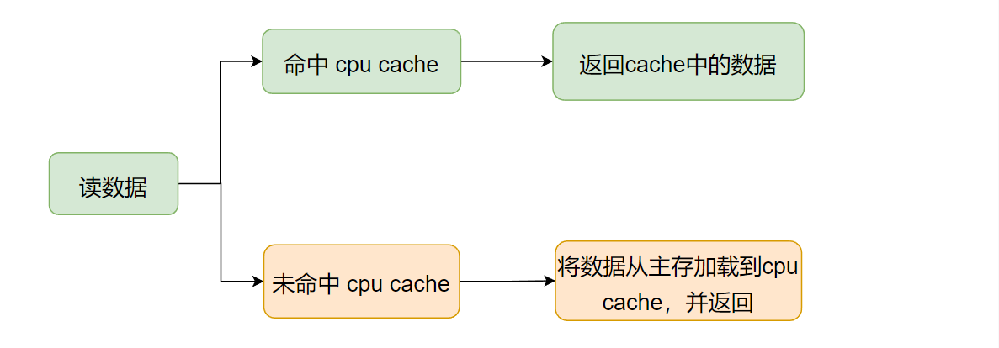
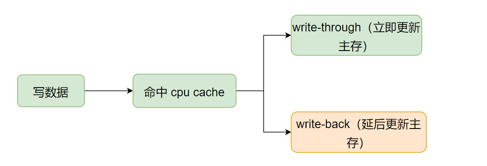
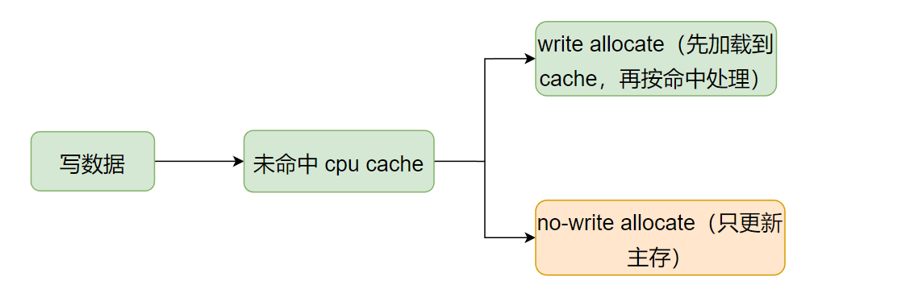
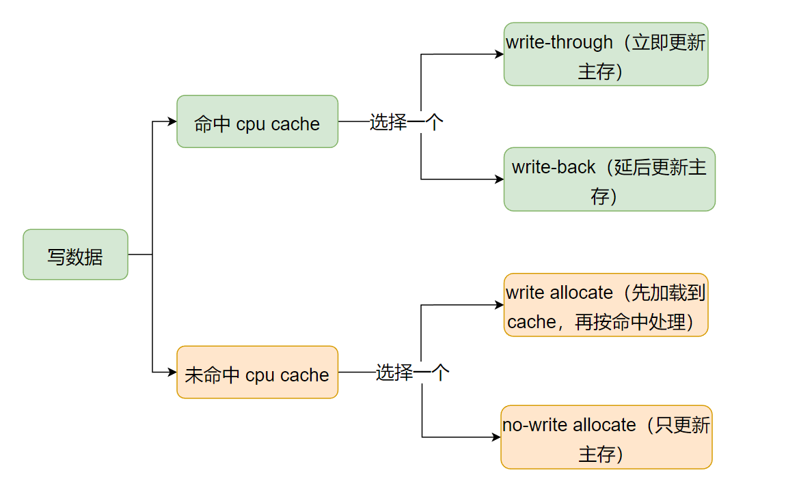
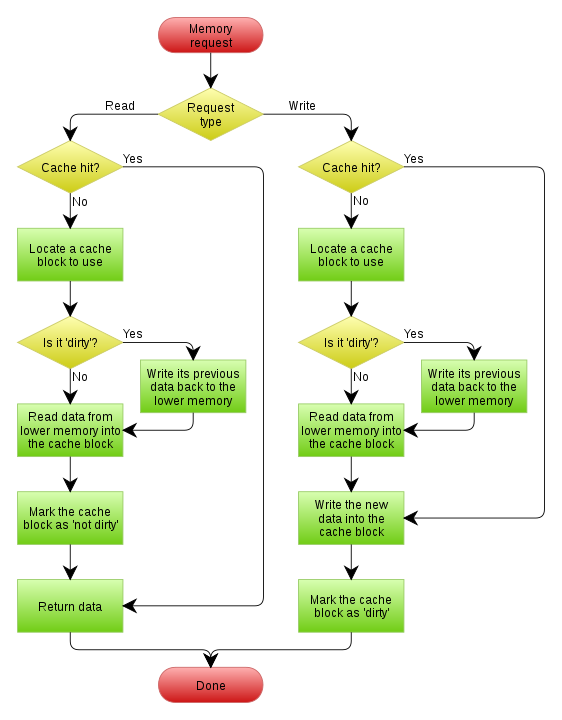
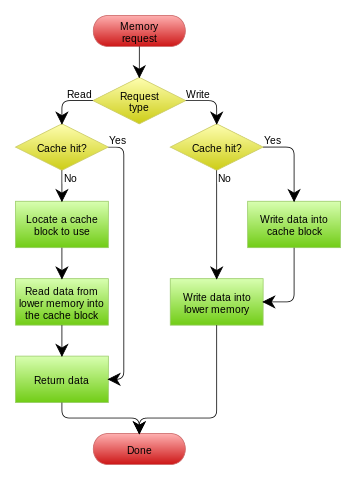

CPU 缓存是 CPU 使用的一种硬件缓存，该缓存的存储空间小，但访问速度很快。该缓存中存储的是经常访问的主存数据的副本，目的是为了减少 CPU 访问数据的平均时间成本。

<!--more-->

***

#### 1 CPU cache：
多数 CPU 中的 CPU cache 都是被组织成层次结构，形成多级缓存。
如下图所示：一个双核 CPU 中多级缓存的例子。

图片源自【1】

L1级缓存会再分为L1 指令缓存，和L1 数据缓存。L1拆成指令和数据两个独立的缓存，可以使得流水线在一个周期内同时取缓存中的指令和数据。此外，缓存如果满了，需要有替换策略（删除一个旧的缓存行，给新缓存行腾空间），指令和数据的行为和访问热点区别较大，L1分成独立的指令缓存和数据缓存，可以方便各自使用不同的替换策略。

其中：
- 大小方面：L1缓存 < L2缓存 < L3缓存
- 速度方面：L1缓存 > L2缓存 > L3缓存
- 查找顺序，先L1，找不到数据再查L2，之后是L3
- 关于为什么以多层级的形式组织缓存结构，可以参考这篇文章：[为什么CPU有多层缓存](https://toutiao.io/posts/zafunq/preview)
- 多核CPU中的每个核心，有自己的私有cache（L1、L2），这增强了性能（访问私有cache时，不会和其它核心冲突，所以减少了访问冲突时的处理过程），但也引入了额外的使用复杂性（一个数据同时存在于多个核心的私有cache中，每个核心改变自己的L1 cache中的这个数据时，需要同步给其它核心）。

####  2 Cache line
数据在内存和CPU 缓存之间传输时，是以固定大小的数据块为单位，称为**缓存行（cache line）或缓存块（cache blocks）**。当一个缓存行被从内存中复制到 `cpu chache` 中时，就会创建一个**缓存条目（cache entry）**。**缓存条目**中包含了从内存中复制的数据（cache line）、该数据在内存中的地址（tag，实际为地址中的一部分）、以及是否有效（flag）标记。**缓存条目**如下图所示：
| flag bits | tag | cache line |
| :-----:| :----: | :----: |

  

下图为内存中的一块数据（cache line），被复制到 cpu cache 中的，线程访问该 cache line 中某个位置的数据示例：

图片源自【1】

  

CPU需要访问内存中的某个位置时，它首先会在 cpu cache 中检查数据是否在 cache 中，一种查找实现方式（direct mapped cache）如下图所示：

图片源自【1】

 
图中所示的 cpu cache，包含了 4K 个**缓存条目（cache entry）**，每个缓存条目中包含的**数据（Data）** 为 16字节（4个 data block，每个data block一般为机器字长，32位机器就是32bit，64为机器为64bit）。

图中，待访问的数据的地址（图中的Address）表示为三部分：
- Tag：高 16位
- Index：4-15位
- offset：2-3位
  
访问过程为：根据访问地址（图中的Address）`Index`，定位到 cpu cache 中的某个 **缓存条目（cache entry）**，比较该**缓存条目**中的`Tag`是不是和 Address 中的`Tag`相同。如果相同，并且**缓存条目**的有效标记位（上图中的`v`）也是有效值，则表明缓存命中（hit），之后根据 Address 中的 `offset`，从**数据（Data）** 中取出对应位置的数据（图中为一个字，32bit）。
反之，如果缓存未命中，则会在 cpu cache 中分配一个新的**缓存条目**，并从内存中复制数据所在的 cache line 到该**缓存条目**中，然后再从cpu cache 中执行访问请求。

多核 CPU中，核心之间的交互式 以及 核心和内存之间的数据同步，都是通过**缓存条目**来进行的，即同步粒度为 cache line，一般x86 CPU的cache line大小为 64字节。
- `cache bouncing`：多核CPU中，当一个核心，在改写自己的 L1 cache 中的某个 cache line 中的一个数据后，CPU需要执行cache一致性算法，将该 cache line 同步给其它核（如果其它核上的cache 也有这个cache line），这个同步过程相比写 L1 cache 需要更多的处理时间。如果，多核CPU中，两个线程，频繁的修改同一个变量，这会使各自核心上该变量所在的cache line，需要不停的同步给其它核，这会额外引入大量同步时间。可以使用 thread_local来处理这种问题。
- `cache false sharing`：如果多核CPU中两个线程，线程A 频繁的修改全局变量A；线程B 频繁的修改全局变量B，变量A 和变量B 在内存中刚好是连续的，在一个cache line中。那么，即使这两个线程访问的是不同的变量，还是会导致两个核心之间需要不停的相互同步cache line。可以使用`alignas(64)`让变量以cache line的长度对齐，避免它们处于同一个cache line中。

#### 3 Replacement policies
`cpu cache`相对主存来说很小，一般从几十KB 到几十 MB。当`cpu cache`存满后，如果此时访问的一个数据不在`cpu cache中`，则需要将该数据所在`cache line`从主存加载到`cpu cache`中，因此需要从当前`cpu cache`中删除一条旧的`缓存条目`（cache entry），来存放新加载的条目。用来选择要删除的缓存条目的方法称为`替换策略（Replacement policies）`。所有替换策略，都面临一个基本问题：如何预测现有缓存条目中，哪一个在未来最不可能被使用。未来难以预测，所以没有完美的方法在各种可用的替换策略中进行选择。
一个比较流行替换策略，是最近最少使用（LRU）策略。该策略总是删除最近最少访问的那个缓存条目。如下图所示，假设 `cpu cache`中可以存放 4 个缓存条目，数据访问顺序为 A B C D E D F，并且每个数据在主存中属于不同的`cache line`中，图中数字表示时间信息，数字越小，表示访问的越早：

图片源自【5】

 

当缓存未满时，访问的 A B C D 会依次加载到 `cpu cache`中，并记录下时间信息。
当访问 E 时，`cpu cache`未命中，则需要将其从主存加载到`cpu cache`中。此时，A 是最近最少访问的，则替换掉 A。
当访问 D 时，`cpu cache`命中，此时，需要更新 D 的访问时间。
当访问 F 时，`cpu cache`未命中，则需要将其从主存加载到`cpu cache`中。此时，B 是最近最少访问的，则替换掉 B。

如果某些内存区域的数据，几乎不会被再次访问，那么就没必要将其放入`cpu cache`中。因此，可以将这些内存区域标记为不可缓存，避免了在不会再次访问的情况下，将其数据内容加载到`cpu cache`中造成的额外开销，提高数据访问性能。

#### 4 Write policies

涉及`cpu cache`时：
对于读理解起来比较简单。
要读的数据命中了`cpu cache`，则直接读出来即可。
要读的数据没有命中`cpu cache`，则将数据从主存中加载到`cpu cache`中，然后再返回数据。这样，后续的相同的读操作，都可以从`cpu cache`中立刻得到数据。

对于写，就比较麻烦了，当数据命中/未命中cpu cache时，均有不同的处理策略。
##### 4.1 当要写的数据命中了`cpu cache`：
此时，会更新`cpu cache`中的相应数据，但数据最终还是得写到主存里的，什么时候将其写回主存中？**用来决定什么时候将 cpu cache 中更新的数据写回主存的策略，就是 write policies**。
两个基本的写回主存策略：
  - Write-through：每次写操作更新`cpu cache`时，同时将数据也写回主从中。耗时久，但是每次更新数据都会立刻同步回主存。
  - Write-back：每次写时仅更新`cpu cache`，同时将该`缓存条目`设置`脏标记`。之后，当该缓存条目后续被换出时（缓存满了，它又是最久没使用的），如果检测到有`脏标记`（表明数据有变更），就会将该缓存数据写回到主存中。这种特性也被称为惰性写入（lazy write），数据写回主存的动作被延后了。耗时短，并且可以节省cache和主存间的带宽（例如，当短时间内频繁改动某个cache中的数值，Write-through每次都会将cache中的变动同步回主存，而write-back只更新cache，必要时才会将改动同步回主存）。

如下图所示:
  

PS：对于 Write-through，每次更新数据立刻写回主存会比较慢，一种折中的方案是，更新 cpu cache 后，数据同样“立刻”写回主存，但写操作会暂时保存在一个存储数据队列（store data queue）中，当累积了多个写操作后，再一起更新回主存（提供总线利用率）。

PS：对于Write-back 策略，也不是必须等到缓存条目被换出时，才将数据写回主存（如果数据被更新了），也有其它策略可以主动触发数据（cpu cache 中被更新的数）回写到主存中。例如，当对大量在`cpu cache`中的数据修改后，可以显示地通知`cpu cache`，将脏数据写回主存。

##### 4.2 当要写的数据没有命中`cpu cache`：
上面的`写回策略（write policies）`（将`cpu cache`中的缓存数据写回到主存中），是应用在写操作命中`cpu cache`后的处理。如果写操作没有命中呢？

**没命中 cpu cache 的情况下，使用的处理方式称为 write-miss policies**，同样有两种处理方式：
- Write allocate（also called fetch on write）：先将数据从主从中加载到`cpu cache`中，此时数据等于就是命中了，之后就按上面的写操作命中`cpu cache`的流程走（数据先更新到缓存中，再按`Write-through`或`Write-back`策略写回主存中）。
- No-write allocate（also called write-no-allocate or write around）：不管`cpu cache`了，直接将数据更新到主存。

如下图所示：

综上，在写数据情况下。如果数据命中了`cpu cache`时，先更新`cpu cache`再将数据写回主存，数据写回主存的时机，有多个策略（**write policies**）可以选择。如果没有命中`cpu cache`，也存在多种处理方式（**write-miss policies**）。如下图：

因此，需要在写回策略（write policies）中选择一个（处理cpu cache命中的情况），以及在 write-miss 处理策略中选择一个（处理cpu cache未命中的情况）。它们是可以任意组合的，但一般情况下它们是这样组合的：

- 当使用 write-back 写回策略（立即写cpu cache，但数据延后再写回主存）来处理命中`cpu cache`的情况时，未命中`cpu cache`时的处理策略会选择 write allocate（先加载到cpu cache中，后续按命中策略处理）：

    这种组合方式下，写操作后紧接着的读或写都很快，因为数据在cpu cache里。但是，由于使用write-back策略时，cpu cache中的`缓存条目`有脏标记，所以每次我们需要删除一个旧缓存条目时（腾空间放新数据），需要判断该数据是否已脏，数据脏了需要将其内容写回到主存中（数据写回主存操作被延后到该cache line被换出时）。如下图所示：
    
    

    图片源自【4】
    

     
    上图中，以写过程为例，解释如下：
    写操作，命中 cpu cache 时：数据写入 cpu cache，标记该数据所在的缓存条目为“脏”（之后，当该缓存条目被换出时，检查到有“脏”标记，就会将数据写回主存中）。
    写操作，未命中 cpu cache时（考虑此时cpu cache已经满了，所以需要删除一个旧的来存新的）：假设，数据从主存加载到cpu cache时，会存储在cpu cache 中的位置 A 处。因此，需要先检查位置 A 处的旧缓存条目是否有“脏”标记。如果没有“脏”标记，新数据直接覆盖该跳缓存条目中的旧数据即可；如果有“脏”标记，则需要先将该缓存条目中的旧数据写回主存，然后再用新数据覆盖该缓存条目中的旧数据。最后，设置这条新的缓存条目中的“脏”标记（因为新数据只写了cpu cache，还没写回主存）。
 

- 当使用 write-through 写回策略（写cpu cache时，同时写回主存）来处理命中`cpu cache`的情况时，未命中`cpu cache`时的处理策略会选择 no-write allocate（直接将数据更新到主存中，不管 cpu cache）：
  
    这是由于，对于命中的情况，既然已经选择了write-through，那么数据每次更新都会同时写入cpu cache和 主存。那么未命中时，就没必要将数据先从主存中加载到cpu cache，再更新。因为这对后续的写没啥积极作用（每次写都会立即写回到主存的）。（后续可能是写操作，也可能是读操作，对于写操作，已经明确了将数据加载到cpu cache中没有积极作用。对于读，这里加载和后续实际读的时候再加载，成本是一样的。所以也就没必要为了不一定会有的读操作，在写操作上引入额外的开销——数据从主存加载到cpu cache的消耗 ）
  .
    这种组合下，对数据的写操作，都是立即更新到主存的，没有延后执行。因此，也就没有“脏”数据的概念了，数据的读写流程更简介：
    
    

    图片源自【4】
    

     
    如上图：

    对于写来说，命中了 cpu cache 就更新 cpu cache，同时更新主存。没命中 cpu cache，直接更新主存即可。
    对于读来说，命中了数据，直接返回 cpu cache 中的数据即可。没命中 cpu cache，则将数据从主从中加载到 cpu cache 中，然后再返回数据。

综上：
write-back 和 write allocate 的组合方式，平均的读/写效率都较高，但当cpu cache 换出的旧缓存条目有“脏”标记时，就需要额外的时间消耗——将该旧缓存条目数据写回主存的时间消耗。

write-through 和 no-write allocate 的组合方式，读操作很快（只有要读的数据不在cache 中时，才涉及从主存将数据加载到cache中。不会因为要换出一个有“脏”标记的旧数据，而引入额外的写主存操作）。但写操较慢，因为每次都需要将数据立即写回到主存中。

#### 参考连接：
【1】[http://gavinchou.github.io/summary/c++/memory-ordering/](http://gavinchou.github.io/summary/c++/memory-ordering/)
【2】[https://en.wikipedia.org/wiki/Memory_ordering](https://en.wikipedia.org/wiki/Memory_ordering)
【3】[https://en.wikipedia.org/wiki/CPU_cache](https://en.wikipedia.org/wiki/CPU_cache)
【4】[https://en.wikipedia.org/wiki/Cache_(computing)](https://en.wikipedia.org/wiki/Cache_(computing))
【5】[https://en.wikipedia.org/wiki/Cache_replacement_policies#LRU](https://en.wikipedia.org/wiki/Cache_replacement_policies#LRU)