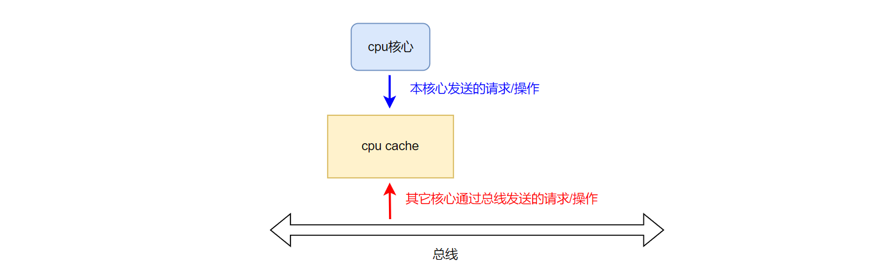
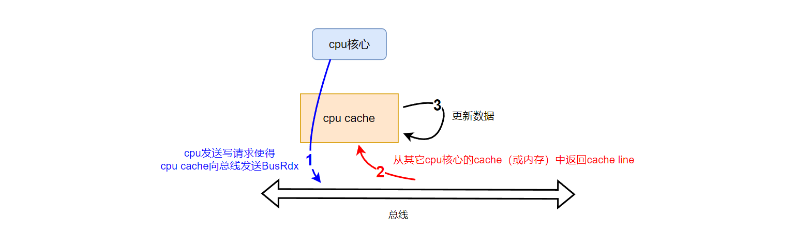
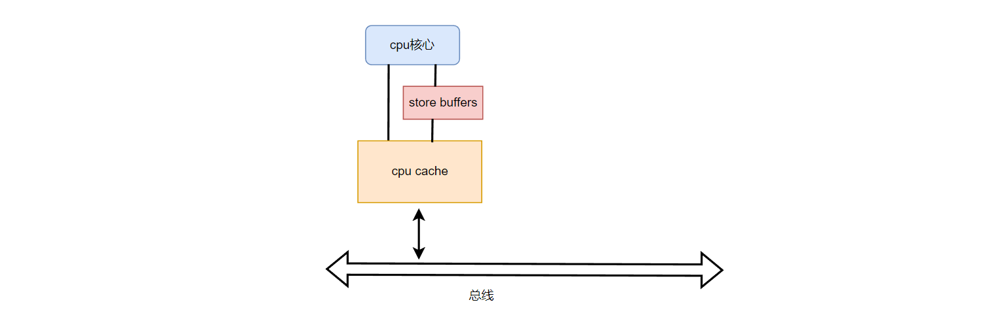
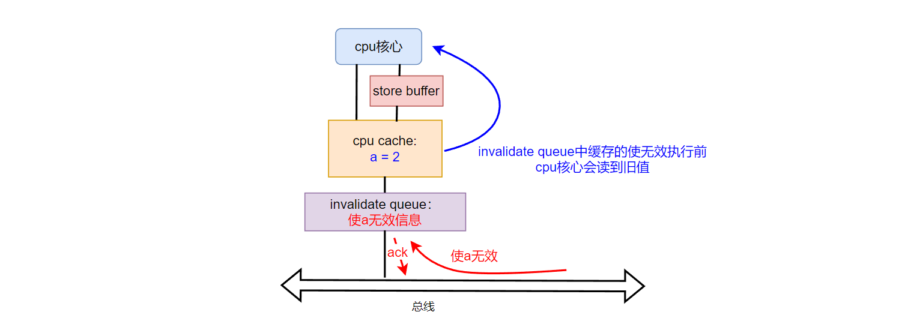

<center>
Memory Barriers 和 store buffers、invalidate queues
</center>
<!--more-->

***

[MESI一致性协议](https://fengxun2017.github.io/2023/02/16/memory-ordering-MESI/)一文中，介绍了cpu cache中的[cache line](https://fengxun2017.github.io/2022/12/18/memory-ordering-cpu-cache/#2-Cache-line)（`cpu cache中所存储数据的基本单位，现代CPU中一般为主存中的64字节组成一行放在cpu cache中`）的各种状态，以及状态间转换规则。

对于应用 MESI一致性协议的cpu cache来说，它要感知两个方向的请求（操作）。一个是cpu侧，即本cpu核心发送过来的请求；另一个是总线侧，即其它cpu 发送过来的请求（操作）。如下图所示：


#### 1 Store Buffers

先看一个具体的例子，假设当前 CPU 中存在两个核心`P1`和`P2`
`P1`需要写目标数据，但该数据所在`cache line`在 `P1`的 `cpu cache`中为`invalid`状态。因此，`P1 cache`需要先获得数据所在的整行`cache line`数据，再修改其中的目标数据并放入自己`cache`中。
为了获得目标数据所在`cache line`，`P1 cache`需要向总线发送`BusRdx`，等待从`P2`的`cpu cache`中获得相应的`cache line`（如果`P2 cache`中有的话）或主存（内存）中获得相应的`cache line`。

上述写操作的流程可以看做如下几个步骤：
- `P1核心`的写操作使得`P1 cache`向总线发送`BusRdx`。(`P2`看到后会将自己cache中的对应`cache line`设置为invalid，并将该`cache line`发送到总线上)
- 等待`P2 cache`（或主存）将目标数据所在cache line发送到总线上
- `P1 cache`从总线上获得响应，修改数据并放入自己的cache中

如下图所示：

其中，第二步等待数据响应比较耗时。

如果一个操作序列是：写、写、读、读、读。 对于后续的三个读来说，必须等前面两个写完成，而写操作本身可能涉及等待响应数据（等待数据时，没事做），因此效率低。

改进的方案是，将写操作异步化，在`cpu核心`和`cpu cache`中间增加一个`store buffer`，用来缓存需要写的数据，如下图：


增加了 `store buffer` 后，对于操作序列：写、写、读、读、读
前面写操作，`cpu核心`会将需要写入的数据会先放入`store buffer`，同时`cpu cache`通过总线请求从其它核心的`cache`中（或主存）获得目标数据所在`cache line`。此时，就可以执行后续的读操作了（尽管前面的写操作还未实际完成）。
之后一段时间，当之前写操作请求的`cache line`从总线上返回后，`store buffer`再执行其中缓存的写操作。
因此，通过引入`store buffer`后，提高了系统的运行效率。


引入 `store buffer`后，虽然提高了系统的运行效率。但是`cpu核心`提交的写操作可能没有及时写入`cpu cache`中（仍在`store buffer`中）。考虑下面这两行代码：
```c
a = 1;
b = a + 1;
```
假设：运行这段代码的cpu核心的cache中并没有缓存`a`。
那么访问`a`就命中不了自己cache中的数据，因此`a = 1`会放到`store buffer`中延后执行。
之后，执行`b = a + 1`时，此时需要读（加载）`a`的值，如果仅从cache中读，就获得不到cache中的值（已经假设不在本`cpu cache`中）。因此，使用了`store buffer`后，当`cpu核心`需要读取（加载）数据时，不仅需要查看自己的`cpu cache`，还要查看自己的`store buffer`，看是否有更新的数据在`store buffer`中，还未写入cache。


#### 2 Memory Barriers 之 store barrier
`store barrier`的存在和 `store buffer`有关。在使用了`store buffer`后，由于写入的数据可能没有及时刷新到cache 上，造成多核心处理器中多线程间的数据依赖出现问题：

考虑下面一段代码
```c

//该函数在核心 P1 上运行
void foo(void)
{
    a = 1;
    b = 1;
}

// 该函数在核心 P2 上运行
void bar(void)
{
    while (b == 0) continue;
    // 逻辑上 b=1了，a应该也等于1
    // 但由于store buffer的存在会导致P2 此时看到的 a 不一定等于 1.
    assert(a == 1);
}
```

假设条件： 
a，b 初始值都为 0。
函数foo 在核心 `P1` 上运行，并且`P1 cache`中没有缓存`a`，但缓存了`b`。
函数bar在核心 `P2` 上运行，并且`P2 cache`中没有缓存`b`，但缓存了`a`。

一种可能导致运行断言错误的执行序列：
1：P1 执行 a = 1，由于a 不在自己的cache 中，a=1放到store buffer中，并向总线发送BusRdx。（P1会在之后某个时间收到该指令时，会将自己的cache中对应的cache line设置为invalid，并且将该cache line发送到总线中，P1就能通过总线获得）
2：P1 执行 b = 1，由于b 在自己的cacha 中，直接修改。
3：P2 执行 b==0 判断，由于b 不在自己的cache中，P2向总线发送 BusRd，P1看到后将自己cache中的发送到总线，P2从总线获得该数据。此时获得的是b = 1，判断不成立跳出循环。
4：P2：执行assert(a == 1)，**此时如果P2 还没看到 P1之前向总线发送的 BusRdx，那么P2就会使用自己cache中的a = 0。 那么断言就出错了**。
（或者P2看到了，自己cache中的`a`变为无效了，于是又请求P1 cache发过来，但p1 cache中此时还是旧的，store buffer还未写入？）

这就需要在软件层面上，处理由于`store buffer`的缓存效果，导致数据生效顺序不满足“期望”的问题。
对于`a = 1; b = 1;`我们期望的目标是，b=1生效了，那么a=1也应该生效（能被其它cpu看到）。这就要用到`store barrier`
`store barrier` 是一条指令（写屏障指令， 不同系统提供的指令名不一样，这里就用store barrier代替），该指令的作用是**将当前`store buffer`中的数据刷新到cache之后，再执行`store barrier`指令之后的写操作**。
将 foo 函数中添加写屏障指令
```c
//该函数在核心 P1 上运行
void foo(void)
{
    a = 1;
    store_barrier;   // 确保在 写 b 之前，a 的写操作已生效到cache中
    b = 1;
}
```
如此，就能确保 P1中对a 的修改，能及时被P2 看到（使P2能看到b=1，就一定能看到a = 1）。


#### 3 Invalidate Queues

`store buffer`是在`cpu 核心`和`cpu cache`之间的一个更小的缓存。
而`invalidate queue`则是在`cpu cache`和总线之间的一个更小的缓存。如下图所示：


`invalidate queue`的目的是为了临时缓存"使无效请求"。考虑下面的一个例子：

两个核心`P1`，`P2`的cache中都存在某个变量`var`的缓存（状态都是Shared）。当`P1`修改`var`时，需要通知`P2`让其将自己cache中的`var`所在的cache line设置为invalid 状态。其过程如下：
- `P1`修改`var`时，会向总线发送`BusUpgr `。
- `P2`在总线上看到`BusUpgr`后，需要将自己cache 中的目标cache line设置为invalid状态（因为P1要修改了），并回复 ack。
- `P1`看到ack 后，就可以修改自己cache中的数据了。

这里`P2`在总线上看到的`BusUpgr`，就相当于一个“使无效请求”，因为看到看信息，就需要将自己cache 中的目标cache line 设置为invalid 状态。

但上述过程的第二步，`P2`将自己cache 中的目标cache line设置为invalid状态，再回复 ack。
当`P2`的cache 比较繁忙时，设置目标cache line设置为invalid状态，这个操作可能不能立刻执行，会被延后，那么就不能及时回复ack ，导致`P1`需要原地等 ack。

`invalidate queue`就是针对上述情况，当`P2`从总线上收到“使无效请求”时，会先缓存在`invalidate queue`中，并立刻回复 ack，这样`P1`就能很快收到ack，并执行后续动作了。 而`invalidate queue`中缓存的“使无效请求”会在cache 不忙时执行。如此，提高了系统的运行效率。

如同在引入 `store buffer`后，本核心读数据时，需要先查自己的`store buffer`。
引入`invalidate queue`后，本cpu cache在修改自己cache line的状态时，也需要查看下自己的`invalidate queue`。因为，可能要修改的cache line都已经无效了，只是还在`invalidate queue`中还未同步到cache 上。

#### 4 Memory Barriers 之 read barrier

`read barrier`和`invalidate queue`相关
当“使无效请求”  被缓存在`invalidate queue`中，可能使得cache 中本该被设置为invalid的cache line，被本核心误认为是有效的。如下图所示：


仍旧考虑之前的样例代码：（已经针对store buffer添加了 store barrier）
```c

//该函数在核心 P1 上运行
void foo(void)
{
    a = 1;
    store_barrier;   // 确保在 写 b 之前，a 的写操作已生效到cache中
    b = 1;
}

// 该函数在核心 P2 上运行
void bar(void)
{
    while (b == 0) continue;
    assert(a == 1);
}
```

假设条件： 
a，b 初始值都为 0。
P1、P1的cache 中都有缓存 `a`，因此状态都为Shared。
但 `b` 仅在 P1 的 cpu cache 中。

一种可能导致运行断言错误的执行序列：
1：P1 执行 a = 1，由于a 在自己的cache中，这种情况虽然不用从P2 的cache（或主存）获取数据，但还是需要向总线发送`BusUpgr`，告知P2，自己修改数据了。（对P2 来说，看到的`BusUpgr`就是“使无效请求”）
2：P2 从总线上看到`BusUpgr`，但放入invalidate queue 中了，并回复ack。（此时P2 cache中的a 仍旧是旧值0）
3：P1 执行 b = 1，由于b 在自己的cacha 中，直接修改。
4：P2 执行 b==0 判断，由于b 不在自己的cache中，P2向总线发送 BusRd，P1看到后将自己cache中的相应cache line发送到总线，P2从总线获得该数据。此时获得的是b = 1，判断不成立跳出循环。
5：P2：执行assert(a == 1)，**此时如果P2 的invalidate queue还未执行其中缓存的“使无效请求”，那么P2就会以为自己cache中的a 还是有效的，于是获取到 a = 0。 那么断言就出错了**。


因此，同样需要在软件层面上添加额外处理，避免由于`invalidate queue`的缓存效果，cpu 核心获得到自己cache 中本该已经无效的数据。

对于`assert(a == 1)；`，我们期望在判断前，本核心的`invalidate queue`中缓存的“使无效请求”都能被执行，使得本核心能够确保感知到其它核心执行的写操作（正是由于其它核心的写操作，才会使得本核心cache 中响应数据需要变为无效）。这就要用到`read barrier`
`read barrier` 同样也是一条指令（读屏障指令， 不同系统提供的指令名不一样，这里就用read barrier代替），该指令的作用是**将当前`invalidate queue`中“使无效请求”全部执行完，再执行`read barrier`指令之后的读操作**。

将 bar 函数中添加读屏障指令：
```c
// 该函数在核心 P2 上运行
void bar(void)
{
    while (b == 0) continue;
    // 执行invalidate queue中的使无效请求
    // 使得 P2 能看到 P1 的写操作，从而使得自己cache中的a 变为无效
    read_barrier; 
    // 如此，这里读的a就不能命中缓存了，只能向总线发送BusRd，
    // 之后P1 将其更新后的a 发送到总线上，P2 就能获得最新的 a = 1了 
    assert(a == 1);
}
```

<br>
<br>

#### 参考资料：
【1】[https://en.wikipedia.org/wiki/Cache_coherence](https://en.wikipedia.org/wiki/Cache_coherence)
【2】[https://en.wikipedia.org/wiki/MESI_protocol](https://en.wikipedia.org/wiki/MESI_protocol)
【3】[https://en.wikipedia.org/wiki/Directory-based_cache_coherence](https://en.wikipedia.org/wiki/Directory-based_cache_coherence)
【4】[https://en.wikipedia.org/wiki/Bus_snooping](https://en.wikipedia.org/wiki/Bus_snooping)
【5】[https://xiaolincoding.com/os/1_hardware/cpu_mesi.html](https://xiaolincoding.com/os/1_hardware/cpu_mesi.html)
【6】Memory Barriers: a Hardware View for Software Hackers