<center>
使用 stm32H747 中的 DCMI 模块，获取 OV5640 摄像头数据
</center>

<!--more-->

***

### 1 照相机模块和基本概念

#### 1.1 成像的基本概念

像素：图像上的每个点，体现了彩色图像的颜色或黑白照片的灰度。

分辨率：图像中像素的数量。像素越多，图像尺寸越大。当图像尺寸相同时，像素的数量越多，图像包含的细节越丰富。

色深（位深）：用于指示像素颜色的位数。也被称为每像素位数（bpp）。
- 对于二值图像，每个像素包含一位。每个像素为黑色或白色（0或1）。
- 对于灰度图，图像通常为2 bpp（每个像素可以有4级灰阶中的1级）至8 bbp（每个像素可以有256级灰阶中的1级）。
- 对于彩色图像，每个像素的位数为8至24不等（每个像素最多可以有16777216种可能的颜色）


帧率：每秒传输的帧（或图像）数，表示为帧每秒（FPS）

水平消隐(Horizontal blanking)：一行末尾与下一行开头之间被忽略的行。
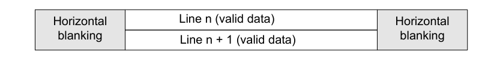

垂直消隐(Vertical blanking)：帧最后一行末尾与下一帧第一行开头之间被忽略的行。
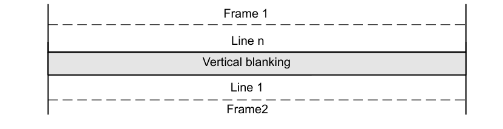

逐行扫描：在构建图像时，逐行扫描时，先绘制第一行，然后是第二行，直到整帧完成。

隔行扫描：每一帧分为两个场，即奇数行(1,3,5..)和偶数行(2,4..)。在构建图像时时，先画奇数行，再画偶数行，交替显示。

#### 1.2 颜色概念

**亮度（Brightness）**：
通常与 RGB 三通道的整体强度相关，可以近似用加权平均计算：`𝐿 = 0.299⋅𝑅 + 0.587⋅𝐺 + 0.114⋅𝐵`
调高亮度就是同时提高 R/G/B 的数值，调低则降低。

**对比度（Contrast）**
对比度不是单个像素的属性，而是图像整体的 亮度差异范围。在数值上，常用公式：
`C = (𝐿𝑚𝑎𝑥 − 𝐿𝑚𝑖𝑛) / (𝐿𝑚𝑎𝑥 + 𝐿𝑚𝑖𝑛)` 
提高对比度意味着把亮的像素更亮，暗的更暗（拉伸亮度范围）。

**饱和度（Saturation）**
饱和度是颜色相对灰度的偏离程度。转换到 HSL/HSV 空间时，饱和度定义为：
`𝑆 = (𝑚𝑎𝑥(𝑅,𝐺,𝐵) − 𝑚𝑖𝑛(𝑅,𝐺,𝐵)) / 𝑚𝑎𝑥(𝑅,𝐺,𝐵)`
降低饱和度就是让 R/G/B 更接近，趋向灰色。

**透明度（Opacity / Alpha）**
透明度描述一个像素的“可见程度”或“遮挡程度”。前景图像的透明度决定其与背景的融合程度。


#### 1.3 照相机模块

照相机模块由四部分组成：图像传感器、镜头、印刷电路板（PCB）和接口

镜头：镜头是一种光学镜片，能够将真实场景的光线聚焦到图像传感器上。

图像传感器：一种模拟设备，能够将接收到的光转换为电子信号。这些信号传输构成数字图像的信息。数字照相机中可以使用两种类型的传感器： 
- CCD (电荷耦合器件)：传统方案，成像质量好，但功耗高、成本高。
- CMOS (互补金属氧化物半导体)：成本低、功耗低、集成度高，现在已经成为主流。


印刷电路板 (PCB)：摄像头的“底座和电源管理中心”，是摄像头模组里的电路板，负责：给传感器提供合适的电源极性和稳定性。支撑和连接整个摄像头模块的其他元件。


照相机模块的互联：照相机接口是一种桥接器，能够将图像传感器连接到嵌入式系统并发送或接收信号。照相机与嵌入式系统之间传输的信号主要是：
• 控制信号
• 图像数据信号
• 电源信号
• 照相机配置信号。
根据数据信号的传输方式，可将照相机接口分为两种类型：并行和串行接口。


#### 1.4 照相机模块与嵌入式系统的连接（并行接口）
照相机模块需要四种主要类型的信号来正确发送图像数据：控制信号、图像数据信号、电源信号和照相机配置信号。

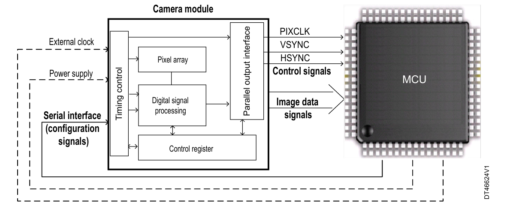

控制信号：摄像头模块和MCU间进行时序同步（时钟、HSYNC、VSYNC）。

图像数据信号：传输像素数据，宽度决定带宽。

电源信号：提供工作电压。

配置信号：通过寄存器设置图像参数和接口模式
- 配置图像分辨率、格式（RGB/YUV/RAW）、帧率
- 配置图像质量参数（亮度、对比度等）
- 接口类型选择（并行接口 / 串行接口）


### 2 Stm32h747中的DCMI

DCMI通过AHB2外设总线连接到AHB总线矩阵。DMA将DCMI模块所接收到的图像数据搬移到目标内存中。

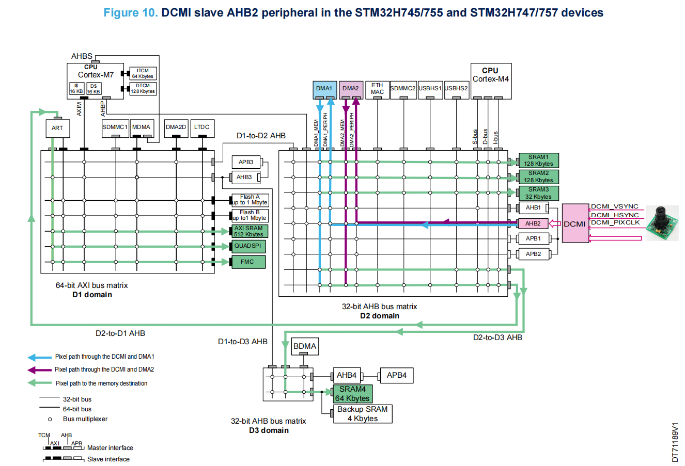


STM32H747 DCMI 特性：
- 接口类型：并行摄像头接口，支持 8~14 位数据线 + 像素时钟。
- 同步方式：支持 HSYNC/VSYNC 或嵌入式同步码。
- 采集模式：连续采集（视频流）或快照采集（单帧）。
- 功能：支持裁剪（只采集图像的一部分）。
- 时钟要求：AHB 时钟必须 ≥ 2.5 × PIXCLK。
- 数据格式：Raw Bayer、YCbCr 4:2:2、RGB565、JPEG 压缩。
- 8 级FIFO（8个32 位的硬件缓冲队列）
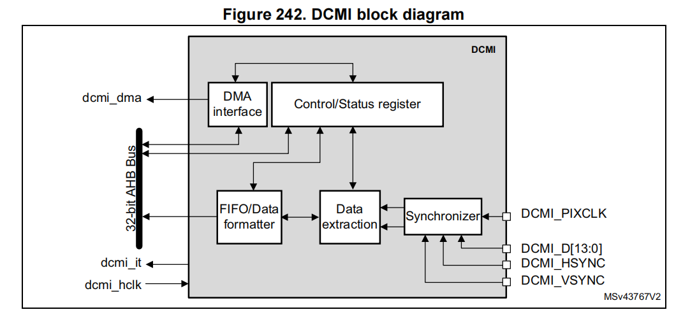


为了减少系统总线争用并避免数据丢失，即使在接口数据速率很高的情况下，接收的数据也会先打包到一个 FIFO 缓冲区中。根据接口位宽（8、10、12 或 14 位），2 或 4 个数据项会存储在一个 32 位字中。一旦形成完整的 32 位字，就通过 DMA 传输到内存。这种方式可以降低 DCMI 对总线带宽的占用，即使在高速情况下也能保证稳定。
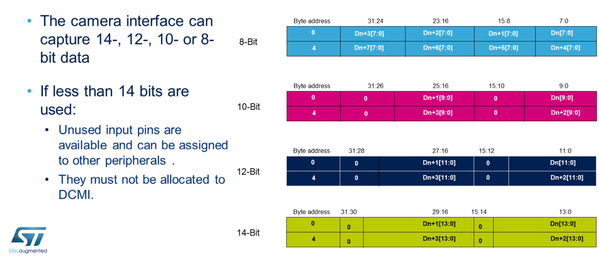

DCMI 可以选择每 2 个字节取 1 个，或者每 4 个字节取 1 个。这一功能可用于将彩色图像转换为黑白图像，或者缩小图像尺寸。在缩小图像的情况下，为了保持图像比例，DCMI 还可以只存储隔行数据，从而将垂直分辨率减半。


#### 2.1 硬件同步
DCMI_HSYNC (LINE VALID)：行同步信号，可以配置为 高电平有效 或 低电平有效。

DCMI_VSYNC (FRAME VALID)：帧同步信号，可以配置为 高电平有效 或 低电平有效。

DCMI_PIXCLK ：像素时钟，决定数据采样的时序。可以选择在 上升沿 或 下降沿 捕获数据。

当 VSYNC 或 HSYNC 处于“有效电平”时，表示处于 blanking 区间（即无效数据），当 VSYNC 或 HSYNC 处于“非有效电平”时，数据才是有效的。

下图为 HSYNC、VSYNC高电平有效，PIXCLK上升沿采样数据的示例：
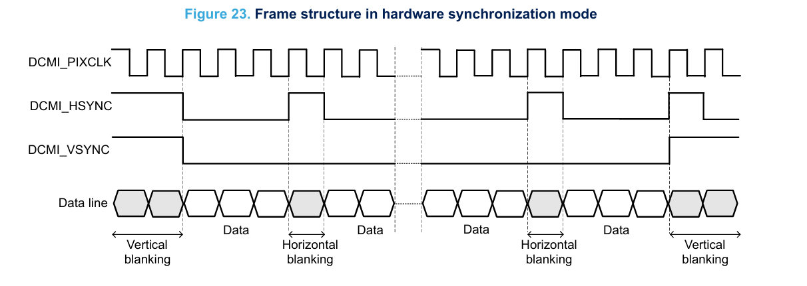


#### 2.2 快照模式
在快照模式下，仅捕获一个帧。
通过将DCMI_CR寄存器的CAPTURE位置1使能捕获后，接口等待帧起始信号（下一个DCMI_VSYNC）。在接收到第一个完整帧后，将自动禁用DCMI（CAPTURE位自动清零）并忽略所有其他帧。
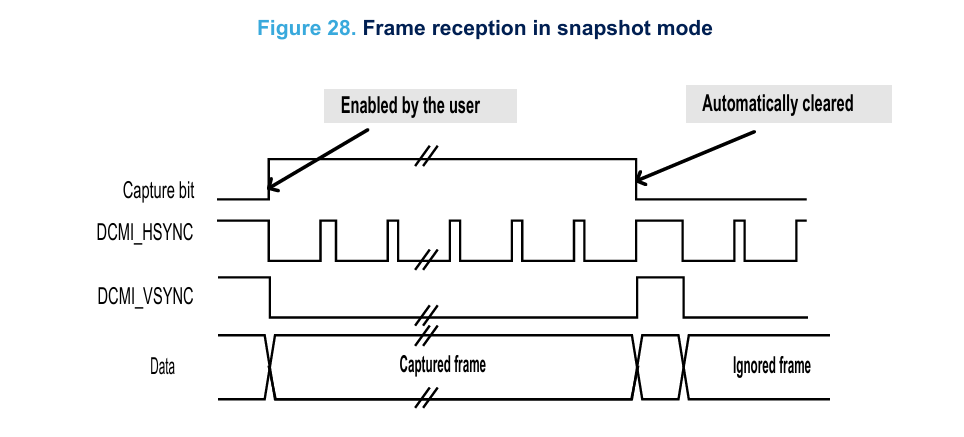


#### 2.3 连续采集模式

选择该模式并使能捕获（CAPTURE位置位）后，接口等待帧起始信号（下一个DCMI_VSYNC），之后连续捕获数据帧。

在该模式下，可以将DCMI配置为捕获所有帧、每隔一帧捕获一帧（减少50%带宽）或每四帧捕获一帧（减少75%带宽）。

在该模式下，照相机接口不自动禁用，用户通过将CAPTURE位清零将其禁用。在被用户主动禁用后，DCMI继续抓取数据，直至当前帧结束。
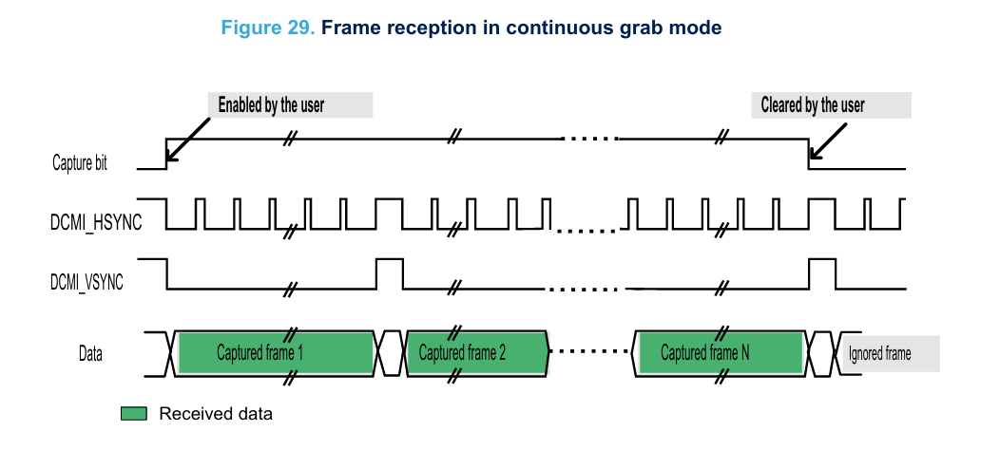


#### 2.4 数据格式和存储

DCMI支持以下数据格式：
- 8位逐行视频：单色或原始拜尔格式
- YCbCr 4:2:2 
  - Y表示亮度（黑和白）
  - Cb表示蓝色差色度
  - Cr表示红色差色度
- RGB565
- 压缩数据（JPEG）

对于单色、RGB或YCbCr数据，最大输入大小为2048 * 2048像素。JPEG压缩数据没有大小限制。

#### 2.5 DCMI 中断

可产生的中断类型
- IT_LINE：表示一行数据接收完成（End of Line）。
- IT_FRAME：表示一帧图像接收完成（End of Frame）。
- IT_OVR：表示数据接收溢出（Overrun）。
- IT_VSYNC：表示帧同步信号（Vertical Sync），用于检测新一帧的开始。
- IT_ERR：表示嵌入式同步码模式下的错误（Embedded Sync Error）。


中断屏蔽与全局中断
- 所有中断都可以通过软件屏蔽。
- dcmi_it：全局中断 = 各个中断的逻辑 OR。只要有一个事件发生且对应中断使能，就会触发全局 DCMI 中断。

应用程序在中断服务函数里再区分具体是哪一个事件，相关寄存器：
- DCMI_IER (Interrupt Enable Register)：可读写，用来使能或屏蔽某个中断。

- DCMI_RIS (Raw Interrupt Status)：只读，显示当前中断事件的原始状态（未屏蔽）。即使中断未使能，这里也能看到事件发生情况。

- DCMI_MIS (Masked Interrupt Status) ：只读，显示经过屏蔽后的中断状态。

只有在 DCMI_IER 使能的情况下，RIS 中的事件才会反映到 MIS。程序通常检查 MIS 来判断是否需要处理。
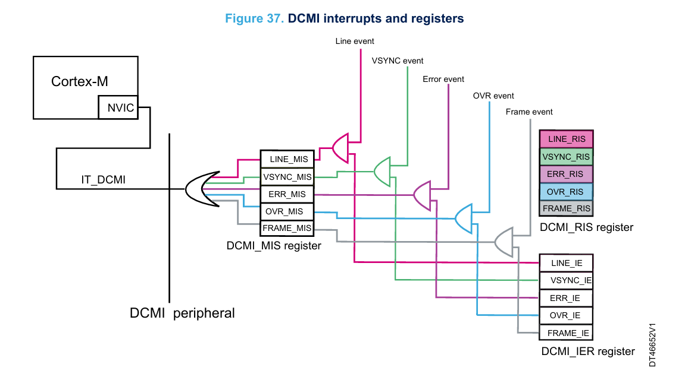


#### 2.6 DCMI至内存传输的DMA常用配置
对于DCMI至内存的传输：
- 传输方向必须是外设内存，通过配置DMA_SxCR寄存器中的DIR[1:0]位来实现。在这
种情况下：
  - 必须在DMA_SxPAR寄存器中写入源地址（DCMI数据寄存器地址）。
  - 必须在DMA_SxMAR寄存器中写入目标地址（内部SRAM或外部SRAM/SDRAM中的帧
缓冲区地址）。

- 为确保从DCMI数据寄存器传输数据，DMA等待DCMI生成请求。因此，必须配置相关的流
和通道。
- 由于每次填充DCMI数据寄存器时都会生成DMA请求，从DCMI传输至DMA的数据必须具有32位宽度。因此，DMA_SxCR寄存器中PSIZE位设定的外设数据宽度必须为32位字。
- DMA是流控制器：要传输的32位数据字的数量可在DMA_SxNDTR寄存器中进行软件设定，范围为1至65535。
DMA 可在以下两种模式下工作：
• 直接模式：从DCMI接收的每个字被传输到存储器帧缓冲区。
• FIFO模式：DMA使用其内部FIFO确保批量传输（多个字从DMA FIFO传输至目标存 
储区）

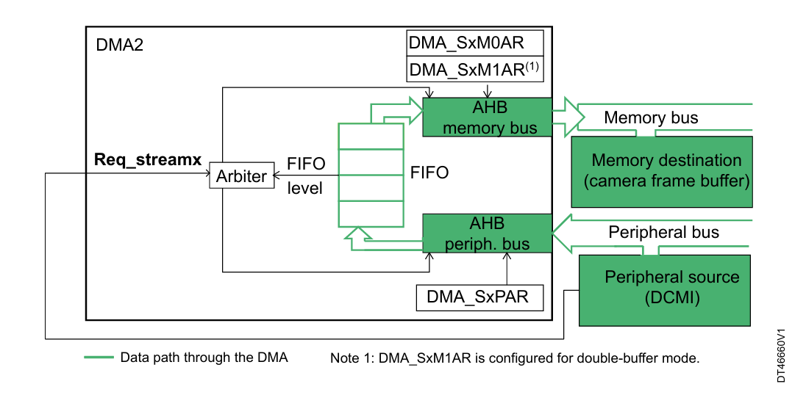


#### 2.7 根据图像大小和捕获模式设置DMA
必须根据图像大小（色深和分辨率）和捕获模式配置DMA：
- 在快照模式下：DMA必须确保一个帧（图像）从DCMI到所需存储器的传输：
  - 如果以字计的图像大小不超过65535，则流可以配置为**正常模式**。
  - 如果以字计的图像大小介于65535和131070之间，，则流可以配置为双缓冲区模
式。
  - 如果以字计的图像大小超过131070，则需要软件介入，根据信号交替修改DMA_SxM0AR/DMA_SxM1AR 的值，来动态修改目标内存帧缓存地址，以实现存储高分辨率的图像帧数据。

- 在连续模式下：DMA必须确保连续多个帧（图像）从DCMI到所需存储器的传输。每次DMA
完成一帧的传输时，将开始下一帧的传输：
  - 如果以字计的图像大小不超过65535，则流可以配置为**循环模式**。
  - 如果以字计的图像大小介于65535和131070之间，则流可以配置为循环模式+双缓冲区模式。
  - 如果以字计的图像大小超过131070，则需要软件介入，根据信号交替修改DMA_SxM0AR/DMA_SxM1AR 的值，来动态修改目标内存帧缓存地址，以实现存储高分辨率的图像帧数据。


### 3 stm32使用OV5640 进行图像采集


为了让 OV5640 能正常工作，主要涉及以下几个核心配置：
- OV5640 摄像头像素时钟配置，和帧率控制
- HSYNC、VSYNC、PCLK 的极性配置
- 输出尺寸和像素格式配置

这里，使用stm32h747 DCMI 8bit并行接口连接OV5640，因此需要设置 OV5640 的 0x300e 寄存器使用  digital video port (DVP)  并行输出模式。

#### 3.1 OV5640 摄像头像素时钟配置，和帧率控制
网上能找到的ov5640手册中，信息不完备。关于ov5640 的时钟配置，这里主要是基于网上资料，以及手动实验。ov5640 的内部时钟框图系统，网上找到的一个图显示如下：
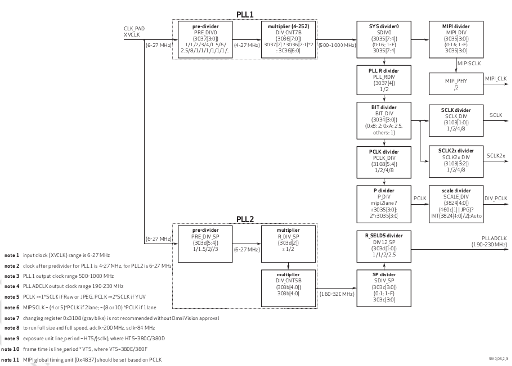

根据上图，以及实验测试，与像素输出时钟PCLK 相关的主要为以下几个寄存器：
- 0x3034 (bit[3:0]的值为8-》2分频； 值为A-》2.5分频； 其它值-》1分频)
- 0x3035 (bit[7:4]的值为DVP模式分频系数，bit[3:0]应该是针对MIPI模式的分频系数，实测修改该值帧率不变或直接导致摄像头输出异常)
- 0x3036 (值作为倍频系数)
- 0x3037 (bit[4]:值为0不分频，值为1二分频，bit[3:0]值为分频系数)
- 0x3108 (bit [5:4]分频值, 本地实测这个值需要保持0不分频，修改值让其分频会异常，可能与一些其它参数存在限制约束)

**输出帧率** ：fps = pclk / （VTS * HTS ）
- HTS 由0x380C、x380D 寄存器设置。
- VTS 由0x380E、x380F 寄存器设置。

示例：
```
    {0x3034, 0x18},
    {0x3035, 0x41},	 
    {0x3036, 0x30},	
    {0x3037, 0x13}, 
    {0x3108, 0x01},

    {0x380C, 0x06},
    {0x380D, 0x40}, // VTS 1600
    {0x380E, 0x03},
    {0x380F, 0xe8}, // HTS 1000

当 ov5640 的输入时钟为 24MHz 时，根据上述配置
	 input = 24M
	 pre-div = 3 分频  -》8M
	 multiplier  = 48 倍频 -》384
	 sys div = 4 分频 -》 96
	 pll root div = 2 分频 -》48
	 BIT div = 2分频 -》 24
   最终 PCLK = 24M

对于一个像素占用一个字节的像素模式，最终帧率为：24M / 1600 * 1000 = 15 帧/秒

对于 RGB565 像素模式，一个像素占用2字节，帧率为 还要再除以2 = 7.5 帧/秒
```
修改帧率时，有限通过修改 倍频/分频 寄存器来改变帧率。VTS、HTS应该和其它寄存器有一些关联约束，随意修改容易导致摄像头没有输出内容。

#### 3.2 HSYNC、VSYNC、PCLK 的极性配置
OV5640会输出 HSYNC、VSYNC、PCLK信号，Stm32 DCMI会根据 PCLK 的边沿进行采样，也需要根据配置的 HSYNC、VSYNC 信号的极性来识别行/列消隐（即那些无效数据）。

在 OV5640 手册中，0x4740 寄存器描述了对应信号的极性：这里没有实际描述对应信号的 "active" 是表示数据有效还是无效。
- Bit[5]: PCLK polarity
  -  0: Active low
  - 1: Active high
- Bit[1]: HREF polarity
  - 0: Active low
  - 1: Active high
- Bit[0]: VSYNC polarity
  - 0: Active low
  - 1: Active high

在 stm32h7 中，DCMI 的 DCMI_CR 中 ：明确描述了这两位表示数据无效时的极性
- Bit 7 VSPOL: Vertical synchronization polarity
This bit indicates the level on the DCMI_VSYNC pin when the data are not valid on the parallel interface.
  - 0: DCMI_VSYNC active low
  - 1: DCMI_VSYNC active high
- Bit 6 HSPOL: Horizontal synchronization polarity
This bit indicates the level on the DCMI_HSYNC pin when the data are not valid on the parallel interface.
  - 0: DCMI_HSYNC active low
  - 1: DCMI_HSYNC active high


例如：
配置 OV5640 的 0x4740 值为 0x23时。实际根据当前 PCLK 周期，以及设置的输出尺寸和像素格式，用示波器观察，发现：**实际配置 0x4740 = 23 时，数据有效时 OV5640 输出的 VSYNC 信号的极性是高电平，而HREF（HSYNC）极性是低电平。** 因此，对应的 stm32 DCMI_CR 需要配置为： VSPOL = 0，HSPOL = 1

同样
- ov5640 的 0x4740 值为 0x22时。 stm32 的 DCMI_CR 需要配置为： VSPOL = 1，HSPOL = 1
- ov5640 的 0x4740 值为 0x20时。 stm32 的 DCMI_CR 需要配置为： VSPOL = 1，HSPOL = 0


#### 3.3 输出尺寸和像素格式配置

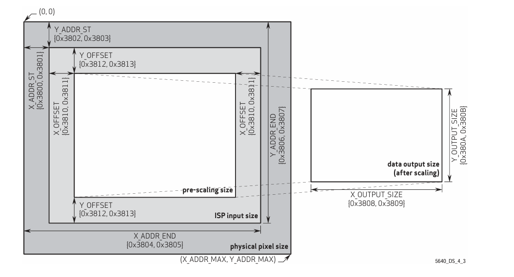
上图为 OV5640 手册中的介绍。
pre-scalling size 即为摄像头内部图像处理器ISP输出的尺寸，经过缩放后，输出期望获取的图像尺寸（通过0x3808 - 0x380B 寄存器设置）。

0v5640 输出的像素格式，通过 0x4300 寄存器设置。
这里设置的为：0x6f
- 其中 高四位值 6表示 RGB565 模式
- 低四位值 0xF ,表示输出序列为： first:{g[2:0],b[4:0]}, second: {r[4:0],g[5:3]}
  
这么设置是当前实例中，会使用 stm32h7 的 DMA2D 对摄像头输出进行格式变化。而 DMA2D 对于 RGB565 模式的输入内容，在内存中的格式要求为：
- @ + 0: G0[2:0]B0[4:0]
- @ + 1: R0[4:0]G0[5:3]
- @ + 2: G1[2:0]B1[4:0]
- @ + 3: R1[4:0]G1[5:3]


### 参考
[1] [stm32h747-DCMI](https://www.st.com/content/ccc/resource/training/technical/product_training/group0/ec/99/3b/61/b3/96/49/1b/STM32H7-Peripheral-Digital_Camera_Interface_DCMI/files/STM32H7-Peripheral-Digital_Camera_Interface_DCMI.pdf/_jcr_content/translations/en.STM32H7-Peripheral-Digital_Camera_Interface_DCMI.pdf)
[2] [AN052](https://www.st.com/resource/en/application_note/an5020-digital-camera-interface-dcmi-on-stm32-mcus-stmicroelectronics.pdf)
[3] [OV5640摄像头的时钟配置](https://www.linmingjie.cn/index.php/archives/194/)
[4] STM32H7xx Reference Manual, RM0399
