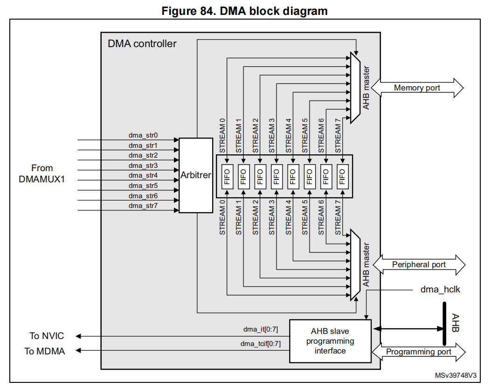

stm32h747  DMA

<!--more-->

***

DMA 提供高速、无 CPU 干预的数据搬运能力。 
双 AHB 总线架构 + FIFO 优化，两个控制器（DMA1、DMA2）各有 8 个 stream。 每个 stream 通过 DMAMUX 灵活选择请求源，仲裁器负责优先级调度。

### 1 DMA 主要特性

架构：
- **双 AHB 主总线架构**：一条专用于内存访问，一条专用于外设访问。由于需要实现内存间数据传输，因此AHB 外设端口还需具备访问内存的权限。
- **AHB 从接口**：仅支持 32 位访问。

通道与请求：
- 每个 DMA 控制器有 **8 个 stream**。
- 每个 stream 最多支持 **115 个请求源**（通过 DMAMUX1 配置），可服务 **107 个外设**。

FIFO 与传输模式：
- 每个 stream 有一个 **4-word 深度的 32 位 FIFO**。
- **FIFO 模式**：可选择阈值 (1/4, 1/2, 3/4)。  
- **直接模式**：每个请求立即触发一次传输；在 memory-to-peripheral 模式下，DMA 会预加载一个数据到内部 FIFO，保证外设请求到来时立即传输。

通道配置：
- **普通通道**：支持外设→内存、内存→外设、内存→内存传输。  
- **双缓冲通道**：支持内存侧双缓冲，提高连续数据流处理能力（使用两个内存指针，DMA 在一个缓冲区工作时，应用程序可操作另一个缓冲区。）。

优先级：
- **软件可编程优先级**：四级（非常高、高、中、低）。  
- **硬件仲裁**：当优先级相同，按请求号排序（如请求0优先于请求1）。

触发方式：
- 每个 stream 支持 **软件触发**（用于内存到内存传输）。  
- 请求源由 DMAMUX1 软件配置。

流控模式：
- **DMA流控**：软件在 NDTR 中设定传输数量 (1~65535)。  
- **外设流控**：数据量未知，由外设在最后一次传输时发出结束信号（需要外设支持发送结束信号）。

数据宽度与打包：
- 源和目的数据宽度可独立设置（byte/half-word/word）。  
- 当宽度不一致时，DMA 自动打包/解包以优化带宽（仅 FIFO 模式支持）。

地址模式：
- 源和目的地址可选择 **递增或固定**。

Burst 传输：
- 支持 **4、8、16 beat** 的 burst传输。  
- burst 大小可软件配置，通常等于外设 FIFO 的一半。

缓冲与事件：
- 每个 stream 支持 **循环缓冲**。  
- 提供 **5 个事件标志**：半传输完成、传输完成、传输错误、FIFO 错误、直接模式错误。  
- 这些标志通过逻辑 OR 合并成一个中断请求。

### 2 DMA functional description

- dma_hclk：Digital input, DMA AHB clock
- dma_it[0:7]：Digital outputs, DMA stream [0:7] global interrupts
- dma_tcif[0:7]：Digital outputs, MDMA triggers
- dma_str[0:7]：Digital input, DMA stream [0:7] requests

#### 2.1 DMA 事务 (Transactions)
事务定义：一个 DMA 事务由一系列数据传输组成。

数据项数量与宽度：可由软件配置（8/16/32 位）。

每次传输包含三步：
- 从外设数据寄存器或内存地址加载数据（通过 DMA_SxPAR 或 DMA_SxM0AR）。
- 将数据存储到目标外设寄存器或内存地址。
- DMA_SxNDTR 递减，表示剩余传输数减少。

握手过程：
- 外设发出请求信号 → DMA 根据优先级仲裁 → DMA 发出 Acknowledge → 外设释放请求 → DMA 释放 Acknowledge。
- 外设可继续发起下一次请求。

#### 2.2 源、目的与传输模式
源和目的地址可覆盖整个 4GB 地址空间 (0x0000_0000 ~ 0xFFFF_FFFF)。

方向配置：通过 DMA_SxCR.DIR[1:0] 位：
- 00 外设→内存：源=PAR，目的=M0AR。
- 01 内存→外设：源=M0AR，目的=PAR。
- 10 内存→内存：源=PAR，目的=M0AR。
- 11 保留。

地址对齐要求：
- 半字传输 → 地址必须半字对齐。
- 字传输 → 地址必须字对齐。

#### 2.3 数据传输

外设→内存模式：
- EN=1 后，每次外设请求触发， DMA 将数据搬入 FIFO。
- FIFO 达到阈值后，批量写入内存。
- 停止条件：NDTR=0、外设结束信号、或软件清除 EN。
- 直接模式 (DMDIS=0)：不使用阈值，每次请求立即搬运数据到内存。
- 仲裁：DMA 只有在赢得仲裁后才能访问总线。

内存→外设模式：
- EN=1 后，DMA 立即填满 FIFO。
- 外设请求到来时，FIFO 数据被写入外设。
- 当 FIFO 低于阈值时，DMA 再次填充。
- 停止条件同上。
- 直接模式：DMA 预加载一个数据到内部 FIFO，外设请求时立即传输，再加载下一个。

内存→内存模式：
- 不依赖外设请求，EN=1 后立即开始传输。
- FIFO 达到阈值后批量写入目的地址。
- 停止条件：NDTR=0 或 EN=0。
- 限制：此模式下不能使用循环模式和直接模式。

#### 2.4 地址递增 (Pointer Incrementation)

PINC/MINC 控制源/目的地址是否递增。
- 禁用递增：适合访问固定寄存器。
- 启用递增：地址按数据宽度递增（byte=+1，half-word=+2，word=+4）。

PINCOS 位：控制外设地址递增方式：
- 默认：按数据宽度递增。
- PINCOS=1：强制按 32 位递增（+4），无论 PSIZE 设置。
- 注意：只影响外设端，不影响内存端。

#### 2.5 循环模式 (Circular Mode)
作用：用于处理循环缓冲区和连续数据流（如 ADC 扫描模式）。

启用方式：设置 DMA_SxCR.CIRC=1。

行为：**当传输完成后，NDTR 会自动重新加载为初始值**，DMA 请求继续被服务，实现无限循环搬运。

**注意**，当内存端配置为突发模式时：
- 必须满足公式：DMA_SxNDTR = Multiple of ((Mburst beat) × (Msize)/(Psize))
- Mburst beat = 4, 8, 16 (由 MBURST 配置)
- Msize/Psize = 1, 2, 4, 1/2, 1/4

举例：MBURST=8，MSIZE=byte，PSIZE=half-word → NDTR 必须是 4 的倍数。

如果不满足公式，DMA 行为和数据完整性无法保证。
**同时 NDTR 也必须是 外设突发大小 × 外设数据宽度 的倍数**。

#### 2.6 双缓冲模式 (Double Buffer Mode)
启用方式：设置 DMA_SxCR.DBM=1。

行为：
- 有两个内存指针 (M0AR 和 M1AR)。
- 每次事务结束后，DMA 自动切换到另一个缓冲区。
- 软件可以在一个缓冲区处理数据，同时 DMA 在另一个缓冲区继续搬运。
- 自动启用循环模式（DMA_SxCR中的CIRC位无关紧要）。

方向支持：
- 外设→内存：源=PAR，目的=M0AR/M1AR。
- 内存→外设：源=M0AR/M1AR，目的=PAR。
- 内存→内存：不允许（因为双缓冲强制循环，而内存到内存不支持循环）。

动态更新地址的规则：
- 当 CT=0 (in DMA_SxCR) → 可以写 M1AR。
- 当 CT=1 → 可以写 M0AR。
- 如果违反规则 → 设置 TEIF 错误并自动关闭 DMA。
- **建议在 TCIF=1（传输完成标志置位） 时更新地址，因为此时 DMA 已经切换到另一缓冲区**。

#### 2.7 可编程数据宽度、打包/解包、大小端
NDTR：必须在使能前配置好（除非外设流控）。
PSIZE/MSIZE：可分别设置源和目的数据宽度（8/16/32 位）。
PSIZE≠MSIZE 时：
- **NDTR 的单位由 PSIZE 决定**。
- DMA 自动进行打包/解包，但只支持 小端序。

若在数据完全打包/解包前中断该操作，此打包/解包流程可能导致数据损坏风险。为确保数据一致性，可配置数据流生成突发传输：此时，属于同一突发的传输组不可分割（不会被高优先级传输打断）。

Direct Mode (DMDIS=0)：不支持打包/解包，必须保证 PSIZE=MSIZE。

约束：**为了避免最后一次传输不完整，NDTR 必须满足以下条件**：
- PSIZE=8bit，MSIZE=16bit → NDTR 必须是 2 的倍数。
- PSIZE=8bit，MSIZE=32bit → NDTR 必须是 4 的倍数。
- PSIZE=16bit，MSIZE=32bit → NDTR 必须是 2 的倍数。

#### 2.8 单次传输与突发传输 (Single vs Burst Transfers)
单次传输：每个 DMA 请求搬运一个数据项（byte/half-word/word）。

突发传输：每个 DMA 请求搬运一组数据（4、8 或 16 beat）。

配置：
- 外设端突发大小由 PBURST + PSIZE 决定。 
- 内存端突发大小由 MBURST + MSIZE 决定。
- 备注：burst size 以psize or msize为单位

特性：
- 突发传输是不可分割的，保证数据一致性。
- 仲裁器在突发期间不会打断 DMA。

Direct Mode：只能做单次传输。
地址对齐要求：突发传输必须对齐到数据宽度边界。
AHB 协议约束：突发传输不能跨越 1KB 边界，否则会产生 AHB 错误（DMA 寄存器不会报告）。

### 3 DMA FIFO 机制

#### 3.1 FIFO 结构
- 每个 DMA stream 都有一个独立的 **4-word 深度 FIFO**。
- FIFO 用来暂存源数据，再传输到目的地。
- 阈值 (Threshold) 可配置为 1/4、1/2、3/4 或满。
- 要启用阈值功能，必须关闭直通模式 (DMDIS=1)。

#### 3.2 FIFO 阈值与突发配置
- 约束：FIFO 阈值必须与内存突发传输数据量整数匹配，否则会报错 (FEIF)。限制条件：突发大小(MBURST) × 数据宽度(MSIZE) ≤ FIFO 阈值大小。

不完整突发情况：
- 如果 NDTR 不是突发大小 × 数据宽度的倍数 → 最后剩余数据会用单次传输完成。
- 如果 FIFO 剩余数据不是突发大小 × 数据宽度的倍数 → 也会退化为单次传输。

特别规则：
- 若（PBURST × PSIZE）=FIFO_SIZE（4个字），则当 PSIZE =1、2或4且 PBURST =4、8或16时，禁止使用FIFO_Threshold=3/4。该规则确保每次都有足够的FIFO空间可用，以响应外围设备的请求。

#### 3.3 FIFO 刷新 (Flush)
当 stream 被禁用 (EN=0) 时，FIFO 中可能还有残留数据。
DMA 会继续把这些数据搬运到目的地，直到 FIFO 清空。
完成后置位 TCIF 标志。

注意事项：
- 如果 FIFO 剩余数据 < 内存数据宽度 (例如 FIFO 只有 2 字节，而 MSIZE=word)，DMA 仍按 MSIZE 写入 → 可能导致内存写入无效数据。
- 软件可通过 NDTR 判断哪些内存区域是有效数据。
- 如果 FIFO 剩余数据 < 突发大小 → DMA 会用单次传输完成刷新。

#### 3.4 直通模式 (Direct Mode)
默认情况下 FIFO 工作在直通模式 (DMDIS=0)。
在直通模式下，阈值功能不可用。

行为：
- 每次 DMA 请求立即触发一次传输。
- 在内存→外设模式下，DMA 会预加载一个数据到内部 FIFO，保证外设请求到来时立即传输。

限制：
- 源和目的数据宽度必须相同 (由 PSIZE 定义)。
- 不支持突发传输。
- 不允许用于内存→内存传输。

**建议：为了避免 FIFO 饱和，直通模式下应给该 stream 配置较高优先级。**

### 4 DMA 传输完成 (Transfer Completion)
DMA 的传输完成事件会置位 TCIFx 标志。不同模式下触发条件不同：

DMA 流控模式 (PFCTRL=0)
- 内存→外设：当 NDTR=0 时传输完成。
- 外设→内存 / 内存→内存：如果在传输过程中软件清除了 EN 位禁用 stream，DMA 会把 FIFO 中剩余数据搬完到内存后才算完成。

外设流控模式 (PFCTRL=1)
- 外设→内存：
  - 外设发出最后一次请求，DMA 把 FIFO 中剩余数据搬完到内存 → 完成。
  - 软件禁用 stream 时，DMA 也会把 FIFO 中剩余数据搬完到内存 → 完成。

- 内存→外设：完成条件仅依赖外设的最后一次请求，不涉及 FIFO。

非循环模式下
- 当 NDTR=0 → DMA 自动停止 (EN 位被硬件清零)。
- 后续不再响应请求，除非软件重新配置并重新使能。

### 5 DMA 传输挂起 (Suspension)
DMA 可以在传输过程中被挂起，分两种情况：

永久停止
- 软件清除 EN 位 → stream 停止。
- DMA 会先完成正在进行的传输，然后置位 TCIF。
- NDTR 保留剩余数据项数，软件可用来计算已传输的数据量。

暂停后恢复
- 软件清除 EN 位 → stream 暂停。
- 软件读取 NDTR，得知已传输数量。
- 软件更新地址寄存器 (PAR/MAR) 和 NDTR 为剩余数量。
- 重新设置 EN 位 → DMA 从暂停点继续传输。

### 6 流控机制 (Flow Controller)
决定传输数据量的实体称为 流控器，由 PFCTRL 位配置：

DMA 控制器作为流控器 (PFCTRL=0)
- 软件在 NDTR 中设定传输数量。
- DMA 按照设定执行，直到 NDTR=0。

外设作为流控器 (PFCTRL=1)
- 外设通过硬件信号告诉 DMA 什么时候是最后一次传输。
- NDTR 在使能时被硬件强制为 0xFFFF。
- 数据量未知，由外设决定结束。

三种结束情况：
- 提前停止：软件清除 EN 位 → DMA 停止并 flush FIFO。
  - 已传输数量 = 0xFFFF – NDTR。

- 正常结束：外设发出最后一次请求 → DMA 完成并置位 TCIF。
  - 已传输数量同上公式。

- NDTR=0：DMA 强制结束，即使外设未发出结束信号。
  - 最多支持 65535 项数据。

⚠️ 限制：
- 在 内存→内存模式 下，DMA 始终是流控器 (PFCTRL=0)。
- 在 外设流控模式 下，禁止使用循环模式。

### 7 DMA Stream 配置步骤
要配置一个 DMA stream（编号为 x），必须按照以下顺序进行：

1 禁用当前 stream
- 如果 stream 已经启用，先清除 DMA_SxCR.EN 位。
- 然后读取 EN 位确认 stream 已经真正停止。
- 注意：写 EN=0 并不会立即生效，硬件会等到当前传输完成后才清零。
- 当 EN=0 时，stream 才能安全重新配置。
- 同时必须清除上一次传输遗留的状态标志位 (DMA_LISR / DMA_HISR)。

2 设置外设地址
- 在 DMA_SxPAR 中写入外设端口寄存器地址。
- DMA 会从这个地址读/写数据。

3 设置内存地址
- 在 DMA_SxM0AR 中写入内存地址。
- 如果是双缓冲模式，还需要设置 DMA_SxM1AR。

4 配置传输数据量
- 在 DMA_SxNDTR 中写入要传输的数据项数量。
- 每次外设事件或突发传输都会使该值递减。

5 配置 DMAMUX
- 使用 DMAMUX1 将外设的 DMA 请求路由到对应的 DMA channel。

6 选择流控器
- 如果外设支持作为流控器，则设置 DMA_SxCR.PFCTRL=1。
- 否则由 DMA 控制传输数量。

7 配置优先级
- 使用 DMA_SxCR.PL[1:0] 设置 stream 的优先级。

8 配置 FIFO
- 决定是否启用 FIFO，以及阈值大小。

9 配置传输模式，包括：
- 数据方向 (内存↔外设/内存)
- 地址是否递增 (MINC/PINC)
- 单次或突发传输
- 外设/内存数据宽度
- 是否启用循环模式
- 是否启用双缓冲模式
- 中断配置（半传输、完成、错误）

10 启用 stream
- 设置 DMA_SxCR.EN=1。
- 一旦启用，DMA 就会响应外设的请求。

中断与标志
- 半传输 (HTIF)：当一半数据传输完成时置位，如果启用了 HTIE 中断则触发。
- 传输完成 (TCIF)：当全部数据传输完成时置位，如果启用了 TCIE 中断则触发。

⚠️ 警告
如果要关闭一个外设，必须 先关闭与之连接的 DMA stream，并等待 EN=0。只有在 DMA stream 完全停止后，才能安全关闭外设。
否则可能导致数据丢失或 DMA 异常。

### 参考
[1] STM32H7xx Reference Manual, RM0399
