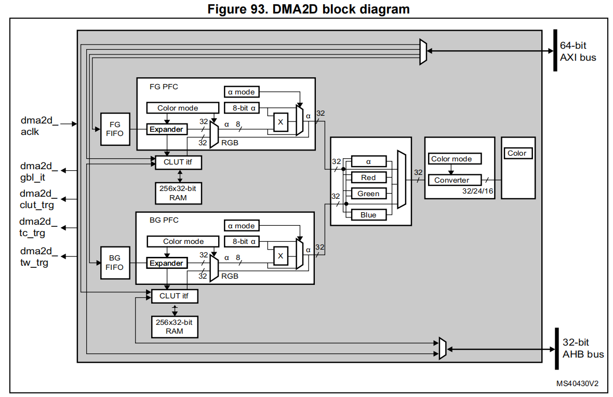

<center>
stm32h747  DMA2D
</center>

<!--more-->

***

DMA2D 是专用的 图像处理 DMA，用于加速显示和图像操作。能在内存和显示缓冲之间进行高效的数据搬运和格式转换。

主要特性：
- 区域填充：用固定颜色填充图像的一部分或全部。
- 图像拷贝：从源图像复制到目标图像，可带偏移。
- 格式转换：拷贝时支持像素格式转换（如 RGB565 → ARGB8888）。
- 图像混合：支持两路源图像混合（alpha blending），并输出到目标。
- 支持多种颜色格式：从 4‑bit 到 32‑bit，直接或索引色，支持 CLUT。
- JPEG输出支持：能处理JPEG 解码器输出的基于块的 YCbCr 格式数据。  

硬件特性：
- 总线架构：单 AXI 主机 （DMA2D访问内存），AHB 从机接口（CPU访问DMA2D寄存器）。
- 可编程参数：工作区大小、源/目的偏移、地址、颜色格式。
- CLUT 支持：内部存储器，自动或 CPU 加载，大小可编程。
- 带宽控制：内部定时器可调节 AXI 总线占用。
- 中断机制：支持完成中断、错误中断、水位线中断（处理到目标图像的某一行时，会触发一个中断信号。用于图像生成过程中提前介入，比如在某一行之后开始刷新显示器）。
- 操作模式：寄存器到内存、内存到内存、带格式转换、带混合、固定前景/背景色等


### 1 DMA2D构成


- dma2d_aclk：Input，64-bit AXI bus clock
- dma2d_gbl_it：Output，DMA2D global interrupt
- dma2d_clut_trg：Output， CLUT transfer complete (to MDMA)
- dma2d_tc_trg：Output， Transfer complete (to MDMA)
- dma2d_tw_trg：Output， Transfer watermark (to MDMA)

DMA2D控制器通过 DMA2D_CR 配置。用户应用程序可执行：
- 选择工作模式。
- 启用/禁用DMA2D中断。
- 启动/暂停/终止正在进行的数据传输。

### 2 foreground and background FIFOs
前景 FIFO (FG FIFO) 和 背景 FIFO (BG FIFO) 用来从内存中取输入图像数据，供 DMA2D 进行拷贝或处理。FIFO 会根据各自的 像素格式转换器 (PFC) 定义的颜色格式来抓取像素。

配置相关寄存器
- DMA2D_FGMAR：前景图像内存地址寄存器
- DMA2D_FGOR：前景图像偏移寄存器
- DMA2D_BGMAR：背景图像内存地址寄存器
- DMA2D_BGOR：背景图像偏移寄存器
- DMA2D_NLR：行数寄存器（定义行数和每行像素数）

在最简单的寄存器到内存模式下，不用 FIFO。
在普通内存拷贝模式下，只用前景 FIFO。
在带格式转换的拷贝模式下，仍然只用前景 FIFO。
背景 FIFO 主要在 混合 (blending) 模式下才会启用。


### 3 foreground and background PFC

前景 PFC (FG PFC) 和 背景 PFC (BG PFC) 会把输入像素格式统一转换成 32 位/像素 (ARGB8888)。在转换过程中，它们还能处理 Alpha 通道（透明度），包括保持、替换或调制。这样 DMA2D 在做混合或拷贝时，所有输入数据都被标准化为 32 位，方便后续运算。

输入格式支持：
- 通过寄存器 DMA2D_FGPFCCR 和 DMA2D_BGPFCCR 的 CM[3:0] 字段选择输入格式

Alpha 通道处理：
- 如果原始格式有 Alpha → 保留或按配置修改。配置方式由 AM[1:0] 决定：
  - 00 保持原值
  - 01 替换为寄存器里的固定值
  - 10 原值 × 固定值 ÷ 255（调制）
  - 11 保留（未使用）
- 如果原始格式没有 Alpha → 自动补为 0xFF (完全不透明)。
- AI 位：反转 Alpha 值。AI 位的反转是在 AM 操作之后生效。它是一个最终修饰步骤。

颜色通道处理：支持 R/B 交换，索引色需 CLUT。

内存排列：不同格式有不同的字节/位顺序，PFC 会正确解析。


### 4 foreground and background CLUT interface

CLUT (Color Look‑Up Table) 用于 索引色模式 (L8、AL44、AL88、L4) 的像素格式转换。
输入像素只提供一个索引值 (L)，PFC 通过 CLUT 查表得到对应的 RGB/ARGB 值。每个 PFC（前景/背景）都有独立的 CLUT 存储区。
支持 24 位 RGB888 或 32 位 ARGB8888 格式。

CLUT 的访问方式有：
- PFC 读取 CLUT：在像素格式转换时，PFC 自动从 CLUT 取对应的颜色。
- CPU 访问 CLUT：手动加载时，CPU 通过 AHB 从机接口， 可以直接读写 CLUT 内存。
- 自动加载 CLUT：自动加载 CLUT 时，DMA2D 会作为 AXI 总线主机，自己去系统内存取 CLUT 数据并写入内部 CLUT RAM。

CLUT 就是 DMA2D 的“颜色字典”，索引色像素通过它翻译成真正的 RGB/ARGB 值。


### 5 blender
Blender 用来把 前景像素 (FG) 和 背景像素 (BG) 按照透明度 (Alpha) 进行混合，生成一个新的输出像素。
它是 DMA2D 在 混合模式下自动启用的硬件单元，不需要额外的配置寄存器。是否启用 Blender 取决于 DMA2D_CR.MODE[2:0] 的工作模式选择。

Alpha 混合:
- 定义：𝛼<sub>𝑀𝑢𝑙𝑡</sub> = 𝛼<sub>𝐹𝐺</sub> * 𝛼<sub>𝐵𝐺</sub>/255
- 输出 Alpha: 𝛼<sub>𝑂𝑢𝑡</sub> = 𝛼<sub>𝐹𝐺</sub> + 𝛼<sub>𝐵𝐺</sub> - 𝛼<sub>𝑀𝑢𝑙𝑡</sub>
- 这保证了前景和背景的透明度综合后得到一个合理的输出透明度。

颜色混合:
- 对每个通道 (R/G/B)：:C<sub>𝑂𝑢𝑡</sub> = (C<sub>𝐹𝐺</sub>*𝛼<sub>𝐹𝐺</sub> + C<sub>𝐵𝐺</sub>*𝛼<sub>𝐵𝐺</sub> - C<sub>BG</sub>*𝛼<sub>𝑀𝑢𝑙𝑡</sub>) / 𝛼<sub>𝑂𝑢𝑡</sub>      ; with C = R or G or B
- 公式体现了：前景颜色按前景 Alpha 加权，背景颜色按背景 Alpha 加权，但背景部分会减去与前景重叠的透明度贡献。

### 6 DMA2D output PFC

Output PFC（Pixel Format Converter）是 DMA2D 的一个子模块，它负责将内部处理结果（默认是 32 位 ARGB8888 格式）转换为你指定的输出格式，比如 RGB565、ARGB1555 等。

```
 
[FGMAR] → Foreground PFC ─┐
                          │
                          ├─→ 混合器 → Output PFC → [OMAR]
                          │
[BGMAR] → Background PFC ─┘
```

可选增强功能（通过 DMA2D_OPFCCR 控制）
- AI（Alpha Inversion）位：设置后，输出的 Alpha 值会被反转（Alpha = 255 - 原值）。适用于需要反向透明度的场景，比如遮罩或高亮。
- RBS（Red-Blue Swap）位：设置后，输出图像中的 R 和 B 通道会交换。适用于某些 LCD 或图像格式使用 BGR 排列的情况。
- 这两个功能不仅影响最终输出格式，也会影响在 DMA2D_OCOLR 中设置的颜色值解释方式。


DMA2D_OCOLR 是什么？
这是 DMA2D 输出颜色寄存器，用于设置填充颜色或背景色（Register-to-Memory, R2M 模式）：当你要用某个纯色去填充一块内存区域时，颜色就来自 OCOLR。它的解释方式也会受到 CM[2:0]、AI 和 RBS 的影响。例如：
- 如果你设置为 RGB565 格式，DMA2D_OCOLR 中的值会被解释为 R:5 G:6 B:5。
- 如果你启用了 RBS，那么 R 和 B 的位置会互换。


### 7 DMA2D output FIFO
输出 FIFO 是 DMA2D 的最后一级缓冲，它会按照 Output PFC 定义的格式，把像素排好队，写入目标内存。

目标区域由以下寄存器定义：
- DMA2D_OMAR → 输出内存起始地址
- DMA2D_OOR → 每行的偏移（line offset）
- DMA2D_NLR → 行数和每行像素数

如果是 R2M（寄存器到内存）模式，FIFO 就不断写入 DMA2D_OCOLR 中定义的固定颜色，填满目标矩形。

### 8 DMA2D output FIFO byte reordering
有些显示接口（比如 FSMC 并口驱动 LCD）要求像素数据在内存中有特定的字节顺序。DMA2D 提供了两个开关：
- RBS：交换红色和蓝色分量（RGB ↔ BGR）
- SB：按半字节对调（两个字节交换位置）注意：启用 SB 时，必须保证：
  - 每行像素数（PL）为偶数
  - 输出地址（OMAR）为偶数
  - 行偏移（OOR/LOM）计算出的字节数也为偶数，否则会报配置错误。

不同位深度的要求：
- 16-bit (RGB565)：天然支持，不需要字节重排。
- 18/24-bit (RGB888)：必须同时启用 RBS 和 SB，才能满足 LCD 的字节顺序要求。

### 9 AXI Master Port Timer
DMA2D 通过 AXI 总线访问内存。为了避免占用过多带宽，它内置了一个 8-bit 定时器。

这个定时器可以在两次访问之间插入“死时间”，限制 DMA2D 的带宽占用。

配置寄存器：DMA2D_AMPTCR。

### 10 DMA2D transactions
一次 DMA2D 操作由多个步骤组成：

从前景地址（FGMAR）取数据 → Foreground PFC 转换

从背景地址（BGMAR）取数据 → Background PFC 转换

混合（Blending）：根据 Alpha 通道合成前景和背景

输出 PFC 转换 → 输出 FIFO → 写入目标地址（OMAR）


### 11 DMA2D configuration

DMA2D 的工作模式（由 DMA2D_CR.MODE[2:0] 决定）：
- R2M（寄存器到内存）：用 OCOLR 的固定颜色填充矩形区域。只写，不读。
- M2M（内存到内存）：直接拷贝，不做格式转换。
- M2M + PFC：拷贝时做像素格式转换（支持 CLUT）。
- M2M + PFC + Blending：前景和背景图像合成。
- M2M + PFC + Blending + 固定 FG 色：背景来自内存，前景是固定颜色。
- M2M + PFC + Blending + 固定 BG 色：前景来自内存，背景是固定颜色。

可以看到，DMA2D 的模式是逐步叠加的：从最简单的填充，到拷贝，再到格式转换，再到混合，最后支持固定色参与混合。

CLUT（Color Look-Up Table）：
- 当源图像是 索引色模式（Indirect color），需要 CLUT 把索引值映射到实际颜色。
- CLUT 可以自动加载（FGCMAR 指定地址，FGPFCCR 配置大小和格式，START 启动），也可以由 CPU 手动写入。
- CLUT 加载时不能同时进行 DMA2D 传输。
- CLUT 格式支持 24 位或 32 位。

Alpha 通道处理：
- 如果源图像没有 Alpha，默认加上 0xFF（完全不透明）。
- AM[1:0] 控制 Alpha 的处理方式：
  - 保持不变
  - 替换为寄存器里的固定值
  - 原值 × 固定值 / 255（相当于缩放透明度）

输出 PFC：
- 所有处理结果最终都会变成 32 位 ARGB8888，然后由 Output PFC 转换成目标格式（RGB565、ARGB1555 等）。
- 输出格式不能是索引色（Indirect），因为 DMA2D 不支持输出 CLUT。

配置错误检测：
DMA2D 会在启动传输时检查配置是否合理，如果不对，会触发 配置错误中断（CEIF）。常见错误包括：
- CLUT 地址和格式不对齐。
- 源/目的地址和像素格式不匹配。
- 行像素数（PL）为奇数，但格式要求偶数对齐（如 ARGB4444）。
- 偏移量（LO）为奇数，但要求偶数对齐。
- 输出地址和格式不匹配。
- 启用了字节交换（SB=1），但像素数或地址不是偶数。
- 行数或像素数为零。
- 模式位无效。
- YCbCr 模式下像素数与偏移不满足 8/16 对齐要求。

这些检查保证 DMA2D 不会在错误配置下运行，避免写错内存或产生无效数据。


###  YCbCr 支持
用途：前景平面可以直接处理 JPEG 解码器输出的 YCbCr 数据（8×8 MCU 块）。
数据组织：遵循 JFIF 标准，每个分量（Y、Cb、Cr）都是 8 位，按 8×8 块排列。
配置：通过 CSS 位（在 FGPFCCR）可以选择采样率。
加载过程：先加载两个色度块（Cb、Cr）到 CLUT，再加载亮度块（Y）。

### DMA2D transfer control (start, suspend, abort, and completion)
启动：设置 START 位，传输完成后自动清零，并置位 TCIF。
暂停：设置 SUSP 位，可随时暂停，清除后继续。
中止：设置 ABORT 位立即终止，TCIF 不会置位。
CLUT 加载：也有独立的 START 位，可以单独暂停/中止。

### Watermark
功能：在某一行的最后一个像素写入完成时触发中断。
配置：DMA2D_LWR 设置行号，触发时置位 TWIF。
用途：常用于逐行刷新显示缓冲区。

### Error management
AXI 错误：总线访问错误 → TEIF。
CLUT 访问冲突：当CLUT正在加载或DMA2D传输进行时，CPU尝试访问该CLUT → CAEIF。
两者都有对应的中断使能位（TEIE、CAEIE）。

### AXI Dead Time
目的：限制 DMA2D 占用 AXI 总线带宽。
配置：DMA2D_AMTCR.EN 启用，DT[7:0] 设置死时间（两个访问之间的最少周期数）。
动态更新：运行中修改会在下一次访问生效。

### DMA2D 中断事件
可触发的中断包括：
- 配置错误（CEIF）
- CLUT 加载完成（CTCIF）
- CLUT 访问错误（CAEIF）
- 水位（watermark）触发（TWIF）
- 传输完成（TCIF）
- 传输错误（TEIF）

每个事件都有独立的使能位，方便灵活选择。


### 参考
[1] STM32H7xx Reference Manual, RM0399
