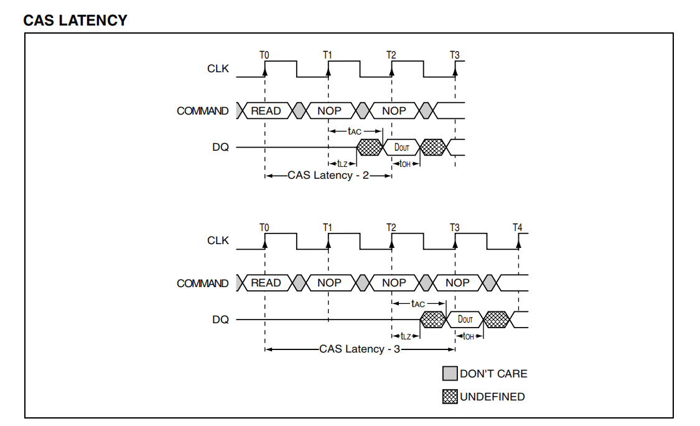
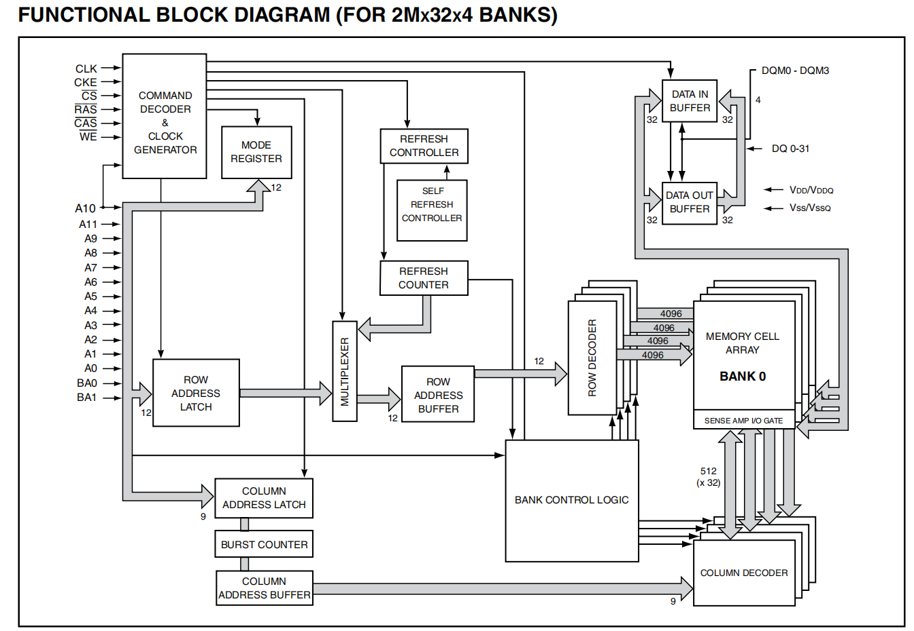
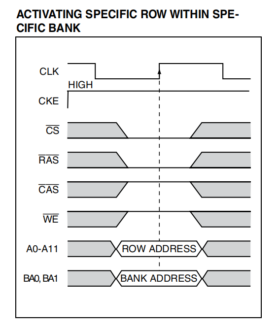
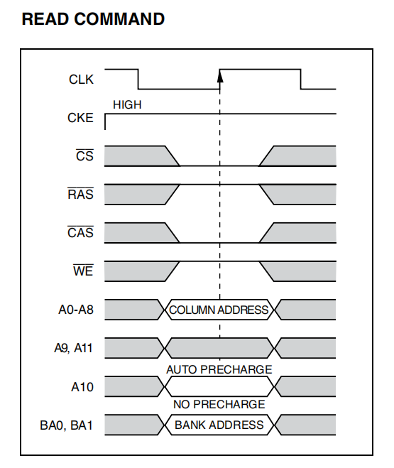
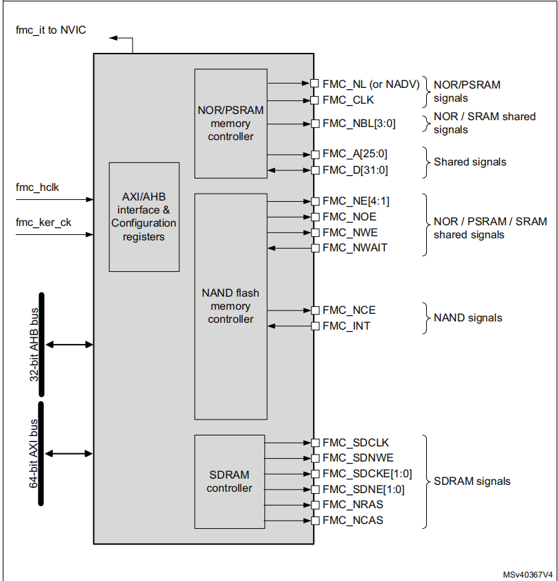
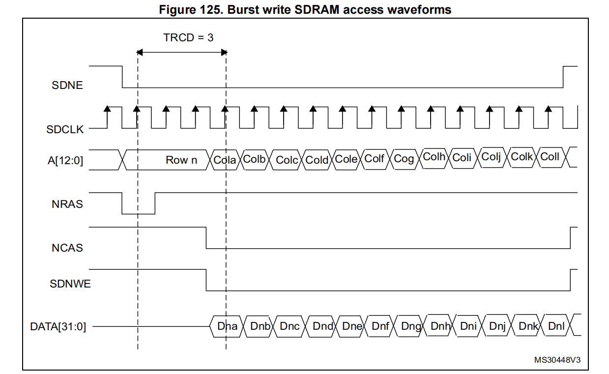
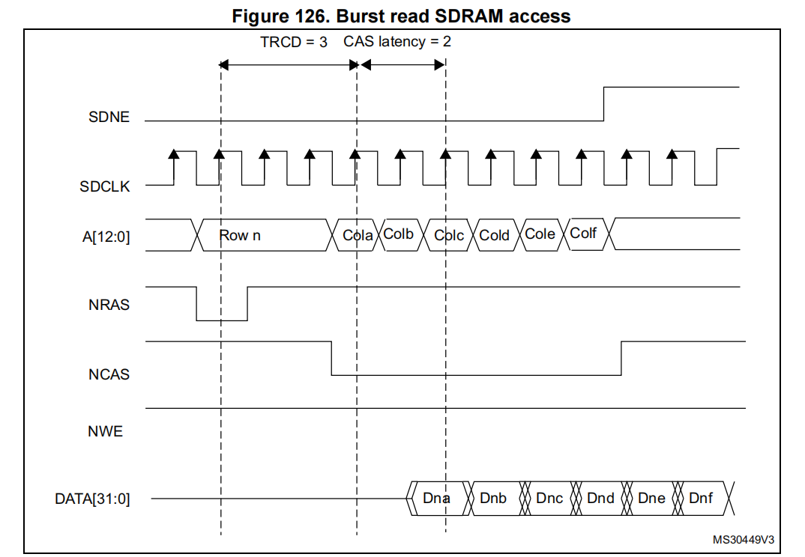
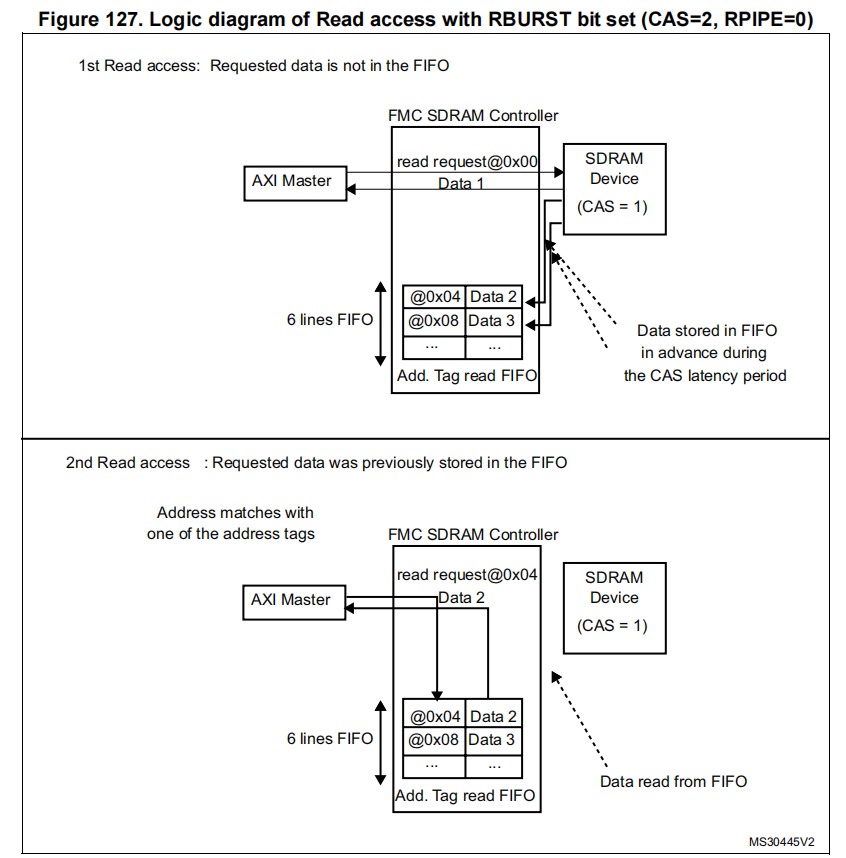
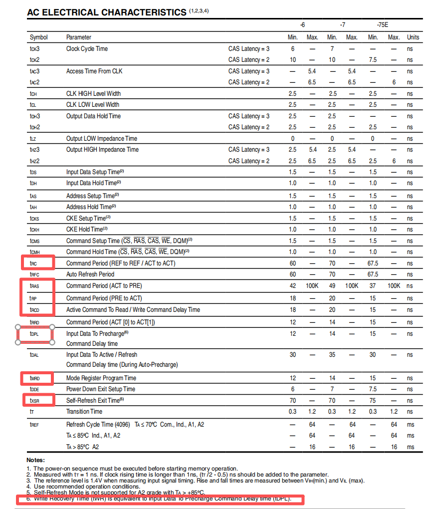

<center>
stm32h747 使用FMC 控制、访问 IS42S32800J SDRAM
</center>

<!--more-->

***

### 1 IS42S32800J-6BLI SDRAM
板载256Mbit SDRAM ，IS42S32800J 系列，该系列支持不同速度等级（-6、-7、-75E），对应支持的最大工作频率为 166, 143, 133 MHz。

当前使用的是 IS42S32800J-6BLI 型号，最大频率支持到 166MHz。
特性 (FEATURES)：
- 全同步：所有信号都参考时钟上升沿
- 内部多 Bank：通过隐藏行访问/预充电提高效率
- 可编程突发长度：1、2、4、8 或整页
- 突发序列：顺序或交错
- 刷新机制：自动刷新 (CBR)、自刷新 (Self Refresh)
  - 自动刷新：MCU/控制器必须周期性发 REFRESH 命令，SDRAM 内部自动完成行选择和刷新。
  - 自刷新：MCU/控制器只需让 SDRAM 进入 Self Refresh 状态（通过 CKE 拉低）。SDRAM 内部会自己周期性刷新所有行，不再需要外部 REFRESH 命令。
- 刷新周期：4096 次刷新 / 16ms (A2)，或 64ms (A1/工业级/商业级)
  - A1/工业/商业等级: 在 64ms 内完成 4096 次刷新。
  - A2 等级: 在 16ms内完成 4096 次刷新（更严格）。高温或更严苛环境下漏电更大，数据保持时间变短，需要更频繁刷新
  - 刷新命令会让 SDRAM 在 tRFC (Refresh Cycle Time) 内进入忙状态，不能读写。假设：每次刷新需要 tRFC = 70ns（典型值），总刷新次数 = 4096 次 / 16ms。
  刷新总时间：4096 * 70ns = 286.7us
  占比：286.7us / 16ms ≈ 1.8%
  即大约 1–2% 的时间 SDRAM 在刷新，不能读写。
  **SRAM 永远可访问，DRAM 必须定期暂停刷新。**

- 随机列地址：每个时钟周期可随机访问列地址
- CAS 延迟：**可编程为 2 或 3 个时钟周期**
  - Column Address Strobe Latency ：指的是：当控制器发出 READ 命令并给出列地址后，SDRAM 需要等待多少个时钟周期才能把数据有效输出到总线上。
  
- 突发读写：支持突发读/写，突发读/单写
- 突发终止：通过 Burst Stop 或 Precharge 命令


#### 1.1 OVERVIEW
容量：256Mb = 2M × 32 位 × 4 Bank
架构：流水线架构，所有输入/输出都同步到时钟上升沿
每个 Bank：67,108,864 bit，组织为 4096 行 × 512 列 × 32 bit



**关键时序参数** (KEY TIMING PARAMETERS)，仅考虑当前使用的型号IS42S32800J-6BLI （对应速率等级 -6）：
- Clk Cycle Time（时钟周期）：SDRAM 在当前速度等级（-6）、某个 CAS Latency 设置下，要求的 最小时钟周期。这是芯片内部完成一次操作所需的最短绝对时间。
  - CAS=3 → 6ns (对应工作频率 166 MHz)
  - CAS=2 → 10ns (对应工作100 MHz，cas变小了，则需要降低频率以满足总时延要求)

- Clk Frequency（时钟频率）：表示 SDRAM 在当前速度等级（-6）和对应 CAS 延迟下的 最大工作频率（f<sub>max</sub> = 1/t<sub>clk cycle timer</sub>）。
  - CAS Latency = 3： t<sub>clk cycle timer</sub> = 6ns -> f<sub>max</sub> = 166 MHz
  - CAS Latency = 2： t<sub>clk cycle timer</sub> = 10ns -> f<sub>max</sub> = 100 MHz
  - CAS Latency 越小，要求时钟周期越长（频率越低），否则数据准备不及。

- Access Time from Clock（访问延迟）：这是一个模拟电气参数，表示数据在时钟边沿之后多久稳定在总线上。它是一个“绝对时间”的约束。在当前速率等级（-6）下：
  - CAS Latency = 3时，为5.4 ns
  - CAS Latency = 2：6.5 ns

备注：CAS Latency × Clk Cycle Time：这是一个逻辑延迟，表示 SDRAM 在多少个时钟拍子后才把数据推出，它是一个“周期数”的约束。而Access Time from Clock表示数据在拍子点之后多久有效。
举例：以 -6 等级 SDRAM 为例：

CL=2，tCK=10 ns：逻辑上要等 2 个周期 → 20 ns。在第 2 个周期的上升沿，数据已经准备好，只需再等 tAC=6.5 ns 就能读到稳定数据。
CL=3，tCK=6 ns：逻辑上要等 3 个周期 → 18 ns。在第 3 个周期的上升沿，数据推出，只需再等 tAC=5.4 ns 就能读到稳定数据。


**地址 (ADDRESS TABLE)/引脚配置**：
- 总容量：8M × 32 bit
- 配置：2M × 32 × 4 Bank
- 刷新计数：4096 行
- 地址线：A0–A11 (行地址)，A0–A8 (列地址)，A10 用于自动预充电
- Bank 地址：BA0, BA1 → 选择 Bank
- 数据线：DQ0–DQ31 → 32 位数据总线
- 时钟：CLK → 主时钟输入
- 时钟使能：CKE → 控制时钟是否有效（低电平进入省电/自刷新模式）
- 片选：CS → 低电平使能命令输入
- 命令控制：RAS (行选通)、CAS (列选通)、WE (写使能)
- 数据掩码：DQM0–DQM3 → 控制 4 个字节的输入/输出屏蔽
  - DQM=HIGH → 对应的 DQ 输出为高阻（数据无效）。
  - DQM=LOW → DQ 输出有效数据。

普通地址线的作用
- BA0/BA1：选择 Bank。
- A0–A11：在 ACTIVE 命令时作为行地址。
  
- A0–A8：在 READ/WRITE 命令时作为列地址。
  


A10 的特殊功能：
A10 除了作为普通地址位，还在某些命令下有 特殊含义：
- READ/WRITE 命令时
  - 如果 A10=1 → 启用 自动预充电 (Auto Precharge)。SDRAM 在突发读/写结束后，会自动关闭当前行（执行预充电），不需要控制器再发 PRECHARGE 命令。
  - 如果 A10=0 → 行保持打开，控制器可以继续访问同一行。
- PRECHARGE 命令时
  - 如果 A10=1 → 表示预充电 所有 Bank。
  - 如果 A10=0 → 只预充电由 BA0/BA1 指定的 Bank。

备注：
SDRAM 内部存储结构是 Bank → Row → Column。
当要访问某个数据时，必须先 激活（ACTIVE）一行，把这一行的数据加载到行缓冲区中，然后才能访问列中的数据。
当一行被激活后，它会一直保持“打开”状态，行缓冲区里存着这一行的数据。
如果要访问同一个 Bank 的另一行，必须先把当前行关闭，否则无法切换。关闭行的动作就是预充电 (Precharge)：把行缓冲区恢复到空闲状态，准备好接受新的行激活。


### 2 stm32h747 FMC

STM32H747 的 FMC（灵活存储控制器） 是一个统一的外部存储接口模块，内部包含三个子控制器：
- NOR/PSRAM 控制器
- NAND 控制器
- SDRAM 控制器，通过 JEDEC SDRAM 标准协议和外部 SDRAM 进行交互。



- AHB 接口：用于 CPU 配置 FMC 寄存器，时钟是 fmc_hclk。
- AXI 接口：用于 CPU/DMA 访问外部存储器，时钟是 fmc_ker_ck

#### 2.1 FMC main features
FMC的主要作用：
- 把 AXI 总线事务（MCU 内部总线协议）翻译成外部存储器的访问协议。
- 满足外部存储器的访问时序要求。

所有外部存储器共享 FMC 的地址、数据和控制信号，每个存储器通过独立的 片选信号 (Chip Select) 区分。一次只能访问一个外部设备。

主要特性：
- 支持的外部存储器类型：
  - SRAM
  - NOR Flash、OneNAND flash
  - PSRAM（最多 4 个 Bank）
  - NAND Flash：STM32H747 的 FMC 控制器在访问 NAND 闪存时，内置硬件 ECC 引擎，可以对一次最多 8KB 的数据块进行错误检测和纠正，从而保证数据可靠性。
  - DRAM / Mobile LPSDR SDRAM

- 突发模式 (Burst Mode)：支持高速连续访问（适用于 NOR、PSRAM、SDRAM）。
- 可编程时钟输出：支持异步和同步存储器访问。
- 数据总线宽度：8/16/32 位可选。
- 独立片选控制：每个存储器 Bank 独立片选。
- 独立配置：每个存储器 Bank 可单独配置。
- 写控制信号：支持写使能和字节选择（适用于 PSRAM、SRAM、SDRAM）。
- 外部异步等待控制：支持外部 WAIT 信号。
- FIFO 机制
  - 写 FIFO（深度 16 × 32 位，所有控制器共享）：
    写数据 FIFO：存储要写入的数据。
    写地址 FIFO：存储地址（最多 28 Bit）和数据大小（最多 2 bit）。在突发模式下，只存储起始地址；如果跨页边界（PSRAM/SDRAM），突发会拆分成两个 FIFO 条目。
  - 读 FIFO（仅 SDRAM 控制器，深度 6 × 64 位）：可缓存读取数据。带地址标签（14 位），用于缓存命中判断。

配置与寄存器：
启动时，用户必须配置 FMC 的引脚。未使用的 FMC 引脚可以复用为其他功能。
外部设备类型和特性在启动时通过 FMC 寄存器配置，一般在复位或上电后才改变。
如果 FMC 已经启用，要修改配置参数，必须按以下顺序：
- 禁用 FMC（防止访问过程中修改寄存器）。
- 更新所需配置。
- 重新启用 FMC。

SDRAM 特殊情况：如果需要在初始化后修改 SDCLK 时钟比率或刷新速率，必须遵循以下步骤：（**这是为了保证 SDRAM 在修改时序参数时不会丢失数据。**）
- 让 SDRAM 进入 自刷新模式 (Self-refresh)。
- 禁用 FMC（清除 FMC_BCR1 寄存器中的 FMCEN 位）。
- 更新参数。
- 重新启用 FMC。
- 发送 Clock Configuration Enable 命令，退出自刷新模式。


#### 2.2 支持的存储器与事务规则

通用事务规则:
- AXI 事务数据宽度：可以是 8、16、32 或 64 位。
- 外部设备数据宽度：固定（例如 32 位）。
- 最佳性能：当 AXI 事务大小与外部设备数据宽度匹配且地址对齐时，性能最高。

当 AXI 数据宽度 ≠ 外设数据宽度时的处理:
- AXI 数据宽度 > 外设数据宽度
  - FMC 会把一次 AXI 事务拆分成多个连续访问，匹配外设的数据宽度。
  - 例如：AXI 64 位访问 → SDRAM 32 位宽 → FMC 拆成 2 次 32 位访问。

- AXI 数据宽度 < 外设数据宽度，且设备支持字节选择 (SRAM/PSRAM/SDRAM)
  - 写事务：FMC 使用字节选通信号（Byte Lane Signals）来只写入目标字节。
  - 读事务：FMC 返回整个设备数据宽度的数据，系统丢弃无用字节。

- AXI 数据宽度 < 外设数据宽度，且设备不支持字节选择 (NOR/NAND Flash)
  - 写事务：FMC 会写入一些无关字节，可能导致外设数据损坏。
  - 读事务：FMC 返回整个设备数据宽度的数据，系统丢弃无用字节。

地址对齐注意事项:
- 读事务：不支持非对齐地址（例如半字访问起始于奇数地址）。
- 写事务：是否支持取决于外设是否支持字节选择：
  - 如果设备不支持字节选择（NOR/NAND），则不支持窄写或非对齐写事务，否则会写入无关字节导致数据损坏。


#### 2.3 外部设备地址空间划分
从 FMC 的角度看，外部存储器被划分为 固定大小的 Bank，每个 Bank 256MB。
- Bank 1：用于 NOR Flash 或 PSRAM（最多 4 个设备），分成 4 个子 Bank，每个子 Bank有独立的片选信号：
  - Bank1-NOR/PSRAM1
  - Bank1-NOR/PSRAM2
  - Bank1-NOR/PSRAM3
  - Bank1-NOR/PSRAM4

- Bank 2：用于 SDRAM（可以是 SDRAM Bank1 或 Bank2，取决于 BMAP 位配置）。
- Bank 3：用于 NAND Flash。注意：MPU 的内存属性必须配置为 Device 类型。
- Bank 5 和 Bank 6：用于 SDRAM，每个 Bank 对应一个 SDRAM 设备。

每个 Bank 的存储器类型由用户通过配置寄存器设定。


Bank 映射修改 (BMAP 位):FMC_BCR1 寄存器中的 BMAP[1:0] 位可以修改 Bank 的地址映射。这样可以实现：
- NOR/PSRAM 与 SDRAM Bank 交换地址空间。
- SDRAM Bank2 重映射到不同的地址区间。

通过 BMAP，可以灵活调整 SDRAM/NOR 的地址空间布局。


FMC 支持两个 SDRAM Bank：
- SDRAM Bank1 → 配置寄存器 FMC_SDCR1，时序寄存器 FMC_SDTR1
- SDRAM Bank2 → 配置寄存器 FMC_SDCR2，时序寄存器 FMC_SDTR2

SDRAM 地址映射：SDRAM 的地址由 FMC 的 ADDR[27:0] 信号映射到外部存储器的 Bank/Row/Column，具体取决于数据总线宽度：
| 数据总线宽度 | 内部 Bank 地址 | 行地址     | 列地址     | 最大容量                  |
|--------------|----------------|------------|------------|---------------------------|
| 8-bit        | ADDR[25:24]    | ADDR[23:11]| ADDR[10:0] | 64MB (4 × 8K × 2K)        |
| 16-bit       | ADDR[26:25]    | ADDR[24:12]| ADDR[11:1] | 128MB (4 × 8K × 2K × 2)   |
| 32-bit       | ADDR[27:26]    | ADDR[25:13]| ADDR[12:2] | 256MB (4 × 8K × 2K × 4)   |

FMC 将 ADDR[27:0] 翻译成 SDRAM 地址时，取决于 SDRAM 控制器配置：不同配置决定了 SDRAM 的最大容量和寻址方式。
- 数据宽度：8/16/32 位
- 行地址位数：11/12/13 位
- 列地址位数：8/9/10/11 位
- 内部 Bank 数量：2 或 4


#### 2.4 SDRAM controller

SDRAM 控制器主要特性：
- 两个独立配置的 SDRAM Bank：可以同时挂接两片 SDRAM，每片独立配置。
- 数据总线宽度：支持 8 位、16 位、32 位。
- 寻址能力：
  - 行地址 13 位
  - 列地址 11 位
  - 内部 4 个 Bank
- 最大容量：
  - 32bit 总线 → 256MB (4 × 16M × 32bit)
  - 16bit 总线 → 128MB (4 × 16M × 16bit)
  - 8bit 总线 → 64MB (4 × 16M × 8bit)
- 访问粒度：支持字（32bit）、半字（16bit）、字节（8bit）访问。
- SDRAM 时钟：由 FMC 内核时钟分频得到，可选 fmc_ker_ck/2 或 fmc_ker_ck/3。
- 自动边界管理：自动处理行/Bank 边界跨越。
- 自动刷新：支持自动刷新，刷新率可编程。
- 自刷新模式：低功耗保持数据。
- 掉电模式：进一步降低功耗。
- 上电初始化：由软件完成 SDRAM 初始化序列。
- CAS 延迟：支持 1、2、3。
- 可缓存读 FIFO：深度为 6  × 32bit，带 14 位地址标签，用于提升读性能。

SDRAM 外部接口信号：
在启动时，用户必须配置 FMC 的 SDRAM I/O 引脚。未使用的引脚可复用为其他功能。
| SDRAM 信号     | I/O 类型 | 描述                                   | 对应 FMC 引脚       |
|----------------|----------|----------------------------------------|---------------------|
| SDCLK          | O        | SDRAM 时钟                             | -                   |
| SDCKE[1:0]     | O        | 时钟使能：SDCKE0 → Bank1，SDCKE1 → Bank2 | -                   |
| SDNE[1:0]      | O        | 片选信号：SDNE0 → Bank1，SDNE1 → Bank2 | -                   |
| A[12:0]        | O        | 地址线                                 | FMC_A[12:0]         |
| D[31:0]        | I/O      | 双向数据总线                           | FMC_D[31:0]         |
| BA[1:0]        | O        | Bank 地址选择                          | FMC_A[15:14]        |
| NRAS           | O        | 行选通信号 (Row Address Strobe)        | -                   |
| NCAS           | O        | 列选通信号 (Column Address Strobe)     | -                   |
| SDNWE          | O        | 写使能 (Write Enable)                  | -                   |
| NBL[3:0]       | O        | 字节屏蔽信号 (DQM)，用于写访问时屏蔽部分字节 | FMC_NBL[3:0]        |

PS:“对应 FMC 引脚 = -” 表示这是专用控制信号，不属于地址/数据总线，需要查 GPIO Alternate Function 表来找到具体管脚。


**DRAM 初始化流程**:
当 FMC 外挂 SDRAM 时，必须由软件执行初始化序列。若同时使用两个 Bank，需要在 FMC_SDCMR 寄存器中设置 CTB1/CTB2 位，让初始化命令同时发往 Bank1 和 Bank2。初始化步骤：
- 配置存储器特性
  - 在 FMC_SDCRx 寄存器中设置 SDRAM 特性。
  - SDRAM 时钟频率、RBURST（读突发）、RPIPE（读管道延迟）必须在 FMC_SDCR1 中配置。
- 配置时序参数
  - 在 FMC_SDTRx 寄存器中设置 SDRAM 时序。
  - TRP（预充电时间）、TRC（行周期时间）必须在 FMC_SDTR1 中配置。

- 启动时钟：设置 MODE=001，并配置 CTB1/CTB2 → FMC 开始向 SDRAM 提供时钟（SDCKE 拉高）。
- 等待延时：等待 SDRAM 上电稳定延时，典型值约 100 μs（具体参考 SDRAM datasheet）。
- 预充电所有 Bank：设置 MODE=010，并配置 CTB1/CTB2 → 发出 Precharge All 命令。
- 自动刷新：设置 MODE=011，并配置 CTB1/CTB2，同时设置 NRFS（自动刷新次数），通常需要设置发出 8 次自动刷新命令（具体参考 SDRAM datasheet）。
- 加载模式寄存器：配置 MRD 字段，设置 MODE=100，并配置 CTB1/CTB2 → 发出 Load Mode Register 命令。
  - 在此步骤中：设置突发长度 BL=1选择合适的 CAS 延迟（1/2/3）
  - 如果两片 SDRAM 的模式寄存器不同，需要分别对 Bank1 和 Bank2 执行一次。

- 配置刷新率
  - 在 FMC_SDRTR 寄存器中设置刷新率（即刷新周期）。
  - 必须根据 SDRAM 芯片的要求配置，例如 4096 次刷新/64ms。

完成以上步骤后，SDRAM 就可以正常接受读写命令。

**注意事项**：
- 如果系统在 SDRAM 访问过程中发生 复位，SDRAM 可能仍在驱动数据总线。必须重新执行初始化序列，才能安全使用。
- 如果连接了两片 SDRAM：当通过 Command Mode Register 同时对两片 SDRAM 发出命令（如 Load Mode Register），使用的时序参数（TMRD、TRAS）来自 Bank1 的 FMC_SDTR1 寄存器。

##### 2.4.1 SDRAM 控制器写周期：
SDRAM 控制器可以接受 单次写请求 和 突发写请求，并将它们转换为单个存储器访问。在这两种情况下，控制器都会跟踪每个 Bank 当前处于激活状态的行，以便能够在不同 Bank 之间连续执行写操作（即 多 Bank ping-pong 访问）。
在执行任何写操作之前，必须通过清除 FMC_SDCRx 寄存器中的 WP 位来关闭 SDRAM Bank 的写保护。

SDRAM 控制器在执行写操作时总是会检查下一次访问：如果下一次访问在同一行，或者在另一个已经激活的行，则直接执行写操作；如果下一次访问目标是另一个未激活的行，则控制器会先发出 预充电命令 (Precharge)，再激活新的行，然后执行写操作。



##### 2.4.2 SDRAM 控制器读周期:
基本行为:
- SDRAM 控制器可以接受 单次读请求 和 突发读请求，并将它们转换为单个存储器访问。
- 控制器会跟踪每个 Bank 当前激活的行，以便在不同 Bank 间连续执行读操作（即 多 Bank ping-pong 访问）。


可缓存读 FIFO:
- FMC SDRAM 控制器内置一个 可缓存读 FIFO（6 × 32bit）。
- 作用：在 CAS 延迟周期（最多 3 个时钟周期）和 RPIPE 延迟期间提前存储数据。
- FIFO 的填充公式：存储数据数 = CAS Latency + 1 + (RPIPE/2)
- 必须在 FMC_SDCR1 中设置 RBURST 位，才能启用提前读。

举例：
- CAS=3，RPIPE=2 × fmc_ker_ck → FIFO 中存储 5 个数据（4 个在 CAS 延迟期间，1 个在 RPIPE 延迟期间）。
- CAS=3，RPIPE=1 × fmc_ker_ck → FIFO 中存储 4 个数据（全部在 CAS 延迟期间）。

FIFO 地址标签:FIFO 每行有一个 14 位地址标签，用于标识内容：
- 11 位 → 列地址
- 2 位 → 内部 Bank + 激活行 （2 位实际上就是 Bank ID，SDRAM 芯片内部每个 Bank 在任意时刻只能有 一条 Row（行）处于激活状态，因此不需要在 FIFO 标签里维护行信息。如果要访问同一个 Bank 的另一行，必须先 PRECHARGE（预充电）关闭当前行，再 ACTIVATE 新行。Precharge 命令期间，FIFO 会被清空）
- 1 位 → SDRAM 设备选择

这样可以区分 FIFO 中的数据属于哪个 Bank、哪一行、哪一列。

行边界情况：
- 如果在突发读过程中提前到达行尾，行尾之前的数据会存入FIFO，行尾之后的数据必须等新的行被激活后再读，不能提前缓存。
- 单次读访问则总是正确存入 FIFO。

读请求处理逻辑：每次读请求时，控制器会检查
- 地址匹配 FIFO 标签 → 直接从 FIFO 读数据，并清除对应标签
- 地址不匹配 → 发出新的读命令，更新 FIFO。如果 FIFO 已满，旧数据会丢弃。


**在写访问或 Precharge 命令期间，FIFO 会被清空，准备接收新数据**。

预取机制：在第一次读请求后，如果当前访问未到达行边界，控制器会在 CAS 延迟和 RPIPE 延迟期间提前读取后续数据。条件：
- 必须设置 RBURST=1。
- 地址管理取决于 AXI 总线的下一个请求：
  - 顺序请求 (Burst) → 控制器递增地址，继续提前读。
  - 非顺序请求：如果目标在同一行或另一个已激活的行 → 控制器直接发新地址，主设备等待 CAS 延迟。如果目标在未激活的行 → 控制器先发 Precharge，再激活新行，然后执行读。

如果 RBURST=0，FIFO 不启用，所有读都直接等待 CAS 延迟。
**FMC SDRAM 控制器通过读 FIFO 和 RBURST 预取机制，把 CAS 延迟隐藏起来，提高突发读性能**。


##### 2.4.3 行边界管理 (Row boundary management)
当读/写访问跨越 行边界时，如果下一个访问是顺序的，并且当前访问正好到达行尾，SDRAM 控制器会自动执行：
- 预充电 (Precharge) 当前激活的行
- 激活 (Activate) 新的行
- 发起新的读/写命令

这种自动行切换在所有列地址和数据总线宽度配置下都支持。

控制器会自动插入必要的等待周期：
- Precharge → Activate 之间插入 TRP 延迟（行预充电时间）
- Activate → Read 之间插入 TRCD 延迟（行到列延迟）
- TRP 和 TRCD 参数由 FMC_SDTRx 寄存器配置。

控制器在跨行访问时自动完成行关闭和新行激活，并保证满足 SDRAM 时序要求。

##### 2.4.4 Bank 边界管理 (Bank boundary management)
当访问跨越 Bank 边界时，控制器会激活下一个 Bank 的第一行并发起新的读/写命令。

两种情况：
- 当前 Bank 不是最后一个 → 新 Bank 的第一行必须先预充电，然后激活，再执行读/写。自动行切换在所有配置下都支持。
- 当前 Bank 是最后一个 → 自动行切换只在特定配置下支持：
  - 行地址 13 位
  - 列地址 11 位
  - 内部 4 Bank
  - 总线宽度 32 位
  - 否则地址范围越界，产生 AXI 错误。
  - 在满足上述条件时，控制器会继续访问第二片 SDRAM（假设已初始化）：
    - 如果第一行未激活 → 先预充电，再激活，再读/写。
    - 如果第一行已激活 → 直接读/写。

跨 Bank 时，控制器自动切换到下一个 Bank 的第一行；在最后一个 Bank 时，只有在特定配置下才能继续访问第二片 SDRAM，否则报错。


##### 2.4.5 刷新周期 (Refresh cycle)
SDRAM 数据需要周期性刷新。控制器会自动发出 Auto-refresh 命令。

刷新周期由 FMC_SDRTR 寄存器中的 COUNT 值决定（即多少个时钟周期触发一次刷新）。当计数器归零时，产生刷新请求。

刷新优先级：
- 如果正在访问内存，刷新请求会延迟。
- 如果访问和刷新同时发生，刷新优先。
- 如果访问在刷新期间到来 → 请求会缓存，刷新完成后再执行。

如果新的刷新请求到来时上一个还没完成 → 设置 RE (Refresh Error) 位，并触发中断（如果 REIE=1）。

如果 SDRAM 行未关闭（仍有激活行），控制器会先发 PALL (Precharge All) 命令，再执行刷新。

如果通过 FMC_SDCMR 手动发出 Auto-refresh 命令 (MODE=011)，必须先发 PALL 命令 (MODE=010)。

刷新由控制器自动管理，优先级高于普通访问，必要时会先关闭所有行。


##### 2.4.6低功耗模式 (Low-power modes)
控制器支持两种低功耗模式：自刷新模式和掉电模式

**自刷新模式 (Self-refresh mode)**:

由 SDRAM 芯片自身执行刷新，不需要外部时钟。
进入方式：设置 MODE=101，并配置 CTB1/CTB2。在 TRAS 延迟后，SDRAM 时钟停止，内部刷新计数器也停止。进入前，控制器会自动发 PALL（Precharge All） 命令。

如果写 FIFO 未空 → 必须先写完再进入 Self-refresh。
在 Self-refresh 模式下，除了 SDCKE 保持低电平，其他输入都无效。

SDRAM 必须至少保持 Self-refresh 一个 TRAS 时间，可以无限延长。BUSY 标志在 TRAS 延迟期间保持高电平。

退出方式：设置 MODE=000 (Normal)，并配置 CTB1/CTB2 → 控制器发出退出命令，设备回到正常模式。

Self-refresh 是由 SDRAM 芯片自己完成刷新，适合长时间低功耗。

**掉电模式 (Power-down mode)**
由 SDRAM 控制器负责刷新。
进入方式：设置 MODE=110，并配置 CTB1/CTB2。

如果写 FIFO 未空 → 必须先写完再进入。
在掉电模式下，除了 SDCKE 保持低电平，其他输入/输出缓冲关闭。

SDRAM 芯片不能自己刷新，必须由控制器定期退出掉电模式执行刷新：
- 退出掉电模式，SDCKE 拉高
- 如果有激活行 → 发 PALL 命令
- 发 Auto-refresh 命令
- SDCKE 拉低，重新进入掉电模式

退出方式：设置 MODE=000 (Normal)，并配置 CTB1/CTB2。


Power-down 模式的意义：提供一种 快速进入/退出的低功耗状态，由控制器负责刷新，适合短时间低功耗，但不能长时间保持。
Self-refresh 模式：功耗最低，但进入/退出开销大，适合长时间休眠。


### 3 stm32h747 使用 FMC 访问 SDRAM

1：使能 FMC 模块时钟，相关引脚功能配置为 FMC 模式。

2：设置FMC_SDCR寄存器，配置：sdram的时钟频率、行地址位数、列地址位数、数据宽度、CAS延迟时间、内部bank数量。配置参数如下：针对当前使用的 IS42S32800J-6BLI

```
  
  hSdram->Init.SDBank             = FMC_SDRAM_BANK2;  // 使用FMC中的 bank2 来访问外挂的sdram
  hSdram->Init.ColumnBitsNumber   = FMC_SDRAM_COLUMN_BITS_NUM_9; // sdram的列地址位数为9
  hSdram->Init.RowBitsNumber      = FMC_SDRAM_ROW_BITS_NUM_12; // sdram的行地址位数为12
  hSdram->Init.MemoryDataWidth    = FMC_SDRAM_MEM_BUS_WIDTH_32; // sdram的数据宽度为32位
  hSdram->Init.InternalBankNumber = FMC_SDRAM_INTERN_BANKS_NUM_4; // sdram的内部bank数量为4
  hSdram->Init.CASLatency         = FMC_SDRAM_CAS_LATENCY_3; // sdram的CAS延迟时间为3
  hSdram->Init.WriteProtection    = FMC_SDRAM_WRITE_PROTECTION_DISABLE;
  hSdram->Init.SDClockPeriod      = FMC_SDRAM_CLOCK_PERIOD_2; // 当前下SDRAM时钟的频率100MHz
  hSdram->Init.ReadBurst          = FMC_SDRAM_RBURST_ENABLE; // 允许读突发，用于FMC控制器预读外部sdram中的数据，放在FMC内部fifo中。
  hsdram->Init.ReadPipeDelay      = FMC_SDRAM_RPIPE_DELAY_0; // 读管道延迟为0，实际读延迟为 CAS + 该延迟。
```

3：设置FMC_SDTR寄存器，配置相关时序参数。

当前使用的 IS42S32800J-6BLI，速率等级为 -6 ，要求的时序参数如下图：


当前配置 IS42S32800J-6BLI 使用100MHz时钟，时序参数配置如下：
```

  sdram_timing.LoadToActiveDelay    = 2; // TMRD
  sdram_timing.ExitSelfRefreshDelay = 7; // TXSR
  sdram_timing.SelfRefreshTime      = 4; // TRAS
  sdram_timing.RowCycleDelay        = 7; // TRC
  sdram_timing.WriteRecoveryTime    = 2; // TWR
  sdram_timing.RPDelay              = 2; // TRP
  sdram_timing.RCDDelay             = 2; // TRCD
```


4: 初始化外部SDRAM，规范流程见 IS42S32800J-6BLI 芯片手册描述：

```

上电，保持 CKE=High，DQM=High，时钟稳定。
等待 ≥100 µs
发 PRECHARGE ALL 命令。
发至少两次 AUTO REFRESH 命令。
发 LOAD MODE REGISTER 命令，配置突发长度、CAS 延迟等。
```

具体到stm32h747中的代码实现：
- 通过 FMC_SDCMR（SDRAM Command mode register）寄存器设置 Clock Configuration Enable 命令，让FMC能输出驱动SDRAM的时钟。
- 执行一个超过100us的延迟
- 通过 FMC_SDCMR 寄存器设置发送 PRECHARGE ALL 命令。
- 通过 FMC_SDCMR 寄存器设置发送 大于 2 次的 AUTO REFRESH 命令
- 通过 FMC_SDCMR 寄存器设置发送 LOAD MODE REGISTER 命令，并配置 CAS 延迟、突发长度、写突发、操作模式等参数。
- 设置刷新率，确保 SDRAM 在运行过程中能周期性刷新，避免数据丢失。通过寄存器FMC_SDRTR 中的 COUNT （以内存时钟周期数为单位）来配置刷新率。以IS42S32800J-6BLI 为例：
  4096 次刷新 / 64ms ——> 每15.625us 需要刷新一行。
  当前配置的SDRAM 时钟为100MHz，即内存时钟周期为10ns，
  因此 COUNT = 15.625us / 10ns = 1562.5，手册要求再减去 20（以确保安全裕度）。
  


备注信息：
IS42S32800J-6BLI 手册中的部分描述：
Operating Mode：The normal operating mode is selected by setting M7 and M8  to zero; the other combinations of values for M7 and M8 are  reserved for future use and/or test modes. The programmed  burst length applies to both READ and WRITE bursts. Test modes and reserved states should not be used because unknown operation or incompatibility with future versions may result.


突发写 (Burst Write)：适合 DMA、大块数据写入。
- 行为：一次写命令触发一个完整的突发周期（长度由 Mode Register 的 Burst Length 决定，比如 4、8 或整页）。
- 时序：控制器只发一次写命令，SDRAM 芯片自动在后续时钟周期里接收连续的数据字。地址自动递增（顺序或交错）。
- 效率：总线利用率高：一次命令传输多个字。
- 缺点：如果应用只写少量字节，必须用 DQM 掩码屏蔽掉不需要的部分，浪费时钟周期。

独立写命令 (Single Write, M9=1)：适合 CPU 程序里频繁的小数据写入（比如更新某个变量）。
- 行为：每次写命令只写一个字（x32 SDRAM → 4 字节），不触发突发。
- 时序：控制器需要为每个字单独发写命令。SDRAM 芯片每次只接收一个字，地址不会自动递增。
- 效率：总线利用率低，每个字都要重新发命令。
- 缺点：连续写大块数据时效率差，因为命令开销大。


### 参考
[1] STM32H7xx Reference Manual, RM0399
