

使用 stm32H747 中的 LTDC 和 DSI 模块，控制 LCD 屏。

<!--more-->

***

### 常见显示接口

MIPI-DBI（Display Bus Interface）：
- MIPI联盟发布的第一个显示标准
- 支持串行（SPI）,并行（于Motorola 6800总线，Intel 8080总线）
- 串行接口信号：CS, SCK, MOSI, MISO, DC（Data/Command），线数少，速率较低，适合小尺寸SPI屏。
- 并行接口信号：D[0..7] / D[0..15] / D[0..23]，CSX（片选），RS/DCX（数据/命令选择），WRX（写使能），RDX（读使能）等。数据总线宽，传输速率高，常用于中分辨率屏

MIPI-DPI（Display Pixel Interface）：
- RGB 并行接口
- 信号：R/G/B 数据线 (16/18/24 位) + HSYNC + VSYNC + DE + PCLK
- 特点：引脚较多，但时序简单。适合中分辨率 TFT LCD (480×272, 800×480, 1024×600 等)。
- 示例屏幕：7英寸 TFT LCD 800×480，RGB 并行接口

MIPI‑DSI（Display Serial Interface）：
- 串行差分接口
- 信号：1–4 对数据差分线 + 1 对时钟差分线，RESET, BL_EN（背光）
- 特点：高速串行接口，适合高分辨率屏 (1080p、2K)。引脚少，但需要专用 DSI 屏。
- 示例屏幕：手机用 5英寸 AMOLED 1080p，MIPI‑DSI 接口；平板用 8英寸 IPS LCD 1200×1920，MIPI‑DSI 接口

### STM32H747 LTDC (LCD-TFT display controller)

LTDC 是 STM32 系列中的 硬件显示控制器模块，它负责把 MCU 内存中的图像数据转换成并行 RGB 信号，以及HSYNC、VSYNC、像素时钟等信号。

主要特性：
- 24‑bit RGB 并行输出（RGB888，每个颜色 8 位）。
- 双图层，支持两个显示层叠加。每层有独立的 FIFO 缓冲 (64×64‑bit)，保证数据流畅
- 颜色查找表 (CLUT)：每层可定义最多 256 种颜色（每色 24 位）。
- HSYNC/VSYNC/DE(data enable)极性可编程，以适配不同 LCD 面板的行/列时序。可编程背景色。
- 支持多种输入像素格式，灵活适配不同图像源：ARGB8888、RGB888、RGB565、L8（亮度或查表颜色）、AL44（4 位 Alpha + 4 位亮度）等。

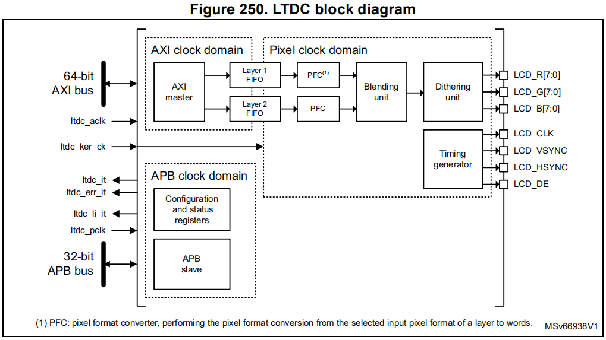

#### LCD 同步时序
对于 RGB 并行接口输出，LTDC 输出的有效区域由下图中的时序信号决定：
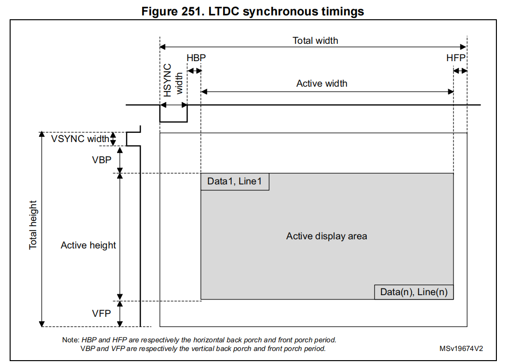

图中的这些参数本质上就是 LCD 面板的时序配置，对应于标准的显示扫描结构：
- HSYNC/VSYNC：同步脉冲，用来告诉面板一行/一帧的开始。
- Back Porch (HBP/VBP)：同步脉冲之后的空白区，给面板留缓冲时间。
- Active Area：真正显示像素的区域。
- Front Porch (HFP/VFP)：显示区之后的空白区，保证时序完整。
- Total Width/Height：一行/一帧的总周期长度 = 同步脉冲 + 后沿 + 有效区 + 前沿。

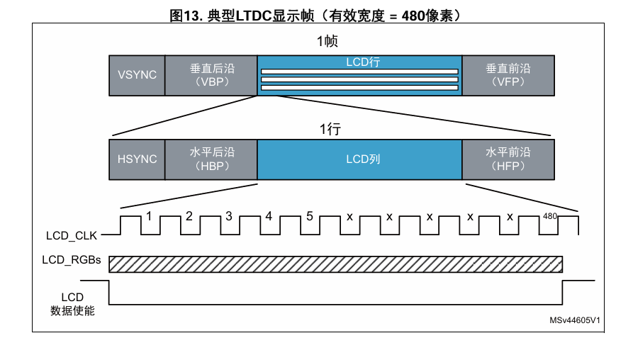

通过LTDC_GCR寄存器可将水平/垂直同步信号、数据使能信号及像素时钟输出信号的极性设置为高电平有效或低电平有效。该极性设置需要和控制的LCD 面板进行匹配。

#### Dithering（抖动）

背景：LTDC 内部处理的是 24 位颜色数据 (RGB888)，但有些 LCD 面板只能显示 18 位颜色 (RGB666)。直接截断会导致颜色层次不够平滑，出现明显的色阶。

解决方法：LTDC 提供 伪随机抖动 (Dithering) 技术，用 LFSR（线性反馈移位寄存器） 生成随机阈值，对像素的低位进行比较和修正：
- 每个颜色通道（R/G/B）有 8 位。
- 面板只能显示 6 位时，低 2 位（LSB）会被丢弃。
- LTDC 用随机阈值比较 LSB：
  - 如果 LSB ≥ 阈值，就把 MSB 部分加 1（相当于四舍五入）。
  - 如果 LSB < 阈值，就保持原 MSB 部分的值。

这样不同帧的像素会有轻微随机差异，视觉上更平滑。

#### Reload Shadow Registers（影子寄存器重载）
背景问题：LTDC 有很多配置寄存器（各图层的窗口大小、颜色格式等）。如果直接修改这些寄存器，可能会在显示过程中产生“撕裂”或不一致。

解决方法：LTDC 使用 影子寄存器 (Shadow Registers) 机制：

影子寄存器：
- 写入时，先写到影子寄存器。
- 真正生效时，需要触发 Reload，把影子寄存器的值复制到活动寄存器。

两种 Reload 方式：通过寄存器 LTDC_SRCR 控制
- 立即重载：写完所有新值后，立刻触发 Reload。
- 垂直消隐期重载：在下一帧的垂直消隐期自动更新，避免显示撕裂。

读取影子寄存器时，返回的是当前活动值。只有 Reload 完成后，才能读到新值。可以配置 Reload 完成中断（LTDC_IER），方便 MCU 知道更新已生效。

所有 Layer1/Layer2 的寄存器都是影子寄存器，除了 CLUT 写寄存器 (LTDC_LxCLUTWR)。

#### 图层 (Layer) 管理

LTDC 最多支持 两个图层，可以分别启用、禁用和独立配置。
每个图层需要配置：
- 帧缓冲起始地址，通过 LTDC_LxCFBAR 寄存器配置，图层启用时，LTDC 会从这个地址开始读取图像数据。
- 行长度 (line length)：一行的字节数，通过 LTDC_LxCFBLR 设置。
- 行数 (number of lines)：帧缓冲的总行数，通过 LTDC_LxCFBLNR 设置。
- 作用：告诉 LTDC 在帧缓冲中什么时候停止预取数据。
  如果设置的字节数 少于实际需要 → 会触发 FIFO underrun 中断（如果启用）
  如果设置的字节数 多于实际需要 → 多余的数据会被丢弃，不会显示。

图层的显示顺序是 自下而上：Layer1 在底层，Layer2 在上层。

窗口 (Windowing)：
- 每个图层都可以设置 位置和大小，但必须位于整个显示的有效区域内。
- 窗口位置和大小通过 左上角坐标和右下角坐标来定义。
LTDC_LxWHPCR：设置水平起始/结束像素位置。
LTDC_LxWVPCR：设置垂直起始/结束行位置。
这样可以显示整幅图像，也可以只显示图像的一部分（裁剪窗口）。
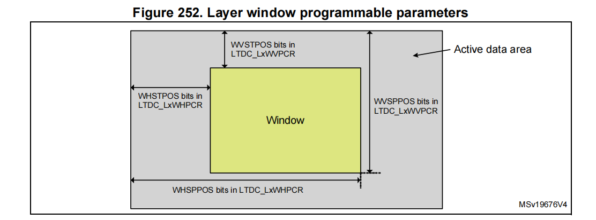

像素输入格式 (Pixel Input Format)：
- 每个图层的帧缓冲数据格式可以单独配置。
- 支持 8 种输入像素格式，通过 LTDC_LxPFCR 寄存器选择。
- LTDC 会把输入数据转换为内部统一的 ARGB8888 格式：
- 如果某个通道少于 8 位，会通过 位复制扩展到 8 位。例如：RGB565 的红色通道只有 5 位 → 扩展成 8 位：43210->43210432（把高位置值重复填充低位置）。

颜色查找表 (CLUT, Color Look-Up Table)：
- 每个图层都有一个自己的颜色查找表，CLUT 是一种 索引颜色机制，只在使用 L8、AL44、AL88 格式时有用。
- 工作方式：帧缓冲里存储的不是直接的 RGB 值，而是一个 索引值。LTDC 根据索引去查 CLUT 表，得到对应的 RGB 值。
- CLUT 表需要提前加载，每个索引对应一个 RGB 颜色。
通过寄存器 LTDC_LxCLUTWR，写入 CLUT 表项，每个颜色有一个地址 (CLUTADD)，对应表中的位置。

CLUT 可以节省显存，用较小的索引代替完整的 RGB 值，适合调色板类应用。

Layer blending（图层混合）：
- 混合功能始终启用。
- 两个图层可以根据 LTDC_LxBFCR 寄存器中的混合因子进行叠加。
- 混合顺序固定：Layer1 与背景色混合。Layer2 再与 Layer1+背景的结果混合。
- 背景颜色设置：通过LTDC_BCCR寄存器可编程为恒定背景颜色（RGB888），该颜色用于与底层图像进行混合显示。

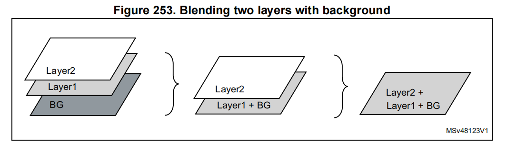

Default color（默认颜色）:每个图层可以通过 LTDC_LxDCCR 寄存器设置一个 默认颜色 (ARGB)，用于：图层窗口之外的区域。或图层被禁用时。
注意：**即使图层禁用，混合仍然会进行。如果不想显示默认颜色，需要把该图层的混合因子保持在复位值。**

Color keying（颜色键控）：
可以设置一个 颜色键 (RGB)，代表透明像素。启用后，LTDC 会在 像素格式转换到 ARGB8888 之后，比较当前像素与颜色键：
- 如果匹配 → 该像素的所有通道 (ARGB) 置为 0，即透明。
- 配置寄存器：LTDC_LxCKCR。
- 使用场景：在图像中指定某种颜色作为透明背景。

#### LTDC 对存储带宽的要求

LTDC所需带宽主要取决于三个因素：
- 所用LTDC层数
- LTDC层色深（每个像素的位数）
- 像素时钟：长度 * 宽度 * 帧率

像素时钟越大，则 LTDC 读取数据的所需带宽就越高。
通常，位于内部RAM中的小尺寸帧缓冲区不需要高带宽。因为小尺寸帧缓冲区意味着低像素时钟，因此LTDC所需带宽较低。

更大尺寸的图形应用，会使用外部 SDRAM 存储器作为帧缓冲器。通常外部 SDRAM 存储器通常由多个主设备共享，即外部SDRAM 的存储带宽，一般由 LTDC 和多个主设备共享。而多个主设备在同一外部存储器上并行访问，会导致更多延迟并影响存储器吞吐量。

下图是 STM32H747 上，在给定 SDRAM 的带宽下，LTDC 允许的最大像素时钟参考：
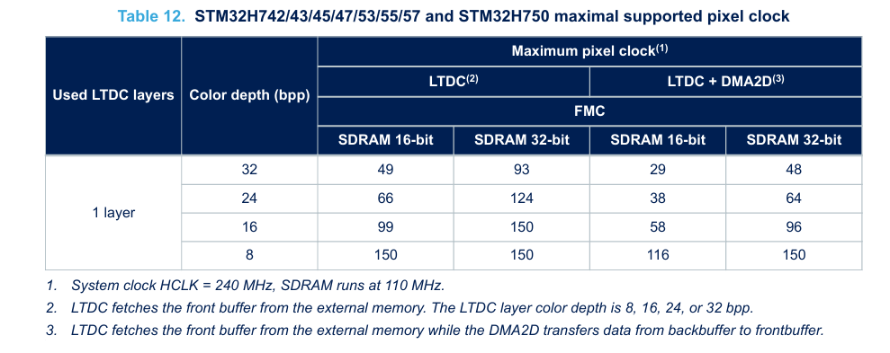
例如，图中在 110MHz 工作频率下，32 位 SDRAM 理论峰值带宽为 110MHz*32/8 = 440MB/s。一般大批量顺序续数据读取，带宽一般可以接近峰值（80–90%），而大量随机访问（sdram内部频繁换行），带宽一般可以下降到40–60%。
LTDC 从图像缓冲区读取数据，属于大批量顺序访问，因此这里在使用 1层，bpp=32的条件下，LTDC允许最大设置到93MHz (存储带宽需求：93 * 32/8 = 372MB/s)

#### LTDC 设置流程
使能LTDC时钟            
配置像素时钟            
配置同步时序            
配置同步信号极性        
配置背景颜色            
配置中断（如需要）      
配置层参数，使能层   
配置抖动/颜色键（如需要）
加载阴影寄存器         
使能LTDC控制器         

### STM32H747 DSI Host

MIPI DSI（Display Serial Interface） 是由 MIPI 联盟定义的一组显示通信协议之一。
DSI Host 控制器 是一个数字核心，负责实现 MIPI DSI 规范中的所有协议功能。它提供了系统与 MIPI D-PHY (支持DDR模式，上、下边沿都传输数据)之间的接口，使主机能够与符合 DSI 标准的显示器通信。

DSI Host 包含专用的视频接口（内部连接到 LTDC），以及一个通用的 APB 接口，用于向显示器传输信息。
- LTDC 接口：负责像素流传输（视频模式），也能在定制模式下支持命令模式的大数据传输。
- APB 接口：负责命令和寄存器级别的控制信息传输，可以与 LTDC 并行。
- 图案发生器：提供内置测试图案和链路测试功能，方便调试。

总的来说，DSI Host 就是一个桥梁：
- LTDC → DSI Host → D-PHY → 显示屏（传输图像数据）
- APB → DSI Host → D-PHY → 显示屏（传输命令/控制信息）

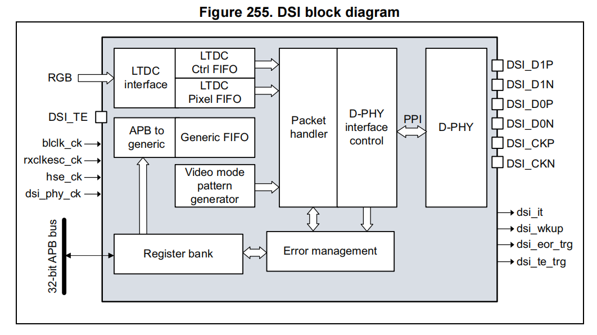

DSI Host 系统架构组成部分如下图所示：

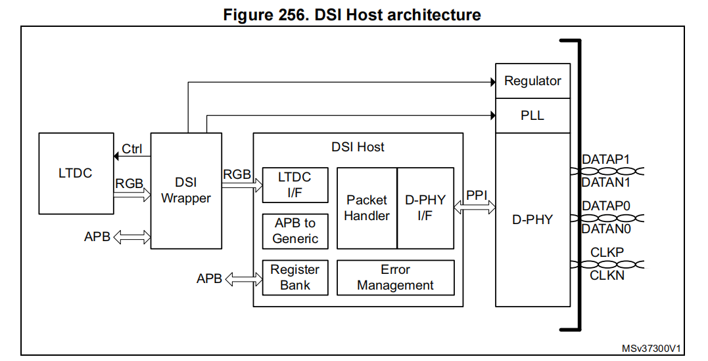

各部分功能概括：

- DSI Wrapper：负责 LTDC 与 DSI Host 内核之间的接口适配。功能包括：
  - 颜色模式转换。
  - 信号极性调整。
  - 撕裂效应 (TE) 管理：在命令模式下自动更新帧缓冲。
  - 控制 DSI 电源调节器、DSI PLL 以及 MIPI D-PHY 的特定功能。

- LTDC 接口捕获来自 LTDC 的数据和控制信号。将这些信号送入两个 FIFO（一个用于视频控制信号，一个用于像素数据）然后根据模式生成：
  - 视频包 (Video Packets) → 视频模式下使用。
  - memory_write_start / memory_write_continue DCS 命令 → 命令模式下使用。

- 寄存器库 (Register Bank)：通过 AMBA-APB 从接口访问，用于配置和控制 DSI Host 寄存器。提供 可编程中断发生器，用于通知系统特定事件。

- PHY 接口控制：用于管理 MIPI D-PHY 接口，功能包括：
  - 确认当前操作模式。
  - 启用低功耗传输/接收或高速传输。
  - 在高速传输时，将数据分配到可用的 D-PHY 数据通道。

- 数据包处理器 (Packet Handler)：负责调度链路内部的活动。根据当前接口和视频传输模式（突发模式 / 非突发模式 + 同步脉冲/事件）执行功能。构建长包或短包，并生成对应的 ECC 和 CRC 校验码。其他功能包括：
  - 接收数据包。
  - 数据校验、错误通知
  - 根据虚拟通道 ID，将接收到的数据路由到对应端口。

- APB-to-Generic 模块，用于将 APB 操作桥接到保存通用命令的 FIFO，包括：
  - 命令 FIFO。
  - 写入负载 FIFO。
  - 读取负载 FIFO。

- 错误管理 (Error Management)
  - 负责通知和监控 DSI 链路上的错误情况。
  - 控制定时器，用于判断是否发生超时。
  - 在错误情况下执行内部软复位，并触发中断通知。

#### 功能描述：LTDC 接口在视频模式下的作用
LTDC 接口捕获数据和控制信号，并将它们送入 FIFO，再通过 DSI 链路传输。

接口上存在两类数据流：
- 视频控制信号（VSYNC、HSYNC 等）。
- 像素数据。

像素数据在 LTDC 总线上如何分布，取决于接口的颜色编码方式（如 16 位、18 位、24 位 RGB）。

LTDC 接口的配置选项
- 极性控制 (Polarity Control)
- 所有控制信号的极性可编程，以适配不同的 LTDC 配置。
- 复位后的启动条件：在核心复位后，DSI Host 会等待 第一次 VSYNC 有效跳变，才开始采样信号（包括像素数据）。这样可以避免在一帧中途开始传输图像数据。
- 为避免 FIFO 下溢或上溢，系统假设 LTDC 始终按配置的像素数提供数据。
- 使用“每包像素数”参数来区分不同视频包的内存空间，保证调度有序。

为了进行 SHTDN（关机） 和 COLM（列命令） 的采样与传输，LTDC 必须处于 视频流激活状态。如果 LTDC 没有生成视频信号（如 VSYNC、HSYNC），这些信号就不会通过 DSI 链路传输。因此，为了正确传输命令，必须等待 第一次 VSYNC 有效脉冲。
在关闭显示时，LTDC 必须保持激活至少 一个帧周期，以确保命令在关闭视频生成前被正确传输。
SHTDN 和 COLM 的值可在 DSI Wrapper 控制寄存器 (DSI_WCR) 中配置。

像素数据接收规则
- 对所有数据类型，每个时钟周期接收 一个完整像素。
- 负载中的像素数必须是某个值的倍数

| 倍数 | 数据类型 |
|------|----------|
| 1    | 16 位、18 位 loosely packed、24 位 |
| 2    | loosely packed 像素流 |
| 4    | 18 位非 loosely packed |

影子寄存器机制：允许在视频传输过程中动态更新 LTDC 配置，不影响当前帧。

##### 视频传输模式
DSI 有几种视频传输模式：
- 突发模式 (Burst mode)
- 非突发模式 (Non-burst mode)
  - 非突发模式 + 同步脉冲 (Sync pulse, 固定长度的同步脉冲)
  - 非突发模式 + 同步事件 (Sync event，边沿信号)

突发模式 (Burst mode)：整个活动像素行会先缓存在 FIFO 中，然后一次性打包成一个数据包传输，没有中断。
- 要求：DPI 像素 FIFO 必须能存储完整的一行像素数据。
- 优点：当像素带宽需求与 DSI 链路带宽差距较大时，可以快速传输整行数据，然后链路进入低功耗模式。
- 适用场景：显示器支持整行像素一次性接收，且 DSI 输出带宽明显高于 LTDC 输入带宽。

非突发模式 (Non-burst mode)：视频行被分割成多个 DSI 包传输，以匹配像素带宽与 DSI 链路带宽。
- 不需要 LTDC FIFO 存储整行像素，只需存储一个视频包的内容。
- 优点：内存需求更小（不必存储整行像素）。适合显示器缓冲能力有限的场景。
- 可选：在分割的像素块之间插入 空包 (Null packets)，用于带宽匹配。

选择模式的指南:
突发模式更节能，因为链路能更频繁进入低功耗状态。
使用突发模式的条件：
- DSI Host 必须有足够的像素内存存储整行像素。
- 显示器必须支持整行像素一次性接收。
- DSI 输出带宽必须高于 LTDC 输入带宽，保证每行传输后能进入低功耗。

如果条件不满足，突发模式可能导致像素丢失 → 显示异常。

非突发模式更安全，适合：
- 主机内存有限。
- 显示器缓冲能力有限（不足一行）。

DSI 非突发模式必须配置为使 DSI 输出像素速率与 LTDC 接口输入像素速率相匹配。该功能通过将像素行分割为若干像素块，并可选地与空数据包交错传输，以实现速率匹配：DSI 一行发送时间 ≈ LTDC 一行生成时间
- 当启用空数据包时：lanebyteclkperiod * NUMC (VPSIZE * bytes_per_pixel + 12 + NPSIZE) / number_of_lanes = pixels_per_line * LTDC_Clock_period
- 当空数据包被禁用时：lanebyteclkperiod * NUMC (VPSIZE * bytes_per_pixel + 6) / number_of_lanes = pixels_per_line * LTDC_Clock_period
- 这里：
  - lanebyteclkperiod 就是 DSI 每传输 1 字节所需的时间，单位为秒。
  - NUMC: 每条像素行被分割成的“视频包数量”（chunks per line）。例如一行 800 像素，若每包 200 像素，则 NUMC = 4。
  - VPSIZE: 每个视频包中包含的“像素数”（pixels per packet）
  - bytes_per_pixel: 每像素的字节数。典型值：RGB565 为 2，RGB888（24-bit）为 3。
  - NPSIZE: 空包（Null packet）的负载字节数。
  - number_of_lanes: D-PHY 数据通道数量（1 或 2）
  - pixels_per_line: 每行的有效像素数
  - LTDC_Clock_period: LTDC 像素时钟周期（秒/像素）

#### 功能描述：适用于 LTDC 接口的适配命令模式

适配命令模式允许系统通过 LTDC 输入像素流，并由 DSI Host 使用 命令模式传输 (DCS 包) 发送到显示器。主要通过 write_memory_start (WMS) 和 write_memory_continue (WMC) 命令传输大量像素数据，适合高分辨率显示器的局部或整屏刷新。支持 像素输入速率控制 和 撕裂效应 (Tearing Effect, TE) 报告机制。支持 16bpp、18bpp、24bpp RGB 格式。
**备注**：DCS 是 MIPI 联盟为 DSI 和 DBI-2 标准使用的命令集规范。命令由主处理器发送到显示模块。在显示模块上，显示控制器接收并解释命令，然后采取相应的操作。命令大致分为四类：读取寄存器、写入寄存器、读取内存和写入内存。一个命令可以包含多个参数。

以适配命令模式传输图像数据，配置步骤：
- 进入命令模式：
  - 设置 DSI Host 模式配置寄存器 (DSI_MCR) 的 CMDM 位 = 1。
  - 设置 DSI Wrapper 配置寄存器 (DSI_WCFGR) 的 DSIM 位 = 1。
- 定义刷新区域：使用 DCS 命令 set_column_address 和 set_page_address 定义刷新区域。
- 定义颜色编码：在 DSI_LCOLCR 寄存器的 COLC 字段中设置像素颜色编码。
- 定义虚拟通道 ID：在 DSI_LVCIDR 寄存器的 VCID 字段中设置虚拟通道 ID。
- 启动传输：设置 DSI_WCR 寄存器的 LTDCEN 位 = 1。

命令模式下的像素流处理：
- LTDC 接口接收连续像素流，并自动控制流量。
- DSI_LCCR寄存器的 CMDSIZE 字段：定义每个命令包的像素数。
- 工作机制：第一个包用 WMS，后续包用 WMC，直到最后一个像素。
  - 每接收一个像素，计数器 +1。
  - 最后一个像素到来时，像素计数 < CMDSIZE → 生成 WMS 命令，字节数 = 当前像素数。
  - 如果像素计数 > CMDSIZE → 生成 WMS 命令，字节数 = CMDSIZE，计数器重置。

与 LTDC 的同步：
- DSI Wrapper负责同步：
  - 控制 LTDC 的启动/停止。
  - 控制 LTDC 与 DSI Host 的数据流。
- 刷新触发方式：
  - 手动：设置 DSI_WCR 的 LTDCEN 位。
  - 自动：当 TEIF（ tearing effect） 事件发生且 AR（automatic refresh） 位使能时。
- 刷新完成后：
  - DSI Wrapper 停止 LTDC，清除 LTDCEN 位。LTDC 的停止与 VSync 边沿同步，具体由 VSPOL 位决定。
  - 设置 DSI_WSR 寄存器的 ERIF（ end of refresh interrupt flag）标志位。
  - 如果 DSI_WCFGR 的 ERIE 位使能 → 触发中断。

撕裂效应 (Tearing Effect, TE) 支持：
- 作用：让主机知道显示器正在读取帧缓冲的进度，避免撕裂。
- 两种实现方式：
  - GPIO 引脚方式：设置 DSI_WCFGR 的 TESRC 位 → TE 信号通过 GPIO 输入。
  通过 TEPOL 位可配置输入信号极性。检测到设定边沿 → TEIF 标志位置位，如果TEIE 位使能了 → 触发中断。
  - DSI 链路方式：设置 DSI_WCFGR 的TESRC 位复位 → TE 通过 DSI 链路管理。
  主机发送 set_tear_on 命令后，执行 双向总线切换 (BTA)，显示器获得总线控制权。当 TE 事件发生时，显示器通过 D-PHY 触发事件通知主机。主机解码触发 → 设置 TEIF 标志位，如果 TEIE 位使能了 → 触发中断。
  **注意**：DSI Host 不会自动在 WMS/WMC 后生成 TE 请求，必须显式发送 set_tear_on 命令。
  需要配置以下寄存器来激活撕裂效果：
  DSI_CMCR (Command Mode Configuration Register)：TEARE 位 → 启用 TE 功能。
  DSI_PCR (Protocol Configuration Register)：BTAE 位 → 启用总线反转 (BTA)。

#### 视频模式 和 命令模式区别：

每个 DSI 包都有一个 包头 (Packet Header)，其中包含Data Type (DT) 字段来区分数据是属于视频模式的数据路包，还是命令模式的命令包。

视频模式 (Video Mode)下，像素数据作为 视频流包 (Video Packet) 传输：
- LTDC 持续产生像素流 → DSI Host 打包成视频包 → 通过 DSI 链路传输。
- 特点：像素数据是 实时流式传输，和显示器的扫描时序保持同步。支持 突发模式 (Burst) 或 非突发模式 (Non-burst)，并可选择 Sync Pulse / Sync Event。
- LTDC 的 VSYNC/HSYNC 信号直接参与 DSI 包的生成。
- 优点：适合持续刷新整屏，时序和显示器严格同步。带宽利用率高，延迟低。
- 缺点：必须保证 DSI 链路带宽 ≥ LTDC 像素流带宽，否则会溢出/丢帧。不适合只更新局部区域。

命令模式 (Adapted Command Mode)下，像素数据作为命令模式数据包传输：
- LTDC 产生像素流 → DSI Host 将像素打包成 DCS 命令 (WMS/WMC) → 写入显示器的帧缓冲。
- 特点：像素数据不是实时流，而是通过 命令包写入显示器的内存。
支持 局部区域刷新（通过 set_column_address / set_page_address 定义区域）。
- 优点：可以只更新部分区域，节省带宽。适合高分辨率显示器，避免整屏刷新。支持 撕裂效应 (TE) 同步机制，保证更新时机安全。
- 缺点：延迟比视频模式高，因为要经过命令解析。带宽利用率低于视频模式。

#### 功能描述：APB 从接口
APB 从接口是 命令模式下的通用数据通道，支持 DCS 和 Generic 命令。
DSI Host支持通过 APB 寄存器访问来构建和发送命令模式的读写包。

关键寄存器：
- DSI_GPDR (Generic Payload Data Register)
  - 写入时：作为命令模式包的负载数据。
  - 读取时：返回读回操作的负载数据。
- DSI_GHCR (Generic Header Configuration Register)
  - 包含命令模式包的头部类型和头部数据。
  - 写入该寄存器会触发包的发送。
  - 对于长包，必须先把负载写入 GPDR，再写 GHCR。
- DSI_GPSR (Generic Packet Status Register)
  - 报告与 APB 接口相关的 FIFO 状态。

APB 总线传输条件：
- APB 协议定义每次读写操作需要 两个时钟周期。因此最大输入数据速率 = APB 时钟频率的一半。
- 数据总线宽度：最大 32 位。这决定了 APB 时钟频率与最大比特率的关系。

- 使用 APB 时，DSI 链路速率公式：
  - 理论最大比特率 = APB 时钟频率 (MHz) × 32 / 2 Mbit/s。
    其中 32 = APB 数据总线宽度。
    除以 2 = 每次写操作需要两个时钟周期。
    带宽依赖于 APB 时钟频率：时钟越高，带宽越大。

要实现高带宽的命令模式传输：要求DSI Host 必须只在命令模式下工作，并且APB 接口必须是唯一的数据源，不与其他接口共享带宽。

内存写命令 (Memory Write)通过 DCS 长包封装在 DSI 包中，写入步骤：
- 先把负载写入 GPDR（像素或命令参数）。当负载是命令参数时，第一个字节放在 APB 数据总线的最低有效字节位置。
- 再把包头写入 GHCR → 进入命令 FIFO。
- 对于像素数据，必须遵循 DCS 规范附录 A 的 像素到字节转换规则。

DCS 规范要求：包的第一个负载字节必须是 DCS 命令码（如 Write Memory Start）。

下图为 16bpp 格式的像素数据在APB数据写入总线中的组织方式。
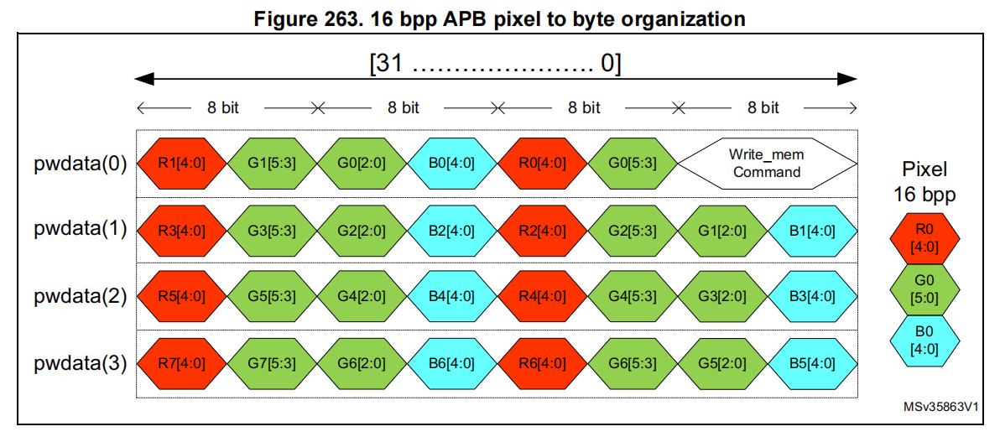

#### 功能描述：DSI Host 的超时计数器 

DSI Host 内部包含一组计数器，用来管理不同通信阶段的超时。
这些超时的持续时间，由六个超时计数器配置寄存器 DSI_TCCR0 ~ DSI_TCCR5 来设定。

分为两类：
- 争用错误检测超时计数器 (Contention error detection timeout counters)：防止高速传输或低功耗接收状态异常长时间占用，触发软复位和中断。
- 外设响应超时计数器 (Peripheral response timeout counters)：链路进入空闲状态直到超时结束。

##### 争用错误检测超时计数器
用于检测链路在 高速传输 或 低功耗接收 状态下是否出现异常长时间占用。每个计数器都有对应的寄存器字段和中断标志位。

当计数器达到设定值时：对应的 状态标志位 (Flag) 置位；触发 内部软复位；如果启用了中断使能位，还会产生中断。

高速传输超时检测：
- 配置字段：HSTX_TOCNT (DSI_TCCR0 寄存器)。
- 计数器测量高速模式持续时间。
- 达到设定值 → TOHSTX 标志位置位 → 内部软复位。
- 如果 TOHSTXIE 使能 → 触发中断。

低功耗接收超时检测：
- 配置字段：LPRX_TOCNT (DSI_TCCR1 寄存器)。
- 计数器测量低功耗接收持续时间。
- 达到设定值 → TOLPRX 标志位置位 → 内部软复位。
- 如果 TOLPRXIE 使能 → 触发中断。

软件收到中断后必须通过 DSI_PCTLR 寄存器的 DEN 位对 D-PHY 执行一次关闭/开启操作来复位。

##### 外设响应超时计数器
用于处理外设响应延迟的情况。
例如：显示面板正在刷新，暂时无法访问 RAM → 主机发出读请求后需要等待。设置超时确保主机等待足够长时间，避免过早发送新请求，防止 Host 在外设未准备好时继续发送，导致链路错误。

工作机制：当事件触发超时计数器时，D-PHY 切换到 Stop 状态，链路保持在空闲状态直到超时结束。即使有其他事件准备好，也不会传输。
将某类事件的超时值设为 0 ，则表示禁用该类事件的超时。

高速读写和低功耗读写分别有独立的超时配置。

外设响应超时仅用于命令模式，视频模式下不使用外设响应超时，因为时序必须严格保持。

#### 功能描述：命令传输
DSI Host 在视频模式下也能传输命令，既可以在高速 (HS) 模式，也可以在低功耗 (LP) 模式。命令通过 APB 通用接口插入，在视频模式的 消隐期 (blanking / BLLP) 传输。

如果命令太大，无法放入任何 BLLP 区域，则推迟到最后一行传输。

这会违反视频模式的行时间 (line time)，并触发 edpihalt 信号，要求 DPI 视频时序保持不活动。（触发edpihalt 信号，DSI Host 通知 DPI接口（LTDC） 暂停视频时序，不要再继续送像素数据，避免错误刷新。）

特殊控制命令：通过 DSI_WCR 控制寄存器的 COLM 和 SHTDN 位可触发以下命令。此外，如果 DSI_VMCR.LPCE 置位，则这些命令以低功耗模式发送。
- Color mode ON
- Color mode OFF
- Shut down peripheral
- Turn on peripheral

低功耗模式下，DSI_LPMCR.LPSIZE 字段决定低功耗模式下可发送的最大包大小。必须 ≥ 4 字节（短包大小），否则命令无法发送。

总线反转 (BTA)：如果 DSI_LPMCR.FBTAAE 置位 → 在帧最后一行后生成 BTA。在 BTA 完成前，LTDC 接口被暂停，等待外设返回 ACK。

##### 低功耗模式下的命令传输
DSI Host 可以在 视频模式高速传输期间插入低功耗命令。
使能条件：设置 DSI_VMCR.LPCE = 1。

**VSA 、 VBP 和 VFP 区LP模式下命令传输时间计算：**
DSI 主机低功耗模式配置寄存器（DSI_LPMCR）的最大数据包大小（LPSIZE）字段，用于指示在 VSA 、 VBP 和 VFP 区域中，通过线路传输命令的可用时间（以字节为单位）。

LPSIZE 计算公式：
LPSIZE = (tL - (tH1 + tHS->LP + tLP->HS + tLPDT + 2 tESCCLK)) / (2 × 8 × tESCCLK)

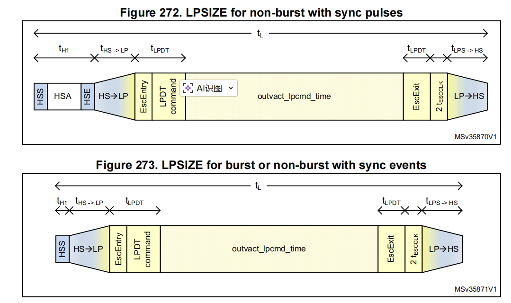

其中：
- tL：行时间
- tH1：HSA 脉冲时间（或 HSS 包时间）
- tHS->LP：进入低功耗模式时间
- tLP->HS：退出低功耗模式时间
- tLPDT：D-PHY 逃逸模式(Escape Mode)相关时间（**固定为 22 个 逃逸时钟周期(escape clock cycles)**）
- tESCCLK：DSI_CCR寄存器 TXECKDIV 字段中设定的逃逸时钟周期
- 除以 8 → 转换为字节；除以 2 → 因为每两个逃逸时钟周期传输一位数据。
- 最大数据包大小（LPSIZE）字段可直接与待传输命令的大小进行比较，以判断是否有足够时间完成命令传输。
最大命令大小受限于 255 字节。

备注信息：
- 在 D-PHY 规范里，Escape Mode 是指从高速模式“逃逸”到低功耗模式，用来执行控制类操作。Escape clock 就是这个模式下的时钟。在 DSI Host 的寄存器里，通常通过 TXECKDIV 字段配置 escape clock 的分频。
- HS 模式：用高速差分信号传输像素流，时钟由 lane byte clock 驱动。
- LP 模式：用 escape clock 驱动，速率较低，用于命令、控制、BTA 等操作。。

举例：
假设一帧的 行时间 (tL) = 12.4 μs。逃逸时钟 (escape clock) = 20 MHz → 周期 50 ns。lane bit rate = 800 Mbit/s → 每个 lane 的字节时钟周期 = 10 ns。
在这种情况下，如果只考虑行时间和逃逸时钟速率：
12.4 μs * 20 MHz / 2 = 124 bit
即在一行时间内，理论上可以在 LP 模式下发送 124 bit。但是，还需要考虑 D-PHY 协议和物理层时序开销。

- lane byte clock 周期 = 10 ns (对应 800 Mbit/s)。
- tL：行时间 (12.4 μs)。
- tH1：假设 HSA 脉冲时间 (420 ns)。
- D-PHY 切换时间：
  - LP → HS = 180 ns (LS2HS_TIME = 18)。
  - HS → LP = 200 ns (HS2LP_TIME = 20)。
- tLPDT：D-PHY 逃逸模式相关时间 (22 × 50 ns = 1100 ns)。

带入计算可以得到：
LPSIZE = (12.4 μs - (420 ns + 180 ns +200 ns + (22 × 50 ns + 2 × 50 ns))) / (2 × 8 × 50 ns) = 13 bytes.

**HFP 区低功耗模式下命令传输时间的计算**:

VLPSIZE 字段（在寄存器 DSI_LPMCR 中）表示在 VACT 区域内，基于 逃逸时钟 (escape clock)，可用于传输低功耗命令的最大字节数。
计算 VLPSIZE 时，需要考虑视频模式类型（非突发带同步脉冲、非突发带同步事件、突发模式），因为不同模式下的时序安排不同。

VLPSIZE 计算公式:
VLPSIZE = (tL - (tHSA + tHBP + tHACT + tHS->LP + tLP->HS + tLPDT + 2 tESCCLK)) /(2 × 8 × tESCCLK)
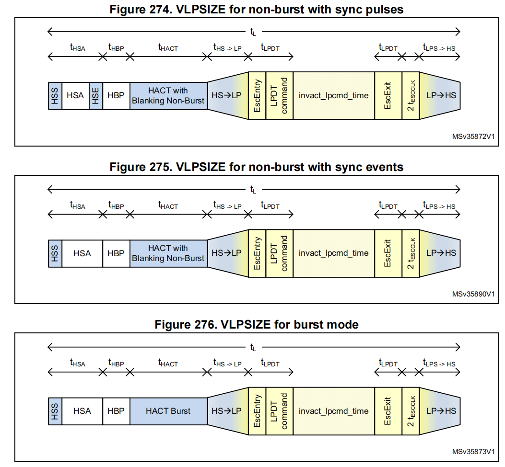
其中：
- tL：行时间。
- tHSA：水平同步激活脉冲时间。
- tHBP：水平后肩时间。
- tHACT：视频有效显示时间。在突发模式下，视频数据压缩传输，计算公式为 tHACT = VPSIZE * Bytes_per_Pixel /Number_Lanes * tLane_byte_clk
- tHS->LP：高速切换到低功耗的时间。
- tLP->HS：低功耗切换到高速的时间。
- tLPDT：D-PHY 逃逸模式相关时间（固定为 22 个 ESC 时钟周期）。
- tESCCLK：逃逸时钟周期。
- 分母中的 2 × 8 × tESCCLK：
  除以 8 → 转换为字节。
  除以 2 → 因为 LP 模式下每两个 ESC 周期传输 1 bit。

**LPSIZE** 和 **VLPSIZE** 两个字段结合使用，可以快速判断命令是否能在某个消隐期或 VACT 区域传输：
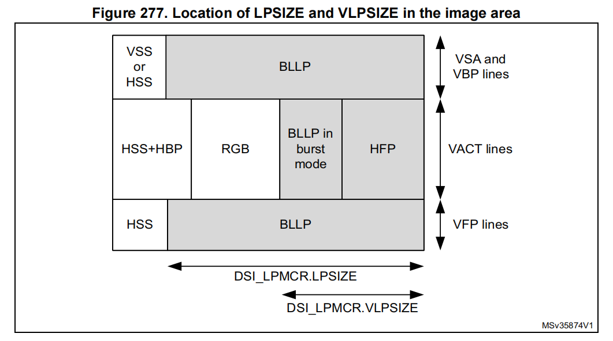

**高速模式下的命令传输**
如果 DSI_VMCR 寄存器的 LPCE 位 = 0，那么命令在视频模式下会以 高速模式 (HS) 传输。在这种情况下，DSI Host 自动决定命令在哪个区域传输，不需要软件额外编程或计算。

**读命令传输**
MRD_TIME 字段 (DSI_DLTCR 寄存器) 用来配置执行一次读命令所需的最大时间（单位：lane byte clock 周期）。
计算公式：MRD_TIME = 低功耗模式下传输读命令的时间 + 进入/退出低功耗模式的时间 + 外设返回数据包的时间

外设返回数据包的时间 (tread) 取决于：
- 读取的字节数。
- 外设的逃逸时钟频率（注意：不是 Host 的 ESC 时钟）。

MRD_TIME 在 高速模式和低功耗模式 都会用来判断：在一个 BLLP 区域内是否有足够时间完成读命令。

high-speed mode (LPCE = 0)：
MRD_TIME = (tHS->LP + tLP->HS + tread + 2 x tBTA) / lanebyteclkperiod

low-power mode (LPCE = 1)：
MRD_TIME = (tHS->LP + tLP->HS + tLPDT + tlprd + tread + 2 x tBTA) / lanebyteclkperiod

其中：
- tLPDT：D-PHY 逃逸模式相关时间（固定为 22 × ESC 周期）。
- tlprd：低功耗模式下读命令时间（固定为 64 × ESC 周期）。
tread：外设返回数据包时间。
tBTA：总线反转时间。

使用注意:
- 尽量减少读取字节数，保证读命令能在一行时间内完成。
- 必须满足： MRD_TIME x lane_byte_clock_period < LPSIZE x 16 x escape_clock_period（host侧）
否则读命令会被推迟到 最后一行。
- 如果需要读取大量参数（>16），可以在执行读命令时 临时增大 MRD_TIME，读完后再调回较小值。
- 如果读命令在最后一行执行 → LTDC 接口会被挂起，直到读命令完成，视频传输必须暂停。

**时钟通道的低功耗模式**
为了降低 D-PHY 的功耗，DSI Host 在不进行高速传输时，允许 时钟通道 (clock lane) 进入低功耗模式。
控制器会自动处理 时钟通道 HS ↔ LP 的切换，软件无需直接干预。
使能方法：配置 DSI_CLCR 寄存器中的 DPCC 和 ACR 位。

配置要求：
- Host 需要知道时钟通道 HS ↔ LP 的切换时间：
  - HS2LP_TIME = HS → LP 时间 / HS 字节时钟周期。
  - LP2HS_TIME = LP → HS 时间 / HS 字节时钟周期。
- 这些值来自 D-PHY 规范，需写入 DSI_CLTCR 寄存器。

#### 功能描述：虚拟通道
DSI Host 支持虚拟通道 (VC)，每个接口可以选择不同的虚拟通道 ID。
使用多个虚拟通道时，可以同时驱动多个显示器，每个显示器对应不同的 VC ID。

LTDC 与 APB 通用接口的配合：
- 当 LTDC 接口配置了某个虚拟通道时，APB 通用接口仍然可以在视频流传输过程中发命令。
- 这样就能在视频流进行时，插入命令包，针对不同虚拟通道，从而实现多显示器控制。
- 在视频模式下，视频流优先级最高，所以通用接口的命令包只有在视频流有空隙时才会被插入。
- DSI Host 会自动识别这些空隙，把 APB 通用接口的包插入到视频流中。

仅用通用接口控制多显示器：
- 通用接口本身不绑定特定虚拟通道，可以通过不同 VC ID 来区分目标显示器。
- 这样就能实现 时分复用，在同一物理链路上控制多个显示器。

相关寄存器：
- DSI_LVCIDR.VCID：配置 LTDC 视频模式包的虚拟通道 ID。视频像素流（即 LTDC 输出的图像数据）会被打包成 DSI 视频包，这些包会带上 VCID。
- DSI_GHCR：配置通用接口命令包的头部（包含虚拟通道 ID）。
- DSI_GVCIDR：配置通用接口读响应的虚拟通道 ID。外设返回读命令的响应数据时，Host 会把响应存储并返回到指定的 VCID。

#### 功能描述：视频模式图案发生器
DSI Host 内置一个 图案发生器，可以在没有外部输入的情况下，生成测试图案：
- 水平/垂直彩条 (Color Bar)
- D-PHY BER 测试图案

彩条图案模式：
包含 8 种颜色：白、黄、青、绿、品红、红、蓝、黑。
垂直彩条模式：一行像素宽度 ÷ 8 → 每条彩条宽度。余数部分由最后一条黑色填充。
水平彩条模式：帧总行数 ÷ 8 → 每条彩条高度。余数部分由最后一条黑色填充。
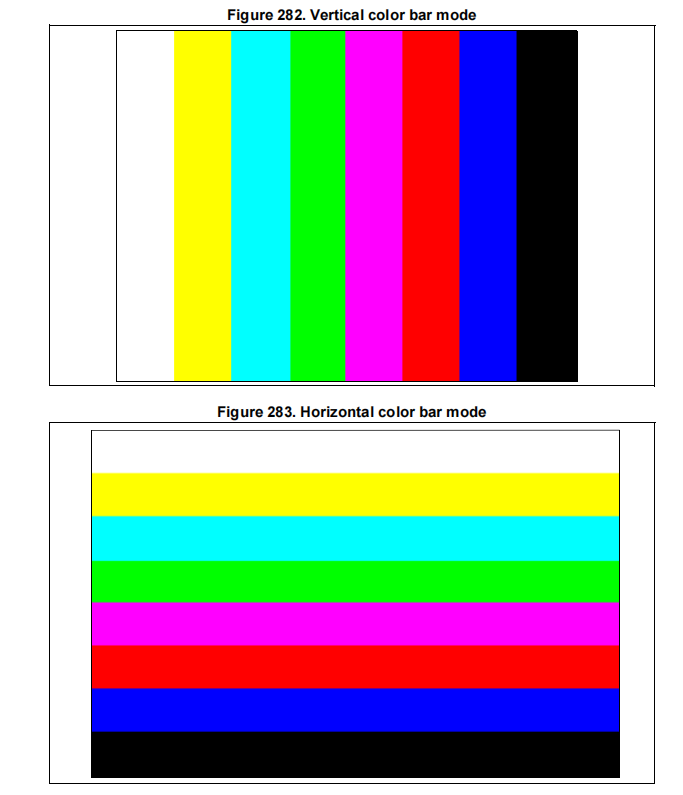

BER 测试图案:
用于测试接收端 D-PHY 的误码率能力。包含一系列固定字节模式：
- 0xAA（高频，反相）
- 0x33（中频）
- 0xF0（低频，反相）
- 0x7F（孤立 0）
- 0x55（高频）
- 0xCC（中频，反相）
- 0x0F（低频）
- 0x80（孤立 1）
在 RGB888 且水平分辨率为 8 的倍数时，显示器上会出现标准测试图案。
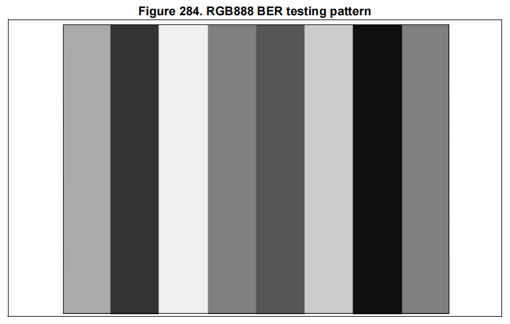

#### 功能描述：D-PHY 管理
STM32H7 内嵌的 MIPI® D-PHY 由 DSI Host 直接控制，通过 DSI Wrapper 配置。内部集成了专用 PLL 和 1.2 V 稳压器，为 DSI/D-PHY 提供时钟和电源。

**时序定义**：
- 时序定义：所有时序参数以纳秒为单位，需要配置 Unit Interval (UI)。
- DSI_WPCR0.UIX4 定义高速模式下的比特周期，以 0.25 ns 为单位。
  例如：300 Mbps → UI = 3.33 ns → UIX4 = 13.33 → 写入 13 (0x0D)。

**Slew-rate 和延迟调节**：相关控制字段在寄存器 DSI_WPCR1 中，可调节高速/低速模式下的 上升/下降速率 和 传输延迟。
lew-rate ：
- 指的是信号在引脚上从低电平到高电平（或反之）的电压变化速度，即 上升/下降沿的斜率。
- 调节意义：
  - 如果上升/下降太快 → 信号边沿陡峭，容易产生过冲、振铃和 EMI（电磁干扰）。
  - 如果上升/下降太慢 → 信号边沿拖长，可能导致接收端采样错误，降低高速传输的可靠性。
- 作用：通过调节 Slew-rate，可以在 高速传输的完整性 和 电磁兼容性之间取得平衡。

延迟调节：
- 是指在高速传输时，数据线或时钟线的信号输出相对于内部时钟的延迟。
- 调节意义：
  - 不同 PCB 走线长度、寄生电容/电感可能导致信号到达时间不一致。
  - 如果时钟和数据线之间存在偏移，接收端可能采样错误。
- 作用：通过延迟调节，可以对齐时钟与数据的相位，保证接收端在正确的时间点采样。

**低功耗接收滤波器**：
DSI_WPCR1.LPRXFT 可调节低功耗接收端的低通滤波器截止频率。用于接收端去除高频噪声，保证信号稳定。

**特殊 Sdd 控制**：
DSI_WPCR1.SDDC 可激活额外电流路径，以满足 MIPI D-PHY 规范中的 SddTX 参数。在 HS 模式下，D‑PHY 使用 小摆幅差分信号（约 200 mV）。
如果没有额外的直流电流路径，差分线可能会出现：
- 浮动状态 → 共模电压不稳定。
- 信号畸变 → 眼图闭合，误码率升高。

SddTX 参数要求 TX 驱动器必须提供一个 额外的泄放电流通路，确保差分信号在 PCB 和接收端上保持稳定。

**自定义 Lane 配置**：可交换 Lane 引脚或反转高速信号
- 时钟差分正负线交换：SWCL
- 数据差分正负线交换：SWDL0、SWDL1
- 高速信号反转，只影响 HS 模式下的差分极性：HSICL、HSIDL0、HSIDL1

SWCL → 物理引脚交换，影响整个 Lane（HS + LP）。
HSICL → 高速信号反转，只影响 HS 模式下的差分极性。

**自定义时序参数**
可调节部分 MIPI D-PHY 时序参数，这些参数在 DSI_WPCR2~4 中配置，只能在 DSI 停止时配置 (DSIEN=0, EN=0)。
- tCLK‑POST:在最后一个数据传输完成后，时钟 Lane 继续保持活动的时间。保证接收端完成最后一次采样，并安全退出 HS 模式。
- tLPX：LP 模式下，数据或时钟 Lane 保持在 LP‑01 或 LP‑00 状态的最小持续时间。保证接收端能正确识别 LP 信号，避免误判。
- tHS_EXIT：从 HS 模式退出到 LP 模式时，数据 Lane 必须保持在 LP‑11 状态的时间。给接收端状态机足够时间完成模式切换。
- tHS‑ZERO：在 HS 模式下，数据 Lane 在发送第一个数据位前，必须保持 HS‑0 状态的时间。保证接收端锁定采样时钟，准备好接收数据。

- tHS‑TRAIL：在 HS 模式下，最后一个数据位之后，数据 Lane 必须保持 HS‑1 状态的时间。保证最后一个比特被正确采样，并避免过早切换。

- tHS‑PREPARE：在进入 HS 模式前，数据 Lane 必须保持准备状态 (LP‑01 → HS) 的时间。给接收端足够时间检测到即将进入 HS 模式。

- tCLK‑ZERO：在 HS 模式下，时钟 Lane 必须保持 HS‑0 状态的时间。保证接收端锁定时钟，建立稳定的采样基准。

- tCLK‑PREPARE：在进入 HS 模式前，时钟 Lane 必须保持准备状态的时间。让接收端检测到时钟即将进入 HS 模式，提前同步。

**HS ↔ LP 模式切换时长**
DSI 系统可在两次 HS 传输间隔足够长的消隐期间，切换至 LP 模式。
通过寄存器 DSI_CLTCR 和 DSI_DLTCR 配置 HS ↔ LP 模式切换的 最大持续时间。
- 作用：在视频模式下，行/帧的空白区间可以用来发送命令或做模式切换。Host 会认为：HS ↔ LP 切换最多需要寄存器里配置的时间，所以它会先从空白期里扣掉这段时间。如果剩余的空白期足够长，可以容纳一条命令（比如 DCS 命令），Host 就会安排在这个空白期里发送。

**特殊 D-PHY 操作**
DSI 封装器包含若干控制位，用于强制D-PHY器件处于特定状态和/或行为。

- 强制 Lane 状态 (Forcing lane state)
  - 寄存器位：FTXSMDL (数据 Lane)、FTXSMCL (时钟 Lane)，位于 DSI_WPCR0。
  - 作用：强制数据/时钟 Lane 进入 TX Stop 模式，即发送 LP‑11 停止状态。
  - 用途：在发生错误的 BTA (Bus Turn Around) 序列后，可以通过此功能强制回到 TX 模式。

- 强制低功耗接收器进入低功耗模式 (Forcing low‑power receiver in low‑power mode)
  - 寄存器位：FLPRXLPM，位于 DSI_WPCR1。
  - 作用：控制低功耗接收器 (LPRX) 的工作模式。
  - 置位：LPRX 始终在低功耗模式下工作。
  - 未置位：LPRX 仅在 ULPS (Ultra Low Power State) 下进入低功耗模式。

- 禁止数据 Lane 转向 (Disabling turn of data lane)
  - 寄存器位：TDDL，位于 DSI_WPCR0。
  - 作用：强制数据 Lane 保持在接收模式，即使另一端发出 BTA 请求。
  - 用途：避免数据 Lane 在 BTA 请求下切换方向，保持接收状态。

**特殊低功耗功能**
嵌入式D-PHY提供特定功能以优化能耗。
- Lane 下拉电阻 (Pull‑down on lanes)
  - 寄存器位：PDEN，位于 DSI_WPCR0。
  - 作用：在每条 Lane 上启用下拉电阻，防止 Lane 在未使用时处于浮空状态。
  - 意义：避免浮空导致的功耗增加或信号不稳定。

- 禁用数据 Lane 的争用检测 (Disabling contention detection on data lanes)
  - 寄存器位：CDOFFDL，位于 DSI_WPCR0。
  - 作用：关闭数据 Lane 的争用检测电路。
  - 意义：降低 D‑PHY 的整体功耗。
  - 应用场景：在 forward escape mode 下使用，可减少静态功耗。

**DSI PLL 控制**：
FVCO = (CLKIN / IDF) * 2 * NDIV
PHI = FVCO / (2 * ODF)

CLKIN：8 ~ 200 MHz，来自 HSE_CLK
PHI：62.5 MHz ~ 1 GHz
PLL 使能：DSI_WRPCR.PLLEN
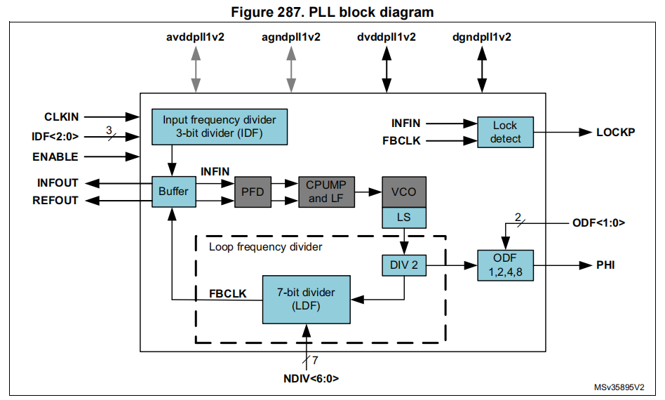

**稳压器控制(Regulator control)**：

DSI 内置 1.2 V 稳压器，通过 DSI_WRPCR.REGEN 控制。
D-PHY 没有独立的电源控制位，启用/关闭稳压器即控制 D-PHY 上电。
当 1.2 V 稳压器关闭时，D-PHY 的 3.3 V 部分也自动关闭。

#### 功能描述：中断与错误
中断可以由 DSI Host 或 DSI Wrapper 产生。
所有中断最终合并到 一个中断线，连接到系统的中断控制器。

**DSI Wrapper Interrupts**:
- Tearing effect event
- End of refresh
- PLL locked
- PLL unlocked
- Regulator ready

**DSI Host Interrupts**:
错误通过 DSI_ISR0 和 DSI_ISR1 寄存器报告。
当任一寄存器检测到错误时，DSI Host 的中断线拉高。
DSI_FIR0 和 DSI_FIR1 可强制触发中断，用于软件开发和测试。

#### Programing procedure
配置 RCC - 使能 DSI 时钟       
配置 GPIO（如需要 TE 信号）            
配置 LTDC（参考 LTDC 文档）            
打开 DSI 稳压器并等待就绪              
配置 DSI PLL 并等待锁定                
配置 D-PHY 参数                        
配置 DSI Host 时序                     
配置流控制和 DBI 接口                  
配置 DSI-LTDC 接口                     
配置为视频模式或命令模式               
使能 D-PHY                             
使能 DSI Host                          
使能 DSI Wrapper                       
发送 DCS 命令配置显示器                
使能 LTDC                              
启动 LTDC 流量通过 DSI Wrapper         

### LCD 驱动 IC —— NT35510

功能概述：
- 单芯片 WVGA LCD 控制器/驱动器，带显示 RAM。
- 支持的分辨率：480×864 / 854 / 800 / 720 / 640。
- GRAM 容量：480 × 864 × 24 位 ≈ 9.95 Mbit，可以存储整帧图像。
- 接口支持丰富：MIPI DSI、MDDI、RGB、SPI 等。
- 支持局部刷新、Gamma 校正、深度待机。

当前使用的 STM32H747-DISCO 开发板使用 MB1166 显示模组，MCU 和 显示模组使用 MIPI-DSI 接口。

### STM32H747 控制 TFT-LCD 显示图像 （通过 LTDC + DSI）
ST示例：STM32Cube_FW_H7_V1.12.0\Projects\STM32H747I-DISCO\Examples\DCMI\DCMI_CaptureMode

STM32H747-DISCO 使用MB1166显示模组，默认使用 LTDC + DSI 控制 TFT-LCD 显示图像。

LTDC 和 DSI 时钟源：
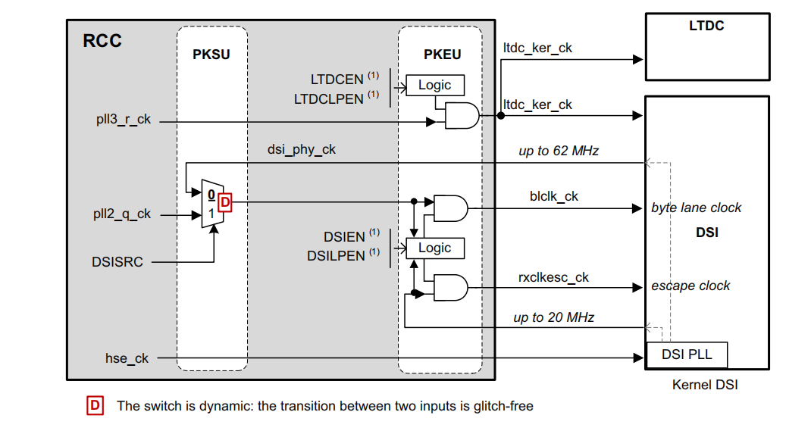

#### 整体时序图

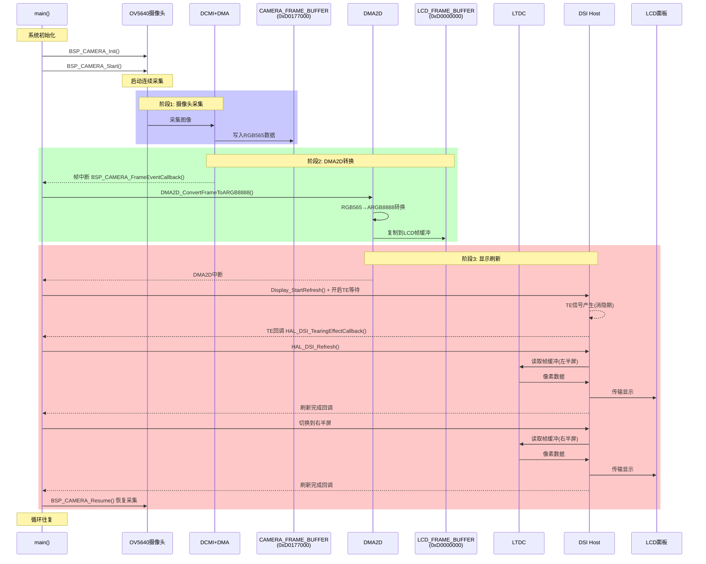
```mermaid
sequenceDiagram
    participant Main as main()
    participant Camera as OV5640摄像头
    participant DCMI as DCMI+DMA
    participant CAM_BUF as CAMERA_FRAME_BUFFER<br/>(0xD0177000)
    participant DMA2D as DMA2D
    participant LCD_BUF as LCD_FRAME_BUFFER<br/>(0xD0000000)
    participant LTDC as LTDC
    participant DSI as DSI Host
    participant LCD as LCD面板

    Note over Main: 系统初始化
    Main->>Camera: BSP_CAMERA_Init()
    Main->>Camera: BSP_CAMERA_Start()
    Note over Camera: 启动连续采集

    rect rgb(200,200,255)
        Note over Camera,DCMI: 阶段1: 摄像头采集
        Camera->>DCMI: 采集图像
        DCMI->>CAM_BUF: 写入RGB565数据
    end

    rect rgb(200,255,200)
        Note over DCMI,LCD_BUF: 阶段2: DMA2D转换
        DCMI-->>Main: 帧中断 BSP_CAMERA_FrameEventCallback()
        Main->>DMA2D: DMA2D_ConvertFrameToARGB8888()
        DMA2D->>DMA2D: RGB565→ARGB8888转换
        DMA2D->>LCD_BUF: 复制到LCD帧缓冲
    end

    rect rgb(255,200,200)
        Note over DMA2D,DSI: 阶段3: 显示刷新
        DMA2D-->>Main: DMA2D中断
        Main->>DSI: Display_StartRefresh() + 开启TE等待
        DSI-->>DSI: TE信号产生(消隐期)
        DSI-->>Main: TE回调 HAL_DSI_TearingEffectCallback()
        Main->>DSI: HAL_DSI_Refresh()
        DSI->>LTDC: 读取帧缓冲(左半屏)
        LTDC->>DSI: 像素数据
        DSI->>LCD: 传输显示
        DSI-->>Main: 刷新完成回调
        Main->>DSI: 切换到右半屏
        DSI->>LTDC: 读取帧缓冲(右半屏)
        LTDC->>DSI: 像素数据
        DSI->>LCD: 传输显示
        DSI-->>Main: 刷新完成回调
        Main->>Camera: BSP_CAMERA_Resume() 恢复采集
    end

    Note over Main: 循环往复
```

#### DMA2D转换详细时序

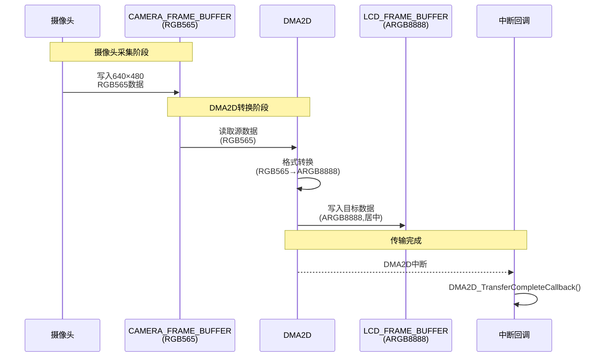
```mermaid
sequenceDiagram
    participant Camera as 摄像头
    participant CAM_BUF as CAMERA_FRAME_BUFFER<br/>(RGB565)
    participant DMA2D as DMA2D
    participant LCD_BUF as LCD_FRAME_BUFFER<br/>(ARGB8888)
    participant Callback as 中断回调

    Note over Camera,CAM_BUF: 摄像头采集阶段
    Camera->>CAM_BUF: 写入640×480<br/>RGB565数据

    Note over CAM_BUF,DMA2D: DMA2D转换阶段
    CAM_BUF->>DMA2D: 读取源数据<br/>(RGB565)
    DMA2D->>DMA2D: 格式转换<br/>(RGB565→ARGB8888)
    DMA2D->>LCD_BUF: 写入目标数据<br/>(ARGB8888,居中)

    Note over DMA2D,Callback: 传输完成
    DMA2D-->>Callback: DMA2D中断
    Callback->>Callback: DMA2D_TransferCompleteCallback()
```

#### 分屏刷新详细时序

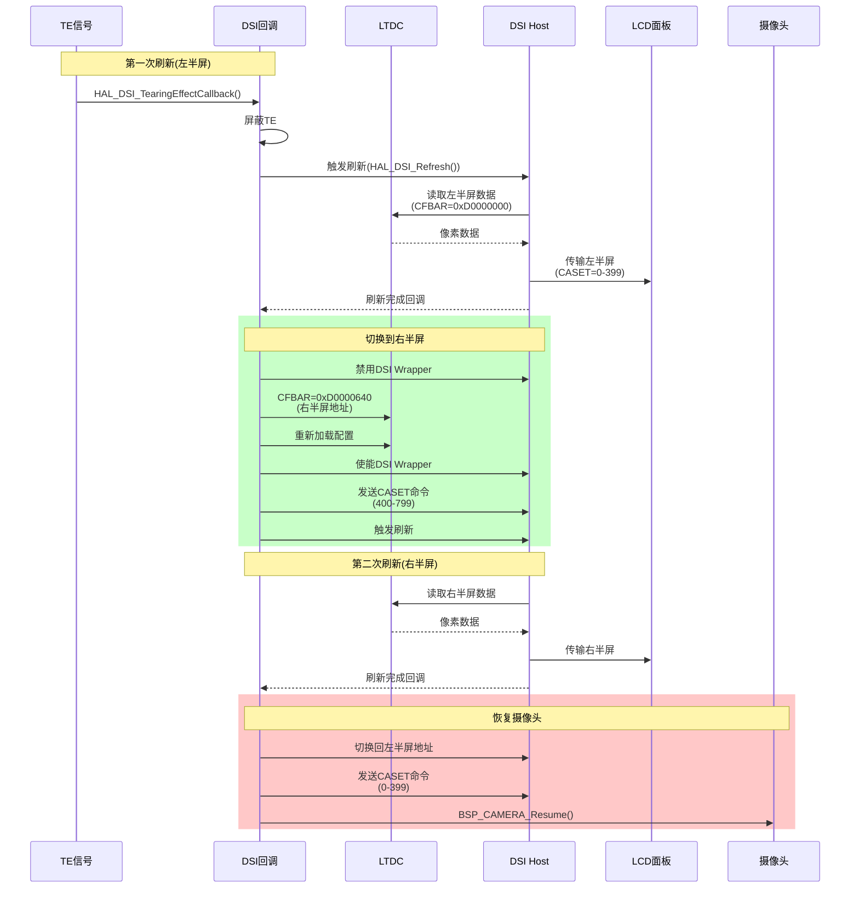
```mermaid
sequenceDiagram
    participant TE as TE信号
    participant DSI_CB as DSI回调
    participant LTDC as LTDC
    participant DSI as DSI Host
    participant LCD as LCD面板
    participant Camera as 摄像头

    Note over TE,DSI_CB: 第一次刷新(左半屏)

    TE->>DSI_CB: HAL_DSI_TearingEffectCallback()
    DSI_CB->>DSI_CB: 屏蔽TE
    DSI_CB->>DSI: 触发刷新(HAL_DSI_Refresh())

    DSI->>LTDC: 读取左半屏数据<br/>(CFBAR=0xD0000000)
    LTDC-->>DSI: 像素数据
    DSI->>LCD: 传输左半屏<br/>(CASET=0-399)
    DSI-->>DSI_CB: 刷新完成回调

    rect rgb(200,255,200)
        Note over DSI_CB,DSI: 切换到右半屏
        DSI_CB->>DSI: 禁用DSI Wrapper
        DSI_CB->>LTDC: CFBAR=0xD0000640<br/>(右半屏地址)
        DSI_CB->>LTDC: 重新加载配置
        DSI_CB->>DSI: 使能DSI Wrapper
        DSI_CB->>DSI: 发送CASET命令<br/>(400-799)
        DSI_CB->>DSI: 触发刷新
    end

    Note over DSI,DSI_CB: 第二次刷新(右半屏)
    DSI->>LTDC: 读取右半屏数据
    LTDC-->>DSI: 像素数据
    DSI->>LCD: 传输右半屏
    DSI-->>DSI_CB: 刷新完成回调

    rect rgb(255,200,200)
        Note over DSI_CB,Camera: 恢复摄像头
        DSI_CB->>DSI: 切换回左半屏地址
        DSI_CB->>DSI: 发送CASET命令<br/>(0-399)
        DSI_CB->>Camera: BSP_CAMERA_Resume()
    end
```

### 参考
[1] STM32H7xx Reference Manual, RM0399
