<center>
从硬件驱动到边缘推理的完整嵌入式 AI 开发实践，实现一个检测可乐瓶位置的嵌入式AI系统。
</center>

<!--more-->

***

## 目录

1. [项目背景与目标](#1-项目背景与目标)
2. [硬件平台与架构](#2-硬件平台与架构)
3. [软件架构设计](#3-软件架构设计)
4. [Phase 1-3: 基础功能实现](#4-phase-1-3-基础功能实现)
5. [Phase 4: 模型训练与优化](#5-phase-4-模型训练与优化)
6. [Phase 5: TFLite Micro 集成与性能优化](#6-phase-5-tflite-micro-集成与性能优化)
7. [踩坑经验总结](#7-踩坑经验总结)
8. [性能数据汇总](#8-性能数据汇总)
9. [项目总结与展望](#9-项目总结与展望)

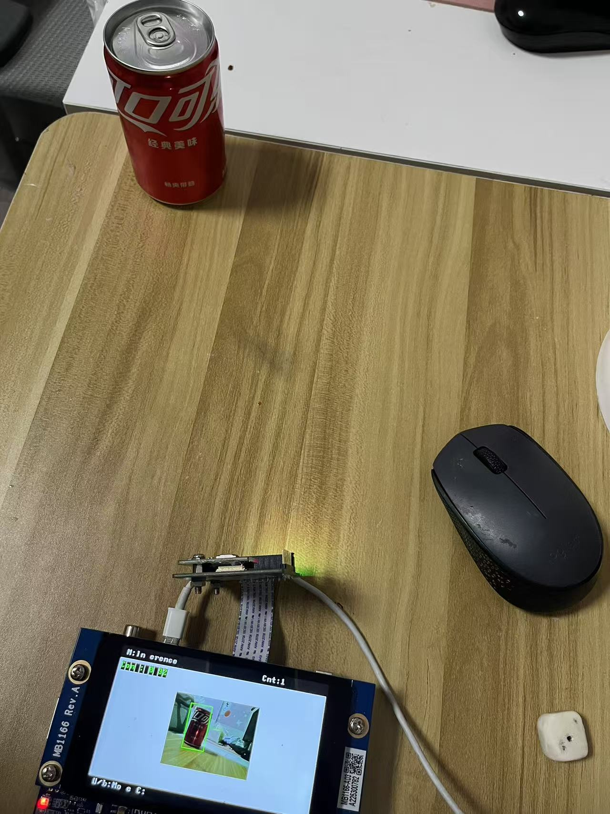
<center>可乐瓶检测效果展示</center>

---

## 1. 项目背景与目标

### 1.1 项目概述

本项目基于 **STM32H747I-DISCO** 开发板，实现了一个完整的**嵌入式边缘 AI 目标检测系统**。系统能够支持：

**采集模式**：
- 通过摄像头实时采集图像
- 可通过按键进行拍照，并将照片保存到 QSPI Flash 中
- 支持 USB MSC，连接PC可识别为存储设备 ，方便导出图片，在 PC 上进行训练。
  
**推理模式**：
- 通过摄像头实时采集图像
- 使用训练好的轻量级 CNN 模型进行推理，识别图片中是否存在可乐瓶，以及可乐瓶的位置
- 在 LCD 上实时显示检测结果

### 1.2 为什么选择嵌入式 AI？

边缘 AI（Edge AI）将推理能力从云端下放到终端设备，具有以下优势：

| 优势 | 说明 |
|------|------|
| **无需网络** | 无需网络传输，本地推理 |
| **隐私保护** | 数据不离开设备 |
| **离线运行** | 不依赖网络连接 |
| **低成本** | 无云服务费用 |

本项目展示了如何在资源受限的 Cortex-M7 微控制器上实现完整的目标检测流水线，从硬件驱动到 AI 推理的全栈开发经验。

### 1.3 技术选型

| 组件 | 选择 | 理由 |
|------|------|------|
| **RTOS** | Zephyr RTOS | 开源、模块化、良好的 STM32 支持 |
| **AI 框架** | TensorFlow Lite Micro | 官方嵌入式推理框架，CMSIS-NN 优化 |
| **训练框架** | TensorFlow 2.16 / Keras | 与 TFLM 生态无缝衔接 |
| **开发板** | STM32H747I-DISCO | 双核 Cortex-M7/M4，丰富外设 |

### 1.3 硬件清单

| 组件 | 型号 | 规格 |
|------|------|------|
| **主板** | STM32H747I-DISCO | Cortex-M7 @ 400MHz, AXI SRAM 512KB, SDRAM 32MB |
| **摄像头** | B-CAMS-OMV-MB1683 | OV5640, 5MP, DVP 接口 |
| **显示屏** | B-LCD40-DSI1-MB1166 | NT35510, 800×480, MIPI DSI |

**硬件连接图:**

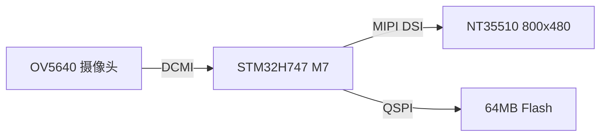

---

## 2. 硬件平台与架构

### 2.1 STM32H747 总线架构

STM32H747 采用多域总线架构，理解内存布局对性能优化至关重要：

| 内存区域 | 地址范围 | 容量 | 用途 | 访问延迟 |
|----------|----------|------|------|----------|
| ITCM RAM | 0x0000_0000 | 64KB | 指令紧耦合内存 | ~1 周期 |
| DTCM RAM | 0x2000_0000 | 128KB | 数据紧耦合内存 | ~1 周期 |
| **AXI SRAM** | 0x2400_0000 | **512KB** | **主 RAM，最快** | **~1-2 周期** |
| SRAM1/2/3 | 0x3000_0000 | 288KB | 通用 SRAM | ~2-3 周期 |
| Backup SRAM | 0x3880_0000 | 4KB | 备份域 | ~2 周期 |
| **External SDRAM** | 0xD000_0000 | **32MB** | FMC SDRAM | **~15-20 周期** |
| QSPI Flash | 0x9000_0000 | 64MB | 外部 Flash | ~10-30 周期 |

> ⚠️ **关键性能差异**: AXI SRAM 访问延迟 ~1-2 周期，而 SDRAM 访问延迟 ~15-20 周期，**慢 10 倍！**

#### 内存选择策略

性能敏感数据 → AXI SRAM (512KB)                            
- 模型权重 (300KB) 
- 频繁访问的查找表
-  关键算法的工作缓冲区

大容量需求 → SDRAM2 (32MB)
- Tensor Arena (1MB，TFlite Micro推理需要的内存)
- 帧缓冲 (768KB) 
- 摄像头缓冲 (460KB) 
- 临时图像处理缓冲区

本项目通过合理分配内存，将模型权重放在 AXI SRAM，Tensor Arena 放在 SDRAM2，实现了性能与容量的平衡。

### 2.2 系统数据流设计

#### 采集模式数据流

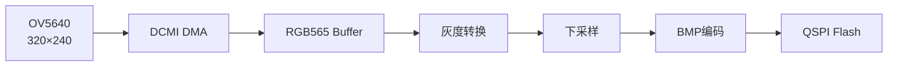

#### 推理模式数据流

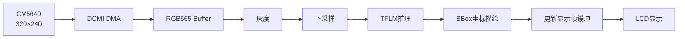

> 💡 **设计要点**: 推理模式下需要暂停摄像头 DMA 以避免带宽竞争。

---

## 3. 软件架构设计

### 3.1 项目目录结构

```
bottle_detector/
├── CMakeLists.txt              # 构建配置
├── prj.conf                    # Kconfig 配置
├── README.md                   # 使用说明
│
├── boards/
│   └── stm32h747i_disco_stm32h747xx_m7.overlay  # 设备树 overlay
│
├── src/
│   ├── main.c                  # 主程序、模式管理
│   ├── camera.c/h              # 摄像头驱动封装
│   ├── display.c/h             # LCD 显示驱动
│   ├── image_utils.c/h         # 图像处理 (灰度转换、下采样、BMP编码)
│   ├── ui_manager.c/h          # Joystick/按钮 UI
│   ├── storage_manager.c/h     # QSPI Flash + FAT 文件系统
│   ├── ai_engine.cpp/h         # TFLite Micro 推理引擎
│   ├── model_data_c2_bn.cpp    # 模型权重 (int8 量化)
│   └── pmu_cache.h             # 性能计数器访问
│
└── training/
    ├── train_grid.py           # 模型训练脚本
    ├── evaluate_grid.py        # 模型评估脚本
    ├── convert_to_tflm.py      # TFLite 转换脚本
    ├── augmentations.py        # 数据增强
    └── models/                 # 训练好的模型
```

### 3.2 软件分层架构

系统采用经典的分层架构，从应用层到硬件层共五层，每层职责清晰：

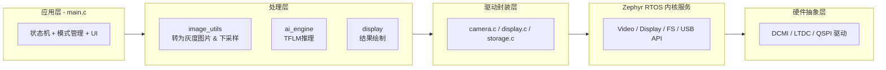

**各层职责说明：**

| 层级 | 核心模块 | 主要功能 |
|------|----------|----------|
| **应用层** | `main.c` | 状态机管理、模式切换、用户交互 |
| **处理层** | `image_utils`, `ai_engine` | 图像预处理、模型推理、结果可视化 |
| **驱动封装** | `camera.c`, `display.c` | 硬件无关的统一接口 |
| **Zephyr 服务** | Video/Display API | 操作系统级别的设备管理 |
| **HAL** | DCMI/LTDC 驱动 | 寄存器级硬件操作 |

### 3.3 主程序状态机

系统有两种主要工作模式：**采集模式**和**推理模式**，通过 Joystick 上下切换。

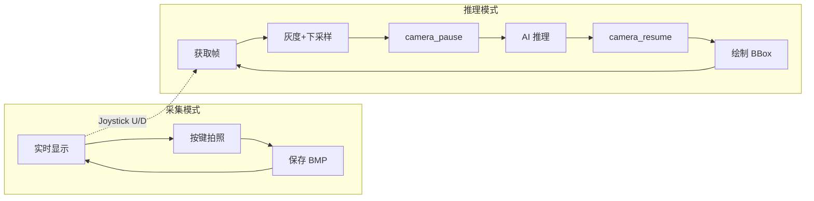

**两种模式对比：**

| 特性 | 采集模式 | 推理模式 |
|------|----------|----------|
| **目的** | 收集训练数据 | 实时目标检测 |
| **拍照** | Joystick Center 触发 | 禁用 |
| **显示内容** | 摄像头画面 + 计数(已存储照片) | 摄像头画面 + BBox + 置信度 |
| **存储** | 保存 BMP 到 Flash | 不存储 |

---

## 4. Phase 1-3: 基础功能实现

### 4.1 Phase 1: 摄像头采集 + LCD 显示

#### 4.1.1 摄像头配置

摄像头使用 OV5640 传感器，通过 DCMI (Digital Camera Interface) 接口连接：

```c
// camera.c - 摄像头初始化
static const struct camera_config camera_cfg = {
    .width = 320,
    .height = 240,
    .pixelformat = VIDEO_PIX_FMT_RGB565,
    .buffer_count = 3,  // 3 个缓冲区放在 SDRAM2
};

// 静态缓冲区分配到 SDRAM2
__attribute__((section("SDRAM2"))) 
static uint8_t video_frame_buffers[3 * 320 * 240 * 2];  // 460KB
```

#### 4.1.2 LCD 显示配置

使用全屏帧缓冲方案 (800×480)：

```c
// display.c - 帧缓冲分配
#define FRAME_BUF_WIDTH  800
#define FRAME_BUF_HEIGHT 480
#define FRAME_BUF_SIZE   (800 * 480 * 2)  // 768KB RGB565

// 帧缓冲放在 SDRAM2
__attribute__((section("SDRAM2"))) 
static uint16_t frame_buffer[FRAME_BUF_SIZE / 2];
```

### 4.2 Phase 2: 图像处理流水线

#### 4.2.1 RGB565 转灰度

```c
// image_utils.c
void rgb565_to_grayscale(const uint8_t *rgb565, uint8_t *gray,
                         uint32_t width, uint32_t height) {
    for (uint32_t i = 0; i < width * height; i++) {
        uint16_t pixel = ((uint16_t)rgb565[i * 2 + 1] << 8) | rgb565[i * 2];
        
        // RGB565 -> 8-bit RGB
        uint8_t r5 = (pixel >> 11) & 0x1F;
        uint8_t g6 = (pixel >> 5) & 0x3F;
        uint8_t b5 = pixel & 0x1F;
        
        // ITU-R BT.601: Y = 0.299R + 0.587G + 0.114B
        // 整数实现: Y = (R*77 + G*150 + B*29) >> 8
        gray[i] = (77 * (r5 * 255 / 31) + 
                   150 * (g6 * 255 / 63) + 
                   29 * (b5 * 255 / 31)) >> 8;
    }
}
```

#### 4.2.2 下采样 (2x2 平均)

```c
void downsample_2x2(const uint8_t *src, uint8_t *dst,
                    uint32_t src_w, uint32_t src_h) {
    uint32_t dst_w = src_w / 2;
    uint32_t dst_h = src_h / 2;
    
    for (uint32_t y = 0; y < dst_h; y++) {
        for (uint32_t x = 0; x < dst_w; x++) {
            // 2x2 块求平均
            uint16_t sum = src[(y*2) * src_w + (x*2)] +
                           src[(y*2) * src_w + (x*2+1)] +
                           src[(y*2+1) * src_w + (x*2)] +
                           src[(y*2+1) * src_w + (x*2+1)];
            dst[y * dst_w + x] = sum >> 2;  // 除以 4
        }
    }
}
```

### 4.3 Phase 3: QSPI Flash 存储 + USB MSC

#### 4.3.1 设备树 Overlay 配置

```dts
// boards/stm32h747i_disco_stm32h747xx_m7.overlay

/ {
    /* Flash Disk for USB MSC */
    msc_disk0 {
        compatible = "zephyr,flash-disk";
        partition = <&storage_partition>;
        disk-name = "NAND";
        cache-size = <8192>;
    };
};

/* QSPI Flash 分区 - 64MB FAT */
&mt25ql512ab1 {
    partitions {
        compatible = "fixed-partitions";
        storage_partition: partition@0 {
            label = "storage";
            reg = <0x0 DT_SIZE_M(64)>;
        };
    };
};
```

#### 4.3.2 prj.conf 配置

```ini
# Flash 和文件系统
CONFIG_FLASH=y
CONFIG_FAT_FILESYSTEM_ELM=y
CONFIG_FS_FATFS_LFN=y

# USB MSC (PC 直接读取)
CONFIG_USB_DEVICE_STACK_NEXT=y
CONFIG_USBD_MSC_CLASS=y
```

#### 4.3.3 存储限制问题（未解决）

| 问题 | 现象 | 原因 |
|------|------|------|
| 容量限制 | 只能使用 ~8MB | QSPI Flash 地址映射限制 |
| 实际容量 | 约 400 张照片 | 每张 BMP ~20KB |

---

## 5. Phase 4: 模型训练与优化

### 5.1 模型架构设计

采用**网格回归**架构（YOLO 风格），适合单目标检测：

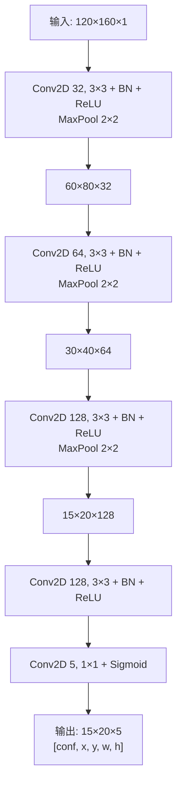

**架构设计要点：**

1. **输入分辨率 160×120**: 平衡精度与计算量，下采样 2x2 后的尺寸
2. **逐步下采样**: 三次 MaxPool 将特征图缩小到 15×20 网格
3. **保持空间信息**: 不使用 Global Average Pooling，保留位置感知能力
4. **网格输出**: 每个 grid cell 预测 [置信度, x偏移, y偏移, 宽度, 高度]

### 5.2 网格输出解码

```python
# 训练代码中的目标编码
def encode_target(bbox, grid_h=15, grid_w=20):
    x_center, y_center, width, height = bbox
    
    # 找到目标中心所在的网格
    grid_x = int(x_center * grid_w)
    grid_y = int(y_center * grid_h)
    
    # 计算网格内偏移
    x_offset = x_center * grid_w - grid_x
    y_offset = y_center * grid_h - grid_y
    
    # 在目标网格设置值
    target[grid_y, grid_x] = [1.0, x_offset, y_offset, width, height]
    return target
```

### 5.3 训练配置与数据集

#### 数据集划分

| 数据集 | 样本数 | 正样本 | 负样本 | 比例 |
|--------|--------|--------|--------|------|
| Train | 788 | 605 (76.8%) | 183 (23.2%) | 80% |
| Val | 98 | 76 (77.6%) | 22 (22.4%) | 10% |
| Test | 99 | 73 (73.7%) | 26 (26.3%) | 10% |

#### 训练超参数

```python
conf_weight = 2.0      # 置信度损失权重
bbox_weight = 4.0      # 边界框损失权重
initial_lr = 0.001     # 初始学习率
max_epochs = 150       # 最大训练轮数
batch_size = 16        # 批大小
optimizer = Adam + Cosine Annealing  # 余弦退火：学习率按余弦曲线从初始值逐渐降到 0，前期学习快、后期精细调参
```

### 5.4 滤波器配置探索

通过调整卷积层滤波器数量，探索模型大小与精度的平衡：

| 配置 | 滤波器配置 | 参数量 | DS综合分 | 召回率 | 备注 |
|------|-----------|--------|---------|--------|------|
| **A2** | 32→64→128→256→128→5 | 686K | **0.817** | **86.3%** | 原始模型，精度最高但参数量大 |
| **B1** | 24→48→96→128→5 | 164K | - | 52.6% | ❌ 召回率不足 |
| **C1** | 32→64→96→128→5 | 187K | 0.733 | 69.9% | 参数量减少 73%，精度下降 |
| **C2** | 32→64→128→128→5 | 242K | 0.760 | 79.5% | ✅ 精度与大小平衡 |
| **C3** | 32→64→128→128→64→5 | 316K | 0.784 | 83.6% | ✅ 精度较好但参数量增加 |


### 5.5 BatchNorm 层顺序优化

#### 5.5.1 问题背景

前期模型（A2、C1、C2、C3）采用 `Conv → Activation → BN` 的层顺序。在转换为 TFLite int8 时发现：
- **无法完全量化**: BN 层无法融合到 Conv 层
- **推理效率低**: 需要单独执行 BN 计算

#### 5.5.2 解决方案

调整层顺序为 `Conv → BN → Activation`：

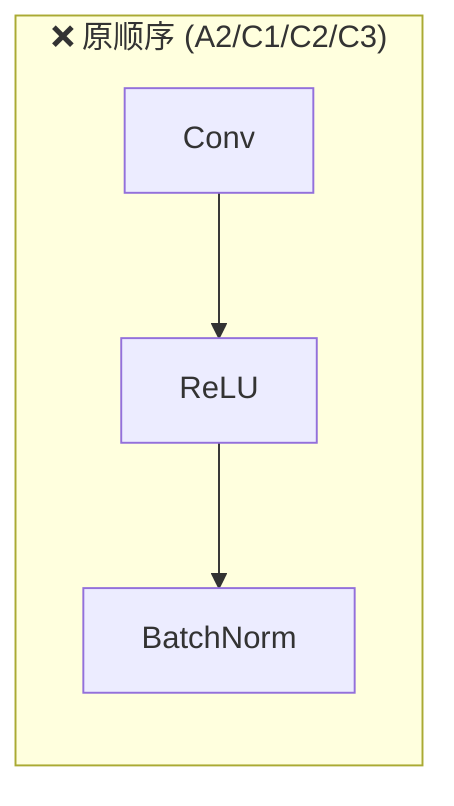

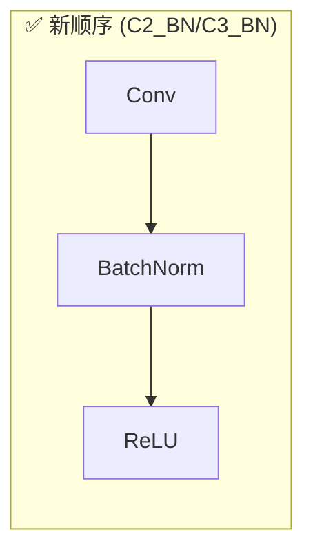

**原理**: TFLite 量化时，`Conv → BN → Activation` 顺序可以自动将 BN 参数融合到 Conv 的权重和偏置中，运行时无需额外计算 BN。

#### 5.5.3 评估结果对比

| 模型 | 层顺序 | 参数量 | DS综合分 | 召回率 | 误检率 | 推理时间 |
|------|--------|--------|---------|--------|--------|----------|
| A2_best_grid | Conv→ReLU→BN | 686K | **0.817** | **86.3%** | **3.8%** | 2781ms |
| C1_best_grid | Conv→ReLU→BN | 187K | 0.733 | 69.9% | 7.7% | 1627ms |
| **C2_BN** | Conv→BN→ReLU | 242K | 0.760 | 79.5% | 11.5% | **1285ms** |

> **关键结论**: C2_BN 参数量 (242K) > C1 (187K)，但推理更快！原因是 BN 融合减少了运行时计算量。
> 平衡指标效果 和 模型大小，最终采用了 C2_BN 这个模型，作为部署模型。

---

## 6. Phase 5: TFLite Micro 集成与性能优化

### 6.1 TFLite Micro 概述

**TensorFlow Lite Micro (TFLM)** 是专为微控制器设计的轻量级推理引擎：

| 特性 | 说明 |
|------|------|
| 核心运行时 | 最小 16KB |
| 操作系统 | 不需要 |
| 动态内存 | 不允许（使用 Arena 分配） |
| 标准库 | 不依赖 C++ STL |

**TFLM vs TFLite 对比：**

| 特性 | TensorFlow Lite | TFLite Micro |
|------|-----------------|--------------|
| **目标平台** | 移动设备/嵌入式 Linux | 微控制器 (Cortex-M) |
| **最小内存** | ~1MB | ~16KB |
| **动态分配** | 支持 | 仅静态 Arena |
| **操作支持** | 完整 | 精简子集 |
| **C++ STL** | 可选 | 不支持 |

**嵌入式推理的关键挑战：**

1. **内存限制**: 必须预先分配所有 tensor 内存（Arena）
2. **量化必做**: int8 量化减少 4x 内存和显著加速
3. **操作裁剪**: 只支持有限的算子，复杂模型可能不支持

### 6.2 模型转换与量化

#### 转换流程（以 C2_BN 为例）

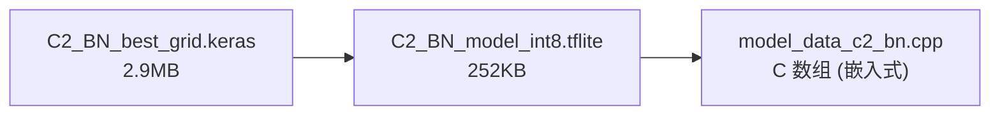


#### 量化转换代码

```python
# convert_to_tflm.py
def convert_keras_to_tflite_int8(keras_model_path, output_path):
    model = tf.keras.models.load_model(keras_model_path)
    
    converter = tf.lite.TFLiteConverter.from_keras_model(model)
    
    # 启用量化优化
    converter.optimizations = [tf.lite.Optimize.DEFAULT]
    
    # 使用训练数据进行校准
    converter.representative_dataset = representative_dataset
    
    # 全 int8 量化
    converter.target_spec.supported_ops = [tf.lite.OpsSet.TFLITE_BUILTINS_INT8]
    converter.inference_input_type = tf.int8
    converter.inference_output_type = tf.float32
    
    tflite_model = converter.convert()
```

#### TensorFlow 2.16 Bug 解决

**问题**: `from_keras_model()` + lambda loss 触发 `call_context` bug

> **Lambda Loss**: 指用 Python lambda 表达式或自定义函数定义的损失函数，而非 Keras 内置的 `'mse'`、`'categorical_crossentropy'` 等。本项目使用自定义损失函数来分别加权置信度和边界框损失。

**解决方案**: 使用 concrete function 方式

```python
# 重新编译模型
model.compile(optimizer=tf.keras.optimizers.Adam(), loss='mse')

# 获取 concrete function
@tf.function(input_signature=[tf.TensorSpec(shape=(1,120,160,1), dtype=tf.float32)])
def inference(x): 
    return model(x, training=False)

cf = inference.get_concrete_function()

# 使用 concrete function 转换
converter = tf.lite.TFLiteConverter.from_concrete_functions([cf])
```

### 6.3 AI 引擎实现

```cpp
// ai_engine.cpp
int ai_engine_init(void) {
    // 1. 加载模型（复制到对齐的缓冲区）
    memcpy(aligned_model_buffer, g_model_data, g_model_data_len);
    model = tflite::GetModel(aligned_model_buffer);
    
    // 2. 注册操作 - 使用 CMSIS-NN 优化版本
    static tflite::MicroMutableOpResolver<20> resolver;
    resolver.AddConv2D(tflite::Register_CONV_2D_INT8());
    resolver.AddMaxPool2D(tflite::Register_MAX_POOL_2D_INT8());
    // ...
    
    // 3. 创建解释器
    static tflite::MicroInterpreter static_interpreter(
        model, resolver, tensor_arena, TENSOR_ARENA_SIZE);
    interpreter = &static_interpreter;
    
    // 4. 分配 tensor 内存
    interpreter->AllocateTensors();
    
    return 0;
}

int ai_engine_run_inference(const uint8_t *grayscale_160x120,
                            inference_result_t *result) {
    // 准备输入数据（量化）
    int8_t* input_data = input_tensor->data.int8;
    for (int i = 0; i < 160 * 120; i++) {
        float normalized = grayscale_160x120[i] / 255.0f;
        input_data[i] = (int8_t)(normalized / input_scale + input_zero_point);
    }
    
    // 运行推理
    interpreter->Invoke();
    
    // 解码输出
    decode_bbox(output_tensor->data.f, &result->bbox);
    
    return 0;
}
```

### 6.4 性能优化历程

#### 优化 1: CMSIS-NN 加速

| 版本 | 推理时间 | 加速比 | 关键技术 |
|------|---------|--------|----------|
| Reference (纯C) | 30,723 ms | 1x | 无优化 |
| **CMSIS-NN** | **1,285 ms** | **24x** | DSP SIMD 指令 (`smlad`, `sxtb16`) |

#### 优化 2: AXI SRAM 内存优化

将模型权重从 SDRAM2 移到 AXI SRAM：

```cpp
// 去掉 section 属性，让链接器自动放入 RAM
__attribute__((aligned(64)))
static uint8_t aligned_model_buffer[MODEL_DATA_SIZE_MAX];
```

| 指标 | 优化前 (SDRAM2) | 优化后 (AXI SRAM) | 提升 |
|------|----------------|------------------|------|
| 推理时间 | 1342 ms | **1025 ms** | **-24%** |
| CPI 开销 | 70.1% | 50.0% | -20% |

> **CPI (Cycles Per Instruction)**: 每指令周期数，衡量 CPU 效率的指标。CPI 越低表示 CPU 等待内存的时间越少。模型权重从 SDRAM2 移到 AXI SRAM 后，内存访问延迟从 ~15-20 周期降到 ~1-2 周期，CPI 显著下降。

#### 优化 3: DCMI DMA 带宽竞争解决

**问题**: 推理时间从 ~1s 暴涨到 ~20s

**根因**: STM32H747 的总线架构中，DCMI 和 DMA 都通过 AHB 总线访问 SDRAM2。DCMI 使用 DMA 循环模式时，持续占用 SDRAM2 带宽，导致推理过程中访问 SDRAM 触发频发的总线仲裁。

**解决方案**: camera_pause/resume 机制

```c
// camera.c
#define DCMI_BASE_ADDR    0x48020000UL
#define DCMI_CR_CAPTURE   (1U << 14)

void camera_pause(void) {
    volatile uint32_t *dcmi_cr = (volatile uint32_t *)DCMI_BASE_ADDR;
    *dcmi_cr &= ~DCMI_CR_CAPTURE;  // 停止 DMA
}

void camera_resume(void) {
    volatile uint32_t *dcmi_cr = (volatile uint32_t *)DCMI_BASE_ADDR;
    *dcmi_cr |= DCMI_CR_CAPTURE;   // 恢复 DMA
}
```

```c
// main.c
camera_pause();                           // 停止 DCMI DMA
ai_engine_run_inference(downsampled_buffer, &result);
camera_resume();                          // 恢复 DCMI DMA
```

| 状态 | 推理时间 | 加速比 |
|------|----------|--------|
| Camera DMA 持续运行 | ~20,000 ms | 1x |
| **Camera pause/resume** | **~1,049 ms** | **19x** |

### 6.5 最终内存布局

| 区域 | 地址范围 | 大小 | 用途 | 占用率 |
|------|----------|------|------|--------|
| **RAM (AXI SRAM)** | 0x2400_0000 | 512KB | 模型权重 + 程序数据 | 496KB (97%) |
| **SDRAM2** | 0xD000_0000 | 32MB | Tensor Arena + 帧缓冲 | 3MB (9%) |
| **FLASH** | 0x0800_0000 | 1MB | 代码 + 只读数据 | 576KB (56%) |

---

## 7. 踩坑经验总结

> 💡 **本章汇总了项目开发过程中遇到的主要问题和解决方案，希望能帮助后来者少走弯路。**

### 7.1 Zephyr 驱动修改

本项目对 Zephyr 上游代码做了两处关键修改：

#### 7.1.1 OV5640 PLL 配置优化 

**文件**: `zephyr/drivers/video/ov5640.c`

**问题**: 摄像头帧率只有 3-4 fps，显示不流畅。

**根因**: OV5640 传感器的输出帧率可由内部 PLL 时钟控制。Zephyr 原始驱动配置下的输出帧率过低。可通过如下寄存器进行修改。

**解决方案**: 修改 `init_params_dvp` 数组中的几个 PLL 相关配置，具体可参考：[stm32h747-DCMI-OV5640](https://fengxun2017.github.io/2025/12/02/stm32h747-DCMI-OV5640/#3-1-OV5640-%E6%91%84%E5%83%8F%E5%A4%B4%E5%83%8F%E7%B4%A0%E6%97%B6%E9%92%9F%E9%85%8D%E7%BD%AE%EF%BC%8C%E5%92%8C%E5%B8%A7%E7%8E%87%E6%8E%A7%E5%88%B6)

```c
{ 0x3034  },
{ 0x3035  },
{ 0x3036 },  
{ 0x3037 },
```

#### 7.1.2 LTDC MIPI DSI 模式显示冻结修复

**文件**: `zephyr/drivers/display/display_stm32_ltdc.c`

**问题**: MIPI DSI 模式下，`display_write` 在首帧后永久阻塞

**根因**: LINE 中断同步机制在 `pend_buf == front_buf` 时死锁

**解决方案**: MIPI DSI 模式使用直接帧缓冲更新

```c
#if defined(CONFIG_MIPI_DSI)
    // MIPI DSI: 直接更新帧缓冲地址，不等待中断
    __HAL_LTDC_RELOAD_IMMEDIATE_CONFIG(&data->hltdc);
#else
    // RGB 模式: 保持原有 LINE 中断同步
    k_sem_take(&data->sem, K_MSEC(100));
#endif
```

---

## 8. 性能数据汇总

### 8.1 优化成果

| 优化项 | 优化前 | 优化后 | 加速比 |
|--------|--------|--------|--------|
| CMSIS-NN INT8 | 30,723 ms | 1,285 ms | **24x** |
| AXI SRAM 存放模型权重（测试数据纯测试推理，无camer+LCD） | 1,342 ms | 1,025 ms | **1.3x** |
| Camera Pause（实际使用 camer + LCD 的真实推理） | ~20,000 ms | ~1,049 ms | **19x** |

### 8.2 推理模式帧处理分解

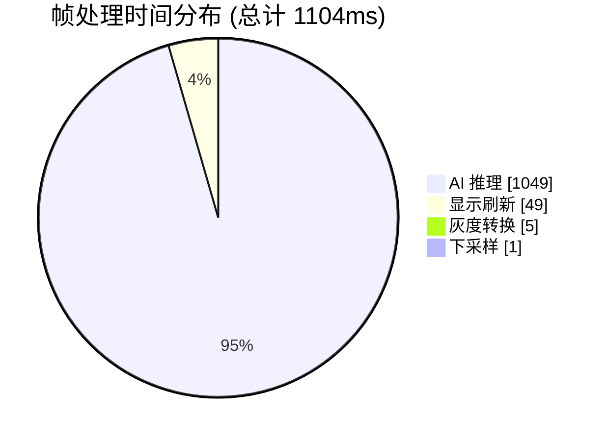

| 处理步骤 | 耗时 | 占比 |
|----------|------|------|
| 灰度转换 | 5 ms | 0.5% |
| 下采样 | 1 ms | 0.1% |
| **AI 推理** | **1049 ms** | **95.0%** |
| 显示刷新 | 49 ms | 4.4% |
| **总计** | **1104 ms** | **100%** |

> **帧率**: ~0.9 fps (AI 推理占 95% 时间)

### 8.3 三模型对比

| 模型 | 参数量 | DS综合分 | 召回率 | 误检率 | 推理时间 |
|------|--------|---------|--------|--------|----------|
| **A2_best_grid** | 686K | **0.817** | **86.3%** | **3.8%** | 2781ms |
| C2_BN | 242K | 0.760 | 79.5% | 11.5% | **1025ms** |
| C1_best_grid | 187K | 0.733 | 69.9% | 7.7% | 1627ms |

---

---

## 引用

- [Zephyr RTOS 文档](https://docs.zephyrproject.org/)
- [TensorFlow Lite Micro](https://www.tensorflow.org/lite/microcontrollers)
- [CMSIS-NN](https://arm-software.github.io/CMSIS_5/NN/html/index.html)
- [STM32H747 参考手册](https://www.st.com/resource/en/reference_manual/dm00176879.pdf)
- [OV5640 数据手册](https://www.ovt.com/download/ov5640-datasheet/)

