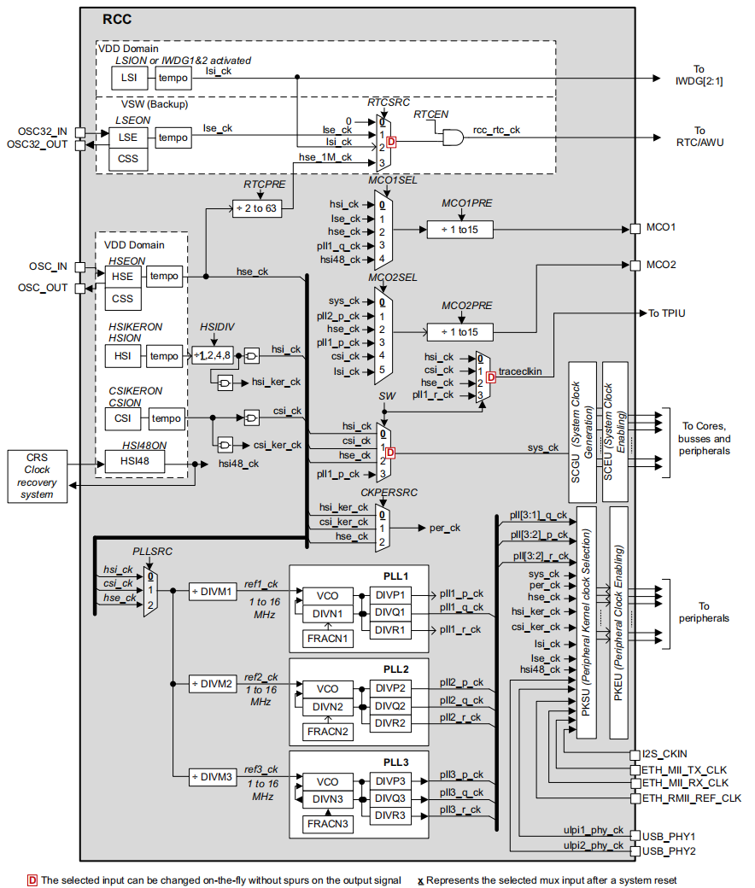
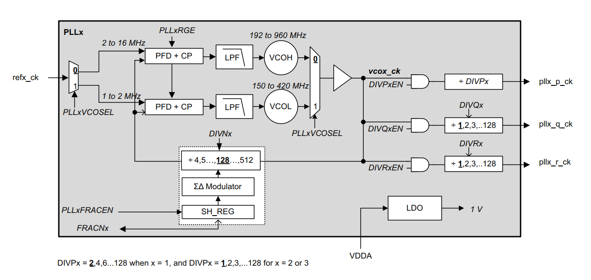
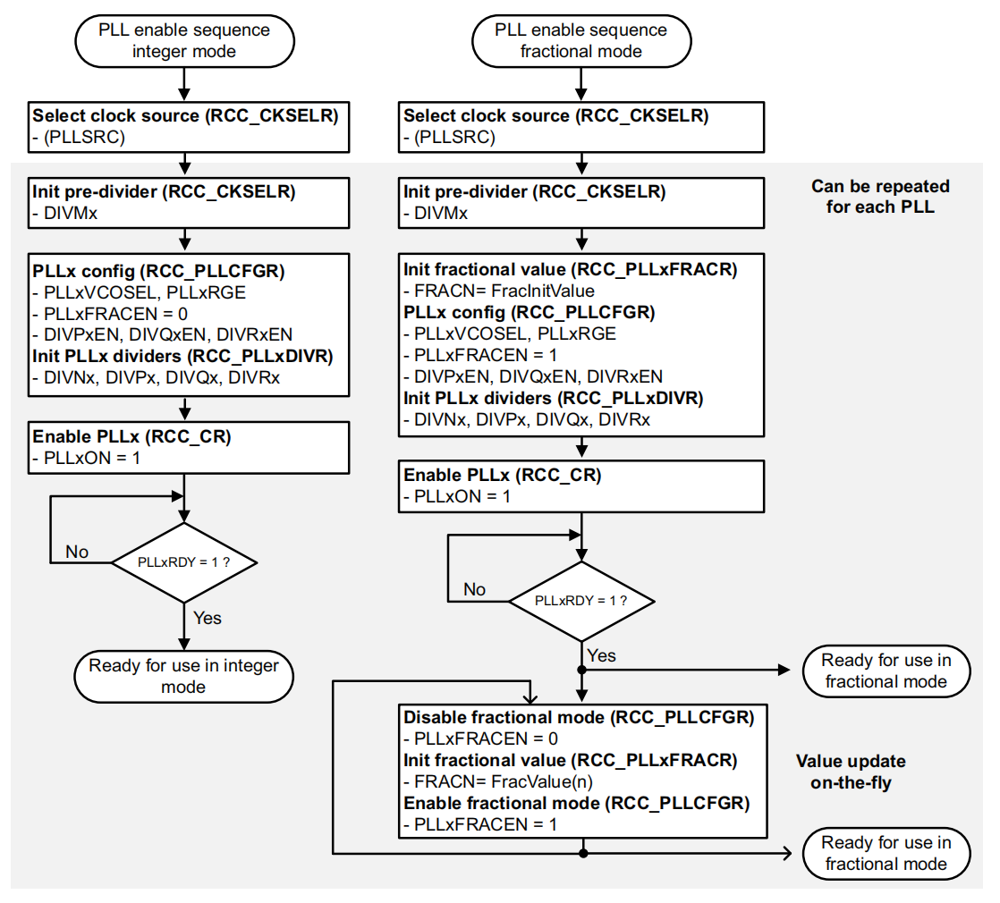
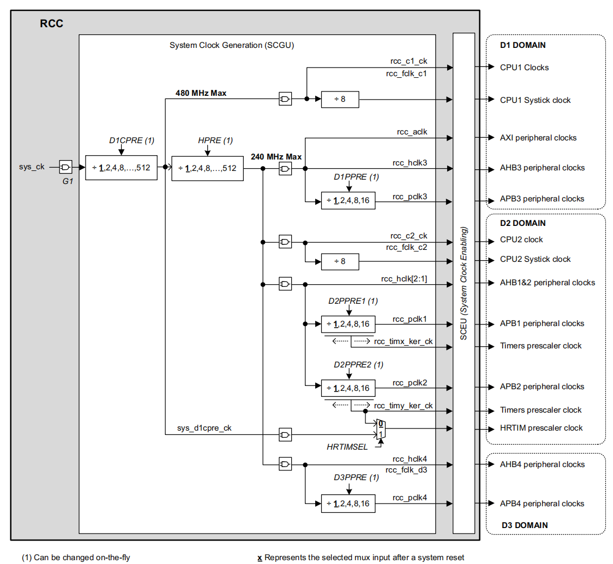

<center>
stm32h747-clock
</center>

<!--more-->

***


<center>Top-level clock tree</center>

STM32H747 提供了多种时钟源：

- HSI：高速内部 RC 振荡器，可配置为 8/16/32/64 MHz。
- HSE：高速外部晶振，范围 4–48 MHz。
- LSE：低速外部晶振，固定 32.768 kHz（常用于 RTC）。
- LSI：低速内部 RC 振荡器，约 32 kHz（常用于看门狗、RTC）。
- CSI：低功耗内部 RC 振荡器，约 4 MHz。
- HSI48：高速内部 48 MHz RC 振荡器，主要用于 USB、RNG、音频外设。

这些时钟源可以灵活选择作为 CPU 或外设的时钟输入。每个时钟源都可以 独立开关。在不需要某个外设或时钟时，可以关闭对应的时钟源，降低功耗。

MCO 输出：RCC（Reset and Clock Control） 提供 两个时钟输出端口 (MCO1, MCO2)，可以选择不同的时钟源输出到引脚，用于调试或给外部器件提供时钟。

锁相环 PLL：PLL 把输入时钟源（如 HSE/HSI/CSI）倍频/分频，生成系统时钟和外设时钟。RCC 提供 最多 3 个 PLL（PLL1、PLL2、PLL3）。每个 PLL 可以配置 整数倍频或**分数倍频**。例如：USB 需要精确的 48 MHz，SDMMC 需要特定频率，PLL 就能提供这些。


时钟分配单元：STM32H7 的时钟系统中的几个关键模块：
SCGU (System Clock Generation Unit)
- 包含各种 预分频器 (prescaler)。
- 用来生成 CPU 内核时钟和总线矩阵时钟。

PKSU (Peripheral Kernel clock Selection Unit)
- 提供外设内核时钟的选择开关。
- 不同外设（USB、Ethernet、SPI、SAI、SDMMC）可以选择不同的时钟源。
- 动态切换，灵活适配应用需求。

PKEU (Peripheral Kernel clock Enable Unit)
- 控制外设内核时钟的 开关 (gating)。
- 如果外设没用，可以关闭它的时钟，节省功耗。

SCEU (System Clock Enable Unit)
- 控制系统总线、核心、矩阵的时钟开关。
- 例如关闭某些域的时钟，降低功耗。


### 1 时钟命名约定 (Clock naming convention)

#### 1.1 Peripheral clocks（外设时钟）
这是 RCC 提供给外设的时钟，分为两类：

**Bus interface clocks（总线接口时钟）**
- 用来驱动外设的寄存器访问。
- 外设要能被 CPU 读写寄存器，必须有这个时钟。
- 来源：AHB、APB 或 AXI 总线时钟，取决于外设挂在哪条总线上。
- 举例：RNG（随机数发生器）、TIMx（定时器）只需要总线接口时钟。

**Kernel clocks（内核时钟）**
- 用来驱动外设的功能逻辑（比如通信协议、数据处理）。
- 某些外设需要专门的时钟才能正常工作。
- 例如SAI（音频接口）需要一个精确的主时钟 (MCLK)，这就必须由 RCC 提供一个专用的 kernel clock。

USB、SAI、SDMMC 这类外设需要一个 特定频率的、精确的时钟源（比如 48 MHz、音频采样率），所以 RCC 提供了 kernel clock 机制。

好处：总线接口时钟和内核时钟分离 → 即使改变总线时钟频率，也不会影响外设的功能时钟。

#### 1.2 CPU clocks（CPU 时钟）
提供给 CPU 内核的时钟。来自系统时钟 sys_ck。这是 CPU 执行指令的主频。

#### 1.3 Bus matrix clocks（总线矩阵时钟）
提供给 总线桥接器（APB、AHB、AXI）的时钟。这些时钟也是从系统时钟 sys_ck 分频得到的。用来驱动不同总线域之间的数据传输。


### 2 振荡器 (Oscillator) 描述


#### 2.1 HSE (High-Speed External oscillator)
来源：外部晶振/陶瓷谐振器，或者外部时钟源（HSE bypass）。
用途：提供一个非常精确的高速时钟，常用于系统主时钟或 PLL 输入。

关键点：
- HSEBYP=1，HSEON=1 → 外部时钟输入模式 (OSC_IN 引脚)。
- HSEBYP=0，HSEON=1 → 外部晶振模式，需要匹配负载电容。
- HSERDY 标志位：表示 HSE 是否稳定。只有稳定后才能释放时钟。
- 不能关闭的情况：如果 HSE 正在作为系统时钟，或者作为 PLL1 的参考时钟并且 PLL1 用来驱动系统时钟。
- 低功耗模式：进入 Stop/Standby 时，HSE 会自动关闭。

可输出到 MCO1/MCO2：可以作为外部引脚时钟输出。

#### 2.2 LSE (Low-Speed External oscillator)
来源：外部 32.768 kHz 晶振，或者外部低速时钟输入 (LSE bypass)。
用途：主要用于 RTC（实时时钟），提供低功耗且高精度的时钟。

关键点：
- LSEBYP=1，LSEON=1 → 外部时钟输入模式 (OSC32_IN 引脚)。
- LSEBYP=0，LSEON=1 → 外部 32.768 kHz 晶振模式。
- LSERDY 标志位：表示 LSE 是否稳定。
- 低功耗模式：LSE 在 Stop/Standby 模式下仍然保持工作。
- 驱动能力可调 (LSEDRV)：可以调节晶振驱动强度，但只能在关闭 LSE 时修改。
- 可输出到 MCO1：可以作为外部引脚时钟输出。

#### 2.3 HSI (High-Speed Internal oscillator)
来源：内部 RC 振荡器。
频率：可选 8/16/32/64 MHz（通过 HSIDIV 分频器）。
用途：默认系统时钟源，也可作为 PLL 输入。

关键点：
- 优点：启动快（几微秒）、无需外部晶振。
- 缺点：精度不如外部晶振。
- HSIRDY 标志位：表示 HSI 是否稳定。
- 不能关闭的情况：如果 HSI 正在作为系统时钟，或者作为 PLL1 的参考时钟并且 PLL1 用来驱动系统时钟。
- HSIDIV 限制：如果 HSI 正在作为 PLL 输入，则不能修改 HSIDIV。
- 校准：出厂有工厂校准值 (HSICAL)，用户可通过 HSITRIM 微调。(ST 在出厂时会给每颗芯片写入一个 工厂校准值 (HSICAL/CSICAL)，保证频率在一定精度范围内。用户可以通过 HSITRIM 寄存器进一步微调频率)
- 低功耗模式：可选择在 Stop 模式下保持开启。
- 可输出到 MCO1：可以作为外部引脚时钟输出。

注意：作为通信外设的 kernel clock 时，要考虑启动延迟和精度。

#### 2.4 CSI (Clock Source Internal oscillator)
来源：内部低功耗 RC 振荡器。
频率：约 4 MHz。
用途：可作为系统时钟、外设时钟或 PLL 输入，常用于低功耗场景。

关键点：
- 优点：启动快、功耗低。
- 缺点：精度不高。
- CSIRDY 标志位：表示 CSI 是否稳定。
- 不能关闭的情况：如果 CSI 正在作为系统时钟，或者作为 PLL1 的参考时钟并且 PLL1 用来驱动系统时钟。
- 校准：出厂有工厂校准值 (CSICAL)，用户可通过 CSITRIM 微调。
- 低功耗模式：可选择在 Stop 模式下保持开启。
- 可输出到 MCO2：可以作为外部引脚时钟输出。

注意：作为通信外设的 kernel clock 时，要考虑启动延迟和精度。


#### 2.5 HSI48 oscillator
HSI48 是专门为 USB、RNG、音频外设准备的高速时钟源，配合 CRS 能达到 USB 所需的 ±0.25% 精度。

类型：内部高速 RC 振荡器，固定输出 48 MHz。
用途：主要为 USB 外设提供精确时钟。

精度保证：
- 结合 CRS (Clock Recovery System) 使用，可以自动校准频率。
- CRS 可利用 USB SOF 包 (1 ms)、LSE 32.768 kHz 或外部参考信号来动态微调 HSI48。
- 如果不使用 CRS，HSI48 就是自由运行的 RC 振荡器，精度依赖工厂校准值。

控制位：
- HSI48ON → 开启/关闭 HSI48。
- HSI48RDY → 表示 HSI48 是否稳定。只有稳定后才能输出时钟。

低功耗模式：进入 Stop/Standby 时自动关闭。

其他用途：可以输出到 MCO1 引脚，作为外部时钟源。


#### 2.6 LSI oscillator
LSI 是一个低功耗时钟源，主要保证 看门狗和低功耗唤醒功能在休眠模式下仍然可靠运行。

类型：内部低速 RC 振荡器，频率约 32 kHz。
用途：主要用于 独立看门狗 (IWDG) 和 自动唤醒单元 (AWU)。

特点：
- 功耗低，可以在 Stop/Standby 模式下保持运行。
- 如果 IWDG 被启用，LSI 会被强制开启，不能关闭。

控制位：
- LSION → 开启/关闭 LSI。
- LSIRDY → 表示 LSI 是否稳定。

其他用途：可以输出到 MCO2 引脚，作为外部时钟源。


### 3 Clock Security System (CSS)

#### 3.1 HSE 上的 CSS
启用方式： 通过软件设置 HSECSSON 位来启用。即使 HSEON=0 时也可以设置。 当 HSE 被使能并稳定 (HSERDY=1)，且 HSECSSON=1 时，硬件才真正启用 CSS。

禁用条件： 当 HSE 被关闭时，CSS 自动禁用。因此在 Stop 模式下 CSS 不工作。 HSECSSON 位不能由软件直接清除，它会在 系统复位或进入 Standby 模式时由硬件清除。

如果 HSE 时钟失败：
- **系统时钟会自动切换到HSI以提供安全时钟**。
- HSE 自动关闭。
- 一个时钟故障事件会发送到高级定时器 (TIM1、TIM8、TIM15、TIM16、TIM17) 的 break 输入。
- 产生一个 CSS 中断 (rcc_hsecss_it)，通知软件进行救援操作。
- 如果 HSE 是 PLL 的输入源，则 PLL 也会被自动关闭。

当 CSS 检测到 HSE 故障时，会触发一个 NMI (不可屏蔽中断)。
- HSECSSF 标志位在 RCC_CIFR 寄存器中被置位，表示故障来源。
- NMI 例程会一直执行，直到应用在 NMI ISR 中清除 HSECSSF（通过设置 HSECSSC 位于 RCC_CICR）。

#### 3.2 LSE 上的 CSS
启用方式： 通过软件设置 LSECSSON 位（位于 RCC_BDCR）。 必须在 LSE 已经使能 (LSEON=1)、稳定 (LSERDY=1)，并且 RTC 时钟源已选择 (RTCSEL) 后才能设置。

禁用条件： LSECSSON 位只能由硬件清除，发生在
- 软件复位 (pwr_vsw_rst) 后，或
- 检测到 LSE 故障时。

工作模式： LSE 的 CSS 在 Run、Stop、Standby 模式下都有效（除了 VBAT 模式）。

故障处理： 如果 LSE 故障：
- LSE 不再提供 RTC 时钟，但 RTCSEL、LSECSSON、LSEON 位不会被硬件改变。
- 在 Standby 模式下会产生唤醒事件。
- 在其他模式下会产生一个中断 (rcc_lsecss_it)，通知软件。

**LSE发生错误后，软件还没处理之前，RTC 没有时钟驱动，相当于停摆。**
软件必须：
- 禁用 LSECSSON 位。
- 停止失效的 LSE（清除 LSEON 位）。
- 重新选择 RTC 时钟源（无时钟、LSI 或 HSE），或采取其他措施保证应用安全。


### 4 PLL


三个相互独立的 PLL，可以同时工作，互不影响。

- PLL1：主 PLL，通常用于 CPU 和部分外设的系统时钟。
- PLL2 / PLL3：专用 PLL，用于为外设提供 kernel clock。

#### 4.1 PLL 特性

两个 VCO (Voltage Controlled Oscillator)：
- VCOH：宽范围 VCO，高频输入 (2–16 MHz)。
- VCOL：低频 VCO，输入范围 (1–2 MHz)。

工作模式：
- 整数模式
- 分数模式 (Fractional-N)，通过 13 位 Sigma-Delta 调制器实现。

每个 PLL 提供 3 路输出 (P/Q/R)，都有独立的分频器。


#### 4.2 配置流程

选择参考时钟 (refx_ck)
- RCC_PLLCKSELR.PLLSRC 设置PLL时钟源
- 通过 RCC_PLLCKSELR.DIVMx 调整每个PLL的输入频率。
- 输入频率必须在 1–16 MHz 范围内。

选择 VCO 类型
- 如果参考频率 ≤ 2 MHz → 选择 VCOL。
- 如果参考频率 > 2 MHz → 选择 VCOH。
为了降低功耗，推荐选择能满足需求的最低频率范围。

设置倍频因子 (DIVNx)
- 控制 VCO 输出频率。
- 必须保证输出频率在 VCO 允许范围内。

分数模式 (FRACNx)
- 当 FRACEN 发生 0 —> 1 变化时，FRACNx 值会加载到 shadow register (SH_REG)。
- 提供更精细的频率调节。

输出分频 (DIVP, DIVQ, DIVR)
- 每个 PLL 有 3 路输出，分别用于系统时钟和外设。
- 如果某个输出不用，须同时清除 使能位 (DIVyEN) 和对应分频值。

#### 4.3 PLL 输出频率计算

**整数模式 (Integer mode, SH_REG=0)**

VCO 输出频率公式：Fvco = Fref_ck × DIVN

PLL 输出频率 (P/Q/R 分路)：Fpll_y = Fvco / (DIVy+1) ,y ∈ {P,Q,R}。**PLL1 的 DIVP 只能取 奇数值，这是硬件设计上的约束。**


**分数模式 (Fractional mode, SH_REG≠0)**
在分数模式下，PLL 倍频因子不仅有整数部分 DIVN，还可以加上一个分数部分 FRACN。

公式：Fvco = Fref_ck × ( DIVN + FRACN / 8192 )

其中：
- FRACN 是 13 位分数值 (0–8191)。

分母固定为 2^13=8192，所以分数部分的步进非常细，可以做到 0.3 ppm ~ 11 ppm 的精度。
这样就能在任意晶振频率下生成精确的目标频率，或者在运行时动态微调。

**PLL 自动关闭的情况**:
- 进入 Stop 或 Standby 模式，硬件自动关闭PLL → 节省功耗。
- HSE 失败，且系统时钟依赖 HSE 或由 HSE 驱动的 PLL → PLL 自动关闭，系统切换到 HSI。

#### 4.4 PLL 初始化流程



如果应用程序需要动态调整PLLx频率（仅在分数模式下），则：先设置 FRACN，再启用 PLL；如果需要动态调节，必须遵循 FRACEN=0 → 写新值 → FRACEN=1 → 等待传播延迟 的流程。


### 5 System Clock

上电复位后，系统默认使用 HSI（内部高速时钟） 作为 sys_ck
所有 PLL（锁相环）默认关闭

可选系统时钟（sys_ck）源（4 种）：通过配置 RCC_CFGR 寄存器选择系统时钟源
- HSI	内部高速时钟（16 MHz）
- HSE	外部高速晶振
- CSI	内部低功耗时钟，用于低功耗模式
- PLL1_P	PLL1 的 P 分频输出，通常用于高性能主频


如需切换系统时钟源，切换前必须确保目标时钟源 已就绪（稳定或 PLL 锁定）如果目标时钟未准备好，系统会等待其就绪后再切换。当前系统时钟状态由 RCC_CFGR.SWS 位指示
各时钟源是否就绪由 RCC_CR 中的状态位指示（如 HSIRDY, PLLRDY）

#### 5.1 系统时钟分发与分频器配置
STM32H747 是多域架构，系统时钟分发涉及多个域和 CPU：

注意：CPU 主频可以等于总线频率，但总线频率最大为 200 MHz

分频器配置需综合考虑：
- 外设时钟要求（如 USB 需 48 MHz）
- 功耗优化（降低总线频率可节能）
- 多核协同（M7/M4 核共享部分总线）

示例配置代码，HSE=25MHz： 
```c

  /* Enable HSE Oscillator and activate PLL with HSE as source */
  RCC_OscInitStruct.OscillatorType = RCC_OSCILLATORTYPE_HSE;
  RCC_OscInitStruct.HSEState = RCC_HSE_ON;
  RCC_OscInitStruct.HSIState = RCC_HSI_OFF;
  RCC_OscInitStruct.CSIState = RCC_CSI_OFF;
  RCC_OscInitStruct.PLL.PLLState = RCC_PLL_ON;
  RCC_OscInitStruct.PLL.PLLSource = RCC_PLLSOURCE_HSE;

  RCC_OscInitStruct.PLL.PLLM = 5;	// 25/5 = 5
  RCC_OscInitStruct.PLL.PLLN = 160;  // 5*160 = 800M
  RCC_OscInitStruct.PLL.PLLFRACN = 0;
  RCC_OscInitStruct.PLL.PLLP = 2;	// 400M
  RCC_OscInitStruct.PLL.PLLR = 2;	// 400M
  RCC_OscInitStruct.PLL.PLLQ = 4;	// 200M

  RCC_OscInitStruct.PLL.PLLVCOSEL = RCC_PLL1VCOWIDE;
  RCC_OscInitStruct.PLL.PLLRGE = RCC_PLL1VCIRANGE_2;
  ret = HAL_RCC_OscConfig(&RCC_OscInitStruct);
  if(ret != HAL_OK)
  {
    Error_Handler();
  }
  
/* Select PLL as system clock source and configure  bus clocks dividers */
  RCC_ClkInitStruct.ClockType = (RCC_CLOCKTYPE_SYSCLK | RCC_CLOCKTYPE_HCLK | RCC_CLOCKTYPE_D1PCLK1 | RCC_CLOCKTYPE_PCLK1 | \
                                 RCC_CLOCKTYPE_PCLK2  | RCC_CLOCKTYPE_D3PCLK1);

  RCC_ClkInitStruct.SYSCLKSource = RCC_SYSCLKSOURCE_PLLCLK;
  RCC_ClkInitStruct.SYSCLKDivider = RCC_SYSCLK_DIV1;	//400M
  RCC_ClkInitStruct.AHBCLKDivider = RCC_HCLK_DIV2;   	// 200M
  RCC_ClkInitStruct.APB3CLKDivider = RCC_APB3_DIV2;  	// 100M
  RCC_ClkInitStruct.APB1CLKDivider = RCC_APB1_DIV2; 	// 100M
  RCC_ClkInitStruct.APB2CLKDivider = RCC_APB2_DIV2; 	// 100M
  RCC_ClkInitStruct.APB4CLKDivider = RCC_APB4_DIV2; 	// 100M
  ret = HAL_RCC_ClockConfig(&RCC_ClkInitStruct, FLASH_LATENCY_4);
```


### 参考
[1] STM32H7xx Reference Manual, RM0399
