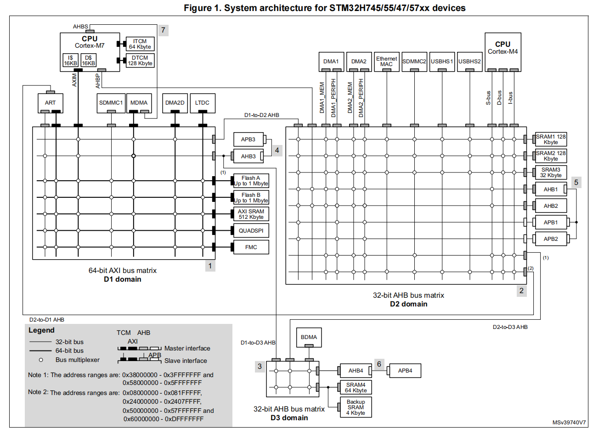
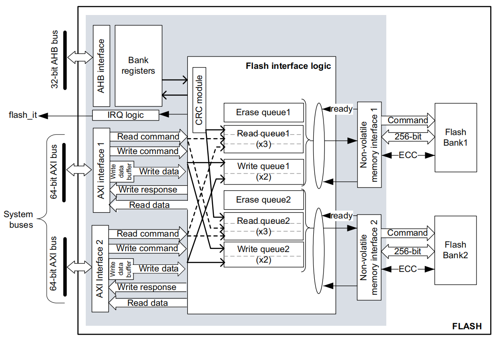

stm32h747-overview

<!--more-->

***

### 1 CPU资源：

包含一个Cortex‑M7：最高 480 MHz
包含一个Cortex‑M4：最高 240 MHz

### 2 片上 SRAM 资源：

- 系统 SRAM：864 KB
- 数据 TCM RAM：128 KB
- 指令 TCM RAM：64 KB
- backup SRAM：4 KB

#### 2.1 864K 系统 SRAM 分布在三个电源域的五个块中：

D1 域：AXI SRAM
- 地址：0x2400 0000，512K
- 通过 D1 域 AXI 总线矩阵访问，所有系统主设备都可访问（除了 BDMA）。
- 用途：存放应用数据，或图形对象（如帧缓冲）。

D2 域：AHB SRAM
- SRAM1：地址 0x3000 0000，128K。所有主设备可访问（除了 BDMA）。可作为 D2 域中外设输入/输出数据的 DMA 缓冲区，或 Cortex‑M4 的代码存放区（当 D1 域掉电时仍可运行）。
- SRAM2：地址 0x3002 0000，128K。所有主设备可访问（除了 BDMA）。可 D2 域中外设输入/输出数据的 DMA 缓冲区，或 M4 应用的读写段。
- SRAM3：地址 0x3004 0000。32K。所有主设备可访问（除了 BDMA）。可以用作缓冲区来存储以太网和USB的外围输入/输出数据，或者用作两个核心之间的共享内存。

D3 域：AHB SRAM
- SRAM4：地址 0x3800 0000，64K。大多数主设备可访问。可用作
BDMA缓冲区用于在D3域中存储外围输入/输出数据。或在 D1/D2 域进入待机模式时保留代码/数据，或作为双核共享内存。

别名映射：为了保持 Cortex‑M4 的 Harvard 架构（MCU 在地址空间里为同一块 SRAM 提供了 指令别名映射，让 M4 内核的指令总线和数据总线可以同时访问这块内存。），D2 域的 SRAM1/2/3 还映射到低地址空间：
- SRAM1 → 0x1000 0000
- SRAM2 → 0x1002 0000
- SRAM3 → 0x1004 0000

访问特性
AHB SRAM：支持字节、半字 (16 bit)、字 (32 bit) 访问。
AXI SRAM：支持字节、半字、字、双字 (64 bit) 访问。
这些存储器可在系统最高频率下无等待周期访问。

AHB 主设备可与 Ethernet MAC/USB OTG HS 并发访问不同的 SRAM 区域（例如 MAC 用 SRAM2，CPU 用 SRAM1）。

#### 2.2 TCM SRAM（仅 M7）

DTCM RAM：
- 地址 0x2000 0000，128K。仅 M7 和 MDMA 可访问。
- 用途：关键实时数据（堆栈、堆）。

ITCM RAM：
- 地址 0x0000 0000，64K。仅 M7 和 MDMA 可访问。
- 用途：关键实时代码（中断处理程序），保证确定性执行。

#### 2.3 backup SRAM
地址：0x3880 0000，4KB，大多数主设备可访问。
在 VBAT 供电下保持数据，在低功耗模式（Standby/VBAT）下仍能保留

### 3 片上 FLASH 资源：

两个独立的 1MB Flash Bank。
- bank1：0x08000000 - 0x080FFFFF
- bank2：0x08100000 - 0x081FFFFF

总线接口：
- 提供两个 64bit AXI 从接口，用于代码和数据访问。
- 提供一个 32bit AHB 从接口，用于访问配置寄存器。
- 每个 Bank 在任意时刻只能执行一个读或写操作（不可并发读写同一个 Bank）。
  
应用程序可以通过两个 AXI 接口同时发起读写请求。

主要特性:
- 读取支持多种数据宽度：支持 64bit、32bit、16bit 和 8bit 的读取操作。
- 写入粒度：每次写入为 256bit（32 字节）。

- 擦除方式：
  - 支持 128KB 扇区擦除。
  - 支持整 Bank 擦除。
  - 支持双 Bank 同时擦除（mass erase）。

- 双 Bank 架构优势：
  - 支持并行操作：两个 Bank 可同时进行读/写/擦除。
  - 支持 Bank 地址映射交换（Bank Swapping）：可动态切换两个 Bank 的地址映射和相关寄存器。(使用同样的链接脚本设置编译程序，镜像能放到不同的物理地址上)

- ECC（错误校正码）：
  - 每个 256bit Flash 字使用 10bit ECC。
  - 支持 1 位错误自动纠正，2 位错误检测。

- CRC 模块：内建硬件 CRC 校验模块。

- 用户可配置的非易失性选项字节。

- 增强型安全保护机制（通过选项字节启用）：
  - 读保护 RDP：防止非法读取 Flash 内容，保护敏感代码。
  - 写保护 WRPS：按 Bank 的 128KB 扇区进行写保护。
  - PCROP（专有代码保护区）：每个 Bank 可配置一个执行专用区（不可读）。

- 命令队列机制：内建读写命令队列，提高 Flash 操作效率。

### 4 Boot configuration

#### 4.1 双核启动顺序 (Boot Order)
芯片有两个核心：Cortex‑M7 和 Cortex‑M4。

启动顺序由 选项字节 (Option Bytes) 中的 BCM7 / BCM4 位决定：

| BCM7 | BCM4 | 启动情况           |
|------|------|--------------------|
| 0    | 0    | M7 启动，M4 时钟关闭 |
| 0    | 1    | M4 启动，M7 时钟关闭 |
| 1    | 0    | M7 启动，M4 时钟关闭 |
| 1    | 1    | M7 和 M4 同时启动   |

#### 4.2 Boot 地址选择 (Boot Modes)
每个核心都有两个可选的 Boot 区域，通过 BOOT 引脚和 选项字节来决定：

Boot = 0:
- Cortex‑M7：BCM7_ADD0[15:0] 为启动地址MSB，默认启动地址为 bank1  0x0800_0000
- cortex‑M4：BCM4_ADD0[15:0] 为启动地址MSB，默认启动地址为 bank2  0x0810_0000

Boot = 1:
- Cortex‑M7：BCM7_ADD1[15:0] 为启动地址MSB，默认启动地址为ITCM 0x000 0000
- cortex‑M4：BCM4_ADD1[15:0] 为启动地址MSB，默认启动地址为 SRAM1 0x1000 0000

M7 默认从主 Flash Bank1 启动。
M4 默认从主 Flash Bank2 启动。
也可以通过选项字节修改 Boot 地址，甚至让它们从 RAM 启动。

### 参考
[1] STM32H7xx Reference Manual, RM0399
