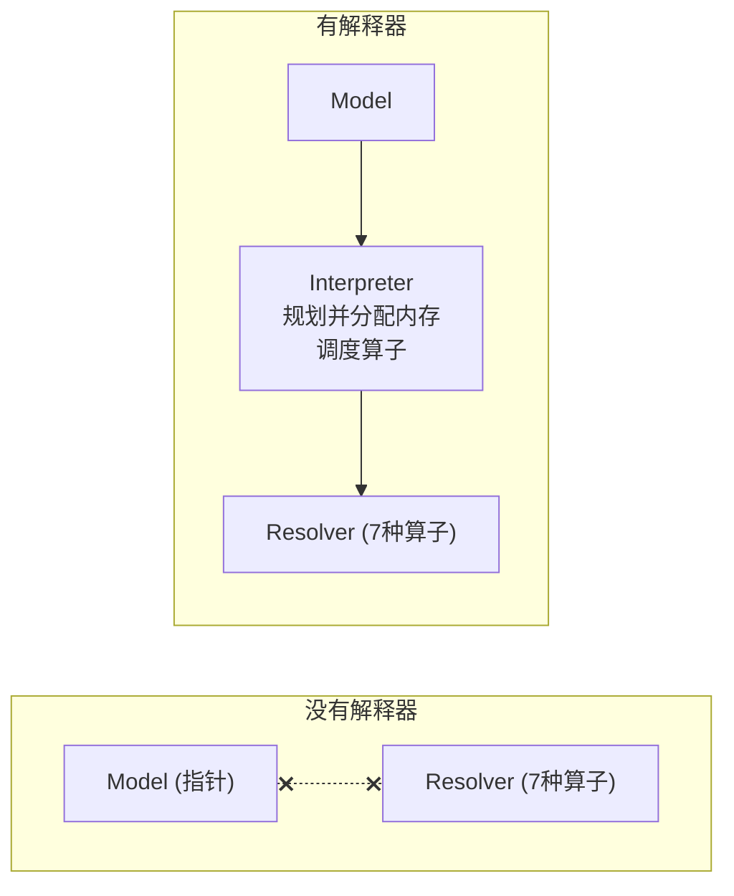

<center>
模型推理依赖解释器，本文主要介绍解释器的创建细节和内部实现。
</center>
<!--more-->

***

之前的文章完成了：[模型加载（拿到了 FlatBuffer 数据指针）](https://fengxun2017.github.io/2026/05/18/tfite-load-model/)和[算子注册（准备好了 7 种算子的计算函数，16 个实例共用）](https://fengxun2017.github.io/2026/05/22/tfite-operator_registration/)。但这两样东西各自独立，需要一个"指挥官"把它们串联起来。

这个指挥官就是 **MicroInterpreter**（解释器）。它做两件事：

1. **规划并分配内存**：在初始化阶段一次性完成所有内存规划——遍历每个算子，收集其内存需求（tensor 数据缓冲区、scratch buffer、op_data），然后由内存规划器根据各 tensor 的生命周期（何时写入、何时读完）让不重叠的 tensor 共享同一块内存，算出最小 Arena 需求。初始化完成后，推理阶段零动态分配
2. **调度算子**：按模型定义的顺序，依次调用每个算子的 init → prepare → invoke




创建解释器的典型代码：

```cpp
static tflite::MicroInterpreter static_interpreter(
    model, resolver, tensor_arena, TENSOR_ARENA_SIZE);
```

传入 4 个参数：Model 指针、OpResolver 引用、Arena 缓冲区地址和大小。

### 1.2 构造函数的整体流程

```cpp
MicroInterpreter::MicroInterpreter(
    const Model* model,
    const MicroOpResolver& op_resolver,
    uint8_t* tensor_arena,
    size_t tensor_arena_size,
    ...)

    // 初始化列表—— 按声明顺序初始化成员
    : model_(model),                          // ① 保存 Model 指针
      op_resolver_(op_resolver),              // ② 保存 OpResolver 引用
      allocator_(*MicroAllocator::Create(     // ③ 创建 MicroAllocator
          tensor_arena, tensor_arena_size, ...)),
      graph_(&context_, model, &allocator_,   // ④ 创建 Graph
             ...),
      tensors_allocated_(false),              // ⑤ 状态标志
      initialization_status_(kTfLiteError),   // 默认错误，Init()成功后改为Ok
      input_tensors_(nullptr),                // AllocateTensors 时填充
      output_tensors_(nullptr),
      micro_context_(&allocator_, model_, &graph_)  // ⑥ 创建 MicroContext
{
    Init(profiler);  // ⑦ 初始化 TfLiteContext 回调表
}
```

7 个步骤可以分成四组：

```
①② 保存输入参数    → 拿到 Model 和 Resolver 的指针/引用
③   创建内存管理器  → MicroAllocator 在 Arena 里自举
④   创建图执行引擎  → MicroInterpreterGraph 保存子图指针
⑤⑥⑦ 初始化框架    → 状态标志、MicroContext、C 回调表
```

### 1.3 步骤③——Arena 内存管理体系的创建

构造函数中最复杂的步骤。`MicroAllocator::Create()` 被调用时，会在 Arena 里依次创建**三层管理对象**：

```
MicroAllocator::Create(tensor_arena, arena_size)
  ├─ SingleArenaBufferAllocator::Create()     // 第一层：原始内存指针管理
  ├─ CreateMemoryPlanner(kGreedy)             // 第二层：内存布局优化器
  └─ new MicroAllocator(...)                  // 第三层：协调员
```

为什么要三层？因为 TFLM 需要解决三个独立的问题：

1. **底层指针运算**：从 Arena 的头尾双向分配内存（SingleArenaBufferAllocator）
2. **内存复用规划**：让生命周期不重叠的 tensor 共享同一块内存（GreedyMemoryPlanner）
3. **协调调度**：把 FlatBuffer 中的模型信息翻译成内存分配请求，调用规划器并提交方案（MicroAllocator）

三者都在 Arena 尾部自举分配——这是嵌入式系统零 malloc 的核心约束。

#### SingleArenaBufferAllocator——五个指针管好一块内存

SingleArenaBufferAllocator 是最底层的管理器。它不关心"谁用什么"，只关心"这块内存还能往哪里放"。核心是**五个指针**：

```
buffer_head_    Arena 的起始地址（创建后不变）
buffer_tail_    Arena 的结束地址（创建后不变）
head_           head 区的当前位置（向高地址方向增长，存放 tensor 数据）
tail_           tail 区的当前位置（向低地址方向增长，存放持久对象）
temp_           temp 区的当前位置（在 head 之上，临时分配）
```

Arena 的三区布局（5 个指针全部标出）：

```
  低地址                                                          高地址 
buffer_head_                                                    buffer_tail_
    │                                                                 │
    ▼                                                                 ▼
    ┌────────────────────────┬────────┬──────┬────────────────────────┐
    │     HEAD 区            │ TEMP区 │ 空闲 │     TAIL 区             │
    │     tensor overlay     │ 临时   │      │     管理对象·持久数据    │
    │     (规划后复用)        │ 借用   │      │     (op_data等)         │
    └────────────────────────┴────────┴──────┴────────────────────────┘
                             ↑        ↑      ↑
                            head_   temp_   tail_(向左增长)
                        (向右增长)  (head_之上波动)     
```

**三种分配操作**：

| 操作 | 方向 | 实现要点 |
|------|------|---------|
| AllocatePersistentBuffer | tail 向低地址 | `AlignPointerDown(tail_ - size, alignment)` → `tail_ = aligned_result` |
| AllocateTemp | temp 向高地址 | `AlignPointerUp(temp_, alignment)` → `temp_ = aligned_result + size` |
| ResizeBuffer | head 向高地址 | `head_ = aligned_result + size`，同时 `temp_ = head_` |

**ResizeBuffer 的具体意义**：所有算子的内存规划完成后，GreedyMemoryPlanner 算出了 head 区所需的最大字节数 `max_head_buffer_usage_`。`ResizeBuffer` 被调用一次，把 `head_` 推到最终位置。之后 head_ 不再移动，推理阶段直接使用这块预分配好的空间。核心实现只有两行：

```cpp
head_ = aligned_result + size;   // head_ 向右推到新位置
temp_ = head_;                    // temp_ 重置到 head_（清除所有临时分配）
```

**AllocatePersistentBuffer 为什么只检查 head_ 而不检查 temp_？**

该函数的碰撞检测是 `aligned_result < head_`，但 temp_ ≥ head_，理论上 tail_ 向下增长时可能先碰到 temp 区。TFLM 通过调用顺序规避了这个问题：

```
Init 阶段：所有 persistent buffer（op_data、LUT 表）集中分配
           此时 temp_ == head_，不存在 temp 区
           tail_ 从 buffer_tail_ 向下增长

Prepare 阶段：每个算子执行前分配 temp tensor，执行后归还
             persistent buffer 在 Init 阶段已分配完毕
             tail_ 几乎不再移动
```

如果代码层面要严格保证，应检查 `aligned_result < temp_`（当 temp_ > head_ 时）。TFLM 选择用调用顺序保证正确性，而非在每次分配时做更严格的检查。

关键约束：
- **head_ 只会增长，不会缩小**——ResizeBuffer 只支持扩大
- **temp_ ≥ head_**——临时分配在 head 之上；`ResetTempAllocations()` 时 `temp_` 回到 `head_`
- **head 和 tail 从不交叉**——如果 `aligned_result < head_`，说明 Arena 不够了

**head_ 与 temp_ 的本质区别**：

`head_` 是已提交的边界（tensor overlay 空间），`temp_` 是可以回收的游标（临时借用空间）。

| | head_ 管的区域 | temp_ 管的区域 |
|--|--------------|--------------|
| 内容 | tensor overlay（规划好的 tensor + scratch buffer 数据） | prepare 阶段的临时 TfLiteTensor 结构体 |
| 生命周期 | 整个推理过程都在 | 单个算子的 prepare() 期间 |
| 谁分配 | `ResizeBuffer` — 一次性确定大小 | `AllocateTemp` — 按需借，用完还 |
| 谁释放 | 不释放 | `ResetTempAllocations()` 一把收回 |

如果没有这个分离设计，16 个算子实例的 prepare 阶段需要 16 份临时空间。有了 head_/temp_ 分离，所有 prepare 共享同一块空间轮流使用。

**temp 区分配的具体对象——临时 TfLiteTensor 结构体**

temp 区分配的是 TfLiteTensor 结构体（约 80-100 字节），它是 FlatBuffer 中 tensor 信息的"C 语言翻译版"。kernel 代码（如 ConvPrepare）通过它读取量化参数：

```cpp
// conv_common.cc — Conv2D 算子的 Prepare 阶段
TfLiteStatus ConvPrepare(TfLiteContext* context, TfLiteNode* node) {
    MicroContext* micro_context = GetMicroContext(context);

    // 从 Arena temp 区分配临时 TfLiteTensor（翻译 FlatBuffer 中的 tensor 信息）
    TfLiteTensor* input  = micro_context->AllocateTempInputTensor(node, 0);
    TfLiteTensor* filter = micro_context->AllocateTempInputTensor(node, 1);
    TfLiteTensor* output = micro_context->AllocateTempOutputTensor(node, 0);

    // 用 input/filter/output 的量化参数计算 multiplier、shift、offset
    // ...

    // 归还 temp 空间
    micro_context->DeallocateTempTfLiteTensor(output);
    micro_context->DeallocateTempTfLiteTensor(input);
}
```

TfLiteTensor 结构体的内容：

```cpp
TfLiteTensor {              ← 整个结构体从 Arena temp 区分配
    dims          → 指向 FlatBuffer 中的维度信息
    type          = kTfLiteInt8
    params.scale  = 0.035     ← 从 FlatBuffer 的 QuantizationParameters 解析
    params.zero_point = -128
    data.data     → 指向 Arena HEAD 区的实际 tensor 数据
    ...
}
```

为什么要翻译？因为 FlatBuffer 中的 tensor 信息是压缩存储的（offset 链表），kernel 代码不能直接读取。需要解压为连续的 C 结构体，kernel 才能直接访问 `input->params.scale`。

为什么是临时的？这个结构体只在 Prepare 期间用一下（读 scale、zero_point、dims 来计算量化参数），用完就归还。推理阶段用的是更轻量的 `TfLiteEvalTensor`（持久分配在 tail 区），不需要这个完整的 TfLiteTensor。

#### GreedyMemoryPlanner——让不重叠的 buffer 共享内存

如果 head 区为每个 tensor 单独分配空间，17 个需要 Arena 分配的 tensor（输入 + 中间激活 + 输出）需要 17 份大小。但 TFLM 的推理是**顺序执行**的：第 1 个算子用完的中间 tensor，第 5 个算子可以覆盖。

GreedyMemoryPlanner 解决的问题：**给定 N 个 buffer 的大小和生命周期，计算每个 buffer 在 head 区的偏移量，使总内存最小**。

**输入**：每个 buffer 的四个属性

```cpp
struct BufferRequirements {
    int size;              // buffer 大小（字节）
    int first_time_used;   // 第一次使用的算子序号
    int last_time_used;    // 最后一次使用的算子序号
    int offline_offset;    // 离线规划偏移（通常 = -1，表示在线规划）
};
```

**输出**：`buffer_offsets_[i]` = 第 i 个 buffer 在 head 区的起始偏移。

**贪心算法**：

算法维护一个 `candidate_offset`（候选位置），从 0 开始。按偏移顺序逐个检查已放置的活跃 buffer，遇到够大的间隙就停下。

```
1. 按大小降序排列所有 buffer（大块先放，小块填缝）
2. 第一个 buffer 放在偏移 0，记入偏移有序链表
3. 对每个后续 buffer B（按大小降序）：
   candidate_offset = 0
   按偏移顺序遍历已放置的 buffer：
     跳过与 B 时间不重叠的（它们不冲突，不产生约束）
     对每个与 B 时间重叠的已放置 buffer：
       gap = 该 buffer 的起始偏移 - candidate_offset
       如果 gap ≥ B.size → 放在 candidate_offset（找到了间隙）
       否则 → candidate_offset 推进到该 buffer 结尾之后
   遍历结束仍无间隙 → 放在 candidate_offset
```

为什么按大小降序？大 buffer 难以放入间隙，小 buffer 容易填缝。先放大块再插小块，减少碎片。

**实例**：3 个 buffer 的布局

```
Buffer A: size=100, lifetime=[0,1]  (算子0-1使用)
Buffer B: size=80,  lifetime=[2,3]  (算子2-3使用)
Buffer C: size=50,  lifetime=[1,2]  (算子1-2使用)

排序: A(100) > B(80) > C(50)

--- 放置 A ---
candidate_offset = 0，无已放置 buffer
A 放在 offset=0，占 [0,100)

--- 放置 B ---
检查 A: A 的 lifetime [0,1]，B 的 lifetime [2,3]，不重叠 → 跳过
B 放在 candidate_offset=0，占 [0,80)    ← 与 A 共享内存！

--- 放置 C ---
检查 A: lifetime [0,1] 与 C [1,2] 重叠
  gap = 0，不够放 50 → candidate_offset = 100
检查 B: lifetime [2,3] 与 C [1,2] 重叠
  B.offset(0) < candidate_offset(100)，不影响 → candidate_offset = 100（不变）
C 放在 candidate_offset=100，占 [100,150)

最终: head 区只需 150 字节（不共享需要 230 字节，节省 35%）
```

#### MicroAllocator——协调员

MicroAllocator 是上层接口。它持有一个 `SingleArenaBufferAllocator` 指针和一个 `MicroMemoryPlanner` 指针，对上提供语义化的分配 API，对下调用底层分配和规划。

**核心数据成员**：

```cpp
class MicroAllocator {
    INonPersistentBufferAllocator* non_persistent_buffer_allocator_;  // → SingleArenaBuf
    IPersistentBufferAllocator* persistent_buffer_allocator_;         // → SingleArenaBuf（同一个对象）
    MicroMemoryPlanner* memory_planner_;                              // → GreedyMemPlanner
    bool model_is_allocating_;
    size_t scratch_buffer_request_count_;
    uint8_t* scratch_buffer_head_;
};
```

注意：`non_persistent_buffer_allocator_` 和 `persistent_buffer_allocator_` 都指向同一个 `SingleArenaBufferAllocator` 对象。这是因为 SingleArenaBufferAllocator 同时继承了两个接口——用不同基类指针访问不同功能。

**MicroAllocator 提供的关键 API**：

| API | 用途 | 调用时机 |
|-----|------|---------|
| StartModelAllocation | 解析 FlatBuffer，分配 TfLiteEvalTensor 和 NodeAndRegistration 数组 | AllocateTensors() 开始 |
| RequestScratchBufferInArena | 记录算子的 scratch buffer 需求 | 算子 prepare() 中 |
| FinishModelAllocation | 运行规划器，提交内存方案 | AllocateTensors() 结束 |
| AllocatePersistentBuffer | 分配持久内存（从 tail） | 任何阶段 |
| AllocateTempTfLiteTensor | 分配临时 tensor（从 temp） | 算子 prepare() 中 |

#### 自举过程详解

理解了三个组件各自的职责，回头看 `MicroAllocator::Create()` 的完整链路：

**Step 1: 对齐 Arena**

```cpp
uint8_t* aligned_arena = AlignPointerUp(tensor_arena, 16);  // 16 字节对齐（SIMD 要求）
size_t aligned_arena_size = tensor_arena + arena_size - aligned_arena;
```

如果 `tensor_arena` 本身不是 16 字节对齐的，会损失几个字节。

**Step 2: 创建 SingleArenaBufferAllocator（自举）**

这是最巧妙的一步。`Create()` 需要在 Arena 里创建自己：

```cpp
SingleArenaBufferAllocator::Create(buffer_head, buffer_size) {
    // 1. 在栈上创建临时对象，用于计算 tail 位置
    SingleArenaBufferAllocator tmp(buffer_head, buffer_size);
    //    tmp 的状态: head_=buffer_head, tail_=buffer_head+buffer_size

    // 2. 从 tmp 的 tail 向低地址分配 sizeof(SingleArenaBufferAllocator) 字节
    uint8_t* allocator_buffer = tmp.AllocatePersistentBuffer(
        sizeof(SingleArenaBufferAllocator), alignof(SingleArenaBufferAllocator));
    //    现在 tmp.tail_ 向低地址移动了 ~40 字节

    // 3. 在分配的位置上用 placement new 构造真正的对象
    return new (allocator_buffer) SingleArenaBufferAllocator(tmp);
    //    拷贝构造：新对象的 head_、tail_ 与 tmp 相同
    //    tmp 在函数返回后销毁（栈变量），但数据已拷贝到 Arena 里了
}
```

为什么用临时对象？因为真正的对象还没构造，不能调用自己的方法。用栈上的临时对象做一次"预演"，计算出 tail 的正确位置，然后在 Arena 中构造真正的对象。

**Step 3: 创建 GreedyMemoryPlanner**

```cpp
uint8_t* planner_buffer = memory_allocator->AllocatePersistentBuffer(
    sizeof(GreedyMemoryPlanner), alignof(GreedyMemoryPlanner));
MicroMemoryPlanner* memory_planner = new (planner_buffer) GreedyMemoryPlanner();
```

从 tail 继续向低地址分配，placement new 构造。此时 GreedyMemoryPlanner 是空壳——还没接收任何 buffer 信息。

**Step 4: 创建 MicroAllocator 自身**

```cpp
uint8_t* allocator_buffer = memory_allocator->AllocatePersistentBuffer(
    sizeof(MicroAllocator), alignof(MicroAllocator));
MicroAllocator* allocator = new (allocator_buffer)
    MicroAllocator(memory_allocator, memory_allocator, memory_planner);
```

同样从 tail 分配，placement new 构造。

**完成后 Arena 的状态**：

```
← 低地址                                                  高地址 →
┌──────────────────────┬────────────────────────────────────────┐
│  空闲空间             │         TAIL 区 (~1KB)                 │
│  head_ = temp_       │  MicroAllocator | GreedyPlanner | SAB  │
│  待 AllocateTensors  │  ← tail_                               │
└──────────────────────┴────────────────────────────────────────┘
```

三个管理对象占用 Arena 的尾部。头部全是空闲空间，等待 AllocateTensors() 分配 tensor 数据。

### 1.4 步骤④⑥——Graph 和 MicroContext

**MicroInterpreterGraph**——图执行引擎：

```cpp
MicroInterpreterGraph::MicroInterpreterGraph(
    TfLiteContext* context, const Model* model,
    MicroAllocator* allocator, ...)
    : context_(context),
      model_(model),
      allocator_(allocator),
      current_subgraph_index_(0),
      current_operator_index_(0) {
    if (model != nullptr) {
        subgraphs_ = model->subgraphs();  // 直接指向 FlatBuffer 中的子图数组（零拷贝）
    }
}
```

只是保存指针。`subgraphs_` 直接指向 FlatBuffer 中的数据。

**MicroInterpreterContext**——kernel 与框架之间的桥梁：

它持有一个**状态机**（`InterpreterState`），随推理流程推进：

```
kInit → kPrepare → kMemoryPlanning → kInvoke
```

状态机控制每个阶段允许哪些 API 调用。比如 `kInit`/`kPrepare` 阶段可以分配内存，`kInvoke` 阶段只能读取 tensor 和 scratch buffer。这防止了 kernel 在错误阶段做不该做的事（比如 invoke 期间分配内存）。

### 1.5 步骤⑦——Init() 设置 TfLiteContext C 回调表

**为什么必须是 C 回调？** kernel 代码（Conv2D、MaxPool 等）需要申请内存、读取 tensor，但它们只认识 `TfLiteContext*`——一个 C 结构体。同一套 kernel 代码要跑在 Android（TFLite）和 STM32（TFLM）上，两者的解释器实现完全不同。C 接口是它们之间的**稳定契约**：

```
Kernel 代码（跨平台通用）:
  context->AllocatePersistentBuffer(context, size)
       │
       ▼  C 函数指针调用
  TfLiteContext.AllocatePersistentBuffer ── 指向哪个函数？
       │
       ├─ Android TFLite → 指向 TFLite 的 C++ 实现（有 malloc）
       └─ STM32 TFLM    → 指向 TFLM 的 C++ 实现（从 Arena tail 分配）
```

`Init()` 的工作就是把 7 个函数指针填上：

```cpp
void MicroInterpreter::Init(MicroProfilerInterface* profiler) {
    micro_context_.SetInterpreterState(InterpreterState::kInit);

    // context_.impl_ 指向 micro_context_
    context_.impl_ = static_cast<void*>(&micro_context_);

    // 注册 C 风格回调函数（kernel 通过 context->xxx 调用）
    context_.ReportError = MicroContextReportOpError;
    context_.GetTensor = MicroContextGetTensor;
    context_.GetEvalTensor = MicroContextGetEvalTensor;
    context_.RequestScratchBufferInArena = MicroContextRequestScratchBufferInArena;
    context_.GetExternalContext = MicroContextGetExternalContext;
    context_.AllocatePersistentBuffer = MicroContextAllocatePersistentBuffer;
    context_.GetScratchBuffer = MicroContextGetScratchBuffer;

    initialization_status_ = kTfLiteOk;
}
```

**桥接层只做一件事**——把 C 函数指针调用转发到 C++ 对象。`context_.impl_` 是那座桥，指向 `MicroInterpreterContext`（C++ 对象）。

以 `AllocatePersistentBuffer` 为例，三步拆解：

```
步骤 1: Init() 中存入 C++ 对象地址
  context_.impl_ = static_cast<void*>(&micro_context_);
  // MicroInterpreterContext* → void*，抹掉类型信息

步骤 2: Kernel 通过 C 函数指针调用
  context->AllocatePersistentBuffer(context, sizeof(OpData))

步骤 3: 桥接函数恢复类型，转发到 C++ 方法
  void* MicroContextAllocatePersistentBuffer(TfLiteContext* ctx, size_t bytes) {
      return GetMicroContext(ctx)->AllocatePersistentBuffer(bytes);
      // GetMicroContext(ctx) 展开为：
      //   reinterpret_cast<MicroContext*>(ctx->impl_)
      //   从 void* 恢复为 MicroContext*，然后调 C++ 方法
  }
```

所有 7 个回调都遵循同一模式：C 函数指针 → 从 `impl_` 恢复 C++ 对象 → 调用 C++ 方法。这是实现多态的最轻量方案——不需要虚函数表，不需要继承体系，一个指针 + 一个静态函数就够了。

**完整调用链——从用户代码到 Arena 分配**

以 CONV_2D 算子申请 op_data 为例，从 `ai_engine.cpp` 入口追踪完整路径：

```
ai_engine.cpp                          用户代码
  └─ MicroInterpreter(model, resolver, tensor_arena, size)
       ├─ micro_context_(&allocator_, ...)              创建 MicroContext C++ 对象
       └─ Init()
            ├─ context_.impl_ = &micro_context_          把 C++ 对象指针藏进 C 结构体
            └─ context_.AllocatePersistentBuffer         = &桥接函数

之后，解释器调用 Conv 算子的 Init:
  conv_common.cc: ConvInit(context, ...)
    └─ context->AllocatePersistentBuffer(context, sizeof(OpDataConv))
         │
         │  ① 通过函数指针间接调用
         ▼
    MicroContextAllocatePersistentBuffer(ctx, bytes)     桥接函数（C 接口）
         │
         │  ② GetMicroContext(ctx) = reinterpret_cast<MicroContext*>(ctx->impl_)
         ▼
    MicroContext::AllocatePersistentBuffer(bytes)        C++ 方法
         │
         │  ③ 转发到分配器
         ▼
    MicroAllocator::AllocatePersistentBuffer(bytes)
         │
         │  ④ 调用底层 Arena 分配
         ▼
    SingleArenaBufferAllocator::AllocatePersistentBuffer(bytes)
         │
         │  ⑤ 从 Arena tail 区分配
         ▼
    tail_ = AlignPointerDown(tail_ - size, alignment)   你的 tensor_arena[] 里的空间
```

kernel 代码只知道第 1 步的 C 接口，不知道底层是 malloc（Android）还是 Arena tail（STM32）。

### 1.6 构造函数完成后的内存全景

```
┌─────────────────────────────────────────────┐
│           Arena (1MB)                       │
│  ┌──────────────────────┬────────────────┐  │
│  │  空闲空间             │  管理对象 (~1KB)│ │
│  │  head_ = temp_       │  MicroAllocator│  │
│  │  待 AllocateTensors  │  GreedyPlanner │  │
│  │                      │  SingleArenaBuf│  │
│  └──────────────────────┴────────────────┘  │
└─────────────────────────────────────────────┘

栈/静态区:
  MicroMutableOpResolver<20>   registrations_[20]
  MicroInterpreter              model_, context_, graph_
  TfLiteContext                 7 个函数指针
```

### 1.7 完整流程图

```
MicroInterpreter(model, resolver, tensor_arena, arena_size)
  │
  ├─ ① model_ = model                     (保存指针)
  ├─ ② op_resolver_ = resolver             (保存引用)
  │
  ├─ ③ MicroAllocator::Create(arena, size)
  │     ├─ SingleArenaBufferAllocator::Create()
  │     │     └─ 在 arena tail 分配自身 (~40字节)
  │     ├─ CreateMemoryPlanner(kGreedy)
  │     │     └─ 在 arena tail 分配 GreedyMemoryPlanner (~20字节)
  │     └─ 在 arena tail 分配 MicroAllocator (~60字节)
  │
  ├─ ④ MicroInterpreterGraph(&context_, model, &allocator_)
  │     └─ 保存指针，subgraphs_ 指向 FlatBuffer
  │
  ├─ ⑤ tensors_allocated_ = false
  ├─ ⑥ micro_context_(&allocator_, model_, &graph_)
  │
  └─ ⑦ Init(profiler)
        ├─ state_ = kInit
        ├─ context_.impl_ = &micro_context_
        ├─ context_.AllocatePersistentBuffer = 桥接函数
        ├─ context_.GetScratchBuffer = 桥接函数
        ├─ context_.RequestScratchBufferInArena = 桥接函数
        ├─ context_.ReportError = 桥接函数
        ├─ context_.GetTensor = 桥接函数
        ├─ context_.GetEvalTensor = 桥接函数
        └─ initialization_status_ = kTfLiteOk

此时：模型指针就绪，分配器就绪，回调表就绪
但还没有解析 FlatBuffer，还没有分配 tensor 内存
下一步是 AllocateTensors()
```