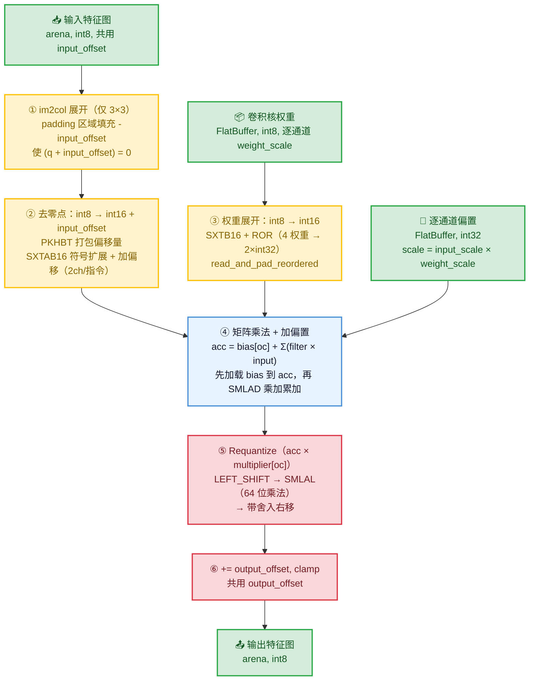

<center>
本文主要介绍 TFLite Micro 中 CONV2D 实现的原理。从浮点公式出发，推导 INT8 量化卷积的四步计算流程，然后对照 CMSIS-NN 源码，逐步解析每条 DSP 指令如何将标量运算变为 SIMD 并行运算。
</center>
<!--more-->

***


## 1 CONV_2D——推理的计算核心

CONV_2D 是 CNN 中计算量最大的算子。本节先推导量化公式，再剖析 CMSIS-NN 的 DSP 加速实现。

### 1.1 数学推导：从浮点到 INT8 定点

#### 1.1.1 浮点卷积公式

去掉 batch 和输出通道的外层循环，核心操作是加权求和：

```
output_real[y][x][oc] = Σ_{ky,kx,ic} filter[oc][ky][kx][ic] × input[y·stride+ky][x·stride+kx][ic] + bias[oc]
```

简写为 **y = Wx + b**。下文目标：把所有浮点运算变成纯整数运算。

#### 1.1.2 量化基础

INT8 量化中，真实值用 `(quant_value, zero_point, scale)` 三元组表示：

```
real_value = (quant_value - zero_point) × scale
```

四种张量的量化参数：

| 张量 | 量化公式 | 说明 |
|------|----------|------|
| 输入 | `x_real = (q_input - zp_in) × S_in` | `input_offset = -zp_in` |
| 权重 | `w_real = (q_filter - 0) × S_w` | 权重一般采用对称量化，`zp_w = 0` |
| 输出 | `y_real = (q_output - zp_out) × S_out` | `output_offset = -zp_out` |
| 偏置 | `b_real = q_bias × (S_in × S_w)` | int32，无 zero_point |

**偏置为什么没有 zero_point？** 两个原因：
1. int32 范围 ±21 亿，足够大不需要偏移；
2. 偏置的 scale `S_bias = S_in × S_w` 由输入和权重决定（不是独立选择的），加 zp_bias 只会引入多余计算。见下文分析。

#### 1.1.3 偏置 scale 的严格推导

目标：让偏置能以纯整数加法直接合并到累加器。

```
y_real = Σ w_real × x_real + b_real
       = Σ (q_filter × S_w) × ((q_input - zp_in) × S_in) + b_real
       = S_w × S_in × Σ q_filter × (q_input - zp_in) + b_real
                      \___________________________/
                              纯整数运算 acc'
```

希望偏置也能提取 `S_w × S_in` 公因子：

```
b_real = S_w × S_in × q_bias
```

合并进累加器：

```
y_real = S_w × S_in × (acc' + q_bias)
                       \__________/
                        新累加器 acc = acc' + q_bias
```

因此 `S_bias = S_in × S_w`，`q_bias = round(b_real / S_bias)`。

#### 1.1.4 代入推导：从浮点到整数

将量化关系代入浮点公式，`input_offset = -zp_in`：

```
(q_out - zp_out) × S_out = S_w × S_in × [ Σ q_filter × (q_input + input_offset) + q_bias ]
                                          \_____________________________________________/
                                                          纯 int32 运算 acc
```

解出 `q_out`：

```
q_out = acc × (S_w × S_in / S_out) + zp_out
             \__________________/
                   浮点数 M
```

现在问题变成：**如何用整数运算实现 `acc × M`？**

#### 1.1.5 Requantize：用定点数编码浮点数 M

`M = S_w × S_in / S_out` 是浮点数。嵌入式 CPU 做浮点乘法太慢，需要用纯整数运算实现 `acc × M`。本节从 IEEE 754 浮点格式出发，逐步推导编码方法。

**一、问题与思路**

`M` 是浮点数，比如 0.035。我们希望用两个**整数** `(multiplier, shift)` 来精确表示它，使得后续计算只需要整数乘法和移位。

核心思路：任何浮点数都可以写成"尾数 × 2 的幂"。如果尾数用一个整数来编码，幂次用另一个整数来记录，就能在整数域中重建这个浮点数。

**执行时机**：这个浮点→定点的分解只在模型初始化时执行一次——可能在 PC 端的 TFLite 转换器（Python），也可能在 MCU 的算子 Prepare 阶段（首次推理前调用）。无论哪种情况，都不在推理热路径上，所以即使涉及浮点运算也不影响性能。MCU 端推理时只使用预计算好的 `(multiplier, shift)` 整数对，执行纯整数的乘法和移位。

**二、IEEE 754 浮点数就是"尾数 × 2 的幂"**

IEEE 754 double（64 位）的内存格式天然就是这种结构：

```
bit 63    bit 62──52       bit 51──0
┌────┬───────────┬──────────────────┐
│ S  │ Exponent  │    Fraction      │
│1bit│ 11 bits   │    52 bits       │
└────┴───────────┴──────────────────┘

真实值 = (-1)^S × (1 + fraction/2^52) × 2^(exponent - 1023)
                  \_______________/
                  尾数，范围 [1, 2)
```

尾数部分 `1 + fraction/2^52` 总在 `[1, 2)` 范围内（因为有隐含的前导 1）。

**三、frexp：把尾数缩放到 [0.5, 1)**

我们不用 IEEE 754 原生的 `[1, 2)` 尾数范围，而是缩放到 `[0.5, 1)`。原因在下一步揭晓。

C 标准库函数 `frexp` 做这件事：

```
frexp(M) → (q, shift)
M = q × 2^shift，其中 q ∈ [0.5, 1)
```

从 IEEE 754 到 frexp 格式，只需要一步操作：**尾数右移 1 位（÷2），指数 +1 补偿**。

```
IEEE 754:  M = (1.f) × 2^(E - 1023)       尾数 1.f ∈ [1, 2)
                               ↑
                     尾数 ÷ 2, 指数 +1
                               ↓
frexp:     M = (1.f / 2) × 2^(E - 1023 + 1)
             = 0.5f × 2^(E - 1022)
               ↑              ↑
               q ∈ [0.5, 1)   shift = E - 1022
```

**四、将尾数编码为 Q0.31 定点数**

现在 `M = q × 2^shift`，`q ∈ [0.5, 1)`。我们需要把 `q` 编码为一个 int32 整数。

**Q0.31 定点数**的约定：一个 int32 值除以 `2^31` 就得到它所表示的小数。

```
int32 值              表示的实数值
────────────────────  ──────────────────
2^31 = 2147483648     1.0    （溢出，int32 放不下）
2^30 = 1073741824     0.5
2^29 = 536870912      0.25
1                     1/2^31 ≈ 4.7×10^-10
```

把 `q` 编码为 Q0.31，就是求一个 int32 值 `multiplier`，使得 `multiplier / 2^31 ≈ q`：

```
multiplier = round(q × 2^31)
```

**为什么选择 [0.5, 1) 而不是 [1, 2)？** 因为 `q ∈ [0.5, 1)` 意味着 `q × 2^31 ∈ [2^30, 2^31)`，编码后的 `multiplier` 的最高位总是 1，**充分利用了 int32 的全部 31 位有效位**。

如果用 IEEE 754 原生的 `[1, 2)` 范围：`q × 2^31 ∈ [2^31, 2^32)`，溢出 int32，还得做一次特判和补偿。

以 M = 0.035 为例：

```
q = 0.56, shift = -4
multiplier = round(0.56 × 2^31) = round(1202590842.88) = 1202590843
```

**五、重建公式**

从编码的 `(multiplier, shift)` 恢复 `M`：

```
M = q × 2^shift                    // frexp 的分解
  ≈ (multiplier / 2^31) × 2^shift  // 用 Q0.31 近似 q（≈ 因为四舍五入）
  = multiplier × 2^(shift - 31)    // ← 最终编码公式
```

验证：

```
multiplier × 2^(shift - 31) = 1202590843 × 2^(-4 - 31)
                             = 1202590843 / 2^35
                             = 1202590843 / 34359738368
                             ≈ 0.03500... ≈ 0.035 ✓
```

**六、完整编码过程总结**

```
输入：浮点数 M（如 0.035）
输出：整数对 (multiplier, shift)

Step 1: frexp(M) → (q, shift)       分离尾数和指数
        M = q × 2^shift, q ∈ [0.5, 1)

Step 2: multiplier = round(q × 2^31) 尾数编码为 Q0.31
        multiplier ∈ [2^30, 2^31)     最高位为 1，全部有效位利用

Step 3: 重建公式
        M ≈ multiplier × 2^(shift - 31)
```

**七、per-channel 量化**

实际模型中每个输出通道的 `S_w` 可能不同（per-channel 量化），所以 `M[oc]` 各不相同。`multiplier` 和 `shift` 都是数组，每个输出通道一个值。这就是函数签名中它们是指针的原因：`const int32_t* output_multiplier`。

**八、QuantizeMultiplier() 源码**

编码过程的代码实现（`quantization_util.cc`）核心只有 3 行：

```c
void QuantizeMultiplier(double double_multiplier,
                        int32_t* quantized_multiplier, int* shift) {
  const double q = std::frexp(double_multiplier, shift);          // Step 1
  auto q_fixed = static_cast<int64_t>(TfLiteRound(q * (1LL << 31))); // Step 2
  if (q_fixed == (1LL << 31)) { q_fixed /= 2; ++*shift; }       // q 接近 1.0 时溢出
  if (*shift < -31) { *shift = 0; q_fixed = 0; }                 // M 极小时归零
  *quantized_multiplier = static_cast<int32_t>(q_fixed);
}
```

**两种实现路径**

`QuantizeMultiplier` 内部通过编译宏 `TFLITE_EMULATE_FLOAT` 选择实现方式：

```c
#ifdef TFLITE_EMULATE_FLOAT
  int64_t q_fixed = IntegerFrExp(double_multiplier, shift);   // 方法 B：纯整数位操作
#else
  const double q = std::frexp(double_multiplier, shift);       // 方法 A：C 标准库 frexp
  auto q_fixed = static_cast<int64_t>(TfLiteRound(q * (1LL << 31)));
#endif
```

|  | 方法 A：std::frexp（默认） | 方法 B：IntegerFrExp（TFLITE_EMULATE_FLOAT） |
|---|---|---|
| 前提 | 有 FPU 或不介意浮点指令 | 无 FPU，需避免浮点运算 |
| 原理 | 调用 C 标准库，浮点运算 | 直接解析 IEEE 754 位模式，整数位运算 |
| 步骤 | `frexp` → 浮点 `q` → `round(q × 2^31)` | 位掩码提取 exponent/fraction → 整数运算 |
| 结果 | `(multiplier, shift)` | 相同 |

两种方法输入输出完全等价。方法 A 自然直观（就是"三"中描述的数学步骤），方法 B 用位运算绕过浮点指令。

**方法 B 源码解析（`quantization_util.cc:125-189`）**

核心思路：把 double 的 64 位内存直接当成 uint64 读取，用位掩码和移位提取 exponent 和 fraction，零浮点运算。

```c
int64_t IntegerFrExp(double input, int* shift) {
  // Step 1: union 类型双关——同一块内存换个类型解读，零运算
  union { double d; uint64_t u; } cast;
  cast.d = input;
  const uint64_t u = cast.u;

  // 特殊值处理（零、NaN、Inf）...

  // Step 2: 提取 exponent → 计算 shift
  const uint32_t exponent_part = (u & 0x7FF0000000000000) >> 52;  // bit 62-52
  *shift = (exponent_part - 1023) + 1;  // -1023 去偏移, +1 补偿 [1,2)→[0.5,1)

  // Step 3: 等价实现 `round(q × 2^31)`
  // IEEE 754 尾数 = 1 + fraction_52bit / 2^52       ∈ [1, 2)
  // q   = 尾数 / 2  = 0.5 + fraction_52bit / 2^53   ∈ [0.5, 1)
  // 展开 q × 2^31 = (0.5 + fraction_52bit / 2^53) × 2^31
  //               = 2^30   +  fraction_52bit / 2^22
  //               = 0x40000000   +  fraction_52bit >> 22
  //                   ↑ 固定项          ↑ 右移 22 位 = 取高 30 位
  // kFractionMask 取 bit[51:22]（30 位），丢弃低 22 位
  int64_t fraction = 0x40000000 + ((u & 0x000FFFFFFFC00000) >> 22);
  //                  ^^^^^^^^^^   ^^^^^^^^^^^^^^^^^^^^^^^^^^^^
  //                  2^30 = 0.5×2^31   fraction 高 30 位右移到 bit[29:0]

  // Step 4: 舍入——被丢弃的低 22 位超过一半(2^21)时进 1，等价于 round()
  if ((u & 0x003FFFFF) > 0x00200000) fraction += 1;

  return fraction;  // 等价于 round(q × 2^31)
}
```

以 0.035 逐步验证：

```
0.035 → IEEE 754 → 0x3FA1EB851EB851EC

Step 2: 提取 exponent → shift
  exponent_part = (0x3FA1EB851EB851EC & 0x7FF0000000000000) >> 52 = 1018
  shift = (1018 - 1023) + 1 = -4

Step 3: 提取尾数 → Q0.31
  u & 0x000FFFFFFFC00000 = 0x0001EB851E800000    (取 bit[51:22])
  >> 22                   = 0x07AE147A            (对齐到 bit[29:0])
  + 0x40000000            = 0x47AE147A            (bit30=1, 隐含的 0.5)

Step 4: 舍入
  低 22 位: u & 0x003FFFFF = 0x3851EC (= 3,690,988)
  阈值:     0x00200000       = 2,097,152 (2^21)
  3,690,988 > 2,097,152 → 向上舍入
  fraction = 0x47AE147A + 1 = 0x47AE147B (= 1,202,590,843)

验证:
  std::frexp(0.035) → (0.56, -4)
  round(0.56 × 2^31) = 1,202,590,843 = 0x47AE147B  ✓ 两种方法结果一致
```

全程只用到 `&`（掩码）、`>>`（右移）、`+`（加法），没有任何浮点乘法或 FPU 指令。

#### 1.1.6 Requantize 的三步计算

`shift` 有三种取值，通过两个宏拆分为独立的 `left_shift` 和 `right_shift`：

```c
#define LEFT_SHIFT(s)  (s > 0 ? s : 0)    // shift > 0 时取 shift，否则 0
#define RIGHT_SHIFT(s) (s > 0 ? 0 : -s)   // shift > 0 时取 0，否则取 -shift
```

| shift | LEFT_SHIFT | RIGHT_SHIFT | 效果 |
|-------|------------|-------------|------|
| +3 | 3 | 0 | 左移放大 3 位，不右移 |
| 0 | 0 | 0 | 都不移 |
| -4 | 0 | 4 | 不左移，右移缩小 4 位 |

Requantize 的三步计算，左移在乘法**之前**、右移在乘法**之后**：

```
Step A: 若 shift > 0，左移放大（在乘法前执行，避免精度损失）
  acc <<= LEFT_SHIFT(shift)

Step B: 64 位乘法 + 除以 2^31（编译为一条 SMLAL 指令）
  product = ((int64_t)acc × multiplier + 2^30) >> 31
                                              ↑ "+2^30 再右移31" 等价于四舍五入

Step C: 若 shift < 0，带舍入右移缩小
  result = round(product / 2^RIGHT_SHIFT(shift))
```

验证：

```
result ≈ acc × 2^LEFT_SHIFT × multiplier / 2^31 / 2^RIGHT_SHIFT
       = acc × multiplier × 2^(LEFT_SHIFT - 31 - RIGHT_SHIFT)
       = acc × multiplier × 2^(shift - 31)    （因为 LEFT_SHIFT - RIGHT_SHIFT = shift）
       = acc × M                              ✓
```

左移放在乘法之前是为了避免放大舍入误差——`>> 31` 的舍入误差最多 ±0.5，如果先 `>> 31` 再左移，误差会被放大 `2^left_shift` 倍；先左移再乘，`>> 31` 只产生一次 ±0.5 的误差。

#### 1.1.7 完整四步流程总结

```
Step 1: 去零点 + 乘加累加
  acc = Σ filter[ic] × (input[ic] + input_offset)

Step 2: 加偏置
  acc += bias[oc]

Step 3: Requantize（acc × M，定点乘法代替浮点乘法）
  acc = Requantize(acc, multiplier[oc], shift[oc])

Step 4: 加输出零点 + 截断
  output[oc] = clamp(acc + output_offset, activation_min, activation_max)
```

#### 1.1.8 参数粒度：逐通道 vs 共用

四步流程中出现的参数，按"粒度"分为两类：

**逐输出通道（per-channel）**——每层中的每个输出通道各有一个独立值：

| 参数 | 含义 | 原因 |
|------|------|------|
| `weight` | 权重 | 每个输出通道学习到不同的特征 |
| `bias` | 偏置 | 每个输出通道独立 |
| `weight_scale` | 权重量化尺度 | TFLM 默认 per-channel 量化，各通道数值范围不同 |
| `output_multiplier` | Requantize 乘数 | `= input_scale × weight_scale[ch] / output_scale`，因 weight_scale 逐通道而不同 |
| `output_shift` | Requantize 移位 | 从上面的 multiplier 量化而来，自然也逐通道 |

**每层中所有通道共用**——整个张量只有一个值：

| 参数 | 含义 | 原因 |
|------|------|------|
| `input_scale/input_offset` | 输入 缩放系数/zero_point 的负值 | 输入张量只有一个 scale / zero_point |
| `output_scale/output_offset` | 输出 缩放系数/zero_point | 输出张量只有一个 scale / zero_point |
| `stride / padding / dilation` | 结构参数 | 卷积几何形状与通道无关 |
| `activation_min / max` | 激活裁剪范围 | 如 ReLU → min=0, max=255 |

**核心规律**：`weight_scale` 是逐通道的，所有从它派生的参数（multiplier、shift）也逐通道。而 input/output 的 scale 和 zero_point 是张量级标量，所以是共用值。

> PS：层内共享，并不是所有层共享。

这解释了源码中的循环结构——Requantize 的 `out_mult` 和 `out_shift` 在**输出通道的循环内**逐通道取值（`*out_mult++`, `*out_shift++`），而 `input_offset` 只在循环外预处理阶段使用一次。

### 1.2 源码实现分析

本节从实际卷积调用入口出发，跟踪源码走完一次卷积的完整执行流程。遇到 DSP 指令时直接展开解释。

#### 1.2.2 入口：路径分发（arm_convolve_wrapper_s8）

源码 `arm_convolve_wrapper_s8.c:50-125`：

```
arm_convolve_wrapper_s8(ctx, conv_params, quant_params, ...)
│
├─ padding==0 && filter==1×1 && dilation==1 && input_ch==filter_ch?
│   ├─ stride==1? → arm_convolve_1x1_s8_fast()    ← MobileNet pointwise 走这里
│   └─ stride!=1? → arm_convolve_1x1_s8()
│
├─ input_h==1 && filter_h==1 && dilation_w==1 && (stride×ch)%4==0?
│   └─ → arm_convolve_1_x_n_s8()
│
└─ 其他 → arm_convolve_s8()                        ← 3×3 卷积走这里
```

轻量 CNN 架构中两种主要卷积：

- **3×3 标准/depthwise 卷积**：走 `arm_convolve_s8` 通用 im2col 路径
- **1×1 pointwise 卷积**：走 `arm_convolve_1x1_s8_fast` 快速路径

下文分别跟踪这两条路径。

#### 1.2.3 通用路径：3×3 卷积（arm_convolve_s8）

##### 第一阶段：im2col 展开

源码 `arm_convolve_s8.c:141-209`。

im2col 的目标：把卷积的二维滑动窗口操作转为矩阵乘法。对于每个输出位置 `(i_out_y, i_out_x)`，从输入中提取一个 `kernel_y × kernel_x × kernel_ch` 的一维向量作为矩阵乘法的一行。

```
输出位置 (0,0)  → 提取 3×3×ch 个元素 → im2col 第 1 行
输出位置 (0,1)  → 提取 3×3×ch 个元素 → im2col 第 2 行
...
当 lhs_rows == 2 时触发矩阵乘法（同时算 2 个输出位置）
```

**padding 的处理**（line 196-198）：越界位置填充 `-input_offset`：

```c
if (k_y < 0 || k_y >= input_y || k_x < 0 || k_x >= input_x) {
    arm_memset_s8(im2col_buf, (int8_t)-input_offset, sizeof(int8_t) * kernel_ch);
}
```

原因：padding 区域的浮点真实值为 0，而 `0 = (q + input_offset)` → 需要 `q = -input_offset`，使得 `(-input_offset) + input_offset = 0`。

**乒乓缓冲设计**（line 131-132）：

```c
int8_t  *im2col_buf           = (int8_t *)buffer_a + aligned_rhs_cols * 2;  // 后半：存 int8 原始数据
int16_t *im2col_buf_start_s16 = buffer_a;                                   // 前半：存 int16 展开数据
```

缓冲区分前后两半：前半存 int16 展开数据（给 SMLAD 用），后半存 int8 原始数据（刚从输入提取的）。每凑够 2 行就触发矩阵乘法。

##### 第二阶段：int8 → int16 + input_offset

源码 `arm_convolve_s8.c:242-243`（DSP 路径）：

```c
arm_s8_to_s16_unordered_with_offset(
    im2col_buf - rhs_cols, im2col_buf_start_s16, rhs_cols, (int16_t)input_offset);
```

这是 1.1.7 中 **Step 1 的"去零点"部分**。展开 `arm_s8_to_s16_unordered_with_offset.c:42-71`：

```c
const int32_t offset_s16x2 = PKHBT(offset, offset, 16);   // ①
while (block_cnt > 0) {
    in_s8x4 = arm_nn_read_s8x4_ia(&src);                   // ②
    in_s16x2_1 = SXTAB16(offset_s16x2, in_s8x4);           // ③
    in_s16x2_2 = SXTAB16(offset_s16x2, ROR(in_s8x4, 8));   // ④
    arm_nn_write_q15x2_ia(&dst, in_s16x2_1);
    arm_nn_write_q15x2_ia(&dst, in_s16x2_2);
    block_cnt--;
}
```

逐行解析：

**① PKHBT**——Pack Halfword Bottom + Top。把 offset 复制到 int32 的高低两个半字：

```
PKHBT(5, 5, 16) → [5_s16 | 5_s16] = 一个 int32 包含两份 offset
```

为什么需要两份？因为接下来 SXTAB16 会同时处理 2 个通道，每个通道各需要一份 offset。

**② arm_nn_read_s8x4_ia**——从内存一次读 4 个 int8 打包为 uint32：

```
内存: [ch0_s8 | ch1_s8 | ch2_s8 | ch3_s8] → 一个 uint32
```

**③④ SXTAB16**——Sign eXtend and Add with Bias。关键特性：**间隔取字节**，从 32 位寄存器中只取 bits[7:0] 和 bits[23:16]，跳过中间的 bits[15:8] 和 bits[31:24]。

② 读入的 4 个 int8 在寄存器中的布局：

```
bits:  [31:24]  [23:16]  [15:8]  [7:0]
         ch3      ch2      ch1    ch0
```

③ 第一条 SXTAB16：取 ch0（bits[7:0]）和 ch2（bits[23:16]），各自符号扩展为 int16 后加 offset：

```
SXTAB16([off | off], [ch3 | ch2 | ch1 | ch0])
  → 取 ch0 → sign extend → int16 + off
  → 取 ch2 → sign extend → int16 + off
  结果: [ch2_s16+off | ch0_s16+off]
```

ch1 和 ch3 被跳过了，怎么办？——用 ROR 循环右移 8 位，让它们"转"到 SXTAB16 能取到的位置：

```
ROR([ch3 | ch2 | ch1 | ch0], 8)
  → [ch0 | ch3 | ch2 | ch1]    ch1 到了 bits[7:0]，ch3 到了 bits[23:16]
```

④ 第二条 SXTAB16：取移位后的 ch1 和 ch3：

```
SXTAB16([off | off], ROR(in, 8))
  → 取 ch1 → sign extend → int16 + off
  → 取 ch3 → sign extend → int16 + off
  结果: [ch3_s16+off | ch1_s16+off]
```

两次写入内存后的最终顺序：ch0, ch2, ch1, ch3（非原始的 ch0, ch1, ch2, ch3）。这就是函数名中 **"unordered"** 的含义。后续矩阵乘法以同样的 "unordered" 顺序读取，所以整体正确。

**优势**：2 条 SXTAB16 处理 4 个通道的"扩展+偏移"，比标量逐字节处理快 2 倍。

##### 第三阶段：矩阵乘法核心（arm_nn_mat_mult_kernel_s8_s16）

lhs_rows 凑够 2 时，调用矩阵乘法核心（line 272-283）：

```c
out = arm_nn_mat_mult_kernel_s8_s16(
    filter_data_ptr, buffer_a, output_ch_per_group,
    output_shift_ptr, output_mult_ptr, out_offset,
    out_activation_min, out_activation_max,
    rhs_cols, aligned_rhs_cols, bias_data_ptr, out);
```

源码 `arm_nn_mat_mult_kernel_s8_s16.c:40-159`。外层循环每次处理 2 个输出通道（`row_count = output_ch / 2`），内层循环每次处理 4 列（`col_count = num_col_a / 4`）。

**Step 2：加载偏置到累加器**（line 75-81）：

```c
int32_t ch_0_out_0 = 0, ch_0_out_1 = 0, ch_1_out_0 = 0, ch_1_out_1 = 0;
if (bias) {
    ch_0_out_0 = *bias;    // 通道0, 位置0
    ch_0_out_1 = *bias++;  // 通道0, 位置1
    ch_1_out_0 = *bias;    // 通道1, 位置0
    ch_1_out_1 = *bias++;  // 通道1, 位置1
}
```

4 个累加器对应 **2 个输出通道 × 2 个空间位置**。先加载偏置，后面乘加结果直接累加到偏置上。

**Step 1 的"乘加累加"部分**——权重预处理 + SMLAD（line 87-108）：

```c
int32_t a01, a02, a11, a12;
int32_t b0 = arm_nn_read_q15x2_ia(&ip_b0);    // 读 2 个 int16 im2col 数据（位置0）
int32_t b1 = arm_nn_read_q15x2_ia(&ip_b1);    // 读 2 个 int16 im2col 数据（位置1）

ip_a0 = read_and_pad_reordered(ip_a0, &a01, &a02);  // 通道0 权重展开
ip_a1 = read_and_pad_reordered(ip_a1, &a11, &a12);  // 通道1 权重展开

ch_0_out_0 = SMLAD(a01, b0, ch_0_out_0);    // 通道0 × 位置0
ch_0_out_1 = SMLAD(a01, b1, ch_0_out_1);    // 通道0 × 位置1
ch_1_out_0 = SMLAD(a11, b0, ch_1_out_0);    // 通道1 × 位置0
ch_1_out_1 = SMLAD(a11, b1, ch_1_out_1);    // 通道1 × 位置1

b0 = arm_nn_read_q15x2_ia(&ip_b0);          // 下一组 2 个数据
b1 = arm_nn_read_q15x2_ia(&ip_b1);
ch_0_out_0 = SMLAD(a02, b0, ch_0_out_0);
ch_0_out_1 = SMLAD(a02, b1, ch_0_out_1);
ch_1_out_0 = SMLAD(a12, b0, ch_1_out_0);
ch_1_out_1 = SMLAD(a12, b1, ch_1_out_1);
```

这里涉及两个关键操作：

**read_and_pad_reordered——权重 int8 → int16 展开**

`read_and_pad_reordered` 是 inline 函数，内部使用 SXTB16 和 ROR：

```
输入 4 个 int8 权重: [w0, w1, w2, w3]

SXTB16(inA)        → [w0_s16 | w1_s16] = a01   (低 2 字节各自 int8→int16)
SXTB16(ROR(inA,8)) → [w2_s16 | w3_s16] = a02   (高 2 字节各自 int8→int16)
```

**SXTB16**（Sign eXtend Byte to Halfword）：int32 的低/高半字各取低 8 位，符号扩展到 16 位。与 SXTAB16 的区别是 SXTB16 **不加偏移**——权重不需要加 offset（权重是对称量化，`zp_w = 0`）。

**SMLAD**——核心乘加指令（Signed Multiply Accumulate Dual）：

```
SMLAD(Ra, Rb, Rc) = Ra.low × Rb.low + Ra.high × Rb.high + Rc
```

一条 32 位指令同时完成 **2 次 int16 × int16 乘法 + 1 次加法**：

```
Ra = [w1_s16 | w0_s16],  Rb = [in1_s16 | in0_s16]

SMLAD = w0×in0 + w1×in1 + acc
        ↑ 两个半字各自独立相乘再相加
```

**为什么 CONV_2D 可以用 SMLAD 的"两个半字加到同一累加器"？** 因为标准卷积的输出需要聚合所有输入通道。同属一个输出通道的两个输入通道的乘积，本来就要加到同一个累加器里。`low×low + high×high` 恰好实现了这个需求。

**并行度分析**——每次内循环 8 条 SMLAD：

```
                  位置0 (b0)      位置1 (b1)
通道0 (a01,a02)   ch_0_out_0      ch_0_out_1     ← 4 条 SMLAD
通道1 (a11,a12)   ch_1_out_0      ch_1_out_1     ← 4 条 SMLAD
```

每次内循环处理：2 个输出通道 × 2 个空间位置 × 4 列 = **16 次 int16×int16 乘加**，由 8 条 SMLAD 指令完成。

**Step 3：Requantize**（line 128）：

```c
ch_0_out_0 = arm_nn_requantize(ch_0_out_0, *out_mult, *out_shift);
```

`arm_nn_requantize` 是 inline 函数，展开为（详见 1.1.6 节）：

```
LEFT_SHIFT → arm_nn_doubling_high_mult_no_sat (SMLAL) → arm_nn_divide_by_power_of_two
```

其中 **SMLAL** 是 64 位乘加指令（Signed Multiply Accumulate Long），用于 `multiplier × acc` 的 64 位中间结果：

```
SMLAL: int64 += int32 × int32
```

单条指令完成 32×32→64 位乘法并累加，避免分拆为多次 16 位乘法导致精度损失。

**Step 4：加输出零点 + 截断**（line 129-132）：

```c
ch_0_out_0 += out_offset;
ch_0_out_0 = MAX(ch_0_out_0, activation_min);
ch_0_out_0 = MIN(ch_0_out_0, activation_max);
*out_0++ = (int8_t)ch_0_out_0;
```

#### 1.2.4 快速路径：1×1 卷积（arm_convolve_1x1_s8_fast）

MobileNet 中的 pointwise 卷积（1×1, stride=1, 无 padding）走此路径。源码 `arm_convolve_1x1_s8_fast.c:49-194`。

**为什么 1×1 不需要 im2col？**

```
3×3 卷积: 每个 output 位置要从 input 的不同位置提取 3×3 窗口 → 需要 im2col 重排
1×1 卷积: 每个 output 位置对应 input 的同一个位置 → 不需要重排，直接按顺序读
```

核心流程与 3×3 路径几乎相同（line 95-114）：

```c
arm_s8_to_s16_unordered_with_offset(ip + k_x, im2col_buf, rhs_cols, input_offset);
im2col_buf += rhs_cols;
lhs_rows++;
if (lhs_rows == 2) {
    out = arm_nn_mat_mult_kernel_s8_s16(filter_data, buffer_a, output_ch, ...);
    im2col_buf = buffer_a;
    lhs_rows = 0;
}
```

区别仅在于：

- 直接从 `input_data + k_x` 读取（无 im2col 展开）
- 缓冲区不再分乒乓（int8/int16 共享同一区域）
- 矩阵乘法核心函数完全相同（`arm_nn_mat_mult_kernel_s8_s16`）

#### 1.2.5 完整数据流


