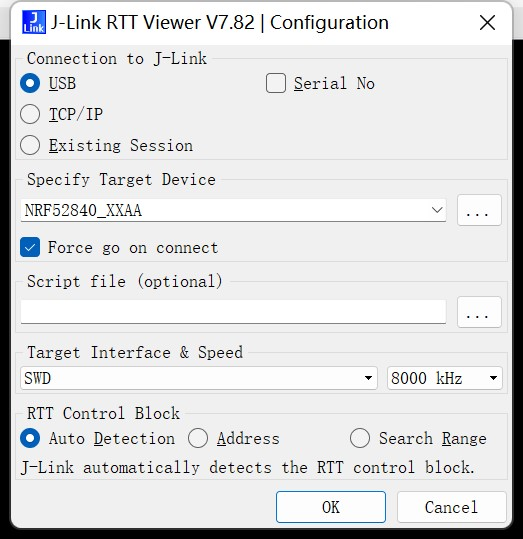
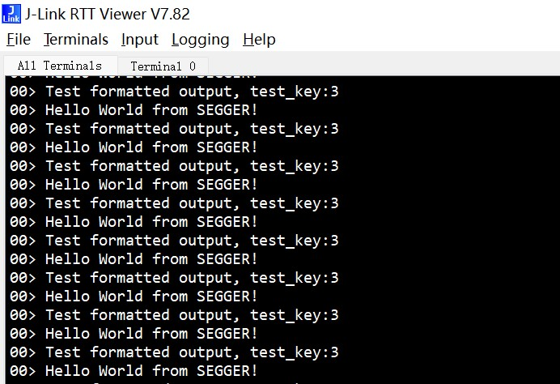
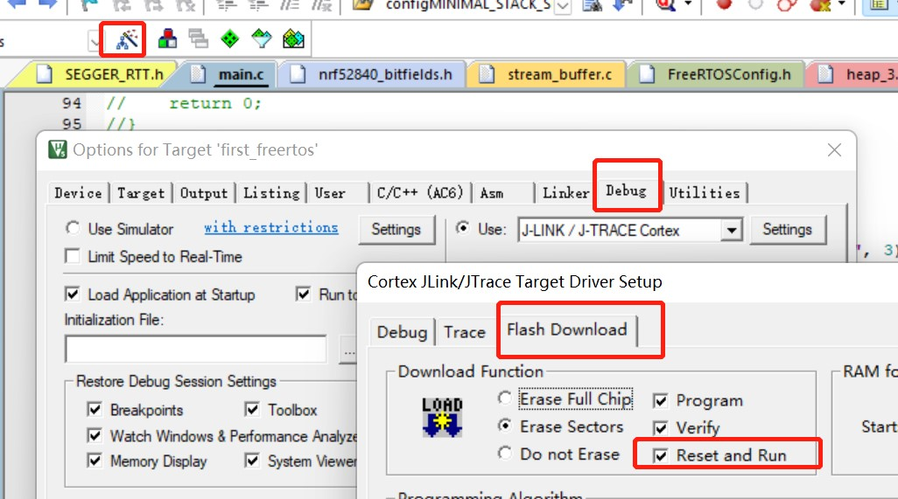
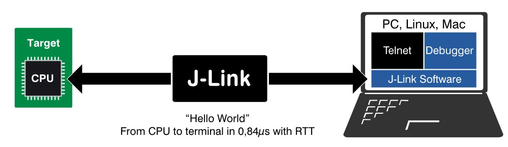
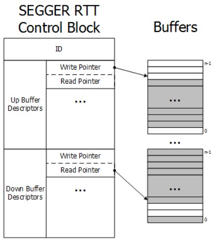
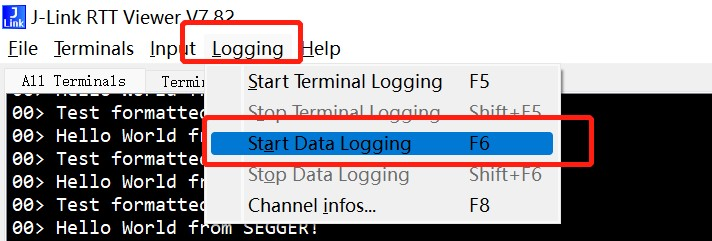
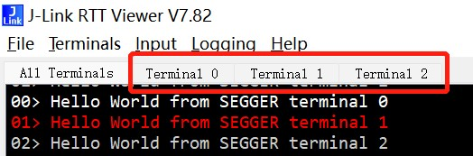

<center>
J-Link RTT 可以更快速、便捷的输出调试信息，并支持调试信息导出到文件中。
</center>

<!--more-->

***

#### 为什么使用J-Link RTT？

开发调试过程中通常需要输出程序运行日志信息，以供排查问题。一般我们使用芯片自带的UART，将调试进行信息输出到PC串口工具进行排查。但如果芯片UART被占用了，则无法再用来作为调试信息输出工具。
J-Link RTT 同样具有输出信息的功能，并且速度更快，同时J-Link RTT也支持 MCU->PC以及PC->MCU双向发送数据。

#### 如何移植到工程中：
首先确定自己现有的工程能编译，烧录到开发板后可以正常运行。在系统的J-Link驱动安装目录xxx\SEGGER\JLink\Samples\RTT\SEGGER_RTT_V782 中，有对应版本的RTT样例代码。
移植到自己的工程中也很简单，在自己的工程中新建一个目录，将SEGGER\JLink\Samples\RTT\SEGGER_RTT_V782\RTT 目录中的几个文件，以及SEGGER\JLink\Samples\RTT\SEGGER_RTT_V782\Config 中的配置文件拷贝到自己的目录中。
- SEGGER_RTT.c
- SEGGER_RTT.h
- SEGGER_RTT_Conf.h
- SEGGER_RTT_printf.c

使用也很简单：引入头文件后，就可以使用输出函数了。

``` c
#include "SEGGER_RTT.h"
int main(void) {
    SEGGER_RTT_Init();
    for(;;) {
        SEGGER_RTT_WriteString(0, "Hello World from SEGGER!\n");
        SEGGER_RTT_printf(0, "Test formatted output, %s:%d\n","test_key", 3);
        your_delay_ms(500);
    }
    return 0;
}
```
如果需要格式化输出字符串，可以使用 `SEGGER_RTT_printf(0, xxxx)`，除了需要在前面加一个通道 id=0，其它写法和标准库的printf一致。编译工程，烧录到开发板上。


#### 如何显示输出的日志信息：
使用Jlink连接开发板和电脑
电脑安装J-Link驱动后，系统中会存在一个`J-Link RTT Viewer`工具，打开工具，有如下配置选项。选择自己的板载目标芯片，其它配置默认即可。



<br/>
确认后，即可在工具界面中看到输出信息：




**备注：**
- 1. 如果没有日志输出，可能是连接丢失了，可以在RTT Viewer工具左上角的File中点击Connect再次弹出配置界面，点击确认后即可连接上。
- 2. 可以在keil工程配置中设置烧录后自动复位重启，避免手动复位后丢失jlink连接。
    

<br/> 

#### RTT(Real Time Transfer)是如何工作的：
J-link直接访问MCU的内存，将其中的数据转发到PC端工具(如RTT Viewer)进行显示。

整体逻辑可以分为如下几步：
- 1：MCU中的代码使用SEGGER_RTT_printf 将日志信息写入一个特定的ram区域。
- 2：J-Link直接访问这段特定内存，读出其中数据
- 3：J-Link将读到的数据发往PC工具。

J-Link如何知道MCU将日志写到内存哪里去了？
在RTT文件SEGGER_RTT.c中定义了一个全局结构体变量：`SEGGER_RTT_CB _SEGGER_RTT`，这个结构体变量即 RTT控制块，它维护了 RTT相关的控制信息。

如MCU->PC 方向发送数据时应该写入的buffer地址。以及PC->MCU方向发送数据时，数据缓存在MCU上的buffer地址。
其逻辑如下图所示：


- Up Buffer即MCU->PC方向的buffer，MCU将日志信息写入这里，J-Link会从这里读取。
- Down Buffer即PC->MCU方向的buffer，PC发的数据会写入这里，MCU可以通过RTT提供的SEGGER_RTT_Read 函数从其中读出数据。
  
Up Buffer和Down Buffer在RTT的中都是实现为循环数组，所以需要维护各自的读写指针。

在`SEGGER_RTT_CB _SEGGER_RTT` 结构体中：
- 成员ID是一个16字节的数组(即上图中的ID)，这个数组的内容会被初始化成“SEGGER RTT”字符串。
- 成员aUp就是 MCU->PC方向的buffer信息，其本身是一个数组，初始化时会默认配置其第0个buffer,即通道0。(所以使用SEGGER_RTT_printf 时，第一个参数要指定0)，buffer的大小在SEGGER_RTT_Conf.h中配置(BUFFER_SIZE_UP)

- 成员aDown就是 PC->方向的buffer信息，其本身是一个数组，初始化时会默认配置其第0个buffer,即通道0。buffer的大小在SEGGER_RTT_Conf.h中配置(BUFFER_SIZE_DOWN)

使用J-Link和MCU连接后，就是通过在内存范围内寻找“SEGGER RTT”这个字符串，从而确定 RTT 控制块的地址。并通过其中的 aUp成员确定MCU写的日志所存放的buffer地址，并从中提取出数据，在PC端的RTT Viewer进行显示。

#### 额外补充：
J-Link RTT Viewer支持 `Channel 0`和`Channel 1`。
`Chaneel 0`在初始化时已经默认配置了。
`Channel 1`如果需要使用需要自己配置其`Up`和`Down`的buffer，例如：
```c
SEGGER_RTT_ConfigUpBuffer(1, "channel 1", up_buffer, 512, SEGGER_RTT_MODE_DEFAULT);
SEGGER_RTT_ConfigDownBuffer(1, "channel 1", down_buffer, 16, SEGGER_RTT_MODE_DEFAULT);
```
使用SEGGER_RTT_printf时指定 `channel 1`即可。
##### 数据导出到文件中：
`channel 1`的数据无法在`rtt viewer`中展示，但是可以将`channel 1`的日志保存在文件中。如下图，点击 `start data logging`后会弹出保存文件命名，设置后`channel 1`输出的数据都会保存在该文件中。
（ **channel 0 的数据也可以保存到文件中，下图中的 start terminal logging就是保存channel 0的输出的数据**）



<br/>

##### channel 0 分不同 terminal 显示：
此外，`Channel 0`还支持分开显示，`channel 0`有16个terminal，通过使用：
```c
SEGGER_RTT_SetTerminal(0);// 让通道0的输出显示在rtt viewer 的terminal 0中
SEGGER_RTT_WriteString(0, "Hello World from SEGGER terminal 0\r\n");

SEGGER_RTT_SetTerminal(1);// 让通道0的输出显示在rtt viewer 的terminal 1中
SEGGER_RTT_WriteString(0, "Hello World from SEGGER terminal 1\r\n");

SEGGER_RTT_SetTerminal(2);// 让通道0的输出显示在rtt viewer 的terminal 2中
SEGGER_RTT_WriteString(0, "Hello World from SEGGER terminal 2\r\n");
```
可以让`channel 0`的输出信息在不同的 `terminal` 中显示。如下图所示，`All Terminals`会显示`chaneel 0`的所有`terminal`的数据，各个`terminal`会显示自己的：



<br/>

**注意** ! `channel 0`的16个`terminal`，只是逻辑上的区分，其物理存储都是用的`channel 0`的那个 `Up buffer`，只是 `rtt viewer`在逻辑上将它们进行了显示区分。从RTT的源码上可以看到：
例如，`SEGGER_RTT_SetTerminal(1)`; 其作用是设置在`terminal 1`进行显示，其内部就是将 `{0xff, ‘1’}` 这两个字节写到`Up buffer`中， J-Link检查到这两个字节后，就会让后续的日志信息显示在`terminal 1`上。


<br/>
<br/>
<br/>
<br/>

参考连接：[https://www.segger.com/products/debug-probes/j-link/technology/about-real-time-transfer](https://www.segger.com/products/debug-probes/j-link/technology/about-real-time-transfer)