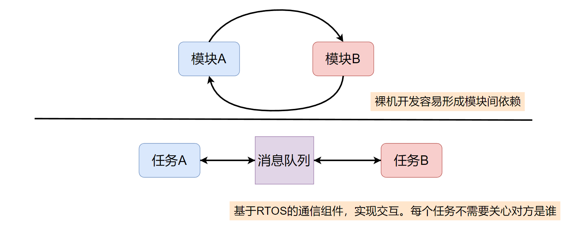
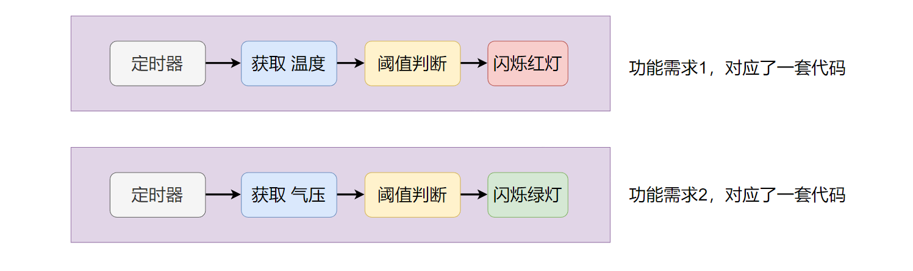
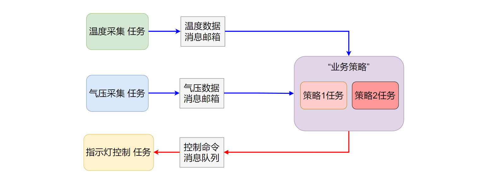

在嵌入式开发中合理的使用操作系统，可以更高效的开发应用，并十分有利于产品的迭代和维护。

<!--more-->

***

#### 1 RTOS的作用
这里我们只讨论支持多任务的嵌入式实时操作系统（RTOS），如何理解多任务呢？以PC上的例子来说更容易理解。例如，你一边播放音乐，同时也在一边编辑文字。不管底层它们到底是真的并行，还是单核下的分时复用（并发），从体验上来看，这两个任务在你的PC上就像是在同时运行，这就是多任务的直观体现。

那么在嵌入式系统上，基于FreeRTOS这类嵌入式多任务操作系统进行应用开发有什么好处呢？ 毕竟，RTOS本身是需要占用存储和CPU资源的。一个重要的理由是：**多任务操作系统，是将任务、通信机制等基础功能/模块实现好了，开发者基于这一套框架，可以将更多的精力集中在业务功能设计上，加速产品的开发，也利于系统的长期迭代和维护。**

以一个环境采集监控系统为例，不使用RTOS的裸机程序，通常就是在Main 函数中实现一个无限循环，周期性（例如通过定时器）地采集诸如温度、湿度、气压、等传传感器的数据，处理数据后，再通过显示设备对数据进行展示（例如通过 LCD）。不同模块的功能代码容易相互交织混合再一起，对于功能简单的小型项目来说这也没太大问题。

但随着产品功能迭代，会逐渐出现各种新增需求。例如，增加一个用户输入功能（用来实时配置采集传感器的参数，或用来修改显示模式）。又例如，在检测到温度高于某个临界值后，闪烁红灯；在检测温度低于某个临界值后，闪烁绿灯。
当这种需求越来越多，代码就可能会逐渐变得混乱不堪，让其他人难以理解。（对于初始开发者来说，自己是很容易理解，但对于后续维护者来说，他没有经历整个需求迭代过程，裸机实现的各种模块、功能地相互交织/影响/依赖，会给维护者带来很大地理解障碍）

基于FreeRTOS这类多任务操作系统，我们可以将上述应用拆分成多个逻辑清晰的子任务。例如，一个温度采集任务，一个湿度采集任务，一个气压采集任务，一个中控任务，一个输入管理任务，一个输出管理任务等。（如果每个传感器的数据采集任务都很简单，可以将它们合并成一个采集任务）每个任务的功能/职责划分清晰。

如果任务间需要通信/交互，可以通过`RTOS`提供的任务间通讯机制（例如**消息队列**）进行通讯，这样可以尽量减少任务（功能）间的耦合，实现任务（功能）间解耦。例如下图：

上图中，裸机环境下直接开发，不同功能模块间直接交互，容易出现较强的耦合/依赖。 
而`RTOS`开发模式下，通过使用“通信组件”，可以很大程度的减少任务间的耦合。例如，当约定好每个任务的数据处理格式后，对于`任务A`来说，它只要从目标“消息队列”中取出数据进行相应解析/处理即可，完全不用关心数据是谁发给它的。发送数据时也是如此，`任务A`按照约定的格式，将数据发往某个目标“消息队列”中即可，至于到底是谁处理这个消息，`任务A`也不用关心。

同时，由于各个功能以独立的任务来实现，在软件的后期迭代中，当需要修改某个功能的代码时（例如修改温度采集相关功能的代码），只需要修改对应任务中的相关逻辑。可以不影响其它功能的逻辑（各个功能都实现成了独立的任务，在代码层面已经相互分离）。

**注意！！！！**：并不是说裸机开发就一定会造成系统混乱、功能相互耦合。对于开发经验丰富，有过一定架构经验的程序员来说，即使在裸机环境下，也能开发出易于维护，模块间耦合度低的系统。 但是，对于经验欠缺的程序员，在裸机开发环境下，还是很容易开发出高度耦合（相互依赖/关联）的多个模块。 
而`RTOS`由于本身就抽象出来了“任务”的概念，并且自带了很多“标准的”基础模块，基于这些现成的基础功能，我们可以**相对更容易地**开发出一个设计良好，逻辑清晰并且任务/功能间耦合度低的系统。

#### 2 如何定义功能间的耦合
个人理解：耦合是功能/模块间，形成了高度的关联或依赖。**一个软件系统中是无法完全去除耦合的，因为模块之间总是需要交互的，我们需要做的是减少模块间耦合（关联/依赖）的程度。**

例如，两个设计良好的模块 **A**，和模块 **B**，它们都将各自的特性很好的封装在了内部，并且对外提供的了统一标准的 API接口。如下图所示：

虽然**A** 和 **B** 相互调用API（具有关联/依赖了），但我们可以说它们之间的耦合程度很低。任意一个模块的内部修改了，只要保持它当前已有的 API 的行为没变，那么，对另一个模块来说它就完全感知不到对方的修改，也不需要关心对方的修改（因为现有API行为和以前一致）。

反之，如果它们的访问方式比较随意，例如直接访问对方模块内部的一些特性（内部特性往往易变），就容易形成模块间高度的耦合，如下图所示：

这种情况下，当我们需要修改模块 **B** 内部的功能时，如果这部分功能刚好模块A也在用，那么我们的修改就会影响到 **A** 的功能。

 

#### 3 如何减少系统中的耦合？个人观点：

**从单个模块（任务）功能的角度来看**，单个模块应该进行良好的封装，屏蔽内部细节。 对外开放一套标准简洁的访问 API，并且在软件生命周期中保持它们行为不变（可以添加新接口，但已有接口应该保持行为不变）。

另一方面，**从系统层面上来看**：“基础机制”的开发因该是独立的，且行为是标准的，避免将“业务策略”直接和“基础机制”进行关联。

例如，前文提到的，“当检测到温度高于某个临界值时，闪烁红灯”，这本身是一种“业务策略”（或者说功能需求）。 
而其中的“检测温度”，“闪烁红灯”则是一种“基础机制”。  

这个“业务策略”（功能）需求如何实现？ 

**方案1**：一种裸机环境下，面向过程的开发方式，将这个功能需求，拆分为多个相应的功能代码段。例如：
1. 实现一个周期定时器功能
2. 实现一个温度传感器数据获取功能
3. 对温度数据进行处理和判断
4. 实现控制红灯进行周期闪烁的功能。
   
最终，将这几个功能代码段的逻辑串起来，就实现了需要的“业务策略”（功能需求）。

那如果后续再来一个类似的需求呢，例如：“当检测到气压低于某个阈值，闪烁绿灯”。再实现一套上面的代码逻辑？那么就会造成下图的状况：

随着需求逐渐增多，长期维护后，最终会存在类似上图的多套逻辑功能类似的代码。

而造成这种情况的本质，是我们将“业务策略”和“基础机制”进行了**直接关连**。 即我们对“基础机制”（传感器数据获取，灯控制）的开发是面向“业务策略”的，而不是独立的开发这些基础机制。
说起来比较抽象，我们直接看另外一种“业务策略”和“基础机制”解耦的实现方式，例如：

**方案2**：
首先独立的定义三个“基础机制”任务，它们与具体的业务策略无关：
- 温度采集 是一个独立的任务（“基础机制”任务），该任务负责周期性采集数据，并放到**温度数据消息邮箱**中。（不需要关心谁会用这个数据）

- 气压采集 是一个独立的任务（“基础机制”任务），该任务负责周期性采集数据，并放到**气压数据消息邮箱**中。（不需要关心谁会用这个数据）
  
- 各种指示灯的状态控制，是一个独立任务（“基础机制任务”），该任务从专用**指示灯命令消息队列**中获取“控制命令”，根据控制命令控制灯的状态。（不关心命令是谁发过来的）
  
而“业务策略”任务，内部实现具体的业务逻辑。例如，从`温度/气压消息邮箱`中获取数据，根据数据做逻辑判断，构建指示灯控制命令发到`指示灯命令消息队列`中。对业务来说，他不关心传感器数据怎么生成的，他能获取到即可。也不关心指示灯状态实际是怎么控制的，他只要发出相应控制命令即可。
  
上述逻辑地整体结构，如下图所示：

如上图所示的结构，任务的职责划分更清晰，且没有相互依赖。

温度/气压采集任务只负责采集数据后，放入目标邮箱即可，后续谁会用？怎么处理？都和它们无关，即它们与下游数据使用方解耦了。

指示灯控制任务只需要从目标消息队列中取出控制命令并执行即可，谁发送的控制命令？为什么控制？它也不需要关心，即它和上游控制来源方解耦了。

而策略任务，对它来说输入数据的来源是抽象的（从专用邮箱中获取到的，不用关心具体的硬件传感器），输出数据（或控制行为）也是抽象的（发送命令到专用消息队列中）。它不用关心，传感器数据是如何采集出来的，也不用关心灯的状态到底是如何控制的，即业务逻辑和具体的底层基础机制解耦了。

方案1 和 方案2 看起来最终的调用逻辑是一样的，都是：获取数据，业务逻辑判断，控制灯的状态。
但两种方案的实现思路，思考逻辑是不同的。

PS：减少系统中不同功能间的耦合度，属于一个工程性问题。工程性问题需要结合具体业务、系统、资源来考虑，并没有一个标准答案，本文只是提供了个人的一种思考方式。

#### 总结

通过 RTOS 提供的任务机制，我们可以方便地将需要实现的应用，进行功能抽象并拆分成多个独立的，职责单一/明确的子任务。再通过 RTOS 提供的基础通信、同步等功能组件，实现将各个子任务进行解耦，最大可能地减少它们之间地耦合程度。
这让我们可以更容易（相对裸机环境）地掌控对中/大型应用地开发，也更利于产品的长期维护和功能迭代。

 
FreeRTOS交流QQ群-663806972
